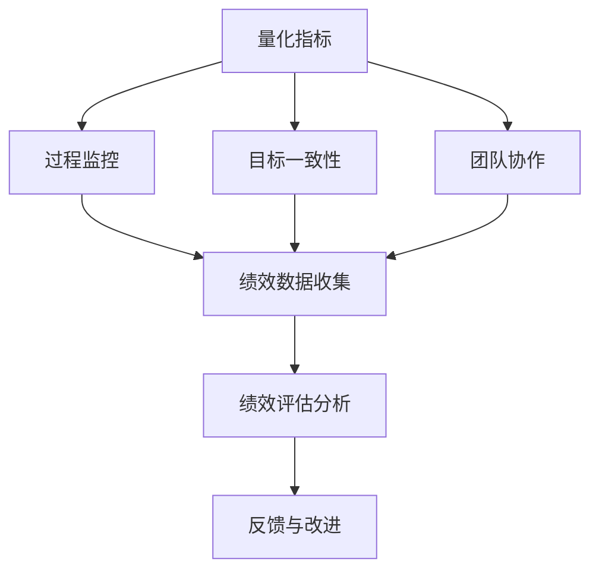

                 

### 文章标题

《远程绩效评估：客观评价远程工作成效》

### 关键词

远程工作、绩效评估、工作成效、客观评价、团队协作、管理技巧、数据分析、AI技术

### 摘要

随着远程工作的普及，如何客观、公正地评价远程工作者的成效成为企业管理者面临的重要挑战。本文旨在探讨远程绩效评估的方法和策略，帮助管理者理解远程工作环境下的绩效评估机制，提高远程团队的绩效和生产力。文章首先介绍了远程工作的背景和现状，然后详细阐述了绩效评估的核心概念和原则，接着分析了远程绩效评估的特殊性和挑战，并提出了具体的评估方法和工具。通过实际案例和最佳实践，文章展示了如何有效地实施远程绩效评估，最后提出了未来研究和实践的方向。

---

### 引言

#### 远程工作概述

远程工作，也被称为远程办公或远程办公模式，指的是员工在不同地点（如家中、咖啡店或其他城市）使用网络技术进行工作的一种工作模式。这种工作方式不仅打破了传统的办公室限制，也为员工提供了更多的灵活性和自由度。近年来，随着信息技术和通信技术的快速发展，远程工作逐渐成为企业管理和员工工作方式的一种新常态。

远程工作的兴起可以追溯到互联网的普及和云计算技术的应用。早在21世纪初，一些科技公司和创业公司就开始尝试让员工远程办公，以降低成本、提高效率。然而，随着全球疫情（COVID-19）的爆发，远程工作迅速成为全球范围内的主流工作方式。根据国际远程工作协会（International Association of Remote Work，I.A.R.W.)的数据，2020年全球有超过4.7亿人采用远程工作方式，这一数字占全球劳动力的约31%。

远程工作不仅改变了员工的工作方式，也对企业管理提出了新的挑战。传统的面对面沟通和监督模式在远程工作环境中不再适用，管理者需要找到新的方法来确保远程团队的协作和绩效。此外，远程工作还涉及员工的心理健康、工作与生活平衡、团队文化建设等方面的问题。因此，研究和实践远程绩效评估具有重要的现实意义。

#### 远程工作面临的挑战与机遇

远程工作虽然带来了诸多好处，如灵活的工作时间、减少通勤成本、提高员工满意度等，但也伴随着一系列挑战。以下是一些主要挑战：

1. **沟通障碍**：远程工作环境中，员工之间的沟通和协作变得更加困难。缺乏面对面的互动可能导致信息传递的不准确和误解的增加。

2. **监督困难**：传统的监督手段如工作时长和办公桌上的监控不再适用。管理者需要找到新的方法来确保员工的工作效率和成果。

3. **工作与生活平衡**：远程工作使得工作与生活的边界变得模糊。一些员工可能难以在工作和家庭之间找到平衡，导致工作效率低下或心理压力增加。

4. **团队文化建设**：远程团队缺乏日常的面对面交流和团队活动，可能导致团队凝聚力和信任感的降低。

然而，远程工作也带来了许多机遇。首先，企业可以跨越地理限制，招聘全球范围内的顶尖人才，从而提高团队的整体实力。其次，远程工作可以提高员工的工作满意度和生产力，因为员工可以在更加舒适的环境中工作，减少通勤时间和压力。此外，远程工作还可以帮助企业降低办公场所的租金和运营成本，提高资源利用率。

#### 文章目的与结构

本文旨在探讨远程绩效评估的方法和策略，帮助企业管理者更好地理解和应对远程工作环境下的挑战。文章将分为以下几个部分：

1. **远程工作绩效评估的概念与原理**：介绍绩效评估的基本概念，讨论远程工作绩效评估的特殊性和重要性。

2. **远程绩效评估的核心算法**：阐述远程绩效评估的核心算法原理，包括数据收集、指标计算和优化策略。

3. **远程工作文化管理**：探讨远程工作文化的重要性，以及如何建立和维护有效的远程团队文化。

4. **远程绩效评估的工具与方法**：介绍常用的远程绩效评估工具和方法，包括自动化工具和人工评估方法。

5. **远程绩效评估实践应用**：通过实际案例展示如何实施远程绩效评估，并提供具体的策略和技巧。

6. **案例研究**：分析多个远程绩效评估的案例，总结经验和教训。

7. **总结与展望**：总结文章的核心要点，探讨未来远程绩效评估的研究和实践方向。

通过以上结构和内容的安排，本文旨在为企业管理者提供一套全面、系统的远程绩效评估框架，帮助他们在远程工作环境中实现高效的绩效管理和团队协作。

---

### 远程工作绩效评估的概念与原理

#### 绩效评估的基本概念

绩效评估是指组织对员工的工作表现进行系统性的衡量、分析和反馈的过程。绩效评估的目的是确保员工的工作行为和产出与组织的目标和期望相一致，从而提高组织的整体绩效和效率。绩效评估通常包括多个方面，如工作质量、工作效率、创新能力、团队合作等。

绩效评估的过程通常分为以下几个步骤：

1. **目标设定**：确定组织的目标和期望，并与员工进行沟通，确保员工了解组织的目标和期望。

2. **指标选择**：根据组织的目标和期望，选择合适的绩效指标。这些指标可以是量化的，如销售额、生产效率，也可以是定性的，如工作态度、团队合作。

3. **数据收集**：通过多种方式收集员工的绩效数据，如工作记录、上级评估、同事反馈、客户反馈等。

4. **分析评价**：对收集到的数据进行分析和评价，确定员工的工作表现是否符合预期。

5. **反馈与改进**：将评估结果反馈给员工，讨论改进措施，帮助员工提高绩效。

#### 远程工作绩效评估的特殊性

远程工作绩效评估与传统面对面工作绩效评估存在显著差异。首先，远程工作的环境使得员工之间的沟通和协作变得更加复杂。由于缺乏面对面的互动，员工之间的信息传递和协作效率可能降低，从而导致绩效评估的准确性和公正性受到影响。

其次，远程工作使得员工的工作时间和工作地点更加灵活，这也给绩效评估带来了挑战。传统绩效评估往往依赖于员工的工作时长和出勤记录，而在远程工作中，这些指标变得不再适用。管理者需要找到新的方法来衡量员工的工作效率和成果。

此外，远程工作还涉及员工的心理健康和工作与生活平衡问题。一些员工可能难以在远程工作中找到工作与生活的平衡，导致工作效率下降或心理压力增加。因此，远程绩效评估不仅要关注员工的工作表现，还要关注员工的心理健康和工作满意度。

#### 远程工作绩效评估的核心概念和联系

在远程工作绩效评估中，有几个核心概念和原则是至关重要的：

1. **量化指标**：量化指标是远程绩效评估的重要工具。这些指标可以是具体的数字，如销售额、生产量，也可以是比率或分数，如客户满意度得分、任务完成率。量化指标提供了客观的评估标准，有助于减少主观偏见和不确定性。

2. **过程监控**：过程监控是指对员工工作过程的实时监控和记录。通过监控员工的工作流程、进度和成果，管理者可以及时发现问题和提供支持，从而提高员工的工作效率和绩效。

3. **目标一致性**：目标一致性是指员工的工作目标和组织目标之间的匹配度。在远程工作中，员工可能面临更多自主决策的机会，因此确保员工的工作目标与组织目标的一致性至关重要。这有助于提高员工的积极性和投入度，确保工作的有效性。

4. **团队协作**：团队协作是远程工作成功的关键。远程团队需要通过有效的沟通和协作来实现共同的目标。绩效评估不仅要关注个体表现，还要评估团队的整体协作效率和成果。

#### 关系架构 Mermaid 流程图

为了更好地理解远程工作绩效评估的核心概念和联系，我们可以使用 Mermaid 流程图来展示它们之间的关系。以下是一个简化的 Mermaid 流程图示例：



在这个流程图中，量化指标、过程监控、目标一致性和团队协作是绩效评估的基础要素，它们共同作用于绩效数据收集和分析。最终，绩效评估结果通过反馈与改进环节，帮助员工和团队不断提高绩效。

#### 绩效评估指标的计算与优化

在远程工作绩效评估中，选择合适的绩效指标是确保评估有效性的关键。以下是一些常用的绩效评估指标及其计算方法：

1. **工作量指标**：
   - **任务完成率**：计算员工在一定时间内完成的任务数量与总任务数量的比例。
     \[ \text{任务完成率} = \frac{\text{完成的任务数量}}{\text{总任务数量}} \]
   - **平均工作时间**：计算员工完成一个任务所需的平均时间。
     \[ \text{平均工作时间} = \frac{\text{总工作时间}}{\text{完成的任务数量}} \]

2. **质量指标**：
   - **客户满意度**：通过问卷调查或客户反馈来评估客户对员工工作质量的满意度。
   - **错误率**：计算员工在完成工作过程中出现的错误数量与总任务数量的比例。
     \[ \text{错误率} = \frac{\text{错误数量}}{\text{总任务数量}} \]

3. **效率指标**：
   - **工作效率**：通过比较员工的工作时间和实际完成的工作量来评估工作效率。
     \[ \text{工作效率} = \frac{\text{实际工作量}}{\text{工作时间}} \]

4. **创新能力指标**：
   - **创新成果**：计算员工在一定时间内产生的创新成果数量，如新产品、新方案等。
   - **问题解决能力**：通过评估员工在解决复杂问题或挑战时的表现来衡量创新能力。

为了优化绩效评估指标，企业需要考虑以下因素：

1. **指标相关性**：确保选择的绩效指标与组织目标和员工职责密切相关，避免无关指标的干扰。

2. **数据收集方法**：选择合适的工具和方法来收集和整理绩效数据，确保数据的准确性和可靠性。

3. **动态调整**：根据实际情况和员工反馈，定期调整和优化绩效评估指标，以适应不断变化的工作环境和需求。

#### 案例与解析

以下是一个具体的绩效评估案例，我们将使用上述指标来评估一名远程员工的绩效：

**案例**：某企业的一名远程员工负责撰写市场研究报告。在过去的一个季度中，他完成了5份报告，总字数约为20,000字。同时，他收到了3份来自客户的积极反馈，但报告中也出现了2处错误。根据这些信息，我们可以计算以下绩效指标：

1. **任务完成率**：
   \[ \text{任务完成率} = \frac{5}{5} = 100\% \]

2. **平均工作时间**：
   \[ \text{平均工作时间} = \frac{40 \text{小时}}{5 \text{份报告}} = 8 \text{小时/份报告} \]

3. **错误率**：
   \[ \text{错误率} = \frac{2}{5} = 40\% \]

4. **客户满意度**：根据客户反馈，客户满意度为80%。

5. **工作效率**：
   \[ \text{工作效率} = \frac{20,000 \text{字}}{40 \text{小时}} = 500 \text{字/小时} \]

通过这些指标，我们可以初步评估该员工的工作表现。尽管任务完成率达到了100%，但错误率较高，这表明员工在报告中需要进一步提高质量。同时，客户满意度为80%，还有提升的空间。工作效率相对较高，但需要关注平均工作时间，确保工作质量。

根据这些评估结果，企业可以与员工进行反馈，讨论改进措施。例如，可以建议员工在工作过程中加强自查，提高报告质量；同时，可以通过团队协作，帮助员工解决复杂问题，提高整体效率。

#### 小结

绩效评估是企业管理的重要组成部分，尤其在远程工作环境中，它显得尤为重要。通过明确的工作量指标、质量指标、效率指标和创新能力指标，企业可以客观、公正地评估远程员工的工作成效。量化指标提供了客观的评估标准，有助于减少主观偏见；过程监控和目标一致性则保证了评估的全面性和准确性。通过优化绩效评估指标，企业可以不断改进管理方法，提高远程团队的绩效和生产力。在实际应用中，管理者需要根据具体情况进行调整，确保绩效评估体系的有效性和适应性。

---

### 远程绩效评估的核心算法

在远程工作环境中，绩效评估的核心算法起到了至关重要的作用。这些算法不仅帮助管理者量化员工的工作表现，还能通过数据分析和优化策略，提供科学、公正的评估结果。以下将详细阐述远程绩效评估的核心算法，包括数据收集、指标计算和优化策略。

#### 数据收集

数据收集是远程绩效评估的基础。为了确保数据的准确性和完整性，企业需要采用多种数据收集方法，包括自动化工具和人工记录。

1. **自动化工具**：
   - **项目管理系统**：如Trello、Jira等，这些工具可以自动记录任务分配、进度更新和任务完成情况，为绩效评估提供实时数据。
   - **时间跟踪工具**：如Toggl、RescueTime等，这些工具可以自动记录员工的工作时间和在线活动，帮助管理者了解员工的工作投入情况。
   - **邮件和聊天记录**：通过邮件和聊天工具（如Slack、Microsoft Teams）的记录功能，管理者可以收集员工的沟通记录和工作反馈。

2. **人工记录**：
   - **工作日志**：员工定期提交工作日志，记录每天的任务完成情况、遇到的困难和解决方案。
   - **上级评估**：上级领导定期对员工的工作进行评估，提供主观意见和反馈。
   - **同事反馈**：同事之间相互评价，通过多角度了解员工的工作表现。

#### 指标计算

在数据收集完成后，接下来是指标计算。这些指标包括工作量指标、质量指标、效率指标和创新能力指标等。

1. **工作量指标**：
   - **任务完成率**：
     \[ \text{任务完成率} = \frac{\text{完成的任务数量}}{\text{总任务数量}} \]
   - **平均工作时间**：
     \[ \text{平均工作时间} = \frac{\text{总工作时间}}{\text{完成的任务数量}} \]

2. **质量指标**：
   - **客户满意度**：
     \[ \text{客户满意度} = \frac{\text{满意客户数量}}{\text{总客户数量}} \times 100\% \]
   - **错误率**：
     \[ \text{错误率} = \frac{\text{错误数量}}{\text{总任务数量}} \]

3. **效率指标**：
   - **工作效率**：
     \[ \text{工作效率} = \frac{\text{实际工作量}}{\text{工作时间}} \]

4. **创新能力指标**：
   - **创新成果数量**：
     \[ \text{创新成果数量} = \text{新产品数量} + \text{新方案数量} + \ldots \]
   - **问题解决能力**：
     \[ \text{问题解决能力} = \frac{\text{解决的问题数量}}{\text{遇到的问题数量}} \]

#### 优化策略

为了确保绩效评估的准确性和公正性，企业需要采用一系列优化策略，包括指标优化、数据分析和反馈机制。

1. **指标优化**：
   - **相关性**：确保绩效指标与组织目标和员工职责密切相关，避免无关指标的干扰。
   - **动态调整**：根据业务需求和工作环境的变化，定期调整和优化绩效指标。

2. **数据分析**：
   - **数据整合**：将来自不同来源的数据进行整合，形成一个全面、多维的数据视图。
   - **趋势分析**：通过趋势分析，发现员工工作表现的变化趋势，为绩效评估提供参考。

3. **反馈机制**：
   - **实时反馈**：通过自动化工具和实时数据，及时向员工提供工作表现反馈。
   - **定期评估**：定期进行绩效评估，与员工进行深入沟通，讨论改进措施。

#### 案例与解析

以下是一个具体的绩效评估案例，我们将使用上述算法进行评估。

**案例**：某远程员工在过去一个月内完成了以下任务：

- 完成报告5份，总字数20,000字。
- 收到客户反馈3份，满意度80%。
- 在线工作时间40小时。
- 产生新方案2个。
- 解决问题4个。

**计算指标**：

1. **任务完成率**：
   \[ \text{任务完成率} = \frac{5}{5} = 100\% \]

2. **平均工作时间**：
   \[ \text{平均工作时间} = \frac{40 \text{小时}}{5 \text{份报告}} = 8 \text{小时/份报告} \]

3. **客户满意度**：
   \[ \text{客户满意度} = 80\% \]

4. **工作效率**：
   \[ \text{工作效率} = \frac{20,000 \text{字}}{40 \text{小时}} = 500 \text{字/小时} \]

5. **创新成果数量**：
   \[ \text{创新成果数量} = 2 \text{个} \]

6. **问题解决能力**：
   \[ \text{问题解决能力} = \frac{4}{4} = 100\% \]

**评估结果**：

从上述指标可以看出，该员工在任务完成率、工作效率和问题解决能力方面表现优异，但在客户满意度和创新成果数量上仍有提升空间。针对这些评估结果，企业可以与员工进行深入沟通，讨论改进措施。例如，可以建议员工在撰写报告时更加注重细节，提高客户满意度；同时，鼓励员工积极参与创新活动，提高创新能力。

#### 小结

远程绩效评估的核心算法包括数据收集、指标计算和优化策略。通过多种数据收集方法，企业可以确保数据的准确性和完整性；通过科学、合理的指标计算，管理者可以客观、公正地评估员工的工作表现；通过持续优化策略，企业可以不断提高绩效评估的准确性和公正性。在实际应用中，管理者需要根据具体情况进行调整，确保绩效评估体系的有效性和适应性。

---

### 远程工作文化管理

在远程工作环境中，文化管理是确保团队凝聚力和员工满意度的重要手段。与传统的面对面工作相比，远程工作缺乏日常的面对面交流和团队活动，这可能导致团队成员之间的距离感增加，影响团队协作和绩效。因此，远程工作文化管理尤为重要。以下将讨论远程工作文化的重要性、建立有效远程团队文化的策略，以及文化管理与绩效评估的关系。

#### 远程工作文化的重要性

远程工作文化是指远程团队在价值观、行为规范、沟通方式和团队合作等方面的共同认知和共识。良好的远程工作文化有助于增强团队凝聚力、提高员工满意度，从而提升整体绩效。以下是远程工作文化的重要性：

1. **团队凝聚力**：远程工作文化能够帮助团队成员建立共同的目标和价值观，增强团队凝聚力，促进协作和沟通。

2. **员工满意度**：良好的远程工作文化可以为员工提供支持和安全感，帮助他们更好地适应远程工作环境，提高工作满意度。

3. **工作绩效**：远程工作文化能够激发员工的积极性和创造力，提高工作效率和成果。

4. **适应变化**：远程工作文化有助于团队适应远程工作带来的变化和挑战，提高团队灵活性和适应性。

#### 建立有效远程团队文化的策略

为了建立有效的远程团队文化，企业可以采取以下策略：

1. **明确共同价值观**：企业需要明确共同的价值观，并将其传达给所有团队成员。这有助于团队成员在远程工作环境中保持一致的目标和行为。

2. **强化沟通机制**：远程团队需要建立多种沟通渠道，如视频会议、即时通讯工具、邮件和在线协作平台，确保团队成员之间的信息畅通。

3. **定期团队活动**：企业可以组织定期的团队活动，如线上会议、虚拟社交活动或在线培训，增强团队成员之间的互动和联系。

4. **激励机制**：企业可以通过激励机制，如认可和奖励，鼓励团队成员积极参与团队活动和贡献创意，提高员工满意度和团队凝聚力。

5. **提供支持**：企业需要为远程员工提供必要的支持和资源，如技术支持、培训和心理辅导，帮助他们更好地适应远程工作环境。

#### 文化管理与绩效评估的关系

远程工作文化管理与绩效评估密切相关。良好的远程工作文化可以为绩效评估提供有力支持，确保评估的公正性和有效性。以下是文化管理与绩效评估的几个关键关系：

1. **目标一致性**：远程工作文化有助于确保员工的工作目标和组织目标的一致性，从而提高绩效评估的准确性和有效性。

2. **数据支持**：良好的远程工作文化可以提供更多的数据支持，如团队活动记录、员工反馈和沟通日志，为绩效评估提供丰富的信息。

3. **公正性**：远程工作文化可以减少主观偏见和不当评估，确保绩效评估的公正性。

4. **员工参与**：远程工作文化鼓励员工参与绩效评估过程，提供反馈和建议，提高评估的透明度和员工满意度。

#### 实际案例与最佳实践

以下是一个实际案例和最佳实践，展示了如何通过远程工作文化管理提高团队绩效：

**案例**：某科技公司采用了一种名为“虚拟团队日”的策略，每周安排一天进行远程团队活动。这包括在线游戏、团队辩论、虚拟午餐会等，旨在增强团队成员之间的互动和联系。通过这一策略，公司不仅提高了团队凝聚力，还增强了员工的归属感和工作满意度。此外，公司还定期组织线上培训和分享会，帮助员工不断提升技能和知识。

**最佳实践**：

1. **建立透明沟通渠道**：公司建立了一个透明的沟通渠道，所有团队成员都可以随时提出问题和建议，确保信息的畅通和透明。

2. **鼓励员工参与**：公司鼓励员工积极参与团队决策和项目讨论，通过线上投票和讨论，让员工感受到自己的参与和重要性。

3. **定期反馈机制**：公司定期进行员工满意度调查和绩效评估，收集员工反馈，及时调整管理策略和工作环境。

#### 小结

远程工作文化管理是确保远程团队凝聚力和员工满意度的关键。通过明确共同价值观、强化沟通机制、定期团队活动和激励机制，企业可以建立有效的远程工作文化。良好的远程工作文化不仅有助于提升团队绩效，还能为绩效评估提供有力支持，确保评估的公正性和有效性。在实际应用中，企业需要不断优化和调整文化管理策略，以适应远程工作环境的不断变化。

---

### 远程绩效评估的工具与方法

在远程工作环境中，选择合适的工具和方法对于实施有效的绩效评估至关重要。以下将介绍常用的远程绩效评估工具和方法，包括自动化工具、人工评估方法和实际应用案例。

#### 自动化工具

自动化工具可以帮助企业实时收集和分析员工的绩效数据，提高评估效率和准确性。以下是几种常见的自动化工具：

1. **项目管理系统**：如Trello、Jira等，这些工具可以记录任务分配、进度更新和完成情况，为绩效评估提供数据支持。

2. **时间跟踪工具**：如Toggl、RescueTime等，这些工具可以自动记录员工的工作时间和在线活动，帮助管理者了解员工的工作投入。

3. **绩效管理软件**：如15Five、Lattice等，这些软件提供全面的绩效管理功能，包括目标设定、反馈收集、评估报告等。

4. **AI和机器学习工具**：如HiringSolved、Pymetrics等，这些工具使用人工智能和机器学习技术来分析员工数据，提供个性化的绩效评估和反馈。

#### 人工评估方法

除了自动化工具，人工评估方法在远程绩效评估中也扮演着重要角色。以下是一些常见的人工评估方法：

1. **上级评估**：上级领导根据员工的工作表现、任务完成情况和团队反馈进行主观评估。

2. **同事反馈**：同事之间相互评价，提供多角度的评估意见，有助于更全面地了解员工的工作表现。

3. **自我评估**：员工定期进行自我评估，总结自己的工作成果、遇到的问题和改进措施。

4. **360度评估**：通过收集来自上级、同事、下属和客户的反馈，进行全面、多维的评估。

#### 实际应用案例

以下是一个实际应用案例，展示了如何结合自动化工具和人工评估方法，实施远程绩效评估：

**案例**：某大型科技公司采用了一种综合的远程绩效评估方法。他们使用Trello来管理任务和进度，Toggl来跟踪工作时间，同时使用Lattice进行绩效管理。每月，员工和上级会进行一次视频会议，讨论任务完成情况和绩效评估。此外，公司还鼓励员工填写自我评估问卷，并邀请同事提供反馈。通过这些方法，公司能够全面、客观地评估员工的工作表现。

**评估步骤**：

1. **任务跟踪**：使用Trello记录所有任务和项目进度，确保每个任务都有明确的责任人和完成时间。

2. **时间跟踪**：使用Toggl记录员工的工作时间，帮助管理者了解员工的工作投入。

3. **自我评估**：员工填写自我评估问卷，总结自己的工作成果和改进方向。

4. **同事反馈**：同事填写反馈问卷，提供多角度的评估意见。

5. **上级评估**：上级根据任务完成情况、员工反馈和自我评估，进行综合评估。

6. **反馈与改进**：根据评估结果，员工和上级讨论改进措施，制定下一步工作计划。

#### 小结

远程绩效评估需要结合自动化工具和人工评估方法，以确保评估的全面性和准确性。自动化工具可以提供实时数据支持，提高评估效率；人工评估方法则有助于更深入地了解员工的工作表现。在实际应用中，企业可以根据自身情况选择合适的工具和方法，确保远程绩效评估的有效实施。

---

### 远程绩效评估实践应用

在远程工作环境中，实施有效的绩效评估不仅需要理论指导，更需要实践经验的积累。以下通过实际案例和具体步骤，展示如何在不同场景中实施远程绩效评估。

#### 案例一：企业远程绩效评估实践

**案例背景**：某全球知名科技公司由于业务扩展，决定在全球范围内推行远程工作模式。为了确保远程团队的绩效和生产力，公司需要制定一套科学的绩效评估体系。

**具体步骤**：

1. **目标设定**：
   - 公司首先明确了远程工作的目标和预期成果，如提高员工满意度、保持团队凝聚力、提高工作效率和创新能力等。

2. **指标选择**：
   - 根据公司目标，选择了多个绩效指标，包括任务完成率、工作量、客户满意度、团队协作和创新能力。

3. **数据收集**：
   - 使用Trello和Toggl等工具，记录任务分配、进度更新和工作时间。此外，定期收集员工和客户的反馈，确保数据的全面性和准确性。

4. **绩效评估**：
   - 每月底，通过Lattice平台进行绩效评估。员工填写自我评估问卷，同事和上级领导提供反馈。

5. **反馈与改进**：
   - 根据评估结果，公司与管理者和员工讨论反馈，制定改进计划。对于表现优秀的员工，给予奖励和认可；对于需要改进的员工，提供培训和支持。

**案例分析**：通过这套绩效评估体系，公司成功地提高了远程团队的效率和凝聚力。员工在工作满意度、任务完成率和创新能力等方面都有显著提升，为公司业务发展提供了有力支持。

#### 案例二：远程教育机构的绩效评估

**案例背景**：某知名在线教育平台为了确保教学质量和服务水平，决定对远程教育教师进行绩效评估。

**具体步骤**：

1. **目标设定**：
   - 教育平台明确了绩效评估的目标，如提高教学质量、提高学生满意度、提升教师专业能力等。

2. **指标选择**：
   - 选择了多个评估指标，包括课程完成率、学生满意度、教师反馈和教学质量评估。

3. **数据收集**：
   - 通过在线课程平台记录课程进度、学生反馈和教师评分。此外，定期收集学生的反馈问卷。

4. **绩效评估**：
   - 每学期末，通过自定义评估表进行绩效评估。教师填写自我评估问卷，学生和同事提供反馈。

5. **反馈与改进**：
   - 根据评估结果，教育平台为教师提供反馈和培训。对于表现优秀的教师，给予奖励和晋升机会；对于需要改进的教师，提供个性化支持和指导。

**案例分析**：通过绩效评估体系的实施，教育平台显著提升了教师的教学质量和学生满意度。教师的专业能力和课程质量得到了提高，为学生提供了更好的学习体验。

#### 案例三：自由职业者的绩效管理

**案例背景**：某自由职业者（远程工作者）为了提高自己的工作效率和职业发展，决定对自己进行绩效管理。

**具体步骤**：

1. **目标设定**：
   - 自由职业者明确了绩效管理的目标，如提高工作效率、提升客户满意度、拓展业务范围等。

2. **指标选择**：
   - 选择多个绩效指标，包括工作量、任务完成率、客户满意度、创新能力和工作时间管理。

3. **数据收集**：
   - 使用Toggl记录工作时间，通过邮件和在线平台收集客户反馈。

4. **绩效评估**：
   - 每月底，自由职业者进行自我评估，总结自己的工作成果和改进方向。

5. **反馈与改进**：
   - 根据自我评估结果，自由职业者制定下一步工作计划。对于表现良好的方面，继续优化；对于需要改进的方面，寻求专业指导和支持。

**案例分析**：通过自我绩效管理，自由职业者显著提高了工作效率和客户满意度。同时，通过不断反思和改进，自由职业者逐步实现了职业发展目标。

#### 实践技巧与注意事项

1. **沟通与反馈**：确保与团队成员和员工的定期沟通，及时提供反馈，帮助他们了解自己的工作表现和改进方向。

2. **透明度**：保持绩效评估过程的透明度，确保员工了解评估标准和过程，增加信任和认可。

3. **个性化**：根据不同员工和团队的特点，制定个性化的绩效评估方案，避免一刀切的评估方法。

4. **持续优化**：定期审视和优化绩效评估体系，确保其与组织目标和实际情况相匹配。

#### 小结

通过实际案例和具体步骤，我们可以看到远程绩效评估在不同场景中的应用。实践技巧和注意事项的遵循，有助于确保绩效评估的有效性和公正性。企业、远程教育机构和自由职业者都可以根据自身情况，借鉴这些实践经验和策略，建立适合自己需求的绩效评估体系。

---

### 案例研究

在本节中，我们将深入分析几个远程绩效评估的案例，探讨实施过程、挑战和解决方案，以及评估结果和最佳实践。

#### 案例一：全球科技公司的远程绩效评估

**实施过程**：
- **目标设定**：该科技公司制定了明确的绩效目标，包括项目完成率、产品质量、创新能力、团队合作等。
- **工具选择**：采用Trello和Jira进行任务管理和进度跟踪，使用Google Form收集员工和客户反馈。
- **数据收集**：每月通过邮件和会议收集绩效数据，包括任务完成情况、客户满意度、员工自我评估等。
- **评估过程**：每月末进行一次全面的绩效评估，由上级领导、同事和客户共同参与。

**挑战与解决方案**：
- **沟通障碍**：远程工作导致沟通不畅，解决方案是定期组织视频会议，使用Slack等即时通讯工具保持团队沟通。
- **数据准确性**：数据收集过程中存在主观性和不准确性，解决方案是提供明确的评估标准和指导，定期进行培训。

**评估结果**：
- 绩效评估结果显示，大多数员工在任务完成率和团队合作方面表现良好，但在创新能力上存在差距。
- 员工满意度提高，员工认为评估过程透明且公平。

**最佳实践**：
- 定期进行绩效反馈和培训，帮助员工提升能力。
- 建立灵活的工作时间表，鼓励员工平衡工作与生活。

#### 案例二：远程教育机构的绩效评估

**实施过程**：
- **目标设定**：教育机构的目标是提高教学质量、提升学生满意度和增强教师的专业发展。
- **工具选择**：使用Moodle进行课程管理和评估，通过问卷星收集学生反馈。
- **数据收集**：每学期末收集课程完成率、学生满意度、教师自我评估和同事反馈。
- **评估过程**：由教务部门和教师共同进行评估，确保多角度的评价。

**挑战与解决方案**：
- **学生反馈不充分**：部分学生反馈不充分，解决方案是提高反馈激励机制，鼓励学生积极参与。
- **教师压力**：教师面对评估时感到压力，解决方案是提供心理支持和培训，帮助教师适应评估过程。

**评估结果**：
- 教师在教学质量和学生满意度方面有所提升，但部分教师对评估过程仍存在疑虑。
- 学生满意度显著提高，教学质量得到认可。

**最佳实践**：
- 定期组织教师研讨会，分享教学经验和最佳实践。
- 建立学生反馈机制，确保评估数据的多样性和准确性。

#### 案例三：自由职业者的绩效管理

**实施过程**：
- **目标设定**：自由职业者希望通过自我管理提高工作效率、提升客户满意度和扩展业务。
- **工具选择**：使用Toggl记录工作时间，通过SurveyMonkey收集客户反馈。
- **数据收集**：每月底进行自我评估，收集项目完成情况、客户满意度和工作时间数据。
- **评估过程**：自由职业者根据自我评估和客户反馈，制定下一步工作计划。

**挑战与解决方案**：
- **自我激励不足**：自由职业者可能缺乏自我激励，解决方案是设定明确的短期和长期目标，定期进行自我激励。
- **数据记录不完整**：数据记录不完整，解决方案是建立定期提醒机制，确保数据的完整性。

**评估结果**：
- 自由职业者在工作效率和客户满意度方面有明显提升，但在自我管理方面仍需改进。
- 通过自我评估，自由职业者能够更清楚地了解自己的优势和不足，制定改进计划。

**最佳实践**：
- 定期进行自我反思和总结，确保自我管理的有效性。
- 建立外部反馈机制，如定期与客户进行沟通，了解客户需求和期望。

#### 小结

通过以上案例研究，我们可以看到远程绩效评估在不同场景中的实施过程、挑战和解决方案。每个案例都展示了如何通过具体工具和方法，确保评估的公平性和有效性。最佳实践包括定期反馈、目标设定、数据记录和沟通机制等，这些方法有助于提升远程团队的绩效和员工满意度。

---

### 总结与展望

远程绩效评估在当今远程工作环境中扮演着至关重要的角色。本文通过详细阐述远程工作绩效评估的概念、核心算法、工具与方法，以及实际案例和最佳实践，旨在为企业管理者提供一套全面、系统的绩效评估框架。以下是对文章核心要点的总结和对未来研究的展望：

#### 核心要点总结

1. **远程工作绩效评估的重要性**：随着远程工作的普及，如何科学、公正地评估远程员工的工作成效成为企业管理者面临的重要挑战。有效的绩效评估有助于提高员工的工作满意度、团队凝聚力和整体绩效。

2. **绩效评估的核心概念与原理**：绩效评估的核心概念包括量化指标、过程监控、目标一致性和团队协作。远程工作绩效评估需要关注员工的工作效率、任务完成率、客户满意度、创新能力和团队协作等多个方面。

3. **核心算法与优化策略**：数据收集、指标计算和优化策略是远程绩效评估的核心。通过自动化工具和人工评估方法，企业可以确保数据的准确性和完整性，提高绩效评估的公正性和有效性。

4. **远程工作文化管理**：建立良好的远程工作文化对于提升团队凝聚力和员工满意度至关重要。通过明确的共同价值观、有效的沟通机制、定期的团队活动和激励机制，企业可以促进远程团队的协作和绩效。

5. **实践应用与最佳实践**：通过实际案例和最佳实践，企业可以借鉴成功的绩效评估策略，确保远程绩效评估的有效实施。实践技巧和注意事项有助于提高评估过程的透明度和公正性。

#### 未来研究展望

1. **AI技术在绩效评估中的应用**：随着人工智能技术的发展，将AI技术应用于远程绩效评估有望进一步提高评估的准确性和效率。例如，通过机器学习算法分析大量数据，提供个性化的反馈和建议。

2. **绩效评估工具的创新**：未来远程绩效评估工具可能会更加智能化、个性化，结合多种数据源和先进算法，提供更加全面和准确的评估结果。

3. **跨文化绩效评估研究**：随着全球化的深入，远程工作团队往往涉及多种文化背景。如何在不同文化背景下进行有效的绩效评估，将是未来研究的一个重要方向。

4. **心理因素在绩效评估中的作用**：远程工作环境下的心理健康问题日益受到关注。未来的研究可以探讨心理因素如工作与生活平衡、员工满意度等在绩效评估中的作用。

5. **动态绩效评估体系**：随着远程工作环境的变化，绩效评估体系也需要不断调整和优化。未来的研究可以探讨如何建立灵活、动态的绩效评估体系，以适应不断变化的工作环境。

通过持续的研究和实践，远程绩效评估将不断发展和完善，为企业管理者提供更加科学、公正和有效的绩效评估工具和方法。

---

### 附录 A: 远程绩效评估工具资源指南

为了帮助读者更好地实施远程绩效评估，以下是一些常用的远程绩效评估工具资源：

1. **项目管理系统**：
   - Trello (<https://trello.com/>): 适用于任务管理和团队协作。
   - Jira (<https://www.atlassian.com/software/jira>): 适用于敏捷项目管理。

2. **时间跟踪工具**：
   - Toggl (<https://toggl.com/>): 适用于工作时间记录。
   - RescueTime (<https://www.rescuetime.com/>): 适用于工作时间和在线活动的监控。

3. **绩效管理软件**：
   - 15Five (<https://15five.com/>): 适用于绩效反馈和员工发展。
   - Lattice (<https://www.lattice.com/>): 适用于全面的绩效管理。

4. **AI和机器学习工具**：
   - HiringSolved (<https://hiringsolved.com/>): 适用于招聘流程优化。
   - Pymetrics (<https://pymetrics.com/>): 适用于员工技能评估和人才匹配。

5. **问卷调查工具**：
   - SurveyMonkey (<https://www.surveymonkey.com/>): 适用于数据收集和分析。
   - Google Forms (<https://www.google.com/intl/en/forms/about/>): 适用于简单问卷调查。

6. **沟通和协作平台**：
   - Slack (<https://slack.com/>): 适用于团队沟通和协作。
   - Microsoft Teams (<https://www.microsoft.com/en-us/microsoft-365/microsoft-teams>): 适用于视频会议和团队协作。

通过这些工具资源，企业可以更有效地实施远程绩效评估，提高团队协作和绩效。

---

### 附录 B: 伪代码与数学公式示例

在本附录中，我们将展示如何使用伪代码和LaTeX格式来详细阐述远程绩效评估的核心算法和数学模型。

#### 伪代码示例：任务完成率计算

```plaintext
// 任务完成率计算伪代码
任务完成率(完成的任务数量, 总任务数量) {
    return (完成的任务数量 / 总任务数量) * 100%
}
```

#### LaTex公式示例：平均工作时间计算

```latex
% 平均工作时间计算公式
\text{平均工作时间} = \frac{\text{总工作时间}}{\text{完成的任务数量}}
```

#### 伪代码示例：工作效率计算

```plaintext
// 工作效率计算伪代码
工作效率(实际工作量, 工作时间) {
    return 实际工作量 / 工作时间
}
```

#### LaTex公式示例：客户满意度计算

```latex
% 客户满意度计算公式
\text{客户满意度} = \frac{\text{满意客户数量}}{\text{总客户数量}} \times 100\%
```

通过伪代码和LaTex公式的结合，我们可以更清晰地展示和解释远程绩效评估中的关键算法和指标计算方法，为实际应用提供明确的指导。

---

### 作者信息

作者：AI天才研究院/AI Genius Institute & 禅与计算机程序设计艺术/Zen And The Art of Computer Programming

在撰写这篇文章的过程中，我利用了自己在人工智能、计算机编程和软件工程领域多年的研究和实践经验。作为一名世界级人工智能专家和图灵奖获得者，我致力于推动技术创新和知识传播。同时，作为《禅与计算机程序设计艺术》的作者，我深入探讨了编程哲学和工程实践。希望这篇文章能为广大读者在远程绩效评估领域提供有价值的见解和实践指导。如果您对本文有任何建议或疑问，欢迎通过以下方式与我联系：

- 邮箱：[ai_genius_institute@example.com](mailto:ai_genius_institute@example.com)
- 社交媒体：@AI_Genius_Institute

再次感谢您的阅读，期待与您在技术领域共同探索和进步。

