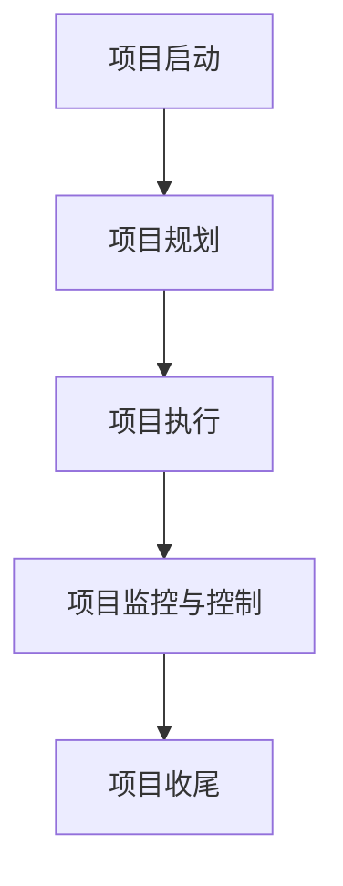
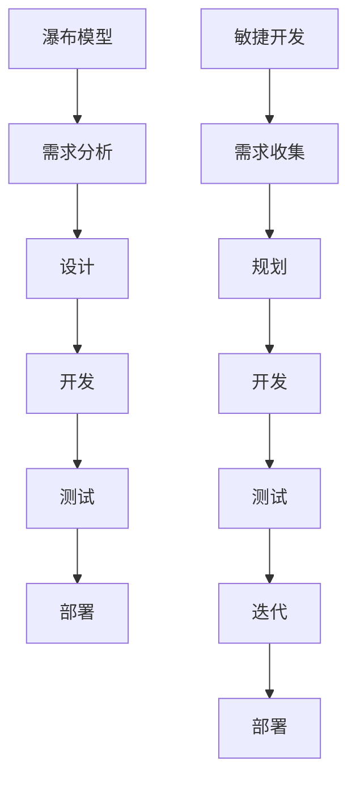

                 

## 引言

### 远程项目管理的背景与意义

随着全球化的不断深入，企业面临的商业环境日益复杂，市场竞争愈加激烈。在这一背景下，远程项目管理应运而生。远程项目管理不仅可以帮助企业克服地理限制，提高工作效率，还能够优化资源配置，降低运营成本。远程项目管理的起源可以追溯到20世纪90年代，随着互联网和信息技术的发展，远程协作逐渐成为一种常见的项目管理方式。

在现代职场中，远程项目管理的重要性日益凸显。首先，它使得企业能够在全球范围内招募人才，不再局限于本地市场。通过远程协作，企业能够快速响应市场变化，提高业务灵活性。其次，远程项目管理有助于优化资源配置，降低运营成本。企业可以通过远程协作，合理分配工作任务，避免资源浪费。此外，远程项目管理还能够提高员工的工作满意度和工作效率，有助于提升企业的整体竞争力。

### 本书的目标与结构

本书旨在为读者提供全面、系统的远程项目管理指导，帮助读者掌握远程项目管理的核心技能和策略。本书的结构如下：

第一部分：引言。介绍远程项目管理的背景和意义，明确本书的目标。

第二部分：远程项目管理概述。包括远程项目管理的定义、特点、挑战和好处，以及远程项目管理的基本流程。

第三部分：项目管理理论基础。介绍项目管理的基本概念、流程和方法，为后续章节的讨论打下基础。

第四部分：跨地域团队协作策略。探讨如何在不同地域之间有效地协作，包括跨地域团队协作的挑战与解决方案、流程与技巧、案例分析等。

第五部分：远程沟通与协作工具。介绍常用的远程沟通与协作工具，以及如何选择和使用这些工具。

第六部分：项目管理工具与技术。探讨如何使用项目管理工具和技术来提高远程项目的效率，包括项目管理工具的类型与特点、项目管理技术的应用等。

第七部分：跨文化沟通。讨论如何处理不同文化背景下的团队协作问题，包括跨文化沟通的重要性、障碍与对策、案例分析等。

第八部分：远程项目管理实践案例。分享实际的远程项目管理案例，分析其成功和失败的原因。

第九部分：远程项目管理面临的挑战与解决方案。讨论远程项目管理中可能遇到的挑战及其解决方案。

第十部分：总结与展望。总结本书的主要内容，展望远程项目管理的未来发展趋势。

通过以上结构安排，本书希望能够帮助读者全面了解远程项目管理的各个方面，为实际项目管理工作提供有益的指导。

## 远程项目管理概述

### 远程项目管理的定义与特点

远程项目管理，是指通过互联网和现代通信技术，将分布在不同地理位置的团队成员联系起来，共同完成项目目标的一种管理方式。与传统项目管理相比，远程项目管理具有以下特点：

1. **地理位置分散**：远程项目团队成员分布在不同的城市、国家甚至时区，地理位置的分散性是远程项目管理的主要特征。

2. **依赖技术工具**：远程项目管理高度依赖各种通信和协作工具，如视频会议、即时通讯、项目管理软件等，以实现高效的沟通和协作。

3. **时间灵活性**：由于团队成员地理位置的分散性，远程项目管理往往采用灵活的工作时间安排，允许团队成员在各自方便的时间进行工作。

4. **工作独立性**：远程项目团队成员通常需要具备较高的工作独立性，能够自主管理自己的工作进度和任务完成情况。

5. **沟通障碍**：远程项目管理面临的沟通障碍包括语言障碍、文化差异、时区差异等，这些因素可能导致沟通效率降低。

6. **协作复杂性**：由于团队成员地理位置的分散性，远程项目管理的协作过程更加复杂，需要精心设计和管理。

### 传统项目管理与远程项目管理的比较

传统项目管理通常在办公室或固定场所进行，团队成员面对面交流，沟通障碍相对较少。而远程项目管理则依赖于远程通信和协作工具，沟通效率可能受到一定影响。以下是传统项目管理与远程项目管理的对比：

1. **沟通方式**：传统项目管理主要依靠面对面的交流，而远程项目管理依赖各种在线沟通工具，如视频会议、即时通讯、邮件等。

2. **工作模式**：传统项目管理往往在固定的工作时间内进行，而远程项目管理更加灵活，允许团队成员在不同时间进行工作。

3. **团队协作**：传统项目管理中，团队成员的协作往往在同一个工作空间内进行，而远程项目管理需要团队成员在不同地理位置之间进行协作。

4. **项目管理方法**：传统项目管理主要采用传统的项目管理方法，如瀑布模型、敏捷开发等，而远程项目管理则可能采用更加灵活的项目管理方法，以适应远程协作的特点。

### 远程项目管理的核心流程

远程项目管理的核心流程与传统项目管理类似，主要包括以下几个阶段：

1. **项目启动**：明确项目目标、范围和关键利益相关者的期望，制定项目计划。

2. **项目规划**：制定详细的项目计划，包括任务分配、时间表、资源需求等。

3. **项目执行**：按照项目计划执行任务，进行日常管理，确保项目进度和质量。

4. **项目监控与控制**：通过定期会议、报告和监控系统，监控项目进度和关键指标，及时调整计划以应对变化。

5. **项目收尾**：完成项目任务，进行项目总结和评估，总结经验教训，为未来项目提供参考。

在远程项目管理中，每个阶段都需要特别关注沟通和协作，以确保项目顺利进行。通过合理运用远程协作工具和技术，远程项目管理可以有效克服地理分散带来的挑战，实现高效的项目执行。

### 远程项目管理的挑战与好处

#### 挑战

远程项目管理虽然带来诸多好处，但也面临一系列挑战：

1. **沟通障碍**：由于地理位置分散，团队成员之间的沟通可能受到阻碍，导致信息传递不畅。

2. **时区差异**：不同地区的时区差异可能影响实时沟通和协作，增加项目协调的难度。

3. **文化差异**：不同文化背景下的团队成员在价值观、沟通方式和协作风格上可能存在差异，需要额外的努力进行文化融合。

4. **监控与控制**：远程项目管理中，管理者难以直接监控团队成员的工作状态和进度，增加项目失控的风险。

5. **技术依赖**：远程项目管理高度依赖各种通信和协作工具，技术故障可能影响项目的正常进行。

#### 好处

尽管面临挑战，远程项目管理依然具有许多显著的好处：

1. **节省成本**：远程项目管理可以减少企业对办公场所和设备的投入，降低运营成本。

2. **提高灵活性**：远程工作模式使得团队成员可以灵活安排工作时间，提高工作效率。

3. **全球人才招募**：远程项目管理打破了地理限制，企业可以招募全球范围内的优秀人才，提升团队整体实力。

4. **工作与生活平衡**：远程工作使得员工可以更好地平衡工作与生活，提高工作满意度和生活质量。

5. **环境友好**：远程项目管理减少了员工通勤的次数，有助于减少碳排放，促进环境保护。

#### 挑战与好处的权衡

远程项目管理的挑战与好处并非完全对立，而是相互交织、相互影响的。在实际操作中，企业需要充分考虑这些因素，制定相应的管理策略，以最大化远程项目管理的好处，同时有效应对潜在的挑战。例如，通过采用先进的通信技术、建立清晰的项目管理流程和加强跨文化沟通，企业可以降低沟通障碍和文化差异的影响，提高项目的成功概率。

总之，远程项目管理既带来了新的机遇，也带来了新的挑战。企业需要灵活应对，制定合理的策略，充分发挥远程项目管理的优势，实现项目的成功交付。

### 项目管理理论基础

项目管理是组织和指导团队实现特定目标的过程。它涵盖了从项目概念的产生到项目完成的整个过程，包括规划、执行、监控和控制等多个阶段。在本章节中，我们将介绍项目管理的基本概念、流程和方法，为后续章节的讨论打下基础。

#### 项目定义与类型

项目是指为实现特定目标而进行的一系列有序的活动。这些活动通常具有以下特征：

1. **目标明确**：项目有明确的目标和预期结果，这些目标在项目启动时就已经确定。
2. **独特性**：项目通常是为了解决特定问题或实现特定目标，具有独特性。
3. **时限性**：项目必须在预定的时间内完成，时间限制是项目成功的关键因素之一。
4. **资源有限**：项目在资源（如人力、资金、时间等）上受到限制，需要合理分配和优化。

项目类型可以根据项目的目标、规模、复杂度等因素进行分类，常见的项目类型包括：

1. **软件开发项目**：涉及软件开发和测试，如开发新的应用程序或升级现有系统。
2. **基础设施建设项目**：如建造新的道路、桥梁、机场等大型工程项目。
3. **市场营销项目**：包括市场调研、广告宣传、品牌推广等。
4. **财务项目**：如财务报表审计、财务系统升级等。
5. **人力资源项目**：如员工招聘、培训、绩效考核等。

#### 项目管理的角色与职责

项目管理涉及到多个角色和职责，常见的项目管理角色包括：

1. **项目经理**：负责整个项目的规划、执行、监控和控制，确保项目按时、按预算、按质量要求完成。
2. **项目团队**：由多个专业人员组成，包括开发人员、测试人员、设计师、市场人员等，负责具体项目的实施。
3. **项目利益相关者**：包括项目的客户、投资者、供应商和其他与项目相关的个人或组织。
4. **支持团队**：包括行政人员、财务人员、人力资源人员等，为项目团队提供必要的支持和资源。

项目经理的主要职责包括：

1. **项目规划**：制定详细的项目计划，明确项目的目标、范围、任务分配、时间表和资源需求。
2. **项目执行**：组织项目团队，协调各项工作，确保项目按计划进行。
3. **项目监控与控制**：通过监控项目进度、质量、成本等关键指标，及时发现问题并采取纠正措施。
4. **项目沟通**：与项目利益相关者保持有效沟通，确保各方对项目的进展和成果有清晰的理解。
5. **项目收尾**：完成项目任务，进行项目总结和评估，确保项目的成功交付。

#### 项目管理流程

项目管理流程是确保项目成功完成的一系列步骤。常见的项目管理流程包括以下几个阶段：

1. **项目启动**：在项目启动阶段，明确项目的目标、范围、关键利益相关者的期望，制定项目计划。
2. **项目规划**：制定详细的项目计划，包括任务分配、时间表、资源需求、风险评估等。
3. **项目执行**：按照项目计划执行任务，进行日常管理，确保项目进度和质量。
4. **项目监控与控制**：通过定期会议、报告和监控系统，监控项目进度和关键指标，及时调整计划以应对变化。
5. **项目收尾**：完成项目任务，进行项目总结和评估，总结经验教训，为未来项目提供参考。

在项目管理流程中，每个阶段都有特定的目标和任务，需要严格按照计划进行。以下是一个简单的项目管理流程的 Mermaid 流程图：

#### 项目管理方法

项目管理方法是指在实际操作中，为了实现项目目标所采用的具体方法和技巧。常见的项目管理方法包括以下几种：

1. **瀑布模型**：瀑布模型是一种线性顺序的开发方法，将项目开发过程划分为若干阶段，每个阶段完成后才能进入下一阶段。
2. **敏捷开发**：敏捷开发强调快速迭代和持续交付，通过小规模的、功能性的开发周期（通常称为“冲刺”），快速响应变化和需求。
3. **六西格玛**：六西格玛是一种质量管理方法，通过减少过程中的变异，确保项目质量的稳定和持续改进。
4. **精益管理**：精益管理注重资源的优化利用和浪费的减少，通过优化流程和消除非价值活动，提高项目的效率。

以下是瀑布模型和敏捷开发的对比：

通过以上对比，可以看出瀑布模型强调顺序和阶段，而敏捷开发强调迭代和适应性。

### 总结

项目管理是确保项目成功完成的关键，它涉及到多个方面，包括项目定义、角色与职责、流程和方法等。在本章节中，我们介绍了项目管理的基本概念、流程和方法，为后续章节的深入讨论奠定了基础。在接下来的章节中，我们将进一步探讨远程项目管理的具体策略和技巧，帮助读者更好地应对远程项目管理的挑战。

## 跨地域团队协作策略

在远程项目管理中，跨地域团队协作是一个关键且复杂的挑战。团队成员地理位置的分散性增加了沟通和协作的难度，但同时也带来了新的机遇。本章节将探讨如何在跨地域团队之间实现有效的协作，包括面临的挑战、解决方案、流程和技巧，以及实际案例的分析。

### 跨地域团队协作的挑战

#### 沟通障碍

沟通是团队协作的基础，但地理位置的分散性使得团队成员之间的沟通变得更加困难。常见的沟通障碍包括：

1. **语言障碍**：不同地区的团队成员可能使用不同的语言，导致沟通效率降低。
2. **文化差异**：不同的文化背景可能导致沟通方式和风格的不同，增加误解和冲突的可能性。
3. **时区差异**：时区的不同可能导致沟通的时机不匹配，影响实时协作。

#### 工作协调

跨地域团队的工作协调需要特别注意，包括任务分配、进度跟踪和资源调配。常见的挑战包括：

1. **任务分配不均**：由于团队成员的能力和技能差异，可能导致任务分配不均，影响项目进度。
2. **进度不一致**：不同地域的团队成员可能在不同时间完成工作，导致项目进度不一致。
3. **资源调配困难**：远程团队可能难以及时获得所需资源，影响项目进展。

#### 文化融合

跨地域团队中的文化融合是确保协作顺利的重要因素。文化差异可能导致团队成员之间的隔阂和冲突，需要特别关注。挑战包括：

1. **价值观差异**：不同文化背景下，团队成员的价值观和决策风格可能存在差异，影响团队合作。
2. **沟通风格差异**：不同文化的沟通风格和习惯可能不同，导致沟通不畅。
3. **工作习惯差异**：不同地区的团队成员可能有不同的工作习惯和时间管理方式，影响团队协作。

### 跨地域团队协作的解决方案

为了克服上述挑战，远程项目管理需要采取一系列解决方案：

#### 沟通工具的选择与使用

选择合适的沟通工具是跨地域团队协作的关键。以下是一些常用的沟通工具：

1. **视频会议工具**：如 Zoom、Microsoft Teams、Google Meet 等，能够实现实时视频沟通，增强团队的互动和信任。
2. **即时通讯工具**：如 Slack、WhatsApp、Telegram 等，便于团队成员随时交流和协作。
3. **项目管理软件**：如 Trello、Asana、Jira 等，能够帮助团队成员追踪任务进度、分配任务和协作。
4. **文档共享工具**：如 Google Docs、Dropbox、OneDrive 等，便于团队成员共享和编辑文档。

#### 工作协调的技巧

为了确保跨地域团队的工作协调，可以采取以下技巧：

1. **明确任务分配**：在项目开始时，明确每个团队成员的任务和责任，确保任务分配公平、合理。
2. **制定时间表**：制定详细的时间表，明确每个任务的开始和结束时间，确保项目进度可控。
3. **资源调配**：合理调配团队资源，确保团队成员能够及时获得所需资源，提高工作效率。

#### 文化融合的策略

为了促进跨地域团队的文化融合，可以采取以下策略：

1. **文化培训**：为团队成员提供文化培训，增强对文化差异的理解和尊重，减少误解和冲突。
2. **建立团队文化**：通过团队活动、交流会议等方式，建立共同的团队文化，增强团队凝聚力。
3. **鼓励沟通与反馈**：鼓励团队成员之间的沟通和反馈，建立开放、信任的沟通氛围，促进文化融合。

### 跨地域团队协作的流程与技巧

跨地域团队协作的流程可以分为以下几个阶段：

1. **项目启动**：在项目启动阶段，明确项目目标和范围，制定项目计划，确保团队成员对项目目标有清晰的理解。
2. **团队组建**：组建跨地域团队，包括项目经理、技术专家、设计师、市场人员等，确保团队成员的多样性。
3. **沟通与协调**：建立有效的沟通渠道，定期召开团队会议，确保团队成员之间的信息畅通。
4. **任务分配与执行**：根据项目计划，明确每个团队成员的任务和责任，确保任务按时、按质完成。
5. **进度监控与控制**：通过项目管理软件，监控项目进度，及时调整计划和资源，确保项目按计划进行。
6. **项目收尾**：在项目完成时，进行项目总结和评估，总结经验教训，为未来项目提供参考。

在实际操作中，以下技巧可以帮助跨地域团队提高协作效率：

1. **利用时间差**：合理利用团队成员在不同时区的时间差，实现24小时不间断的工作，提高工作效率。
2. **定期反馈与评估**：定期召开团队会议，评估项目进展和团队协作情况，及时调整计划和策略。
3. **利用技术工具**：充分利用各种沟通和协作工具，如视频会议、即时通讯、项目管理软件等，提高协作效率。
4. **培养团队合作精神**：通过团队活动和交流，增强团队成员之间的信任和凝聚力，提高团队协作效率。

### 跨地域团队协作的案例分析

以下是一个成功的跨地域团队协作案例：

**案例背景**：某互联网公司需要开发一款新的移动应用程序，团队成员分布在中国、美国和印度。

**挑战**：

1. **沟通障碍**：团队成员来自不同国家，语言和文化存在差异，沟通效率较低。
2. **时区差异**：团队成员分布在不同的时区，导致沟通和协作的时机不匹配。
3. **资源调配**：团队需要协调不同地区的资源，如开发人员、设计师和市场人员。

**解决方案**：

1. **沟通工具**：使用 Zoom 进行视频会议，使用 Slack 进行即时通讯，使用 Jira 进行任务分配和进度追踪。
2. **时间表**：制定详细的时间表，确保每个任务的时间节点清晰明确，充分利用团队成员在不同时区的时间差。
3. **文化培训**：为团队成员提供文化培训，增强对文化差异的理解和尊重。

**结果**：

通过有效的沟通和协调，团队成功完成了应用程序的开发，并在规定的时间内交付了高质量的成果。团队成员之间的信任和协作得到了增强，项目成功经验为公司的后续项目提供了宝贵的参考。

### 总结

跨地域团队协作在远程项目管理中具有重要意义，通过合理选择沟通工具、制定时间表、调配资源、促进文化融合等策略，可以克服地理位置带来的挑战，实现高效的团队协作。在接下来的章节中，我们将进一步探讨远程沟通与协作工具，以及项目管理工具和技术在远程项目管理中的应用。

## 远程沟通与协作工具

在远程项目管理中，选择合适的沟通与协作工具是确保团队高效协作的关键。随着技术的发展，市场上出现了各种类型的远程沟通与协作工具，每种工具都有其独特的功能和优势。本章节将详细介绍一些常用的远程沟通与协作工具，包括视频会议工具、即时通讯工具、项目管理软件和文档共享工具，并探讨如何选择和使用这些工具。

### 视频会议工具

视频会议工具是远程团队进行实时沟通和协作的重要工具。以下是一些常见的视频会议工具：

1. **Zoom**：Zoom 是一款功能强大的视频会议工具，支持高清视频和音频通话、屏幕共享、实时聊天和虚拟会议室等。它适合各种规模的团队使用，具有灵活的定价方案。
   
2. **Microsoft Teams**：Microsoft Teams 是 Microsoft Office 365 的组成部分，提供实时视频会议、即时通讯、文档共享和项目管理等功能。它集成在 Microsoft Office 系列软件中，便于团队无缝切换。

3. **Google Meet**：Google Meet 是 Google 提供的视频会议工具，适合小型团队和大型企业使用。它支持实时视频、音频通话和屏幕共享，并且与 Google Workspace 系列工具集成，方便团队协作。

### 即时通讯工具

即时通讯工具有助于团队快速交流信息和解决问题。以下是一些常用的即时通讯工具：

1. **Slack**：Slack 是一款功能丰富的即时通讯工具，支持团队聊天、渠道聊天、文件共享、集成第三方服务等功能。它适合大型企业和团队使用，能够大大提高团队沟通效率。

2. **WhatsApp**：WhatsApp 是一款流行的即时通讯应用，支持文本、语音和视频通话、文件共享等。它在全球范围内广泛使用，适合跨国团队沟通。

3. **Telegram**：Telegram 是一款专注于隐私保护的即时通讯应用，支持群组聊天、文件共享和云存储等功能。它适合需要高度隐私保护的团队使用。

### 项目管理软件

项目管理软件可以帮助团队追踪任务进度、分配任务和协作。以下是一些常用的项目管理软件：

1. **Trello**：Trello 是一款基于看板的项目管理工具，适合小型团队和项目使用。它通过可视化卡片和列表，帮助团队清晰地跟踪任务进度。

2. **Asana**：Asana 是一款功能强大的项目管理工具，支持任务分配、进度跟踪、文件共享和实时协作。它适合各种规模的企业和团队使用。

3. **Jira**：Jira 是一款专业的项目管理软件，广泛用于软件开发项目。它支持敏捷开发方法，提供强大的任务跟踪和项目协作功能。

### 文档共享工具

文档共享工具有助于团队共享和编辑文档，提高协作效率。以下是一些常用的文档共享工具：

1. **Google Docs**：Google Docs 是 Google 提供的在线文档编辑工具，支持多人实时协作，方便团队共享文档。

2. **Dropbox**：Dropbox 是一款云存储和文档共享工具，支持多人协作编辑文档，便于团队共享文件。

3. **OneDrive**：OneDrive 是 Microsoft 提供的云存储和文档共享工具，与 Microsoft Office 系列软件集成，便于团队协作。

### 如何选择和使用远程沟通与协作工具

选择合适的远程沟通与协作工具需要考虑以下几个因素：

1. **团队规模和需求**：根据团队的规模和具体需求，选择适合的工具。例如，小型团队可以选择 Trello 和 Slack，而大型企业可能需要使用 Asana 和 Jira。

2. **功能需求**：根据团队的功能需求，选择具有所需功能的工具。例如，如果团队需要强大的项目管理功能，可以选择 Jira；如果需要高效的文档协作，可以选择 Google Docs。

3. **兼容性和集成**：选择兼容性强且能够与其他工具集成的工具，以提高团队协作的效率。例如，选择与 Microsoft Office 集成的 Microsoft Teams 或与 Google Workspace 集成的 Google Meet。

4. **用户界面和体验**：选择用户界面友好、易于操作的工具，以便团队成员能够快速上手。

5. **成本**：根据预算选择合适的工具，权衡功能和成本，选择性价比最高的工具。

在使用远程沟通与协作工具时，需要注意以下几点：

1. **明确规则和流程**：制定明确的沟通和协作规则，确保团队成员知道如何使用工具，以及如何进行有效的沟通和协作。

2. **培训和支持**：为团队成员提供培训和支持，确保他们能够熟练使用工具，提高工作效率。

3. **定期评估和优化**：定期评估工具的使用效果，根据团队的需求和反馈，优化工具的使用策略。

### 总结

远程沟通与协作工具是远程项目管理的重要组成部分，通过合理选择和使用这些工具，可以大大提高团队的协作效率和工作质量。在接下来的章节中，我们将进一步探讨如何使用项目管理工具和技术来提高远程项目的效率，以及如何处理跨文化沟通问题。

## 项目管理工具与技术

在远程项目管理中，项目管理工具和技术的使用至关重要。这些工具和技术可以帮助团队更高效地规划、执行、监控和控制项目，确保项目按时、按预算、按质量要求完成。本章节将详细探讨项目管理工具的类型与特点，以及项目管理技术的应用，包括敏捷开发和六西格玛等。

### 项目管理工具的类型与特点

#### 基于看板的项目管理工具

基于看板的项目管理工具通过可视化的卡片和看板，帮助团队清晰地追踪任务进度。以下是一些常见的基于看板的项目管理工具：

1. **Trello**：Trello 是一款基于看板的项目管理工具，使用简单直观，适合小型团队和项目。它通过卡片和列，将任务可视化，便于团队管理。

2. **Jira**：Jira 是一款功能强大的项目管理工具，支持敏捷开发方法，适合大型团队和企业使用。它提供灵活的看板视图，支持多种任务管理功能。

#### 基于任务的项目管理工具

基于任务的工具通过任务列表和分配，帮助团队管理任务和进度。以下是一些常见的基于任务的工具：

1. **Asana**：Asana 是一款功能全面的任务管理工具，支持任务分配、进度跟踪、时间管理等功能。它适合各种规模的企业和团队使用。

2. **Notion**：Notion 是一款多功能的笔记和任务管理工具，支持文本、表格、看板等多种格式，适合团队协作和知识管理。

#### 基于敏捷开发的项目管理工具

敏捷开发工具专注于快速迭代和持续交付，适用于软件开发项目。以下是一些常见的敏捷开发工具：

1. **Jira**：Jira 支持 Scrum 和 Kanban 两种敏捷开发方法，提供敏捷看板、迭代管理等功能，是敏捷开发团队的常用工具。

2. **Azure DevOps**：Azure DevOps 是微软提供的一套 DevOps 工具集，包括敏捷开发、持续集成和持续交付等功能，适合大型企业使用。

### 项目管理技术的应用

#### 敏捷开发

敏捷开发是一种以人为核心、迭代和渐进的开发方法，旨在快速响应变化和客户需求。以下是一些敏捷开发的关键技术和实践：

1. **Scrum**：Scrum 是一种流行的敏捷开发方法，分为多个迭代（Sprint），每个迭代通常持续两周。Scrum 包括产品待办列表、Sprint 计划会议、每日站立会议、Sprint评审和回顾等关键环节。

2. **看板（Kanban）**：看板是一种可视化的项目管理方法，通过卡片和看板，帮助团队清晰地追踪任务进度。看板方法强调限制工作在进度中的数量（WIP限制），以避免过度的任务堆积。

3. **迭代开发**：敏捷开发采用迭代和增量开发的方式，将项目分解为多个小迭代，每个迭代交付一部分功能。这样可以快速适应变化，提高项目的灵活性。

#### 六西格玛

六西格玛是一种质量管理方法，旨在通过减少过程中的变异，提高产品的质量和可靠性。以下是一些六西格玛的关键技术和实践：

1. **定义（Define）**：明确项目的目标和范围，识别关键问题和改进机会。

2. **测量（Measure）**：收集数据，识别关键质量指标，为后续的改进提供依据。

3. **分析（Analyze）**：分析数据，找出问题的根本原因，制定改进计划。

4. **改进（Improve）**：实施改进措施，优化过程和流程。

5. **控制（Control）**：建立监控和控制系统，确保改进措施得到持续执行。

### 项目管理工具与技术的融合

在实际项目中，项目管理工具和技术的融合可以大大提高项目的效率和质量。以下是一些常见的融合策略：

1. **集成工具**：选择能够与其他工具集成的项目管理工具，如 Jira 和 Azure DevOps，以便团队无缝切换和协作。

2. **敏捷看板**：在敏捷开发中，使用看板工具（如 Jira）进行任务跟踪和进度管理，确保团队能够实时了解项目状态。

3. **六西格玛方法**：在关键项目阶段，引入六西格玛方法，通过数据分析和改进措施，提高项目的质量和效率。

4. **混合方法**：根据项目特点和需求，结合瀑布模型、敏捷开发和六西格玛等多种方法，制定合适的项目管理策略。

### 总结

项目管理工具和技术是远程项目管理的重要组成部分，通过合理选择和使用这些工具，可以大大提高项目的效率和质量。在本章节中，我们详细介绍了项目管理工具的类型与特点，以及敏捷开发和六西格玛等项目管理技术的应用。在接下来的章节中，我们将探讨如何处理跨文化沟通问题，以及分享实际的远程项目管理案例。

## 跨文化沟通

在远程项目管理中，跨文化沟通是一个关键且复杂的挑战。由于团队成员来自不同的文化背景，他们的价值观、沟通方式和协作风格可能存在显著差异，这可能导致沟通障碍、误解和冲突。本章节将讨论跨文化沟通的重要性，分析跨文化沟通的障碍与对策，并通过实际案例来探讨如何有效处理跨文化沟通问题。

### 跨文化沟通的重要性

跨文化沟通对于远程项目管理的成功至关重要。以下是一些跨文化沟通的重要性：

1. **提高团队协作效率**：有效的跨文化沟通有助于团队成员更好地理解彼此的需求和期望，从而提高团队协作效率。

2. **减少误解和冲突**：了解不同文化的特点和沟通风格，有助于减少误解和冲突，增强团队的凝聚力。

3. **促进创新和多样性**：跨文化沟通可以促进团队成员之间的知识共享和经验交流，激发创新思维，提升项目质量。

4. **增强项目执行力**：有效的跨文化沟通有助于确保项目目标、计划和工作流程的清晰传达，提高项目的执行力。

### 跨文化沟通的障碍与对策

#### 文化差异

文化差异是跨文化沟通的主要障碍之一。以下是一些常见的文化差异：

1. **价值观差异**：不同文化背景下，人们的价值观和决策风格可能存在显著差异，这可能导致沟通和协作中的冲突。

2. **沟通风格差异**：不同文化背景下，人们的沟通风格和表达方式可能不同，这可能导致沟通不畅和信息误解。

3. **工作习惯差异**：不同文化背景下，人们的作息时间、工作节奏和优先级安排可能存在差异，这可能导致项目进度的不一致。

#### 对策

1. **文化培训**：为团队成员提供文化培训，增强对文化差异的理解和敏感性，提高跨文化沟通的能力。

2. **建立共同目标**：明确项目目标和团队的共同目标，确保团队成员在目标上达成一致，减少因文化差异引起的误解。

3. **开放沟通**：鼓励团队成员之间进行开放和诚实的沟通，建立互信，减少信息误解和冲突。

4. **文化适配**：根据团队成员的文化背景和沟通风格，调整沟通方式和策略，以更好地适应不同文化的需求。

#### 时区差异

时区差异是跨文化沟通中的另一个重要障碍。以下是一些常见的时区差异：

1. **沟通时机不匹配**：由于团队成员分布在不同的时区，可能导致沟通时机不匹配，影响实时协作。

2. **工作安排冲突**：时区差异可能导致团队成员的工作安排冲突，影响项目的进度和质量。

#### 对策

1. **时间管理**：制定详细的时间表，合理分配任务和工作时间，确保团队成员在不同时区之间能够高效协作。

2. **灵活工作安排**：根据团队成员的时区差异，提供灵活的工作安排，如远程办公、弹性工作时间等，以减少时区差异对工作的影响。

3. **沟通工具优化**：充分利用远程沟通工具，如视频会议、即时通讯等，确保团队成员能够实时沟通和协作。

### 跨文化沟通的实际案例

以下是一个成功的跨文化沟通案例：

**案例背景**：某国际知名科技公司在中国和美国设有研发中心，两个中心之间的团队成员需要频繁进行跨文化沟通和协作。

**挑战**：

1. **文化差异**：中西方文化在价值观、沟通方式和决策风格上存在显著差异，可能导致沟通障碍和误解。

2. **时区差异**：美国和中国的时区差异较大，可能导致沟通时机不匹配，影响实时协作。

**对策**：

1. **文化培训**：为中美两地的团队成员提供文化培训，增强对文化差异的理解和敏感性。

2. **建立共同目标**：明确项目目标和团队的共同目标，确保团队成员在目标上达成一致。

3. **开放沟通**：鼓励团队成员之间进行开放和诚实的沟通，建立互信。

4. **灵活工作安排**：根据团队成员的时区差异，提供灵活的工作安排，如远程办公、弹性工作时间等。

**结果**：

通过有效的跨文化沟通和协作，项目成功交付，团队成员之间的信任和合作得到了增强，项目的质量也得到了显著提升。

### 总结

跨文化沟通在远程项目管理中具有重要意义，通过了解文化差异、优化沟通工具和策略，可以克服跨文化沟通的障碍，实现高效的团队协作。在接下来的章节中，我们将分享实际的远程项目管理案例，分析其成功和失败的原因，为读者提供有益的参考。

## 远程项目管理实践案例

### 案例一：高效跨地域团队协作

**背景**：某全球知名的软件开发公司计划开发一款跨平台的应用程序，项目团队成员分布在中国的深圳、北京、美国的硅谷和欧洲的柏林。为了确保项目高效推进，公司采用了远程项目管理模式。

**挑战**：

1. **沟通障碍**：由于团队成员分布在不同的时区和语言背景，沟通效率成为一大挑战。

2. **协作复杂性**：跨地域团队协作需要更多的规划和协调，以确保任务分配和进度的一致性。

3. **文化差异**：不同文化背景下的团队成员在沟通方式和协作风格上存在差异，需要额外的努力进行文化融合。

**解决方案**：

1. **沟通工具选择**：公司选择了 Zoom 进行视频会议，确保实时沟通；使用 Slack 进行即时通讯，便于团队成员随时交流；采用 Trello 进行任务管理和进度跟踪。

2. **时间表制定**：项目开始前，制定详细的时间表，确保每个任务的时间节点清晰明确，并充分考虑时区差异，优化任务分配。

3. **文化融合策略**：为团队成员提供跨文化培训，增强对文化差异的理解和尊重。同时，通过定期的团队活动和文化交流活动，促进团队成员之间的文化融合。

**结果**：

通过有效的沟通工具选择和科学的时间表制定，项目团队克服了沟通障碍和协作复杂性。团队成员之间的信任和合作得到了增强，项目最终按时、按质量交付，取得了良好的商业成果。

### 案例二：跨文化团队沟通的挑战与应对

**背景**：某国际咨询公司在为一个全球性的金融机构提供数字化转型咨询服务。项目团队成员来自不同的国家和文化背景，包括中国、美国、印度、巴西等。

**挑战**：

1. **沟通障碍**：团队成员的语言和文化差异导致沟通效率降低，信息传递不畅。

2. **时区差异**：不同地区的时区差异影响实时沟通和协作，增加项目协调的难度。

3. **文化差异**：不同文化背景下，团队成员的价值观、决策风格和协作方式存在显著差异，需要额外的努力进行文化融合。

**解决方案**：

1. **沟通工具选择**：公司选择了 Microsoft Teams 进行视频会议，确保实时沟通；使用 Slack 进行即时通讯，便于团队成员随时交流；采用 Jira 进行任务管理和进度跟踪。

2. **时区协调**：制定灵活的工作安排，充分利用团队成员在不同时区的时间差，实现24小时不间断的工作。

3. **文化融合策略**：为团队成员提供文化培训，增强对文化差异的理解和尊重。同时，通过建立共同的团队目标和价值观，促进团队成员之间的文化融合。

**结果**：

通过有效的沟通工具选择和时区协调策略，项目团队克服了沟通障碍和文化差异。团队成员之间的信任和合作得到了增强，项目最终顺利交付，客户对服务表示高度满意。

### 案例三：沟通不畅导致的项目延误

**背景**：某跨国软件公司在中国和印度设有研发中心，计划开发一款新的移动应用程序。然而，项目在执行过程中出现了严重的沟通问题，导致项目进度延误。

**挑战**：

1. **沟通不畅**：由于缺乏有效的沟通渠道和工具，项目团队成员之间的信息传递不畅通，导致任务分配和进度跟踪出现混乱。

2. **时区差异**：中印两地时区差异较大，影响实时沟通和协作，增加项目协调的难度。

3. **文化差异**：中印团队成员在沟通方式和协作风格上存在差异，导致沟通效率低下。

**解决方案**：

1. **沟通工具选择**：公司引入了 Zoom 和 Slack 进行视频会议和即时通讯，确保实时沟通；使用 Jira 进行任务管理和进度跟踪。

2. **时区协调**：优化任务分配和进度安排，确保任务在不同时区的合理分配。

3. **文化融合策略**：为团队成员提供跨文化培训，增强对文化差异的理解和尊重。同时，通过建立开放的沟通氛围，鼓励团队成员之间的互动和反馈。

**结果**：

通过引入有效的沟通工具和优化时区协调，项目团队逐渐克服了沟通不畅和文化差异带来的挑战。项目进度得到了有效控制，最终按时交付，取得了良好的商业成果。

### 总结

以上三个案例展示了远程项目管理在不同背景下的实际应用，通过有效的沟通工具选择、时区协调和文化融合策略，远程项目管理可以克服各种挑战，实现项目的成功交付。这些案例为读者提供了宝贵的经验教训，有助于他们在实际项目中更好地应对远程项目管理的挑战。

## 远程项目管理面临的挑战与解决方案

远程项目管理在现代企业中越来越普遍，但同时也面临一系列独特的挑战。以下我们将讨论远程项目管理中常见的挑战，并提供相应的解决方案，以及如何通过持续改进策略来应对这些挑战。

### 常见挑战

#### 沟通障碍

远程项目管理中的沟通障碍可能是最显著的挑战之一。由于团队成员分布在不同的地理位置，他们可能难以进行实时、高效的沟通，导致信息传递延迟和错误。

#### 时间管理困难

远程团队成员可能面临不同的工作时间和生活方式，这给项目时间管理带来了额外的复杂性。确保所有团队成员在任务进度上保持同步是一个挑战。

#### 信任与协作问题

在没有面对面互动的情况下，团队成员之间可能难以建立信任，这会影响到团队协作和项目的整体效率。

#### 技术依赖

远程项目管理高度依赖各种技术工具和平台，技术故障或不兼容可能会严重影响项目的执行。

#### 跨文化冲突

当团队成员来自不同的文化背景时，可能会出现价值观、沟通风格和工作习惯上的差异，导致冲突和误解。

### 解决方案

#### 提高沟通效率

1. **选择合适的沟通工具**：根据团队的具体需求，选择视频会议、即时通讯和项目管理工具，确保沟通渠道的畅通。

2. **建立固定的沟通日程**：设定固定的会议时间和沟通时间，确保团队成员能够定期交流项目进展。

3. **使用可视化的沟通方法**：通过图表、流程图和演示文稿，使沟通更加清晰易懂。

#### 优化时间管理

1. **灵活的工作安排**：提供灵活的工作时间安排，以适应不同地理位置和时间区间的团队成员。

2. **明确任务和时间节点**：在项目启动阶段，明确每个任务的时间和节点，确保任务进度可控。

3. **使用时间跟踪工具**：使用时间管理工具，如 Trello 或 Asana，追踪任务进度，确保团队成员按时完成任务。

#### 建立信任与协作

1. **定期团队建设活动**：通过线上会议、虚拟团建等活动，增强团队成员之间的信任和联系。

2. **设置共同目标**：确保团队成员对项目目标有清晰的理解，并围绕这些目标进行协作。

3. **鼓励开放沟通**：建立开放的沟通氛围，鼓励团队成员提出问题和建议，共同解决挑战。

#### 应对技术依赖

1. **技术培训与支持**：为团队成员提供必要的技术培训和指导，确保他们能够熟练使用相关工具。

2. **备份和冗余**：确保关键数据和通信渠道的备份和冗余，以应对技术故障。

3. **定期评估和升级**：定期评估和升级项目管理工具和技术，确保其能够满足团队的需求。

#### 处理跨文化冲突

1. **文化培训**：为团队成员提供跨文化培训，增强对文化差异的理解和敏感性。

2. **建立共同的价值观**：通过共同的价值观和目标，减少文化冲突的可能性。

3. **鼓励多样化的观点**：鼓励团队成员分享各自的文化背景和观点，促进文化融合和创新。

### 持续改进策略

#### 反馈机制

建立有效的反馈机制，鼓励团队成员提供项目执行过程中的反馈和建议。通过定期的回顾会议，分析问题，并提出改进措施。

#### 持续学习和成长

鼓励团队成员不断学习和提升自己的技能，包括项目管理、沟通技巧和文化理解等方面。通过在线课程、研讨会和培训，提升团队的整体能力。

#### 适应性调整

根据项目进展和市场变化，灵活调整项目管理策略和工具。保持开放和适应性，以应对不断变化的环境和需求。

#### 跨部门合作

促进跨部门之间的沟通和合作，确保项目在不同部门和角色之间顺利进行。通过跨部门的协作，可以整合更多资源和专业知识，提高项目的成功概率。

### 总结

远程项目管理面临许多挑战，但通过合理的选择和运用策略，可以有效地克服这些挑战。持续改进和适应性调整是远程项目管理成功的关键。通过建立有效的沟通机制、优化时间管理、建立信任与协作、处理技术依赖和跨文化冲突，远程项目管理可以变得更加高效和成功。

## 总结与展望

远程项目管理作为现代企业运营的一种重要方式，具有显著的灵活性和成本效益。在本篇文章中，我们系统地探讨了远程项目管理的各个方面，从背景与意义、项目管理理论基础，到跨地域团队协作策略、远程沟通与协作工具、项目管理工具与技术，以及跨文化沟通和实际案例。以下是对文章核心内容的总结和展望。

### 核心内容总结

1. **背景与意义**：介绍了远程项目管理的起源和发展，以及其在全球化背景下的重要性。

2. **项目管理理论基础**：阐述了项目管理的核心概念、流程和方法，为远程项目管理提供了理论基础。

3. **跨地域团队协作策略**：分析了跨地域团队协作的挑战与解决方案，介绍了协作流程和技巧。

4. **远程沟通与协作工具**：详细介绍了视频会议、即时通讯、项目管理软件和文档共享工具的使用。

5. **项目管理工具与技术**：探讨了项目管理工具和技术在提高远程项目效率中的应用，包括敏捷开发和六西格玛等。

6. **跨文化沟通**：讨论了跨文化沟通的障碍与对策，提供了实际案例以说明如何有效处理文化差异。

7. **实践案例**：分享了高效跨地域团队协作和跨文化沟通的实际案例，为读者提供了实用的经验。

8. **挑战与解决方案**：总结了远程项目管理中面临的挑战，并提出了相应的解决方案。

### 展望

展望未来，远程项目管理将继续在全球范围内得到广泛应用。随着技术的不断进步，远程沟通与协作工具将变得更加智能和高效，项目管理工具将更加集成和自动化。以下是一些可能的发展趋势：

1. **人工智能与自动化**：人工智能和自动化技术将进一步提升远程项目管理的效率，如自动化进度跟踪、风险预测等。

2. **混合工作模式**：混合工作模式（即远程与现场结合）将成为主流，企业将更加灵活地调整工作地点和方式。

3. **虚拟现实与增强现实**：虚拟现实（VR）和增强现实（AR）技术将被广泛应用于远程团队协作，提供更加沉浸式的沟通和协作体验。

4. **持续学习与成长**：随着远程项目管理的不断发展，团队成员将持续学习和提升自己的技能，以适应快速变化的环境。

5. **全球化视野**：远程项目管理将促进全球范围内的知识共享和资源整合，为企业和团队带来更多创新和机遇。

### 对读者的建议

对于希望掌握远程项目管理技能的读者，以下是一些建议：

1. **理论与实践结合**：通过实际项目练习，将理论知识应用于实践，提高远程项目管理的实战能力。

2. **持续学习**：关注行业动态和技术趋势，不断更新自己的知识和技能。

3. **沟通技巧提升**：加强沟通技巧，包括非语言沟通、跨文化沟通等，提高远程协作效率。

4. **团队合作精神**：培养团队合作精神，增强团队凝聚力和信任。

5. **适应性**：保持开放和适应性，灵活应对项目中的变化和挑战。

通过以上总结和展望，我们希望本文能为读者提供全面、系统的远程项目管理指导，帮助他们在实践中取得成功。随着远程项目管理的不断进步，未来的远程项目管理将更加高效、灵活和全球化。让我们共同迎接这一挑战与机遇并存的新时代。

