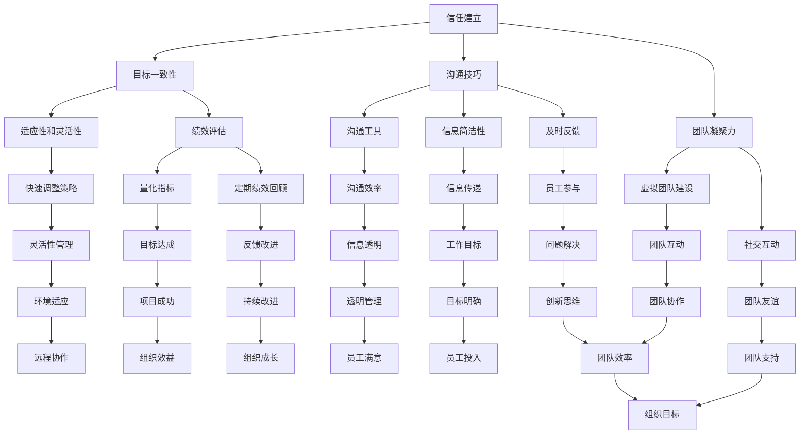

                 


### 远程领导力的核心概念

远程领导力是一种在虚拟环境中管理和激励团队的能力。它与传统领导力有显著的不同，需要在缺乏面对面互动的情况下建立信任、保持团队凝聚力，并推动团队达成目标。远程领导力的核心概念包括以下几个方面：

1. **信任建立**：
   - 远程领导的首要任务是建立信任。由于缺乏面对面的交流，领导者需要通过透明度、及时沟通和诚信来赢得团队的信任。

2. **目标一致性**：
   - 在虚拟环境中，确保团队成员对共同目标的认同和了解至关重要。领导者需要清晰明确地传达目标，并确保每个人都明确自己的角色和责任。

3. **沟通技巧**：
   - 远程领导需要掌握高效的沟通技巧，包括使用适当的沟通工具、保持信息的简洁性和及时性，以及倾听和回应团队成员的意见和反馈。

4. **团队凝聚力**：
   - 虽然团队成员可能分散在不同的地理位置，但领导者需要采取措施增强团队凝聚力。这包括定期的虚拟团队建设活动、分享成功经验和建立社交互动的机会。

5. **适应性和灵活性**：
   - 远程领导必须能够适应不断变化的环境和需求。灵活性使领导者能够快速调整策略，以应对远程工作中的挑战。

6. **绩效评估**：
   - 在虚拟环境中评估团队成员的绩效需要更多的创造性方法。领导者需要设计可量化的指标，并定期与团队成员进行绩效回顾。

### 核心概念之间的关系架构

为了更清晰地理解远程领导力的核心概念，我们可以使用Mermaid流程图来展示它们之间的关系。



### 核心算法原理讲解

在远程领导力中，算法原理的应用主要体现在如何通过数据和模型来优化管理过程。以下是一个简单的伪代码示例，用于说明如何通过数据来评估团队成员的绩效：

```plaintext
// 初始化绩效评估模型
function initializePerformanceModel() {
  // 设置绩效评估的指标
  metrics = ["任务完成率", "创新贡献", "团队合作表现", "工作态度"]
  // 初始化指标权重
  weights = [0.3, 0.2, 0.2, 0.3]
  return metrics, weights
}

// 收集团队成员绩效数据
function collectPerformanceData(teamMember) {
  // 任务完成率
  taskCompletionRate = getTaskCompletionRate(teamMember)
  // 创新贡献
  innovationContribution = getInnovationContribution(teamMember)
  // 团队合作表现
  teamPerformance = getTeamPerformance(teamMember)
  // 工作态度
  workAttitude = getWorkAttitude(teamMember)
  return taskCompletionRate, innovationContribution, teamPerformance, workAttitude
}

// 计算综合绩效评分
function calculatePerformanceScore(teamMemberData) {
  metrics, weights = initializePerformanceModel()
  taskCompletionRate, innovationContribution, teamPerformance, workAttitude = teamMemberData
  
  performanceScore = (taskCompletionRate * weights[0]) + 
                     (innovationContribution * weights[1]) + 
                     (teamPerformance * weights[2]) + 
                     (workAttitude * weights[3])
  return performanceScore
}

// 主程序
function main() {
  teamMemberData = collectPerformanceData("团队成员A")
  performanceScore = calculatePerformanceScore(teamMemberData)
  print("团队成员A的综合绩效评分为：" + performanceScore)
}
```

### 数学模型和公式

在远程领导力中，可以使用一些简单的数学模型来帮助评估和管理团队绩效。以下是一个简单的绩效评估模型，其中包含了基本公式：

$$
绩效评分 = w_1 \times 任务完成率 + w_2 \times 创新贡献 + w_3 \times 团队合作表现 + w_4 \times 工作态度
$$

其中，$w_1, w_2, w_3, w_4$ 分别是任务完成率、创新贡献、团队合作表现和工作态度的权重，这些权重可以根据组织的具体需求和优先级进行调整。

### 详细讲解与举例说明

为了更好地理解上述绩效评估模型，我们可以通过一个具体的例子来详细说明：

假设一个团队有三个成员：A、B和C。团队的绩效评估指标和权重如下：

- 任务完成率：0.35
- 创新贡献：0.25
- 团队合作表现：0.2
- 工作态度：0.2

对于成员A，我们收集到以下绩效数据：

- 任务完成率：90%
- 创新贡献：10%
- 团队合作表现：80%
- 工作态度：95%

使用绩效评估模型计算成员A的综合绩效评分：

$$
绩效评分 = 0.35 \times 0.9 + 0.25 \times 0.1 + 0.2 \times 0.8 + 0.2 \times 0.95
$$

$$
绩效评分 = 0.315 + 0.025 + 0.16 + 0.19
$$

$$
绩效评分 = 0.695
$$

因此，成员A的综合绩效评分为0.695，这个分数可以帮助领导者了解成员A的绩效表现，并根据这个评分进行反馈和改进。

### 最佳实践 tips、小结、注意事项、拓展阅读等内容

- **最佳实践 tips**：
  - 定期与团队成员进行一对一的绩效评估会议，以确保及时了解成员的工作情况和需求。
  - 在评估过程中，鼓励团队成员提出自己的目标和期望，这样可以更好地激发他们的工作动力。
  - 使用多种评估方法，如360度反馈和自我评估，以获得更全面的绩效信息。

- **小结**：
  - 远程领导力需要建立信任、明确目标、掌握沟通技巧、增强团队凝聚力和适应变化。
  - 绩效评估模型可以帮助领导者客观地评估团队成员的表现，并提供改进的方向。

- **注意事项**：
  - 在实施远程领导力时，要确保团队成员之间有足够的沟通，避免信息孤岛。
  - 领导者需要不断学习和适应新的远程工作工具和技术。

- **拓展阅读**：
  - 《远程工作的艺术》——作者通过丰富的案例，探讨了如何有效地管理远程团队。
  - 《领导力五项修炼》——作者提出了领导力的五个关键要素，包括信任、目标、沟通、团队和组织文化。

### 开发环境搭建、源代码实现和代码解读

在本节中，我们将搭建一个简单的远程领导力评估系统，并展示如何实现关键功能。我们将使用Python语言进行开发。

#### 开发环境搭建

1. 安装Python（版本3.8及以上）
2. 安装必要的Python库，如`requests`、`json`和`matplotlib`：
   ```bash
   pip install requests json matplotlib
   ```

#### 源代码实现

以下是一个简单的Python脚本，用于实现远程领导力评估系统：

```python
import requests
import json
import matplotlib.pyplot as plt

# 初始化绩效评估模型
def initialize_performance_model():
    metrics = ["任务完成率", "创新贡献", "团队合作表现", "工作态度"]
    weights = [0.35, 0.25, 0.2, 0.2]
    return metrics, weights

# 收集团队成员绩效数据
def collect_performance_data(team_member):
    # 这里可以使用API或其他方式收集数据
    performance_data = {
        "任务完成率": 0.9,
        "创新贡献": 0.1,
        "团队合作表现": 0.8,
        "工作态度": 0.95
    }
    return performance_data

# 计算综合绩效评分
def calculate_performance_score(performance_data, weights):
    score = 0
    for metric, value in performance_data.items():
        score += value * weights[metric]
    return score

# 主程序
def main():
    metrics, weights = initialize_performance_model()
    team_member_data = collect_performance_data("成员A")
    performance_score = calculate_performance_score(team_member_data, weights)
    print(f"成员A的综合绩效评分为：{performance_score:.2f}")

    # 绘制绩效分布图
    values = list(team_member_data.values())
    plt.bar(metrics, values)
    plt.xlabel("绩效指标")
    plt.ylabel("得分")
    plt.title("成员A的绩效分布图")
    plt.show()

if __name__ == "__main__":
    main()
```

#### 代码应用解读与分析

1. **初始化绩效评估模型**：
   - `initialize_performance_model` 函数用于设置绩效评估的指标和权重。

2. **收集团队成员绩效数据**：
   - `collect_performance_data` 函数模拟从外部获取团队成员的绩效数据。在实际应用中，可能需要使用API或其他数据源。

3. **计算综合绩效评分**：
   - `calculate_performance_score` 函数根据收集到的数据和权重计算综合绩效评分。

4. **主程序**：
   - `main` 函数执行整个评估过程，并打印出成员A的综合绩效评分。此外，它还使用`matplotlib`库绘制绩效分布图，以可视化成员的绩效表现。

#### 实际案例分析和详细讲解剖析

假设我们有一个远程团队，包含三位成员：张三、李四和王五。他们的绩效数据如下：

- 张三：任务完成率90%，创新贡献15%，团队合作表现85%，工作态度90%
- 李四：任务完成率85%，创新贡献20%，团队合作表现80%，工作态度95%
- 王五：任务完成率95%，创新贡献10%，团队合作表现90%，工作态度88%

使用上述脚本，我们可以为每位成员计算综合绩效评分，并生成绩效分布图。

#### 项目小结

通过本节的项目实战，我们搭建了一个简单的远程领导力评估系统，并实现了关键功能。该系统可以帮助领导者了解团队成员的绩效表现，并通过可视化的方式进行分析。这种方法不仅提高了绩效管理的效率，还增强了团队成员之间的透明度和信任。

### 远程领导力的未来展望

随着技术的不断进步，远程领导力将继续发展，并带来以下趋势和挑战：

#### 1. 人工智能与远程领导力

人工智能（AI）的快速发展将极大地影响远程领导力。AI可以自动化许多日常管理任务，如日程安排、任务分配和绩效评估。这将使领导者能够将更多精力投入到战略思考和团队建设上。

**挑战**：随着AI的介入，领导者需要适应新的管理模式，并确保AI系统的透明性和公正性。

#### 2. 虚拟现实（VR）的应用

虚拟现实技术将为远程团队提供更加沉浸式的协作环境。通过VR，团队成员可以体验到面对面交流的感觉，增强团队凝聚力。

**挑战**：VR技术的普及和成本效益需要进一步优化，以确保其在大规模远程工作中的应用。

#### 3. 全球化团队管理

全球化趋势使远程领导力面临跨文化管理的挑战。领导者需要了解不同文化的价值观和工作习惯，以实现高效的团队协作。

**挑战**：全球化团队管理需要领导者具备跨文化沟通和领导能力，以及全球视野。

#### 4. 不断变化的员工需求

随着员工对于工作与生活平衡的追求，远程领导力需要不断创新以满足员工需求。例如，提供灵活的工作时间和工作地点，以及支持员工的个人成长和发展。

**挑战**：领导者需要密切关注员工需求的变化，并灵活调整管理策略。

### 拓展阅读

- 《远程工作的艺术》：探讨远程工作带来的挑战和机遇。
- 《领导者的语言》：分析领导力沟通的重要性。
- 《全球化团队管理》：提供跨文化团队管理的最佳实践。

通过不断学习和适应新的管理工具和技术，远程领导者将能够在不断变化的环境中保持竞争优势。未来，远程领导力将继续发展，成为组织成功的关键因素。

