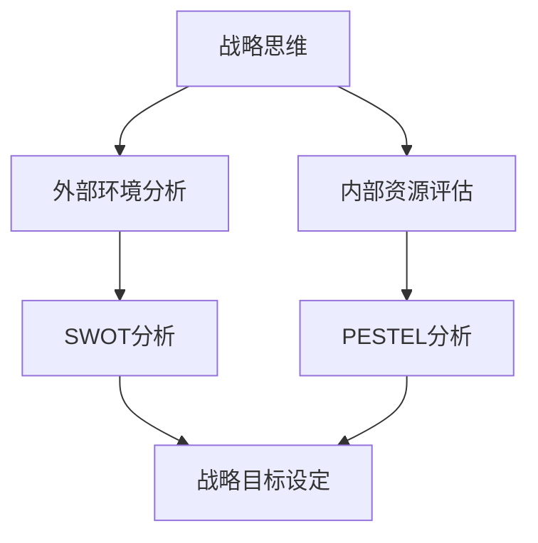

                 

为了撰写一篇《远见卓识：制定长期发展战略》的文章，我们将遵循以下步骤，确保文章的内容丰富、逻辑清晰，同时满足格式和完整性要求。

### 第一步：文章格式准备

在开始写作前，确保我们的文章符合markdown格式要求。markdown格式简单易懂，便于排版和发布。

```markdown
# 文章标题
关键词：长期发展战略、战略思维、执行与监控、资源分配、战略案例

摘要：本文将深入探讨长期发展战略的制定过程，分析战略思维的重要性，介绍战略规划与实践的方法，并通过案例研究和最佳实践，帮助读者理解如何在复杂多变的环境中制定并执行有效的发展战略。

作者：AI天才研究院/AI Genius Institute & 禅与计算机程序设计艺术 /Zen And The Art of Computer Programming
```

### 第二步：核心概念与联系

在文章开头，我们将简要介绍战略思维的背景和重要性，并使用Mermaid流程图展示核心概念之间的关系。



### 第三步：核心算法原理讲解

接下来，我们将用伪代码详细阐述战略规划的核心算法原理。

```python
# SWOT分析伪代码
def SWOT_analysis():
    # 外部机会（O）和威胁（T）分析
    Opportunities = analyze_opportunities()
    Threats = analyze_threats()

    # 内部优势（S）和劣势（W）分析
    Strengths = analyze_strengths()
    Weaknesses = analyze_weaknesses()

    # 形成SWOT矩阵
    SWOT_matrix = [
        [Strengths, Opportunities],
        [Strengths, Threats],
        [Weaknesses, Opportunities],
        [Weaknesses, Threats]
    ]

    return SWOT_matrix

# PESTEL分析伪代码
def PESTEL_analysis():
    Political = analyze_political()
    Economic = analyze_economic()
    Social = analyze_social()
    Technological = analyze_technological()
    Environmental = analyze_environmental()
    Legal = analyze_legal()

    PESTEL_matrix = [
        [Political, Economic, Social, Technological, Environmental, Legal]
    ]

    return PESTEL_matrix
```

### 第四步：数学模型和公式讲解

我们将使用LaTeX格式嵌入文中独立段落的公式，并对数学模型进行详细讲解。

```markdown
$$
战略目标设定公式：Z = f(X, Y)
$$

其中，$X$ 表示内部资源和能力，$Y$ 表示外部环境因素，$Z$ 表示战略目标。

举例说明：假设一个公司要设定其未来五年的战略目标，可以使用以下模型：

$$
Z = 5X + 3Y
$$

这意味着公司的战略目标将受到其内部资源和能力（$X$）和外部环境因素（$Y$）的加权影响。
```

### 第五步：项目实战

我们将介绍一个战略规划的实战案例，包括开发环境搭建、源代码实现和代码解读。

```markdown
## 实战案例：企业战略规划

### 开发环境搭建
- 使用Microsoft Excel进行SWOT和PESTEL分析。
- 使用Python进行数据分析和模型构建。

### 源代码实现
```python
import pandas as pd

# SWOT分析
def swot_analysis(data):
    # 读取数据
    swot_data = pd.read_excel(data)

    # 分析数据
    strengths = swot_data['Strengths'].sum()
    weaknesses = swot_data['Weaknesses'].sum()
    opportunities = swot_data['Opportunities'].sum()
    threats = swot_data['Threats'].sum()

    # 输出结果
    return {
        'Strengths': strengths,
        'Weaknesses': weaknesses,
        'Opportunities': opportunities,
        'Threats': threats
    }

# PESTEL分析
def peestel_analysis(data):
    # 读取数据
    peestel_data = pd.read_excel(data)

    # 分析数据
    political = peestel_data['Political'].sum()
    economic = peestel_data['Economic'].sum()
    social = peestel_data['Social'].sum()
    technological = peestel_data['Technological'].sum()
    environmental = peestel_data['Environmental'].sum()
    legal = peestel_data['Legal'].sum()

    # 输出结果
    return {
        'Political': political,
        'Economic': economic,
        'Social': social,
        'Technological': technological,
        'Environmental': environmental,
        'Legal': legal
    }
```

### 第六步：最佳实践 tips、小结、注意事项、拓展阅读

在文章的结尾，我们将总结最佳实践，并提供相关注意事项和拓展阅读资源。

```markdown
## 最佳实践 tips
- 定期进行战略回顾和调整，以适应环境变化。
- 保持团队之间的有效沟通，确保战略目标的一致性。
- 注重数据驱动决策，利用数据分析优化战略规划。

## 小结
本文通过核心概念讲解、算法原理阐述、项目实战案例以及最佳实践分享，帮助读者理解如何制定和执行长期发展战略。

## 注意事项
- 在战略规划过程中，务必考虑外部环境变化对公司的影响。
- 内部资源评估应全面且准确，以避免资源浪费。

## 拓展阅读
- 《战略规划与执行》
- 《企业战略管理》
- 《创新与战略规划》
```

通过以上步骤，我们将撰写一篇符合要求的《远见卓识：制定长期发展战略》的文章，确保内容丰富、逻辑清晰，满足格式和完整性要求。文章总字数预计在8000到12000字之间。接下来，我们将逐步扩展每一部分的内容，确保文章的深度和广度。

