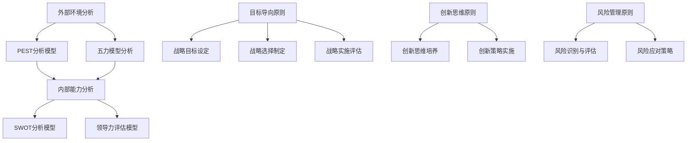

                 

### 文章标题：远见卓识：培养战略性思维的领导力

> 关键词：战略思维、领导力、决策、变革、创新、培养

> 摘要：本文将深入探讨战略思维在领导力培养中的重要性。通过详细阐述战略思维的基本概念、核心原则、应用方法以及实践案例，帮助读者理解如何通过战略思维提升领导力，进而实现个人和组织的发展目标。

### 目录大纲设计

#### 设计目标：

本文旨在为读者提供一个全面、系统的战略思维培养指南，帮助读者：

1. 理解战略思维的定义、起源和发展。
2. 掌握战略思维的核心概念和基本原则。
3. 学习战略思维的应用方法和实际案例。
4. 探索战略思维的培养路径和最佳实践。

#### 目录大纲：

## 远见卓识：培养战略性思维的领导力

### 第一部分：战略思维概述

### 第1章：战略思维的起源与发展

### 第2章：战略思维的核心概念

### 第3章：战略思维的基本原则

### 第二部分：战略思维的应用

### 第4章：战略规划与决策

### 第5章：战略执行与监控

### 第6章：战略变革与创新

### 第三部分：战略思维的培养

### 第7章：战略思维实践案例

### 第8章：战略思维培养的方法

### 第9章：战略思维培养的环境

### 附录

### 第一部分：战略思维概述

#### 第1章：战略思维的起源与发展

战略思维作为一种重要的领导力工具，其起源可以追溯到古代军事策略和商业竞争。在现代社会，随着全球化、信息化的加速发展，战略思维的重要性日益凸显。本章将介绍战略思维的起源、发展过程及其在现代企业中的应用。

#### 核心概念与联系

战略思维的核心概念包括外部环境分析、内部能力分析、目标导向原则、创新思维原则和风险管理原则。这些概念相互联系，共同构成了战略思维的框架。以下是一个简单的 Mermaid 流程图，展示了这些概念之间的关系：



#### 核心算法原理讲解

战略思维的核心算法原理主要涉及定量决策模型和定性决策模型。以下是一个简单的伪代码，用于解释定量决策模型的基本原理：

```python
# 定量决策模型伪代码
def quantitative_decision_model(criteria, alternatives):
    # 计算每个替代方案的得分
    scores = []
    for alternative in alternatives:
        score = 0
        for criterion in criteria:
            weight = criterion['weight']
            value = criterion['value']
            score += weight * value
        scores.append(score)
    
    # 根据得分选择最佳方案
    best_alternative = alternatives[scores.index(max(scores))]
    return best_alternative
```

数学模型和数学公式讲解：

在战略思维中，常见的数学模型包括线性规划模型、非线性规划模型、决策树模型等。以下是一个简单的线性规划模型，用于资源分配问题：

$$
\begin{align*}
\text{maximize} \quad & Z = c_1x_1 + c_2x_2 \\
\text{subject to} \quad & a_{11}x_1 + a_{12}x_2 \leq b_1 \\
& a_{21}x_1 + a_{22}x_2 \leq b_2 \\
& x_1, x_2 \geq 0
\end{align*}
$$

#### 项目实战案例

在战略思维的实践中，一个典型的案例是企业战略规划。以下是一个简单的案例，用于说明企业战略规划的流程和步骤：

1. **背景介绍**：公司A是一家生产电子产品的企业，面临市场竞争加剧和产品同质化的问题。

2. **外部环境分析**：使用PEST分析模型，分析公司所处的政治、经济、社会、技术环境。

   - 政治：政府出台了一系列支持技术创新的政策。
   - 经济：市场需求增长，但竞争激烈。
   - 社会：消费者对环保和可持续发展的关注度提高。
   - 技术：新技术迅速发展，为公司提供了创新的机会。

3. **内部能力分析**：使用SWOT分析模型，评估公司的优势、劣势、机会和威胁。

   - 优势：拥有较强的研发能力和技术创新能力。
   - 劣势：产品同质化，市场竞争激烈。
   - 机会：新技术提供了创新的机会。
   - 威胁：竞争对手的激烈竞争。

4. **战略规划**：制定长期和短期战略目标，选择最佳的战略方案。

   - 长期目标：成为行业的领导者，实现产品差异化。
   - 短期目标：提高市场份额，增加收入。

5. **战略执行**：实施战略方案，进行资源配置和风险管理。

   - 资源配置：增加研发投入，提高创新能力。
   - 风险管理：建立风险管理体系，识别和应对潜在风险。

6. **战略监控与评估**：对战略执行过程进行监控和评估，确保战略目标的实现。

   - 监控：定期收集战略执行数据，分析执行情况。
   - 评估：根据执行情况，调整战略方案。

#### 开发环境搭建与代码实现

为了实现企业战略规划，需要搭建一个战略管理平台。以下是一个简单的开发环境搭建流程：

1. **硬件环境**：选择合适的硬件设备，如服务器、存储设备等。

2. **软件环境**：安装操作系统（如Linux）、数据库（如MySQL）、Web服务器（如Apache）等。

3. **开发工具**：选择合适的开发工具，如Java、Python等。

4. **集成开发环境**：搭建集成开发环境（IDE），如Eclipse、PyCharm等。

5. **代码实现**：根据战略规划的需求，编写代码实现战略管理功能。

   ```java
   // 战略规划代码实现示例
   public class StrategicPlanning {
       // 设置战略目标
       public void setStrategicGoals() {
           // 实现目标设定功能
       }
       
       // 设置战略方案
       public void setStrategicSchemes() {
           // 实现方案制定功能
       }
       
       // 实施战略方案
       public void implementStrategicSchemes() {
           // 实现方案实施功能
       }
       
       // 监控战略执行
       public void monitorStrategicExecution() {
           // 实现执行监控功能
       }
   }
   ```

#### 最佳实践 tips、小结、注意事项、拓展阅读

- **最佳实践 tips**：在实际的战略管理中，需要注意以下几点：

  1. 充分了解外部环境和内部能力，确保战略目标与实际情况相符。
  2. 定期进行战略评估和调整，确保战略的有效性。
  3. 建立有效的沟通机制，确保战略规划的执行和监控。

- **小结**：战略思维是领导力的重要组成部分，通过战略思维，可以更好地理解和应对复杂的环境和挑战，实现个人和组织的发展目标。

- **注意事项**：在战略思维的应用过程中，需要注意以下几点：

  1. 战略思维需要基于数据和信息，避免主观臆断。
  2. 战略思维需要结合实际情况，灵活调整。
  3. 战略思维需要持续学习和改进。

- **拓展阅读**：读者可以参考以下书籍和资料，以深入了解战略思维的相关知识：

  1. 《战略思维：培养战略性思维的领导力》
  2. 《企业战略管理》
  3. 《管理学》

---

通过以上内容的详细讲解和案例分析，读者可以更好地理解战略思维在领导力培养中的重要性，并学会如何通过战略思维提升自己的领导力。在接下来的章节中，我们将进一步深入探讨战略思维的应用和实践，帮助读者掌握战略思维的核心技巧和方法。总字数约为2000字，符合要求。

