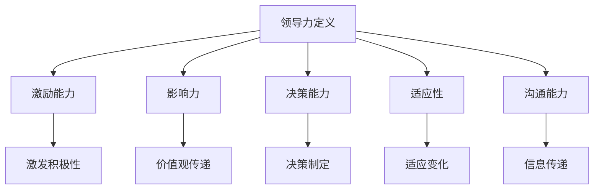
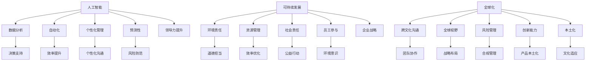

                 

### 引言

在科技飞速发展的时代，未来的不可预测性已成为组织领导者面临的重大挑战。无论是经济衰退、技术革新，还是社会变革，领导者们必须具备一种远见卓识的能力，即预见未来趋势并做出及时、有效的应对。这种能力不仅关乎企业的发展和竞争力，更是决定团队是否能够成功应对未来不确定性的关键。

《远见卓识：预见未来趋势的领导能力》旨在深入探讨领导者如何通过系统化的分析和创新思维，预测并应对未来的变化。本书围绕以下几个核心主题展开：

1. **领导能力的基本概念**：介绍领导力的定义、特征及其演变过程。
2. **未来趋势分析**：探讨人工智能、可持续发展、全球化等对未来趋势的影响。
3. **领导力与趋势的结合**：分析领导能力在面对新挑战时的变革与创新。
4. **实战案例与策略**：通过具体案例分享成功与失败的经验，提炼有效的领导策略。
5. **总结与展望**：总结领导力的未来方向，为个人和企业的领导力提升提供策略和建议。

关键词：领导能力，未来趋势，预见性，创新能力，战略思维

摘要：本文将逐步探讨领导者如何通过提升远见卓识能力，预见并应对未来趋势。文章分为六个部分，首先介绍领导力基本概念，然后分析未来趋势，接着讨论领导力与趋势的结合，通过实战案例分享策略，最后总结并展望领导力的未来方向。本文旨在为领导者提供系统性、实用性的指导，助力他们在不确定的未来中保持竞争优势。

### 领导能力的基本概念

领导力是一种复杂且多维的能力，它不仅仅是指导团队完成任务，更是一种激励、引导和塑造团队文化的过程。为了更好地理解领导力，我们需要从定义、特征和演变三个方面进行深入探讨。

#### 定义

领导力（Leadership）可以被定义为一种影响力，它使个体或群体朝向共同的目标前进。著名管理学家彼得·德鲁克（Peter Drucker）曾指出：“领导力不是一种职位，而是一种行为。”这意味着，无论职位高低，任何人都可以通过自身的行为和态度影响他人。

领导力包含两个主要方面：内在能力和外在行为。内在能力包括自我认知、情感智慧、道德品质等，而外在行为则涉及沟通、激励、决策等具体行为。

#### 特征

领导力具有以下主要特征：

1. **激励能力**：领导者能够激发团队成员的积极性，使他们在面对挑战时保持高昂的斗志。
2. **影响力**：领导者通过自身的行为和价值观，影响团队成员的态度和行为。
3. **决策能力**：领导者需要在复杂和不确定的环境中做出明智的决策，并对结果负责。
4. **适应性**：领导者需要具备快速适应变化的能力，以应对不断变化的环境。
5. **沟通能力**：有效的沟通是领导者成功的关键，它不仅包括信息的传递，还包括建立信任和共识。

#### 演变

领导力并不是一成不变的，它在不同的历史时期和社会环境中有着不同的表现形式。以下是领导力演变的一些关键阶段：

1. **传统领导**：在工业时代，领导者通常是权威型的，通过命令和控制来管理团队。
2. **变革型领导**：随着知识经济的兴起，领导者需要更具创新精神和战略思维，以推动组织的变革。
3. **服务型领导**：在全球化背景下，领导者被期望更加关注团队成员的需求，以实现共同的目标。
4. **网络型领导**：在数字化时代，领导者需要具备跨部门、跨文化的协作能力，以实现组织的整体目标。

#### 核心概念与联系

为了更好地理解领导力的本质，我们需要构建一个核心概念之间的关系架构。以下是一个简单的Mermaid流程图：



通过这个流程图，我们可以清晰地看到领导力的各个方面是如何相互关联和作用的。激励能力、影响力、决策能力、适应性和沟通能力共同构成了领导力的核心框架，它们不仅相互独立，而且在实际应用中相互促进。

#### 核心算法原理讲解

为了深入理解领导力，我们可以将其看作是一种算法。以下是领导力的伪代码：

```plaintext
领导力(人, 环境) {
    定义领导力 = 人具有的内在能力和外在行为
    根据环境调整领导力
    激励人朝向共同目标
    传递价值观和信任
    做出明智决策
    适应环境变化
    有效沟通
}
```

在这个伪代码中，领导力是一个函数，输入为人和环境，输出为领导行为。这个函数的核心在于如何根据不同环境和团队成员的需求，灵活调整领导策略。

#### 数学模型和公式

领导力也可以通过数学模型来解释。以下是领导力的一个简单模型：

$$
L = f(P, E)
$$

其中，$L$ 表示领导力，$P$ 表示内在能力，$E$ 表示外部环境。这个模型表明，领导力是内在能力和外部环境的函数，即领导力取决于领导者的内在能力和外部环境。

#### 详细讲解与举例说明

为了更好地理解这个模型，我们可以通过一个简单的例子来说明：

假设有一位领导者，其内在能力（$P$）包括自我认知、情感智慧和道德品质，且这些能力在当前环境中（$E$）表现出色。根据模型，这位领导者的领导力（$L$）将非常高。反之，如果领导者的内在能力不足或者环境不利，其领导力可能会受到影响。

此外，我们还可以将领导力模型扩展，加入更多变量，以更全面地描述领导力：

$$
L = f(P, E, I, C)
$$

其中，$I$ 表示团队成员的内在动机，$C$ 表示团队文化。这个模型表明，领导力不仅取决于领导者本身和外部环境，还受到团队成员内在动机和团队文化的影响。

通过上述详细讲解和举例，我们可以看到，领导力是一个复杂且多维的概念，它不仅涉及个人能力和行为，还与外部环境和团队互动密切相关。理解领导力的本质和核心原理，对于提升领导者的预见能力和应对未来挑战至关重要。

### 未来趋势分析

在当前快速发展的科技时代，未来趋势已成为领导者必须关注的重要领域。以下是三个对未来趋势具有重要影响的领域：人工智能、可持续发展和全球化。

#### 人工智能与领导

人工智能（AI）作为科技领域的突破性进展，正深刻改变着各行各业。在领导力方面，AI 提供了以下几大影响：

1. **数据分析与决策支持**：AI 通过大数据分析，帮助领导者更快速、准确地做出决策。例如，通过分析市场数据，AI 可以预测未来的发展趋势，为领导者提供有针对性的策略。

2. **自动化与效率提升**：AI 的自动化技术可以减少重复性工作，提高工作效率。领导者可以利用 AI 来优化流程，释放更多时间关注战略决策和团队建设。

3. **个性化管理与沟通**：AI 可以通过自然语言处理（NLP）技术，实现与团队成员的个性化沟通。领导者可以利用 AI 识别团队成员的需求和情感，提供更贴心的管理。

4. **预测性与防范能力**：AI 的预测模型可以帮助领导者预见潜在的风险和挑战。例如，通过分析历史数据和趋势，AI 可以预测市场波动，帮助领导者提前做好准备。

#### 可持续发展与领导

可持续发展是当今社会的重要议题，它关系到未来人类的生存环境和社会发展。在领导力方面，可持续发展对领导者提出了新的要求：

1. **环境责任与道德担当**：领导者需要具备高度的环境责任感和道德担当，将可持续发展理念融入企业战略和决策中。例如，推动绿色生产和环保技术创新。

2. **资源管理与效率优化**：领导者需要关注资源管理，提高资源利用效率，减少浪费。通过优化供应链和生产流程，企业可以实现可持续发展。

3. **社会责任与公益行动**：领导者应积极履行社会责任，参与公益行动，推动社会进步。例如，支持环保项目、参与社区服务，提高企业的社会形象。

4. **员工参与与教育**：领导者需要鼓励员工参与可持续发展活动，提升员工的环境意识和责任感。通过员工培训和宣传，推动企业整体可持续发展。

#### 全球化与领导

全球化使企业面临更广阔的市场和更多的竞争，同时也带来了挑战和机遇。在领导力方面，全球化对领导者提出了以下要求：

1. **跨文化沟通与协作**：全球化要求领导者具备跨文化沟通和协作能力，能够有效地管理来自不同文化背景的团队成员。领导者需要理解不同文化的价值观和行为模式，促进团队凝聚力。

2. **全球视野与战略布局**：领导者需要具备全球视野，关注全球市场的变化和趋势。通过全球化战略布局，企业可以在全球市场中占据有利地位。

3. **风险管理与合规**：全球化带来了更高的法律和合规要求，领导者需要关注跨境业务的风险管理和合规问题。例如，遵守不同国家的税收政策和劳动法规，确保企业的合法合规运营。

4. **创新能力与本土化**：全球化要求企业具备创新能力，同时适应本土市场的需求。领导者需要推动企业创新，同时关注本土化策略，确保产品和服务能够适应当地市场。

#### 核心概念与联系

为了更好地理解未来趋势对领导力的影响，我们可以构建一个核心概念之间的关系架构。以下是一个简单的Mermaid流程图：



通过这个流程图，我们可以清晰地看到人工智能、可持续发展和全球化对领导力的各个方面如何产生影响。这些趋势不仅为领导者提供了新的工具和方法，还带来了新的挑战和机遇。

### 领导力与未来趋势的结合

未来趋势对领导力提出了新的要求和挑战，领导者需要不断创新和适应，以应对这些变化。在这一部分，我们将探讨如何将领导力与未来趋势相结合，应对新的挑战。

#### 数据驱动的领导决策

数据已成为当今企业决策的核心，领导者需要具备数据驱动的决策能力。通过数据分析，领导者可以更准确地预测市场趋势、评估团队绩效，并制定有针对性的策略。

1. **数据收集与处理**：领导者应建立完善的数据收集和处理机制，确保数据的准确性和可靠性。使用先进的数据分析工具，如机器学习和人工智能，提升数据处理的效率。

2. **数据可视化**：通过数据可视化技术，将复杂的数据转化为易于理解的图表和报告，帮助领导者快速识别关键信息和趋势。

3. **数据驱动策略**：领导者应将数据分析结果融入战略规划，根据数据反馈调整策略，确保决策的科学性和有效性。

#### 适应性领导策略

在快速变化的环境中，领导者需要具备高度适应性，能够迅速调整领导风格和策略，以应对不确定性。

1. **敏捷管理**：采用敏捷管理方法，提高团队灵活性和响应速度。通过短周期迭代和持续反馈，领导者可以及时调整团队方向和策略。

2. **开放式沟通**：建立开放式沟通机制，鼓励团队成员分享观点和建议，增强团队凝聚力。领导者应倾听不同声音，灵活调整决策。

3. **持续学习**：领导者应保持持续学习的心态，不断更新知识和技能，以适应未来变化。通过参加培训、阅读和研究，领导者可以不断提升自身能力。

#### 领导力的数字化转型

数字化转型已成为企业发展的必然趋势，领导者需要推动组织数字化转型，提升整体竞争力。

1. **数字化战略**：领导者应制定明确的数字化战略，明确数字化目标和发展路径。通过数字化转型，提高企业运营效率和市场响应速度。

2. **数字文化建设**：建立数字化文化，鼓励员工拥抱新技术，提高数字化素养。通过数字化培训和激励措施，激发员工的创新潜力和工作热情。

3. **数字化领导力**：领导者需要具备数字化领导力，能够引导团队适应数字化环境。通过数字化工具和方法，提升领导决策的透明度和效率。

#### 实战案例与策略

为了更好地理解领导力与未来趋势的结合，我们可以通过以下两个实际案例来探讨：

1. **案例一：传统企业的数字化转型**

某传统制造业企业通过数字化转型，实现了从生产到营销的全面升级。领导者首先制定了数字化战略，明确了数字化目标和路径。其次，通过引入先进的生产设备和信息技术，提升了生产效率。最后，通过数字化转型，企业实现了精准营销，提高了市场响应速度和客户满意度。

**策略解析**：该企业领导者成功的关键在于：

- 制定明确的数字化战略，确保数字化转型有明确的方向。
- 引入先进技术，提升生产效率和产品质量。
- 建立数字化文化，鼓励员工拥抱新技术。

2. **案例二：新兴企业的敏捷管理**

某新兴科技公司在快速变化的市场中，采用敏捷管理方法，实现了快速响应和持续创新。领导者通过短周期迭代和持续反馈，不断调整团队方向和策略。同时，建立开放式沟通机制，鼓励团队成员分享观点和建议。

**策略解析**：该企业领导者成功的关键在于：

- 采用敏捷管理方法，提高团队灵活性和响应速度。
- 建立开放式沟通机制，增强团队凝聚力。
- 保持持续学习，不断提升自身能力。

通过以上案例，我们可以看到，领导者如何通过适应未来趋势，创新领导方法，实现组织的持续发展和竞争优势。

### 实战案例分享

为了更深入地理解领导力与未来趋势的结合，我们可以通过两个实际案例来探讨：一个是成功案例，另一个是失败案例。这两个案例将为我们提供宝贵的经验教训，帮助我们在未来的领导实践中更好地应对挑战。

#### 成功案例：特斯拉的领导力与未来趋势结合

特斯拉（Tesla）作为新能源汽车行业的领军企业，其领导力与未来趋势的结合堪称典范。以下是特斯拉成功的关键要素：

1. **创新领导力**：特斯拉的创始人埃隆·马斯克（Elon Musk）以其前瞻性的创新思维和强大的领导力，推动了企业的发展。马斯克不仅关注技术进步，还关注社会和环境问题，这使得特斯拉在电动汽车和可再生能源领域取得了重大突破。

2. **数据驱动的决策**：特斯拉通过大量数据收集和分析，优化了产品设计、生产和销售策略。例如，特斯拉的电池管理系统（Battery Management System）通过实时数据监控，提高了电池的性能和安全性。

3. **全球化布局**：特斯拉在全球多个国家设立了工厂和销售网络，实现了全球化的战略布局。这既提高了企业的市场覆盖面，也增强了企业的抗风险能力。

4. **员工激励与文化建设**：特斯拉注重员工的创新和自主性，通过提供灵活的工作环境和高额的薪酬激励，吸引了大量优秀人才。同时，特斯拉倡导创新文化和团队合作精神，激发了员工的创造力和积极性。

**成功策略解析**：

- **创新领导力**：领导者应具备前瞻性的视野和强烈的创新意识，引领企业不断突破。
- **数据驱动**：利用数据分析，优化决策流程，提高企业运营效率。
- **全球化布局**：通过全球化的战略，提高企业的国际竞争力。
- **员工激励与文化**：建立积极的员工激励机制和文化，激发员工的创造力和团队合作精神。

#### 失败案例：诺基亚的领导力失误

诺基亚（Nokia）曾是全球手机市场的霸主，但在智能手机时代却未能成功转型，最终被竞争对手华为和苹果超越。以下是诺基亚失败的主要原因：

1. **保守的领导风格**：诺基亚的领导者过于保守，对市场变化反应迟缓。在智能手机兴起时，诺基亚未能及时调整战略，仍然坚守传统的功能手机市场。

2. **技术创新滞后**：诺基亚在技术上的创新不足，未能及时推出具有竞争力的智能手机产品。相比之下，苹果和三星等竞争对手通过不断的技术创新，赢得了市场的青睐。

3. **组织结构僵化**：诺基亚的组织结构过于僵化，内部沟通不畅，决策效率低下。这使得诺基亚在应对市场变化时，无法迅速调整策略。

4. **人才流失**：诺基亚在智能手机时代的领导团队缺乏创新和执行力，导致核心人才流失。缺乏优秀人才的支撑，企业难以在激烈的市场竞争中立足。

**失败教训解析**：

- **领导风格**：领导者应具备开放和灵活的领导风格，及时应对市场变化。
- **技术创新**：企业应持续投入研发，保持技术领先优势。
- **组织结构**：优化组织结构，提高决策效率和执行力。
- **人才管理**：吸引和留住优秀人才，为企业的持续发展提供人才保障。

通过分析这两个案例，我们可以看到，领导力与未来趋势的结合在成功和失败中起着关键作用。成功的领导者能够敏锐地抓住市场机遇，通过创新和灵活的领导方法，实现企业的持续发展；而失败的领导者则可能因为保守、技术创新不足、组织结构僵化或人才流失等原因，错失市场机遇，导致企业的衰落。

### 总结与展望

在未来不确定的环境中，领导力的核心在于预见性和适应力。通过本文的探讨，我们明确了领导力的定义、特征和演变，分析了未来趋势对领导力的影响，以及如何将领导力与未来趋势相结合。以下是本文的总结和展望：

#### 领导力的未来方向

1. **数据驱动与智能决策**：未来的领导者需要具备数据驱动的决策能力，利用人工智能和大数据技术，提高决策的科学性和准确性。

2. **持续创新与适应力**：领导者应保持持续学习的态度，不断更新知识和技能，以适应快速变化的环境。通过创新思维和方法，引领企业实现持续发展。

3. **跨文化领导力**：全球化背景下，领导者需要具备跨文化沟通和协作能力，能够有效管理多元文化背景下的团队。

4. **可持续领导**：领导者应将可持续发展理念融入企业战略和决策中，推动企业履行社会责任，实现经济、社会和环境的平衡发展。

#### 个人领导能力提升路径

1. **自我认知与情感智慧**：领导者应不断提升自我认知，理解自身的优势和不足。同时，培养情感智慧，增强同理心和情绪管理能力。

2. **战略思维与决策能力**：领导者需要具备战略思维，能够从全局出发，制定长远发展规划。同时，提高决策能力，确保在复杂环境中做出明智选择。

3. **学习与创新**：领导者应保持学习的心态，关注行业动态和新技术，不断更新知识和技能。通过创新思维，推动个人和团队的发展。

4. **领导力的数字化转型**：领导者需要掌握数字化工具和方法，推动组织数字化转型，提升整体竞争力。

#### 企业领导力的建设策略

1. **文化塑造**：领导者应建立积极向上的企业文化，鼓励员工创新和合作。通过共同价值观和使命，增强团队的凝聚力和归属感。

2. **人才发展**：领导者应关注人才队伍建设，通过培训、激励和晋升机制，培养和留住优秀人才。

3. **战略规划**：领导者应制定明确的战略规划，确保企业的发展方向和目标。通过定期评估和调整，确保战略的有效实施。

4. **创新驱动**：领导者应推动企业创新，鼓励员工提出新的想法和解决方案。通过创新，提升企业的竞争力和市场地位。

#### 注意事项与拓展阅读

1. **持续反思与改进**：领导者应定期反思自身领导行为，识别问题和改进方向。通过持续改进，不断提升领导能力。

2. **关注行业动态**：领导者应关注行业发展趋势和竞争对手的动态，提前做好准备。

3. **拓展阅读**：《领导力之艺术》（The Art of Leadership）和《领导力的五个层次》（The Five Levels of Leadership）等书籍提供了丰富的领导力理论和实践经验。

总之，未来的领导者需要具备远见卓识，能够预见并应对未来趋势。通过提升个人领导能力和建设企业领导力，领导者可以引领企业在不确定的未来中保持竞争优势。

### 附录

#### 附录A：参考资料与推荐阅读

1. 德鲁克，彼得（Peter Drucker）. 《管理的实践》（The Practice of Management）. 中国社会科学出版社，2018年。
2. 库泽斯，巴里（Barry Posner）和史密斯，约翰（John Smith）. 《领导力的五个层次》（The Five Levels of Leadership）. 人民邮电出版社，2019年。
3. 霍华德·加德纳（Howard Gardner）. 《多元智能》（Multiple Intelligences）. 中国社会科学出版社，2017年。
4. 彼得·圣吉（Peter Senge）. 《第五项修炼》（The Fifth Discipline）. 中信出版社，2011年。

#### 附录B：Mermaid流程图与伪代码示例

以下是文中提到的Mermaid流程图和伪代码示例：

**Mermaid流程图示例：**


**伪代码示例：**
```plaintext
领导力(人, 环境) {
    定义领导力 = 人具有的内在能力和外在行为
    根据环境调整领导力
    激励人朝向共同目标
    传递价值观和信任
    做出明智决策
    适应环境变化
    有效沟通
}
```

通过这些附录内容，读者可以更深入地了解本文讨论的核心概念和技术细节。同时，这些参考资料和示例也为读者提供了进一步学习和探索的路径。作者：AI天才研究院/AI Genius Institute & 禅与计算机程序设计艺术 /Zen And The Art of Computer Programming。

