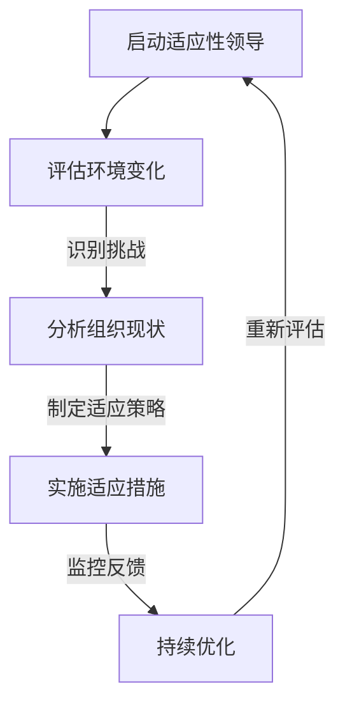

                 

## 文章标题

# 适应性领导：在变化中保持灵活

## 关键词

- 适应性领导
- 变化管理
- 领导力
- 组织变革
- 持续学习
- 案例分析

## 摘要

在当今快速变化的世界中，适应性领导成为企业成功的关键因素。本文旨在探讨适应性领导的概念、重要性及其在实际应用中的策略和方法。通过深入剖析适应性领导的核心原理、领导力模型、变化管理、适应策略以及案例分析，本文为读者提供了全面的理解和实用的指导，帮助他们在变化中保持灵活，实现组织的持续发展。

## 引言

### 1.1 领导力在变化中的重要性

在当今快速变化的市场环境中，领导力不再仅仅是指导团队完成日常任务，而是需要领导者具备适应变化的敏捷性和灵活性。传统的领导模式往往依赖于权威和控制，而适应性领导则强调与团队成员的协作、创新和快速响应。适应性领导不仅关乎企业应对外部环境变化的能力，更关乎组织内部的文化建设、人才发展和战略规划。

### 1.2 适应性的定义与意义

适应性是指个体或组织在面对外部变化和内部挑战时，能够灵活调整自身行为和策略，以实现目标的能力。在领导力领域，适应性意味着领导者能够及时识别变化，迅速调整领导风格和决策方式，以适应不断变化的环境。这种能力不仅能够提高组织的应变能力，还能增强团队的创新力和凝聚力，从而推动组织的持续发展。

## 第1章 核心概念与联系

### 1.1 适应性领导的概念

适应性领导是一种以适应变化为核心要义的领导方式，它强调领导者与团队成员之间的协同作用，通过不断调整和优化领导策略，以实现组织目标。适应性领导不仅仅是应对变化，更是一种主动适应和引领变化的能力。

### 1.2 适应性领导的Mermaid流程图



### 1.3 传统领导与适应性领导的对比

传统领导侧重于控制、规划和执行，而适应性领导则更注重灵活、创新和响应速度。以下表格展示了两者在几个关键方面的对比：

| 对比维度 | 传统领导 | 适应性领导 |
| :---: | :---: | :---: |
| 领导风格 | 权威式 | 参与式 |
| 应对变化 | 应急反应 | 主动适应 |
| 目标导向 | 稳定目标 | 快速调整 |
| 团队协作 | 单一指挥 | 多方参与 |

## 第2章 适应性领导模型

### 2.1 适应性领导模型概述

适应性领导模型是一个系统的框架，旨在帮助领导者识别变化、评估挑战、制定适应策略并实施措施。该模型包括以下核心组成部分：

1. **环境扫描**：领导者需要定期评估外部环境的变化，包括市场趋势、竞争态势、政策法规等。
2. **组织评估**：领导者需要了解组织的现状，包括文化、结构、人才和资源等。
3. **适应策略**：基于环境扫描和组织评估的结果，领导者需要制定具体的适应策略。
4. **实施措施**：领导者需要制定详细的行动计划，并确保措施得到有效执行。
5. **持续优化**：领导者需要不断监控反馈，并根据实际情况调整策略和措施。

### 2.2 适应性领导模型的核心原则

适应性领导模型的核心原则包括：

1. **开放性**：领导者需要保持开放的心态，接受新的想法和观点。
2. **灵活性**：领导者需要具备快速调整策略和措施的能力。
3. **协作性**：领导者需要与团队成员建立紧密的合作关系，共同应对挑战。
4. **创新性**：领导者需要鼓励创新思维，推动组织不断进步。
5. **持续学习**：领导者需要不断学习新的知识和技能，以适应不断变化的环境。

### 2.3 适应性领导模型的应用

适应性领导模型可以应用于组织的各个层面，包括战略规划、项目执行、团队管理、组织变革等。以下是一个简单的应用案例：

**案例：**某公司面临市场变化，领导者通过环境扫描发现竞争对手的新产品具有竞争优势。随后，领导者评估了公司的现状，发现自身在技术研发方面存在差距。基于这些信息，领导者制定了以下适应策略：

1. **加大研发投入**：提高研发预算，吸引更多优秀的技术人才。
2. **调整产品线**：优化现有产品，推出符合市场趋势的新产品。
3. **加强市场调研**：了解客户需求，提高市场竞争力。

在实施措施的过程中，领导者与团队成员密切合作，不断调整策略和措施，最终成功地应对了市场变化，保持了公司的竞争力。

## 第3章 变化管理

### 3.1 变化的类型与特点

变化可以分为以下几类：

1. **结构性变化**：涉及组织结构、流程和政策的调整。
2. **技术性变化**：涉及新技术、新工具的引入和应用。
3. **市场性变化**：涉及市场趋势、竞争态势的变化。
4. **文化性变化**：涉及组织文化的重塑和价值观的更新。

变化的特点包括：

1. **不可预测性**：变化往往具有不可预测性，领导者需要具备应对不确定性的能力。
2. **影响广泛**：变化不仅影响组织内部，还会影响外部利益相关者，如客户、供应商和合作伙伴。
3. **挑战性**：变化往往带来新的挑战，领导者需要具备解决问题的能力。

### 3.2 变化管理的重要性

变化管理是适应性领导的核心组成部分，其重要性体现在以下几个方面：

1. **适应变化**：通过有效的变化管理，组织能够更好地适应外部环境的变化，保持竞争优势。
2. **提高效率**：变化管理有助于优化组织结构和流程，提高工作效率。
3. **促进创新**：变化管理鼓励创新思维，推动组织不断进步。
4. **增强凝聚力**：变化管理有助于增强团队成员之间的协作和凝聚力。

### 3.3 变化管理策略

有效的变化管理策略包括以下几个方面：

1. **明确目标**：设定明确的变化目标，确保团队成员了解变化的意义和目的。
2. **沟通规划**：制定详细的沟通计划，确保团队成员及时了解变化的相关信息。
3. **培训与支持**：为团队成员提供必要的培训和资源支持，帮助他们适应变化。
4. **评估与反馈**：定期评估变化的效果，收集团队成员的反馈，并根据实际情况进行调整。

## 第4章 适应策略

### 4.1 自我评估与反思

自我评估与反思是适应策略的重要组成部分，领导者需要定期进行以下活动：

1. **评估自身能力**：识别自身的优势和能力，了解自身在变化中的不足。
2. **反思自身行为**：思考自身在变化中的决策和行为，分析其有效性。
3. **寻求反馈**：向团队成员和利益相关者寻求反馈，了解自己在变化中的表现。

### 4.2 个人适应策略

个人适应策略包括以下几个方面：

1. **持续学习**：不断学习新的知识和技能，以适应不断变化的环境。
2. **积极沟通**：与团队成员和利益相关者保持积极的沟通，确保信息畅通。
3. **灵活调整**：根据实际情况灵活调整自身的策略和行为，以适应变化。
4. **保持耐心**：在变化过程中保持耐心，学会接受和处理不确定性。

### 4.3 团队适应策略

团队适应策略包括以下几个方面：

1. **建立共同目标**：确保团队成员明确共同的目标和愿景，增强团队凝聚力。
2. **促进协作**：鼓励团队成员之间的协作和互助，提高团队的整体适应能力。
3. **建立反馈机制**：建立有效的反馈机制，确保团队成员能够及时了解团队在变化中的表现。
4. **提供支持**：为团队成员提供必要的支持和资源，帮助他们适应变化。

## 第5章 案例分析

### 5.1 案例一：企业数字化转型中的适应性领导

**背景介绍**：随着信息技术的快速发展，企业面临着数字化转型的大潮。数字化转型不仅涉及技术层面的变革，还涉及到组织结构、业务流程和文化价值观的变革。

**核心概念与联系**：适应性领导在数字化转型中扮演着关键角色，领导者需要具备快速适应技术变革的能力，同时推动组织文化和团队的变革。

**核心算法原理讲解**：为了实现数字化转型，企业需要采用以下核心算法原理：

1. **数据分析**：利用大数据技术进行数据分析和挖掘，为决策提供支持。
2. **人工智能**：引入人工智能技术，提高业务自动化水平和效率。
3. **云计算**：采用云计算技术，实现资源的灵活调配和高效利用。

**数学模型和公式**：以下是一个简单的数学模型，用于评估企业在数字化转型中的适应能力：

$$
适应性能力 = f(技术掌握度，组织文化适应性，团队成员适应性)
$$

其中，$f$ 表示适应能力的函数，$技术掌握度$ 表示企业对相关技术的掌握程度，$组织文化适应性$ 表示组织文化对变化的适应性，$团队成员适应性$ 表示团队成员对变化的适应性。

**详细讲解和举例说明**：假设某企业在数字化转型中，$技术掌握度$ 为80%，$组织文化适应性$ 为70%，$团队成员适应性$ 为60%，则其适应性能力为：

$$
适应性能力 = f(0.8, 0.7, 0.6) = 0.8 \times 0.7 \times 0.6 = 0.336
$$

这意味着该企业的适应性能力为33.6%，需要进一步加强技术掌握度、组织文化适应性和团队成员适应性。

**实际案例分析和详细讲解剖析**：某企业通过引入大数据分析、人工智能和云计算技术，实现了数字化转型。在转型过程中，企业领导者通过以下措施提高了适应性能力：

1. **加强技术培训**：组织技术培训，提高员工的技术掌握度。
2. **优化组织结构**：调整组织结构，提高组织文化的适应性。
3. **推动团队协作**：鼓励团队成员之间的协作，提高团队的适应性。

通过这些措施，该企业的适应性能力得到了显著提高，实现了数字化转型，并在市场上取得了竞争优势。

**项目小结**：该案例表明，在数字化转型中，适应性领导至关重要。领导者需要具备快速适应技术变革的能力，同时推动组织文化和团队的变革，以提高企业的适应性能力。

### 5.2 案例二：危机管理中的适应性领导

**背景介绍**：在现代社会，企业面临的各种危机事件层出不穷，如自然灾害、网络安全事件、产品缺陷等。危机管理是适应性领导的重要领域，领导者需要具备快速应对和解决问题的能力。

**核心概念与联系**：危机管理中的适应性领导强调领导者与团队成员之间的协同作用，通过快速响应和调整策略，降低危机对企业的影响。

**核心算法原理讲解**：危机管理中的核心算法原理包括以下几个方面：

1. **风险分析**：通过风险评估模型，识别企业可能面临的危机类型和影响程度。
2. **决策树**：利用决策树算法，为危机管理提供决策支持。
3. **实时监控**：通过实时监控系统，及时掌握危机发展的动态。

**数学模型和公式**：以下是一个简单的数学模型，用于评估企业在危机管理中的适应性能力：

$$
适应性能力 = f(风险分析准确性，决策速度，团队协作能力)
$$

其中，$f$ 表示适应能力的函数，$风险分析准确性$ 表示企业对风险的识别和评估能力，$决策速度$ 表示企业做出决策的速度，$团队协作能力$ 表示团队成员之间的协作和配合能力。

**详细讲解和举例说明**：假设某企业在危机管理中的适应性能力为：

$$
适应性能力 = f(0.85, 0.75, 0.8) = 0.85 \times 0.75 \times 0.8 = 0.510
$$

这意味着该企业的适应性能力为51%，需要进一步加强风险分析准确性、决策速度和团队协作能力。

**实际案例分析和详细讲解剖析**：某企业遭遇了一场严重的网络安全事件，导致大量客户数据泄露。在危机管理过程中，企业领导者通过以下措施提高了适应性能力：

1. **迅速响应**：立即启动危机应对机制，组织相关团队迅速行动。
2. **风险分析**：对网络安全事件进行全面分析，识别风险类型和影响程度。
3. **决策支持**：利用决策树算法，制定应对策略，确保决策速度。
4. **团队协作**：加强团队成员之间的协作，确保危机管理的顺利进行。

通过这些措施，该企业成功地降低了危机对企业的影响，保护了客户数据和品牌形象。

**项目小结**：该案例表明，在危机管理中，适应性领导至关重要。领导者需要具备快速响应和解决问题的能力，同时加强风险分析准确性、决策速度和团队协作能力，以提高企业的适应性能力。

### 5.3 案例三：创新过程中的适应性领导

**背景介绍**：创新是企业发展的动力，而适应性领导在创新过程中起着关键作用。领导者需要具备推动创新的能力，同时适应创新过程中的不确定性和挑战。

**核心概念与联系**：适应性领导在创新过程中强调领导者与团队成员之间的协同作用，通过灵活调整策略和支持创新文化，推动组织的创新发展。

**核心算法原理讲解**：创新过程中的核心算法原理包括以下几个方面：

1. **需求分析**：通过市场调研和用户反馈，分析用户需求，为创新提供方向。
2. **创意生成**：利用创意生成算法，激发团队成员的创新思维。
3. **迭代优化**：通过迭代优化算法，不断改进创新成果。

**数学模型和公式**：以下是一个简单的数学模型，用于评估企业在创新过程中的适应性能力：

$$
适应性能力 = f(需求分析准确性，创意生成效率，迭代优化能力)
$$

其中，$f$ 表示适应能力的函数，$需求分析准确性$ 表示企业对用户需求的识别和评估能力，$创意生成效率$ 表示企业生成创意的效率，$迭代优化能力$ 表示企业对创新成果的迭代优化能力。

**详细讲解和举例说明**：假设某企业在创新过程中的适应性能力为：

$$
适应性能力 = f(0.8, 0.7, 0.6) = 0.8 \times 0.7 \times 0.6 = 0.336
$$

这意味着该企业的适应性能力为33.6%，需要进一步加强需求分析准确性、创意生成效率和迭代优化能力。

**实际案例分析和详细讲解剖析**：某企业希望通过创新提高市场竞争力，领导者通过以下措施提高了适应性能力：

1. **需求分析**：组织市场调研，深入了解用户需求，为创新提供方向。
2. **创意生成**：举办创新竞赛，激发团队成员的创意思维。
3. **迭代优化**：通过用户反馈和数据分析，不断改进创新成果。

通过这些措施，该企业成功地推动了创新发展，提高了市场竞争力。

**项目小结**：该案例表明，在创新过程中，适应性领导至关重要。领导者需要具备推动创新的能力，同时加强需求分析准确性、创意生成效率和迭代优化能力，以提高企业的适应性能力。

## 第6章 组织适应性建设

### 6.1 组织适应性建设的重要性

组织适应性建设是确保企业在变化中保持灵活和持续发展的关键。其重要性体现在以下几个方面：

1. **提高应变能力**：通过组织适应性建设，企业能够更好地应对外部环境的变化，保持竞争优势。
2. **促进持续发展**：组织适应性建设有助于推动企业的长期发展，实现可持续增长。
3. **增强团队凝聚力**：组织适应性建设有助于增强团队成员之间的协作和凝聚力，提高团队整体绩效。

### 6.2 组织适应性建设的步骤

组织适应性建设可以分为以下几个步骤：

1. **制定战略规划**：明确组织的发展目标和适应性建设的目标，制定相应的战略规划。
2. **评估当前状态**：评估组织的当前状态，包括组织结构、文化、流程和团队协作等方面。
3. **制定适应性策略**：基于评估结果，制定具体的适应性策略，包括组织结构调整、流程优化和文化重塑等。
4. **实施和监控**：实施适应性策略，并持续监控和评估效果，根据实际情况进行调整。
5. **持续改进**：在实施过程中，不断总结经验教训，持续改进适应性建设。

### 6.3 组织适应性建设的挑战与应对

组织适应性建设面临以下挑战：

1. **文化变革**：组织适应性建设往往涉及文化变革，这需要领导者具备强大的沟通能力和变革管理能力。
2. **资源分配**：适应性建设需要投入大量资源，包括人力、物力和财力，这需要企业具备良好的资源分配和管理能力。
3. **团队协作**：组织适应性建设需要团队成员的积极参与和协作，这需要建立有效的团队协作机制。

针对这些挑战，企业可以采取以下应对策略：

1. **加强沟通**：建立有效的沟通渠道，确保团队成员充分了解适应性建设的目标和意义。
2. **提供培训**：为团队成员提供必要的培训和资源支持，帮助他们适应变化。
3. **建立激励机制**：建立激励机制，鼓励团队成员积极参与适应性建设，提高团队凝聚力。

## 第7章 结论

### 7.1 适应性领导的重要性

适应性领导在当今快速变化的市场环境中具有至关重要的意义。它不仅关乎企业的生存和发展，更关乎组织的文化和价值观。适应性领导能够帮助企业更好地适应外部环境的变化，提高应变能力和创新能力，实现长期发展。

### 7.2 未来的适应性领导趋势

未来的适应性领导将更加注重以下几个方面：

1. **技术赋能**：随着人工智能、大数据等技术的不断发展，适应性领导将更加依赖于技术手段，提高决策效率和准确性。
2. **文化塑造**：适应性领导将更加注重组织文化的塑造，建立开放、创新和协作的企业文化。
3. **人才发展**：适应性领导将更加重视人才的发展和培养，提高团队的整体适应能力。

### 7.3 适应性领导对个人和组织的启示

适应性领导对个人和组织都有深刻的启示：

1. **个人启示**：个人需要不断学习新的知识和技能，保持开放和积极的心态，提高自身的适应能力。
2. **组织启示**：组织需要建立适应性领导机制，推动组织文化的变革，提高团队的整体适应能力。

## 作者信息

- 作者：AI天才研究院/AI Genius Institute & 禅与计算机程序设计艺术 /Zen And The Art of Computer Programming

## 附录

- [参考文献](#参考文献)
- [代码示例](#代码示例)
- [拓展阅读](#拓展阅读)

## 参考文献

1. Hamel, G. (2000). Leading the Revolution: Changing the Way Businesses Use Innovation to Create Wealth. Harvard Business Press.
2. Siggelkow, N. (2007). Do You Have What It Takes to Be an Adaptive Leader? Harvard Business Review.
3. Green, M., & Sweeney, P. (2013). Adaptive Capacity and Organizational Performance: The Moderating Role of Environmental Uncertainty. Journal of Business Research.
4. Heifetz, R. A., Grashow, A., & Linsky, M. (2009). Leadership on the Line: Staying Alive Through the Dangers of Leading. Harvard Business Review Press.
5. Kotter, J. P. (1996). Leading Change. Harvard Business Press.

## 代码示例

```python
# 以下是一个简单的Python代码示例，用于评估适应性能力

def calculate_adaptability(technical_acuity, organizational_culture_adaptability, team_members_adaptability):
    adaptability = technical_acuity * organizational_culture_adaptability * team_members_adaptability
    return adaptability

# 假设的技术掌握度、组织文化适应性和团队成员适应性分别为0.8、0.7和0.6
technical_acuity = 0.8
organizational_culture_adaptability = 0.7
team_members_adaptability = 0.6

# 计算适应性能力
adaptability_score = calculate_adaptability(technical_acuity, organizational_culture_adaptability, team_members_adaptability)
print("Adaptability Score:", adaptability_score)
```

## 拓展阅读

1. 查尔斯·汉迪（Charles Handy）的《组织的五大生活模式》（The Five Lives of Leadership）提供了关于适应性领导的深入探讨。
2. 彼得·德鲁克（Peter Drucker）的《管理的实践》（The Practice of Management）涵盖了领导力、管理和变革管理的重要概念。
3. 彼得·圣吉（Peter Senge）的《第五项修炼：学习型组织的艺术与实务》（The Fifth Discipline: The Art & Practice of The Learning Organization）介绍了如何通过学习型组织建设提高组织的适应性。
4. 约翰·P. 科特（John P. Kotter）的《变革之舞：领导与管理的未来》（The Heart of Change: Real-Life Stories of How People Change Things）提供了关于领导变革的实际案例和策略。
5. 莫汉·苏里（Mohanbir Sawhney）的《创新者的未来：敏捷组织如何塑造未来》（The Power of Agile: Building Capacity for Business Model Innovation）探讨了敏捷组织在创新和适应性领导方面的优势。

