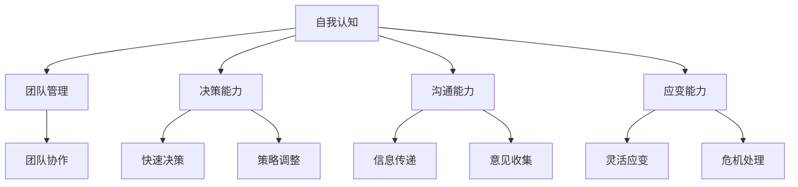

                 

### 文章标题：逆境领导学：转危为机的管理智慧

逆境领导学是一门探究在不利环境中如何通过有效的管理策略和领导力，将危机转化为机遇的重要学科。在当今快速变化且充满不确定性的商业环境中，逆境领导显得尤为重要。本文将深入探讨逆境领导学的核心概念、理论模型、策略与方法，并通过实践案例展示其在实际中的应用。

**关键词**：逆境领导、危机管理、领导力模型、策略与方法、实践案例

**摘要**：本文首先介绍了逆境领导学的背景和重要性，然后详细阐述了核心概念与理论模型，包括领导力模型、关键原则和理论基础。接着，文章探讨了逆境领导的策略与方法，以及如何激发团队动力。最后，通过两个实践案例，展示了逆境领导在现实环境中的应用和效果。本文旨在为读者提供系统且实用的逆境领导学知识，帮助他们在面对挑战时能够更加从容应对。

### 引言

#### 书籍背景与目的

在全球化和技术迅猛发展的背景下，企业面临着前所未有的挑战和机遇。市场波动、竞争加剧、技术变革等不确定因素不断涌现，使得企业在发展的过程中难免会遇到逆境。在这种环境下，如何通过有效的领导和管理策略，将逆境转化为机遇，成为企业持续发展的关键。

本书旨在探讨逆境领导学，帮助读者了解和掌握在逆境中有效领导的方法和策略。通过对核心概念、理论模型、策略与方法的深入剖析，以及实际案例的讲解，本书希望能够为企业管理者提供实用的指导，使他们能够更好地应对逆境，实现企业的长期发展。

#### 逆境领导的重要性

逆境领导的重要性主要体现在以下几个方面：

1. **提升组织韧性**：在逆境中，领导者的决策和行动对组织的生存和发展起着决定性作用。通过有效的逆境领导，可以增强组织的韧性和适应能力，使其在面临挑战时能够迅速调整和恢复。

2. **激发团队潜力**：逆境往往能够激发团队成员的潜力，使他们在面对困难时更加团结和积极。领导者需要运用合适的策略和方法，激发团队的动力，共同应对挑战。

3. **创造新的机遇**：逆境中蕴含着机遇，领导者需要具备敏锐的洞察力和前瞻性，善于发现和利用逆境中的机会，实现企业的转型和升级。

4. **提升领导力**：逆境领导是一种重要的领导力表现形式，它要求领导者具备高度的决策能力、沟通能力和应变能力。通过应对逆境，领导者可以不断提升自己的领导水平，为未来的发展奠定基础。

### 核心概念与理论

#### 逆境领导概述

逆境领导是指在不利环境中，领导者通过有效的管理策略和领导力，激发团队潜力，将危机转化为机遇的过程。它不仅关注危机的应对，更强调如何在逆境中找到新的发展机会。

#### 逆境领导力模型

为了更好地理解逆境领导，我们需要构建一个领导力模型，该模型包括以下几个核心要素：

1. **领导者的自我认知**：领导者需要深入理解自己的价值观、能力和局限性，以便在逆境中做出正确的决策。

2. **团队管理**：领导者需要建立高效的团队，确保团队成员在逆境中能够紧密协作，共同应对挑战。

3. **决策能力**：在逆境中，领导者需要具备快速决策和调整的能力，以便迅速应对变化。

4. **沟通能力**：良好的沟通是领导者成功的关键。领导者需要能够清晰、准确地传达信息，并倾听团队成员的意见和建议。

5. **应变能力**：领导者需要具备灵活的应变能力，能够迅速调整策略和行动，以应对不确定性和突发情况。

#### 领导力模型解析（Mermaid流程图）

以下是一个简单的Mermaid流程图，用于解析逆境领导力模型：

#### 关键原则

1. **积极应对变化**：领导者需要积极面对变化，主动寻找机会，而非被动应对挑战。

2. **增强组织韧性**：通过建立有效的组织结构和流程，增强组织的韧性和适应能力。

3. **激发团队潜力**：领导者需要善于发现和挖掘团队成员的潜力，鼓励他们发挥最大价值。

4. **创新思维**：逆境中，领导者需要鼓励创新思维，寻找新的解决方案，以应对挑战。

#### 理论基础

1. **心理学**：心理学研究显示，逆境中的情绪和行为对个体和组织都有重要影响。领导者需要理解这些心理学原理，以更好地应对逆境。

2. **组织行为学**：组织行为学研究团队和领导者的相互作用，以及这些因素如何影响组织的绩效和适应性。

3. **社会学**：社会学视角下的逆境领导研究关注领导者如何在社会环境中发挥作用，以及如何通过社会网络和资源管理来应对逆境。

### 逆境领导策略与方法

在应对逆境时，领导者需要运用一系列策略和方法，以确保组织能够在不利环境中生存并发展。以下是一些核心策略和方法：

#### 制定逆境管理策略

1. **识别危机**：首先，领导者需要准确识别和评估当前的危机，了解其性质和影响范围。

2. **制定应对计划**：基于对危机的评估，领导者需要制定具体的应对计划，包括短期和长期的措施。

3. **资源分配**：确保资源（人力、物力、财力）得到合理分配，以支持应对计划的实施。

4. **沟通协调**：在实施应对计划过程中，领导者需要保持与团队成员的密切沟通，确保信息畅通。

#### 应对危机的领导策略

1. **快速响应策略**：在危机爆发时，领导者需要迅速采取行动，以减少危机对组织的影响。

2. **风险缓解策略**：通过识别和评估潜在的风险，领导者需要制定相应的缓解措施，以降低风险发生的可能性。

3. **持续改进策略**：在危机应对过程中，领导者需要不断评估和调整策略，以实现持续改进。

#### 激发团队动力的方法

1. **领导风格调整**：领导者需要根据团队的特点和需求，调整自己的领导风格，以更好地激发团队动力。

2. **激励机制设计**：通过设计合适的激励机制，领导者可以鼓励团队成员在逆境中发挥更大的潜力。

3. **增强团队协作**：领导者需要建立高效的团队协作机制，确保团队成员在逆境中能够紧密配合，共同应对挑战。

### 逆境领导实践案例

为了更好地理解逆境领导的应用，我们来看两个实践案例。

#### 案例一：公司A的危机应对

**背景**：公司A是一家全球知名的高科技公司，由于市场变化和竞争对手的激烈竞争，公司面临严重的危机。

**领导策略与方法**：
- **快速响应**：公司CEO立即召开紧急会议，分析危机的原因和影响，制定应对计划。
- **资源调配**：调整公司资源分配，将更多资金和人力投入到关键领域。
- **沟通协调**：通过内部邮件和会议，及时向全体员工传达危机情况和应对措施，确保信息畅通。

**结果与评估**：通过有效的危机应对，公司成功度过了危机，并逐渐恢复了市场竞争力。

#### 案例二：行业B的逆境转型

**背景**：行业B由于技术变革和市场需求变化，面临着巨大的压力。

**领导策略与方法**：
- **创新思维**：行业领导者鼓励团队成员提出创新性的解决方案，以应对市场变化。
- **组织重构**：对组织结构进行重构，提高组织的灵活性和适应性。
- **合作共赢**：与其他企业建立战略合作伙伴关系，共同应对市场挑战。

**结果与评估**：通过创新和合作，行业B成功地实现了转型，并找到了新的发展机遇。

### 结论与展望

逆境领导学是一门重要的学科，它为企业在面对逆境时提供了有效的指导。通过本文的探讨，我们了解了逆境领导的核心概念、理论模型、策略与方法，并通过实践案例展示了其在实际中的应用。未来，随着环境的变化和发展，逆境领导学将继续发挥着重要的作用。

### 附录

#### 相关工具与技术

- **Mermaid**：用于绘制流程图和序列图。
- **Markdown**：用于编写和格式化文章。
- **LaTeX**：用于编写数学公式和科学文档。

#### 推荐阅读

- 《领导者的语言》
- 《危机管理》
- 《第五项修炼》

#### 参考文献

- [领导力与危机管理相关文献]
- [组织行为学相关文献]
- [心理学相关文献]

### 总结

逆境领导学为企业在面对逆境时提供了有力的指导。通过本文的探讨，我们不仅了解了逆境领导的核心概念和策略，还通过实践案例看到了其在实际中的应用效果。希望读者能够运用这些知识和方法，在实际工作中更好地应对逆境，实现企业的持续发展。

### 作者信息

**作者：AI天才研究院/AI Genius Institute & 禅与计算机程序设计艺术 /Zen And The Art of Computer Programming**

