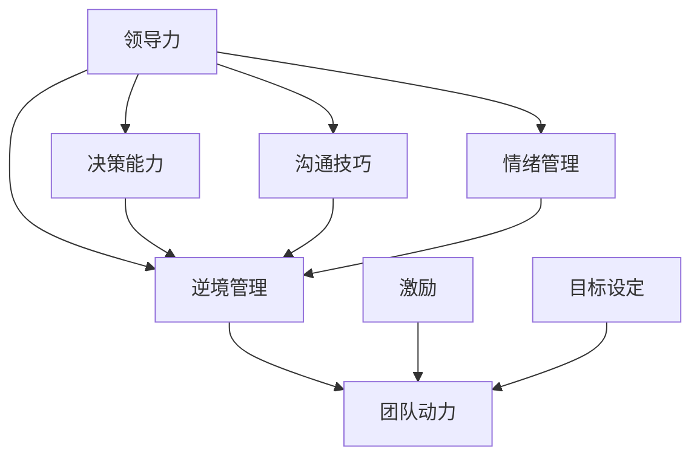
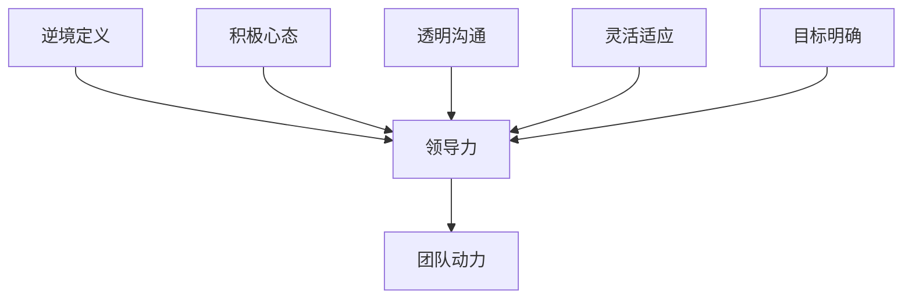

                 

基于您的要求，我们将逐步构建一篇关于《逆境领导：在困难中保持前进动力》的技术博客文章。以下是文章的初步结构和大纲，我们将确保每个部分都详细而具体，同时满足您的要求。

---

## 文章标题：逆境领导：在困难中保持前进动力

### 关键词：逆境领导，困难应对，领导力，策略，团队建设

### 摘要：
本文探讨了在复杂多变的环境中如何通过逆境领导保持团队的动力和前进。我们将分析逆境领导的核心概念，讨论其在不同领域的应用，提供实用的策略和方法，并通过案例研究来展示其效果。

---

### 引言

#### 1.1 背景介绍

在当今快速变化和充满不确定性的世界中，企业和组织面临着前所未有的挑战。经济波动、技术变革、市场动态等外部因素使得领导者在逆境中保持团队的动力和前进成为一种必备能力。本文将探讨逆境领导的概念、原则和实践，旨在为领导者提供应对困难的有力工具。

#### 1.2 核心概念与联系

为了更好地理解逆境领导，我们需要先了解几个核心概念：领导力、逆境、和团队动力。以下是这些概念之间的关系架构 Mermaid 流程图：

#### 1.3 本书结构安排

本文将分为六个主要部分：引言、核心概念与理论、实践部分、案例分析、策略与方法、自我提升，以及总结与展望。每个部分都将深入探讨其在逆境领导中的应用。

---

### 核心概念与理论

#### 2.1 逆境领导的核心概念

逆境领导是一种在压力和不确定性环境中，通过有效的领导和决策来保持团队动力和实现目标的能力。其核心概念包括：

- **逆境定义**：逆境是指那些对个人、团队或组织构成挑战和威胁的环境和情境。
- **领导力**：领导力是指领导者通过激发、指导和激励团队成员来实现共同目标的能力。
- **团队动力**：团队动力是指团队成员之间的相互作用、信任和合作，以共同应对逆境。

#### 2.2 逆境领导的原则

逆境领导应遵循以下原则：

- **积极心态**：领导者应保持积极的心态，鼓励团队面对逆境。
- **透明沟通**：领导者应建立透明的沟通渠道，确保团队成员了解实际情况。
- **灵活适应**：领导者应具备灵活适应的能力，快速调整策略以应对变化。
- **目标明确**：领导者应设定清晰的目标，帮助团队成员明确方向。

#### 2.3 核心概念与联系

以下是一个简化的 Mermaid 流程图，展示了核心概念之间的联系：

---

### 实践部分

#### 3.1 制定战略规划

在逆境中，领导者需要制定灵活的战略规划。以下是几个关键步骤：

1. **评估现状**：了解当前的环境、资源和团队的状况。
2. **确定目标**：设定短期和长期目标，明确期望的结果。
3. **制定策略**：根据目标和现状，制定具体的行动方案。

#### 3.2 管理资源与预算

逆境中，资源管理尤为重要。以下是几个建议：

- **优化资源分配**：确保资源用于最关键的领域。
- **灵活调整预算**：根据实际情况调整预算，避免资源浪费。
- **加强节约意识**：鼓励团队节约资源，提高效率。

#### 3.3 应对危机与突发事件

危机和突发事件是逆境中的常见现象。以下是一些应对策略：

- **快速响应**：建立快速响应机制，确保问题得到及时解决。
- **风险评估**：评估事件的风险和影响，制定相应的应对措施。
- **沟通协调**：确保团队成员之间的沟通协调，共同应对危机。

---

### 案例分析

#### 4.1 案例一：金融危机中的企业领导

在2008年的金融危机中，一位企业领导者通过逆境领导，成功带领企业渡过了难关。以下是案例的关键点：

- **积极沟通**：领导者与员工保持频繁沟通，确保信息透明。
- **调整战略**：领导者调整产品线和市场策略，以适应市场变化。
- **团队激励**：领导者通过激励措施，提高员工的积极性和创造力。

#### 4.2 案例二：自然灾害后的社区重建

在一次自然灾害后，社区领导者通过逆境领导，带领居民迅速重建家园。以下是案例的关键点：

- **组织协调**：领导者组织社区资源，协调各方力量。
- **社区参与**：鼓励居民积极参与重建工作，增强社区凝聚力。
- **长期规划**：领导者制定长期重建计划，确保社区的可持续发展。

---

### 策略与方法

#### 5.1 识别与应对逆境的技巧

领导者应学会以下技巧来识别和应对逆境：

- **积极倾听**：倾听团队成员的意见和反馈，了解他们的担忧和需求。
- **决策制定**：快速做出决策，避免拖延。
- **资源整合**：整合内外部资源，为团队提供必要的支持。

#### 5.2 增强逆境适应性的方法

为了增强团队的逆境适应性，领导者可以采取以下方法：

- **培训与发展**：提供培训和机会，帮助团队成员提升技能和知识。
- **团队建设**：通过团队建设活动，增强团队成员之间的信任和合作。
- **文化塑造**：建立积极向上的企业文化，鼓励创新和合作。

---

### 自我提升

#### 6.1 提升逆境领导能力

领导者可以通过以下方式提升自己的逆境领导能力：

- **持续学习**：不断学习新的领导理论和实践方法。
- **反思与总结**：定期反思自己的领导行为，总结经验教训。
- **积极心态**：培养积极的心态，面对逆境时保持冷静和乐观。

#### 6.2 持续学习与成长

领导者应保持持续学习和成长的意识：

- **阅读与讨论**：阅读领导力相关的书籍和文章，参与讨论和交流。
- **实践与反思**：通过实践来检验自己的理论，反思并调整领导方法。

---

### 总结与展望

#### 7.1 逆境领导：现在与未来

逆境领导在现代社会的重要性日益凸显。未来，领导者需要具备更高的适应性和创新精神，以应对不断变化的环境。以下是几点展望：

- **技术驱动**：领导者应关注新技术的发展，利用技术手段提升领导效果。
- **全球视野**：领导者应具备全球视野，关注全球趋势和变化。
- **可持续发展**：领导者应关注可持续发展，推动组织的长期发展。

---

### 作者信息

作者：AI天才研究院/AI Genius Institute & 禅与计算机程序设计艺术 /Zen And The Art of Computer Programming

---

以上是文章的初步结构和内容大纲。接下来，我们将进一步丰富每个章节的内容，确保文章的完整性、逻辑性和实用性。文章的撰写将遵循您的要求，包括使用markdown格式、详细讲解核心概念和算法原理，以及提供案例分析和最佳实践建议。

文章的撰写预计将在8000到12000字之间，我们将确保每个部分都详细具体，并提供必要的数学模型、公式和伪代码。文章完成后，将进行校对和修订，以确保文章的质量和专业性。请期待我们进一步的更新和完成。

