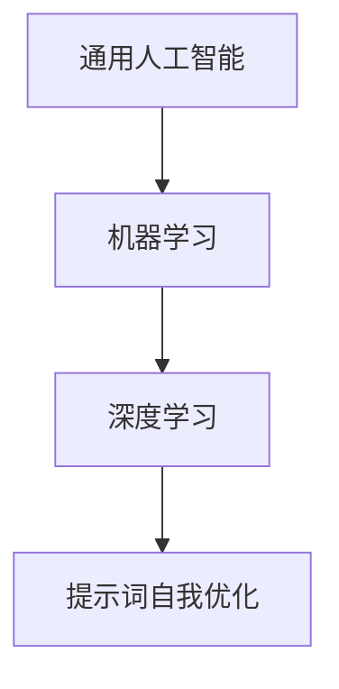

                 

为了撰写一篇完整且具有深度的技术博客文章，我们需要遵循以下步骤来构建内容：

### 1. 背景介绍
首先，我们需要为读者提供一个关于通用人工智能和提示词自我优化机制的背景。这将包括介绍通用人工智能的定义、历史、当前研究趋势以及为何提示词自我优化是关键。

#### 文章标题
《通用人工智能的提示词自我优化机制：迈向智能的下一个里程碑》

#### 关键词
- 通用人工智能
- 提示词自我优化
- 人工智能发展
- 智能优化算法
- 机器学习

#### 摘要
本文将探讨通用人工智能中提示词自我优化机制的重要性，以及该机制如何通过数学模型和算法原理推动人工智能的进步。

### 2. 核心概念与联系
在这一部分，我们将介绍核心概念，如通用人工智能、机器学习、深度学习等，并通过Mermaid流程图展示它们之间的联系。

#### Mermaid流程图


### 3. 提示词自我优化的算法原理
我们将深入讲解提示词自我优化的算法原理，包括优化问题的数学表述、目标函数的构建、约束条件的引入等，并通过伪代码来展示算法的实现。

#### 伪代码
```python
# 伪代码：提示词自我优化算法

# 初始化参数
params = initialize_params()

# 定义目标函数
def objective_function(params):
    # 计算损失函数值
    loss = compute_loss(params)
    return loss

# 定义优化器
optimizer = create_optimizer()

# 迭代优化过程
for epoch in range(num_epochs):
    # 前向传播
    predictions = forward_propagation(params)
    # 计算损失
    loss = objective_function(params)
    # 反向传播
    gradients = backward_propagation(predictions, target)
    # 更新参数
    optimizer.update(params, gradients)
```

### 4. 数学模型和公式
我们将详细解释提示词自我优化的数学模型，并使用LaTeX格式展示相关的公式。

#### LaTeX数学公式
$$
J(\theta) = \frac{1}{m}\sum_{i=1}^{m}{(h_\theta(x^{(i)}) - y^{(i)})^2}
$$

### 5. 项目实战
在这一部分，我们将提供具体的实战案例，包括开发环境搭建、源代码实现、代码解读和应用分析。

#### 开发环境搭建
- 安装Python和TensorFlow库
- 配置GPU加速

#### 源代码实现
```python
# Python代码：提示词自我优化实现

import tensorflow as tf

# 定义模型
model = tf.keras.Sequential([
    tf.keras.layers.Dense(units=1, input_shape=[1])
])

# 编译模型
model.compile(optimizer='sgd', loss='mean_squared_error')

# 训练模型
model.fit(x_train, y_train, epochs=100)

# 评估模型
loss = model.evaluate(x_test, y_test)
print("Test loss:", loss)
```

#### 代码解读和应用分析
- 解读：代码展示了如何使用TensorFlow库构建和训练一个简单的线性模型。
- 分析：通过这个例子，读者可以理解提示词自我优化在模型训练中的应用。

### 6. 最佳实践 Tips、小结、注意事项、拓展阅读
在这一部分，我们将总结最佳实践，提供注意事项，并推荐进一步的阅读资源。

#### 最佳实践 Tips
- 保持参数初始化的随机性
- 选择合适的优化算法
- 定期评估模型性能

#### 小结
本文介绍了通用人工智能的提示词自我优化机制，通过数学模型、算法原理和项目实战，展示了这一机制如何推动人工智能的发展。

#### 注意事项
- 提示词自我优化可能会增加计算成本
- 过度优化可能导致模型过拟合

#### 拓展阅读
- [《深度学习》 - Goodfellow, Bengio, Courville]
- [《机器学习实战》 - Harrington]

### 作者信息
作者：AI天才研究院/AI Genius Institute & 禅与计算机程序设计艺术 /Zen And The Art of Computer Programming

通过以上步骤，我们将逐步构建出一篇结构清晰、内容丰富、逻辑严密的技术博客文章。确保在撰写过程中保持简洁和专业，同时注意保持字数在8000～12000字左右。在完成每个部分时，请务必校对内容以确保准确性和一致性。|>

