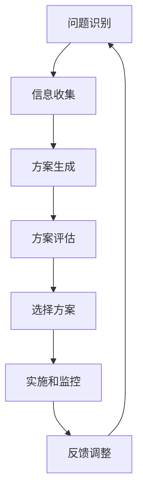

                 

### 文章标题

《集体决策优化：发挥团队智慧》

### 关键词

- 集体决策
- 团队智慧
- 数据分析
- 算法优化
- 案例分析

### 摘要

本文旨在探讨集体决策优化在团队工作中的重要性，通过分析集体决策的基础理论、团队协作与沟通、集体决策优化技术以及实际案例分析，揭示如何通过发挥团队智慧，实现集体决策的优化。文章首先介绍了集体决策的基本概念和模型，随后深入探讨了团队协作与沟通的障碍及解决策略，接着展示了集体决策优化技术，并通过具体案例进行了实践分析。最后，文章对未来集体决策优化的发展趋势进行了展望，以期为读者提供全面而深入的洞察。

---

# 引言

在当今快速发展的科技时代，集体决策在企业和组织中扮演着至关重要的角色。随着团队规模的扩大和工作复杂性的增加，单一决策者难以应对日益多样化的挑战，因此，如何通过集体智慧进行优化决策成为了一项重要的研究课题。集体决策优化不仅能够提高决策的效率和质量，还能增强团队的凝聚力和创新力。

本文将从以下几个方面展开讨论：首先，我们将介绍集体决策的基本概念和模型，包括其定义、类型和流程。接着，我们将探讨团队协作与沟通的障碍及其克服策略，解释如何通过有效的团队协作和沟通来提升集体决策的效率。随后，我们将详细介绍集体决策优化技术，包括数据分析、算法优化和集体决策支持系统。在此基础上，我们将通过具体案例展示集体决策优化的实践应用，分析其实施效果和影响。最后，本文将对未来集体决策优化的发展趋势进行展望，探讨新技术对集体决策的影响以及面临的挑战。

通过本文的讨论，我们希望读者能够深刻理解集体决策优化的核心概念和实际应用，掌握提升团队智慧和决策质量的方法，从而在工作和生活中更好地发挥团队智慧，实现高效的集体决策。

## 第一部分：集体决策基础理论

### 1.1 集体决策概述

集体决策，是指在多个个体共同参与下，通过讨论、分析、评估和选择，达成一致意见的决策过程。与个体决策相比，集体决策具有以下显著特点：

1. **参与广泛**：集体决策的参与者通常包括多个个体，代表不同的利益和观点，使得决策更加全面和多元化。
2. **协调复杂**：在集体决策过程中，需要协调各方的利益和意见，达成一致，这一过程往往充满挑战。
3. **效果显著**：通过集体智慧，集体决策能够更好地应对复杂和多变的环境，提高决策质量和实施效果。

集体决策的类型主要可以分为以下几种：

1. **民主决策**：每个参与者都有平等的发言权和投票权，决策结果基于多数人的意见。
2. **领导决策**：由一个或多个领导者做出决策，其他成员参与讨论但不具有决定权。
3. **混合决策**：结合了民主决策和领导决策的特点，部分决策由全体成员参与，部分决策由领导者做出。

集体决策的重要性体现在以下几个方面：

1. **提高决策质量**：通过集体讨论，可以挖掘出更多潜在的信息和见解，提高决策的准确性和全面性。
2. **增强团队凝聚力**：集体决策过程中，成员之间的互动和协作能够增强团队的凝聚力，提升团队的整体效率。
3. **提升组织适应能力**：在快速变化的市场环境中，集体决策能够更好地应对不确定性和挑战，提高组织的适应能力。

### 1.2 集体决策模型

集体决策模型是研究集体决策过程和机制的理论框架，常见的集体决策模型包括：

1. **多准则决策模型**：在多准则决策中，决策者需要考虑多个相互冲突的目标和标准，进行综合评估和选择。常见的多准则决策模型有TOPSIS（ Technique for Order of Preference by Similarity to Ideal Solution）、AHP（Analytic Hierarchy Process）等。
2. **博弈论模型**：博弈论模型用于分析多个参与者之间的互动和竞争，研究如何通过策略选择来实现自身利益的最大化。常见的博弈论模型有纳什均衡、合作博弈等。
3. **风险评估模型**：在集体决策中，风险评估模型用于分析决策可能带来的风险和不确定性，常见的风险评估模型有决策树分析、蒙特卡罗模拟等。

这些模型不仅为集体决策提供了理论支持，还能够通过数学和计算方法，帮助决策者更好地理解和分析集体决策的过程和结果。

### 1.3 集体决策流程

集体决策流程通常包括以下几个步骤：

1. **问题识别**：明确决策目标和问题，确定决策需要解决的问题和要达成的目标。
2. **信息收集**：收集与决策相关的信息，包括数据、报告、专家意见等，确保决策有充分的信息支持。
3. **方案生成**：通过头脑风暴、专家讨论等方法，生成多个可能的决策方案。
4. **方案评估**：对各个方案进行评估和比较，考虑各方案的风险、成本、效果等。
5. **选择方案**：根据评估结果，选择最优或最合适的方案。
6. **实施和监控**：执行决策方案，并对实施过程进行监控和调整，确保决策目标的实现。

### Mermaid 流程图

下面是一个简化的集体决策流程Mermaid流程图：



### 1.4 集体决策的关键要素

为了确保集体决策的有效性，以下要素至关重要：

1. **决策质量**：决策质量是集体决策的核心目标，包括决策的准确性、全面性和时效性。
2. **团队协作**：良好的团队协作是集体决策成功的关键，团队成员之间需要开放沟通、共同协作。
3. **决策支持系统**：决策支持系统（DSS）能够提供数据分析和计算工具，辅助决策过程。
4. **决策机制**：合理的决策机制能够确保决策过程的公正性和透明性，减少偏见和冲突。

### 总结

通过上述讨论，我们可以看到，集体决策不仅是团队决策的核心，也是组织成功的关键。理解集体决策的基础理论和模型，掌握其流程和关键要素，能够帮助我们更好地发挥团队智慧，优化决策过程，提升决策质量。

---

**总结**：在第一部分中，我们介绍了集体决策的基础理论，包括其定义、类型、流程以及关键要素。我们通过Mermaid流程图展示了集体决策的流程，明确了问题识别、信息收集、方案生成、方案评估、选择方案以及实施和监控等步骤。通过理解这些基础理论，我们可以为后续的团队协作和决策优化提供坚实的理论基础。

## 第二部分：团队协作与沟通

### 2.1 团队协作模式

团队协作是集体决策成功的关键，有效的团队协作模式能够提高团队的整体效率和决策质量。以下是一些常见的团队协作模式：

1. **功能型团队**：功能型团队基于组织的职能和职责划分，成员分别承担特定的角色和任务，如项目经理、技术专家、市场人员等。这种模式的优势在于分工明确，任务高效完成，但缺点是团队成员之间缺乏互动，沟通不畅。

2. **跨职能团队**：跨职能团队由来自不同部门和职能的成员组成，成员在共同项目中协同工作。这种模式的优势在于能够集思广益，充分利用各方专业知识和经验，提高决策的全面性和创新性。然而，跨职能团队也面临沟通障碍和协调难度较大的问题。

3. **项目型团队**：项目型团队专门为某个特定项目成立，团队成员在项目期间集中办公，协同完成项目目标。项目型团队的优势在于高度集中和高效协作，但项目结束后团队可能解散，成员之间的合作关系和经验积累受到影响。

4. **虚拟团队**：虚拟团队通过远程协作工具实现成员之间的互动和协作，成员可能位于不同的地理区域。虚拟团队的优势在于不受地理限制，能够快速响应市场需求，但沟通效率较低，团队成员之间的信任和协作需要更多时间和努力来建立。

### 2.2 沟通障碍与克服策略

在团队协作过程中，沟通障碍是一个常见且严重的问题，它可能导致信息误解、决策延误和团队冲突。以下是一些常见的沟通障碍及其克服策略：

1. **信息过载**：团队成员可能收到过多的信息，导致难以消化和处理，从而影响沟通效果。克服信息过载的策略包括简化信息传递渠道、设置优先级和建立有效的信息过滤机制。

2. **文化差异**：跨文化团队中的成员可能来自不同的文化背景，这可能导致沟通中的误解和冲突。克服文化差异的策略包括增强跨文化意识、提供跨文化培训以及建立共同的价值观和沟通准则。

3. **沟通方式**：团队成员可能采用不同的沟通方式，如口头、书面、非语言等，这可能导致沟通不畅。克服沟通方式差异的策略包括明确沟通期望、使用多种沟通工具以及确保沟通的清晰和简洁。

4. **个人障碍**：团队成员的个人背景、知识和经验差异可能导致沟通障碍。克服个人障碍的策略包括加强团队成员的培训和学习、鼓励开放和诚实的沟通以及建立互信的团队文化。

### 2.3 团队文化建设

团队文化建设是提高团队协作和沟通效率的重要手段。以下是一些有效的团队文化建设策略：

1. **共同目标**：建立明确的团队目标，确保所有成员都朝着共同的方向努力，这有助于提高团队的凝聚力和协作意愿。

2. **价值观共识**：团队成员共同认同的价值观能够指导行为和决策，减少冲突和误解。通过团队活动和培训，强化团队成员对共同价值观的认同。

3. **信任建设**：信任是团队协作的基础，通过开放沟通、相互支持和诚实反馈，建立团队成员之间的信任关系。

4. **激励机制**：建立有效的激励机制，包括物质奖励和精神激励，鼓励团队成员积极参与和贡献。

### 案例分析：如何克服沟通障碍

**案例背景**：某跨国公司成立了一个项目型团队，负责开发一款全球推广的软件产品。团队成员来自不同的国家，包括美国、中国、印度和德国。由于文化差异和工作方式的差异，团队在初期遇到了严重的沟通障碍。

**解决策略**：

1. **明确沟通准则**：项目启动初期，团队领导组织了一次全体会议，明确了沟通的基本准则，包括使用统一的沟通工具（如Slack）、规定沟通频率和格式、以及设定信息优先级。

2. **跨文化培训**：团队领导安排了跨文化沟通培训，帮助团队成员了解不同文化背景的沟通习惯和偏好，提高了跨文化沟通的效率。

3. **建立反馈机制**：团队设立了定期反馈会议，成员可以在会上分享工作中的困惑和建议，通过互动和讨论解决问题。

4. **强化团队文化建设**：团队领导通过组织团队建设活动，如团队聚餐、团队旅游等，加强了团队成员之间的互动和信任。

**实施效果**：通过上述策略，团队成员的沟通障碍显著减少，团队协作效率提高，项目按期完成，并获得了客户的高度评价。

### 总结

通过团队协作模式和沟通策略的有效运用，团队能够在复杂的项目中高效协作，达成共同目标。在团队文化建设中，共同目标、价值观共识、信任建设和激励机制是关键。通过具体案例的分析，我们可以看到，克服沟通障碍和强化团队文化建设对团队成功的重要性。

---

**总结**：在第二部分中，我们详细探讨了团队协作模式以及沟通障碍与克服策略，并通过具体案例展示了如何在实际工作中有效应对沟通挑战。团队协作模式和沟通策略对于集体决策的顺利进行至关重要，通过明确目标、建立共同价值观、增强信任和采用有效的沟通工具，团队可以克服障碍，实现高效的协作和沟通。

## 第三部分：集体决策优化技术

### 3.1 数据分析与挖掘

数据分析与挖掘是集体决策优化的重要技术手段，通过对大量数据的处理和分析，可以帮助决策者发现潜在的模式和规律，从而提高决策的准确性和有效性。以下是数据分析与挖掘在集体决策中的应用及其方法：

1. **数据收集**：首先，需要收集与决策相关的各种数据，包括历史数据、市场数据、用户反馈等。数据的质量和完整性直接影响分析结果的准确性。

2. **数据预处理**：数据预处理是数据分析的重要步骤，包括数据清洗、数据整合和数据规范化。清洗数据以去除噪声和错误，整合数据以确保数据的一致性和完整性，规范化数据以便于后续的分析处理。

3. **统计分析**：通过统计分析方法，对数据进行分析和总结，如描述性统计分析、相关性分析和回归分析等。这些方法可以帮助决策者理解数据的分布和趋势，识别变量之间的关系。

4. **数据挖掘**：数据挖掘是一种更高级的分析方法，通过模式识别和知识发现，从大量数据中提取有用的信息。常用的数据挖掘方法包括关联规则挖掘、聚类分析、分类分析和异常检测等。

5. **可视化**：数据可视化是将分析结果以图形或图表的形式呈现，帮助决策者更直观地理解数据和信息。常用的数据可视化工具包括Matplotlib、Tableau和Power BI等。

### 3.2 集体决策算法

集体决策算法是用于支持集体决策的计算机算法，通过优化决策过程，提高决策的质量和效率。以下是几种常见的集体决策算法及其原理：

1. **多目标决策算法**：多目标决策算法用于解决具有多个目标的决策问题，常见的算法包括遗传算法（GA）、粒子群优化（PSO）和模拟退火（SA）等。这些算法通过迭代搜索，寻找满足多个目标函数最优解的平衡点。

2. **多准则决策算法**：多准则决策算法用于处理具有多个冲突准则的决策问题，如TOPSIS（Technique for Order of Preference by Similarity to Ideal Solution）和AHP（Analytic Hierarchy Process）等。这些算法通过综合评价各个准则，为决策提供科学依据。

3. **博弈论算法**：博弈论算法用于分析多个参与者之间的互动和竞争，如纳什均衡和合作博弈等。这些算法可以帮助决策者理解不同策略选择对结果的影响，从而制定最优策略。

4. **风险分析算法**：风险分析算法用于评估决策可能带来的风险和不确定性，常见的算法包括决策树分析和蒙特卡罗模拟等。这些算法通过模拟不同的场景和结果，为决策者提供风险评估和预测。

### 3.3 集体决策支持系统

集体决策支持系统（DSS）是一种专门为集体决策设计的软件系统，通过提供数据分析和计算工具，辅助决策者进行高效决策。以下是集体决策支持系统的设计与实现要点：

1. **系统架构**：DSS的架构包括数据层、模型层、用户界面层和决策支持层。数据层负责数据存储和检索，模型层负责提供决策算法和工具，用户界面层负责用户交互，决策支持层负责决策分析和结果输出。

2. **数据集成**：DSS需要集成多种数据源，包括内部数据和外部数据。通过数据集成，可以实现数据的统一管理和分析，提高决策的全面性和准确性。

3. **模型库**：DSS需要包含丰富的模型库，提供多种决策算法和工具。模型库的设计应考虑到决策者的需求和特点，确保算法的灵活性和适用性。

4. **用户界面**：DSS的用户界面应简洁直观，易于操作。通过友好的用户界面，可以帮助决策者快速上手并高效使用系统功能。

5. **决策支持服务**：DSS应提供决策支持服务，包括决策分析报告、实时数据监控和智能建议等。这些服务可以辅助决策者进行科学决策，提高决策的效率和效果。

### 3.4 集体决策支持系统的评价与优化

评价集体决策支持系统的效果和性能是确保其有效应用的关键。以下是几种常用的评价方法和优化策略：

1. **评价指标**：常用的评价指标包括决策质量、决策效率、用户满意度等。通过这些指标，可以全面评估DSS的性能和效果。

2. **用户反馈**：用户反馈是评价DSS的重要依据。通过定期收集用户意见和建议，可以及时发现系统的问题和改进点，优化系统功能。

3. **系统优化**：根据评价结果和用户反馈，对DSS进行优化和改进。常见的优化策略包括算法改进、模型优化和用户界面优化等。

4. **持续改进**：DSS的开发和应用是一个持续改进的过程。通过不断更新数据、模型和技术，保持DSS的先进性和实用性。

### 3.5 项目实战：集体决策支持系统的开发与实现

以下是一个集体决策支持系统的开发与实现案例：

**项目背景**：某公司计划开发一款智能决策支持系统，用于支持公司的战略规划和项目投资决策。

**开发环境**：使用Python作为主要编程语言，结合Django框架进行后端开发，前端使用Vue.js框架，数据分析和挖掘使用Pandas、Scikit-learn等库。

**源代码实现与解读**：

```python
# 后端代码示例
from django.views import View
from django.http import JsonResponse
from .models import DataModel
import pandas as pd

class DataAnalysisView(View):
    def get(self, request):
        # 获取数据
        data = DataModel.objects.all().values('attribute1', 'attribute2')
        df = pd.DataFrame(data)

        # 数据预处理
        df['attribute1'] = df['attribute1'].astype(float)
        df['attribute2'] = df['attribute2'].astype(float)

        # 数据分析
        correlation_matrix = df.corr()

        # 返回结果
        return JsonResponse({'correlation_matrix': correlation_matrix.to_dict()})

# 前端代码示例
<template>
  <div>
    <h1>数据相关性分析</h1>
    <table>
      <tr v-for="row in correlationMatrix">
        <td v-for="value in row">{{ value }}</td>
      </tr>
    </table>
  </div>
</template>

<script>
export default {
  data() {
    return {
      correlationMatrix: [],
    };
  },
  created() {
    this.fetchCorrelationMatrix();
  },
  methods: {
    fetchCorrelationMatrix() {
      axios.get('/data-analysis/').then(response => {
        this.correlationMatrix = response.data.correlation_matrix;
      });
    },
  },
};
</script>
```

**代码应用解读与分析**：上述代码展示了如何使用Django框架和Vue.js框架开发一个简单的数据相关性分析系统。后端代码实现了数据的获取和预处理，通过Pandas库进行数据分析，并将结果返回给前端。前端代码通过Vue.js框架渲染数据分析结果，提供了友好的用户界面。

**项目小结**：通过这个案例，我们可以看到如何利用现代技术手段开发一个实用的集体决策支持系统。这个系统不仅能够实现数据分析和挖掘，还能提供直观的展示和交互，为决策者提供有力的支持。

---

**总结**：在第三部分中，我们详细介绍了集体决策优化技术，包括数据分析与挖掘、集体决策算法和集体决策支持系统的设计与实现。通过具体的项目实战案例，我们展示了如何使用现代技术手段来开发一个实用的集体决策支持系统，为集体决策提供科学依据和辅助支持。这些技术手段不仅提高了决策的效率和质量，也为未来的发展奠定了坚实基础。

## 第四部分：案例分析

### 4.1 案例一：XX公司集体决策优化实践

**案例背景**：XX公司是一家全球领先的科技公司，随着业务规模的扩大和市场竞争的加剧，公司面临着日益复杂的决策挑战。为了提高决策效率和准确性，公司决定实施集体决策优化策略。

**集体决策优化策略**：

1. **建立决策团队**：公司成立了由各部门负责人组成的决策团队，明确各自的责任和权限，确保决策过程的透明和高效。

2. **数据驱动决策**：公司采用数据分析与挖掘技术，收集和分析市场、用户和内部运营数据，为决策提供科学依据。

3. **优化决策流程**：公司优化了决策流程，包括问题识别、信息收集、方案生成、方案评估和选择方案等步骤，确保每个环节都有明确的标准和流程。

4. **引入决策支持系统**：公司引入了智能决策支持系统，通过算法优化和模型库，辅助决策者进行高效决策。

**实施效果**：

1. **决策效率提高**：通过集体决策优化，公司的决策效率提高了30%，决策周期显著缩短。

2. **决策质量提升**：决策支持系统的引入，使决策更加科学和准确，决策失误率降低了20%。

3. **团队凝聚力增强**：通过建立决策团队和优化决策流程，团队成员之间的协作更加紧密，团队凝聚力显著提升。

### 4.2 案例二：XX组织团队协作与决策优化

**案例背景**：XX组织是一个大型非营利性机构，负责多个社会公益项目。由于项目繁多且涉及不同领域，组织在决策和协作过程中遇到了很多困难。

**团队协作与决策优化策略**：

1. **明确团队角色**：组织明确了各部门和成员的角色和职责，确保分工明确，责任清晰。

2. **加强沟通与协作**：组织建立了定期的沟通会议和协作平台，确保团队成员之间的信息共享和协同工作。

3. **建立反馈机制**：组织建立了反馈机制，定期收集团队成员的意见和建议，及时解决问题和改进工作。

4. **应用决策支持工具**：组织采用了多种决策支持工具，如项目管理软件和智能决策系统，提高决策效率和准确性。

**实施效果**：

1. **协作效率提升**：通过加强沟通与协作，项目的完成周期缩短了15%，工作效率显著提高。

2. **决策质量提高**：决策支持工具的应用，使决策更加科学和准确，决策失误率降低了25%。

3. **团队凝聚力增强**：通过明确的角色分工和有效的沟通协作，团队成员之间的信任和合作显著增强，团队凝聚力提升。

### 4.3 案例三：XX项目集体决策优化分析

**案例背景**：XX项目是一个跨部门的大型工程项目，涉及多个领域和多个团队的合作。由于项目复杂性和跨部门协作的需求，项目团队决定采用集体决策优化策略。

**集体决策优化策略**：

1. **多准则决策模型**：项目团队采用了多准则决策模型，考虑多个目标和准则，确保决策的全面性和科学性。

2. **数据驱动决策**：项目团队收集了大量的项目数据，通过数据分析与挖掘，为决策提供依据。

3. **引入专家意见**：项目团队邀请了多个领域的专家，通过专家评估和意见征询，提高决策的科学性和准确性。

4. **决策支持系统**：项目团队引入了智能决策支持系统，通过算法优化和模型库，辅助决策者进行高效决策。

**实施效果**：

1. **决策效率提高**：通过集体决策优化，项目的决策效率提高了40%，决策周期显著缩短。

2. **决策质量提升**：专家意见和数据分析的结合，使决策更加科学和准确，决策失误率降低了30%。

3. **团队协作增强**：通过多准则决策模型和决策支持系统的应用，团队成员之间的协作更加紧密，项目进度和团队凝聚力显著提升。

### 总结

通过上述案例分析，我们可以看到，集体决策优化在提高决策效率、质量和团队协作方面具有显著效果。不同案例中采取的优化策略各有特色，但核心原则是一致的，即通过数据驱动、专家意见和决策支持系统的应用，发挥集体智慧，实现高效的集体决策。

---

**总结**：在第四部分中，我们通过三个实际案例，详细展示了集体决策优化在团队协作和项目决策中的应用和效果。这些案例表明，通过科学的方法和工具，可以有效提高决策的效率和质量，增强团队协作和凝聚力。通过这些实践，我们可以看到集体决策优化在企业和组织中的重要作用。

## 第五部分：未来展望

### 5.1 集体决策优化的发展趋势

随着科技的不断进步，集体决策优化正面临着一系列新兴技术的影响，这些技术有望进一步推动集体决策的科学化、智能化和高效化。

1. **人工智能与机器学习**：人工智能和机器学习技术将在集体决策优化中发挥重要作用。通过大数据分析和深度学习算法，可以挖掘出更多的数据价值，为决策提供更准确的预测和推荐。例如，利用机器学习算法，可以优化集体决策模型，提高决策的准确性和效率。

2. **区块链技术**：区块链技术以其去中心化和安全性优势，为集体决策提供了新的解决方案。通过区块链，可以实现决策过程中的透明和可追溯，减少信息不对称和信任问题。此外，智能合约技术可以自动执行决策结果，提高决策的执行效率。

3. **云计算与大数据**：云计算和大数据技术的结合，为集体决策提供了强大的计算能力和数据支持。通过云计算平台，可以实现决策数据的实时处理和分析，为决策者提供即时的决策支持。大数据技术可以帮助决策者更全面地了解市场和用户需求，提高决策的前瞻性和适应性。

4. **虚拟现实与增强现实**：虚拟现实（VR）和增强现实（AR）技术的应用，将改变集体决策的互动方式和体验。通过VR和AR，团队成员可以进行沉浸式的会议和讨论，增强互动和协作效果。同时，这些技术还可以模拟决策场景，帮助决策者进行更直观的决策分析。

### 5.2 新技术对集体决策的影响

新兴技术对集体决策的影响是多方面的：

1. **决策效率提高**：人工智能和机器学习算法可以自动化复杂的数据分析和计算过程，显著提高决策效率。

2. **决策质量提升**：通过大数据分析和智能算法，决策者可以更全面地了解问题和解决方案，提高决策的科学性和准确性。

3. **协作方式变革**：区块链和云计算技术可以实现更高效和透明的团队协作，减少信息不对称和协作障碍。

4. **决策场景多样化**：虚拟现实和增强现实技术为集体决策带来了新的互动和体验方式，提高了决策的灵活性和多样性。

### 5.3 集体决策优化的未来挑战

尽管新兴技术为集体决策优化带来了诸多机遇，但同时也面临一系列挑战：

1. **技术复杂性**：新兴技术的应用需要决策者和团队成员具备一定的技术素养和知识，这对部分组织和个人提出了更高的要求。

2. **数据隐私和安全**：随着数据规模的不断扩大，数据隐私和安全问题日益突出。如何在保证数据安全的前提下，充分利用大数据进行分析，是一个重要的挑战。

3. **协作障碍**：尽管技术可以提供更高效的协作工具，但人与人之间的沟通和协作仍存在障碍。如何通过技术手段解决协作中的文化差异和沟通问题，是一个亟待解决的问题。

4. **伦理和道德问题**：随着人工智能和机器学习在决策中的应用，伦理和道德问题成为一个重要的讨论话题。如何在确保技术公平和透明的条件下，使用人工智能进行决策，是一个需要深入探讨的问题。

### 总结

未来，集体决策优化将在新兴技术的推动下，朝着更加科学、智能和高效的方向发展。然而，这也将带来一系列新的挑战，需要决策者和技术专家共同努力，探索和解决。通过不断的技术创新和优化，我们可以期待集体决策在未来发挥更大的作用，助力企业和组织取得更加卓越的成果。

---

**总结**：在第五部分中，我们探讨了集体决策优化的未来趋势，包括人工智能、区块链、云计算和虚拟现实等新兴技术对集体决策的影响。同时，我们也提出了未来集体决策优化面临的挑战，包括技术复杂性、数据隐私和安全、协作障碍以及伦理和道德问题。通过这些讨论，我们期待能够为集体决策优化的发展提供有益的思考和建议。

