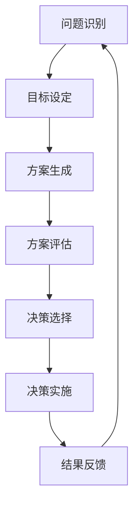

                 

### 文章标题

# 集体决策：有效利用团队智慧

> 关键词：集体决策、团队智慧、决策过程、决策算法、数学模型、案例分析

> 摘要：本文深入探讨了集体决策的概念、过程、影响因素及方法技术，通过分析多目标决策、集体协商算法和大数据驱动的集体决策算法，结合实际案例，展示了如何有效利用团队智慧，提高决策质量和效率。

### 第1章：集体决策概述

集体决策是指一个团队或组织成员共同参与、讨论并达成共识的决策过程。随着复杂问题的不断增加，单一决策者的知识和能力往往无法应对，集体决策的优势逐渐显现。本章节将从集体决策的定义、重要性、挑战以及影响因素等方面进行详细阐述。

#### 1.1 集体决策的重要性

**1.1.1 集体决策的定义**

集体决策（Group Decision Making，简称GDM）是指在一个团队或组织内部，通过多个成员的沟通、讨论和协商，共同识别问题、设定目标、生成方案、评估方案并最终做出决策的过程。

**1.1.2 集体决策的优势**

- **多样化观点**：集体决策能够汇集团队成员的不同观点和经验，提供更全面的信息，有助于更全面的方案分析和决策。
- **提高决策质量**：通过团队成员的讨论和辩论，可以更深入地探讨各种方案的可能性，减少决策失误。
- **提高团队成员的参与感和认同感**：集体决策能够增加团队成员的参与度，使他们更愿意接受和执行决策结果。
- **增强团队的凝聚力**：集体决策有助于增强团队成员之间的合作精神，提高团队的凝聚力。

**1.1.3 集体决策的挑战**

- **沟通成本**：集体决策需要团队成员之间的有效沟通，这可能涉及到较高的时间和人力成本。
- **意见分歧**：不同成员可能会有不同的观点和偏好，这可能导致决策过程的延误。
- **责任不明确**：在集体决策中，责任可能分散，导致团队成员之间的责任不明确。
- **效率问题**：如果决策过程过于复杂或成员之间的沟通不畅，可能会导致决策效率低下。

#### 1.2 集体决策的过程

**1.2.1 问题识别**

问题识别是集体决策的起点，团队需要明确面临的问题和挑战。这通常涉及对现状的分析、数据的收集和问题的界定。

**1.2.2 目标设定**

在识别问题后，团队需要设定具体的目标，这些目标应该是明确、可衡量、可实现的，以便于后续的方案设计和评估。

**1.2.3 方案生成**

方案生成阶段，团队需要提出各种可能的解决方案，这些方案应该尽可能地多样化，以涵盖所有可能的选择。

**1.2.4 方案评估**

方案评估是决策过程中的关键环节，团队需要对各种方案进行详细的分析和评估，以确定哪个方案最符合目标和要求。

**1.2.5 决策选择**

在评估的基础上，团队需要选择最佳的方案，这通常需要权衡各种因素，如成本、风险、时间等。

**1.2.6 决策实施**

决策选择后，团队需要将决策转化为具体的行动，确保决策得到有效实施。

#### 1.3 集体决策的影响因素

**1.3.1 团队成员的能力**

团队成员的能力和经验直接影响决策的质量。一个能力强大的团队能够更高效地完成决策过程。

**1.3.2 信息共享与沟通**

信息共享和沟通是集体决策的核心。有效的沟通可以确保团队成员之间的信息传递畅通，减少误解和冲突。

**1.3.3 团队结构**

团队结构对集体决策也有重要影响。扁平化的团队结构有助于提高决策效率，而等级化的团队结构可能需要更多的沟通和协商。

**1.3.4 外部环境因素**

外部环境因素，如市场竞争、政策变化等，也可能影响集体决策。团队需要充分考虑这些因素，以做出更适应环境的决策。

#### 1.4 集体决策的方法与技术

**1.4.1 传统的集体决策方法**

传统的集体决策方法包括头脑风暴、德尔菲法、名义小组法等。这些方法各有优缺点，适用于不同类型的决策问题。

**1.4.2 决策支持系统**

决策支持系统（DSS）是一种利用计算机技术和数据分析方法辅助决策的工具。DSS可以帮助团队快速生成和评估各种方案，提高决策效率。

**1.4.3 人工智能在集体决策中的应用**

随着人工智能技术的发展，人工智能在集体决策中的应用也越来越广泛。例如，基于机器学习的算法可以自动分析团队成员的偏好和意见，提供更智能的决策支持。

### 第2章：集体决策中的核心概念与联系

在集体决策中，理解并运用核心概念对于提高决策质量和效率至关重要。本章将介绍集体决策中的核心概念，包括个体偏好、团队偏好、群体极化、团队多样性等，并分析它们之间的联系。

#### 2.1 集体决策的核心概念

**2.1.1 个体偏好**

个体偏好是指单个团队成员对各种方案或结果的偏好程度。个体偏好通常受到其个人经验、知识和价值观的影响。

**2.1.2 团队偏好**

团队偏好是指整个团队对各种方案或结果的偏好程度。团队偏好通常是通过团队成员的讨论和协商形成的，反映了团队的整体利益和目标。

**2.1.3 群体极化**

群体极化是指团队成员在讨论过程中，个体偏好可能趋向于极端化。这种现象可能导致团队做出过于激进或保守的决策。

**2.1.4 团队多样性**

团队多样性是指团队成员在背景、经验、知识和观点等方面的差异。多样性有助于团队产生更多创新和优化的方案，但也可能引发冲突和沟通障碍。

#### 2.2 集体决策的Mermaid流程图

为了更好地理解集体决策的过程和各环节之间的联系，我们可以使用Mermaid流程图来展示。



在上述流程图中，各环节之间紧密相连，形成了一个闭环。结果反馈环节可以帮助团队总结经验，为下一次决策提供参考。

#### 2.3 集体决策的原理与架构

**2.3.1 集体决策的基本原理**

集体决策的基本原理在于通过团队成员的协作和沟通，实现集体智慧和团队整体利益的最大化。

- **协同效应**：团队成员通过协作，可以充分利用各自的优势，实现1+1>2的效果。
- **信息共享**：团队成员之间的信息共享有助于减少信息不对称，提高决策的透明度和公正性。
- **协商与妥协**：在决策过程中，团队成员需要通过协商和妥协，达成共识，确保决策结果的可行性和可接受性。

**2.3.2 集体决策的架构设计**

集体决策的架构设计包括以下几个方面：

- **决策流程设计**：明确决策的各个环节和步骤，确保决策过程高效、有序。
- **决策支持系统**：利用计算机技术和数据分析方法，提供决策支持和辅助。
- **团队沟通机制**：建立有效的沟通机制，确保团队成员之间的信息传递畅通。
- **决策责任分配**：明确各团队成员在决策过程中的角色和责任，确保决策执行的有效性。

通过合理的架构设计，集体决策可以更加高效、科学地运作。

### 第3章：集体决策中的核心算法原理讲解

在集体决策中，算法的运用对于提高决策质量和效率具有重要意义。本章将介绍几种核心算法，包括多目标决策算法、集体协商算法和大数据驱动的集体决策算法，并使用伪代码进行详细解释。

#### 3.1 多目标决策算法

**3.1.1 多目标决策的定义**

多目标决策是指决策过程中需要同时考虑多个目标，这些目标之间可能存在冲突和权衡。多目标决策的目的是在多个目标之间找到一个或多个最优解。

**3.1.2 多目标决策的数学模型**

多目标决策的数学模型通常包含以下要素：

- **目标函数**：表示各个目标的指标。
- **决策变量**：表示决策者可以控制的因素。
- **约束条件**：限制决策变量的取值范围。

多目标决策的数学模型可以表示为：

$$
\begin{align*}
\min_{x} & \ F(x) \\
s.t. & \ G(x) \leq 0, \ H(x) = 0
\end{align*}
$$

其中，$F(x)$ 表示目标函数，$G(x)$ 和 $H(x)$ 分别表示约束条件。

**3.1.3 多目标决策的算法实现（伪代码）**

以下是一个多目标决策算法的伪代码示例：

```
算法：多目标决策算法
输入：目标函数 F(x)，约束条件 G(x) 和 H(x)
输出：最优解 x*

步骤：
1. 初始化解 x0
2. 迭代：
   a. 更新解 x = x0 + α * ∇F(x0)
   b. 检查约束条件 G(x) 和 H(x)
   c. 如果满足约束条件，更新 x0 = x
   d. 如果不满足约束条件，则重新选择 x0
3. 返回最优解 x*
```

#### 3.2 集体协商算法

**3.2.1 集体协商的定义**

集体协商是指团队成员在决策过程中通过协商和讨论，共同达成共识的机制。集体协商旨在通过沟通和妥协，解决团队成员之间的分歧，提高决策的可接受性和实施性。

**3.2.2 集体协商的数学模型**

集体协商的数学模型通常基于博弈理论，包括以下要素：

- **参与者**：决策过程中的团队成员。
- **策略**：团队成员可以采取的行动。
- **收益**：参与者采取不同策略后的收益。

集体协商的数学模型可以表示为：

$$
\begin{align*}
\max_{s} & \ u_i(s_1, s_2, ..., s_n) \\
s.t. & \ u_i(s_1, s_2, ..., s_n) \leq u_j(s_1, s_2, ..., s_n), \forall j \neq i
\end{align*}
$$

其中，$u_i(s_1, s_2, ..., s_n)$ 表示参与者 i 在其他参与者策略已知时的收益。

**3.2.3 集体协商的算法实现（伪代码）**

以下是一个集体协商算法的伪代码示例：

```
算法：集体协商算法
输入：参与者策略 s1, s2, ..., sn
输出：协商后的策略 s*

步骤：
1. 初始化策略 s0 = 平均策略
2. 迭代：
   a. 更新策略 s = s0 + α * (s0 - s)
   b. 检查协商后的策略是否满足约束条件
   c. 如果满足约束条件，更新 s0 = s
   d. 如果不满足约束条件，则重新选择 s0
3. 返回协商后的策略 s*
```

#### 3.3 大数据驱动的集体决策算法

**3.3.1 大数据驱动的集体决策概述**

大数据驱动的集体决策是指利用大数据技术和分析方法，为集体决策提供数据支持和决策建议。大数据驱动的集体决策可以大大提高决策的准确性和效率。

**3.3.2 大数据驱动的集体决策算法**

大数据驱动的集体决策算法通常包括以下几个步骤：

- **数据采集**：收集与决策相关的数据，包括历史数据、实时数据等。
- **数据预处理**：对采集到的数据进行清洗、整合和转换，为后续分析做准备。
- **数据分析**：利用机器学习和统计分析方法，对预处理后的数据进行深入分析，提取有用的信息。
- **决策支持**：根据数据分析结果，为决策者提供决策建议和支持。

**3.3.3 大数据驱动的集体决策算法（伪代码）**

以下是一个大数据驱动的集体决策算法的伪代码示例：

```
算法：大数据驱动的集体决策算法
输入：数据集 D，决策目标 G
输出：决策建议 S

步骤：
1. 数据采集：
   a. 收集与决策相关的数据
   b. 数据清洗和预处理
2. 数据分析：
   a. 建立数据模型
   b. 应用机器学习和统计分析方法，分析数据集 D
3. 决策支持：
   a. 根据数据分析结果，生成决策建议 S
   b. 提供给决策者
4. 返回决策建议 S
```

### 第4章：集体决策中的数学模型和数学公式

在集体决策中，数学模型和数学公式起到了关键作用。它们不仅帮助决策者理解和分析决策问题，还能为决策提供量化依据。本章将介绍几种常见的数学模型和数学公式，包括线性规划模型、非线性规划模型以及团队多样性度量公式，并给出具体例子。

#### 4.1 线性规划模型

**4.1.1 线性规划的定义**

线性规划（Linear Programming，简称LP）是一种数学优化方法，用于在约束条件下最大化或最小化线性目标函数。线性规划广泛应用于资源分配、生产规划、运输调度等领域。

**4.1.2 线性规划的数学模型**

线性规划的数学模型可以表示为：

$$
\min \ c^T x \\
\text{subject to} \\
A x \leq b
$$

其中，$c$ 是目标函数的系数向量，$x$ 是决策变量向量，$A$ 是约束条件的系数矩阵，$b$ 是约束条件的常数向量。

**4.1.3 线性规划的求解方法（latex格式）**

线性规划的求解方法包括单纯形法、内点法等。以下是单纯形法的求解步骤：

$$
\begin{align*}
\min \ & c^T x \\
s.t. & \ Ax \leq b \\
& \ x \geq 0
\end{align*}
$$

#### 4.2 非线性规划模型

**4.2.1 非线性规划的定义**

非线性规划（Nonlinear Programming，简称NLP）是用于求解非线性目标函数和约束条件的优化问题。非线性规划在工程、经济学、生物学等领域有广泛应用。

**4.2.2 非线性规划的数学模型**

非线性规划的数学模型可以表示为：

$$
\min \ f(x) \\
\text{subject to} \\
g_i(x) \leq 0, \quad i = 1, 2, ..., m \\
h_j(x) = 0, \quad j = 1, 2, ..., n
$$

其中，$f(x)$ 是目标函数，$g_i(x)$ 和 $h_j(x)$ 分别是约束条件的非线性和等式部分。

**4.2.3 非线性规划的求解方法（latex格式）**

非线性规划的求解方法包括梯度下降法、牛顿法、共轭梯度法等。以下是梯度下降法的求解步骤：

$$
\begin{align*}
x_{k+1} = x_k - \alpha_k \nabla f(x_k) \\
\alpha_k = \arg \min_{\alpha} \ f(x_k - \alpha \nabla f(x_k))
\end{align*}
$$

#### 4.3 集体决策中的数学公式举例

**4.3.1 团队多样性度量（latex格式）**

团队多样性度量用于评估团队成员在背景、经验、知识和观点等方面的差异。一个常见的多样性度量公式是：

$$
D = \frac{1}{n} \sum_{i=1}^{n} \sum_{j=1, j \neq i}^{n} w_{ij}
$$

其中，$D$ 是多样性度量，$n$ 是团队成员的数量，$w_{ij}$ 是团队成员 i 和 j 在某一维度上的相似度。

### 第5章：集体决策的项目实战

通过实际案例，我们可以更直观地了解集体决策的应用和实践。本章将介绍三个案例，涵盖团队项目决策、公司战略决策和政治选举中的集体决策，详细分析决策过程、结果和影响。

#### 5.1 实际案例一：团队项目决策

**5.1.1 案例背景**

某科技公司开发一个新项目，项目涉及多个技术领域，需要团队成员共同参与决策。团队成员包括项目经理、技术总监、市场经理和产品经理。

**5.1.2 决策过程**

1. **问题识别**：项目经理识别出项目开发中可能面临的技术和市场挑战。
2. **目标设定**：团队共同确定项目的目标，包括技术实现、市场推广和时间进度。
3. **方案生成**：团队成员提出多种可能的解决方案，包括技术路线选择、市场推广策略和时间分配。
4. **方案评估**：团队对各种方案进行评估，考虑技术可行性、市场前景和资源需求。
5. **决策选择**：团队最终选择一个综合评价最高的方案。
6. **决策实施**：团队成员根据决策结果，制定具体的行动方案，并开始项目实施。

**5.1.3 决策结果分析**

通过集体决策，团队选择了一个技术难度适中、市场潜力较大的方案。决策过程中，团队成员充分利用各自的专长和经验，提出了多个有价值的建议，决策结果得到了团队成员的广泛认同。项目实施过程中，团队成员紧密合作，成功完成了项目目标。

#### 5.2 实际案例二：公司战略决策

**5.2.1 案例背景**

某大型科技公司需要制定新的战略规划，以应对市场变化和竞争压力。公司高层领导、部门经理和技术专家参与了决策。

**5.2.2 决策过程**

1. **问题识别**：公司领导层识别出公司面临的战略挑战，如市场定位、产品创新和国际化发展。
2. **目标设定**：团队共同确定战略目标，包括市场份额提升、技术创新和国际化布局。
3. **方案生成**：团队成员提出多种可能的战略方案，包括产品升级、市场拓展和研发投入。
4. **方案评估**：团队对各种方案进行详细评估，考虑成本、风险和潜在收益。
5. **决策选择**：团队最终选择一个综合评价最高的方案。
6. **决策实施**：团队成员根据决策结果，制定具体的战略实施计划，并开始战略实施。

**5.2.3 决策结果分析**

通过集体决策，公司制定了一个全面的战略规划，包括产品创新、市场拓展和国际合作等方面。决策过程中，团队成员充分发挥各自的专业能力和经验，提出了多个有前瞻性的战略方案。战略实施后，公司成功提升了市场份额，增强了市场竞争力。

#### 5.3 实际案例三：政治选举中的集体决策

**5.3.1 案例背景**

某国即将举行总统选举，选举委员会需要确定投票机制和计票方法，以保障选举的公正性和有效性。选举委员会由政治专家、法律专家和技术专家组成。

**5.3.2 决策过程**

1. **问题识别**：选举委员会识别出选举过程中可能面临的问题，如选民身份验证、计票准确性和投票安全等。
2. **目标设定**：选举委员会确定决策目标，包括确保选举的公正性、透明性和安全性。
3. **方案生成**：团队成员提出多种投票机制和计票方法，如电子投票、纸质投票和混合投票等。
4. **方案评估**：选举委员会对各种方案进行详细评估，考虑技术可行性、成本和潜在风险。
5. **决策选择**：选举委员会最终选择一个综合评价最高的方案。
6. **决策实施**：团队成员根据决策结果，制定具体的选举实施计划，并开始选举实施。

**5.3.3 决策结果分析**

通过集体决策，选举委员会确定了一种结合电子投票和纸质投票的混合投票机制，以及一种安全、高效的计票方法。决策过程中，团队成员充分发挥了各自的专业能力和经验，确保了选举的公正性和有效性。选举结果得到了广泛认可，有效保障了民主进程。

### 第6章：集体决策工具与资源

在集体决策过程中，使用合适的工具和资源可以大大提高决策的效率和效果。本章将介绍几种常用的集体决策工具和资源，包括Tableau、Microsoft Excel和Python决策库，并提供相应的推荐和资源链接。

#### 6.1 集体决策工具介绍

**6.1.1 Tableau**

Tableau 是一款强大的数据可视化工具，可以用于分析大量数据，生成直观的图表和报告。Tableau 的优势在于其易用性和强大的数据分析功能，适用于各种类型的决策过程。

- **优势**：数据可视化、实时更新、易于交互
- **使用场景**：数据分析、报告生成、决策支持
- **资源链接**：[Tableau 官网](https://www.tableau.com/)

**6.1.2 Microsoft Excel**

Microsoft Excel 是一款广泛使用的电子表格软件，具有强大的数据处理和分析功能。Excel 的优势在于其灵活性和易用性，适用于各种规模的团队和项目。

- **优势**：数据处理、数据分析、图表生成
- **使用场景**：数据收集、数据清洗、数据可视化
- **资源链接**：[Microsoft Excel 官方教程](https://support.microsoft.com/zh-cn/learn)

**6.1.3 Python决策库**

Python 是一种流行的编程语言，拥有丰富的决策库和工具，可以用于构建各种类型的决策模型和算法。Python 的优势在于其灵活性和高效性，适用于复杂的决策问题。

- **优势**：灵活性、高效性、丰富的库支持
- **使用场景**：数据挖掘、机器学习、优化算法
- **资源链接**：[Python 决策库教程](https://www.analyticsvidhya.com/tutorials/how-to-use-python-for-decision-making/)

#### 6.2 集体决策资源推荐

**6.2.1 学术论文**

- **《集体决策：理论、模型与应用》**：本文集汇集了集体决策领域的研究论文，涵盖了多个研究方向和应用领域。
- **《决策分析：技术与实践》**：本书详细介绍了决策分析的理论和方法，包括多目标决策、风险分析和博弈理论等。

**6.2.2 决策书籍**

- **《聪明的决策》**：作者查尔斯·T·库珀提供了关于如何做出更好决策的实用指南，包括案例分析和实战技巧。
- **《决策与判断》**：作者丹尼尔·卡尼曼分析了人类决策过程中的心理偏差，为决策者提供了改进决策的方法。

**6.2.3 在线课程**

- **《数据驱动的决策分析》**：这门课程介绍了如何使用数据分析方法支持决策，包括Python编程、数据分析工具和决策模型。
- **《博弈论与集体决策》**：这门课程探讨了博弈论在集体决策中的应用，包括博弈模型和策略分析。

通过使用这些工具和资源，团队可以更高效地收集、分析和利用信息，提高集体决策的质量和效果。

### 第7章：总结与展望

#### 7.1 集体决策的重要性

集体决策在现代组织中具有重要意义。它不仅有助于提高决策质量和效率，还能增强团队的凝聚力和协作精神。随着复杂问题的不断增加，集体决策成为解决问题的关键手段。

#### 7.1.1 集体决策在现代社会中的应用

集体决策广泛应用于各个领域，如企业管理、政策制定、科研攻关等。特别是在信息技术和大数据时代，集体决策的重要性更加凸显。通过集体决策，组织可以更全面地分析问题、更准确地评估方案，从而做出更科学的决策。

#### 7.1.2 集体决策的未来发展趋势

未来，集体决策将在以下几个方面得到进一步发展：

1. **人工智能的应用**：人工智能技术将为集体决策提供强大的支持，通过自动化分析、预测和优化，提高决策效率和准确性。
2. **大数据分析**：大数据分析将为集体决策提供更多的信息和数据支持，帮助决策者更深入地理解问题，制定更有效的方案。
3. **智能化决策支持系统**：随着技术的发展，智能化决策支持系统将变得更加普及，为集体决策提供更加全面、实时和智能的支持。

#### 7.2 集体决策的改进与优化

为了提高集体决策的质量和效率，可以从以下几个方面进行改进和优化：

1. **增强信息共享与沟通**：确保团队成员之间的信息畅通，减少信息不对称和误解。
2. **提高团队多样性**：鼓励团队成员在背景、经验、知识和观点等方面的多样性，以促进创新和优化方案的产生。
3. **优化决策流程**：设计合理的决策流程，明确各环节的责任和权限，确保决策过程的有序和高效。
4. **引入智能化工具**：利用人工智能、大数据分析等智能化工具，提高决策的准确性和效率。

通过以上改进和优化措施，集体决策将能够更好地发挥团队智慧，提高决策质量和效率，为组织的发展提供有力支持。

### 附录

#### 附录 A：决策案例分析

**A.1 案例一：团队项目决策**

**背景**：某科技公司开发一个新项目，项目涉及多个技术领域，需要团队成员共同参与决策。

**决策过程**：团队通过头脑风暴、德尔菲法等传统方法，提出了多种可能的方案。经过讨论和评估，最终选择了一个技术难度适中、市场潜力较大的方案。

**结果分析**：决策结果得到了团队成员的广泛认同，项目实施过程中，团队成员紧密合作，成功完成了项目目标。

**A.2 案例二：公司战略决策**

**背景**：某大型科技公司需要制定新的战略规划，以应对市场变化和竞争压力。

**决策过程**：公司高层领导、部门经理和技术专家共同参与了决策。通过多目标决策和大数据分析，团队制定了一个全面的战略规划，包括产品创新、市场拓展和国际合作等方面。

**结果分析**：战略实施后，公司成功提升了市场份额，增强了市场竞争力。

**A.3 案例三：政治选举中的集体决策**

**背景**：某国即将举行总统选举，选举委员会需要确定投票机制和计票方法。

**决策过程**：选举委员会通过讨论和评估，最终确定了一种结合电子投票和纸质投票的混合投票机制，以及一种安全、高效的计票方法。

**结果分析**：选举结果得到了广泛认可，有效保障了民主进程。

#### 附录 B：集体决策术语表

**集体决策（Group Decision Making，简称GDM）**：指一个团队或组织成员共同参与、讨论并达成共识的决策过程。

**个体偏好（Individual Preference）**：指单个团队成员对各种方案或结果的偏好程度。

**团队偏好（Group Preference）**：指整个团队对各种方案或结果的偏好程度。

**群体极化（Group Polarization）**：指团队成员在讨论过程中，个体偏好可能趋向于极端化。

**团队多样性（Team Diversity）**：指团队成员在背景、经验、知识和观点等方面的差异。

**决策支持系统（Decision Support System，简称DSS）**：指利用计算机技术和数据分析方法辅助决策的工具。

**多目标决策（Multi-Objective Decision Making）**：指决策过程中需要同时考虑多个目标，这些目标之间可能存在冲突和权衡。

**线性规划（Linear Programming，简称LP）**：指一种数学优化方法，用于在约束条件下最大化或最小化线性目标函数。

**非线性规划（Nonlinear Programming，简称NLP）**：指一种数学优化方法，用于在约束条件下最大化或最小化非线性目标函数。

**数据驱动决策（Data-Driven Decision Making）**：指利用大数据和数据分析方法进行决策，以提高决策的准确性和效率。

