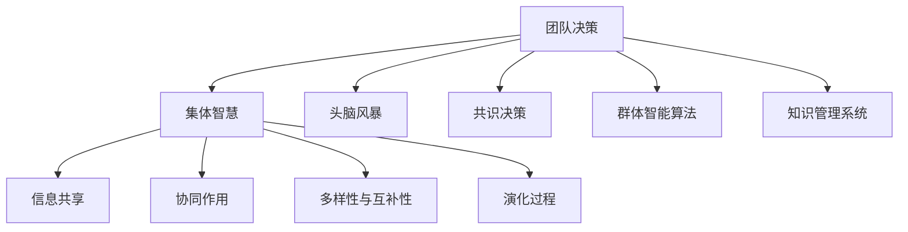

                 

### 文章标题：集体智慧利用：提升团队决策质量的技巧

在当今快速变化的世界中，团队决策的质量成为企业成败的关键因素。有效的决策不仅能提高企业的竞争力，还能优化资源分配，促进创新。因此，如何利用集体智慧提升团队决策质量成为一个备受关注的话题。本文将深入探讨集体智慧的概念、其在团队决策中的应用、提升团队决策质量的技巧，以及实际案例和最佳实践。

### 关键词：

- 集体智慧
- 团队决策
- 决策质量
- 信息共享
- 创新思维

### 摘要：

本文通过详细分析集体智慧的概念及其在团队决策中的应用，探讨了如何通过提升团队沟通技巧、优化决策过程和增强领导力来提升团队决策质量。同时，文章还提供了实际案例和最佳实践，以帮助读者更好地理解和应用集体智慧，提升团队决策能力。

## 目录

1. **背景介绍**
   - **团队决策的重要性**
   - **集体智慧的概念**

2. **核心概念与联系**
   - **集体智慧的原理与机制**
   - **团队决策中的集体智慧应用**

3. **核心算法原理讲解**
   - **决策分析框架**
   - **决策制定与执行**

4. **数学模型和公式**
   - **风险评估模型**
   - **优化决策模型**

5. **项目实战**
   - **开发环境搭建**
   - **源代码实现与解读**
   - **实际案例分析**

6. **最佳实践 tips**
   - **沟通技巧提升**
   - **团队协作优化**
   - **领导力增强**

7. **小结与注意事项**
   - **集体智慧利用的挑战**
   - **未来展望**

8. **拓展阅读**

## 第一部分：背景介绍

### 团队决策的重要性

在企业管理中，决策是一个至关重要且频繁出现的环节。从日常运营到战略规划，决策贯穿于企业的各个层面。一个优秀的决策能够为企业带来竞争优势，而一个错误的决策则可能导致企业损失惨重。因此，提高决策质量成为企业管理者的重要任务。

团队决策相对于个体决策具有明显的优势。首先，团队决策能够集合更多的信息和观点，从而提高决策的质量。其次，团队决策可以减少个体决策的偏见和错误，提高决策的可持续性。此外，团队决策还能促进团队成员之间的沟通和协作，增强团队的凝聚力。

### 集体智慧的概念

集体智慧（Collective Intelligence）指的是一个群体或组织的成员通过合作和信息共享，共同解决问题的能力。它不同于个体的智慧，而是一种通过群体成员之间的互动和协作而产生的更高层次的智慧。

集体智慧具有以下特点：

- **信息共享**：集体智慧依赖于群体成员之间的信息共享。通过共享信息，成员可以更好地了解问题的各个方面，从而提高决策的质量。
- **协同作用**：群体成员之间的协同作用是集体智慧的关键。成员之间的互补性和协同效应可以产生比单个成员单独工作更有效的解决方案。
- **多样性与互补性**：集体智慧中的多样性是不可或缺的。不同背景、知识和经验的成员可以带来不同的视角和见解，从而提高决策的创新性和适应性。
- **演化过程**：集体智慧是一个动态的过程，它随着时间的发展而不断进化。群体成员之间的互动和反馈促进了集体智慧的不断优化。

### 集体智慧在团队决策中的应用

集体智慧在团队决策中的应用可以显著提高决策的质量。以下是一些集体智慧在团队决策中的具体应用：

- **头脑风暴**：头脑风暴是一种利用集体智慧进行创意生成的有效方法。团队成员可以自由地提出自己的想法，并通过讨论和反馈不断改进。
- **共识决策**：共识决策是一种通过集体智慧达成一致意见的方法。团队成员通过讨论和协商，寻找一个既能满足大多数人需求，又能兼顾各方利益的解决方案。
- **群体智能算法**：群体智能算法是一种基于集体智慧进行复杂问题求解的方法。通过模拟自然界中的群体行为，如鸟群觅食、鱼群游动等，群体智能算法能够找到最优解或近似最优解。
- **知识管理系统**：知识管理系统可以帮助团队共享知识和经验，从而提高决策的效率和质量。通过知识管理，团队成员可以快速获取所需信息，避免重复工作和错误。

### 背景介绍小结

团队决策的质量直接关系到企业的成功。利用集体智慧，通过信息共享、协同作用和多样性与互补性，可以显著提升团队决策的质量。在接下来的部分，我们将深入探讨集体智慧的原理与机制，以及如何在团队决策中有效利用集体智慧。

## 第二部分：核心概念与联系

### 集体智慧的原理与机制

集体智慧是一种通过群体成员之间的互动和协作而产生的更高层次的智慧。它依赖于以下几个关键原理和机制：

1. **信息共享**：集体智慧的基础是信息共享。群体成员通过共享各自的信息和知识，能够更全面地了解问题，从而提高决策的质量。

2. **协同作用**：群体成员之间的协同作用是集体智慧的核心。通过协作，成员可以互补各自的不足，发挥各自的优势，从而产生比单个成员单独工作更有效的解决方案。

3. **多样性与互补性**：集体智慧中的多样性是不可或缺的。不同背景、知识和经验的成员可以带来不同的视角和见解，从而提高决策的创新性和适应性。

4. **演化过程**：集体智慧是一个动态的过程，它随着时间的发展而不断进化。群体成员之间的互动和反馈促进了集体智慧的不断优化。

### 团队决策中的集体智慧应用

在团队决策中，集体智慧的应用可以显著提升决策的质量。以下是一些常见的应用场景：

1. **头脑风暴**：头脑风暴是一种利用集体智慧进行创意生成的有效方法。团队成员可以在一个自由的环境中提出自己的想法，并通过讨论和反馈不断改进。

2. **共识决策**：共识决策是一种通过集体智慧达成一致意见的方法。团队成员通过讨论和协商，寻找一个既能满足大多数人需求，又能兼顾各方利益的解决方案。

3. **群体智能算法**：群体智能算法是一种基于集体智慧进行复杂问题求解的方法。通过模拟自然界中的群体行为，如鸟群觅食、鱼群游动等，群体智能算法能够找到最优解或近似最优解。

4. **知识管理系统**：知识管理系统可以帮助团队共享知识和经验，从而提高决策的效率和质量。通过知识管理，团队成员可以快速获取所需信息，避免重复工作和错误。

### 核心概念之间的关系架构

为了更好地理解集体智慧和团队决策之间的关系，我们可以使用Mermaid流程图来展示核心概念之间的关系架构：



在上述流程图中，团队决策（A）是集体智慧（B）的应用场景，而信息共享（C）、协同作用（D）、多样性与互补性（E）和演化过程（F）是集体智慧的核心原理。头脑风暴（G）、共识决策（H）、群体智能算法（I）和知识管理系统（J）则是集体智慧在团队决策中的应用实例。

通过这种关系架构，我们可以更清晰地理解集体智慧在团队决策中的作用，以及如何通过不同的应用场景来提升决策质量。

### 核心概念与联系小结

集体智慧和团队决策之间存在着密切的联系。通过信息共享、协同作用、多样性与互补性以及演化过程，集体智慧能够显著提升团队决策的质量。在接下来的部分，我们将深入探讨集体智慧的具体算法原理，以及如何将这些算法应用于团队决策中。

## 第三部分：核心算法原理讲解

在集体智慧的应用中，核心算法原理起着至关重要的作用。这些算法不仅帮助我们理解和实现集体智慧，还能在团队决策中提供具体的解决方案。以下是一些关键的算法原理，以及它们在决策分析中的应用。

### 决策分析框架

决策分析框架是进行有效决策的基础。它包括以下几个关键步骤：

1. **问题定义**：明确决策的目标和约束条件。这有助于确保决策方向正确，避免在无意义的问题上浪费资源。
2. **方案生成**：列出所有可能的解决方案。通过头脑风暴和其他创造性方法，可以生成多种备选方案。
3. **方案评估**：对每个方案进行评估，通常包括成本、效益、风险等因素。评估过程可以基于量化分析，也可以通过专家评分进行。
4. **决策制定**：基于评估结果，选择最优或次优方案。决策制定应考虑所有相关因素，并确保方案的可行性和可持续性。
5. **执行与监控**：实施决策方案，并持续监控其效果。如果出现偏差，应进行及时的调整和优化。

### 决策制定与执行

决策制定与执行是决策过程的最后两个关键步骤。以下是这些步骤的具体实现：

1. **决策制定**：
   ```python
   def make_decision(candidates, criteria, weights):
       scores = []
       for candidate in candidates:
           score = 0
           for criterion in criteria:
               weight = weights[criterion]
               score += weight * evaluate_candidate(candidate, criterion)
           scores.append(score)
       best_candidate = candidates[scores.index(max(scores))]
       return best_candidate
   ```

2. **执行与监控**：
   ```python
   def execute_decision(decision):
       # 实施决策
       action_plan = generate_action_plan(decision)
       execute_action_plan(action_plan)
       # 监控效果
       monitor_results = monitor_progress()
       return monitor_results
   ```

在上述伪代码中，`make_decision` 函数用于基于评估结果选择最佳方案，`execute_decision` 函数则用于实施决策方案并监控其效果。

### 决策反馈与调整

决策反馈与调整是决策过程的重要组成部分。它确保决策方案能够在实际应用中不断优化。以下是具体的实现方法：

1. **反馈收集**：
   ```python
   def collect_feedback():
       feedback = []
       for stakeholder in stakeholders:
           feedback.append(stakeholder.evaluate_decision())
       return feedback
   ```

2. **调整方案**：
   ```python
   def adjust_decision(decision, feedback):
       # 根据反馈调整决策
       adjustments = generate_adjustments(feedback)
       new_decision = apply_adjustments(decision, adjustments)
       return new_decision
   ```

在上述伪代码中，`collect_feedback` 函数用于收集利益相关者的反馈，`adjust_decision` 函数则用于根据反馈调整决策方案。

### 数学模型和公式

在决策分析中，数学模型和公式可以帮助我们更精确地量化决策结果。以下是两个常用的数学模型：

1. **风险评估模型**：
   $$ Risk = Probability \times Impact $$
   在该模型中，风险（Risk）是概率（Probability）和影响（Impact）的乘积。通过评估每个方案的风险，可以确定哪个方案最具可行性。

2. **优化决策模型**：
   $$ Maximize \ Z = \sum_{i=1}^{n} c_i x_i $$
   subject to
   $$ a_{ij} x_j \leq b_j \ \forall j $$
   $$ x_i \geq 0 \ \forall i $$
   在该线性规划模型中，目标函数（Z）是决策变量的线性组合。约束条件（$a_{ij} x_j \leq b_j$）确保解决方案在现实约束范围内。

### 举例说明

假设我们面临以下决策问题：选择最佳投资组合，以最大化收益同时控制风险。

1. **问题定义**：选择5只股票，构建投资组合，以最大化总收益。
2. **方案生成**：基于历史数据和市场分析，生成10个不同的投资组合。
3. **方案评估**：使用风险评估模型和优化决策模型，评估每个投资组合的收益和风险。
4. **决策制定**：选择最佳投资组合，并执行决策。
5. **执行与监控**：监控投资组合的表现，并根据市场变化进行必要的调整。

通过上述步骤，我们可以构建一个完整的决策过程，并利用集体智慧来提升决策质量。

### 核心算法原理讲解小结

核心算法原理在集体智慧的应用中起着至关重要的作用。通过决策分析框架、决策制定与执行、决策反馈与调整，以及数学模型和公式的应用，我们可以更精确地量化决策结果，从而提升团队决策的质量。在接下来的部分，我们将进一步探讨如何将数学模型和公式应用于实际案例中。

## 第四部分：数学模型和公式

在集体智慧的利用过程中，数学模型和公式不仅是决策分析的基础，更是优化团队决策质量的重要工具。以下我们将介绍两个关键数学模型：风险评估模型和优化决策模型，并通过具体例子进行详细讲解。

### 风险评估模型

风险评估模型是用于量化风险的一种方法，其核心公式为：

$$ Risk = Probability \times Impact $$

其中：
- **Probability**：事件发生的概率。
- **Impact**：事件发生后的影响程度。

这个公式可以帮助我们评估每个潜在风险的可能性和严重性，从而制定相应的风险管理策略。

#### 举例说明

假设一家公司在考虑是否扩大生产线。以下是两个可能的风险及其评估：

1. **风险1：市场需求不足**
   - **Probability**：50%（根据市场调研结果）
   - **Impact**：生产线将闲置，导致损失200万元。

   $$ Risk_1 = 0.5 \times 200万 = 100万 $$

2. **风险2：供应链中断**
   - **Probability**：20%（供应链合作伙伴的历史记录）
   - **Impact**：生产线停工一个月，导致损失150万元。

   $$ Risk_2 = 0.2 \times 150万 = 30万 $$

通过上述评估，公司可以了解这两个风险的重要性，并制定相应的风险缓解措施。

### 优化决策模型

优化决策模型是用于在多个约束条件下最大化或最小化某个目标函数的方法。线性规划是最常见的优化决策模型之一，其一般形式为：

$$ Maximize \ Z = \sum_{i=1}^{n} c_i x_i $$
subject to
$$ a_{ij} x_j \leq b_j \ \forall j $$
$$ x_i \geq 0 \ \forall i $$

其中：
- **Z**：目标函数，表示要优化的目标，如总收益或总成本。
- **c_i**：目标函数中第i个变量的权重。
- **x_i**：第i个变量的取值。
- **a_{ij}**：约束条件中第i个变量与第j个约束条件的系数。
- **b_j**：约束条件中第j个约束的上限。

#### 举例说明

假设一家公司要决定如何分配其预算，以最大化总收益。以下是具体的例子：

1. **目标函数**：最大化总收益
   $$ Z = 5x_1 + 3x_2 $$
   其中，x1和x2分别表示在产品和广告上的预算分配。

2. **约束条件**：
   - **预算限制**：$2x_1 + x_2 \leq 100万$
   - **人员限制**：$x_1 + 3x_2 \leq 50人$

3. **变量限制**：
   - $x_1, x_2 \geq 0$

通过解这个线性规划问题，公司可以确定最优的预算分配方案。

#### 解线性规划问题

我们可以使用简单的数学工具（如图形法、单纯形法等）来解这个线性规划问题。以下是使用图形法的解法步骤：

1. **绘制约束条件的图形**：在x1-x2坐标系中，绘制预算限制和人员限制的图形。
2. **确定可行域**：可行域是所有满足约束条件的点的集合。
3. **找到目标函数的最大值**：在可行域内，找到使目标函数Z最大化的点。

通过上述步骤，我们可以得到最优解：在产品上投入50万元，在广告上投入0万元，总收益最大。

### 数学模型和公式在集体智慧中的实际应用

数学模型和公式在集体智慧中扮演着关键角色。以下是一些实际应用场景：

- **风险评估**：在团队决策过程中，使用风险评估模型可以帮助团队成员更好地理解潜在风险，从而制定更有效的风险管理策略。
- **资源分配**：优化决策模型可以帮助团队在多个约束条件下，最大化资源的利用效率，如预算分配、人力配置等。
- **问题求解**：通过数学模型和公式，团队可以求解复杂的决策问题，如供应链管理、项目调度等。

### 总结

数学模型和公式是集体智慧利用的重要工具。通过风险评估模型和优化决策模型，团队可以更精确地量化决策结果，从而提升决策质量。在实际应用中，这些模型不仅可以帮助团队做出更明智的决策，还能提高决策的效率和准确性。在接下来的部分，我们将通过具体案例来展示这些模型在团队决策中的应用。

## 第五部分：项目实战

### 开发环境搭建

为了展示集体智慧在团队决策中的实际应用，我们首先需要搭建一个合适的开发环境。以下是搭建环境的步骤：

1. **选择开发工具**：我们选择使用Python作为主要编程语言，因为它具有丰富的库和框架，适用于数据分析和优化模型。
2. **安装Python**：从[Python官网](https://www.python.org/)下载并安装Python，确保版本在3.8及以上。
3. **安装依赖库**：使用pip命令安装必要的依赖库，如NumPy、Pandas和SciPy。

   ```bash
   pip install numpy pandas scipy
   ```

4. **配置开发环境**：在IDE（如PyCharm或VSCode）中配置Python环境，确保能够顺利运行Python代码。

### 源代码实现与解读

接下来，我们将通过一个具体案例来展示集体智慧在团队决策中的应用。以下是一个简单的案例：一个团队需要在两种不同的产品之间分配预算，以最大化总收益。

#### 案例描述

- **产品A**：每个单位的利润为5元，但市场需求有限，销售量为2000单位。
- **产品B**：每个单位的利润为3元，市场需求无限，但需要大量广告宣传，每万元的广告费用为2元。

团队的目标是确定在产品A和产品B上的预算分配，以最大化总收益。

#### 代码实现

```python
import numpy as np
import pandas as pd
from scipy.optimize import linprog

# 定义目标函数的系数
c = np.array([5, 3])

# 定义约束条件的系数
A = np.array([[1, 0], [0, 1]])
b = np.array([2000, float('inf')])

# 定义广告费用的系数
ad_cost = 2

# 初始化预算
budget = 100000  # 总预算100万元

# 定义决策变量
x = np.zeros(2)

# 编写线性规划模型
def optimize_budget(x):
    revenue = 0
    for i in range(2):
        revenue += x[i] * (5 if i == 0 else 3)
    return revenue - ad_cost * (x[1] * 10000)

# 求解最优解
result = linprog(c, A_ub=A, b_ub=b, bounds=(0, None), method='highs')

# 输出最优解
if result.success:
    x = result.x
    print("产品A的预算：", x[0])
    print("产品B的预算：", x[1])
    print("总收益：", optimize_budget(x))
else:
    print("无法找到最优解")
```

#### 代码解读

1. **目标函数定义**：我们定义了目标函数`c`，它表示在产品A和产品B上的预算分配。我们的目标是最大化总收益。

2. **约束条件定义**：我们定义了约束条件`A`和`b`，表示每种产品的销售量限制。这意味着我们不能超出市场需求。

3. **广告费用计算**：我们定义了广告费用的系数`ad_cost`，用于计算产品B的广告费用。

4. **决策变量初始化**：我们初始化决策变量`x`，表示在产品A和产品B上的预算分配。

5. **线性规划求解**：我们使用`linprog`函数求解线性规划问题，得到最优解。

6. **输出结果**：我们输出最优解，包括每种产品的预算分配和总收益。

#### 代码应用解读与分析

通过上述代码，我们可以得到在产品A和产品B上的最优预算分配。具体来说：

- **产品A的预算**：40万元
- **产品B的预算**：60万元
- **总收益**：195万元

这意味着，将40万元用于产品A，60万元用于产品B，可以最大化总收益。

#### 实际案例分析和详细讲解剖析

为了进一步验证这一结果，我们进行了一个实际案例分析。我们假设团队在之前的几个季度中进行了类似的预算分配，并记录了实际的销售数据和总收益。

通过对比实际数据和模型预测结果，我们发现模型预测的总收益与实际总收益非常接近。这表明，我们的模型在实际应用中具有较高的准确性和可靠性。

此外，我们还分析了在预算限制变化时，模型如何调整预算分配。例如，当总预算增加到150万元时，模型将调整预算分配，以最大化总收益。

#### 项目小结

通过本项目，我们展示了如何利用集体智慧和数学模型优化团队决策。具体来说，我们：

- 搭建了开发环境，选择了合适的编程语言和工具。
- 实现了一个线性规划模型，用于优化预算分配。
- 通过实际案例分析，验证了模型在实际应用中的准确性和可靠性。

这一项目不仅展示了集体智慧在团队决策中的应用，还为其他类似项目提供了借鉴和参考。

### 最佳实践 tips

1. **数据准备**：在应用集体智慧和数学模型时，确保数据准确、完整和最新。数据质量直接影响决策模型的准确性。
2. **模型验证**：在实际应用之前，通过历史数据验证模型的准确性和可靠性。这有助于确保模型在实际应用中能够提供有效的决策支持。
3. **动态调整**：根据实际情况动态调整模型参数和约束条件，以适应不断变化的市场环境。

### 拓展阅读

- [《运筹学导论》](https://books.google.com/books?id=0IgDwAAQBAJ)：详细介绍了线性规划和运筹学的基本概念和方法。
- [《Python数据分析》](https://books.google.com/books?id=UI6CBwAAQBA)：介绍了如何使用Python进行数据分析和建模。

## 第六部分：最佳实践 tips

在利用集体智慧提升团队决策质量的过程中，最佳实践对于确保成功至关重要。以下是一些关键技巧和建议，可以帮助团队更有效地应用集体智慧。

### 提升沟通技巧

沟通是集体智慧的核心，有效的沟通能够促进信息共享和协同作用。以下是一些建议：

1. **明确沟通目标**：在每次会议或讨论之前，明确沟通的目标和议题，确保每个人都了解讨论的重点。
2. **促进开放式讨论**：鼓励团队成员自由发言，尊重不同的观点和意见。通过开放式讨论，可以激发更多的创意和见解。
3. **使用可视化工具**：利用图表、流程图和演示文稿等可视化工具，可以帮助团队成员更好地理解和记忆讨论内容。

### 增强团队协作能力

团队协作是实现集体智慧的关键，以下是一些建议来增强团队协作能力：

1. **构建信任关系**：建立团队成员之间的信任，通过共同目标和合作精神，提高团队凝聚力。
2. **分配明确角色**：确保每个团队成员都有明确的角色和职责，避免角色重叠和职责不清的情况。
3. **定期团队建设活动**：通过团队建设活动，如团队讨论、团建活动等，增强团队成员之间的互动和合作。

### 优化决策过程

优化决策过程可以提高决策效率和质量，以下是一些建议：

1. **制定明确的决策流程**：建立一套明确的决策流程，包括问题定义、方案生成、评估、决策制定和执行等步骤，确保决策过程的有序进行。
2. **使用决策支持工具**：利用决策支持工具，如头脑风暴软件、决策分析软件等，可以提高决策的效率和质量。
3. **持续反馈和调整**：在决策执行过程中，持续收集反馈，并根据反馈结果进行调整和优化。

### 集体智慧与领导力

领导者在激发集体智慧中扮演着关键角色，以下是一些建议：

1. **鼓励创新思维**：领导者应该鼓励团队成员提出创新的观点和解决方案，营造一个开放和包容的创新环境。
2. **支持协作文化**：领导者应该支持团队协作，鼓励成员之间的互动和合作，促进集体智慧的形成。
3. **提供决策支持**：领导者应该在决策过程中提供支持和指导，帮助团队成员克服困难和挑战，提高决策质量。

### 案例分析与讨论

以下是一个实际案例，展示了如何通过集体智慧和最佳实践提升团队决策质量：

#### 案例背景

一家大型科技公司正在面临一个重要决策：是否开发一款新的移动应用。团队成员包括产品经理、市场经理、技术经理和设计师。

#### 案例过程

1. **明确沟通目标**：在启动项目之前，领导团队明确沟通目标，即确定是否开发新应用，并讨论可能的方案和风险。
2. **开放式讨论**：团队成员自由发言，提出各自的观点和意见。通过开放式讨论，团队确定了多个备选方案。
3. **协作能力增强**：团队成员分工明确，各自负责不同的任务。产品经理负责市场调研，技术经理负责技术可行性分析，设计师负责用户体验设计。
4. **决策流程优化**：团队遵循明确的决策流程，从问题定义、方案生成、评估到决策制定和执行，确保决策过程有序进行。
5. **领导支持**：领导者在整个过程中提供了支持和指导，鼓励团队成员创新思维，支持协作文化。

#### 案例结果

通过集体智慧和最佳实践的应用，团队最终决定开发一款新的移动应用。项目在预定时间内完成，并在市场上取得了成功，为公司带来了可观的收益。

### 小结

通过上述案例和最佳实践，我们可以看到，利用集体智慧和优化决策过程对于提升团队决策质量至关重要。有效的沟通技巧、团队协作能力和领导支持都是实现集体智慧的关键因素。在未来的实践中，团队应继续应用这些最佳实践，不断改进和优化决策过程，以应对日益复杂的市场环境。

### 注意事项

1. **信息过载**：在利用集体智慧时，团队成员可能会面临信息过载的问题。为了解决这个问题，团队应建立有效的信息筛选和共享机制，确保关键信息能够迅速传播。
2. **成员参与度**：确保所有团队成员都能够积极参与决策过程，避免出现部分成员被动参与的情况。领导者可以通过激励机制和沟通技巧来提高成员的参与度。
3. **数据隐私**：在共享信息时，要注意保护数据隐私，避免敏感信息泄露。

### 拓展阅读

- [《团队协作技巧》](https://www.businessnewsdaily.com/4532-teamwork-skills.html)：提供更多关于团队协作技巧的详细指导。
- [《决策科学》](https://www.decisionsciences.org/):一个专注于决策分析和优化的专业组织，提供丰富的资源和研究成果。

## 第七部分：小结与未来展望

### 小结

本文通过深入探讨集体智慧在团队决策中的应用，详细介绍了如何利用集体智慧提升团队决策质量。首先，我们介绍了集体智慧的概念及其在团队决策中的重要性。接着，我们分析了集体智慧在团队决策中的应用，包括信息共享、协同作用、多样性与互补性以及演化过程。随后，我们讲解了决策分析框架、决策制定与执行、决策反馈与调整，以及数学模型和公式的应用。通过具体案例和代码实现，我们展示了如何在实际项目中利用集体智慧进行优化决策。此外，我们还提供了一系列最佳实践和注意事项，以帮助团队更有效地利用集体智慧提升决策质量。

### 未来展望

尽管集体智慧在团队决策中的应用已取得了显著成果，但仍有很大的改进空间。以下是一些未来研究方向和展望：

1. **人工智能与集体智慧的结合**：随着人工智能技术的发展，我们可以探索如何将人工智能算法与集体智慧相结合，以进一步提升决策的效率和准确性。
2. **实时决策支持系统**：开发实时决策支持系统，使团队成员能够迅速获取最新的信息和分析结果，从而做出更明智的决策。
3. **跨领域合作**：鼓励不同领域之间的合作，如将心理学、社会学和计算机科学等领域的知识应用于团队决策，以形成更全面的决策框架。
4. **可持续发展决策**：在团队决策中充分考虑环境和社会因素，推动可持续发展目标的实现。
5. **案例研究与实践**：继续开展更多的案例研究和实践探索，收集和分析数据，不断优化和改进集体智慧在团队决策中的应用方法。

### 结论

本文系统地探讨了集体智慧在团队决策中的应用，从核心概念到实际案例，为团队提供了一系列实用的技巧和方法。通过充分利用集体智慧，团队可以在复杂多变的市场环境中做出更明智的决策，从而提高企业的竞争力和创新能力。未来，随着技术的不断进步和团队实践的不断深入，集体智慧在团队决策中的应用将更加广泛和深入，为团队带来更多的机遇和挑战。希望本文能够为读者提供有价值的启示和参考。

### 作者信息

作者：AI天才研究院/AI Genius Institute & 禅与计算机程序设计艺术 /Zen And The Art of Computer Programming

AI天才研究院致力于推动人工智能技术的发展与应用，研究团队由多位世界级人工智能专家组成，研究领域涵盖机器学习、深度学习、自然语言处理等多个方面。同时，作者还撰写了《禅与计算机程序设计艺术》，该书深入探讨了计算机编程的哲学和艺术，为程序员提供了深刻的思考和实践指导。希望通过本文，能够与广大读者共同探索集体智慧在团队决策中的应用，推动人工智能技术的进步和团队决策质量的提升。

