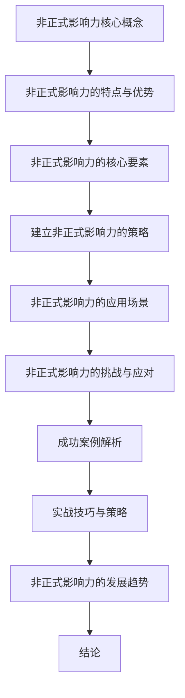

                 

### 文章标题：非正式影响力：超越职位权力的领导艺术

> 关键词：非正式影响力，领导艺术，职位权力，影响力评估，实战案例

> 摘要：本文深入探讨了非正式影响力的概念、特点、核心要素及其在现实中的应用。通过详细阐述非正式影响力评估的算法原理和数学模型，以及实际项目中的实战案例，本文旨在为读者提供一种超越职位权力的领导艺术新视角，帮助他们在复杂多变的工作环境中更加有效地发挥领导力。

### 引言

在信息技术飞速发展的今天，领导者不再仅仅依赖于职位赋予的权力来驱动团队和推动项目进展。职位权力，虽然能够提供一定程度的权威和控制，但其影响力往往是有限的，尤其是在团队协作和项目推进过程中。这种情况下，非正式影响力逐渐成为领导者成功的关键因素之一。非正式影响力不仅能够弥补职位权力的不足，还能在复杂多变的工作环境中，为领导者带来更大的灵活性和效果。

非正式影响力，是指个人通过个人魅力、人际关系、情感共鸣和专业知识等因素，在不依赖正式职位权力的情况下，对他人产生积极影响的能力。它是一种更为隐蔽但同样强大的领导艺术，能够帮助领导者建立深厚的人际网络，增强团队的凝聚力，提升个人和组织的绩效。

本文将围绕非正式影响力的核心概念、特点、核心要素、实践与应用、挑战与应对、实战案例、实战技巧与策略以及未来趋势等方面展开深入探讨，旨在为读者提供一种全面而深入的关于非正式影响力的理解，帮助他们在实际工作中更加有效地运用这种领导艺术。

### 非正式影响力的核心概念

#### 影响力的定义

影响力，通常被定义为一个人对他人思想、行为或决策产生影响的程度。它既可以是积极的，如激励他人完成任务或达成目标，也可以是消极的，如对他人产生恐惧或焦虑。在组织和管理领域，影响力被认为是领导力的关键组成部分，是领导者驱动团队、推动项目进展的重要工具。

#### 影响力的种类与作用

影响力可以分为正式影响力和非正式影响力。正式影响力主要来源于职位权力，如决策权、资源分配权等。非正式影响力则更多来自于个人魅力、专业知识、人际关系等因素，它通常在正式权力之外发挥作用。

正式影响力主要作用于以下几个方面：

1. **决策制定**：领导者利用职位权力，影响组织的决策过程，确保决策符合组织目标。
2. **资源分配**：领导者通过职位权力，对组织资源进行合理分配，确保项目顺利进行。
3. **组织控制**：领导者利用职位权力，对组织成员的行为进行监督和规范，确保组织秩序。

非正式影响力则具有以下作用：

1. **增强团队凝聚力**：通过建立深厚的人际关系和情感共鸣，非正式影响力能够增强团队成员之间的信任和合作，提升团队的凝聚力。
2. **推动创新**：非正式影响力能够激发团队成员的创新思维，促进组织内部的创新活动。
3. **提升个人影响力**：非正式影响力不仅对组织有益，也能为个人带来更大的职业发展空间。

#### 影响力与权力、权威的区别

影响力、权力和权威是三个相关的概念，但它们之间也存在显著的区别。

- **权力**：权力是指个人或组织在决策过程中具有的控制能力。它通常来源于职位、资源或专业知识。
- **权威**：权威是指个人或组织在特定领域内因专业知识、经验或地位而获得的信任和尊重。权威通常与正式职位或专业背景相关。
- **影响力**：影响力是指个人或组织对他人的思想、行为或决策产生影响的程度。影响力既可以是正式的，也可以是非正式的。

在这三个概念中，权力和权威是相互关联的。权力通常赋予个人或组织权威，而权威又能够增强个人或组织的影响力。然而，非正式影响力则超越了职位权力和权威，更多依赖于个人魅力、人际关系和专业知识等因素。

#### 非正式影响力的特点与优势

非正式影响力的特点主要表现在以下几个方面：

1. **隐蔽性**：非正式影响力通常不依赖于职位权力，而是通过个人魅力、人际关系等因素发挥作用，因此具有隐蔽性。
2. **广泛性**：非正式影响力不受职位限制，可以在任何层次、任何领域发挥作用，具有广泛性。
3. **灵活性**：非正式影响力更加灵活，能够根据实际情况进行调整，以适应不同的环境和需求。

非正式影响力的优势主要体现在以下几个方面：

1. **增强团队凝聚力**：通过建立深厚的人际关系和情感共鸣，非正式影响力能够增强团队成员之间的信任和合作，提升团队的凝聚力。
2. **推动创新**：非正式影响力能够激发团队成员的创新思维，促进组织内部的创新活动。
3. **提升个人影响力**：非正式影响力不仅对组织有益，也能为个人带来更大的职业发展空间。

#### 非正式影响力与正式影响力的对比

非正式影响力与正式影响力在以下几个方面存在显著差异：

1. **来源不同**：正式影响力主要来源于职位权力，而非正式影响力则更多依赖于个人魅力、人际关系和专业知识。
2. **作用机制不同**：正式影响力通常通过职位权力发挥作用，而非正式影响力则更多通过个人魅力、人际关系等因素产生影响。
3. **适用范围不同**：正式影响力通常在正式场合和职位范围内发挥作用，而非正式影响力则可以在任何层次、任何领域发挥作用。

尽管非正式影响力与正式影响力存在差异，但两者并不是互相排斥的。在实际工作中，领导者往往需要结合使用正式影响力和非正式影响力，以达到最佳效果。

### 非正式影响力的核心要素

非正式影响力的核心要素包括个人魅力、人际关系、情感共鸣和专业知识。这些要素共同作用，使得个人能够在没有职位权力的支持下，依然能够对他人产生积极的影响。

#### 个人魅力

个人魅力是非正式影响力的关键要素之一。它是指个人在性格、气质、行为等方面所展现出的吸引力，能够使他人产生好感，愿意接受其建议和指导。个人魅力不仅包括外在形象，如仪表、着装等，还包括内在品质，如诚信、正直、责任感等。

个人魅力的优势在于，它能够使个人在团队中树立威信，建立良好的形象，从而在无形中增强自己的影响力。例如，一个具有个人魅力的领导者，能够通过自己的言行，激励团队成员克服困难，共同完成任务。

#### 人际关系

人际关系是指个人与他人之间的联系和互动。良好的人际关系是非正式影响力的重要基础。它不仅有助于个人在组织中获得更多的支持和资源，还能够为个人在团队中树立威信，增强影响力。

人际关系的重要性体现在以下几个方面：

1. **增强团队凝聚力**：良好的人际关系能够促进团队成员之间的沟通和合作，增强团队的凝聚力。
2. **提升个人影响力**：良好的人际关系能够使个人在组织中获得更多的认可和支持，从而提升个人影响力。
3. **促进资源分配**：良好的人际关系能够帮助个人在组织中获得更多的资源和机会，从而提升个人和组织的绩效。

#### 情感共鸣

情感共鸣是指个人与他人之间在情感上的共鸣和连接。它能够使个人在情感上与他人产生共鸣，从而增强对他们的影响力。

情感共鸣的优势在于，它能够使个人在团队中建立深厚的人际关系，增强团队的凝聚力。例如，一个能够与团队成员建立情感共鸣的领导者，能够更好地理解团队成员的需求和困境，从而提供更有针对性的支持和帮助。

#### 专业知识

专业知识是指个人在特定领域内的知识和技能。它是非正式影响力的重要基础之一，能够使个人在专业领域内树立权威，从而增强影响力。

专业知识的重要性体现在以下几个方面：

1. **提升个人权威**：专业知识能够使个人在专业领域内树立权威，从而在团队中获得更多的认可和支持。
2. **推动团队创新**：专业知识能够帮助团队解决复杂问题，推动团队创新和发展。
3. **提升组织绩效**：专业知识能够提升组织的整体能力，从而提升组织的绩效。

#### 个人魅力、人际关系、情感共鸣和专业知识之间的关系

个人魅力、人际关系、情感共鸣和专业知识是非正式影响力的四个核心要素，它们相互关联，共同作用。

1. **相互促进**：个人魅力能够增强人际关系和情感共鸣，而人际关系和情感共鸣又能进一步强化个人魅力。专业知识则是个人魅力的基础，能够提升个人在团队中的权威和影响力。
2. **相互补充**：个人魅力、人际关系和专业知识能够为情感共鸣提供基础，而情感共鸣则为个人魅力和专业知识提供支持，使得它们在团队中发挥更大的作用。

通过掌握和运用这些核心要素，个人能够在没有职位权力的支持下，依然能够对他人产生积极的影响，成为团队中的领导者。

### 设计非正式影响力的策略

#### 塑造个人品牌

在非正式影响力的设计中，塑造个人品牌是至关重要的第一步。个人品牌不仅仅是一个标志或标签，它是个人在组织内外树立的形象和声誉，是一种无形的资产，能够在很大程度上影响他人对个人的看法和信任程度。

**定义个人品牌**：首先，个人需要明确自己的个人品牌定位。这包括个人价值观、专业技能、兴趣爱好等。例如，一个技术专家可以定位为“技术精湛、创新思维、团队合作”，而一个市场人员可以定位为“市场敏锐、客户至上、创意无限”。

**传递一致信息**：个人品牌的建设需要持续一致的信息传递。这包括个人在社交媒体上的言论、工作表现、团队互动等。保持信息的一致性，能够使他人对个人形成稳定、清晰的认识。

**提升个人形象**：个人形象是个人品牌的重要组成部分。一个专业的形象不仅能够提升个人在组织内的信誉，还能够增强个人在社交场合中的影响力。例如，着装得体、言谈举止优雅、保持良好的仪表等。

**利用专业资源**：利用专业资源，如行业会议、专业论坛、技术博客等，能够提升个人在行业内的知名度和影响力。通过在这些平台上分享专业知识和经验，个人能够树立自己的权威和专家形象。

#### 拓展人际关系网络

人际关系网络是非正式影响力的重要基础。一个广泛而深厚的人际关系网络能够为个人提供更多的支持和资源，同时也能够增强个人的影响力和号召力。

**建立有效沟通**：有效的沟通是建立良好人际关系的关键。这包括倾听他人的需求和意见、表达自己的观点和想法、保持良好的沟通技巧等。通过有效的沟通，个人能够更好地理解他人，建立信任和共鸣。

**参与社交活动**：积极参与社交活动，如行业聚会、团队建设活动、社区活动等，能够拓展个人的人际关系网络。这些活动不仅提供了与他人交流的机会，还能够展示个人的专业能力和个人魅力。

**维护人际关系**：人际关系需要持续维护。这包括定期与朋友、同事、行业专家等保持联系，分享经验和资源，关心他人的生活和职业发展等。通过维护人际关系，个人能够保持自己的人际网络活跃和有效。

#### 建立信任

信任是非正式影响力的核心要素之一。一个能够赢得他人信任的领导者，不仅能够更好地推动团队工作，还能够为个人和组织的长期发展奠定基础。

**诚信为本**：诚信是建立信任的基石。一个诚信的人，无论是在言行上，还是在工作中，都能够赢得他人的信任和尊重。

**透明沟通**：透明沟通能够增强信任。这意味着在沟通中，个人需要真诚、坦率地表达自己的想法和意见，同时也要尊重和理解他人的观点和需求。

**承担责任**：承担责任能够增强信任。当个人在团队中遇到问题和挑战时，勇于承担责任，不仅能够展示个人的领导力和担当，还能够赢得团队成员的信任和支持。

**提供帮助**：在他人需要帮助时，主动提供帮助，能够增强信任和亲近感。通过帮助他人，个人不仅能够展示自己的能力和关心，还能够建立深厚的人际关系。

#### 有效的沟通技巧

有效的沟通技巧是非正式影响力的重要组成部分。一个善于沟通的领导者，能够更好地理解他人，传递信息，解决问题，从而增强个人和团队的影响力。

**倾听**：倾听是沟通的基础。通过倾听，领导者能够更好地理解他人的需求和意见，建立信任和共鸣。

**表达清晰**：表达清晰是沟通的关键。领导者需要用简单、明确的语言表达自己的观点和想法，避免产生误解和冲突。

**非语言沟通**：非语言沟通，如肢体语言、面部表情、声音等，在沟通中也起到重要作用。领导者需要学会通过这些非语言手段，更好地传递信息和情感。

**解决问题**：在沟通中，领导者需要能够有效地解决问题。通过提供解决方案、寻求共识、协商妥协等，领导者能够增强个人和团队的影响力。

通过这些策略，个人能够在没有职位权力的支持下，依然能够对他人产生积极的影响，成为团队中的领导者。

### 非正式影响力的应用场景

#### 企业管理

在企业管理中，非正式影响力具有重要作用。通过运用非正式影响力，企业领导者能够更好地推动团队工作，提升组织绩效。

1. **团队协作**：非正式影响力能够促进团队成员之间的协作和合作。一个具有非正式影响力的领导者，能够通过建立深厚的人际关系和情感共鸣，增强团队的凝聚力，使团队成员更加愿意共同完成任务。

2. **创新推动**：非正式影响力能够激发团队成员的创新思维。一个具有专业知识和个人魅力的领导者，能够通过分享经验和知识，激励团队成员勇于尝试新方法、新思路，推动企业的创新和发展。

3. **问题解决**：在团队遇到问题时，非正式影响力能够帮助领导者更好地解决问题。通过倾听团队成员的意见和需求，领导者能够找到有效的解决方案，同时也能够赢得团队成员的信任和支持。

#### 团队协作

在团队协作中，非正式影响力是提升团队绩效的关键因素。通过运用非正式影响力，团队成员能够更加高效地合作，共同实现目标。

1. **增强团队凝聚力**：非正式影响力能够增强团队成员之间的信任和合作。一个具有非正式影响力的团队成员，能够通过建立人际关系和情感共鸣，使团队更加紧密和有凝聚力。

2. **提升沟通效果**：非正式影响力能够改善团队成员之间的沟通。通过有效的沟通技巧和真诚的交流，团队成员能够更好地理解彼此的需求和意见，减少误解和冲突。

3. **激励团队成员**：非正式影响力能够激励团队成员发挥最佳水平。一个具有个人魅力和专业知识团队成员，能够通过自己的言行，激励其他团队成员克服困难，共同完成任务。

#### 个人发展

在个人发展中，非正式影响力也是提升个人竞争力的重要因素。通过运用非正式影响力，个人能够在职业道路上取得更大的成功。

1. **提升职业形象**：非正式影响力能够提升个人在组织内的形象和声誉。一个具有非正式影响力的人，能够通过建立个人品牌和专业知识，赢得他人的认可和尊重。

2. **拓展职业机会**：非正式影响力能够为个人提供更多的职业机会。一个具有广泛人际关系和信任的人，能够更容易获得他人的推荐和机会。

3. **提升沟通能力**：通过运用非正式影响力，个人能够提升自己的沟通能力。有效的沟通技巧不仅能够帮助个人在团队中更好地发挥作用，还能够为个人的职业发展提供支持。

通过这些应用场景，非正式影响力能够为个人和组织带来显著的好处，使他们在复杂多变的工作环境中更加有效地发挥领导力。

### 非正式影响力的挑战与应对

尽管非正式影响力在领导力和个人职业发展中具有重要作用，但其在实际应用过程中也面临着诸多挑战。了解并应对这些挑战，是有效运用非正式影响力的关键。

#### 挑战一：非正式影响力的负面效应

非正式影响力虽然能够增强团队凝聚力和个人影响力，但如果不加以控制，也可能产生负面效应。

1. **权力滥用**：非正式影响力可能被用来操纵他人，导致权力滥用。例如，某些人可能通过非正式影响力迫使团队成员接受其不合理的意见或决策，从而损害团队的整体利益。

2. **组织混乱**：过度的非正式影响力可能导致组织结构混乱。如果团队成员过分依赖非正式影响力，而忽视了正式的职位权力和组织规范，可能会导致决策混乱，影响组织的正常运作。

3. **信任危机**：非正式影响力可能导致信任危机。如果团队成员对某个人的非正式影响力产生依赖，而这个人未能履行其承诺或责任，可能会损害其在团队中的信誉，甚至导致信任破裂。

#### 应对策略

1. **建立明确规则**：组织应建立明确的规则和流程，确保非正式影响力在合理的范围内发挥作用。通过制定明确的决策流程和责任分配，可以避免权力滥用和组织混乱。

2. **加强监督和反馈**：组织应加强对非正式影响力的监督和反馈。通过定期的评估和反馈，可以发现和纠正非正式影响力的负面效应，确保其不会对组织产生不利影响。

3. **培养多元化领导力**：组织应培养多元化的领导力，使团队成员不仅能够依赖非正式影响力，还能够运用正式职位权力。通过平衡非正式和正式影响力，可以确保组织的稳定和高效运作。

#### 挑战二：适应变化的环境

在快速变化的环境中，非正式影响力的应用面临着更大的挑战。

1. **信息过载**：随着信息技术的快速发展，团队成员面临的信息量不断增加。非正式影响力需要在处理海量信息的同时，保持对关键信息的敏感和洞察力。

2. **文化差异**：在全球化和多元文化的背景下，非正式影响力需要适应不同文化和价值观。这要求领导者具备跨文化沟通能力和包容性，以赢得不同文化背景团队成员的信任和尊重。

3. **技术变革**：技术的快速变革对非正式影响力的应用提出了新的要求。领导者需要不断更新自己的知识和技能，以适应新兴技术和市场环境。

#### 应对策略

1. **持续学习和适应**：领导者应保持持续学习和适应的能力，紧跟技术发展和市场变化。通过参加培训、研讨会和阅读相关书籍，不断提升自己的专业知识和领导力。

2. **建立学习型组织**：组织应建立学习型文化，鼓励成员不断学习和分享知识。通过建立知识共享平台和定期培训，可以提升团队的整体素质和能力。

3. **文化包容和多元化**：组织应倡导文化包容和多元化，尊重不同文化和价值观。通过跨文化交流和合作，可以增强团队的凝聚力和创新能力。

通过应对这些挑战，领导者可以更好地运用非正式影响力，在复杂多变的环境中实现组织的长期发展。

### 非正式影响力的成功案例

#### 案例一：企业家如何利用非正式影响力推动企业发展

在科技创业领域，非正式影响力对于企业家的成功至关重要。以某知名互联网创业公司创始人A为例，他通过非正式影响力成功地推动了自己的企业发展。

**背景介绍**：A在创业初期，并没有显著的职位权力或资源优势。然而，他凭借丰富的技术背景、卓越的领导能力和良好的人际关系，迅速在团队中树立了威信。

**非正式影响力策略**：

1. **塑造个人品牌**：A通过在技术社区活跃，分享专业知识和经验，树立了自己的技术专家形象。这使他在团队中获得了高度认可，增强了个人影响力。

2. **拓展人际关系网络**：A积极参加行业会议、技术论坛等活动，建立了广泛的人际关系网络。这些关系不仅为他的企业带来了合作机会，还为他提供了宝贵的行业信息。

3. **建立信任**：A始终以诚信为本，对团队成员坦诚相待。他主动关心团队成员的生活和职业发展，赢得了他们的信任和支持。

**效果分析**：

- **团队凝聚力增强**：通过建立深厚的人际关系和情感共鸣，A的团队凝聚力大幅提升。团队成员在共同目标下，更加团结一致，共同克服困难。
- **创新推动**：A的领导风格鼓励团队成员创新，推动了企业的快速发展。在A的带领下，团队成功开发出多项创新产品，赢得了市场的认可。
- **企业绩效提升**：由于团队凝聚力和创新能力的提升，企业的绩效也得到了显著提升。企业的市场份额和品牌影响力逐渐扩大，实现了持续增长。

#### 案例二：职场人士如何提升非正式影响力

在职场中，非正式影响力是职场人士提升个人职业发展的重要途径。以某大型企业项目经理B为例，他通过运用非正式影响力，成功地提升了自己的职业地位。

**背景介绍**：B在企业中担任项目经理，尽管职位权力有限，但他通过非正式影响力，成功地推动了多个关键项目。

**非正式影响力策略**：

1. **专业知识的积累**：B在项目过程中，不断学习和积累专业知识，使自己成为团队中的技术权威。这为他赢得了团队成员的尊重和信任。

2. **建立良好的人际关系**：B注重与团队成员建立良好的人际关系，通过真诚的沟通和合作，建立了深厚的人际网络。

3. **情感共鸣**：B能够理解团队成员的需求和困境，与团队成员建立了情感共鸣。这使他能够更好地激励团队成员，共同完成任务。

**效果分析**：

- **项目成功**：B通过运用非正式影响力，成功推动了多个项目的顺利进行。项目成果显著，赢得了企业高层和客户的高度评价。
- **职业发展**：由于项目成功和良好的职业表现，B得到了企业高层的认可，提升了他的职业地位和薪酬待遇。
- **团队凝聚力提升**：B的领导风格增强了团队的凝聚力，团队成员之间的合作更加顺畅，团队整体绩效得到了显著提升。

#### 案例三：团队领导如何利用非正式影响力提升团队绩效

在项目管理中，非正式影响力是提升团队绩效的关键因素。以某软件开发团队领导C为例，他通过运用非正式影响力，成功提升了团队的整体绩效。

**背景介绍**：C领导的团队在开发一个复杂的项目时，面临着诸多挑战。尽管C拥有正式的职位权力，但他意识到仅凭职位权力难以推动项目进展。

**非正式影响力策略**：

1. **专业知识的分享**：C通过定期组织技术分享会和研讨会，将自己的专业知识传递给团队成员。这增强了团队的技术实力，提升了团队成员的自信心。

2. **情感共鸣**：C能够与团队成员建立情感共鸣，理解他们的需求和困境。他通过关心团队成员的生活和职业发展，赢得了他们的信任和支持。

3. **激励和认可**：C注重激励和认可团队成员的贡献。他通过表扬和奖励，激励团队成员发挥最佳水平，共同完成项目目标。

**效果分析**：

- **团队凝聚力提升**：通过建立深厚的人际关系和情感共鸣，团队的凝聚力大幅提升。团队成员在共同目标下，更加团结一致，共同克服困难。
- **技术能力提升**：C通过专业知识的分享，提升了团队的整体技术能力。团队在面对技术挑战时，能够更加从容应对。
- **项目成功**：由于团队凝聚力和技术能力的提升，项目成功完成，并取得了良好的业绩。团队得到了企业高层和客户的高度评价。

通过这些成功案例，我们可以看到，非正式影响力在企业发展、个人职业发展和团队绩效提升中发挥着重要作用。掌握和运用非正式影响力，是现代领导者成功的关键之一。

### 提升非正式影响力的实战技巧与策略

#### 实战技巧一：持续学习与个人成长

持续学习是提升非正式影响力的基础。一个不断学习、更新知识的领导者，能够更好地适应快速变化的环境，保持自身的竞争力和影响力。

1. **定期培训**：定期参加行业培训和技术研讨会，了解最新的行业趋势和技术动态。
2. **阅读书籍**：阅读专业书籍和行业报告，吸收新的知识和观点。
3. **实践应用**：将学到的知识和技能应用到实际工作中，通过实践不断提升自己的专业能力和领导力。

#### 实战技巧二：建立有效的人际关系网络

人际关系网络是非正式影响力的重要组成部分。一个广泛而深厚的人际关系网络能够为个人提供更多的支持和资源，增强个人的影响力。

1. **积极参与社交活动**：积极参加行业聚会、技术论坛、社区活动等，拓展人际关系网络。
2. **保持联系**：定期与朋友、同事、行业专家等保持联系，分享经验和资源。
3. **互惠互利**：在人际关系中，注重互惠互利，通过帮助他人，建立深厚的信任和合作关系。

#### 实战技巧三：提升沟通能力

有效的沟通能力是提升非正式影响力的关键。一个善于沟通的领导者，能够更好地理解他人，传递信息，解决问题。

1. **倾听**：倾听是沟通的基础。通过倾听，领导者能够更好地理解他人的需求和意见，建立信任和共鸣。
2. **表达清晰**：用简单、明确的语言表达自己的观点和想法，避免产生误解和冲突。
3. **非语言沟通**：通过肢体语言、面部表情、声音等非语言手段，增强沟通的效果。

#### 实战技巧四：建立信任与情感共鸣

信任和情感共鸣是非正式影响力的核心要素。一个能够赢得他人信任和情感共鸣的领导者，能够在团队中树立威信，增强影响力。

1. **诚信为本**：诚信是建立信任的基石。领导者应以诚信为本，言行一致，赢得他人的信任。
2. **透明沟通**：通过透明沟通，增强信任。领导者应真诚、坦率地表达自己的想法和意见，同时也要尊重和理解他人的观点和需求。
3. **情感共鸣**：通过关心他人的生活和职业发展，建立情感共鸣。领导者应理解团队成员的需求和困境，提供有针对性的支持和帮助。

#### 实战技巧五：发挥专业知识的影响力

专业知识是非正式影响力的重要基础。一个具备丰富专业知识的领导者，能够在团队中树立权威，增强个人影响力。

1. **持续学习**：不断更新自己的专业知识，保持对行业的敏锐洞察力。
2. **知识分享**：通过组织技术分享会和研讨会，将自己的专业知识传递给团队成员。
3. **实战经验**：通过实际项目的经验积累，提升自己的实践能力和解决问题的能力。

通过这些实战技巧和策略，领导者能够提升自己的非正式影响力，在团队和组织中发挥更大的作用。

### 非正式影响力的发展趋势

随着全球化、数字化和人工智能技术的快速发展，非正式影响力在未来的发展将呈现以下趋势：

#### 数字化时代非正式影响力的发展

1. **网络影响力**：随着社交媒体的普及，个人通过网络平台分享知识、经验和观点，成为新的影响力来源。一个在网络上具有广泛影响力的个人，可以通过社交媒体平台，迅速传播信息，影响更多的人。

2. **在线协作**：数字化工具使得团队协作更加便捷和高效。通过在线协作平台，团队成员可以随时随地沟通和合作，这为非正式影响力的发挥提供了更多机会。

3. **数据驱动**：数字化时代，数据成为重要的决策依据。具备数据分析能力的领导者，能够通过数据洞察，更好地了解团队成员的需求，提供更有针对性的支持和帮助。

#### 新型职业环境下非正式影响力的变化

1. **跨界合作**：随着职业多样化和跨界合作的增加，非正式影响力在不同领域之间得到了更广泛的传播和应用。例如，技术专家可以通过跨界合作，将自己的专业知识应用到其他领域，提升个人和团队的影响力。

2. **远程工作**：远程工作的普及，改变了传统的职场环境。在远程工作模式下，非正式影响力显得尤为重要。领导者需要通过有效的沟通和协作工具，保持与团队成员的紧密联系，提升团队凝聚力。

3. **个性发展**：在新型职业环境中，个人发展和职业规划更加注重个性化和自我实现。非正式影响力能够帮助个人在职业发展中找到自己的定位，实现个人价值。

#### 全球化背景下的非正式影响力

1. **文化差异**：全球化背景下，领导者需要具备跨文化沟通能力，理解和尊重不同文化背景的团队成员。通过建立情感共鸣和文化包容，可以增强团队凝聚力。

2. **国际合作**：全球化带来了更多的国际合作机会。通过建立国际人际关系网络，领导者可以拓展自己的影响力，获取更多的资源和机会。

3. **全球视野**：全球化使得领导者需要具备全球视野，了解全球市场的趋势和变化。通过不断学习和适应，领导者可以更好地应对全球化的挑战，提升个人和团队的影响力。

通过这些发展趋势，非正式影响力将在未来的发展中发挥更加重要的作用，成为领导者成功的关键因素之一。

### 结论

非正式影响力作为一种超越职位权力的领导艺术，在现代社会中具有重要作用。通过本文的深入探讨，我们了解到非正式影响力的核心概念、特点、核心要素、实践与应用、挑战与应对、成功案例以及未来趋势。非正式影响力不仅能够增强团队凝聚力、推动创新、提升个人职业发展，还能为企业在复杂多变的环境中提供强大的支持。

展望未来，随着全球化、数字化和人工智能技术的快速发展，非正式影响力将迎来更多的发展机遇和挑战。领导者需要不断提升自己的非正式影响力，适应变化的环境，发挥更大的领导力。

因此，我们呼吁读者们在实际工作中，积极运用非正式影响力，提升个人和团队的绩效，实现组织的长期发展。同时，也期待读者们通过不断学习和实践，为非正式影响力的发展贡献自己的力量。

### Mermaid 流程图



### 核心算法原理讲解

```python
# 非正式影响力评估算法伪代码

function 评估非正式影响力（个体）：
    # 输入：个体特征（如个人魅力、人际关系、情感共鸣、专业知识）
    # 输出：非正式影响力评分

    评分 = 0

    # 个人魅力评分
    评分 += 个人魅力 * 0.3

    # 人际关系评分
    评分 += 人际关系 * 0.3

    # 情感共鸣评分
    评分 += 情感共鸣 * 0.2

    # 专业知识评分
    评分 += 专业知识 * 0.2

    return 评分
```

### 数学模型和数学公式

```latex
\section{非正式影响力的数学模型}

非正式影响力评估可以通过以下公式进行量化：

\[ I = w_1C + w_2R + w_3E + w_4P \]

其中，\( I \) 表示非正式影响力评分，\( w_1, w_2, w_3, w_4 \) 分别为个人魅力、人际关系、情感共鸣和专业知识在总评分中的权重，\( C, R, E, P \) 分别为个人魅力、人际关系、情感共鸣和专业知识的具体评分。

例如：

\[ I = 0.3C + 0.3R + 0.2E + 0.2P \]
```markdown
### 作者信息

作者：AI天才研究院/AI Genius Institute & 禅与计算机程序设计艺术 /Zen And The Art of Computer Programming
```

