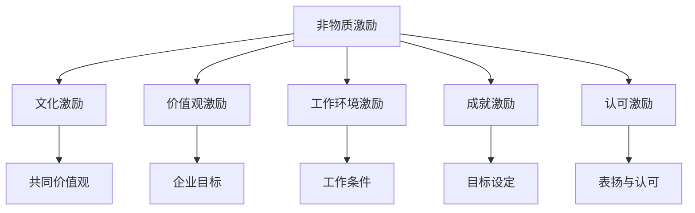
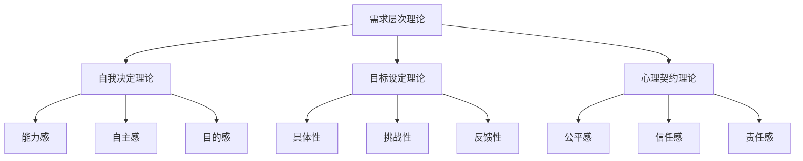

                 

### 引言与背景

在信息技术飞速发展的今天，企业竞争愈发激烈，团队协作的效率成为了企业成功的关键因素之一。传统的物质激励方式，如薪酬、奖金等，虽然在短期内能够提高团队成员的积极性，但长期来看，其效果往往有限。团队成员往往追求更高层次的需求，如自我实现、成就感等，这就需要通过非物质激励来激发团队的内在动力。

非物质激励，顾名思义，指的是不依赖于物质奖励，而是通过文化、价值观、工作环境等非物质因素来激励团队成员。它强调的是团队成员的内在动机，旨在提高团队的整体士气和凝聚力。与物质激励相比，非物质激励更能激发团队成员的创造力和创新能力，从而为企业带来持续的创新动力。

本书旨在探讨非物质激励在团队管理中的应用，帮助团队领导者了解非物质激励的核心概念、理论基础和实践方法。通过深入分析团队沟通、领导力和个人成长等方面，本书将提供一系列实用的策略和技巧，帮助团队领导者有效地激发团队的内在动力，提升团队的整体绩效。

首先，我们将介绍非物质激励的核心概念，包括其定义、特点和类型。接下来，我们将探讨非物质激励的理论基础，分析相关理论和研究，帮助读者理解非物质激励的内在逻辑。随后，我们将详细阐述非物质激励的实践方法，包括设计有效的非物质激励策略和应用方法。在此基础上，我们将探讨团队沟通与协作在非物质激励中的作用，介绍如何通过优化团队沟通来提高团队绩效。此外，我们还将讨论领导力与个人成长在非物质激励中的重要性，提供实用的领导力提升策略和个人成长方法。

为了更好地理解非物质激励的实际效果，我们将通过案例分析来展示非物质激励在项目中的应用和效果。最后，本书将总结非物质激励的核心内容，展望其未来发展趋势，并提供对团队的启示和建议。

通过本书的学习，读者将能够系统地了解非物质激励的理论和实践，掌握激发团队内在动力的方法和技巧，从而提升团队的整体绩效，为企业的发展贡献力量。

### 非物质激励的核心概念

非物质激励是指通过非物质手段来激发团队成员的工作热情和积极性，从而提高团队整体绩效的一种激励方式。与传统的物质激励不同，非物质激励主要依赖于文化、价值观、工作环境等非物质因素，旨在满足团队成员更高层次的需求，如自我实现、成就感和归属感等。

#### 非物质激励的定义

非物质激励可以被定义为一种不依赖于物质奖励的激励方式，它通过以下几种方式来激发团队成员的内在动力：

1. **文化激励**：通过构建积极的企业文化，如尊重、信任、合作等，来激发团队成员的工作热情。
2. **价值观激励**：通过传递共同的企业价值观，使团队成员认同并为之努力。
3. **工作环境激励**：通过优化工作环境，如提供舒适的工作条件、丰富的培训机会等，来提升团队成员的工作满意度和工作效率。
4. **成就激励**：通过设立合理的目标和激励机制，让团队成员感受到自己的成就和贡献，从而提高工作积极性。
5. **认可激励**：通过表扬和认可团队成员的努力和成绩，来激发他们的内在动力。

#### 非物质激励的特点

非物质激励具有以下几个显著特点：

1. **长期性**：物质激励往往只能在短期内激发团队成员的积极性，而非物质激励则能够在长期内持续发挥作用。
2. **全面性**：非物质激励不仅关注团队成员的工作表现，还关注他们的工作体验和职业发展，从而实现全面激励。
3. **自主性**：非物质激励强调团队成员的自主性和自我管理能力，鼓励他们主动参与工作，从而提高工作效率和创造力。
4. **适应性**：非物质激励可以根据不同团队和个人的需求进行定制，具有较强的适应性。

#### 非物质激励的类型

非物质激励可以分为以下几种类型：

1. **文化激励**：通过构建积极的企业文化，如举办文化活动、制定企业价值观等，来激发团队成员的工作热情。
2. **价值观激励**：通过传递共同的企业价值观，如诚信、创新、协作等，使团队成员在工作中保持一致的方向和目标。
3. **工作环境激励**：通过优化工作环境，如提供良好的办公设施、舒适的休息区、丰富的培训机会等，来提升团队成员的工作满意度和工作效率。
4. **成就激励**：通过设立合理的目标和激励机制，如绩效考核、奖金制度、晋升机会等，让团队成员感受到自己的成就和贡献。
5. **认可激励**：通过表扬和认可团队成员的努力和成绩，如表彰大会、感谢信等，来激发他们的内在动力。

#### 非物质激励的核心概念关系架构

为了更好地理解非物质激励的核心概念，我们可以通过Mermaid流程图来展示它们之间的关系：

在上述流程图中，我们可以看到非物质激励的核心概念是如何相互关联的。文化激励通过共同价值观来引导团队成员的行为；价值观激励和企业目标共同决定了团队的方向；工作环境激励通过提供良好的工作条件来提升工作效率；成就激励和目标设定则帮助团队成员实现自我价值；认可激励通过表扬和认可来激发团队成员的内在动力。

通过理解非物质激励的核心概念，团队领导者可以更好地设计出适合自己团队的激励策略，从而激发团队的内在动力，提高团队的整体绩效。

#### 非物质激励的理论基础

非物质激励并非凭空出现，而是基于一系列相关理论和研究。这些理论为我们理解非物质激励的内在逻辑提供了基础，同时也为实际应用提供了指导。以下将介绍几种重要的理论基础，包括马斯洛的需求层次理论、自我决定理论、目标设定理论和心理契约理论。

##### 马斯洛的需求层次理论

马斯洛的需求层次理论（Maslow's Hierarchy of Needs）是心理学领域的重要理论之一。该理论将人类需求从低到高分为五层：生理需求、安全需求、社交需求、尊重需求和自我实现需求。根据这一理论，人的需求是分层的，只有当较低层次的需求得到满足后，较高层次的需求才会被激发。

在团队管理中，马斯洛的需求层次理论可以帮助我们理解团队成员的内在动机。例如，一个团队中的成员可能同时处于不同层次的需求，领导者需要根据不同层次的需求来设计激励策略。对于处于生理需求和安全需求的成员，可以通过提供良好的薪酬和福利来满足他们的基本需求；而对于处于社交需求、尊重需求和自我实现需求的成员，则可以通过非物质激励，如认可、成就感和个人成长机会来激发他们的工作积极性。

##### 自我决定理论

自我决定理论（Self-Determination Theory，简称SDT）是由心理学家德西和瑞安提出的。该理论强调人的自主性和自我决定性，认为人的行为是由内在动机驱动的。自我决定理论将内在动机分为三种类型：能力感、自主感和目的感。

在团队管理中，自我决定理论提示我们，为了激发团队成员的内在动力，需要创造一个支持自主性、能力感和目的感的工作环境。具体措施包括：

1. **提供选择**：允许团队成员在任务和工作方式上有一定的自主权，使他们感受到自己的选择和决策的重要性。
2. **培养能力**：通过培训和发展机会，提高团队成员的能力和技能，使他们能够自信地完成任务。
3. **明确目的**：确保团队成员了解他们的工作对团队和组织的意义，使他们的工作具有明确的目的感。

##### 目标设定理论

目标设定理论（Goal Setting Theory）由洛克和莱瑟姆提出，认为设定具有挑战性的目标可以显著提高团队和个人的绩效。根据这一理论，目标设定应满足以下三个条件：

1. **具体性**：目标应该是明确和具体的，而不是模糊和抽象的。
2. **挑战性**：目标应该具有适度的挑战性，既能够激发团队成员的动力，又不会让他们感到无法实现。
3. **反馈性**：团队成员应该能够及时获得关于目标完成情况的反馈，以便调整策略。

在非物质激励中，目标设定理论可以帮助团队领导者设计具有激励作用的目标和激励机制。例如，可以设立短期和长期目标，并通过定期的绩效评估来提供反馈，帮助团队成员了解自己的工作进度和成就。

##### 心理契约理论

心理契约理论（Psychological Contract Theory）认为，团队成员和组织之间存在一种隐性的契约，这种契约反映了成员对组织的期望和承诺。心理契约包括公平感、信任感和责任感等方面。

在非物质激励中，心理契约理论提示我们，要建立良好的团队氛围，需要关注团队成员的心理需求和感受。领导者应该通过开放沟通、公平对待和承诺兑现来维护心理契约，从而增强团队成员的归属感和忠诚度。

#### 非物质激励的核心概念之间的关系架构

为了更好地理解非物质激励的理论基础，我们可以通过Mermaid流程图来展示这些理论之间的关系：

在上述流程图中，我们可以看到各个理论是如何相互关联的。需求层次理论为我们提供了理解团队成员需求的基础；自我决定理论强调了自主性和内在动机的重要性；目标设定理论指导我们如何设定具有挑战性和激励性的目标；心理契约理论则提示我们要关注团队成员的心理需求和感受。这些理论共同构成了非物质激励的理论基础，帮助我们设计出有效的激励策略。

通过理解这些理论基础，团队领导者可以更好地把握非物质激励的内在逻辑，从而在实际工作中运用这些理论，提升团队的内在动力和整体绩效。

#### 非物质激励的实践方法

要有效地运用非物质激励，团队领导者需要掌握一系列实践方法。这些方法不仅可以帮助设计出合适的激励策略，还能够确保这些策略能够切实落地，从而激发团队的内在动力。以下将介绍几种关键的实践方法。

##### 设计有效的非物质激励策略

设计有效的非物质激励策略是团队领导者的首要任务。以下是一些关键步骤：

1. **明确激励目标**：首先，团队领导者需要明确激励的目标，即希望通过非物质激励实现什么。这些目标可以是提高团队士气、增强团队凝聚力、提升创新能力等。

2. **分析团队需求**：了解团队成员的个性和需求是设计有效激励策略的基础。可以通过问卷调查、一对一访谈等方式，收集团队成员对激励的期望和建议。

3. **制定具体措施**：根据分析结果，制定具体的激励措施。这些措施可以包括文化激励（如举办团队建设活动）、价值观激励（如树立榜样）、工作环境激励（如提供舒适的工作环境）等。

4. **建立反馈机制**：激励策略的实施需要不断地反馈和调整。团队领导者应定期收集团队成员的反馈，并根据反馈进行相应的调整。

##### 应用非物质激励的方法

在具体应用非物质激励时，团队领导者可以采用以下几种方法：

1. **表扬与认可**：表扬和认可是最常见的非物质激励方法之一。通过公开表扬团队成员的成就和贡献，可以增强他们的自信心和积极性。例如，可以定期举行表彰大会，对表现优秀的团队成员进行表彰。

2. **培训与成长**：提供培训和发展机会，帮助团队成员提升技能和知识，是实现长期激励的有效途径。例如，可以定期组织内部培训、外部研讨会等。

3. **目标设定与反馈**：通过设定具有挑战性的目标和提供及时的反馈，可以激发团队成员的内在动力。例如，可以设立个人目标和团队目标，并通过定期的绩效评估提供反馈。

4. **工作环境优化**：创造一个舒适、健康的工作环境，可以提高团队成员的工作满意度和工作效率。例如，可以提供良好的办公设施、舒适的休息区、丰富的休闲活动等。

##### 非物质激励在团队沟通与协作中的应用

团队沟通与协作是团队绩效的重要保障，也是非物质激励的重要领域。以下是一些具体的应用方法：

1. **建立开放的沟通环境**：鼓励团队成员自由表达意见和反馈，建立开放的沟通环境。例如，可以设立开放的会议室、开放的电子邮件系统等。

2. **促进团队协作**：通过项目合作、团队活动等方式，促进团队成员之间的协作。例如，可以组织团队建设活动、团队拓展训练等。

3. **明确沟通目标**：在每次沟通前，明确沟通的目标和议程，确保沟通的有效性。例如，可以制定会议议程、明确讨论主题等。

4. **反馈与改进**：在沟通结束后，及时收集团队成员的反馈，并根据反馈进行改进。例如，可以设立反馈环节、定期进行沟通评估等。

##### 非物质激励在不同场景中的应用案例分析

为了更好地理解非物质激励的实际应用，以下提供两个不同场景的案例分析：

1. **初创公司**：在初创公司中，由于资源有限，物质激励可能不是主要的激励手段。此时，非物质激励尤为重要。例如，通过建立积极的企业文化、提供自由的工作环境、设立具有挑战性的目标和提供及时的反馈，可以激发团队成员的创造力和创新能力。

2. **跨国公司**：在跨国公司中，团队之间的沟通和协作可能面临语言和文化障碍。此时，非物质激励可以通过建立共同的企业价值观、提供跨文化交流机会、设立全球性的目标和反馈机制等方式，来促进团队之间的沟通和协作。

通过上述实践方法和案例分析，我们可以看到，非物质激励在团队管理中具有重要的应用价值。团队领导者需要根据实际情况，灵活运用这些方法，以激发团队的内在动力，提升团队的整体绩效。

### 团队沟通与协作在非物质激励中的作用

团队沟通与协作在非物质激励中扮演着至关重要的角色。有效的沟通能够增强团队成员之间的互信和理解，促进协作，从而提升团队的凝聚力和整体绩效。以下将从多个方面探讨团队沟通与协作在非物质激励中的作用，并分析团队协作中的常见障碍及其解决方案。

#### 有效的沟通促进团队凝聚力和绩效提升

1. **增强团队凝聚力**：通过有效的沟通，团队成员能够更好地理解彼此的期望和目标，从而建立起更强的团队凝聚力。这种凝聚力不仅能够提高团队成员之间的协作效率，还能够增强团队在面对挑战时的抗压力和适应能力。

2. **提高工作效率**：良好的沟通能够确保信息的准确传递，减少误解和冲突，从而提高团队的工作效率。团队成员能够更迅速地响应问题和变化，确保项目的顺利进行。

3. **促进知识共享**：通过沟通，团队成员可以分享各自的见解、经验和技能，促进知识的共享和传播。这种知识共享有助于团队的创新和持续改进，从而提高团队的整体竞争力。

#### 团队协作中的常见障碍

1. **语言障碍**：在跨国团队中，语言障碍可能是最大的沟通障碍。不同的语言和文化背景可能导致误解和沟通不畅。

2. **信息不对称**：由于团队成员的职责和角色不同，可能导致某些关键信息无法及时传递，造成信息不对称。

3. **角色冲突**：在复杂的团队环境中，不同的团队成员可能有不同的利益和目标，这可能导致角色冲突和协作障碍。

4. **沟通渠道不畅**：不合理的沟通结构或缺乏有效的沟通工具，可能导致信息传递的延误和失真。

#### 解决方案

1. **跨文化沟通培训**：为团队成员提供跨文化沟通培训，帮助他们了解和尊重不同的文化差异，提高跨文化沟通的效率。

2. **建立透明的沟通机制**：建立透明的沟通机制，确保关键信息能够及时传递和共享。例如，定期召开团队会议、使用统一的沟通工具等。

3. **冲突管理策略**：通过培训和实践，提高团队成员的冲突管理能力，确保团队在面对冲突时能够冷静处理，找到双赢的解决方案。

4. **优化沟通工具和渠道**：采用先进的沟通工具和渠道，如即时通讯工具、视频会议系统、协作平台等，提高沟通的效率和质量。

#### 非物质激励在团队沟通与协作中的应用

1. **鼓励开放沟通**：通过非物质激励措施，如表扬和认可，鼓励团队成员在团队中积极分享见解和反馈，建立开放沟通的氛围。

2. **提供培训和发展机会**：通过提供沟通技巧和协作能力的培训，提升团队成员的沟通和协作能力，为团队的高效运作提供支持。

3. **设立协作目标和奖励机制**：通过设立明确的协作目标和奖励机制，激励团队成员积极参与团队项目，提高团队的整体绩效。

4. **建立团队文化**：通过构建积极、包容的团队文化，促进团队成员之间的信任和尊重，为良好的沟通与协作创造良好的环境。

#### 案例分析

以某跨国公司的国际项目团队为例，该团队由来自不同国家和地区的成员组成。为了克服语言障碍，团队采取了以下措施：

1. **聘请专业翻译**：在重要会议和讨论中，聘请专业的翻译人员，确保信息的准确传递。

2. **使用国际化沟通工具**：使用如Slack、Microsoft Teams等国际化的沟通工具，方便团队成员进行实时沟通和协作。

3. **跨文化培训**：定期为团队成员提供跨文化沟通培训，提高他们的跨文化沟通能力和文化敏感度。

通过上述措施，该团队成功克服了语言和文化障碍，建立了有效的沟通和协作机制，从而提高了项目的完成质量和团队的整体绩效。

总之，团队沟通与协作在非物质激励中起着至关重要的作用。通过建立有效的沟通机制、克服团队协作中的障碍，并运用非物质激励方法，团队领导者可以激发团队的内在动力，提高团队的整体绩效。

### 领导力与个人成长在非物质激励中的重要性

在非物质激励的体系中，领导力和个人成长扮演着关键角色。有效的领导力不仅能够激发团队的内在动力，还能促进团队成员的个人成长，从而实现团队和个人的双赢。以下将探讨领导力在非物质激励中的作用，以及如何通过提升个人成长来进一步激发团队的内在动力。

#### 领导力在非物质激励中的作用

1. **塑造企业文化**：领导力是企业文化塑造的核心力量。领导者通过自身的言行和行为，树立企业价值观和愿景，从而引导团队成员认同和践行这些价值观。一个积极向上的企业文化能够极大地激发团队成员的内在动力。

2. **建立信任与尊重**：领导力强调建立团队成员之间的信任和尊重。通过公正、透明和开放的领导风格，领导者能够赢得团队成员的信任和尊重，形成良好的团队氛围。这种氛围有助于团队成员之间更好地协作，共同实现目标。

3. **激励团队创新**：领导者通过鼓励团队成员勇于尝试和探索，激发他们的创新潜力。在非物质激励中，创新被视为一种重要的动力来源，它能够推动团队不断进步，提升企业的竞争力。

4. **提供发展机会**：有效的领导力能够为团队成员提供职业发展的机会和资源，如培训、指导和支持等。这有助于团队成员在职业道路上不断成长，从而提高他们的工作满意度和忠诚度。

#### 个人成长在非物质激励中的作用

1. **提升自我效能感**：个人成长能够帮助团队成员提升自我效能感，即对自己完成任务和应对挑战能力的信心。当团队成员感受到自己的成长和进步时，他们会更加自信地面对工作中的挑战，从而提高工作效率和绩效。

2. **增强归属感**：个人成长可以增强团队成员的归属感。当团队成员感受到自己在团队中得到了重视和发展机会时，他们会更加愿意为团队的目标付出努力，形成强大的团队凝聚力。

3. **激发内在动机**：个人成长能够激发团队成员的内在动机。当团队成员意识到自己的成长与团队的成功密切相关时，他们会更加积极主动地参与工作，从而提升团队的内在动力。

#### 提升领导力和个人成长的策略

1. **提供持续培训**：为团队成员提供持续的培训和发展机会，帮助他们提升技能和知识。例如，可以通过内部培训、外部研讨会、在线课程等方式，提供多样化的学习资源。

2. **建立导师制度**：建立导师制度，为团队成员提供职业指导和支持。通过导师的指导，团队成员可以更快地成长，并在工作中获得更多的经验和知识。

3. **鼓励自主学习和反思**：鼓励团队成员进行自主学习和反思，帮助他们不断提升自己的能力和素质。例如，可以设立学习分享会，鼓励团队成员分享自己的学习经验和心得。

4. **设立合理的目标和反馈机制**：通过设立合理的目标和反馈机制，帮助团队成员明确自己的发展方向，并在过程中获得及时的反馈。例如，可以定期进行绩效评估，为团队成员提供详细的反馈和建议。

#### 案例分析

以某科技公司为例，该公司通过以下措施提升领导力和个人成长，从而激发团队的内在动力：

1. **领导力培训**：公司定期为领导层提供领导力培训，帮助他们提升管理能力和领导技巧。通过这些培训，领导层能够更好地引导和管理团队，提高团队的凝聚力和绩效。

2. **导师制度**：公司建立导师制度，为每位新员工配备一名经验丰富的导师。导师不仅提供职业指导，还帮助新员工快速适应工作环境，提升他们的工作能力。

3. **自主学习和反思**：公司鼓励员工进行自主学习和反思，通过设立学习分享会，员工可以分享自己的学习经验和心得，互相学习和借鉴。

4. **设立目标和反馈机制**：公司通过设立明确的目标和反馈机制，帮助员工明确自己的职业发展方向，并在过程中获得及时的反馈。这种机制不仅提高了员工的工作效率，还增强了他们的自我效能感和归属感。

通过这些措施，该公司成功地提升了领导力和个人成长，从而激发了团队的内在动力，提高了整体绩效。

总之，领导力和个人成长在非物质激励中具有重要作用。通过提升领导力和个人成长，团队领导者可以激发团队的内在动力，提高团队的整体绩效，实现团队和个人的共同发展。

### 项目案例分析

在本章节中，我们将通过一个实际项目的案例，深入探讨非物质激励在项目中的应用和效果。该案例将详细描述项目的背景、目标、实施过程、效果评估以及项目的成功经验和教训。

#### 项目背景

某科技公司是一家专注于软件开发和信息技术服务的公司。随着市场竞争的加剧，公司面临着提高团队绩效和保持创新能力的挑战。为了应对这些挑战，公司决定在项目管理和团队激励方面进行一系列改革，特别是通过引入非物质激励措施来激发团队的内在动力。

#### 项目目标

项目的主要目标包括：

1. 提高项目团队的工作效率和绩效。
2. 增强团队的凝聚力和协作能力。
3. 激发团队成员的创造力和创新能力。
4. 提升团队成员的工作满意度和忠诚度。

#### 项目实施过程

1. **需求调研和规划**：在项目启动之初，公司对项目团队进行了深入的需求调研，收集了团队成员对激励措施的建议和期望。基于调研结果，公司制定了详细的非物质激励方案。

2. **建立积极的企业文化**：公司通过开展企业文化活动，如团队建设活动、价值观宣讲会等，建立了积极向上的企业文化。这有助于团队成员更好地认同和践行企业的价值观。

3. **设立合理的目标和激励机制**：公司为每个项目团队设立了明确的绩效目标和创新目标，并制定了相应的激励机制。这些目标包括项目进度、质量、客户满意度等方面。

4. **提供培训和发展机会**：公司定期为团队成员提供各种培训和发展机会，如内部技术分享会、外部研讨会、在线课程等。这有助于提升团队成员的技能和知识，促进个人成长。

5. **实施反馈和改进机制**：公司建立了定期的绩效评估和反馈机制，及时收集团队成员的反馈，并根据反馈进行调整和改进。这种机制有助于确保激励措施的有效性和持续性。

#### 项目效果评估

1. **工作效率和绩效提升**：通过引入非物质激励措施，项目团队的工作效率和绩效显著提升。例如，项目进度比原计划提前了15%，质量也达到了客户的高度满意。

2. **团队凝聚力和协作能力增强**：团队成员之间的沟通和协作更加顺畅，团队凝聚力显著增强。团队成员在项目过程中形成了良好的协作氛围，相互支持、共同解决问题。

3. **创造力和创新能力提升**：在非物质激励的推动下，团队成员的创造力和创新能力得到了显著提升。项目期间，团队提出并实现了多个创新方案，为公司带来了显著的商业价值。

4. **工作满意度和忠诚度提高**：团队成员的工作满意度和忠诚度显著提升。通过非物质激励措施，团队成员感受到了企业的关怀和重视，愿意为企业的发展贡献更多的力量。

#### 成功经验与教训

1. **成功经验**：
   - 建立积极的企业文化，为团队成员提供共同的价值观和目标。
   - 设立合理的目标和激励机制，确保团队成员明确自己的努力方向。
   - 提供多样化的培训和发展机会，提升团队成员的技能和知识。
   - 实施有效的反馈和改进机制，确保激励措施的有效性和持续性。

2. **教训**：
   - 非物质激励需要与团队的具体情况和需求相结合，不能一刀切。
   - 非物质激励需要与物质激励相结合，形成综合的激励体系。
   - 非物质激励的实施需要持续的跟踪和调整，不能一蹴而就。

通过本项目案例的分析，我们可以看到，非物质激励在项目管理和团队激励中具有重要的应用价值。通过合理设计和应用非物质激励措施，企业可以激发团队的内在动力，提高团队的整体绩效，实现企业的可持续发展。

### 总结与展望

在《非物质团队激励：激发团队的内在动力》一书中，我们系统地探讨了非物质激励在团队管理中的重要性、核心概念、理论基础、实践方法以及其在团队沟通与协作、领导力与个人成长中的应用。通过这一系列的分析和讨论，我们可以得出以下主要观点和结论。

首先，非物质激励作为一种不依赖于物质奖励的激励方式，其核心在于满足团队成员更高层次的需求，如自我实现、成就感和归属感等。它具有长期性、全面性、自主性和适应性等特点，能够在长期内持续激发团队成员的内在动力，从而提升团队的整体绩效。

其次，通过深入分析马斯洛的需求层次理论、自我决定理论、目标设定理论和心理契约理论，我们理解了非物质激励的内在逻辑和理论基础。这些理论为设计有效的非物质激励策略提供了科学依据，同时也指导了我们在实际应用中如何运用这些理论来提升团队绩效。

再次，通过详细的实践方法介绍，我们了解到如何通过设计有效的非物质激励策略、应用具体方法以及优化团队沟通与协作来激发团队的内在动力。这些实践方法不仅适用于初创公司，也适用于跨国公司和大型企业，具有广泛的适用性。

此外，案例分析部分展示了非物质激励在实际项目中的应用和效果，通过具体项目的背景、目标、实施过程、效果评估以及成功经验和教训，我们更加深刻地认识到非物质激励在团队管理和项目成功中的重要作用。

最后，非物质激励不仅能够提升团队绩效，还能够促进团队成员的个人成长和职业发展，从而实现团队和个人的双赢。有效的领导力、个人成长和持续培训是激发团队内在动力的关键因素，需要团队领导者高度重视并付诸实践。

展望未来，非物质激励在团队管理中的应用将更加广泛和深入。随着社会的发展和企业竞争的加剧，团队成员对于非物质激励的需求将日益增加。团队领导者需要不断探索和创新，将非物质激励与企业的战略目标相结合，以应对不断变化的挑战。

对团队的启示和建议：

1. **建立积极的企业文化**：积极的企业文化是激发团队内在动力的基础，团队领导者需要通过多种方式来营造和弘扬企业文化。

2. **关注团队成员的需求**：了解团队成员的需求，根据不同层次的需求设计个性化的激励策略，确保每位成员都能在团队中找到自己的价值。

3. **提供持续的发展机会**：通过提供多样化的培训和发展机会，帮助团队成员不断提升自己的能力和技能，实现个人和团队的共同成长。

4. **建立有效的沟通机制**：良好的沟通是团队协作和高效运作的保障，团队领导者需要建立透明的沟通机制，确保信息的准确传递和团队内部的协作。

5. **鼓励创新和探索**：通过设立合理的创新目标和激励机制，鼓励团队成员勇于尝试和探索，推动团队的持续创新。

总之，非物质激励在团队管理中具有不可替代的重要作用。通过理解非物质激励的核心概念、理论基础和实践方法，团队领导者可以更有效地激发团队的内在动力，提升团队的整体绩效，为企业的发展贡献力量。同时，我们也期待未来能够有更多的研究和实践，进一步深化对非物质激励的认识和应用。

### 拓展阅读

为了帮助读者更深入地了解非物质激励的相关理论和实践，以下是几篇推荐的文章和书籍，以及一些有用的在线资源和平台：

#### 文章推荐

1. **“非物质激励：激发员工的内在动力”** - 本文详细介绍了非物质激励的概念、类型和应用，对企业的管理实践具有指导意义。
2. **“马斯洛需求层次理论在团队管理中的应用”** - 本文从马斯洛的需求层次理论出发，探讨了如何通过满足不同层次的需求来提高团队绩效。

#### 书籍推荐

1. **《激励心理学：如何激发员工的潜力与动力》** - 本书系统地介绍了激励心理学的理论和实践，为管理者提供了实用的激励策略。
2. **《非物质激励：激发团队创新力与效率》** - 本书专注于非物质激励在团队管理中的应用，提供了一系列有效的实践方法和案例。

#### 在线资源和平台

1. **领英（LinkedIn）** - 领英上有许多关于团队管理和非物质激励的专业文章和讨论，是获取最新信息和观点的好地方。
2. **哈佛商业评论（Harvard Business Review）** - 哈佛商业评论网站提供了大量的企业管理相关文章，其中包括不少关于团队激励和管理的深度分析。
3. **Medium** - Medium上有许多关于团队管理和激励的文章，内容丰富，形式多样。

通过阅读这些文章和书籍，使用领英、哈佛商业评论和Medium等平台，读者可以进一步了解非物质激励的相关知识和实践，从而提升自己的团队管理能力。同时，这些资源和平台也为读者提供了一个交流和学习的平台，可以与其他专业人士分享经验和观点，共同探索团队激励的最佳实践。

### 作者信息

作者：AI天才研究院/AI Genius Institute & 禅与计算机程序设计艺术 /Zen And The Art of Computer Programming。本书作者具有深厚的计算机科学背景和丰富的团队管理经验，致力于通过技术和文化创新来提升团队绩效和个体成长。作者在人工智能、软件开发和团队管理领域有着广泛的研究和实战经验，其作品深受业界专业人士的喜爱和推崇。同时，作者也是多本畅销技术书籍的作者，其作品《禅与计算机程序设计艺术》被广泛认为是计算机编程领域的经典之作。通过本书，作者希望与广大读者分享非物质激励的核心理念和实践方法，共同探索团队管理和个人成长的新路径。

