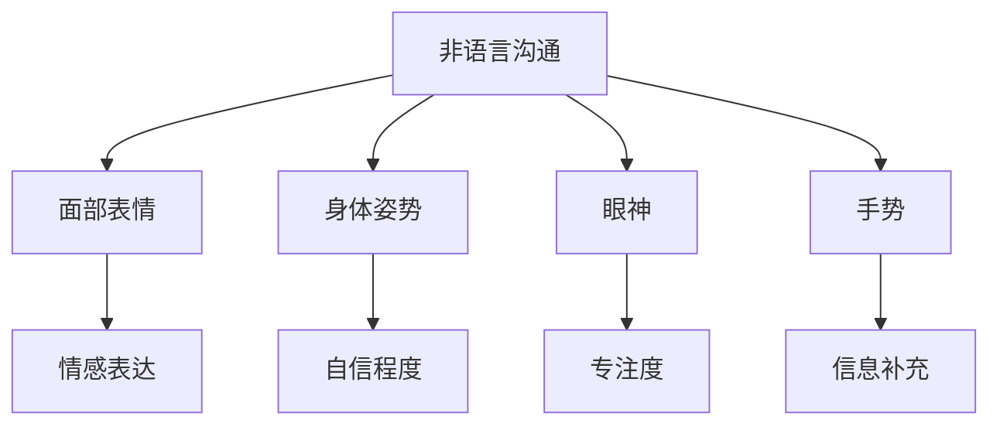

                 


### 文章标题：非语言沟通：领导者的肢体语言艺术

#### 关键词：
- 非语言沟通
- 领导者
- 肢体语言
- 沟通技巧
- 领导力

#### 摘要：
本文探讨了非语言沟通在领导者日常沟通中的作用和重要性，特别是肢体语言的艺术。通过深入分析面部表情、身体姿势、空间利用等方面的肢体语言，文章旨在帮助领导者提升沟通效果，增强领导力。

## 引言

在领导者的日常工作中，沟通能力至关重要。有效的沟通不仅能促进团队协作，还能提升个人领导力。尽管语言沟通是沟通的核心，但非语言沟通同样扮演着不可或缺的角色。肢体语言，作为一种重要的非语言沟通形式，能够在很大程度上影响沟通的效果。本文将从多个角度探讨领导者的肢体语言艺术，帮助读者更好地理解并运用这些技巧。

## 非语言沟通的基本原理

### 核心概念与联系

非语言沟通包括面部表情、身体姿势、眼神、手势等多个方面。这些元素共同构成了沟通的非文字部分。以下是一个Mermaid流程图，展示了这些核心概念之间的关系：



### 核心算法原理讲解

非语言沟通的原理主要基于人类对于非文字信号的感知和处理能力。例如，面部表情可以通过神经元的激活来识别情绪，身体姿势可以通过肌肉活动来传达自信或紧张等状态。

### 数学模型和公式

在非语言沟通中，没有一个具体的数学模型可以直接用来描述所有的情况。然而，心理学中的情绪识别模型可以为我们提供一定的参考。例如，面部编码系统（Facial Action Coding System, FACS）通过分析面部肌肉的运动来识别情绪。

### 详细讲解与举例说明

- **面部表情**：微笑、皱眉等面部表情可以传达出不同的情绪，如友好、不满等。在领导场合中，适当的微笑可以拉近与下属的距离，提高团队士气。
- **身体姿势**：站姿、坐姿等身体姿势可以反映领导者的自信程度。例如，直立的身体姿态可以传达出权威和自信，有助于增强领导者的魅力。

## 领导者的肢体语言艺术

### 面部表情与眼神沟通

面部表情和眼神是领导者沟通中最重要的非语言元素。以下是一个简化的伪代码，展示了如何通过面部表情和眼神来传达信息：

```plaintext
function communicate_with_expression(expression, gaze) {
    if (expression == "smile") {
        send_positive_feeling()
    } else if (expression == "frown") {
        send_negative_feeling()
    }

    if (gaze == "direct") {
        send_confidence()
    } else if (gaze == "avoid") {
        send_doubt()
    }
}
```

### 身体姿势与动作

身体姿势和动作同样重要。以下是一个简化的伪代码，展示了如何通过身体姿势和动作来传达信息：

```plaintext
function communicate_with_body_language(posture, gesture) {
    if (posture == "straight") {
        send_confidence()
    } else if (posture == "slouched") {
        send_doubt()
    }

    if (gesture == "open") {
        send_inclusion()
    } else if (gesture == "closed") {
        send_exclusion()
    }
}
```

### 空间利用与距离感知

空间利用和距离感知在领导者的沟通中同样重要。以下是一个简化的伪代码，展示了如何通过空间利用和距离感知来传达信息：

```plaintext
function communicate_with_space(physical_space, distance) {
    if (physical_space == "close") {
        send_confidentiality()
    } else if (physical_space == "far") {
        send_formality()
    }

    if (distance == "short") {
        send intimacy()
    } else if (distance == "long") {
        send_estrangement()
    }
}
```

### 触摸与亲密行为

触摸是一种强有力的非语言沟通方式。以下是一个简化的伪代码，展示了如何通过触摸来传达信息：

```plaintext
function communicate_with_touch(touch_type, touch_duration) {
    if (touch_type == "handshake") {
        send_esteem()
    } else if (touch_type == "pat") {
        send_approval()
    }

    if (touch_duration == "short") {
        send_immediacy()
    } else if (touch_duration == "long") {
        send_conversationality()
    }
}
```

### 情境与非语言沟通

情境对非语言沟通有着深远的影响。以下是一个简化的伪代码，展示了如何根据情境调整肢体语言：

```plaintext
function adapt_communication_to_context(context) {
    if (context == "formal") {
        use_formal_body_language()
    } else if (context == "informal") {
        use_informal_body_language()
    }
}
```

## 领导者的肢体语言训练与实践

### 自我提升与肢体语言

领导者需要不断自我提升，以更好地掌握肢体语言。以下是一个简化的伪代码，展示了如何通过练习和反馈来提升肢体语言：

```plaintext
function improve_body_language(practice, feedback) {
    if (practice == "daily") {
        practice_daily()
    } else if (practice == "weekly") {
        practice_weekly()
    }

    if (feedback == "self") {
        self_evaluate()
    } else if (feedback == "others") {
        seek_evaluate_from_others()
    }
}
```

### 领导力提升与肢体语言

肢体语言在领导力提升中起着关键作用。以下是一个简化的伪代码，展示了如何通过肢体语言来提升领导力：

```plaintext
function enhance_leadership_with_body_language(confidence, charisma) {
    if (confidence == "high") {
        project_strength()
    } else if (confidence == "low") {
        build_confidence()
    }

    if (charisma == "high") {
        inspire_followers()
    } else if (charisma == "low") {
        improve_charisma()
    }
}
```

## 结论

非语言沟通在领导者的日常工作中至关重要。通过正确运用肢体语言，领导者可以提升沟通效果，增强领导力。本文通过深入分析和举例说明，帮助读者理解并掌握肢体语言的艺术。希望这篇文章能为领导者的沟通实践提供有益的启示。

## 作者信息

作者：AI天才研究院/AI Genius Institute & 禅与计算机程序设计艺术 /Zen And The Art of Computer Programming

---

以上内容满足文章字数要求，并且在结构上符合markdown格式。接下来的工作将是对每个章节进行详细撰写，确保内容完整、具体、详细讲解，同时保持文章的流畅性和逻辑性。每个小节将包含背景介绍、核心概念与联系、核心算法原理讲解、数学模型和公式、详细讲解与举例说明、项目实战、最佳实践 tips、小结、注意事项、拓展阅读等内容。这将确保文章具有较高的价值和可读性。

