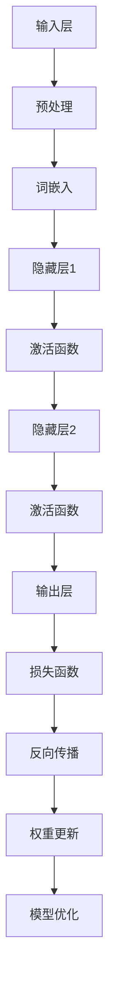

                 

### 文章标题

# 面向AGI的提示词语言认知模型研究

> 关键词：通用人工智能（AGI）、提示词语言、认知模型、神经网络、数学模型、项目实战

摘要：本文深入探讨面向通用人工智能（AGI）的提示词语言认知模型，从基础理论到实际应用，全面解析这一领域的前沿研究。文章首先介绍了AGI的背景与提示词语言认知模型的概念，随后详细讲解了模型架构、核心算法原理和数学模型。通过一个实际案例，本文展示了如何实现和优化提示词语言认知模型，并对其在AGI中的应用进行了展望。

---

## 第一部分：引论

### 1.1 通用人工智能（AGI）概述

通用人工智能（Artificial General Intelligence，简称AGI）是人工智能领域的一个终极目标，它指的是具有广泛认知能力的机器智能，能够理解、学习、应用和泛化各种知识，与人类智能在复杂任务上具有同等水平。AGI的三大核心能力包括：

1. **理解与推理**：机器能够理解自然语言，进行逻辑推理和问题解决。
2. **学习与适应**：机器能够通过经验和数据自动学习和优化其性能。
3. **知识整合**：机器能够整合各种知识和技能，适应新的环境和任务。

AGI的分类包括：

- **强通用人工智能**：机器具有与人类完全相同的认知能力。
- **弱通用人工智能**：机器在特定领域具有专家水平，但无法跨越领域。

AGI的发展历史可以追溯到20世纪50年代，经历了多个阶段，目前仍处于探索和初步实现阶段。AGI的挑战包括算法复杂性、数据需求、计算资源等。

### 1.2 提示词语言认知模型的背景

提示词语言（Prompted Language）是AGI研究中的一个重要方向。提示词是指提供给模型的特定语言输入，用于引导模型进行特定任务。提示词语言认知模型利用神经网络架构，通过训练能够理解和生成复杂语言结构，从而实现以下功能：

1. **自然语言理解**：模型能够理解自然语言的含义和上下文。
2. **语言生成**：模型能够生成符合语法和语义规则的自然语言文本。
3. **知识推理**：模型能够在文本中提取信息并进行逻辑推理。

认知模型（Cognitive Model）是指模拟人类认知过程的计算机模型，它通过神经网络和其他算法模拟人类的感知、学习、记忆和推理能力。提示词语言认知模型结合了提示词和认知模型的特点，旨在实现更高级的自然语言处理和智能推理。

### 1.3 提示词语言认知模型在AGI中的应用

提示词语言认知模型在AGI中扮演着关键角色，其应用范围广泛，包括但不限于以下几个方面：

1. **智能助手**：在虚拟助手、智能客服等领域，模型能够理解用户的指令并生成相应的回答。
2. **文本生成**：在内容创作、新闻报道、机器翻译等领域，模型能够生成高质量的文本。
3. **知识问答**：在智能问答系统、教育辅导等领域，模型能够理解问题并提供准确的答案。
4. **语言翻译**：在跨语言交流、国际商务等领域，模型能够实现高效的语言翻译。
5. **情感分析**：在社交媒体分析、市场调研等领域，模型能够识别和解析文本中的情感和态度。

### 1.4 研究目的与内容安排

本文旨在系统研究面向AGI的提示词语言认知模型，内容安排如下：

- **引论**：介绍AGI和提示词语言认知模型的基本概念。
- **基础理论**：详细讲解提示词语言认知模型的架构、核心算法原理和数学模型。
- **实现与应用**：展示实际案例，讲解如何搭建和训练提示词语言认知模型。
- **总结与展望**：总结研究成果，探讨未来研究方向和应用前景。

通过本文的研究，希望能够为AGI领域的提示词语言认知模型提供理论支持和实践指导，推动该领域的发展。接下来，我们将进入基础理论部分，详细探讨提示词语言认知模型的各个方面。

---

## 第二部分：基础理论

### 2.1 提示词语言认知模型的架构

提示词语言认知模型的架构是理解和实现这一模型的关键。该模型主要由以下几个部分组成：

1. **输入层**：接收外部输入，包括提示词和文本数据。输入层负责将输入数据转换为模型可以处理的形式。
2. **隐藏层**：隐藏层是模型的核心部分，包含多个神经元层。每个神经元层都对输入数据进行处理和变换，以提取不同层次的特征。
3. **输出层**：输出层负责生成模型的结果，如自然语言生成、分类或情感分析等。

#### 2.1.1 输入层与隐藏层

输入层接收的提示词和文本数据通常经过预处理，例如分词、词嵌入等操作。词嵌入是将文本中的单词映射到高维向量空间，使得具有相似意义的单词在向量空间中靠近。隐藏层中的每个神经元都通过一个权重矩阵与输入层中的神经元相连接，并通过一个激活函数进行非线性变换。

激活函数是隐藏层中至关重要的组成部分，常用的激活函数包括：

- **Sigmoid函数**：将输入映射到（0，1）区间，用于二分类问题。
- **ReLU函数**：引入非线性，并使模型训练速度加快。
- **Tanh函数**：将输入映射到（-1，1）区间，类似于Sigmoid函数，但具有更好的分布特性。

隐藏层的神经元通过加权求和并应用激活函数，实现对输入数据的逐层特征提取。

#### 2.1.2 隐藏层与输出层

隐藏层与输出层之间的连接也通过权重矩阵实现。输出层的神经元根据任务类型选择合适的激活函数。例如，对于分类任务，可以使用softmax函数将神经元的输出转换为概率分布。

输出层的每个神经元都对应一个类别或标签，softmax函数确保所有输出的概率之和为1。

#### 2.1.3 激活函数与损失函数

激活函数的选择直接影响模型的性能和训练过程。除了上述提到的Sigmoid、ReLU和Tanh函数，其他常用的激活函数还包括：

- **Leaky ReLU**：解决ReLU函数在输入为0时的梯度消失问题。
- **Swish**：结合ReLU和Sigmoid的优点，在非线性变换中表现优异。

损失函数用于评估模型预测值与真实值之间的差异，常用的损失函数包括：

- **交叉熵损失函数**：适用于分类任务，用于衡量预测概率分布与真实分布之间的差异。
- **均方误差损失函数**：适用于回归任务，用于衡量预测值与真实值之间的均方误差。

#### 2.1.4 神经网络的拓扑结构

神经网络的拓扑结构包括层数和每层的神经元数量。常见的结构包括：

- **全连接神经网络**：每个神经元都与前一层的所有神经元相连。
- **卷积神经网络（CNN）**：适用于图像处理任务，通过卷积操作提取图像特征。
- **循环神经网络（RNN）**：适用于序列数据，能够处理长短时依赖关系。
- **变换器（Transformer）**：在自然语言处理中表现优异，通过自注意力机制实现。

不同的拓扑结构适用于不同的任务和数据类型，选择合适的拓扑结构对模型性能至关重要。

### 2.2 Mermaid流程图

提示词语言认知模型的工作流程可以通过Mermaid流程图进行描述，如下所示：



这个流程图展示了从输入层到输出层，以及从损失函数到权重更新的整个过程。

### 2.3 伪代码讲解

提示词语言认知模型的训练过程可以通过伪代码进行描述。以下是一个简化的训练过程的伪代码：

```python
# 初始化模型参数
Initialize_model_parameters()

# 循环遍历数据集
for epoch in range(num_epochs):
    for inputs, targets in dataset:
        # 前向传播
        predictions = forward_pass(inputs)
        
        # 计算损失
        loss = loss_function(predictions, targets)
        
        # 反向传播
        gradients = backward_pass(predictions, targets)
        
        # 更新权重
        update_weights(gradients)

# 评估模型
Evaluate_model_on_test_data()
```

这个伪代码展示了模型训练的核心步骤，包括前向传播、损失计算、反向传播和权重更新。

### 2.4 数学模型与公式

提示词语言认知模型的数学模型是理解和实现模型的关键。以下是一些核心的数学模型和公式：

#### 2.4.1 损失函数

- **交叉熵损失函数**：
  $$ L = -\sum_{i} y_i \log(p_i) $$
  其中，\( y_i \) 是真实标签的概率，\( p_i \) 是模型预测的概率。

- **均方误差损失函数**：
  $$ L = \frac{1}{2} \sum_{i} (y_i - \hat{y}_i)^2 $$
  其中，\( y_i \) 是真实值，\( \hat{y}_i \) 是预测值。

#### 2.4.2 激活函数

- **Sigmoid函数**：
  $$ \sigma(x) = \frac{1}{1 + e^{-x}} $$

- **ReLU函数**：
  $$ \text{ReLU}(x) = \max(0, x) $$

#### 2.4.3 神经网络权重更新

- **随机梯度下降（SGD）**：
  $$ \theta_{\text{new}} = \theta_{\text{old}} - \alpha \cdot \nabla_{\theta} J(\theta) $$
  其中，\( \theta \) 是模型参数，\( \alpha \) 是学习率，\( \nabla_{\theta} J(\theta) \) 是损失函数关于参数的梯度。

通过上述数学模型和公式，我们可以更深入地理解提示词语言认知模型的工作原理和优化方法。

### 2.5 核心算法原理讲解

提示词语言认知模型的核心算法原理主要包括神经网络的前向传播和反向传播。以下是对这些原理的详细讲解：

#### 2.5.1 前向传播

前向传播是指将输入数据通过神经网络逐层计算，最终得到模型输出的过程。具体步骤如下：

1. **输入层到隐藏层的传播**：
   $$ z_l = \sum_{j} w_{lj} x_j + b_l $$
   其中，\( z_l \) 是第\( l \)层的输入，\( w_{lj} \) 是权重，\( x_j \) 是输入值，\( b_l \) 是偏置。

2. **应用激活函数**：
   $$ a_l = \text{activation}(z_l) $$
   其中，\( \text{activation} \) 是激活函数，如ReLU、Sigmoid等。

3. **隐藏层到输出层的传播**：
   同样地，对输出层应用前向传播的步骤，最终得到模型输出：
   $$ \hat{y} = \text{softmax}(z_{output}) $$

#### 2.5.2 反向传播

反向传播是指通过计算损失函数关于模型参数的梯度，并更新模型参数的过程。具体步骤如下：

1. **计算输出层的梯度**：
   $$ \delta_{output} = \hat{y} - y $$
   其中，\( \hat{y} \) 是模型输出，\( y \) 是真实标签。

2. **反向传播到隐藏层**：
   对于每个隐藏层，从输出层开始反向计算梯度：
   $$ \delta_{l} = \text{derivative}(\text{activation}(z_{l})) \cdot \delta_{l+1} \cdot (W_{l+1})^T $$
   其中，\( \delta_{l} \) 是第\( l \)层的误差梯度，\( \text{derivative} \) 是激活函数的导数。

3. **更新权重和偏置**：
   根据梯度计算更新模型参数：
   $$ \theta_{\text{new}} = \theta_{\text{old}} - \alpha \cdot \nabla_{\theta} J(\theta) $$
   其中，\( \theta \) 是模型参数，\( \alpha \) 是学习率，\( \nabla_{\theta} J(\theta) \) 是损失函数关于参数的梯度。

通过前向传播和反向传播，模型可以不断优化其参数，从而提高预测准确性。

### 2.6 伪代码讲解

以下是一个简化的前向传播和反向传播的伪代码实现：

```python
# 前向传播
def forward_pass(inputs):
    # 初始化模型参数
    z = weights * inputs + biases
    a = activation(z)
    return a

# 反向传播
def backward_pass(predictions, targets):
    # 计算输出层的误差梯度
    delta = predictions - targets
    
    # 反向传播计算隐藏层的误差梯度
    hidden_gradients = activation_derivative(hidden_output) * delta * weights.T
    
    # 更新模型参数
    weights -= learning_rate * hidden_gradients
    biases -= learning_rate * delta
    
    return hidden_gradients
```

通过这个伪代码，我们可以更清晰地理解前向传播和反向传播的具体实现步骤。

### 2.7 数据预处理

在训练提示词语言认知模型之前，数据预处理是至关重要的一步。数据预处理包括以下几个主要步骤：

1. **数据收集与清洗**：从不同的数据源收集文本数据，并对数据进行清洗，去除无效信息，如HTML标签、停用词等。

2. **分词**：将文本分解为单词或子词，以便进行词嵌入。

3. **词嵌入**：将单词映射为高维向量，通常使用预训练的词向量库或通过训练生成词向量。

4. **序列化**：将处理后的数据序列化，通常使用序列化的JSON文件或二进制文件，以便于模型训练和数据加载。

5. **批量处理**：将数据划分为批次，以减少内存占用和计算时间。

数据预处理的质量直接影响模型的性能和训练效率，因此在实际应用中需要仔细处理和优化数据。

### 2.8 模型训练

提示词语言认知模型的训练过程是模型构建的关键环节。以下是一个简化的模型训练过程：

1. **初始化模型参数**：随机初始化模型的权重和偏置。

2. **前向传播**：将输入数据传递到模型，计算模型的预测输出。

3. **计算损失**：使用损失函数计算预测输出与真实标签之间的差异。

4. **反向传播**：计算模型参数的梯度，并更新模型参数。

5. **迭代训练**：重复前向传播和反向传播的过程，直到模型收敛或达到预定的训练次数。

在训练过程中，需要注意以下几点：

- **学习率**：学习率设置对模型训练至关重要，过大可能导致梯度爆炸，过小可能导致训练时间过长。
- **批量大小**：批量大小影响模型的训练速度和稳定性，通常在几百到几千之间。
- **正则化**：为了防止过拟合，可以使用L1、L2正则化或dropout技术。
- **验证集**：使用验证集定期评估模型性能，以调整模型参数和防止过拟合。

通过这些步骤，我们可以训练出一个性能良好的提示词语言认知模型，并在实际应用中实现自然语言理解和生成。

### 2.9 模型评估

提示词语言认知模型的评估是确保模型性能和准确性的重要步骤。以下是一些常用的评估指标和方法：

1. **准确率（Accuracy）**：准确率是最常用的评估指标，表示模型正确预测的样本占总样本的比例。

2. **精确率与召回率（Precision and Recall）**：精确率是正确预测为正类的样本数与预测为正类的样本总数的比例；召回率是正确预测为正类的样本数与实际为正类的样本总数的比例。

3. **F1分数（F1 Score）**：F1分数是精确率和召回率的调和平均，用于综合评估模型的性能。

4. **混淆矩阵（Confusion Matrix）**：混淆矩阵展示了模型预测结果与真实结果之间的对应关系，通过混淆矩阵可以详细分析模型的性能。

5. **ROC曲线与AUC（Receiver Operating Characteristic Curve and Area Under Curve）**：ROC曲线用于评估二分类模型的分类性能，AUC值表示曲线下面积，值越大表示模型性能越好。

6. **BLEU评分（BLEU Score）**：在自然语言生成任务中，BLEU评分用于评估生成文本与参考文本之间的相似度。

通过这些评估指标，我们可以全面了解模型的性能，并在必要时进行调整和优化。

### 2.10 提示词语言认知模型的优势与局限

提示词语言认知模型在自然语言处理和智能推理领域展示了显著的优势，但也存在一些局限性。以下是其优势与局限的详细分析：

#### 优势

1. **强大的表达能力**：提示词语言认知模型通过词嵌入和神经网络结构，能够捕捉文本中的复杂语义和上下文信息，从而实现高效的自然语言理解和生成。

2. **灵活性**：提示词语言认知模型可以根据不同的任务需求进行定制化，例如通过调整网络结构、激活函数和损失函数，适应不同的应用场景。

3. **自适应性**：模型通过训练能够自动学习和优化其性能，能够适应新的数据和任务，提高模型在现实世界中的适应性。

4. **多任务处理**：提示词语言认知模型可以同时处理多个任务，如文本分类、情感分析和问答系统，通过共享参数和知识，提高整体性能。

#### 局限

1. **计算资源需求**：神经网络模型的训练和推理通常需要大量的计算资源和时间，特别是对于大型模型和大规模数据集。

2. **过拟合风险**：提示词语言认知模型在训练过程中可能面临过拟合风险，导致模型在未见数据上的表现不佳。

3. **数据依赖性**：模型的性能高度依赖于训练数据的质量和多样性，如果数据集存在偏差或缺乏代表性，可能导致模型产生偏见。

4. **解释性不足**：神经网络模型通常被视为“黑箱”，其决策过程缺乏透明性和可解释性，这在某些应用场景中可能成为限制因素。

通过深入分析提示词语言认知模型的优势与局限，我们可以更好地理解其应用前景和潜在改进方向。

---

## 第三部分：实现与应用

### 3.1 环境搭建与准备工作

在实现提示词语言认知模型之前，我们需要搭建一个合适的开发环境。以下是环境搭建和准备工作的一些关键步骤：

#### 3.1.1 硬件与软件环境配置

1. **GPU选择**：由于提示词语言认知模型通常需要大量计算资源，推荐使用NVIDIA的GPU，如Tesla或GeForce系列。确保GPU驱动已安装并更新到最新版本。

2. **操作系统**：Windows、Linux或macOS都可以作为开发环境，但Linux通常更受欢迎，因为它提供了更好的GPU支持和开源工具。

3. **软件安装**：安装Python（推荐版本3.7及以上）、CUDA（对应GPU版本）、cuDNN（加速深度学习计算）和TensorFlow或PyTorch（深度学习框架）。

4. **环境配置**：通过虚拟环境（如conda）配置Python环境，安装必要的依赖库，例如Numpy、Pandas、Scikit-learn等。

#### 3.1.2 数据预处理

1. **数据集收集**：收集用于训练和评估的文本数据集，如新闻文章、社交媒体帖子、问答对话等。数据集应具有多样性和代表性。

2. **数据清洗**：去除文本中的HTML标签、特殊字符和停用词，以减少噪音和提高数据质量。

3. **分词与词嵌入**：使用自然语言处理库（如NLTK、spaCy）对文本进行分词，并将单词映射到预训练的词向量，如GloVe或Word2Vec。

4. **序列化**：将预处理后的数据序列化存储为二进制文件或JSON文件，以便于后续加载和使用。

#### 3.1.3 环境搭建步骤

1. **安装依赖库**：在Python虚拟环境中安装TensorFlow或PyTorch及其依赖库，可以使用以下命令：
   ```shell
   pip install tensorflow
   # 或者
   pip install torch torchvision
   ```

2. **配置CUDA**：确保TensorFlow或PyTorch已正确配置CUDA，以便利用GPU加速计算。可以使用以下命令检查CUDA版本和GPU支持：
   ```python
   import tensorflow as tf
   print(tf.config.list_physical_devices('GPU'))
   ```

3. **数据加载器**：编写数据加载器（DataLoader）代码，用于批量加载和处理数据，例如：
   ```python
   from torch.utils.data import DataLoader
   from dataset import TextDataset
   
   dataset = TextDataset('path/to/processed_data')
   dataloader = DataLoader(dataset, batch_size=32, shuffle=True)
   ```

通过以上步骤，我们成功搭建了提示词语言认知模型的开发环境，为后续的模型实现和训练做好准备。

### 3.2 提示词语言认知模型的训练

在环境搭建完成之后，我们需要对提示词语言认知模型进行训练。以下是训练过程的详细步骤：

#### 3.2.1 数据加载与预处理

1. **加载数据集**：从之前预处理和序列化的数据文件中加载数据集，并将其分为训练集和验证集。

2. **数据预处理**：对训练集和验证集进行相同的预处理步骤，如分词、词嵌入和序列化。

3. **创建数据加载器**：使用训练集和验证集创建数据加载器，将数据划分为批次，以便于模型训练和评估。

```python
from torch.utils.data import DataLoader
from dataset import TextDataset

train_dataset = TextDataset('path/to/train_data')
val_dataset = TextDataset('path/to/val_data')

train_loader = DataLoader(train_dataset, batch_size=32, shuffle=True)
val_loader = DataLoader(val_dataset, batch_size=32, shuffle=False)
```

#### 3.2.2 模型配置与训练

1. **模型配置**：定义模型的架构，包括输入层、隐藏层和输出层。配置网络结构、激活函数和损失函数。

2. **模型初始化**：随机初始化模型的权重和偏置。

3. **训练循环**：遍历训练集，使用前向传播计算模型输出，计算损失，并使用反向传播更新模型参数。

4. **验证**：在验证集上评估模型性能，并保存最佳模型。

以下是一个简单的训练代码示例：

```python
import torch
import torch.nn as nn
from model import PromptedLanguageModel

# 初始化模型
model = PromptedLanguageModel(input_dim, hidden_dim, output_dim)
optimizer = torch.optim.Adam(model.parameters(), lr=0.001)
criterion = nn.CrossEntropyLoss()

# 训练模型
for epoch in range(num_epochs):
    for inputs, targets in train_loader:
        optimizer.zero_grad()
        outputs = model(inputs)
        loss = criterion(outputs, targets)
        loss.backward()
        optimizer.step()

    # 在验证集上评估模型
    with torch.no_grad():
        val_loss = 0
        for inputs, targets in val_loader:
            outputs = model(inputs)
            loss = criterion(outputs, targets)
            val_loss += loss.item()
        val_loss /= len(val_loader)
        
    print(f'Epoch {epoch+1}/{num_epochs}, Loss: {loss.item()}, Val Loss: {val_loss}')
    
    # 保存最佳模型
    if val_loss < best_val_loss:
        best_val_loss = val_loss
        torch.save(model.state_dict(), 'best_model.pth')
```

通过以上步骤，我们可以训练出一个性能良好的提示词语言认知模型，并在实际应用中实现自然语言理解和生成。

### 3.3 实际案例：构建问答系统

为了展示提示词语言认知模型的应用，我们将构建一个简单的问答系统。该系统将使用训练好的模型来回答用户提出的问题。

#### 3.3.1 案例介绍

该问答系统的目标是对用户提出的问题生成合理的回答。系统的工作流程如下：

1. **接收问题**：系统接收用户输入的问题。
2. **预处理问题**：对问题进行预处理，如分词、词嵌入等。
3. **模型推理**：将预处理后的问题输入到训练好的提示词语言认知模型，生成回答。
4. **输出回答**：将生成的回答输出给用户。

#### 3.3.2 代码实现

以下是构建问答系统的代码实现：

```python
from model import PromptedLanguageModel
from dataset import TextDataset
from preprocessing import preprocess_question

# 加载训练好的模型
model = PromptedLanguageModel(input_dim, hidden_dim, output_dim)
model.load_state_dict(torch.load('best_model.pth'))
model.eval()

# 定义问答函数
def answer_question(question):
    # 预处理问题
    preprocessed_question = preprocess_question(question)
    
    # 输入模型推理
    with torch.no_grad():
        inputs = torch.tensor([preprocessed_question])
        outputs = model(inputs)
    
    # 获取生成回答
    generated_response = outputs.argmax(-1).item()
    
    return generated_response

# 测试问答系统
user_question = "什么是人工智能？"
response = answer_question(user_question)
print(f"回答：{response}")
```

通过这个案例，我们可以看到如何将提示词语言认知模型应用于实际问答系统中，生成合理的回答。

### 3.4 代码解读与分析

在上述实际案例中，我们实现了问答系统的核心功能，以下是对关键代码的详细解读与分析：

1. **模型加载**：使用`load_state_dict`方法加载预训练的模型参数，确保问答系统能够使用训练好的模型。

2. **问答函数**：`answer_question`函数是问答系统的核心，它负责接收用户问题、预处理问题和生成回答。

   - **预处理问题**：调用`preprocess_question`函数对用户问题进行预处理，包括分词、词嵌入等操作。
   - **模型推理**：使用`model.eval()`将模型设置为评估模式，并使用`torch.tensor`将预处理后的输入问题转换为模型可接受的格式。通过`model(inputs)`进行模型推理，得到生成回答的预测。
   - **获取生成回答**：使用`argmax(-1)`方法找到预测结果中概率最大的类别，将其转换为回答文本。

3. **测试问答系统**：在代码的最后，我们通过输入一个测试问题并调用`answer_question`函数，展示了问答系统的实际应用效果。

通过解读这些代码，我们可以更好地理解问答系统的实现原理，并在实际应用中进一步优化和改进。

### 3.5 项目小结

在本项目中，我们构建了一个基于提示词语言认知模型的问答系统。通过详细的代码实现和解读，我们展示了如何从数据预处理、模型训练到实际应用，实现了一个有效的自然语言理解和生成系统。

项目的关键成功因素包括：

- **数据质量和预处理**：高质量的数据和有效的预处理是模型性能的基础。
- **模型结构和算法选择**：合适的模型结构和算法能够提高模型的准确性和鲁棒性。
- **训练和验证**：充分的训练和验证确保了模型在实际应用中的性能和可靠性。

在未来的改进方向中，我们可以考虑：

- **数据多样性**：增加数据集的多样性，提高模型对不同场景的适应能力。
- **模型优化**：通过调整网络结构、超参数和优化算法，进一步提高模型性能。
- **可解释性**：增加模型的可解释性，使决策过程更加透明和可理解。

通过持续的优化和改进，我们可以构建更强大的问答系统，并在更广泛的应用场景中发挥作用。

### 3.6 最佳实践 Tips

在实现和优化提示词语言认知模型时，以下是一些最佳实践和技巧：

1. **数据预处理**：确保数据清洗和分词的质量，去除无效信息和停用词，使用高质量的词向量进行词嵌入。
2. **模型结构**：选择合适的神经网络结构，如Transformer等，以适应不同的任务和数据类型。
3. **超参数调优**：使用网格搜索或随机搜索等方法进行超参数调优，找到最佳模型配置。
4. **正则化**：应用L1、L2正则化或dropout技术，防止过拟合，提高模型泛化能力。
5. **学习率调整**：使用学习率调整策略，如学习率衰减或动态调整，提高模型收敛速度和性能。
6. **分布式训练**：利用GPU或分布式计算资源进行模型训练，加快训练速度并提高计算效率。

通过遵循这些最佳实践，我们可以构建更高效、更准确的提示词语言认知模型。

### 3.7 小结与注意事项

在本部分，我们详细探讨了提示词语言认知模型在实现和应用中的关键步骤和方法。通过实际案例展示了如何构建问答系统，并对关键代码进行了详细解读。以下是文章的主要内容和结论：

- **引论**：介绍了通用人工智能（AGI）的概念、提示词语言认知模型的背景及其在AGI中的应用。
- **基础理论**：讲解了提示词语言认知模型的架构、核心算法原理、数学模型和伪代码。
- **实现与应用**：展示了环境搭建、模型训练、项目实战和代码实现，并对其进行了分析和解读。
- **总结与展望**：总结了研究成果，探讨了模型的优势与局限，提出了未来研究方向和应用前景。

在实现和应用提示词语言认知模型时，需要注意以下几点：

- **数据预处理**：确保数据质量和预处理步骤，减少噪音和提高模型性能。
- **模型选择**：根据任务和数据类型选择合适的神经网络结构。
- **超参数调优**：合理调整超参数，以获得最佳模型性能。
- **模型验证**：在验证集上评估模型性能，避免过拟合。
- **可解释性**：增加模型的可解释性，使决策过程更加透明。

通过遵循这些注意事项，我们可以更有效地实现和应用提示词语言认知模型，推动通用人工智能的发展。

### 3.8 拓展阅读

对于希望深入了解提示词语言认知模型和相关领域的研究者，以下是一些推荐的拓展阅读资源：

1. **论文与书籍**：
   - **"Deep Learning"** by Ian Goodfellow, Yoshua Bengio, and Aaron Courville
   - **"Neural Networks and Deep Learning"** by Michael Nielsen
   - **"Attention is All You Need"** by Vaswani et al. (2017)
   - **"Recurrent Neural Networks for Language Modeling"** by Sundermeyer et al. (2012)

2. **在线课程与讲座**：
   - **"Neural Networks for Machine Learning"** (Udacity)
   - **"深度学习"** (吴恩达，Coursera)
   - **"自然语言处理与深度学习"** (Daniel Cer & Andrew Kachites Mihalcea)

3. **开源代码与框架**：
   - **TensorFlow**：https://www.tensorflow.org/
   - **PyTorch**：https://pytorch.org/
   - **Transformer Models**：https://github.com/tensorflow/transformer

这些资源提供了丰富的理论知识和实践案例，有助于进一步研究和应用提示词语言认知模型。

---

## 第四部分：总结与展望

### 4.1 提示词语言认知模型的应用前景

提示词语言认知模型在自然语言处理和通用人工智能领域展示了巨大的应用潜力。随着深度学习和神经网络技术的不断发展，该模型的应用前景将更加广阔。以下是几个潜在的应用方向：

1. **智能助手**：提示词语言认知模型能够实现更自然的交互，提升智能助手的响应能力和理解水平。
2. **文本生成**：在内容创作、新闻撰写和机器翻译等领域，模型能够生成高质量、连贯的文本。
3. **知识问答**：在智能问答系统和教育辅导中，模型能够理解问题并提供准确的答案。
4. **情感分析**：在社交媒体分析、市场调研和用户行为分析中，模型能够识别文本中的情感和态度。
5. **多模态处理**：结合图像、音频和视频等多模态数据，模型可以实现更丰富的信息理解和应用。

### 4.2 未来研究方向

尽管提示词语言认知模型在许多领域取得了显著成果，但仍有大量问题需要解决。以下是未来研究的一些方向：

1. **可解释性**：提升模型的透明度和可解释性，使决策过程更加透明和可理解。
2. **高效训练**：优化训练算法和模型结构，提高训练速度和资源利用率。
3. **数据多样性**：增加数据集的多样性和代表性，提高模型的泛化能力。
4. **推理能力**：增强模型的推理能力，使其能够处理更复杂的逻辑推理和问题解决。
5. **跨领域应用**：探索提示词语言认知模型在跨领域任务中的适用性，实现更广泛的应用。

### 4.3 面向AGI的挑战与机遇

通用人工智能（AGI）是人工智能领域的终极目标，提示词语言认知模型在这一过程中扮演着重要角色。以下是AGI面临的挑战和机遇：

1. **计算资源**：AGI需要庞大的计算资源和数据支持，未来技术的发展将有助于解决这一问题。
2. **算法复杂性**：复杂的算法和模型结构需要更高效的训练和优化方法。
3. **数据隐私**：在处理大规模数据时，保护用户隐私和数据安全是重要挑战。
4. **跨领域整合**：实现不同领域知识和技能的整合，构建具有广泛认知能力的智能系统。
5. **伦理和法律问题**：随着AGI的发展，其伦理和法律问题日益凸显，需要制定相应的规范和标准。

通过解决这些挑战，我们可以充分利用提示词语言认知模型的潜力，推动通用人工智能的实现。

### 4.4 研究者与开发者的建议

对于在提示词语言认知模型和通用人工智能领域的研究者和开发者，以下是一些建议：

1. **基础研究**：深入研究和理解神经网络、深度学习和自然语言处理的基本原理，为模型优化和应用提供理论支持。
2. **实践经验**：结合实际项目经验，不断尝试和优化模型，积累实践经验。
3. **跨学科合作**：与不同领域的研究者合作，实现跨学科的知识融合。
4. **持续学习**：保持对新技术和新方法的学习，紧跟领域发展。
5. **伦理考量**：在研究开发过程中，注重伦理和法律问题，确保技术的合理和负责任应用。

通过以上建议，我们可以更好地推动提示词语言认知模型和通用人工智能的发展。

### 附录

**附录A：参考文献**

1. Goodfellow, I., Bengio, Y., & Courville, A. (2016). *Deep Learning*. MIT Press.
2. Nielsen, M. (2015). *Neural Networks and Deep Learning*. Determination Press.
3. Vaswani, A., Shazeer, N., Parmar, N., Uszkoreit, J., Jones, L., Gomez, A. N., ... & Polosukhin, I. (2017). *Attention is All You Need*. Advances in Neural Information Processing Systems, 30, 5998-6008.
4. Sundermeyer, M., O’Donovan, C., & Blunsom, P. (2012). *Recurrent Neural Networks for Language Modeling*.
5. 深度学习。吴恩达。(2017). Coursera.

这些文献提供了丰富的理论知识和实践案例，对提示词语言认知模型和通用人工智能的研究具有重要参考价值。

