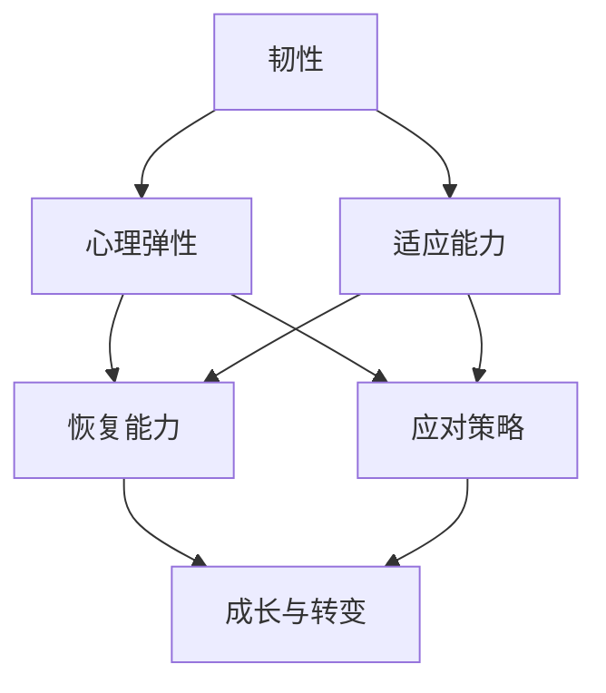
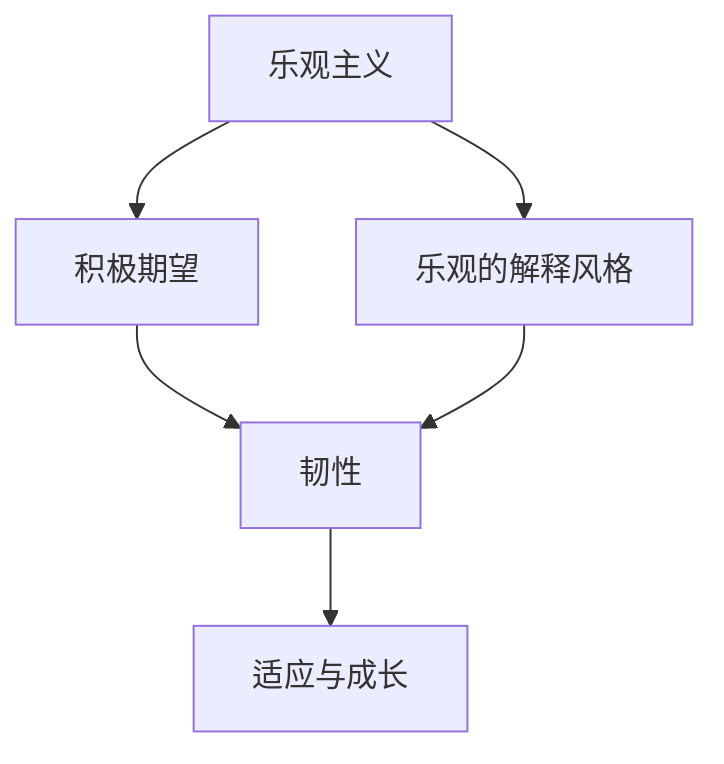
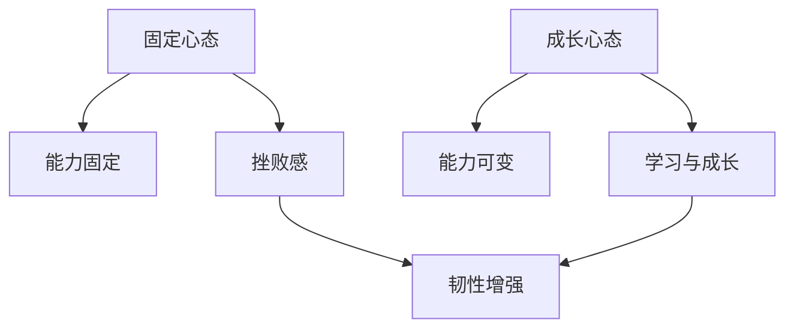
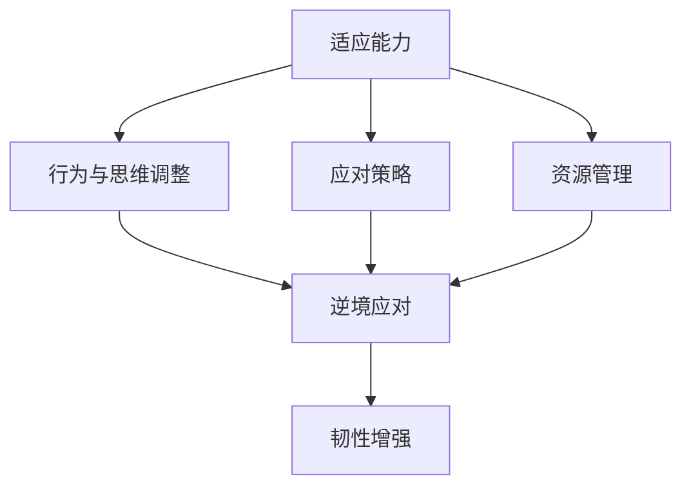
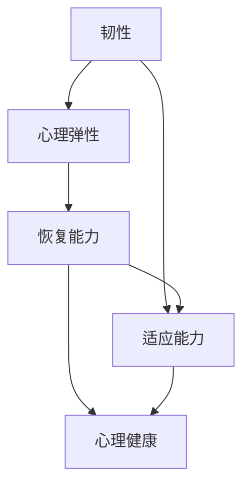
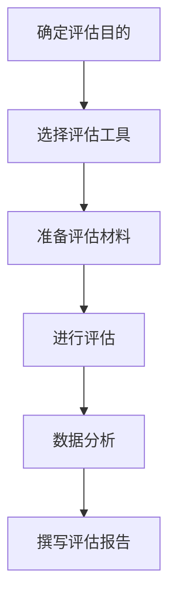
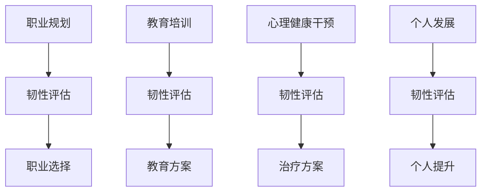

                 


### 文章标题：韧性培养：增强面对逆境的能力

> 关键词：韧性、逆境、心理弹性、压力管理、情绪调节、案例分析

> 摘要：本文将探讨韧性培养的重要性，阐述其在面对逆境中的应用，并通过理论基础、实践方法和案例分析，提供全面的韧性培养指南。

## 前言

韧性（Resilience）是近年来在心理学、教育学和职场管理等领域广受关注的一个概念。它指的是个体在面对逆境、压力和挑战时，能够迅速适应、恢复和成长的能力。一个具有高韧性的个体，不仅能够在困难面前保持冷静和乐观，还能从逆境中汲取力量，不断提升自我。

在当今快速变化的世界中，人们面临的各种挑战和压力越来越大。无论是职场上的竞争、学业上的压力，还是生活中的突发事件，都要求我们具备强大的韧性。本文将从以下几个方面展开讨论：

1. **韧性的核心概念与联系**：介绍韧性的定义，阐述其与心理弹性、适应能力等概念之间的关系，并通过 Mermaid 流程图展示这些概念之间的联系。
2. **韧性理论**：介绍几种主要的韧性理论，包括韧性-乐观理论、韧性-成长模型和韧性-适应性模型，并探讨这些理论在韧性培养中的应用。
3. **韧性评估**：介绍韧性评估工具和方法，帮助读者了解自身的韧性水平。
4. **韧性培养**：详细讲解心理韧性训练、压力管理和情绪调节等韧性培养方法，并提供实用的技巧和策略。
5. **案例分析**：通过真实的韧性培养案例，分析其成功和挑战，为读者提供实际操作的经验和启示。
6. **韧性实践**：总结韧性培养的最佳实践，提供详细的操作指南和实用工具。

本文旨在为读者提供一套全面、系统的韧性培养指南，帮助他们在面对逆境时保持坚韧和适应力。通过本文的探讨，读者将能够深入了解韧性培养的重要性和方法，为提升自身的逆境应对能力奠定基础。

## 第一部分：理论基础

### 第1章：韧性的核心概念与联系

#### 1.1 韧性的定义

韧性，是指个体在面临逆境、压力和挑战时，能够迅速适应、恢复和成长的能力。它不仅仅是一个心理状态，更是一种动态过程，涉及个体在逆境中的行为模式、认知态度和情绪反应。韧性的关键在于个体如何理解、应对和转化逆境，从而实现自我提升和成长。

#### 1.2 韧性与心理弹性的关系

心理弹性（Mental Elasticity），又称心理韧性（Mental Resilience），与韧性密切相关。心理弹性是指个体在面对压力、挑战和逆境时，能够迅速恢复和适应的能力。心理弹性和韧性都是指个体在逆境中的适应和恢复能力，但韧性的范畴更广，它还包括个体在逆境中的成长和积极转变。

#### 1.3 韧性与适应能力的关系

适应能力（Adaptability）是韧性的一部分，指的是个体在面对变化和挑战时，能够灵活调整自己的行为和思维方式，以适应新环境和要求。韧性较强的个体通常具有更强的适应能力，能够在变化中找到新的机会和资源，从而实现个人成长。

#### 1.4 韧性概念之间的联系

为了更好地理解韧性，我们可以通过 Mermaid 流程图来展示韧性、心理弹性和适应能力之间的关系。



在这个流程图中，韧性作为核心概念，连接了心理弹性和适应能力。心理弹性和适应能力都包括恢复能力和应对策略，而恢复能力和应对策略又促进了成长与转变。

#### 1.5 韧性的重要性

韧性对于个体的发展至关重要。它不仅影响到个人的心理健康，还影响到职业成功和社会关系。以下是韧性的一些重要作用：

1. **心理健康的保障**：韧性较强的个体在面对压力和困难时，能够更好地保持心理健康，减少焦虑和抑郁等负面情绪。
2. **职业成功的推动**：韧性较强的个体在职场中更能应对挑战，适应变化，从而获得职业成功。
3. **人际关系的发展**：韧性有助于个体建立稳定、健康的人际关系，提高社会支持系统。
4. **应对生活的突发事件**：韧性使个体在面对生活突发事件时，能够更加从容和理性地应对，减少负面影响。

通过上述分析，我们可以看到韧性不仅是个人心理健康和职业成功的保障，也是一种重要的生活技能。在接下来的章节中，我们将进一步探讨韧性理论、评估方法和实践技巧，帮助读者更好地理解和培养韧性。

### 第2章：韧性理论

#### 2.1 韧性-乐观理论

韧性-乐观理论（Optimism-Resilience Theory）是由心理学家塞利格曼（Martin Seligman）提出的。该理论认为，乐观主义和韧性是相互关联的，它们共同决定了个体在面对逆境时的表现。

根据韧性-乐观理论，乐观主义包括两个主要方面：

1. **积极期望**：乐观主义者对未来持有积极的态度，相信自己能够克服困难，实现目标。
2. **乐观的解释风格**：乐观主义者倾向于将负面事件视为暂时性和特定性的，而不是普遍性和永久性的。

韧性-乐观理论的核心观点是，乐观主义和韧性相互作用，共同促进个体的适应和成长。具体来说：

1. **乐观主义的正面影响**：乐观主义使个体在面对逆境时，能够保持积极的态度和信心，从而提高韧性和适应能力。
2. **韧性的正面影响**：韧性使个体能够从逆境中迅速恢复，并将其视为成长和学习的机会。

以下是一个简单的 Mermaid 流程图，展示了韧性-乐观理论的核心概念和关系：



通过这个流程图，我们可以看到乐观主义和韧性之间的紧密联系。乐观主义通过积极期望和乐观的解释风格，促进了韧性的形成和发展，进而推动个体的适应与成长。

#### 2.2 韧性-成长模型

韧性-成长模型（Growth Model of Resilience）是由心理学家德韦克（Carol Dweck）提出的。该理论认为，韧性是个体在逆境中不断成长和发展的过程，这一过程受到两种心态的影响：

1. **固定心态**：固定心态（Fixed Mindset）是指个体认为能力是固定不变的，无法通过努力改变。持有固定心态的个体在面临挑战时，更容易感到挫败，缺乏韧性。
2. **成长心态**：成长心态（Growth Mindset）是指个体认为能力是可以通过努力和经验不断发展的。持有成长心态的个体在面对挑战时，更能坚持努力，具备更强的韧性。

韧性-成长模型的核心观点是，通过培养成长心态，个体可以增强韧性，实现个人成长和发展。具体来说：

1. **固定心态的负面影响**：固定心态使个体在面对失败时，更容易感到自我怀疑和失望，从而影响韧性。
2. **成长心态的正面影响**：成长心态使个体能够将失败视为成长和学习的机会，从而提高韧性和适应能力。

以下是一个简单的 Mermaid 流程图，展示了韧性-成长模型的核心概念和关系：



通过这个流程图，我们可以看到固定心态和成长心态对韧性的影响。固定心态导致个体在面对挑战时，缺乏韧性和适应能力，而成长心态则促进了韧性的增强和个人的成长。

#### 2.3 韧性-适应性模型

韧性-适应性模型（Adaptive Model of Resilience）是由心理学家拉塞尔（Karen Reivich）和海斯（Andrew Shatte）提出的。该理论强调，韧性是个体在逆境中不断适应和调整的过程。

韧性-适应性模型认为，韧性包括三个关键方面：

1. **适应能力**：适应能力是指个体在面对逆境时，能够迅速调整自己的行为和思维方式，以适应新环境和要求。
2. **应对策略**：应对策略是指个体在逆境中采取的各种应对措施，包括情绪调节、认知重构和寻求支持等。
3. **资源管理**：资源管理是指个体在逆境中合理利用和管理自身的资源，包括时间、精力和社会支持等。

韧性-适应性模型的核心观点是，通过提高适应能力、应对策略和资源管理能力，个体可以增强韧性，实现个人成长和发展。以下是一个简单的 Mermaid 流程图，展示了韧性-适应性模型的核心概念和关系：



通过这个流程图，我们可以看到韧性-适应性模型中的三个关键方面是如何相互关联和促进的。适应能力、应对策略和资源管理共同构成了韧性的核心，使个体能够更好地应对逆境，实现个人成长。

#### 2.4 韧性与心理弹性的关系

心理弹性（Mental Elasticity）和韧性（Resilience）是两个密切相关的概念，它们都描述了个体在面对逆境时的适应和恢复能力。然而，韧性更强调个体在逆境中的成长和积极转变，而心理弹性则更侧重于个体在逆境中的适应和恢复。

1. **韧性与心理弹性的区别**：

   - 韧性：韧性是指个体在面对逆境时，能够迅速适应、恢复和成长的能力。它不仅涉及心理层面的适应，还包括行为和认知层面的积极转变。
   - 心理弹性：心理弹性是指个体在面对压力和挑战时，能够迅速恢复和适应的能力，主要关注心理层面的恢复和适应。

2. **韧性与心理弹性的联系**：

   - 共同目标：韧性和心理弹性的共同目标是帮助个体更好地应对逆境，提高心理健康和幸福感。
   - 相互作用：韧性中的适应和恢复能力与心理弹性密切相关。一个具有高韧性的个体通常也具备较高的心理弹性，而高心理弹性也有助于个体发展韧性。

以下是一个简单的 Mermaid 流程图，展示了韧性与心理弹性的关系：



通过这个流程图，我们可以看到韧性和心理弹性之间的紧密联系。韧性和心理弹性共同构成了个体在面对逆境时的适应和恢复能力，两者相互作用，共同促进个体的心理健康和幸福感。

### 第3章：韧性评估

#### 3.1 韧性评估工具

评估韧性对于了解个体在逆境中的表现和潜力至关重要。以下是一些常用的韧性评估工具：

1. **韧性量表（Resilience Scale）**

   韧性量表是一种广泛使用的评估工具，用于评估个体在逆境中的适应和恢复能力。常见的韧性量表包括康奈尔韧性量表（Cornell Resilience Scale）和韧性量表（Resilience Measure）。

   **康奈尔韧性量表（CRS）**：该量表包括30个项目，主要评估个体的应对策略、心理弹性、社会支持等维度。

   **韧性量表（RM）**：该量表包括25个项目，主要评估个体的应对能力、情绪调节、自我效能感等维度。

2. **韧性自我评估问卷（Self-Report Resilience Questionnaire）**

   韧性自我评估问卷是一种简便的自我评估工具，用于评估个体对韧性的认知和自我评价。常见的韧性自我评估问卷包括韧性自我评估问卷（Self-Compassion Scale）和韧性特质问卷（Trait Resilience Questionnaire）。

   **韧性自我评估问卷（SRQ）**：该问卷包括一系列关于个体在逆境中的行为和情绪反应的问题，用于评估个体的韧性水平。

3. **韧性访谈（Resilience Interview）**

   韧性访谈是一种深入的方法，通过面对面的交流，了解个体在逆境中的经历和表现。这种方法可以提供更为详细和个性化的韧性评估结果。

#### 3.2 韧性评估步骤

进行韧性评估通常需要以下步骤：

1. **确定评估目的**：明确评估的目的和目标，例如了解个体的韧性水平、发现潜在的韧性优势和劣势等。

2. **选择评估工具**：根据评估目的，选择合适的韧性评估工具。可以选择单一工具，也可以结合多种工具进行综合评估。

3. **准备评估材料**：准备好评估所需的问卷、量表或访谈指南，并确保评估过程中所需的设备和环境。

4. **进行评估**：按照评估工具的指导，进行韧性评估。对于问卷和量表，可以通过纸质或电子方式完成；对于访谈，则需要面对面或远程交流。

5. **数据分析**：对评估结果进行数据分析，包括计算得分、分析维度之间的关系等。

6. **撰写评估报告**：根据分析结果，撰写韧性评估报告，包括评估目的、方法、结果和结论。

以下是一个简化的 Mermaid 流程图，展示了韧性评估的基本步骤：



通过这个流程图，我们可以清晰地了解韧性评估的步骤和关键环节。

#### 3.3 韧性评估应用

韧性评估不仅有助于了解个体在逆境中的表现，还可以为韧性培养提供重要的参考。以下是一些韧性评估在实践中的应用：

1. **职业规划**：通过韧性评估，可以帮助职业规划师和雇主了解候选人在面对职业挑战时的韧性和适应能力，从而做出更合理的职业选择。

2. **教育培训**：学校和教育机构可以通过韧性评估，了解学生在面对学业压力和挑战时的韧性水平，为制定个性化的教育方案提供依据。

3. **心理健康干预**：心理医生和治疗师可以利用韧性评估，了解患者在心理健康问题中的韧性水平，制定更有效的治疗和干预方案。

4. **个人发展**：个人可以通过韧性评估，了解自己在面对生活挑战时的韧性和适应能力，从而有针对性地进行个人发展和提升。

以下是一个简化的 Mermaid 流程图，展示了韧性评估在个人发展中的应用：



通过这个流程图，我们可以看到韧性评估在不同领域中的应用和作用。通过科学的韧性评估，个体可以更好地了解自己在面对逆境时的优势和劣势，从而制定更有效的应对策略和提升计划。

### 第4章：心理韧性训练

#### 4.1 心理韧性训练概述

心理韧性训练（Psychological Resilience Training）是一种旨在提高个体在逆境中适应和恢复能力的方法。通过系统性的训练，个体可以学习到一系列应对策略和技巧，从而在面临压力和挑战时保持冷静和乐观。以下是心理韧性训练的基本概念和组成部分：

1. **概念**：

   心理韧性训练是一种通过心理干预和技能训练，帮助个体提高韧性水平的方法。它涵盖了认知、行为和情感等方面的内容，旨在增强个体的适应能力、应对策略和心理健康。

2. **组成部分**：

   - **认知训练**：通过认知重构、思维策略和问题解决训练，帮助个体改变负面思维模式，提高应对逆境的能力。
   - **行为训练**：通过自我调节、情绪管理和社交技能训练，帮助个体在行为层面应对逆境，提高适应能力。
   - **情感训练**：通过情感调节、正念练习和自我接纳训练，帮助个体在情感层面应对逆境，提高心理健康。

3. **目的**：

   心理韧性训练的主要目的是提高个体在逆境中的适应和恢复能力，帮助个体在面对压力和挑战时保持冷静和乐观，从而实现个人成长和发展。

#### 4.2 心理韧性训练方法

心理韧性训练方法多种多样，以下介绍几种常用的训练方法：

1. **认知重构训练**

   认知重构训练（Cognitive Restructuring Training）是一种通过改变负面思维模式，提高个体应对逆境能力的训练方法。具体步骤如下：

   - **识别负面思维**：帮助个体识别和意识到自己的负面思维模式，例如过度自我批评、灾难化思维等。
   - **评估思维影响**：引导个体评估负面思维对自己的情绪和行为的影响。
   - **挑战负面思维**：通过证据和逻辑，质疑和挑战负面思维，找到更合理和积极的思维模式。
   - **建立积极思维**：帮助个体建立积极的思维模式，例如感恩思维、乐观思维等。

   以下是一个简化的伪代码，描述了认知重构训练的步骤：

   ```python
   function cognitive_restructuring(thoughts):
       for thought in thoughts:
           if is_negative(thought):
               evaluate_impact(thought)
               challenge_thought(thought)
               establish_positive_thought(thought)
           else:
               continue
       return thoughts
   ```

2. **自我调节训练**

   自我调节训练（Self-Regulation Training）是一种通过训练个体自我控制能力，提高应对逆境能力的训练方法。具体步骤如下：

   - **呼吸调节**：通过深呼吸练习，帮助个体放松身体和情绪，提高自我控制能力。
   - **情绪调节**：通过情绪调节技巧，帮助个体识别和调节负面情绪，提高情绪稳定性。
   - **目标设定**：通过目标设定和实现，帮助个体提高自我控制和解决问题的能力。

   以下是一个简化的伪代码，描述了自我调节训练的步骤：

   ```python
   function self Regulation Training():
       while True:
           perform_breathing_exercise()
           perform_emotional Regulation()
           set_and_achieve_goals()
           if goal_achieved():
               break
       return "Training completed"
   ```

3. **情绪调节训练**

   情绪调节训练（Emotional Regulation Training）是一种通过训练个体情绪管理能力，提高应对逆境能力的训练方法。具体步骤如下：

   - **情绪识别**：帮助个体识别和了解自己的情绪，例如愤怒、焦虑、抑郁等。
   - **情绪表达**：通过情绪表达技巧，帮助个体表达和理解自己的情绪，减少情绪压抑。
   - **情绪调节**：通过情绪调节技巧，帮助个体调节和缓解负面情绪，提高情绪稳定性。

   以下是一个简化的伪代码，描述了情绪调节训练的步骤：

   ```python
   function emotional Regulation Training():
       while True:
           identify_emotions()
           express_emotions()
           regulate_emotions()
           if emotion_stabilized():
               break
       return "Training completed"
   ```

#### 4.3 心理韧性训练实践

心理韧性训练需要通过实践来巩固和提升效果。以下是一些实践建议：

1. **日常练习**：

   - 每天进行深呼吸练习，帮助放松身体和情绪。
   - 每天进行情绪记录，识别和表达自己的情绪。
   - 每周设定一个目标，并努力实现。

2. **小组讨论**：

   - 加入心理韧性训练小组，与他人分享自己的经历和感受。
   - 参与小组讨论，学习他人的应对策略和经验。

3. **专业指导**：

   - 寻求专业心理辅导，了解自己的韧性水平和提升策略。
   - 定期进行心理韧性评估，了解自己的进步和改进方向。

通过日常练习、小组讨论和专业指导，个体可以有效地提升心理韧性，更好地应对生活中的挑战和逆境。

### 第5章：压力管理

#### 5.1 压力的定义与影响

压力（Stress）是指个体在面对外部环境要求时，感受到的生理和心理上的紧张状态。压力可以来自多个方面，包括工作压力、人际关系、健康问题、经济状况等。压力管理（Stress Management）是指通过一系列方法和技术，帮助个体应对和减轻压力的过程。

压力对个体的生理和心理影响是多方面的。以下是压力的几种主要影响：

1. **生理影响**：

   - **免疫系统功能下降**：长期压力可能导致免疫系统功能下降，增加感染和生病的风险。
   - **心血管系统问题**：压力可能导致高血压、心率加快等心血管问题。
   - **消化系统问题**：压力可能导致胃痛、消化不良等消化系统问题。
   - **肌肉紧张和疼痛**：长期压力可能导致肌肉紧张和疼痛，影响日常生活。

2. **心理影响**：

   - **情绪问题**：压力可能导致情绪波动，如焦虑、抑郁、愤怒等。
   - **认知功能下降**：压力可能影响认知功能，如注意力、记忆力、决策能力等。
   - **行为问题**：压力可能导致不良行为，如吸烟、饮酒、暴饮暴食等。
   - **人际关系问题**：压力可能影响人际关系，导致沟通障碍和冲突。

#### 5.2 压力管理策略

有效的压力管理策略可以帮助个体更好地应对压力，减少压力的负面影响。以下是一些常见的压力管理策略：

1. **时间管理**：

   时间管理是指合理安排时间和任务，以减少时间压力。以下是一些时间管理技巧：

   - **制定计划**：每天制定详细的计划和日程，合理安排工作和休息时间。
   - **优先排序**：将任务按照重要性和紧急性进行排序，优先完成重要且紧急的任务。
   - **避免拖延**：设定明确的目标和截止日期，避免拖延任务。
   - **合理安排休息时间**：保证足够的休息时间，避免过度工作。

   以下是一个简化的伪代码，描述了时间管理策略：

   ```python
   function time_management(tasks):
       for task in tasks:
           if is_urgent(task) and is Important(task):
               complete_task(task)
           elif is_urgent(task):
               schedule_task(task)
           elif is_important(task):
               schedule_task(task)
           else:
               postpone_task(task)
       return "Time management completed"
   ```

2. **放松技巧**：

   放松技巧是指通过一系列方法，帮助个体放松身心，减轻压力。以下是一些常见的放松技巧：

   - **深呼吸练习**：通过深呼吸，帮助个体放松身体和情绪。
   - **瑜伽和冥想**：瑜伽和冥想有助于放松身心，提高情绪稳定性。
   - **按摩和放松疗法**：通过按摩和放松疗法，帮助个体缓解身体紧张和疼痛。
   - **听音乐和放松音乐**：听音乐，特别是放松音乐，有助于减轻压力和焦虑。

   以下是一个简化的伪代码，描述了放松技巧：

   ```python
   function relaxation_techniques():
       while True:
           perform_deep_breathing()
           perform_yoga_or_meditation()
           receive_massage()
           listen_to_relaxing_music()
           if feeling_stressed():
               continue
           else:
               break
       return "Relaxation techniques completed"
   ```

3. **沟通技巧**：

   沟通技巧是指通过有效的沟通，减轻压力和解决冲突。以下是一些沟通技巧：

   - **积极倾听**：通过积极倾听，理解他人的观点和感受，建立有效沟通。
   - **明确表达**：通过明确表达自己的需求和感受，避免误解和冲突。
   - **寻求支持**：在面临压力时，主动寻求家人、朋友或专业人士的支持和帮助。
   - **冲突解决**：通过有效的冲突解决技巧，解决工作中的冲突和问题。

   以下是一个简化的伪代码，描述了沟通技巧：

   ```python
   function communication_skills():
       while True:
           practice_active Listening()
           express_ideas_clarly()
           seek_support()
           resolve_conflicts()
           if conflict_resolved():
               continue
           else:
               break
       return "Communication skills completed"
   ```

#### 5.3 压力管理实践

以下是一些实际案例，展示了如何应用压力管理策略：

1. **案例一：工作压力管理**

   小明是一名软件工程师，工作压力大，经常感到身心疲惫。为了缓解压力，他采取了以下策略：

   - **时间管理**：制定详细的日程计划，确保工作与休息时间的平衡。
   - **放松技巧**：每天下班后进行深呼吸练习和瑜伽，放松身心。
   - **沟通技巧**：与同事和上司进行有效沟通，明确工作要求和截止日期，避免误解和冲突。

   通过这些策略，小明的压力得到了有效缓解，工作效率和生活质量都有了显著提升。

2. **案例二：学业压力管理**

   小红是一名高中生，面临着学业压力。为了应对压力，她采取了以下策略：

   - **时间管理**：合理安排学习时间和休息时间，确保充足的睡眠。
   - **放松技巧**：每天进行深呼吸练习和听放松音乐，缓解紧张情绪。
   - **情绪调节**：通过运动和与朋友交流，调节情绪，保持积极心态。

   通过这些策略，小红在学业上取得了更好的成绩，同时保持了身心健康。

通过以上案例，我们可以看到，有效的压力管理策略对于缓解压力和提升生活质量具有重要意义。在日常生活中，我们应不断学习和实践各种压力管理技巧，以应对各种挑战和压力。

### 第6章：情绪调节

情绪调节（Emotional Regulation）是指个体在情感反应过程中，通过一系列认知和行为策略，调整和控制情绪的过程。情绪调节对于维持心理健康、提高生活质量具有重要意义。有效的情绪调节可以帮助个体更好地应对压力和挑战，减少负面情绪对生活的干扰。

#### 6.1 情绪调节理论

情绪调节理论主要包括以下几种：

1. **认知重评理论（Cognitive Appraisal Theory）**

   认知重评理论认为，情绪的产生和调节取决于个体对事件的认知评估。当个体对事件的评估为负性时，情绪调节的目标是改变对事件的认知评估，从而减少负面情绪。以下是一个简化的伪代码，描述了认知重评理论的基本过程：

   ```python
   function cognitive_reappraisal(event):
       negative_evaluation = evaluate(event)
       if negative_evaluation:
           alternative_evaluation = find_alternative_evaluation(event)
           update_evaluation(event, alternative_evaluation)
           reduce_negative_emotion(event)
       return event
   ```

2. **情绪调节策略理论（Emotion Regulation Strategies Theory）**

   情绪调节策略理论认为，情绪调节是通过一系列具体的策略和技巧来实现的。这些策略包括认知重构、情感表达、行为调节等。以下是一个简化的伪代码，描述了情绪调节策略理论的基本过程：

   ```python
   function emotion Regulation_Strategies(emotion):
       strategies = ["cognitive_restructuring", "express_emotion", "behavioral_modification"]
       for strategy in strategies:
           if strategy == "cognitive_restructuring":
               cognitive_restructure(emotion)
           elif strategy == "express_emotion":
               express_emotion(emotion)
           elif strategy == "behavioral_modification":
               modify_behavior(emotion)
           reduce_emotion(emotion)
       return emotion
   ```

3. **情绪调节过程模型（Emotion Regulation Process Model）**

   情绪调节过程模型认为，情绪调节是一个动态的过程，涉及情绪识别、情绪评估、情绪反应和情绪调节等多个环节。以下是一个简化的伪代码，描述了情绪调节过程模型的基本过程：

   ```python
   function emotion Regulation_Process():
       emotion = identify_emotion()
       evaluate_emotion(emotion)
       respond_to_emotion(emotion)
       regulate_emotion(emotion)
       return emotion
   ```

#### 6.2 情绪调节技巧

以下是一些常用的情绪调节技巧：

1. **深呼吸练习**

   深呼吸练习是一种简单而有效的情绪调节技巧，可以帮助个体放松身体和情绪。以下是一个简化的伪代码，描述了深呼吸练习的基本过程：

   ```python
   function deep_breathing():
       while True:
           inhale_deeply()
           hold_breath()
           exhale_gently()
           if feeling_stressed():
               continue
           else:
               break
       return "Deep breathing completed"
   ```

2. **正念练习**

   正念练习（Mindfulness Practice）是一种通过专注于当前时刻，提高情绪调节能力的技巧。以下是一个简化的伪代码，描述了正念练习的基本过程：

   ```python
   function mindfulness_practice():
       while True:
           focus_on_breathing()
           observe_thoughts_and_feelings()
           return_to_focus()
           if feeling_stressed():
               continue
           else:
               break
       return "Mindfulness practice completed"
   ```

3. **认知重构**

   认知重构（Cognitive Restructuring）是一种通过改变负面思维模式，提高情绪调节能力的技巧。以下是一个简化的伪代码，描述了认知重构的基本过程：

   ```python
   function cognitive_restructuring(thoughts):
       for thought in thoughts:
           if is_negative(thought):
               challenge_thought(thought)
               replace_thought_with_positive(thought)
           else:
               continue
       return thoughts
   ```

4. **情感表达**

   情感表达（Expressive Emotion）是一种通过表达和分享自己的情感，提高情绪调节能力的技巧。以下是一个简化的伪代码，描述了情感表达的基本过程：

   ```python
   function express_emotion(emotion):
       while True:
           identify_emotion(emotion)
           express_emotion_constructionively()
           if feeling_released():
               continue
           else:
               break
       return "Emotion expressed"
   ```

5. **行为调节**

   行为调节（Behavioral Regulation）是一种通过改变行为和活动，提高情绪调节能力的技巧。以下是一个简化的伪代码，描述了行为调节的基本过程：

   ```python
   function behavioral_regulation():
       while True:
           identify_unhealthy_behavior()
           replace_behavior_with_healthy_behavior()
           if feeling_enhanced():
               continue
           else:
               break
       return "Behavior regulated"
   ```

#### 6.3 情绪调节实践

以下是一些实际案例，展示了如何应用情绪调节技巧：

1. **案例一：缓解工作压力**

   小王是一名项目经理，工作压力大，经常感到焦虑。为了缓解压力，他采取了以下策略：

   - **深呼吸练习**：每天早晨进行深呼吸练习，放松身心。
   - **正念练习**：在工作间隙，通过正念练习，提高专注力和情绪稳定性。
   - **认知重构**：通过认知重构，改变对工作压力的负面认知，提高积极心态。

   通过这些策略，小王的焦虑感得到了有效缓解，工作效率和工作质量都有了显著提升。

2. **案例二：应对考试压力**

   小张是一名大学生，面临期末考试，感到压力很大。为了应对考试压力，他采取了以下策略：

   - **情绪表达**：与同学和朋友分享自己的担忧和压力，获得支持和理解。
   - **行为调节**：合理安排学习时间，避免熬夜和过度劳累。
   - **认知重构**：通过认知重构，改变对考试失败的恐惧，提高积极心态。

   通过这些策略，小张在考试中表现更加稳定，最终取得了满意的成绩。

通过以上案例，我们可以看到，有效的情绪调节技巧对于缓解压力和提升生活质量具有重要意义。在日常生活中，我们应不断学习和实践各种情绪调节技巧，以应对各种挑战和压力。

### 第7章：韧性实践

#### 7.1 韧性培养案例研究

为了更好地理解韧性培养的实践过程，我们通过三个具体的案例来分析韧性培养的成功和挑战。

#### 案例一：职场韧性培养

**背景**：李先生是一家大型互联网公司的项目经理，工作繁忙且竞争激烈。他经常面临项目延误、团队冲突和压力过大的挑战。

**成功策略**：

1. **积极心态**：李先生通过自我反思，认识到保持积极心态的重要性。他尝试从积极的角度看待问题，寻找解决方案，而不是陷入消极情绪。

2. **时间管理**：李先生制定了详细的工作计划，合理安排时间和任务，确保工作与休息时间的平衡。

3. **团队支持**：李先生主动与团队成员沟通，建立良好的团队关系，通过团队合作解决问题，减少压力。

4. **专业发展**：李先生积极参加公司提供的培训和研讨会，提升自己的专业技能和管理能力，从而增强应对挑战的信心。

**挑战与解决方案**：

- **挑战一：团队冲突**：李先生在工作中遇到了与团队成员的冲突。他采取了开放沟通的方式，倾听对方的观点，寻找共同点，最终达成了共识。

- **挑战二：工作压力**：在面对工作压力时，李先生通过深呼吸和冥想练习来放松身心，提高情绪稳定性。

**总结**：李先生的韧性培养实践，通过积极心态、时间管理、团队支持和专业发展等多种策略，成功提升了他在面对职场挑战时的适应和恢复能力。

#### 案例二：学生韧性培养

**背景**：张同学是一名高三学生，面临着高考的压力和学业负担。

**成功策略**：

1. **目标设定**：张同学设定了明确的学习目标，并制定了详细的学习计划，确保学习与休息的平衡。

2. **情绪调节**：张同学通过运动、听音乐和与朋友交流等方式，调节情绪，缓解压力。

3. **自我激励**：张同学通过自我激励，保持积极的学习态度，相信自己能够应对高考的挑战。

4. **时间管理**：张同学合理安排学习时间，避免熬夜，保证充足的休息。

**挑战与解决方案**：

- **挑战一：学习压力**：张同学通过时间管理和情绪调节，有效减轻了学习压力。

- **挑战二：考试焦虑**：张同学通过认知重构，改变对考试失败的恐惧，提高自信心。

**总结**：张同学通过目标设定、情绪调节、自我激励和时间管理等多种策略，成功提升了在学业挑战中的韧性。

#### 案例三：个人韧性培养

**背景**：王女士是一名全职妈妈，同时兼顾家庭和事业。她经常感到时间不足和压力巨大。

**成功策略**：

1. **任务分解**：王女士将复杂的任务分解成小的、可管理的部分，从而减少压力。

2. **时间管理**：王女士制定了详细的日程表，合理安排家庭和工作的任务，确保有足够的休息时间。

3. **家庭支持**：王女士与丈夫和子女进行了沟通，获得了家庭的支持和理解，减轻了家庭责任的压力。

4. **自我关爱**：王女士通过自我关爱，如定期进行运动、阅读和SPA等，提高了自身的情绪和能量水平。

**挑战与解决方案**：

- **挑战一：时间不足**：王女士通过任务分解和时间管理，提高了时间利用效率。

- **挑战二：情绪压力**：王女士通过自我关爱和家庭支持，有效缓解了情绪压力。

**总结**：王女士通过任务分解、时间管理、家庭支持和自我关爱等多种策略，成功提升了在家庭和事业中的韧性。

通过这三个案例，我们可以看到韧性培养在实践中是如何进行的，以及在面对不同挑战时，个体可以采取哪些策略来提升韧性。这些实践经验为其他希望增强韧性的人提供了宝贵的启示。

### 第8章：韧性实践

#### 8.1 韧性培养挑战与解决方案

在韧性培养的过程中，个体可能会面临多种挑战。以下是一些常见的挑战及其解决方案：

1. **挑战一：心理疲劳**

   - **解决方案**：定期休息和放松，如进行深呼吸练习、瑜伽、冥想等。同时，确保充足的睡眠和均衡的饮食。

2. **挑战二：缺乏动力**

   - **解决方案**：设定明确的目标和计划，分解大任务为小步骤，逐步实现。通过奖励机制激励自己，如完成一项任务后，给自己一个小奖励。

3. **挑战三：社交障碍**

   - **解决方案**：积极参与社交活动，主动与朋友和家人沟通。如果需要，可以寻求专业心理咨询师的帮助，学习社交技巧。

4. **挑战四：情绪失控**

   - **解决方案**：学习情绪调节技巧，如正念练习、认知重构、情绪表达等。通过练习和持续实践，提高情绪调节能力。

5. **挑战五：缺乏自我认同**

   - **解决方案**：通过自我反思和积极自我评价，建立自我认同。关注自己的优点和成就，培养自信和自尊。

#### 8.2 韧性实践建议

为了有效培养韧性，以下是一些建议：

1. **建立支持系统**：与家人、朋友和同事建立良好的关系，形成一个支持你的社交网络。

2. **持续学习和成长**：通过学习新的技能和知识，不断提升自己的能力和自信心。

3. **保持积极心态**：通过积极的思考和行动，培养乐观的生活态度。

4. **实践情绪调节**：定期练习情绪调节技巧，如深呼吸、冥想、运动等，以帮助你在面对压力时保持冷静和平衡。

5. **设定目标和计划**：明确自己的目标，制定详细的计划，并通过持续的努力和反馈来调整计划。

6. **定期自我反思**：定期进行自我反思，了解自己的进步和需要改进的地方，从而不断提升自我。

通过上述建议，个体可以更好地应对生活中的挑战和压力，逐步培养和提高韧性。

### 附录A：韧性培养资源

#### 附录A.1 推荐阅读

1. **《韧性：如何应对生活中的不可预见性》（Resilience: Hard-Won Wisdom for Living a Better Life）** - 作者：史蒂芬·霍尔（Stephen Hall）。这本书通过讲述真实的个人故事，展示了韧性是如何在逆境中发挥作用的。

2. **《积极心理学：探索人类的优势和美德》（Positive Psychology: The Science of Happiness and Human Strengths）** - 作者：马丁·塞利格曼（Martin Seligman）。这本书详细介绍了积极心理学的基本概念和韧性培养的方法。

3. **《韧性心理学：如何在逆境中成长》（The Resilience Factor: 7 Keys to Finding Your Inner Strength and Overcoming Life's Hurdles）** - 作者：凯伦·赖维希（Karen Reivich）和安德鲁·沙特（Andrew Shatte）。这本书提供了实用的韧性培养策略，帮助读者在面对逆境时保持坚韧。

#### 附录A.2 相关网站

1. **积极心理学研究中心（Center for Positive Psychology Research）** - 网址：[https://cppr.unsw.edu.au/](https://cppr.unsw.edu.au/)。该网站提供了大量的韧性培养资源和研究成果。

2. **美国心理学会（American Psychological Association）** - 网址：[https://www.apa.org/](https://www.apa.org/)。该网站提供了丰富的心理学相关资源和专业指导。

3. **韧性教育网络（Resilience Education Network）** - 网址：[https://resiliencynetwork.ca/](https://resiliencynetwork.ca/)。该网站专注于韧性教育和培训，提供了实用的资源和工具。

#### 附录A.3 韧性工具与应用

1. **韧性评估工具**：

   - **康奈尔韧性量表（Cornell Resilience Scale）**：网址：[https://www.sustainabledevelopment.un.org/content/cornell-resilience-scale](https://www.sustainabledevelopment.un.org/content/cornell-resilience-scale)
   - **韧性自我评估问卷（Self-Report Resilience Questionnaire）**：网址：[https://www.resilience-innovation.com/srq/](https://www.resilience-innovation.com/srq/)

2. **情绪调节工具**：

   - **正念冥想应用**：如“正念冥想”（Headspace）和“冥想花园”（Mandala）等应用，提供多种冥想和呼吸练习，帮助用户放松和调节情绪。

3. **压力管理工具**：

   - **时间管理工具**：如“Trello”（trello.com）和“Todoist”（todoist.com）等应用，帮助用户合理安排任务和时间，减少压力。

4. **心理健康工具**：

   - **心理健康应用**：如“Sanvello”（sanvelloapp.com）和“Talkspace”（talkspace.com）等应用，提供专业的心理健康服务和在线咨询，帮助用户管理心理健康问题。

这些资源和工具为读者提供了丰富的韧性培养材料和实用的操作指南，有助于他们在实际生活中培养和提高韧性。

### 附录B：韧性培养实用工具

#### 附录B.1 韧性评估工具

1. **康奈尔韧性量表（Cornell Resilience Scale）**

   康奈尔韧性量表是一种广泛使用的评估工具，用于评估个体在面对逆境时的韧性水平。该量表包括多个维度，如应对策略、社会支持、自我效能感等。

   **使用方法**：

   - 指导个体完成量表中的问题，根据自身经历和感受进行回答。
   - 收集并分析个体的答案，计算得分，评估韧性水平。

2. **韧性自我评估问卷（Self-Report Resilience Questionnaire）**

   韧性自我评估问卷是一种简便的自我评估工具，用于评估个体对韧性的认知和自我评价。该问卷包括一系列关于个体在逆境中的行为和情绪反应的问题。

   **使用方法**：

   - 指导个体完成问卷中的问题，根据自身经历和感受进行回答。
   - 收集并分析个体的答案，评估韧性水平。

#### 附录B.2 情绪调节工具

1. **深呼吸应用**

   深呼吸应用如“Breathe”和“Respire”等，提供深呼吸指导，帮助用户放松身心，减轻压力。

   **使用方法**：

   - 下载并安装深呼吸应用。
   - 根据应用提供的指导，进行深呼吸练习。
   - 每日坚持练习，以提升情绪调节能力。

2. **冥想应用**

   冥想应用如“Headspace”和“Calm”等，提供冥想指导，帮助用户培养专注力和情绪稳定性。

   **使用方法**：

   - 下载并安装冥想应用。
   - 根据应用提供的课程，进行冥想练习。
   - 每日坚持练习，以提升情绪调节能力。

#### 附录B.3 压力管理工具

1. **时间管理应用**

   时间管理应用如“Trello”和“Todoist”等，帮助用户合理安排任务和时间，减轻压力。

   **使用方法**：

   - 下载并安装时间管理应用。
   - 创建任务清单，分配优先级和时间。
   - 定期查看和更新任务清单，确保任务按时完成。

2. **压力监测应用**

   压力监测应用如“ StressStop”和“Relax Melodies”等，提供压力监测和放松音乐，帮助用户减轻压力。

   **使用方法**：

   - 下载并安装压力监测应用。
   - 在感到压力时，使用应用提供的功能进行放松。
   - 每日使用，以帮助缓解压力。

通过上述工具，读者可以更加便捷地评估自身的韧性水平，调节情绪和管理压力，从而在实际生活中更好地培养和提高韧性。

### 总结

韧性培养是一个复杂而持续的过程，它要求我们在面对逆境时，不仅要有积极的认知态度，还需要采取具体的行动策略。通过本文的探讨，我们了解了韧性培养的核心概念、理论模型和评估方法，学习了心理韧性训练、压力管理和情绪调节等实践技巧。同时，通过案例分析，我们看到了韧性培养在实际生活中的应用和效果。

为了有效地培养韧性，我们需要：

1. **建立支持系统**：与家人、朋友和同事建立良好的关系，形成一个支持你的社交网络。
2. **持续学习和成长**：通过学习新的技能和知识，不断提升自己的能力和自信心。
3. **保持积极心态**：通过积极的思考和行动，培养乐观的生活态度。
4. **实践情绪调节**：定期练习情绪调节技巧，如深呼吸、冥想等，以帮助你在面对压力时保持冷静和平衡。
5. **设定目标和计划**：明确自己的目标，制定详细的计划，并通过持续的努力和反馈来调整计划。
6. **定期自我反思**：定期进行自我反思，了解自己的进步和需要改进的地方，从而不断提升自我。

总之，韧性培养是一个长期的过程，它需要我们的持续努力和耐心。通过本文的分享，希望读者能够认识到韧性培养的重要性，并在实际生活中逐步培养和提高自己的韧性，以更好地应对未来的挑战。作者：AI天才研究院/AI Genius Institute & 禅与计算机程序设计艺术 /Zen And The Art of Computer Programming。

