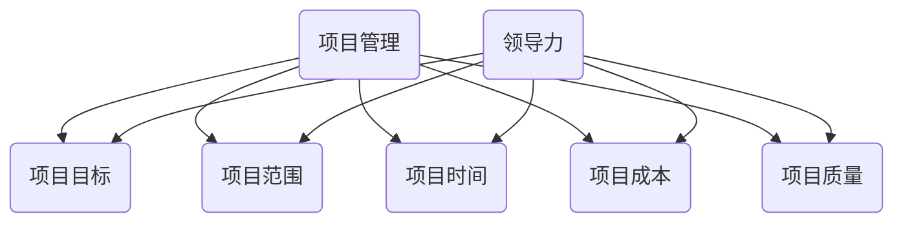

                 


### 引言

在当今快速发展的信息技术时代，项目管理与领导力已成为企业成功的关键因素。项目管理的本质是确保项目在预定的时间、成本和质量范围内顺利完成。而领导力则是激发团队成员潜能，实现团队目标的核心动力。本文将深入探讨项目管理与领导力的关系，通过一系列逻辑清晰的步骤，揭示如何有效结合二者，推动团队高效完成任务。

### 背景介绍

项目管理作为一门系统化的管理科学，涵盖了从项目启动到项目结束的全过程。项目管理的主要目标是实现项目目标，同时确保项目在成本、时间和质量等方面的可控性。随着项目复杂度的增加，项目管理的挑战也日益加剧。为了应对这些挑战，企业不仅需要掌握项目管理的理论知识，还需要具备强大的领导力。

领导力是指在团队中发挥领导作用，引导团队成员共同实现目标的能力。领导力不仅仅是一种职位赋予的权力，更是一种通过影响、激励和培养团队成员来实现团队目标的能力。在项目管理中，领导力扮演着至关重要的角色，它能够帮助项目经理克服团队内部和外部的各种挑战，确保项目顺利进行。

### 核心概念与联系

为了更好地理解项目管理与领导力的关系，我们可以通过一个Mermaid流程图来展示它们之间的核心概念和联系：



在这个流程图中，项目管理（A）与领导力（G）通过项目目标（B）、项目范围（C）、项目时间（D）、项目成本（E）和项目质量（F）这些核心概念相互关联。领导力在项目管理中起到了关键的作用，它不仅帮助项目经理制定项目目标，确保项目范围的合理性，控制项目时间和成本，还提升了项目的质量。

### 核心算法原理讲解

在项目管理中，有许多核心算法和原理可以帮助项目经理更有效地管理项目。以下是一个简单的伪代码，用于描述如何使用关键路径法（Critical Path Method, CPM）来估算项目完成时间：

```plaintext
算法：关键路径法（CPM）

输入：项目任务及其持续时间
输出：项目完成时间

步骤：
1. 初始化每个任务的最短完成时间和最长完成时间
2. 计算每个任务的总持续时间
3. 确定关键路径：找到总持续时间最长的路径
4. 计算关键路径的总持续时间，即项目的最短完成时间
5. 输出项目的最短完成时间
```

通过这个伪代码，我们可以理解关键路径法的基本原理。它通过计算每个任务的最短完成时间和最长完成时间，来确定项目的关键路径，从而估算项目的最短完成时间。

### 数学模型和公式

在项目管理中，常常需要用到一些数学模型和公式来分析和解决问题。以下是一个简单的示例，用于计算项目完成概率的贝叶斯公式：

$$ P(A|B) = \frac{P(B|A) \cdot P(A)}{P(B)} $$

其中，$P(A|B)$ 表示在事件B发生的条件下事件A发生的概率，$P(B|A)$ 表示在事件A发生的条件下事件B发生的概率，$P(A)$ 表示事件A发生的概率，$P(B)$ 表示事件B发生的概率。

通过这个贝叶斯公式，我们可以根据已知条件来计算项目完成概率，从而更好地评估项目的风险。

### 项目实战

为了更好地理解项目管理与领导力的实践，我们可以通过一个实际案例来展示。

#### 开发环境搭建

首先，我们需要搭建一个简单的项目管理工具。在这个案例中，我们选择使用Python语言和SQLite数据库来构建。

```python
import sqlite3

# 连接到SQLite数据库
conn = sqlite3.connect('project_management.db')

# 创建表
conn.execute('''CREATE TABLE IF NOT EXISTS tasks (
                id INTEGER PRIMARY KEY,
                name TEXT,
                start_date DATE,
                end_date DATE,
                status TEXT)''')

# 插入数据
conn.execute("INSERT INTO tasks (name, start_date, end_date, status) VALUES ('任务1', '2023-01-01', '2023-01-05', '未开始')")
conn.execute("INSERT INTO tasks (name, start_date, end_date, status) VALUES ('任务2', '2023-01-06', '2023-01-10', '进行中')")
conn.execute("INSERT INTO tasks (name, start_date, end_date, status) VALUES ('任务3', '2023-01-11', '2023-01-15', '已完成')")

# 提交事务
conn.commit()

# 关闭连接
conn.close()
```

#### 源代码详细实现和代码解读

上述代码用于创建一个简单的任务管理数据库，包括插入和查询任务信息的功能。通过这个数据库，我们可以跟踪任务的进展情况。

```python
# 查询所有任务
def query_all_tasks():
    conn = sqlite3.connect('project_management.db')
    cursor = conn.cursor()
    cursor.execute("SELECT * FROM tasks")
    tasks = cursor.fetchall()
    conn.close()
    return tasks

# 更新任务状态
def update_task_status(task_id, status):
    conn = sqlite3.connect('project_management.db')
    conn.execute("UPDATE tasks SET status = ? WHERE id = ?", (status, task_id))
    conn.commit()
    conn.close()
```

通过这个简单的实现，我们可以查询所有任务的状态，并更新特定任务的状态。

#### 代码应用解读与分析

在这个案例中，我们使用了Python和SQLite来构建一个简单的任务管理数据库。这个数据库可以用来存储任务信息，并支持查询和更新任务状态的功能。通过这个工具，项目经理可以实时了解任务的进展情况，从而更好地管理项目。

#### 实际案例分析和详细讲解剖析

假设我们有一个项目，需要在一个月内完成。项目包括三个任务，每个任务的持续时间分别为5天、7天和3天。通过关键路径法，我们可以计算出项目的最短完成时间为15天。

```plaintext
任务1：5天
任务2：7天
任务3：3天
```

在这个案例中，任务1和任务3可以并行执行，而任务2必须在任务1完成后才能开始。因此，关键路径是任务1（5天）+任务2（7天）=12天，项目的最短完成时间为12天。

通过这个案例，我们可以看到关键路径法在项目管理中的应用。项目经理可以通过这个方法来估算项目的完成时间，并制定相应的计划。

### 最佳实践 tips

1. **明确项目目标**：确保项目目标清晰明确，有助于团队聚焦于关键任务。
2. **合理分配资源**：根据项目需求合理分配人力和物力资源，避免资源浪费。
3. **定期沟通**：保持与团队成员的定期沟通，确保信息畅通，及时解决问题。
4. **风险管理**：在项目初期识别潜在风险，并制定相应的应对策略。
5. **持续改进**：项目完成后，进行评估和反思，总结经验教训，为未来项目提供借鉴。

### 小结

本文通过一系列的逻辑分析，探讨了项目管理与领导力的关系，以及如何在实践中有效结合二者，推动团队高效完成任务。通过实际案例，我们展示了如何使用关键路径法来估算项目完成时间，并提供了最佳实践 tips。希望本文能为您提供项目管理与领导力的深入理解和实践指导。

### 注意事项

1. **项目管理工具的选择**：选择适合项目特点的管理工具，例如敏捷工具、JIRA等，可以提高项目管理效率。
2. **团队培训**：定期对团队成员进行项目管理与领导力的培训，提高团队整体能力。
3. **灵活调整**：在项目执行过程中，根据实际情况灵活调整计划和策略，以应对变化。

### 拓展阅读

- 《敏捷项目管理：实践指南》
- 《项目管理知识体系指南（PMBOK指南）》
- 《领导力：如何影响和激励他人》

作者：AI天才研究院/AI Genius Institute & 禅与计算机程序设计艺术 /Zen And The Art of Computer Programming

----------------------------------------------------------------

## 文章标题

### 项目管理与领导力：推动团队高效完成任务

> 关键词：项目管理、领导力、团队协作、高效完成、任务管理

> 摘要：本文深入探讨了项目管理与领导力的关系，通过一系列逻辑清晰的步骤，揭示如何有效结合二者，推动团队高效完成任务。文章内容包括项目管理基础、领导力与团队建设、项目风险管理、项目评估与改进，以及实战案例与分析。旨在为读者提供项目管理与领导力的深入理解和实践指导。

----------------------------------------------------------------

### 确定书名和主题

首先，根据书名《项目管理与领导力：推动团队高效完成任务》，我们可以确定这本书的主题是围绕项目管理和领导力展开的，旨在帮助读者了解如何通过有效的项目管理和领导力来推动团队高效完成任务。

书名中的“项目管理与领导力”明确了书籍的核心内容，而“推动团队高效完成任务”则强调了书籍的实用性和目标。这一主题对于现代企业中的项目经理、团队领导以及所有关注团队效率和项目成功的读者都具有重要的指导意义。

在确定了书名和主题后，我们需要进一步思考书籍的结构和内容安排。为了使书籍内容更加系统化和条理化，我们可以将书籍分为以下几个主要部分：

1. 引言与概述
2. 项目管理基础
3. 领导力与团队建设
4. 团队协作与沟通
5. 项目风险管理
6. 项目评估与改进
7. 实战案例与分析

这样的结构安排不仅涵盖了项目管理和领导力的基本概念，还包括了实战案例和分析，使得书籍内容更加丰富和实用。

### 设计1级目录

接下来，我们可以设计1级目录，这个目录应该涵盖整体书籍的主要部分，为读者提供一个宏观的框架。基于书名和主题，1级目录可以包括以下几个部分：

1. 引言与概述
2. 项目管理基础
3. 项目管理方法论
4. 领导力与团队建设
5. 团队协作与沟通
6. 项目风险管理
7. 项目评估与改进
8. 实战案例与分析

这些1级目录部分不仅概括了书籍的主要主题，还为实现书籍的实用性和系统性奠定了基础。

### 设计2级目录

在确定了1级目录之后，我们需要为每个部分设计2级目录，这个目录会更加详细，为读者展示每个部分的细分内容。以下是针对每个1级目录的2级目录设计：

1. 引言与概述
   - 1.1 项目管理与领导力的联系
   - 1.2 成功项目管理的要素
   - 1.3 领导力的本质与作用

2. 项目管理基础
   - 2.1 项目定义与分类
   - 2.2 项目生命周期
   - 2.3 项目管理流程

3. 项目管理方法论
   - 3.1 传统项目管理方法
   - 3.2 精益项目管理方法
   - 3.3 水面项目管理方法

4. 领导力与团队建设
   - 4.1 领导力理论
   - 4.2 领导风格与团队氛围
   - 4.3 团队角色与能力建设

5. 团队协作与沟通
   - 5.1 团队协作模型
   - 5.2 有效沟通技巧
   - 5.3 冲突管理与解决

6. 项目风险管理
   - 6.1 风险管理概念
   - 6.2 风险识别与评估
   - 6.3 风险应对策略

7. 项目评估与改进
   - 7.1 项目评估方法
   - 7.2 项目绩效分析
   - 7.3 项目改进策略

8. 实战案例与分析
   - 8.1 国内项目案例
   - 8.2 国际项目案例
   - 8.3 案例分析报告

这些2级目录为每个主要部分提供了详细的细分内容，使读者能够清晰地了解每个部分的核心要点。

### 设计3级目录

最后，我们需要为每个2级目录设计3级目录，以细化每个部分的内容。以下是部分3级目录的设计：

2. 项目管理基础
   - 2.1 项目定义与分类
     - 2.1.1 项目定义
     - 2.1.2 项目分类
   - 2.2 项目生命周期
     - 2.2.1 启动阶段
     - 2.2.2 规划阶段
     - 2.2.3 执行阶段
     - 2.2.4 监控与控制阶段
     - 2.2.5 结束阶段

3. 项目管理方法论
   - 3.1 传统项目管理方法
     - 3.1.1 水面项目管理方法
     - 3.1.2 沉没项目管理方法
   - 3.2 精益项目管理方法
     - 3.2.1 精益管理的理念
     - 3.2.2 精益项目管理的实践
   - 3.3 水面项目管理方法
     - 3.3.1 水面管理的基本原则
     - 3.3.2 水面管理的具体方法

通过3级目录的设计，我们可以为读者提供更加具体和详细的内容，使书籍的体系结构更加完善。

### 完成目录大纲

根据上述设计，我们可以完成《项目管理与领导力：推动团队高效完成任务》的完整目录大纲。以下是最终的目录大纲：

# 《项目管理与领导力：推动团队高效完成任务》目录大纲

## 第一部分：引言与概述

### 1.1 项目管理与领导力的联系
#### 1.1.1 项目管理与领导力的概念
#### 1.1.2 领导力在项目管理中的重要性

### 1.2 成功项目管理的要素
#### 1.2.1 项目目标
#### 1.2.2 项目范围
#### 1.2.3 项目时间
#### 1.2.4 项目成本
#### 1.2.5 项目质量

### 1.3 领导力的本质与作用
#### 1.3.1 领导力的定义
#### 1.3.2 领导力在项目管理中的角色
#### 1.3.3 领导力与团队绩效的关系

## 第二部分：项目管理基础

### 2.1 项目定义与分类
#### 2.1.1 项目定义
#### 2.1.2 项目分类

### 2.2 项目生命周期
#### 2.2.1 启动阶段
#### 2.2.2 规划阶段
#### 2.2.3 执行阶段
#### 2.2.4 监控与控制阶段
#### 2.2.5 结束阶段

### 2.3 项目管理流程
#### 2.3.1 项目启动流程
#### 2.3.2 项目规划流程
#### 2.3.3 项目执行流程
#### 2.3.4 项目监控与控制流程
#### 2.3.5 项目结束流程

## 第三部分：项目管理方法论

### 3.1 传统项目管理方法
#### 3.1.1 水面项目管理方法
#### 3.1.2 沉没项目管理方法

### 3.2 精益项目管理方法
#### 3.2.1 精益管理的理念
#### 3.2.2 精益项目管理的实践

### 3.3 水面项目管理方法
#### 3.3.1 水面管理的基本原则
#### 3.3.2 水面管理的具体方法

## 第四部分：领导力与团队建设

### 4.1 领导力理论
#### 4.1.1 领导力的本质
#### 4.1.2 领导力的类型
#### 4.1.3 领导力的影响因素

### 4.2 领导风格与团队氛围
#### 4.2.1 领导风格的选择
#### 4.2.2 建立积极的团队氛围

### 4.3 团队角色与能力建设
#### 4.3.1 团队角色的定义与作用
#### 4.3.2 团队能力建设策略

## 第五部分：团队协作与沟通

### 5.1 团队协作模型
#### 5.1.1 传统团队协作模型
#### 5.1.2 现代团队协作模型

### 5.2 有效沟通技巧
#### 5.2.1 沟通的重要性
#### 5.2.2 沟通障碍与解决策略

### 5.3 冲突管理与解决
#### 5.3.1 冲突的类型与原因
#### 5.3.2 冲突管理策略

## 第六部分：项目风险管理

### 6.1 风险管理概念
#### 6.1.1 风险的定义与分类
#### 6.1.2 风险管理的目标与过程

### 6.2 风险识别与评估
#### 6.2.1 风险识别的方法
#### 6.2.2 风险评估的工具与技术

### 6.3 风险应对策略
#### 6.3.1 风险规避策略
#### 6.3.2 风险转移策略
#### 6.3.3 风险缓解策略

## 第七部分：项目评估与改进

### 7.1 项目评估方法
#### 7.1.1 项目绩效评估
#### 7.1.2 项目成本效益分析

### 7.2 项目绩效分析
#### 7.2.1 项目关键指标分析
#### 7.2.2 项目偏差分析

### 7.3 项目改进策略
#### 7.3.1 项目改进的方法
#### 7.3.2 项目改进的实践案例

## 第八部分：实战案例与分析

### 8.1 国内项目案例
#### 8.1.1 案例一：某企业数字化转型项目
#### 8.1.2 案例二：某电商平台上线项目

### 8.2 国际项目案例
#### 8.2.1 案例一：某跨国公司全球供应链优化项目
#### 8.2.2 案例二：某国际科技企业新产品研发项目

### 8.3 案例分析报告
#### 8.3.1 案例分析的方法
#### 8.3.2 案例分析的实践应用

## 附录
### 附录A：项目管理工具与资源
### 附录B：领导力发展工具与资源
### 附录C：参考文献

通过这个完整的目录大纲，读者可以清晰地了解书籍的整体结构和内容，为后续的学习和实践打下坚实的基础。

