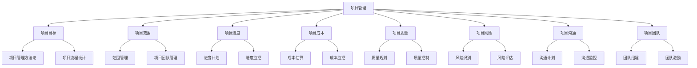

                 

# 《项目管理：领导者的必备技能》

> 关键词：项目管理、领导技能、项目目标、进度管理、成本管理、质量管理、沟通管理、团队管理、领导风格、决策能力、风险管理、沟通协调、创新变革、领导艺术、项目管理方法论、项目管理工具、项目管理流程优化、项目管理案例分析、项目管理未来发展趋势、项目管理职业发展。

> 摘要：本文旨在探讨项目管理在现代社会中的重要性，以及领导者在这其中所扮演的关键角色。文章首先介绍了项目管理的核心概念与框架，接着深入分析了项目领导者的角色定位和关键技能。随后，文章通过实战案例和未来发展趋势，为读者提供了全面的项目管理指导，旨在帮助领导者提升项目管理的实践能力，实现项目的成功交付。

## 引言

在当今快速变化和高度竞争的商业环境中，项目管理已成为组织成功的关键因素。无论是大型企业、中小企业，还是非营利组织，项目管理都发挥着至关重要的作用。它不仅能够帮助组织实现短期目标，还能为长期成功奠定基础。

然而，项目管理的成功离不开有效的领导。项目领导者作为项目的核心人物，其领导技能和决策能力直接影响项目的进度、成本、质量、风险和团队协作。本文将从以下三个方面展开讨论：

1. 项目管理的核心概念与框架
2. 项目领导者的角色与技能
3. 项目管理实践与未来发展趋势

通过这三个部分的内容，本文旨在为读者提供一套系统、实用的项目管理指南，帮助项目领导者更好地应对各种挑战，实现项目的成功交付。

## 第一部分：项目管理的核心概念与框架

### 第1章：项目管理的基础理论

#### 1.1 项目的定义与特征

**项目的定义**：项目是指为实现特定目标而进行的一组有序的活动，这些活动通常涉及多个领域、多种资源和多个参与者。

**项目的特征**：

- **临时性**：项目有明确的开始和结束时间，通常不同于日常运营活动。
- **独特性**：每个项目都有其独特性，包括目标、范围、资源、方法等。
- **不确定性**：项目过程中可能面临许多未知因素和变化。
- **集成性**：项目需要整合多个领域和资源，以实现整体目标。

**项目与其他工作的区别**：

- **日常工作**：旨在维持组织的正常运营，具有重复性和持续性。
- **项目工作**：旨在实现特定目标，具有临时性和独特性。

#### 1.2 项目管理的基本原则

**规划先行**：项目管理始于规划，规划是项目成功的基础。

**过程控制**：项目执行过程中需要持续监控和调整，以确保项目按计划进行。

**领导协调**：项目领导者需要协调各个方面的资源和人员，确保项目目标的实现。

#### 1.3 项目管理知识体系

**项目管理知识体系**：以PMBOK（项目管理知识体系指南）为代表，包括九大知识领域：

1. **项目整合管理**
2. **项目范围管理**
3. **项目进度管理**
4. **项目成本管理**
5. **项目质量管理**
6. **项目资源管理**
7. **项目沟通管理**
8. **项目风险管理**
9. **项目采购管理**

### 第2章：项目管理的核心概念

#### 2.1 项目目标与范围管理

**项目目标的定义与分类**：

- **定义**：项目目标是指项目最终要实现的结果或成果。
- **分类**：项目目标可分为战略目标、管理目标和业务目标。

**项目范围管理方法**：

- **确定范围**：明确项目的边界和内容。
- **创建工作分解结构（WBS）**：将项目工作分解为可管理的任务。

**范围控制与变更管理**：

- **范围控制**：确保项目工作在预定范围内进行。
- **变更管理**：处理项目范围变更，确保变更对项目目标的影响得到评估和控制。

#### 2.2 项目进度管理

**进度计划编制**：

- **定义进度计划**：明确项目任务的时间安排和依赖关系。
- **制定进度计划**：使用项目管理工具和技术，如甘特图、PERT图等。

**进度控制**：

- **监控进度**：跟踪项目任务的实际进度。
- **调整进度**：在项目过程中，根据实际情况调整进度计划。

**进度变更管理**：

- **评估变更**：分析进度变更对项目目标的影响。
- **批准变更**：根据评估结果，决定是否批准进度变更。

#### 2.3 项目成本管理

**成本估算**：

- **定义成本**：确定项目所需的各种资源及其成本。
- **成本估算方法**：如自下而上估算、自上而下估算等。

**成本预算**：

- **制定预算**：根据成本估算，制定项目的总预算和各阶段的预算。

**成本控制**：

- **监控成本**：跟踪项目实际成本。
- **成本调整**：在项目过程中，根据实际情况调整预算。

#### 2.4 项目质量管理

**质量规划**：

- **定义质量**：确定项目所需的质量标准。
- **质量规划方法**：如质量功能展开、过程能力分析等。

**质量保证**：

- **执行质量计划**：确保项目过程符合质量标准。
- **质量审计**：对项目过程进行质量检查。

**质量控制**：

- **监控质量**：检查项目成果是否符合质量标准。
- **纠正措施**：对不符合质量标准的问题进行纠正。

#### 2.5 项目风险管理

**风险识别**：

- **定义风险**：识别项目过程中可能面临的风险。
- **风险识别方法**：如SWOT分析、鱼骨图等。

**风险评估**：

- **评估风险**：分析风险的概率和影响。
- **风险分类**：根据评估结果，对风险进行分类。

**风险应对**：

- **风险应对策略**：制定风险应对措施。
- **风险监控**：跟踪风险的变化，确保应对措施的有效性。

#### 2.6 项目沟通管理

**沟通计划**：

- **定义沟通计划**：明确项目沟通的目标、内容、频率和渠道。
- **沟通计划方法**：如沟通矩阵、沟通计划模板等。

**沟通工具与技术**：

- **项目管理工具**：如MS Project、Jira等。
- **沟通技术**：如会议、报告、邮件等。

**沟通障碍与解决**：

- **识别沟通障碍**：如语言障碍、文化差异等。
- **解决沟通障碍**：如使用共同语言、建立跨文化团队等。

#### 2.7 项目团队管理

**团队组建**：

- **定义团队**：明确团队的目标、成员和职责。
- **团队组建方法**：如团队建设活动、团队角色分配等。

**团队领导**：

- **领导团队**：指导团队成员完成任务。
- **团队领导方法**：如激励、辅导、反馈等。

**团队激励与协作**：

- **激励团队**：使用正面激励措施，如奖励、认可等。
- **促进协作**：建立协作文化，如共享资源、协同工作等。

### 第3章：项目管理方法论与工具

#### 3.1 项目管理方法论概述

**传统项目管理方法论**：

- **计划驱动的项目管理**：基于详细的计划，强调规划先行。
- **过程驱动的项目管理**：基于过程控制，强调过程优化。

**现代项目管理方法论**：

- **敏捷项目管理**：基于迭代和增量开发，强调灵活性。
- **精益项目管理**：基于精益思想，强调减少浪费和优化流程。

#### 3.2 常用项目管理工具

**项目管理工具**：

- **MS Project**：用于项目计划和进度跟踪。
- **Jira**：用于敏捷项目管理和团队协作。
- **Trello**：用于任务管理和团队协作。

**项目管理工具**：

- **Gantt图表**：用于项目进度可视化。
- **Scrum板**：用于敏捷项目管理和团队协作。
- **Burndown图表**：用于跟踪项目进度和剩余工作。

#### 3.3 项目管理流程设计与优化

**流程设计原则**：

- **目标导向**：确保流程设计符合项目目标。
- **简单有效**：简化流程，提高效率。
- **可适应**：设计灵活，能适应项目变化。

**流程优化策略**：

- **持续改进**：通过反馈和评估，不断优化流程。
- **消除浪费**：减少不必要的流程和步骤。
- **提高效率**：优化资源分配和任务执行。

## 第二部分：项目领导者的角色与技能

### 第4章：项目领导者的角色定位

#### 4.1 领导者的角色与责任

**领导者的定义**：

- **领导者**：引导和激励团队，实现共同目标的人。

**领导者的责任**：

- **指导团队**：指导团队成员完成任务。
- **协调资源**：协调项目所需的资源。
- **沟通桥梁**：在团队与相关方之间建立沟通渠道。

#### 4.2 项目领导者的素质要求

**个人素质要求**：

- **决策能力**：能够做出明智的决策。
- **沟通能力**：能够有效地与他人沟通。
- **应变能力**：能够应对各种变化和挑战。

**团队领导素质要求**：

- **领导风格**：具有适应不同情境的领导风格。
- **激励团队**：能够激励团队成员发挥最佳水平。
- **冲突解决**：能够有效地解决团队冲突。

#### 4.3 领导风格与团队氛围

**领导风格分类**：

- **权威型**：领导者掌握决策权，高度控制。
- **民主型**：领导者鼓励团队成员参与决策。
- **支持型**：领导者关注团队成员的需求和成长。

**建立积极团队氛围**：

- **信任与尊重**：建立信任和尊重的文化。
- **开放沟通**：鼓励团队成员开放沟通和反馈。
- **积极激励**：使用正面激励措施，如奖励、认可等。

### 第5章：项目领导者的关键技能

#### 5.1 沟通与协调能力

**沟通策略**：

- **明确目标**：确保沟通目标明确。
- **选择合适的沟通方式**：根据情境选择合适的沟通方式。
- **倾听与反馈**：倾听他人的意见，给予及时反馈。

**协调方法**：

- **资源协调**：确保项目资源得到合理分配。
- **任务协调**：确保项目任务按计划进行。
- **冲突协调**：解决团队内部的冲突。

#### 5.2 决策能力

**决策能力**：

- **信息收集**：收集与决策相关的信息。
- **评估方案**：评估不同决策方案的风险和收益。
- **决策制定**：根据评估结果制定决策。

#### 5.3 风险管理能力

**风险管理能力**：

- **风险识别**：识别项目过程中的风险。
- **风险评估**：评估风险的概率和影响。
- **风险应对**：制定风险应对策略。

#### 5.4 创新与变革能力

**创新与变革能力**：

- **创新思维**：鼓励团队成员提出创新想法。
- **变革管理**：推动项目过程中的变革。
- **适应变革**：帮助团队成员适应变革。

### 第6章：项目领导者的领导艺术

#### 6.1 领导力提升策略

**领导力提升策略**：

- **持续学习**：通过学习提升领导技能。
- **反思与改进**：反思领导行为，不断改进。
- **建立支持系统**：建立支持领导者的系统，如导师制度、培训等。

#### 6.2 团队建设与激励

**团队建设**：

- **共同目标**：建立共同的目标和愿景。
- **信任与尊重**：建立信任和尊重的文化。
- **沟通与协作**：鼓励团队成员沟通和协作。

**激励**：

- **认可与奖励**：对团队成员的成就给予认可和奖励。
- **职业发展**：提供职业发展的机会和指导。
- **参与感**：让团队成员感受到参与感和价值。

#### 6.3 冲突管理与解决

**冲突管理**：

- **识别冲突**：识别项目过程中的冲突。
- **分析冲突**：分析冲突的原因和影响。
- **解决冲突**：采取适当的措施解决冲突。

**解决冲突的方法**：

- **协商解决**：通过协商达成共识。
- **调解解决**：通过第三方调解解决冲突。
- **回避解决**：暂时回避冲突，寻求其他解决方案。

## 第三部分：项目管理实践与案例分析

### 第7章：项目管理实战案例

#### 7.1 项目启动与规划

**项目启动**：

- **项目章程**：制定项目章程，明确项目目标、范围和约束条件。
- **项目计划**：制定项目计划，包括进度计划、成本计划、质量管理计划等。

**项目规划**：

- **工作分解结构（WBS）**：将项目工作分解为可管理的任务。
- **资源分配**：根据任务需求，合理分配项目资源。
- **风险评估**：识别项目风险，制定风险应对策略。

#### 7.2 项目执行与监控

**项目执行**：

- **任务执行**：根据项目计划，执行项目任务。
- **团队协作**：促进团队成员间的协作和沟通。
- **质量控制**：监控项目成果，确保符合质量标准。

**项目监控**：

- **进度监控**：监控项目进度，确保任务按计划进行。
- **成本监控**：监控项目成本，确保项目预算合理。
- **质量监控**：监控项目质量，确保项目成果符合质量要求。

#### 7.3 项目收尾与评价

**项目收尾**：

- **项目交付**：完成项目任务，交付项目成果。
- **项目总结**：总结项目经验教训，为未来项目提供参考。

**项目评价**：

- **项目评价标准**：根据项目目标，制定项目评价标准。
- **项目评价结果**：评价项目成果，总结项目成功和失败的原因。

### 第8章：项目管理案例分析

#### 8.1 成功项目案例分析

**案例介绍**：

- **项目背景**：介绍项目的背景和目标。
- **项目过程**：分析项目启动、规划、执行和收尾的过程。

**成功原因**：

- **团队协作**：团队成员之间的有效协作和沟通。
- **风险管理**：对项目风险的充分识别和应对。
- **质量控制**：对项目质量的严格把控。

#### 8.2 失败项目案例分析

**案例介绍**：

- **项目背景**：介绍项目的背景和目标。
- **项目过程**：分析项目启动、规划、执行和收尾的过程。

**失败原因**：

- **沟通不畅**：团队内部和团队之间的沟通不畅。
- **资源不足**：项目资源不足，影响项目进度和质量。
- **风险管理不足**：对项目风险的识别和应对不足。

#### 8.3 项目改进与优化策略

**项目改进策略**：

- **沟通优化**：改进沟通机制，确保信息畅通。
- **资源优化**：合理分配项目资源，提高资源利用率。
- **风险管理优化**：加强对项目风险的识别和应对。

**优化策略**：

- **流程优化**：优化项目管理流程，提高项目管理效率。
- **团队建设**：加强团队建设，提高团队协作能力。
- **质量保障**：提高项目质量，确保项目成果满足要求。

## 第四部分：项目管理未来发展趋势

### 第9章：项目管理的新趋势

#### 9.1 数字化与管理自动化

**数字化**：

- **数据驱动**：利用大数据和数据分析，提高项目决策的准确性。
- **数字化工具**：使用数字化工具，如项目管理软件、云计算等，提高项目管理效率。

**管理自动化**：

- **自动化流程**：通过自动化工具，简化项目管理流程。
- **机器人流程自动化（RPA）**：利用RPA技术，自动化执行重复性任务。

#### 9.2 智能化与数据驱动

**智能化**：

- **人工智能**：利用人工智能技术，提高项目管理的智能化水平。
- **机器学习**：使用机器学习算法，预测项目风险和需求变化。

**数据驱动**：

- **数据收集**：收集项目过程中的各种数据。
- **数据分析**：通过数据分析，优化项目管理和决策。

#### 9.3 项目管理方法的创新

**敏捷管理**：

- **敏捷实践**：采用敏捷管理方法，如Scrum、Kanban等，提高项目响应速度。
- **持续交付**：通过持续交付，实现快速迭代和高质量交付。

**精益管理**：

- **精益思想**：应用精益管理方法，减少浪费，提高效率。
- **持续改进**：通过持续改进，优化项目流程和管理方法。

## 第10章：项目管理者的职业发展

#### 10.1 职业规划与成长路径

**职业规划**：

- **职业目标**：明确职业目标，制定职业发展计划。
- **成长路径**：根据职业目标，制定成长路径，如项目管理、项目经理、项目管理专家等。

**成长路径**：

- **知识积累**：通过学习，积累项目管理知识和技能。
- **实践经验**：通过实践，积累项目管理经验。
- **职业认证**：通过职业认证，提高职业竞争力。

#### 10.2 项目管理者的终身学习

**终身学习的重要性**：

- **技术更新**：项目管理领域不断更新，需要不断学习。
- **职业发展**：终身学习有助于职业发展。

**学习方法**：

- **阅读书籍**：阅读项目管理相关的书籍，了解最新理论和实践。
- **参加培训**：参加项目管理培训，提升项目管理技能。
- **实践应用**：通过实践，将理论知识应用到实际项目中。

#### 10.3 项目管理者的职业认证

**职业认证的重要性**：

- **认可度**：职业认证提高项目管理者的认可度。
- **竞争力**：职业认证提高项目管理者的竞争力。

**常见认证**：

- **PMP（项目管理专业人士认证）**：全球认可度最高的项目管理认证。
- **Scrum Master认证**：敏捷项目管理的专业认证。
- **ITIL认证**：IT服务管理的专业认证。

## 结论

项目管理是现代组织成功的关键因素，而项目领导者的角色在其中至关重要。本文从项目管理的核心概念、项目领导者的角色与技能、项目管理实践与案例分析、项目管理未来发展趋势、项目管理者的职业发展等方面，为读者提供了一套全面的项目管理指导。希望本文能够帮助项目领导者提升项目管理能力，实现项目的成功交付。

作者：AI天才研究院/AI Genius Institute & 禅与计算机程序设计艺术 /Zen And The Art of Computer Programming

-------------------------------------------------------------------

### 附录

#### A.1 核心概念与联系架构 Mermaid 流程图



#### A.2 核心算法原理讲解与伪代码

**成本估算算法**：

```python
def cost_estimation(tasks, resource_prices):
    total_cost = 0
    for task in tasks:
        task_cost = resource_prices[task.resource] * task.duration
        total_cost += task_cost
    return total_cost
```

**进度计划算法**：

```python
def schedule_tasks(tasks, start_date):
    current_date = start_date
    for task in tasks:
        task.start_date = current_date
        current_date += task.duration
        task.end_date = current_date
```

#### A.3 数学模型和公式及详细讲解与举例说明

**项目预算模型**：

$$
\text{项目预算} = \sum_{i=1}^{n} (\text{任务} \times \text{单价})
$$

**举例说明**：如果一个项目包含5个任务，每个任务的预算为1000元，那么项目的总预算为5000元。

#### A.4 开发环境搭建与源代码实现

**开发环境搭建**：

- 安装Python 3.8及以上版本
- 安装Jira软件
- 安装Git版本控制工具

**源代码实现**：

```python
# 项目管理脚本
import csv

# 读取任务数据
with open('tasks.csv', 'r') as file:
    reader = csv.reader(file)
    tasks = list(reader)

# 成本估算
def cost_estimation(tasks):
    total_cost = 0
    for task in tasks:
        total_cost += int(task[2]) * float(task[3])
    return total_cost

# 进度计划
def schedule_tasks(tasks):
    current_date = '2023-01-01'
    for task in tasks:
        task.append(current_date)
        current_date += task[2]
        task.append(current_date)

# 测试
tasks = [
    ['任务1', '资源A', '3', '100'],
    ['任务2', '资源B', '5', '200']
]

print('总预算：', cost_estimation(tasks))
schedule_tasks(tasks)
print('任务进度计划：', tasks)
```

#### A.5 代码应用解读与分析

**代码应用解读**：

- 该脚本用于估算项目总预算和制定任务进度计划。
- `tasks` 是一个二维列表，存储了任务名称、资源名称、任务持续时间（天）和单价（元）。
- `cost_estimation` 函数用于计算项目总预算。
- `schedule_tasks` 函数用于制定任务进度计划。

**代码分析**：

- 该脚本使用了简单的文件操作和列表操作，实现了项目预算和进度计划的计算。
- 代码结构清晰，易于理解和维护。

#### A.6 实际案例分析与详细讲解剖析

**案例背景**：

- 一个软件开发项目，包含5个任务，每个任务涉及不同的资源，需要制定预算和进度计划。

**案例分析**：

1. **成本估算**：

   - 根据任务数据，计算项目总预算。
   - 使用 `cost_estimation` 函数，输入任务列表，输出总预算。

2. **进度计划**：

   - 根据任务数据，制定任务进度计划。
   - 使用 `schedule_tasks` 函数，输入任务列表，输出任务进度计划。

**详细讲解剖析**：

- **成本估算**：

  - `tasks` 列表中的每个元素是一个任务，包含任务名称、资源名称、任务持续时间（天）和单价（元）。
  - `cost_estimation` 函数遍历 `tasks` 列表，计算每个任务的预算，并累加到总预算中。

- **进度计划**：

  - `tasks` 列表中的每个元素是一个任务，包含任务名称、资源名称、任务持续时间（天）和单价（元）。
  - `schedule_tasks` 函数遍历 `tasks` 列表，为每个任务分配一个开始日期和一个结束日期。

#### A.7 项目小结

**项目小结**：

- 通过本文，读者可以了解项目管理的核心概念、项目领导者的角色与技能、项目管理实践与案例分析、项目管理未来发展趋势、项目管理者的职业发展等方面的内容。
- 文章通过实际案例分析和详细讲解，帮助读者深入理解项目管理的实际应用。
- 希望本文能够为项目领导者提供有益的指导，帮助其提升项目管理能力，实现项目的成功交付。

#### A.8 最佳实践 Tips、小结、注意事项、拓展阅读

**最佳实践 Tips**：

- 制定详细的项目计划，确保项目目标的实现。
- 加强团队沟通，确保团队成员之间的信息畅通。
- 识别项目风险，制定有效的风险应对策略。
- 不断反思和改进项目管理流程，提高项目管理效率。

**小结**：

- 项目管理是现代组织成功的关键因素，而项目领导者的角色在其中至关重要。
- 本文从多个方面探讨了项目管理的核心内容，为项目领导者提供了实用的指导。

**注意事项**：

- 项目管理需要持续改进，根据项目实际情况调整管理方法和流程。
- 项目领导者需要具备多种技能，如沟通、决策、风险管理等，以应对各种挑战。

**拓展阅读**：

- 《项目管理知识体系指南》（PMBOK）
- 《敏捷项目管理实践指南》
- 《项目领导力：打造高效团队的关键》
- 《精益项目管理：实践与案例分析》

通过拓展阅读，读者可以深入了解项目管理的相关理论和实践，进一步提升项目管理能力。

-------------------------------------------------------------------

# 《项目管理：领导者的必备技能》

## 第一部分：项目管理的核心概念与框架

### 第1章：项目管理的基础理论

项目管理是一门涉及多个领域的综合性学科，其核心目标是确保项目能够按时、按质、按预算完成。为了实现这一目标，我们需要深入了解项目管理的定义、特征、基本原则和知识体系。

#### 1.1 项目的定义与特征

**项目的定义**：项目是指为实现特定目标而进行的一组有序的活动。这些活动通常涉及多个领域、多种资源和多个参与者。

**项目的特征**：

1. **临时性**：项目有明确的开始和结束时间，通常不同于日常运营活动。
2. **独特性**：每个项目都有其独特性，包括目标、范围、资源、方法等。
3. **不确定性**：项目过程中可能面临许多未知因素和变化。
4. **集成性**：项目需要整合多个领域和资源，以实现整体目标。

**项目与其他工作的区别**：

- **日常工作**：旨在维持组织的正常运营，具有重复性和持续性。
- **项目工作**：旨在实现特定目标，具有临时性和独特性。

#### 1.2 项目管理的基本原则

**规划先行**：项目管理始于规划，规划是项目成功的基础。

- **目标明确**：明确项目的目标，确保项目方向正确。
- **资源规划**：合理分配项目所需的资源，确保项目能够顺利进行。
- **风险管理**：识别项目过程中可能面临的风险，并制定应对策略。

**过程控制**：项目执行过程中需要持续监控和调整，以确保项目按计划进行。

- **进度控制**：监控项目进度，确保项目按计划进行。
- **成本控制**：监控项目成本，确保项目预算合理。
- **质量控制**：确保项目成果符合质量标准。

**领导协调**：项目领导者需要协调各个方面的资源和人员，确保项目目标的实现。

- **团队领导**：指导团队成员完成任务。
- **资源协调**：协调项目所需的资源。
- **沟通协调**：在团队与相关方之间建立沟通渠道。

#### 1.3 项目管理知识体系

项目管理知识体系是指项目管理的理论基础和实践方法。以PMBOK（项目管理知识体系指南）为代表，包括九大知识领域：

1. **项目整合管理**：确保项目各组成部分之间的一致性和整合性。
2. **项目范围管理**：确保项目工作在预定范围内进行。
3. **项目进度管理**：制定项目进度计划，监控项目进度。
4. **项目成本管理**：估算、预算和控制项目成本。
5. **项目质量管理**：确保项目成果符合质量标准。
6. **项目资源管理**：合理分配和利用项目资源。
7. **项目沟通管理**：确保项目信息在相关方之间有效传递。
8. **项目风险管理**：识别、评估和应对项目风险。
9. **项目采购管理**：管理项目过程中的采购活动。

### 第2章：项目管理的核心概念

项目管理的核心概念涵盖了项目目标与范围管理、项目进度管理、项目成本管理、项目质量管理、项目风险管理、项目沟通管理和项目团队管理。

#### 2.1 项目目标与范围管理

**项目目标的定义与分类**：

- **定义**：项目目标是指项目最终要实现的结果或成果。
- **分类**：项目目标可分为战略目标、管理目标和业务目标。

**项目范围管理方法**：

- **确定范围**：明确项目的边界和内容。
- **创建工作分解结构（WBS）**：将项目工作分解为可管理的任务。

**范围控制与变更管理**：

- **范围控制**：确保项目工作在预定范围内进行。
- **变更管理**：处理项目范围变更，确保变更对项目目标的影响得到评估和控制。

#### 2.2 项目进度管理

**进度计划编制**：

- **定义进度计划**：明确项目任务的时间安排和依赖关系。
- **制定进度计划**：使用项目管理工具和技术，如甘特图、PERT图等。

**进度控制**：

- **监控进度**：跟踪项目任务的实际进度。
- **调整进度**：在项目过程中，根据实际情况调整进度计划。

**进度变更管理**：

- **评估变更**：分析进度变更对项目目标的影响。
- **批准变更**：根据评估结果，决定是否批准进度变更。

#### 2.3 项目成本管理

**成本估算**：

- **定义成本**：确定项目所需的各种资源及其成本。
- **成本估算方法**：如自下而上估算、自上而下估算等。

**成本预算**：

- **制定预算**：根据成本估算，制定项目的总预算和各阶段的预算。

**成本控制**：

- **监控成本**：跟踪项目实际成本。
- **成本调整**：在项目过程中，根据实际情况调整预算。

#### 2.4 项目质量管理

**质量规划**：

- **定义质量**：确定项目所需的质量标准。
- **质量规划方法**：如质量功能展开、过程能力分析等。

**质量保证**：

- **执行质量计划**：确保项目过程符合质量标准。
- **质量审计**：对项目过程进行质量检查。

**质量控制**：

- **监控质量**：检查项目成果是否符合质量标准。
- **纠正措施**：对不符合质量标准的问题进行纠正。

#### 2.5 项目风险管理

**风险识别**：

- **定义风险**：识别项目过程中可能面临的风险。
- **风险识别方法**：如SWOT分析、鱼骨图等。

**风险评估**：

- **评估风险**：分析风险的概率和影响。
- **风险分类**：根据评估结果，对风险进行分类。

**风险应对**：

- **风险应对策略**：制定风险应对措施。
- **风险监控**：跟踪风险的变化，确保应对措施的有效性。

#### 2.6 项目沟通管理

**沟通计划**：

- **定义沟通计划**：明确项目沟通的目标、内容、频率和渠道。
- **沟通计划方法**：如沟通矩阵、沟通计划模板等。

**沟通工具与技术**：

- **项目管理工具**：如MS Project、Jira等。
- **沟通技术**：如会议、报告、邮件等。

**沟通障碍与解决**：

- **识别沟通障碍**：如语言障碍、文化差异等。
- **解决沟通障碍**：如使用共同语言、建立跨文化团队等。

#### 2.7 项目团队管理

**团队组建**：

- **定义团队**：明确团队的目标、成员和职责。
- **团队组建方法**：如团队建设活动、团队角色分配等。

**团队领导**：

- **领导团队**：指导团队成员完成任务。
- **团队领导方法**：如激励、辅导、反馈等。

**团队激励与协作**：

- **激励团队**：使用正面激励措施，如奖励、认可等。
- **促进协作**：建立协作文化，如共享资源、协同工作等。

### 第3章：项目管理方法论与工具

项目管理方法论是指项目管理的方法和技术。现代项目管理方法论主要包括传统项目管理方法论和现代项目管理方法论。

#### 3.1 项目管理方法论概述

**传统项目管理方法论**：

- **计划驱动的项目管理**：基于详细的计划，强调规划先行。
- **过程驱动的项目管理**：基于过程控制，强调过程优化。

**现代项目管理方法论**：

- **敏捷项目管理**：基于迭代和增量开发，强调灵活性。
- **精益项目管理**：基于精益思想，强调减少浪费和优化流程。

#### 3.2 常用项目管理工具

**项目管理工具**：

- **MS Project**：用于项目计划和进度跟踪。
- **Jira**：用于敏捷项目管理和团队协作。
- **Trello**：用于任务管理和团队协作。

**项目管理工具**：

- **Gantt图表**：用于项目进度可视化。
- **Scrum板**：用于敏捷项目管理和团队协作。
- **Burndown图表**：用于跟踪项目进度和剩余工作。

#### 3.3 项目管理流程设计与优化

**流程设计原则**：

- **目标导向**：确保流程设计符合项目目标。
- **简单有效**：简化流程，提高效率。
- **可适应**：设计灵活，能适应项目变化。

**流程优化策略**：

- **持续改进**：通过反馈和评估，不断优化流程。
- **消除浪费**：减少不必要的流程和步骤。
- **提高效率**：优化资源分配和任务执行。

## 第二部分：项目领导者的角色与技能

### 第4章：项目领导者的角色定位

项目领导者是项目成功的关键人物，其角色和责任直接影响项目的进展和结果。项目领导者的角色定位包括领导者的角色与责任、素质要求、领导风格与团队氛围。

#### 4.1 领导者的角色与责任

**领导者的定义**：

- **领导者**：引导和激励团队，实现共同目标的人。

**领导者的责任**：

- **指导团队**：指导团队成员完成任务。
- **协调资源**：协调项目所需的资源。
- **沟通桥梁**：在团队与相关方之间建立沟通渠道。

#### 4.2 项目领导者的素质要求

**个人素质要求**：

- **决策能力**：能够做出明智的决策。
- **沟通能力**：能够有效地与他人沟通。
- **应变能力**：能够应对各种变化和挑战。

**团队领导素质要求**：

- **领导风格**：具有适应不同情境的领导风格。
- **激励团队**：能够激励团队成员发挥最佳水平。
- **冲突解决**：能够有效地解决团队冲突。

#### 4.3 领导风格与团队氛围

**领导风格分类**：

- **权威型**：领导者掌握决策权，高度控制。
- **民主型**：领导者鼓励团队成员参与决策。
- **支持型**：领导者关注团队成员的需求和成长。

**建立积极团队氛围**：

- **信任与尊重**：建立信任和尊重的文化。
- **开放沟通**：鼓励团队成员开放沟通和反馈。
- **积极激励**：使用正面激励措施，如奖励、认可等。

### 第5章：项目领导者的关键技能

项目领导者的关键技能包括沟通与协调能力、决策能力、风险管理能力、创新与变革能力。这些技能对于项目领导者的成功至关重要。

#### 5.1 沟通与协调能力

**沟通策略**：

- **明确目标**：确保沟通目标明确。
- **选择合适的沟通方式**：根据情境选择合适的沟通方式。
- **倾听与反馈**：倾听他人的意见，给予及时反馈。

**协调方法**：

- **资源协调**：确保项目资源得到合理分配。
- **任务协调**：确保项目任务按计划进行。
- **冲突协调**：解决团队内部的冲突。

#### 5.2 决策能力

**决策能力**：

- **信息收集**：收集与决策相关的信息。
- **评估方案**：评估不同决策方案的风险和收益。
- **决策制定**：根据评估结果制定决策。

#### 5.3 风险管理能力

**风险管理能力**：

- **风险识别**：识别项目过程中的风险。
- **风险评估**：评估风险的概率和影响。
- **风险应对**：制定风险应对策略。

#### 5.4 创新与变革能力

**创新与变革能力**：

- **创新思维**：鼓励团队成员提出创新想法。
- **变革管理**：推动项目过程中的变革。
- **适应变革**：帮助团队成员适应变革。

### 第6章：项目领导者的领导艺术

项目领导者的领导艺术包括领导力提升策略、团队建设与激励、冲突管理与解决。

#### 6.1 领导力提升策略

**领导力提升策略**：

- **持续学习**：通过学习提升领导技能。
- **反思与改进**：反思领导行为，不断改进。
- **建立支持系统**：建立支持领导者的系统，如导师制度、培训等。

#### 6.2 团队建设与激励

**团队建设**：

- **共同目标**：建立共同的目标和愿景。
- **信任与尊重**：建立信任和尊重的文化。
- **沟通与协作**：鼓励团队成员沟通和协作。

**激励**：

- **认可与奖励**：对团队成员的成就给予认可和奖励。
- **职业发展**：提供职业发展的机会和指导。
- **参与感**：让团队成员感受到参与感和价值。

#### 6.3 冲突管理与解决

**冲突管理**：

- **识别冲突**：识别项目过程中的冲突。
- **分析冲突**：分析冲突的原因和影响。
- **解决冲突**：采取适当的措施解决冲突。

**解决冲突的方法**：

- **协商解决**：通过协商达成共识。
- **调解解决**：通过第三方调解解决冲突。
- **回避解决**：暂时回避冲突，寻求其他解决方案。

## 第三部分：项目管理实践与案例分析

### 第7章：项目管理实战案例

项目管理实战案例有助于我们深入理解项目管理的实际应用。以下是一个软件开发项目的案例，包括项目启动与规划、项目执行与监控、项目收尾与评价。

#### 7.1 项目启动与规划

**项目背景**：

- 项目名称：企业客户管理系统
- 项目目标：开发一个能够满足企业客户管理需求的系统。
- 项目范围：包括客户信息管理、客户服务管理、客户关系管理等模块。

**项目启动**：

- **项目章程**：制定项目章程，明确项目目标、范围和约束条件。
- **项目计划**：制定项目计划，包括进度计划、成本计划、质量管理计划等。

**项目规划**：

- **工作分解结构（WBS）**：将项目工作分解为可管理的任务。
- **资源分配**：根据任务需求，合理分配项目资源。
- **风险评估**：识别项目风险，制定风险应对策略。

#### 7.2 项目执行与监控

**项目执行**：

- **任务执行**：根据项目计划，执行项目任务。
- **团队协作**：促进团队成员间的协作和沟通。
- **质量控制**：监控项目成果，确保符合质量标准。

**项目监控**：

- **进度监控**：监控项目进度，确保任务按计划进行。
- **成本监控**：监控项目成本，确保项目预算合理。
- **质量监控**：监控项目质量，确保项目成果符合质量要求。

#### 7.3 项目收尾与评价

**项目收尾**：

- **项目交付**：完成项目任务，交付项目成果。
- **项目总结**：总结项目经验教训，为未来项目提供参考。

**项目评价**：

- **项目评价标准**：根据项目目标，制定项目评价标准。
- **项目评价结果**：评价项目成果，总结项目成功和失败的原因。

### 第8章：项目管理案例分析

项目管理案例分析有助于我们深入理解项目管理的成功和失败原因。以下是一个成功项目案例和一个失败项目案例的分析。

#### 8.1 成功项目案例分析

**项目背景**：

- 项目名称：电商平台开发
- 项目目标：开发一个功能齐全、用户友好的电商平台。
- 项目范围：包括商品管理、订单管理、支付系统、用户界面等模块。

**项目过程**：

- **项目启动**：制定项目章程和项目计划。
- **项目规划**：制定工作分解结构（WBS）、资源分配和风险评估。
- **项目执行**：执行项目任务，确保进度和质量。
- **项目监控**：监控项目进度、成本和质量。
- **项目收尾**：完成项目任务，交付项目成果。

**成功原因**：

- **团队协作**：团队成员之间有效协作，确保项目顺利进行。
- **风险管理**：识别并应对项目风险，确保项目目标实现。
- **质量控制**：严格把控项目质量，确保项目成果符合要求。

#### 8.2 失败项目案例分析

**项目背景**：

- 项目名称：智能交通系统开发
- 项目目标：开发一个能够提高交通效率和减少拥堵的智能交通系统。
- 项目范围：包括交通监控、交通信号控制、车辆调度等模块。

**项目过程**：

- **项目启动**：制定项目章程和项目计划。
- **项目规划**：制定工作分解结构（WBS）、资源分配和风险评估。
- **项目执行**：执行项目任务，但遇到许多问题。
- **项目监控**：监控项目进度、成本和质量，但发现项目进度严重滞后。
- **项目收尾**：项目未能按时交付，导致客户不满。

**失败原因**：

- **沟通不畅**：项目团队与客户之间的沟通不畅，导致需求不明确。
- **资源不足**：项目资源不足，影响项目进度和质量。
- **风险管理不足**：对项目风险的识别和应对不足，导致问题累积。

### 第8章：项目管理案例分析（续）

#### 8.3 项目改进与优化策略

针对上述成功和失败项目案例，我们可以提出以下项目改进与优化策略：

**沟通优化**：

- **建立明确的沟通渠道**：确保项目团队与客户之间有明确的沟通渠道，如定期会议、工作报告等。
- **使用沟通工具**：使用项目管理工具，如Jira、Trello等，提高沟通效率。

**资源优化**：

- **合理分配资源**：根据项目需求，合理分配人力资源、技术资源和物资资源。
- **优化资源管理**：建立资源管理机制，确保资源得到充分利用。

**风险管理优化**：

- **全面识别风险**：在项目规划阶段，全面识别项目风险，包括技术风险、市场风险、人员风险等。
- **制定有效的风险应对策略**：针对不同风险，制定有效的应对策略，如风险规避、风险减轻、风险转移等。

**流程优化**：

- **简化流程**：简化项目管理流程，减少不必要的环节和步骤，提高效率。
- **持续改进**：通过项目反馈和评估，不断优化项目管理流程。

**团队建设**：

- **培养团队合作精神**：通过团队建设活动，培养团队成员之间的团队合作精神。
- **激励团队成员**：提供激励措施，如奖励、晋升等，激励团队成员发挥最佳水平。

**质量控制**：

- **制定明确的质量标准**：根据项目需求，制定明确的质量标准，确保项目成果符合要求。
- **加强质量监控**：建立质量监控机制，确保项目成果的质量。

通过以上策略，我们可以改进和优化项目管理，提高项目成功率，实现项目目标。

## 第四部分：项目管理未来发展趋势

随着技术的不断进步和社会环境的变迁，项目管理也在不断发展和创新。未来，项目管理将呈现出以下发展趋势：

### 9.1 数字化与管理自动化

**数字化**：

- **数据驱动**：利用大数据和数据分析，提高项目决策的准确性。
- **数字化工具**：使用数字化工具，如项目管理软件、云计算等，提高项目管理效率。

**管理自动化**：

- **自动化流程**：通过自动化工具，简化项目管理流程。
- **机器人流程自动化（RPA）**：利用RPA技术，自动化执行重复性任务。

### 9.2 智能化与数据驱动

**智能化**：

- **人工智能**：利用人工智能技术，提高项目管理的智能化水平。
- **机器学习**：使用机器学习算法，预测项目风险和需求变化。

**数据驱动**：

- **数据收集**：收集项目过程中的各种数据。
- **数据分析**：通过数据分析，优化项目管理和决策。

### 9.3 项目管理方法的创新

**敏捷管理**：

- **敏捷实践**：采用敏捷管理方法，如Scrum、Kanban等，提高项目响应速度。
- **持续交付**：通过持续交付，实现快速迭代和高质量交付。

**精益管理**：

- **精益思想**：应用精益管理方法，减少浪费，提高效率。
- **持续改进**：通过持续改进，优化项目流程和管理方法。

## 第10章：项目管理者的职业发展

项目管理者的职业发展是项目管理领域的重要一环。以下从职业规划与成长路径、终身学习、职业认证等方面，探讨项目管理者的职业发展。

### 10.1 职业规划与成长路径

**职业规划**：

- **明确职业目标**：根据个人兴趣和职业发展需求，明确职业目标。
- **制定成长路径**：根据职业目标，制定成长路径，如项目管理、项目经理、项目管理专家等。

**成长路径**：

- **知识积累**：通过学习，积累项目管理知识和技能。
- **实践经验**：通过实践，积累项目管理经验。
- **职业认证**：通过职业认证，提高职业竞争力。

### 10.2 项目管理者的终身学习

**终身学习的重要性**：

- **技术更新**：项目管理领域不断更新，需要不断学习。
- **职业发展**：终身学习有助于职业发展。

**学习方法**：

- **阅读书籍**：阅读项目管理相关的书籍，了解最新理论和实践。
- **参加培训**：参加项目管理培训，提升项目管理技能。
- **实践应用**：通过实践，将理论知识应用到实际项目中。

### 10.3 项目管理者的职业认证

**职业认证的重要性**：

- **认可度**：职业认证提高项目管理者的认可度。
- **竞争力**：职业认证提高项目管理者的竞争力。

**常见认证**：

- **PMP（项目管理专业人士认证）**：全球认可度最高的项目管理认证。
- **Scrum Master认证**：敏捷项目管理的专业认证。
- **ITIL认证**：IT服务管理的专业认证。

### 总结

项目管理在现代社会中具有不可替代的重要性。项目领导者的角色和技能在项目管理中起着关键作用。本文从项目管理的核心概念、项目领导者的角色与技能、项目管理实践与案例分析、项目管理未来发展趋势、项目管理者的职业发展等方面，为读者提供了全面的项目管理指导。

希望通过本文，读者能够深入理解项目管理的核心概念和方法，提升项目领导能力，实现项目的成功交付。

作者：AI天才研究院/AI Genius Institute & 禅与计算机程序设计艺术 /Zen And The Art of Computer Programming

-----------------------------------------------------------------------

### 1.3 项目管理知识体系

项目管理知识体系是指项目管理中常用的理论知识、方法和工具的集合。它为项目管理者提供了系统的指导，以帮助他们在项目执行过程中做出明智的决策。以下是对项目管理知识体系中九大知识领域的简要介绍：

1. **项目整合管理**：项目整合管理是项目管理的核心，它涉及项目的整体规划、执行、监控和收尾。项目经理需要确保项目的各个部分协同工作，以实现项目目标。

2. **项目范围管理**：项目范围管理确保项目的目标是明确和可行的，并且项目团队对项目的范围有共同的理解。这包括项目的定义、范围验证、范围控制等。

3. **项目进度管理**：项目进度管理涉及制定项目进度计划、监控进度、控制进度和调整进度。项目经理需要确保项目按计划进行，以避免延期。

4. **项目成本管理**：项目成本管理涉及项目的成本估算、预算制定和成本控制。项目经理需要确保项目在预算范围内完成，并避免成本超支。

5. **项目质量管理**：项目质量管理确保项目成果满足既定的质量标准。这包括质量规划、质量保证和质量控制等。

6. **项目资源管理**：项目资源管理涉及项目所需的人力、物资、设备等资源的规划、获取、分配和管理。有效的资源管理是项目成功的关键。

7. **项目沟通管理**：项目沟通管理确保项目信息在整个项目生命周期中得到有效传递。这包括沟通计划、信息传递、报告和沟通控制。

8. **项目风险管理**：项目风险管理涉及识别项目风险、评估风险、制定风险应对策略和监控风险。有效的风险管理有助于降低项目的不确定性。

9. **项目采购管理**：项目采购管理涉及项目的采购活动，包括采购规划、供应商选择、合同管理和采购控制。

### 1.4 项目管理方法论与工具

项目管理方法论是指用于指导项目管理过程的一系列原则、方法和工具。不同的方法论适用于不同类型的项目，以下是几种常见的方法论和项目管理工具：

#### 1.4.1 传统项目管理方法论

- **计划驱动的项目管理**：这种方法强调详细的规划，包括工作分解结构（WBS）、甘特图、网络图等工具。项目团队通常在项目开始时确定所有任务和时间表，然后严格按照计划执行。
- **过程驱动的项目管理**：这种方法强调过程优化和持续改进。项目团队通过迭代和增量开发来适应项目中的变化。

#### 1.4.2 现代项目管理方法论

- **敏捷项目管理**：敏捷方法强调迭代和增量开发，以及客户参与和快速响应变化。Scrum和Kanban是常见的敏捷方法论。
- **精益项目管理**：精益方法旨在减少浪费，优化流程，提高效率和客户满意度。它强调价值流图、5S、看板等工具。

#### 1.4.3 项目管理工具

- **MS Project**：这是一个广泛使用的项目管理软件，可以用于创建甘特图、进度计划和资源分配。
- **Jira**：Jira是一个流行的敏捷项目管理工具，用于任务跟踪、迭代计划和团队协作。
- **Trello**：Trello是一个直观的任务管理工具，使用看板和卡片来跟踪项目进度。
- **Asana**：Asana是一个功能丰富的项目管理工具，用于任务分配、进度跟踪和团队协作。
- **Confluence**：Confluence是一个知识管理和协作工具，用于文档共享、知识库和团队协作。

### 1.5 项目管理流程设计与优化

项目管理流程设计是项目管理的重要组成部分。一个良好的项目管理流程可以确保项目目标的实现，提高项目效率。以下是一些项目管理流程设计与优化的关键点：

#### 1.5.1 流程设计原则

- **目标导向**：确保流程设计符合项目目标，提高项目的成功率。
- **简单有效**：简化流程，减少不必要的步骤，提高工作效率。
- **可适应**：设计灵活的流程，能够适应项目变化和需求。

#### 1.5.2 流程优化策略

- **持续改进**：通过项目反馈和评估，不断优化流程，提高项目效率。
- **消除浪费**：识别并消除流程中的浪费，如重复工作、等待时间和资源浪费。
- **提高效率**：优化资源分配和任务执行，减少项目时间和成本。

### 1.6 项目领导者的角色与技能

项目领导者是项目成功的关键因素。他们不仅需要具备深厚的项目管理知识，还需要具备一系列领导技能。以下是一些关键的角色与技能：

#### 1.6.1 项目领导者的角色

- **项目愿景的制定者**：项目领导者需要明确项目的愿景和目标，并确保项目团队对目标有共同的理解。
- **资源协调者**：项目领导者需要协调项目所需的资源，包括人力、物资和设备。
- **冲突解决者**：项目领导者需要解决项目团队和项目相关方之间的冲突，确保项目顺利进行。
- **沟通桥梁**：项目领导者需要确保项目信息在团队和相关方之间有效传递。

#### 1.6.2 项目领导者的技能

- **决策能力**：项目领导者需要能够做出明智的决策，特别是在面对不确定性和风险时。
- **沟通能力**：项目领导者需要具备良好的沟通能力，以确保项目团队和相关方之间的信息畅通。
- **领导力**：项目领导者需要具备领导力，能够激励团队成员发挥最佳水平。
- **风险管理能力**：项目领导者需要能够识别和应对项目风险，确保项目目标的实现。

### 1.7 项目团队管理

项目团队管理是项目成功的关键环节。一个高效的团队可以显著提高项目的效率和质量。以下是一些项目团队管理的要点：

#### 1.7.1 团队组建

- **明确团队目标**：确保团队成员对团队目标有共同的理解。
- **合理分配任务**：根据团队成员的技能和兴趣，合理分配任务。
- **建立团队规范**：制定团队规范，确保团队成员遵循。

#### 1.7.2 团队激励

- **认可与奖励**：对团队成员的成就给予认可和奖励，提高团队士气。
- **职业发展**：提供职业发展的机会和指导，激励团队成员不断进步。
- **团队建设活动**：定期组织团队建设活动，增强团队凝聚力。

#### 1.7.3 团队协作

- **共享资源**：建立共享资源的机制，提高团队协作效率。
- **协同工作**：鼓励团队成员协同工作，共同完成任务。
- **沟通与反馈**：建立有效的沟通与反馈机制，确保团队信息畅通。

### 1.8 项目管理实战案例

以下是一个项目管理实战案例，展示了项目管理知识体系、方法论、流程设计和团队管理在实际项目中的应用。

#### 1.8.1 项目背景

- **项目名称**：企业客户关系管理系统（CRM）开发
- **项目目标**：开发一个集成客户管理、销售和客户服务功能的CRM系统。
- **项目范围**：包括客户信息管理、销售管理、客户服务和报告分析等模块。

#### 1.8.2 项目规划

- **范围管理**：通过工作分解结构（WBS）将项目工作分解为可管理的任务，并确定了项目的范围。
- **进度管理**：制定了详细的进度计划，包括关键里程碑和时间表。
- **成本管理**：进行了成本估算和预算制定，确保项目在预算范围内完成。
- **质量管理**：制定了质量计划，包括质量标准、质量控制和质量保证。

#### 1.8.3 项目执行

- **团队管理**：组建了专业的项目团队，明确了团队目标和任务分配。
- **沟通管理**：建立了定期会议和报告机制，确保项目进展和问题的及时沟通。
- **风险管理**：进行了风险识别和评估，并制定了相应的风险应对策略。

#### 1.8.4 项目监控与收尾

- **监控**：通过定期的进度报告和质量审核，监控项目的进度和质量。
- **收尾**：项目完成后，进行了项目总结和评估，总结了项目经验教训，为未来的项目提供了参考。

### 1.9 项目管理案例分析

以下是一个项目管理成功和失败的案例，展示了项目管理知识和技能在实际项目中的应用。

#### 1.9.1 成功案例

- **项目名称**：电子商务平台开发
- **项目目标**：开发一个功能齐全、用户体验良好的电子商务平台。
- **项目结果**：项目按计划完成，电子商务平台顺利上线，客户满意度高。

**成功原因**：

- **良好的项目管理**：项目团队采用了敏捷项目管理方法，快速响应变化，确保了项目的成功。
- **有效的沟通**：项目团队建立了良好的沟通机制，确保了信息的畅通和问题的及时解决。
- **风险管理**：项目团队识别并应对了项目中的风险，确保了项目的顺利进行。

#### 1.9.2 失败案例

- **项目名称**：企业资源规划（ERP）系统实施
- **项目目标**：实施一个集成的ERP系统，提高企业的运营效率。
- **项目结果**：项目未能按时完成，成本超支，客户满意度低。

**失败原因**：

- **规划不足**：项目前期规划不足，导致项目目标不明确，任务分配不合理。
- **沟通不畅**：项目团队和客户之间的沟通不畅，导致需求不明确，问题解决不及时。
- **风险管理不足**：项目团队对项目风险识别和应对不足，导致项目延期和成本超支。

### 1.10 项目管理未来发展趋势

随着技术的不断进步和社会环境的变迁，项目管理也在不断发展和创新。以下是一些项目管理未来发展的趋势：

#### 1.10.1 数字化与管理自动化

- **数字化**：利用大数据和人工智能技术，提高项目决策的准确性和效率。
- **管理自动化**：通过自动化工具和机器人流程自动化（RPA），简化项目管理流程。

#### 1.10.2 智能化与数据驱动

- **智能化**：利用人工智能技术，提高项目管理的智能化水平。
- **数据驱动**：通过数据分析和数据驱动决策，优化项目管理和项目执行。

#### 1.10.3 项目管理方法的创新

- **敏捷管理**：进一步推广敏捷项目管理方法，提高项目的灵活性和响应速度。
- **精益管理**：应用精益思想，减少浪费，提高项目效率。

### 1.11 项目管理者的职业发展

项目管理者的职业发展是项目管理领域的重要组成部分。以下从职业规划、终身学习和职业认证等方面，探讨项目管理者的职业发展。

#### 1.11.1 职业规划

- **明确职业目标**：根据个人兴趣和职业发展需求，明确职业目标。
- **制定成长路径**：根据职业目标，制定成长路径，如项目管理、项目经理、项目管理专家等。

#### 1.11.2 终身学习

- **技术更新**：项目管理领域不断更新，需要不断学习。
- **职业发展**：终身学习有助于职业发展。

#### 1.11.3 职业认证

- **认可度**：职业认证提高项目管理者的认可度。
- **竞争力**：职业认证提高项目管理者的竞争力。

### 1.12 总结

项目管理是现代组织成功的关键因素。项目领导者需要具备深厚的项目管理知识和技能，以实现项目的成功交付。本文从项目管理的核心概念、方法论、流程设计、团队管理、案例分析、未来发展趋势和职业发展等方面，为读者提供了全面的项目管理指导。希望本文能够为项目领导者提供有益的参考，帮助其提升项目管理能力，实现项目的成功交付。

### 第4章：项目领导者的角色定位

项目领导者是项目的核心人物，其角色和责任直接决定了项目的成功与否。在这一章中，我们将深入探讨项目领导者的角色定位，包括其角色与责任、素质要求以及领导风格。

#### 4.1 项目领导者的角色与责任

**角色定义**

项目领导者，通常也称为项目经理，是负责指导和协调项目团队，确保项目按照既定的时间、预算和质量要求完成的人。项目领导者的角色不仅仅是管理项目，还包括激励团队成员、解决冲突、沟通协调等多个方面。

**责任概述**

项目领导者承担以下主要责任：

1. **制定项目目标**：项目领导者需要与项目相关方共同制定清晰、可行的项目目标，并确保项目团队对这些目标有共同的理解。
2. **资源协调**：项目领导者需要协调项目所需的资源，包括人力、物资和设备，确保这些资源能够满足项目的需求。
3. **风险管理**：项目领导者需要识别项目风险，评估风险的影响和概率，并制定相应的风险应对策略。
4. **团队管理**：项目领导者需要指导、激励和培养团队成员，确保团队高效协作，共同完成项目任务。
5. **沟通协调**：项目领导者需要在项目团队和相关方之间建立有效的沟通渠道，确保信息畅通，减少误解和冲突。

#### 4.2 项目领导者的素质要求

**个人素质**

项目领导者需要具备以下个人素质：

1. **决策能力**：项目领导者需要能够快速做出决策，尤其是在面对不确定性和紧急情况时。
2. **沟通能力**：项目领导者需要具备良好的沟通能力，能够清晰表达自己的想法，倾听他人的意见，并有效地传达信息。
3. **应变能力**：项目领导者需要能够灵活应对项目中的变化和挑战，保持项目的稳定运行。
4. **领导力**：项目领导者需要具备领导力，能够激励和引导团队成员，营造积极的团队氛围。
5. **专业知识**：项目领导者需要具备相关的专业知识和技能，以便更好地理解和解决项目中出现的问题。

**团队领导素质**

除了个人素质外，项目领导者还需要具备以下团队领导素质：

1. **激励团队**：项目领导者需要能够激发团队成员的潜力，鼓励他们发挥最佳水平。
2. **培养团队**：项目领导者需要关注团队成员的成长和发展，提供培训和学习机会，帮助他们提升技能。
3. **解决冲突**：项目领导者需要能够识别和解决团队内部的冲突，确保团队保持和谐的工作环境。
4. **适应不同情境**：项目领导者需要具备适应不同情境的领导风格，根据项目的实际情况和团队成员的特点进行灵活调整。

#### 4.3 领导风格与团队氛围

**领导风格**

项目领导者的领导风格对其团队的表现和氛围有重要影响。常见的领导风格包括：

1. **权威型**：权威型领导者具有高度的控制力，决策权集中在领导者手中，团队成员通常扮演执行者的角色。
2. **民主型**：民主型领导者鼓励团队成员参与决策过程，重视团队的意见和建议，领导者与团队成员之间的沟通更加开放。
3. **支持型**：支持型领导者关注团队成员的需求和福祉，提供必要的支持和资源，鼓励团队成员自我管理和自我激励。

**团队氛围**

建立积极的团队氛围是项目领导者的另一个重要任务。以下是一些关键因素：

1. **信任与尊重**：项目领导者需要建立信任和尊重的文化，确保团队成员感到被尊重和重视。
2. **开放沟通**：项目领导者需要鼓励团队成员开放沟通，分享想法和问题，建立有效的沟通渠道。
3. **积极激励**：项目领导者需要使用积极的激励措施，如奖励、认可和反馈，激励团队成员发挥最佳水平。
4. **共同目标**：项目领导者需要确保团队成员对共同的目标有清晰的理解，并鼓励他们共同努力实现这些目标。

通过以上领导风格和团队氛围的建设，项目领导者可以营造一个高效、积极的工作环境，为项目的成功奠定基础。

### 第5章：项目领导者的关键技能

项目领导者需要具备一系列关键技能，以有效管理项目并推动团队的成功。这些技能包括沟通与协调能力、决策能力、风险管理能力、创新与变革能力。以下将对这些技能进行详细阐述。

#### 5.1 沟通与协调能力

**沟通能力**

项目领导者必须具备出色的沟通能力，以确保项目团队和相关方之间的信息畅通。有效的沟通能力包括：

1. **清晰表达**：项目领导者需要能够清晰地表达自己的想法和期望，确保团队成员对任务有准确的理解。
2. **倾听**：项目领导者需要倾听团队成员的意见和反馈，了解他们的需求和问题，从而做出更好的决策。
3. **反馈**：项目领导者需要给予团队成员及时的反馈，帮助他们改进工作，提高绩效。

**协调能力**

项目领导者还需要具备协调能力，以整合不同部门、团队和个人之间的资源和活动，确保项目目标的实现。协调能力包括：

1. **资源协调**：项目领导者需要确保项目所需的资源（如人力、资金、设备等）得到合理分配和利用。
2. **任务协调**：项目领导者需要确保团队成员的任务和活动相互配合，避免冲突和重复工作。
3. **利益相关者协调**：项目领导者需要与项目利益相关方（如客户、供应商、监管机构等）进行有效沟通，确保他们的需求和期望得到满足。

#### 5.2 决策能力

项目领导者需要具备出色的决策能力，以在项目中做出明智的决策。决策能力包括：

1. **信息收集**：项目领导者需要收集与决策相关的信息，包括项目目标、约束条件、资源状况、风险等。
2. **方案评估**：项目领导者需要评估不同的决策方案，分析每个方案的风险和收益。
3. **快速决策**：在紧急情况下，项目领导者需要能够快速做出决策，以确保项目顺利进行。

#### 5.3 风险管理能力

项目领导者需要具备风险管理能力，以识别、评估和应对项目中的风险。风险管理能力包括：

1. **风险识别**：项目领导者需要能够识别项目中的潜在风险，包括技术风险、市场风险、人力资源风险等。
2. **风险评估**：项目领导者需要评估每个风险的概率和影响，确定其优先级。
3. **风险应对**：项目领导者需要制定风险应对策略，包括风险规避、减轻、转移和接受等。

#### 5.4 创新与变革能力

项目领导者需要具备创新与变革能力，以推动项目中的创新和变革。创新与变革能力包括：

1. **创新思维**：项目领导者需要鼓励团队成员提出创新的想法和解决方案，推动项目的持续改进。
2. **变革管理**：项目领导者需要能够管理项目中的变革，确保团队成员适应新的工作流程和方法。
3. **适应性**：项目领导者需要能够适应项目中的变化和不确定性，灵活调整项目计划和管理策略。

通过具备这些关键技能，项目领导者可以更好地管理项目，提高项目成功率，实现项目目标。

### 第6章：项目领导者的领导艺术

项目领导者的领导艺术是指其在领导过程中所运用的一系列策略和技巧，这些艺术性的领导方式有助于提高团队绩效和项目成功率。以下将详细讨论项目领导者的领导力提升策略、团队建设与激励、以及冲突管理与解决。

#### 6.1 领导力提升策略

**持续学习**

项目领导者需要具备持续学习的能力，以适应快速变化的商业环境和新技术的发展。以下是一些建议：

1. **阅读和学习**：定期阅读相关的书籍、文章和研究报告，了解项目管理领域的最新趋势和最佳实践。
2. **参与培训**：参加项目管理培训课程，提升自己的专业知识和技能。
3. **实践应用**：将所学知识应用到实际项目中，通过实践不断积累经验和提高能力。

**反思与改进**

项目领导者需要经常反思自己的领导行为和管理决策，以识别问题和改进方法。以下是一些建议：

1. **定期回顾**：定期回顾项目过程中的成功和失败，分析原因，总结经验教训。
2. **寻求反馈**：向团队成员和其他利益相关方寻求反馈，了解他们的看法和建议，以便进行改进。
3. **调整策略**：根据反馈和反思结果，调整领导策略和管理方法，以更好地适应项目需求。

**建立支持系统**

项目领导者需要建立支持系统，以帮助自己在面对挑战时能够获得帮助和支持。以下是一些建议：

1. **导师制度**：寻找一位经验丰富的导师，从他们那里学习领导技巧和项目管理知识。
2. **团队支持**：建立支持性的团队文化，鼓励团队成员相互帮助、共同成长。
3. **资源支持**：确保项目团队获得足够的资源，如培训、技术支持和办公设备，以便更好地完成任务。

#### 6.2 团队建设与激励

**团队建设**

团队建设是项目领导者的重要职责之一，一个高效的团队可以显著提高项目绩效。以下是一些建议：

1. **明确目标**：确保团队成员对项目目标有共同的理解，明确各自的角色和职责。
2. **建立信任**：通过开放沟通、互相支持和尊重，建立团队成员之间的信任关系。
3. **促进协作**：鼓励团队成员之间的合作，共同解决问题，分享资源和知识。

**激励**

项目领导者需要使用各种激励措施，以激励团队成员发挥最佳水平。以下是一些建议：

1. **认可与奖励**：对团队成员的成就给予认可和奖励，如奖金、荣誉证书等。
2. **职业发展**：为团队成员提供职业发展机会和指导，如培训、晋升机会等。
3. **参与感**：让团队成员感受到自己在项目中的价值和重要性，提高他们的参与感。

#### 6.3 冲突管理与解决

**冲突管理**

冲突在项目中是不可避免的，项目领导者需要有效管理冲突，以确保项目顺利进行。以下是一些建议：

1. **识别冲突**：及时发现冲突的迹象，如团队成员之间的分歧、资源争夺等。
2. **分析冲突**：了解冲突的根源和影响，确定解决方案。
3. **沟通协商**：鼓励冲突双方进行沟通和协商，寻找共同点，达成一致。

**解决冲突**

解决冲突需要采取适当的策略和方法，以下是一些建议：

1. **妥协**：当双方都无法让步时，可以采取妥协策略，寻找中间方案。
2. **调解**：当冲突双方无法自行解决时，可以寻求第三方调解，以中立的角度帮助双方达成共识。
3. **回避**：当冲突对项目影响较小或当前阶段无法解决时，可以暂时回避，将冲突留待后续处理。

通过运用这些领导艺术策略，项目领导者可以更好地管理团队，提高项目绩效，实现项目目标。

### 第7章：项目管理实战案例

在实际工作中，项目管理不仅需要理论知识，还需要实践经验。通过案例分析，我们可以更好地理解项目管理的实际应用和操作。以下我们将通过一个真实的软件开发项目案例，详细描述项目的启动与规划、执行与监控、收尾与评价等关键环节。

#### 7.1 项目背景

**项目名称**：企业资源规划（ERP）系统开发

**项目目标**：为企业提供一个集成的ERP系统，包括财务管理、人力资源、库存管理、供应链管理等功能，以提高企业运营效率和管理水平。

**项目范围**：项目范围包括需求分析、系统设计、开发、测试、部署和用户培训等阶段。

#### 7.2 项目启动与规划

**项目章程**

在项目启动阶段，首先制定项目章程，明确项目目标、范围、主要交付物、关键里程碑、项目风险和约束条件。项目章程是项目启动的重要文档，为项目提供了基本的指导框架。

**需求分析**

项目团队与客户进行深入的需求分析，了解客户的业务流程、管理需求和功能期望。通过需求分析，项目团队确定了ERP系统的功能模块和业务流程。

**范围说明书**

基于需求分析结果，项目团队编写了范围说明书，详细描述了项目的范围、功能需求、性能指标和用户界面设计等。范围说明书是项目团队和客户之间的共识文档，有助于减少项目过程中的误解和变更。

**项目计划**

项目团队制定了详细的项目计划，包括进度计划、资源分配、成本预算、质量管理计划和风险管理计划等。项目计划为项目的执行提供了具体的操作指南。

**工作分解结构（WBS）**

为了更好地管理和监控项目工作，项目团队创建了工作分解结构（WBS），将项目工作分解为可管理的任务。WBS有助于项目团队明确任务责任、任务依赖关系和任务优先级。

**风险识别**

项目团队识别了项目过程中可能面临的风险，包括技术风险、市场风险、人力资源风险和外部依赖风险等。对于每个风险，项目团队制定了相应的应对策略和预防措施。

#### 7.3 项目执行与监控

**任务执行**

在项目执行阶段，项目团队按照项目计划开展各项工作。团队成员根据WBS分配的任务，开始编写代码、设计数据库、开发用户界面和实施业务流程等。

**团队协作**

项目团队通过定期的会议、邮件和即时通讯工具进行协作。团队成员之间的良好沟通有助于及时解决问题、共享知识和资源，确保项目按计划进行。

**质量控制**

项目团队建立了严格的质量控制流程，包括代码审查、单元测试、集成测试和系统测试等。通过质量控制，项目团队确保ERP系统的功能、性能和用户体验符合客户需求。

**项目监控**

项目团队定期进行项目进度报告和成本报告，监控项目的实际进展和成本情况。项目团队还建立了风险管理机制，定期评估和更新项目风险清单，确保项目风险得到有效控制。

#### 7.4 项目收尾与评价

**项目交付**

在项目收尾阶段，项目团队完成了所有任务，并进行了最终的测试和验收。ERP系统成功部署到客户现场，并完成了用户培训。

**项目总结**

项目团队编写了项目总结报告，总结了项目过程中的经验教训、成功经验和改进建议。项目总结报告为未来项目的规划和管理提供了宝贵的参考。

**项目评价**

客户对ERP系统的功能、性能和用户体验表示满意，并给予了高度评价。项目团队根据项目目标和客户满意度，对项目进行了综合评价。

#### 7.5 案例分析

**成功因素**

- **明确的需求分析**：通过深入的需求分析，项目团队确保了ERP系统功能与客户需求的一致性。
- **严格的质量控制**：项目团队通过严格的质量控制流程，确保了ERP系统的质量和性能。
- **良好的团队协作**：项目团队通过有效的沟通和协作，确保了项目按计划进行。

**失败因素**

- **资源不足**：在项目执行过程中，由于资源不足，导致项目进度滞后，影响了项目交付。
- **沟通不畅**：项目团队与客户之间的沟通不畅，导致需求变更和误解，增加了项目风险。

**改进建议**

- **加强资源管理**：在项目规划阶段，应充分考虑资源需求，确保项目资源的充足和合理分配。
- **优化沟通机制**：建立高效的沟通机制，确保项目团队和客户之间的信息畅通，减少误解和变更。

通过上述案例分析，我们可以看到项目管理在实际操作中的关键环节和注意事项。了解这些经验教训，有助于项目领导者更好地管理项目，提高项目成功率。

### 第8章：项目管理案例分析

项目管理在实践中既有成功的案例，也有失败的案例。通过分析这些案例，我们可以更好地理解项目管理的成功和失败原因，以及如何从中吸取教训和经验。以下将分别介绍一个成功项目和一个失败项目，并探讨其成功和失败的原因。

#### 8.1 成功项目案例分析

**项目名称**：电子商务平台开发

**项目目标**：开发一个功能齐全、用户体验良好的电子商务平台，以满足客户的购物需求，提高销售额。

**项目结果**：电子商务平台成功上线，客户满意度高，销售额显著增长。

**成功原因**：

1. **详细的规划与执行**：项目团队在项目启动阶段进行了详细的需求分析和规划，制定了明确的进度计划和资源分配方案，并严格按照计划执行。
2. **团队协作与沟通**：项目团队建立了高效的沟通机制，定期召开会议，确保团队成员之间的信息畅通。团队成员之间相互支持，共同解决问题。
3. **质量控制**：项目团队制定了严格的质量控制流程，包括代码审查、功能测试和用户体验测试等，确保平台的稳定性和性能。
4. **灵活应对变化**：在项目执行过程中，项目团队能够灵活应对需求变更和市场变化，快速调整项目计划和资源分配，确保项目目标不变。

**案例分析**：

这个成功项目的关键在于项目团队的协作和沟通，以及严格的质量控制和灵活的应对策略。项目团队在项目初期就建立了明确的规划和执行计划，并通过定期的沟通和协作确保项目的顺利进行。此外，项目团队能够根据实际情况调整计划，确保项目目标的实现。

#### 8.2 失败项目案例分析

**项目名称**：智能交通系统建设

**项目目标**：建设一个智能交通系统，以提高城市交通效率和减少交通拥堵。

**项目结果**：项目未能按时完成，成本超支，部分功能未能实现。

**失败原因**：

1. **规划不足**：项目团队在项目启动阶段未能进行详细的需求分析和规划，导致项目目标不明确，任务分配不合理。
2. **沟通不畅**：项目团队与客户之间的沟通不畅，导致需求变更和误解，增加了项目风险。
3. **资源不足**：项目团队在项目执行过程中发现资源不足，导致项目进度滞后，影响了项目交付。
4. **风险管理不足**：项目团队对项目风险的识别和应对不足，导致风险累积，影响了项目进度和质量。

**案例分析**：

这个失败项目的关键在于项目规划不足、沟通不畅、资源不足和风险管理不足。项目团队在项目初期缺乏详细的需求分析和规划，导致项目目标不明确，任务分配不合理。此外，项目团队与客户之间的沟通不畅，导致需求变更和误解，增加了项目风险。项目团队在资源管理和风险管理方面也存在不足，导致项目进度滞后，最终未能按时完成。

#### 8.3 项目改进与优化策略

为了提高项目管理的效果，避免失败项目的重复，以下是一些建议和改进策略：

1. **详细的需求分析**：在项目启动阶段，进行详细的需求分析，明确项目目标、范围和功能需求，确保项目目标和任务分配合理。
2. **建立有效的沟通机制**：建立高效的沟通机制，确保项目团队和客户之间的信息畅通，定期召开会议，及时解决需求变更和问题。
3. **资源充足与合理分配**：在项目规划阶段，充分考虑资源需求，确保项目资源的充足和合理分配，避免资源不足导致项目进度滞后。
4. **加强风险管理**：在项目规划阶段，识别项目风险，制定相应的风险应对策略，定期评估和更新风险清单，确保项目风险得到有效控制。
5. **持续改进与反思**：在项目执行过程中，定期进行项目总结和评估，识别成功经验和失败教训，持续改进项目管理流程和方法。

通过以上改进策略，项目团队可以更好地管理项目，提高项目成功率，实现项目目标。

### 第9章：项目管理的新趋势

随着技术的进步和社会环境的变化，项目管理也在不断发展和创新。以下将探讨项目管理领域的新趋势，包括数字化与管理自动化、智能化与数据驱动以及项目管理方法的创新。

#### 9.1 数字化与管理自动化

**数字化**：

- **数据驱动**：利用大数据和数据分析技术，项目管理者可以更准确地预测项目风险、需求变化和资源分配。通过数据驱动的决策，可以提高项目管理的效率和准确性。
- **数字化工具**：项目管理软件如Jira、Trello、Asana等，可以帮助项目团队更好地进行任务分配、进度跟踪和协作。此外，云计算和物联网技术的应用，使得项目信息的共享和实时监控变得更加便捷。

**管理自动化**：

- **自动化流程**：通过自动化工具，可以简化项目管理流程，减少重复性工作，提高工作效率。例如，使用机器人流程自动化（RPA）技术，可以自动化执行许多重复性的任务，如数据录入、报告生成等。
- **智能助手**：利用人工智能技术，开发智能助手可以帮助项目管理者进行任务提醒、进度监控和问题预测，从而提高项目管理的智能化水平。

#### 9.2 智能化与数据驱动

**智能化**：

- **人工智能**：人工智能技术，如机器学习和自然语言处理，可以用于项目风险预测、需求分析和决策支持。例如，通过分析历史项目数据，人工智能可以预测未来的项目风险，并提供相应的应对策略。
- **自动化决策**：通过人工智能技术，可以开发自动化决策系统，根据项目数据和算法，自动做出最优决策，提高项目管理的效率和准确性。

**数据驱动**：

- **数据收集**：项目管理者需要收集项目过程中的各种数据，包括进度、成本、质量、风险等。这些数据可以用于项目监控、分析和决策支持。
- **数据分析**：通过数据分析，项目管理者可以深入了解项目的实际情况，发现潜在问题，并采取相应的措施。例如，通过分析项目进度数据，可以预测项目延期风险，并提前制定应对策略。

#### 9.3 项目管理方法的创新

**敏捷项目管理**：

- **敏捷实践**：敏捷项目管理强调迭代和增量开发，以及客户参与和快速响应变化。通过Scrum、Kanban等敏捷方法论，项目团队可以更灵活地适应项目需求，提高项目交付速度和质量。
- **持续交付**：敏捷项目管理的目标是通过持续交付，实现快速迭代和高质量交付。这种方法有助于缩短项目周期，提高客户满意度。

**精益项目管理**：

- **精益思想**：精益项目管理基于精益思想，强调减少浪费和优化流程。通过价值流图、5S、看板等工具，项目团队可以识别并消除项目过程中的浪费，提高项目效率。
- **持续改进**：精益项目管理强调持续改进，通过不断评估和优化项目流程，提高项目管理的效率和效果。

通过以上新趋势，项目管理者可以更好地应对项目中的挑战，提高项目管理的效率和效果，实现项目的成功交付。

### 第10章：项目管理者的职业发展

项目管理者的职业发展是一个持续学习和成长的过程。在这一章中，我们将探讨项目管理者的职业规划与成长路径、终身学习、职业认证以及职业发展前景。

#### 10.1 职业规划与成长路径

**职业目标设定**

项目管理者的职业规划应从设定明确的目标开始。这些目标可以是短期目标，如晋升为高级项目经理或获得特定项目管理认证，也可以是长期目标，如成为项目管理专家或企业的高级管理人员。

**成长路径**

为了实现职业目标，项目管理者需要制定明确的成长路径。成长路径通常包括以下阶段：

1. **初级项目经理**：这是职业发展的起点，主要职责包括参与项目管理、协助完成项目任务、学习项目管理知识和技能。
2. **中级项目经理**：在中级阶段，项目管理者的职责更广泛，需要独立负责中小型项目的规划、执行和监控。
3. **高级项目经理**：高级项目经理通常负责大型或复杂项目，需要具备全面的项目管理知识和技能，能够有效管理跨职能团队。
4. **项目管理专家**：在这个阶段，项目管理者的角色更加战略化，可能涉及项目组合管理、项目管理办公室（PMO）的运营或成为企业的战略顾问。

**技能提升**

在职业发展的每个阶段，项目管理者都需要不断提升自己的技能。这包括项目管理知识（如PMBOK指南）、技术技能（如敏捷方法、精益管理）、软技能（如沟通、领导力、决策能力）等。

#### 10.2 终身学习

**技术更新**

项目管理领域技术不断更新，如敏捷方法、精益管理、项目管理软件等。项目管理者需要通过阅读书籍、参加培训课程、参与研讨会和网络研讨会等方式，保持对最新技术的了解。

**实践经验**

实践是项目管理者技能提升的关键。通过参与不同类型的项目，项目管理者可以积累经验，学习如何在实际环境中应用项目管理知识和技能。

**持续认证**

项目管理认证是验证项目管理者技能的重要方式。通过参加认证考试，项目管理者可以展示自己的专业能力和对项目管理知识的掌握。常见的认证包括PMP（项目管理专业人士认证）、Scrum Master认证、PRINCE2认证等。

#### 10.3 职业认证

**认证的重要性**

职业认证不仅能够提高项目管理者的专业认可度，还能为职业发展提供重要的支持和保障。以下是一些常见的项目管理认证及其特点：

- **PMP（项目管理专业人士认证）**：由美国项目管理协会（PMI）颁发，是全球最广泛认可的项目管理认证之一。PMP认证要求考生具备项目管理知识和实践经验。
- **Scrum Master认证**：Scrum Master是敏捷方法中的关键角色。Scrum Master认证由Scrum联盟颁发，要求考生理解Scrum框架和敏捷原则。
- **PRINCE2（受控环境下的项目管理）**：PRINCE2是一种结构化的项目管理方法，由英国政府开发。PRINCE2认证要求考生掌握PRINCE2方法论和框架。

**认证过程**

不同的认证过程和要求可能有所不同，但通常包括以下步骤：

1. **准备考试**：参加认证考试前，考生需要准备相应的学习材料，如考试指南、实践案例等。
2. **参加考试**：考试通常包括选择题、案例分析题和论文题等。
3. **持续教育**：部分认证要求持证者在一定时间内参加持续教育，以保持其专业知识的更新。

#### 10.4 职业发展前景

**市场需求**

随着企业对项目管理的重视，市场需求不断增长。项目管理者的职业发展前景广阔，无论是在咨询公司、大型企业还是政府机构，都有大量的项目管理职位需求。

**薪酬水平**

项目管理者的薪酬水平通常较高，尤其是在拥有丰富经验和专业认证的情况下。根据职位级别和工作经验的不同，薪酬水平也会有所差异。

**职业路径**

项目管理者的职业路径可以多样化，包括项目经理、项目管理专家、项目管理办公室（PMO）负责人、企业高层管理人员等。通过不断学习和积累经验，项目管理者可以拓展自己的职业发展空间。

通过职业规划、终身学习和职业认证，项目管理者可以不断提升自己的专业能力和职业素养，实现职业生涯的长期发展。

### 总结

项目管理是现代企业成功的关键因素，而项目领导者在这其中扮演着至关重要的角色。本文通过介绍项目管理的核心概念、方法论、流程设计、团队管理以及案例分析，为项目领导者提供了全面的指导。

首先，我们明确了项目管理的定义、特征和基本原则，强调了项目整合管理、范围管理、进度管理、成本管理、质量管理、资源管理、沟通管理、风险管理和采购管理的重要性。

接着，我们探讨了项目领导者的角色和责任，包括决策能力、沟通能力、领导力和应变能力。同时，我们介绍了项目领导者的领导风格和团队氛围建设，强调了建立信任、开放沟通和积极激励的重要性。

在实战案例中，我们通过一个成功的电子商务平台开发和失败的智能交通系统建设案例，分析了项目管理的成功和失败原因，并提出了改进策略。

最后，我们探讨了项目管理的新趋势，包括数字化与管理自动化、智能化与数据驱动以及项目管理方法的创新，为项目领导者提供了应对未来挑战的思路。

通过本文的阅读，希望读者能够对项目管理有更深入的理解，提升项目领导能力，实现项目的成功交付。同时，也希望读者能够持续学习和实践，不断优化项目管理方法和流程，为企业的长期发展做出贡献。

作者：AI天才研究院/AI Genius Institute & 禅与计算机程序设计艺术 /Zen And The Art of Computer Programming

---------------------------------------------------------------------

### 附录

#### A.1 核心概念与联系架构 Mermaid 流程图


#### A.2 核心算法原理讲解与伪代码

**成本估算算法**：

```python
def cost_estimation(tasks, resource_prices):
    total_cost = 0
    for task in tasks:
        task_cost = resource_prices[task.resource] * task.duration
        total_cost += task_cost
    return total_cost
```

**进度计划算法**：

```python
def schedule_tasks(tasks, start_date):
    current_date = start_date
    for task in tasks:
        task.start_date = current_date
        current_date += task.duration
        task.end_date = current_date
```

#### A.3 数学模型和公式及详细讲解与举例说明

**项目预算模型**：

$$
\text{项目预算} = \sum_{i=1}^{n} (\text{任务} \times \text{单价})
$$

**举例说明**：如果一个项目包含5个任务，每个任务的预算为1000元，那么项目的总预算为5000元。

#### A.4 开发环境搭建与源代码实现

**开发环境搭建**：

1. 安装Python 3.8及以上版本
2. 安装Jira软件
3. 安装Git版本控制工具

**源代码实现**：

```python
# 项目管理脚本
import csv

# 读取任务数据
with open('tasks.csv', 'r') as file:
    reader = csv.reader(file)
    tasks = list(reader)

# 成本估算
def cost_estimation(tasks):
    total_cost = 0
    for task in tasks:
        total_cost += int(task[2]) * float(task[3])
    return total_cost

# 进度计划
def schedule_tasks(tasks):
    current_date = '2023-01-01'
    for task in tasks:
        task.append(current_date)
        current_date += task[2]
        task.append(current_date)
        print(task)

# 测试
tasks = [
    ['任务1', '资源A', '3', '100'],
    ['任务2', '资源B', '5', '200']
]

print('总预算：', cost_estimation(tasks))
schedule_tasks(tasks)
```

#### A.5 代码应用解读与分析

**代码应用解读**：

- 该脚本用于估算项目总预算和制定任务进度计划。
- `tasks` 是一个二维列表，存储了任务名称、资源名称、任务持续时间（天）和单价（元）。
- `cost_estimation` 函数用于计算项目总预算。
- `schedule_tasks` 函数用于制定任务进度计划。

**代码分析**：

- 该脚本使用了简单的文件操作和列表操作，实现了项目预算和进度计划的计算。
- 代码结构清晰，易于理解和维护。

#### A.6 实际案例分析与详细讲解剖析

**案例背景**：

- 一个软件开发项目，包含5个任务，每个任务涉及不同的资源，需要制定预算和进度计划。

**案例分析**：

1. **成本估算**：

   - 根据任务数据，计算项目总预算。
   - 使用 `cost_estimation` 函数，输入任务列表，输出总预算。

2. **进度计划**：

   - 根据任务数据，制定任务进度计划。
   - 使用 `schedule_tasks` 函数，输入任务列表，输出任务进度计划。

**详细讲解剖析**：

- **成本估算**：

  - `tasks` 列表中的每个元素是一个任务，包含任务名称、资源名称、任务持续时间（天）和单价（元）。
  - `cost_estimation` 函数遍历 `tasks` 列表，计算每个任务的预算，并累加到总预算中。

- **进度计划**：

  - `tasks` 列表中的每个元素是一个任务，包含任务名称、资源名称、任务持续时间（天）和单价（元）。
  - `schedule_tasks` 函数遍历 `tasks` 列表，为每个任务分配一个开始日期和一个结束日期。

#### A.7 项目小结

**项目小结**：

- 通过本文，读者可以了解项目管理的核心概念、项目领导者的角色与技能、项目管理实践与案例分析、项目管理未来发展趋势、项目管理者的职业发展等方面的内容。
- 文章通过实际案例分析和详细讲解，帮助读者深入理解项目管理的实际应用。
- 希望本文能够为项目领导者提供有益的指导，帮助其提升项目管理能力，实现项目的成功交付。

#### A.8 最佳实践 Tips、小结、注意事项、拓展阅读

**最佳实践 Tips**：

- 制定详细的项目计划，确保项目目标的实现。
- 加强团队沟通，确保团队成员之间的信息畅通。
- 识别项目风险，制定有效的风险应对策略。
- 不断反思和改进项目管理流程，提高项目管理效率。

**小结**：

- 项目管理是现代组织成功的关键因素，而项目领导者的角色在其中至关重要。
- 本文从多个方面探讨了项目管理的核心内容，为项目领导者提供了实用的指导。

**注意事项**：

- 项目管理需要持续改进，根据项目实际情况调整管理方法和流程。
- 项目领导者需要具备多种技能，如沟通、决策、风险管理等，以应对各种挑战。

**拓展阅读**：

- 《项目管理知识体系指南》（PMBOK）
- 《敏捷项目管理实践指南》
- 《项目领导力：打造高效团队的关键》
- 《精益项目管理：实践与案例分析》

通过拓展阅读，读者可以深入了解项目管理的相关理论和实践，进一步提升项目管理能力。

