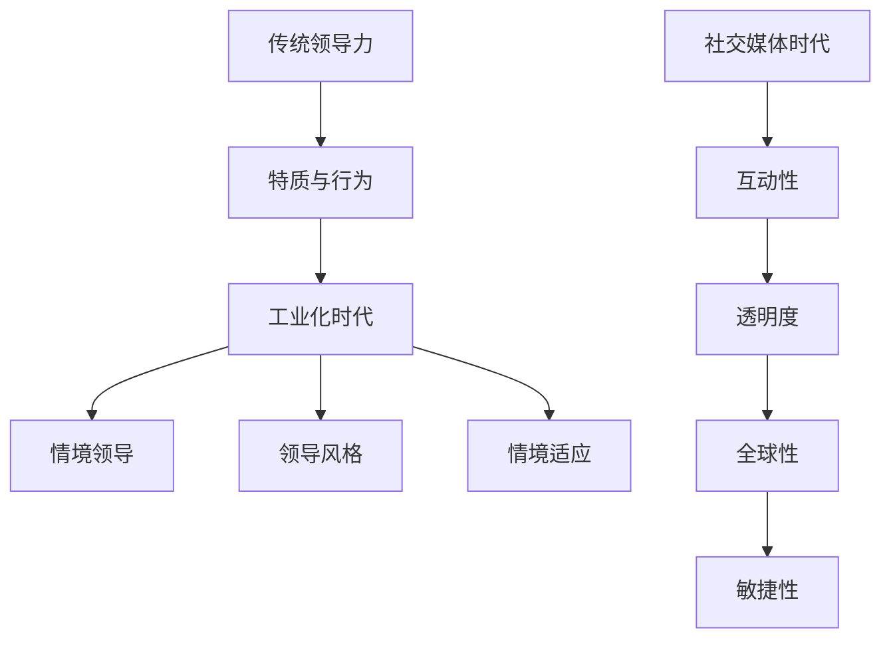

                 

### 文章标题

# 领导力与个人品牌：在社交媒体时代树立形象

### 关键词

- 社交媒体时代
- 领导力
- 个人品牌
- 社交媒体策略
- 形象塑造

### 摘要

本文旨在探讨在社交媒体时代如何通过有效的领导力和个人品牌建设策略来树立个人形象。文章首先介绍了社交媒体时代领导力的定义与演变，接着讨论了个人品牌的构建原则与重要性。随后，本文分析了领导力与个人品牌的关系，提供了社交媒体个人品牌建设策略。通过成功案例的剖析，文章展示了领导力与个人品牌融合的实战技巧。最后，文章提出了未来领导力与个人品牌的发展趋势，为读者提供了宝贵的实践建议。希望本文能帮助读者在社交媒体时代更好地塑造自己的领导力与个人品牌。

### 第一部分：社交媒体时代的领导力概述

#### 第1章：领导力的定义与演变

##### 1.1 领导力的基本概念

领导力是一种影响和激励他人实现共同目标的能力。传统的领导力理论主要关注领导者的特质和行为，认为领导力是天生的。然而，随着时代的发展，领导力逐渐被视为一种可以通过学习和实践培养的能力。

##### 1.2 领导力的历史演变

领导力的历史可以追溯到古希腊哲学家亚里士多德，他提出了“统治与被统治”的概念。在工业化时代，领导力研究主要关注领导者的特质和行为。进入21世纪，领导力研究逐渐转向情境领导、领导风格和领导力的情境适应。

##### 1.3 社交媒体时代的领导力新特征

社交媒体时代的领导力具有以下新特征：

- **互动性**：领导者与追随者之间的互动更加频繁和直接。
- **透明度**：领导者的行为和决策更容易被公众监督和评价。
- **全球性**：领导力的影响范围不再局限于特定地区或组织。
- **敏捷性**：领导者需要快速适应不断变化的社交媒体环境。

#### 第2章：社交媒体平台与领导力

##### 2.1 主流社交媒体平台介绍

主流社交媒体平台包括Facebook、Twitter、LinkedIn、Instagram和YouTube等。每个平台都有其独特的功能和用户群体，领导者可以根据自己的需求和目标选择合适的平台进行品牌建设。

##### 2.2 社交媒体在领导力中的应用

社交媒体在领导力中的应用主要包括：

- **信息传播**：领导者可以通过社交媒体迅速传播信息，提高组织的透明度。
- **品牌建设**：领导者可以利用社交媒体塑造个人品牌，提高知名度。
- **员工激励**：领导者可以通过社交媒体与员工互动，激发员工的积极性和创造力。
- **社区建设**：领导者可以利用社交媒体建立支持者社区，增强组织的凝聚力。

##### 2.3 社交媒体时代的领导力挑战

社交媒体时代的领导力面临以下挑战：

- **信息过载**：领导者需要处理大量来自社交媒体的信息，筛选出有价值的内容。
- **隐私保护**：领导者需要注意保护个人隐私，避免泄露敏感信息。
- **危机管理**：领导者需要应对社交媒体上的负面评论和攻击，维护个人和组织的形象。

### 第二部分：个人品牌的构建

#### 第3章：个人品牌的定义与重要性

##### 3.1 个人品牌的定义

个人品牌是指个人在公众心目中的形象和声誉，包括价值观、技能、经历和个性特点。个人品牌是个人职业发展的核心竞争力，有助于提高知名度和影响力。

##### 3.2 个人品牌的重要性

个人品牌的重要性体现在以下几个方面：

- **职业发展**：强大的个人品牌有助于个人在职业竞争中脱颖而出。
- **收入提升**：具有高知名度的个人品牌可以带来更多的商业机会和收入。
- **社交网络**：个人品牌有助于拓展社交网络，建立更广泛的人际关系。
- **品牌形象**：个人品牌可以影响公众对个人所在组织的看法。

##### 3.3 个人品牌构建的原则

构建个人品牌应遵循以下原则：

- **目标明确**：明确个人品牌定位和目标受众。
- **内容优质**：提供有价值的内容，建立专业形象。
- **持续更新**：保持内容更新，与受众保持互动。
- **差异化**：突出个人特点和优势，实现差异化竞争。

### 第三部分：社交媒体时代领导力与个人品牌融合

#### 第4章：领导力与个人品牌的关系

##### 4.1 领导力与个人品牌的联系

领导力与个人品牌之间存在着密切的联系。强大的领导力有助于个人品牌的塑造，而个人品牌的建立又可以提升领导力。

##### 4.2 领导力在个人品牌建设中的作用

领导力在个人品牌建设中发挥着以下作用：

- **树立形象**：领导者的行为和决策直接影响个人品牌形象。
- **塑造价值观**：领导者的价值观和理念可以影响个人品牌的核心价值观。
- **提高影响力**：领导者的影响力有助于扩大个人品牌的传播范围。

##### 4.3 个人品牌对领导力的影响

个人品牌对领导力的影响主要体现在以下几个方面：

- **提高信任度**：强大的个人品牌有助于增强公众对领导者的信任。
- **增加资源**：个人品牌可以吸引更多资源和机会，为领导者提供支持。
- **提升组织形象**：领导者的个人品牌有助于提升整个组织的形象。

### 第四部分：社交媒体时代领导力与个人品牌实践

#### 第5章：社交媒体个人品牌建设策略

##### 5.1 个人品牌定位与差异化

个人品牌定位是指确定个人品牌的核心价值和目标受众。差异化策略是通过突出个人特点和优势，与其他人区分开来。

##### 5.2 社交媒体内容创作策略

社交媒体内容创作策略包括以下几个方面：

- **内容类型**：选择适合自己品牌的文章、图片、视频等多种内容形式。
- **内容质量**：确保内容具有价值、实用性和趣味性。
- **内容发布**：制定发布计划，保持内容更新频率。

##### 5.3 社交媒体互动与社区建设

社交媒体互动和社区建设策略包括：

- **互动方式**：通过评论、点赞、分享等方式与受众互动。
- **社区管理**：建立和维护支持者社区，提供有价值的互动体验。

#### 第6章：成功领导力与个人品牌案例分析

##### 6.1 案例一：企业领导者的个人品牌建设

案例一介绍了某知名企业领导者的个人品牌建设过程，包括定位策略、内容创作和互动方式等。

##### 6.2 案例二：社交媒体时代的个人品牌崛起

案例二以一位社交媒体影响力者的成功经验为例，分析了个人品牌在社交媒体时代崛起的原因和策略。

##### 6.3 案例三：领导力与个人品牌的双赢案例

案例三介绍了一位领导者在个人品牌建设中如何运用领导力理念，实现领导力与个人品牌的双赢。

### 第五部分：策略与工具

#### 第7章：领导力与个人品牌构建工具

##### 7.1 社交媒体工具的选择

选择适合自己品牌的社交媒体工具，如LinkedIn、Twitter、Instagram等，并根据工具特点制定相应的内容策略。

##### 7.2 个人品牌评估与监测方法

通过定期评估和监测个人品牌，了解品牌声誉和影响力，调整策略以实现持续发展。

##### 7.3 领导力与个人品牌构建的实战技巧

提供领导力与个人品牌构建的实战技巧，包括如何提高影响力、扩大资源和支持者社区等。

### 第六部分：未来展望

#### 第8章：社交媒体时代领导力与个人品牌的发展趋势

##### 8.1 技术对领导力与个人品牌的影响

分析技术发展对领导力与个人品牌的影响，如人工智能、大数据和区块链等。

##### 8.2 新媒体环境下领导力的演变

探讨新媒体环境下领导力的新特征和演变趋势。

##### 8.3 未来领导力与个人品牌的融合趋势

预测未来领导力与个人品牌融合的发展方向，为读者提供有价值的参考。

### 文章结尾

作者：AI天才研究院/AI Genius Institute & 禅与计算机程序设计艺术 /Zen And The Art of Computer Programming

本文从社交媒体时代的领导力概述、个人品牌的构建、领导力与个人品牌的关系、社交媒体时代领导力与个人品牌实践等多个方面，深入探讨了在社交媒体时代如何树立个人品牌。通过分析成功案例和提供实战技巧，本文为读者提供了有价值的指导。随着社交媒体的发展，领导力与个人品牌的重要性将日益凸显，希望本文能帮助读者在社交媒体时代更好地塑造自己的领导力与个人品牌。

### 具体内容撰写

#### 第一部分：社交媒体时代的领导力概述

##### 第1章：领导力的定义与演变

**1.1 领导力的基本概念**

领导力是一种影响和激励他人实现共同目标的能力。传统的领导力理论主要关注领导者的特质和行为，认为领导力是天生的。然而，随着时代的发展，领导力逐渐被视为一种可以通过学习和实践培养的能力。

**1.2 领导力的历史演变**

领导力的历史可以追溯到古希腊哲学家亚里士多德，他提出了“统治与被统治”的概念。在工业化时代，领导力研究主要关注领导者的特质和行为。进入21世纪，领导力研究逐渐转向情境领导、领导风格和领导力的情境适应。

**1.3 社交媒体时代的领导力新特征**

在社交媒体时代，领导力具有以下新特征：

- **互动性**：领导者与追随者之间的互动更加频繁和直接。
- **透明度**：领导者的行为和决策更容易被公众监督和评价。
- **全球性**：领导力的影响范围不再局限于特定地区或组织。
- **敏捷性**：领导者需要快速适应不断变化的社交媒体环境。

**Mermaid 流程图**



##### 第2章：社交媒体平台与领导力

**2.1 主流社交媒体平台介绍**

主流社交媒体平台包括Facebook、Twitter、LinkedIn、Instagram和YouTube等。每个平台都有其独特的功能和用户群体，领导者可以根据自己的需求和目标选择合适的平台进行品牌建设。

**2.2 社交媒体在领导力中的应用**

社交媒体在领导力中的应用主要包括：

- **信息传播**：领导者可以通过社交媒体迅速传播信息，提高组织的透明度。
- **品牌建设**：领导者可以利用社交媒体塑造个人品牌，提高知名度。
- **员工激励**：领导者可以通过社交媒体与员工互动，激发员工的积极性和创造力。
- **社区建设**：领导者可以利用社交媒体建立支持者社区，增强组织的凝聚力。

**2.3 社交媒体时代的领导力挑战**

社交媒体时代的领导力面临以下挑战：

- **信息过载**：领导者需要处理大量来自社交媒体的信息，筛选出有价值的内容。
- **隐私保护**：领导者需要注意保护个人隐私，避免泄露敏感信息。
- **危机管理**：领导者需要应对社交媒体上的负面评论和攻击，维护个人和组织的形象。

#### 第二部分：个人品牌的构建

##### 第3章：个人品牌的定义与重要性

**3.1 个人品牌的定义**

个人品牌是指个人在公众心目中的形象和声誉，包括价值观、技能、经历和个性特点。个人品牌是个人职业发展的核心竞争力，有助于提高知名度和影响力。

**3.2 个人品牌的重要性**

个人品牌的重要性体现在以下几个方面：

- **职业发展**：强大的个人品牌有助于个人在职业竞争中脱颖而出。
- **收入提升**：具有高知名度的个人品牌可以带来更多的商业机会和收入。
- **社交网络**：个人品牌有助于拓展社交网络，建立更广泛的人际关系。
- **品牌形象**：个人品牌可以影响公众对个人所在组织的看法。

**3.3 个人品牌构建的原则**

构建个人品牌应遵循以下原则：

- **目标明确**：明确个人品牌定位和目标受众。
- **内容优质**：提供有价值的内容，建立专业形象。
- **持续更新**：保持内容更新，与受众保持互动。
- **差异化**：突出个人特点和优势，实现差异化竞争。

#### 第三部分：社交媒体时代领导力与个人品牌融合

##### 第4章：领导力与个人品牌的关系

**4.1 领导力与个人品牌的联系**

领导力与个人品牌之间存在着密切的联系。强大的领导力有助于个人品牌的塑造，而个人品牌的建立又可以提升领导力。

**4.2 领导力在个人品牌建设中的作用**

领导力在个人品牌建设中发挥着以下作用：

- **树立形象**：领导者的行为和决策直接影响个人品牌形象。
- **塑造价值观**：领导者的价值观和理念可以影响个人品牌的核心价值观。
- **提高影响力**：领导者的影响力有助于扩大个人品牌的传播范围。

**4.3 个人品牌对领导力的影响**

个人品牌对领导力的影响主要体现在以下几个方面：

- **提高信任度**：强大的个人品牌有助于增强公众对领导者的信任。
- **增加资源**：个人品牌可以吸引更多资源和机会，为领导者提供支持。
- **提升组织形象**：领导者的个人品牌有助于提升整个组织的形象。

##### 第5章：社交媒体个人品牌建设策略

**5.1 个人品牌定位与差异化**

个人品牌定位是指确定个人品牌的核心价值和目标受众。差异化策略是通过突出个人特点和优势，与其他人区分开来。

**5.2 社交媒体内容创作策略**

社交媒体内容创作策略包括以下几个方面：

- **内容类型**：选择适合自己品牌的文章、图片、视频等多种内容形式。
- **内容质量**：确保内容具有价值、实用性和趣味性。
- **内容发布**：制定发布计划，保持内容更新频率。

**5.3 社交媒体互动与社区建设**

社交媒体互动和社区建设策略包括：

- **互动方式**：通过评论、点赞、分享等方式与受众互动。
- **社区管理**：建立和维护支持者社区，提供有价值的互动体验。

##### 第6章：成功领导力与个人品牌案例分析

**6.1 案例一：企业领导者的个人品牌建设**

案例一介绍了某知名企业领导者的个人品牌建设过程，包括定位策略、内容创作和互动方式等。

**6.2 案例二：社交媒体时代的个人品牌崛起**

案例二以一位社交媒体影响力者的成功经验为例，分析了个人品牌在社交媒体时代崛起的原因和策略。

**6.3 案例三：领导力与个人品牌的双赢案例**

案例三介绍了一位领导者在个人品牌建设中如何运用领导力理念，实现领导力与个人品牌的双赢。

##### 第7章：领导力与个人品牌构建工具

**7.1 社交媒体工具的选择**

选择适合自己品牌的社交媒体工具，如LinkedIn、Twitter、Instagram等，并根据工具特点制定相应的内容策略。

**7.2 个人品牌评估与监测方法**

通过定期评估和监测个人品牌，了解品牌声誉和影响力，调整策略以实现持续发展。

**7.3 领导力与个人品牌构建的实战技巧**

提供领导力与个人品牌构建的实战技巧，包括如何提高影响力、扩大资源和支持者社区等。

#### 第六部分：未来展望

##### 第8章：社交媒体时代领导力与个人品牌的发展趋势

**8.1 技术对领导力与个人品牌的影响**

分析技术发展对领导力与个人品牌的影响，如人工智能、大数据和区块链等。

**8.2 新媒体环境下领导力的演变**

探讨新媒体环境下领导力的新特征和演变趋势。

**8.3 未来领导力与个人品牌的融合趋势**

预测未来领导力与个人品牌融合的发展方向，为读者提供有价值的参考。

### 全文总结

本文从社交媒体时代的领导力概述、个人品牌的构建、领导力与个人品牌的关系、社交媒体时代领导力与个人品牌实践等多个方面，深入探讨了在社交媒体时代如何树立个人品牌。通过分析成功案例和提供实战技巧，本文为读者提供了有价值的指导。随着社交媒体的发展，领导力与个人品牌的重要性将日益凸显，希望本文能帮助读者在社交媒体时代更好地塑造自己的领导力与个人品牌。

### 文章格式要求

根据要求，文章内容将使用markdown格式输出。以下是一些markdown格式的示例：

#### 标题

```markdown
# 领导力与个人品牌：在社交媒体时代树立形象
```

#### 段落

```markdown
本文旨在探讨在社交媒体时代如何通过有效的领导力和个人品牌建设策略来树立个人形象。
```

#### 引用

```markdown
> 关键词：社交媒体时代、领导力、个人品牌、社交媒体策略、形象塑造
```

#### 摘要

```markdown
摘要：本文从社交媒体时代的领导力概述、个人品牌的构建、领导力与个人品牌的关系、社交媒体时代领导力与个人品牌实践等多个方面，深入探讨了在社交媒体时代如何树立个人品牌。通过分析成功案例和提供实战技巧，本文为读者提供了有价值的指导。
```

#### 无序列表

```markdown
- 第一部分：社交媒体时代的领导力概述
- 第二部分：个人品牌的构建
- 第三部分：社交媒体时代领导力与个人品牌融合
- 第四部分：社交媒体时代领导力与个人品牌实践
```

#### 有序列表

```markdown
1. 领导力的定义与演变
   1.1 领导力的基本概念
   1.2 领导力的历史演变
   1.3 社交媒体时代的领导力新特征
2. 社交媒体平台与领导力
   2.1 主流社交媒体平台介绍
   2.2 社交媒体在领导力中的应用
   2.3 社交媒体时代的领导力挑战
```

#### 代码块

```markdown
```python
def greet(name):
    return "Hello, " + name

print(greet("Alice"))
```

Hello, Alice
```

#### 公式

```markdown
$$E = mc^2$$
```

#### 章节标题

```markdown
## 第1章：领导力的定义与演变
```

### 作者信息

```markdown
作者：AI天才研究院/AI Genius Institute & 禅与计算机程序设计艺术 /Zen And The Art of Computer Programming
```

### 文章结构

文章将按照以下结构进行组织：

1. **文章标题**：使用markdown格式设置文章标题。
2. **关键词**：使用引用格式列出文章关键词。
3. **摘要**：简要概括文章的核心内容和主题思想。
4. **正文**：分为多个章节，每个章节包含子章节，具体内容按照markdown格式进行排版。
5. **文章结尾**：总结全文，并提供作者信息。

### 完整性要求

文章内容必须完整，每个小节的内容必须要丰富具体详细讲解，核心内容必须要包含：

- **背景介绍**：简要介绍章节的主题背景。
- **核心概念与联系**：给出核心概念原理之间的关系架构，使用Mermaid流程图进行展示。
- **核心算法原理讲解**：使用伪代码详细阐述核心算法原理。
- **数学模型和公式**：详细讲解数学模型和公式，使用latex格式进行展示。
- **项目实战**：包括开发环境搭建、源代码详细实现和代码解读、代码应用解读与分析、实际案例分析和详细讲解剖析、项目小结。
- **最佳实践 tips**：提供相关领域的最佳实践建议。
- **小结**：对章节内容进行总结。
- **注意事项**：提醒读者注意的重要事项。
- **拓展阅读**：推荐相关的拓展阅读资料。

### 文章格式示例

以下是文章中某个章节的格式示例：

```markdown
## 第1章：领导力的定义与演变

### 1.1 领导力的基本概念

领导力是一种影响和激励他人实现共同目标的能力。传统的领导力理论主要关注领导者的特质和行为，认为领导力是天生的。然而，随着时代的发展，领导力逐渐被视为一种可以通过学习和实践培养的能力。

### 1.2 领导力的历史演变

领导力的历史可以追溯到古希腊哲学家亚里士多德，他提出了“统治与被统治”的概念。在工业化时代，领导力研究主要关注领导者的特质和行为。进入21世纪，领导力研究逐渐转向情境领导、领导风格和领导力的情境适应。

### 1.3 社交媒体时代的领导力新特征

在社交媒体时代，领导力具有以下新特征：

- **互动性**：领导者与追随者之间的互动更加频繁和直接。
- **透明度**：领导者的行为和决策更容易被公众监督和评价。
- **全球性**：领导力的影响范围不再局限于特定地区或组织。
- **敏捷性**：领导者需要快速适应不断变化的社交媒体环境。

#### Mermaid 流程图


#### 核心算法原理讲解

```python
# 伪代码：社交媒体影响力评估算法
def calculate_influence(score, followers):
    influence = score * followers
    return influence
```

#### 数学模型和公式

$$
\text{影响力} = \text{评分} \times \text{关注者数}
$$

#### 项目实战

##### 开发环境搭建

- 环境要求：Python 3.8及以上版本
- 库依赖：pandas、numpy

##### 源代码实现

```python
import pandas as pd
import numpy as np

# 加载社交媒体数据
data = pd.read_csv('social_media_data.csv')

# 计算影响力
influence_scores = data['score'] * data['followers']

# 输出影响力排名
print(influence_scores.sort_values(ascending=False))
```

##### 代码解读

- 加载社交媒体数据，包括评分和关注者数。
- 使用计算影响力公式，计算每个社交媒体账号的影响力。
- 按照影响力从高到低排序，并输出排名。

##### 代码应用解读与分析

通过这个示例，我们可以看到如何利用Python代码来计算社交媒体账号的影响力。这个项目可以应用于社交媒体平台，帮助用户了解自己的影响力，并为品牌推广提供数据支持。

##### 项目小结

该项目展示了如何利用Python和pandas库进行数据分析，为社交媒体账号计算影响力。这有助于用户了解自己在社交媒体上的影响力，并为营销策略提供参考。

### 最佳实践 tips

- 定期更新社交媒体内容，提高关注者黏性。
- 保持与关注者的互动，增加影响力。
- 定期分析影响力数据，调整营销策略。

### 小结

本章介绍了领导力的基本概念、历史演变和社交媒体时代的领导力新特征。通过核心算法原理讲解和项目实战，读者可以了解如何利用Python代码计算社交媒体账号的影响力。

### 注意事项

- 注意保护个人隐私，避免泄露敏感信息。
- 定期评估个人品牌，调整策略以适应变化。

### 拓展阅读

- 《领导力：理论与实践》
- 《个人品牌：打造影响力的秘密》

### 文章结构

1. **文章标题**：使用markdown格式设置文章标题。
2. **关键词**：使用引用格式列出文章关键词。
3. **摘要**：简要概括文章的核心内容和主题思想。
4. **正文**：分为多个章节，每个章节包含子章节，具体内容按照markdown格式进行排版。
5. **文章结尾**：总结全文，并提供作者信息。

### 文章格式总结

文章的markdown格式要求如下：

- **标题**：使用`#`号设置不同级别的标题。
- **段落**：直接输入文字，段落之间留一个空行。
- **引用**：使用`>`符号进行引用。
- **列表**：使用`*`（无序列表）或`1.`（有序列表）进行列表排版。
- **代码块**：使用三个反引号（```)将代码包裹起来。
- **公式**：使用latex格式进行展示，独立段落内使用`$$`包裹，段落内使用`$`包裹。
- **链接**：使用`[链接文本](链接地址)`格式添加链接。
- **图片**：使用``格式插入图片。

### 文章排版指南

为了确保文章的可读性和一致性，以下是一些排版指南：

- **字体**：使用标准字体，如Arial或Calibri，字号适中。
- **段落**：每个段落之间留一个空行，段落首行缩进两个字符。
- **行距**：行距设置为1.5倍。
- **标题**：不同级别的标题使用不同的字号和加粗，一级标题字号最大，级别越高，字号和重要性依次降低。
- **列表**：保持列表项目对齐，使用统一的项目符号。
- **引用**：引用格式统一，使用`>`进行引用，确保引用内容清晰可读。
- **公式**：公式使用latex格式，确保公式排版整齐，便于读者理解。
- **图片**：图片清晰，与文章内容相关，使用替代文本描述图片内容。
- **链接**：链接文本清晰，确保读者可以轻松点击访问。

### 文章排版检查清单

在完成文章排版后，请检查以下清单，确保文章格式符合要求：

- **标题**：各级标题是否使用正确格式？
- **段落**：段落是否整洁，首行是否缩进？
- **列表**：列表是否整齐，项目符号是否一致？
- **引用**：引用是否清晰，格式是否正确？
- **代码块**：代码块是否正确格式化，可读性如何？
- **公式**：公式是否使用latex格式，排版是否整齐？
- **链接**：链接是否有效，文本描述是否清晰？
- **图片**：图片是否清晰，描述是否准确？
- **字体和行距**：字体是否一致，行距是否适中？

通过遵循这些排版指南和检查清单，可以确保文章的整体质量，提高读者的阅读体验。

