                 


### 文章标题：领导力与个人品牌：塑造专业形象

#### 关键词：领导力、个人品牌、专业形象、自我认知、社交媒体、项目管理

#### 摘要：
在快速变化的IT行业中，领导力和个人品牌成为成功的关键因素。本文将深入探讨领导力与个人品牌之间的内在联系，以及如何通过有效的策略来塑造专业形象。通过分析自我认知、外在形象管理、社交媒体应用以及领导力提升策略，我们将为读者提供一套系统化的方法，帮助他们在职业道路上更加成功。

### 第一部分：领导力与个人品牌的基石

#### 第1章：领导力与个人品牌的基础概念

**1.1 领导力的定义与要素**

**核心概念与联系：** 领导力不仅仅是指导和管理他人，更是影响和激励团队的能力。其核心要素包括愿景、影响力、决策力和沟通能力。以下是一个简化的Mermaid流程图，展示领导力的关键要素及其相互关系：

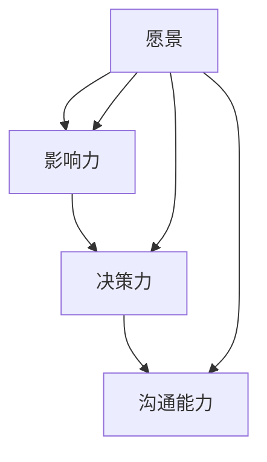

**核心算法原理讲解：** 领导力的核心算法可以看作是一个多因素决策过程，其中每个因素（愿景、影响力、决策力和沟通能力）都通过特定的权重和输入信息影响最终的领导效果。

```pseudo
function leadershipEffectIVENESS愿景,影响力,决策力,沟通能力 {
    weightSum = 0
    if 愿景 > 0 then weightSum += 愿景
    if 影响力 > 0 then weightSum += 影响力
    if 决策力 > 0 then weightSum += 决策力
    if 沟通能力 > 0 then weightSum += 沟通能力
    return weightSum
}
```

**数学模型和公式：** 使用加权平均数模型来表示领导力的综合效果。

$$ \text{领导力综合效果} = \frac{(\text{愿景} \times w_1) + (\text{影响力} \times w_2) + (\text{决策力} \times w_3) + (\text{沟通能力} \times w_4)}{w_1 + w_2 + w_3 + w_4} $$

**举例说明：** 假设一个领导者的各项能力得分如下：愿景 - 8，影响力 - 7，决策力 - 6，沟通能力 - 9。权重分别为：愿景 - 0.3，影响力 - 0.25，决策力 - 0.2，沟通能力 - 0.25。则其领导力综合效果为：

$$ \text{领导力综合效果} = \frac{(8 \times 0.3) + (7 \times 0.25) + (6 \times 0.2) + (9 \times 0.25)}{0.3 + 0.25 + 0.2 + 0.25} = \frac{2.4 + 1.75 + 1.2 + 2.25}{1} = 7.7 $$

**项目实战：** 在一个项目团队中，一个领导者如何通过有效的领导力来提升团队绩效。首先，领导者需要明确项目愿景，并通过沟通能力来确保团队成员理解并接受这一愿景。其次，领导者需要通过决策力来做出正确的决策，并通过影响力来确保团队成员愿意执行这些决策。最后，领导者需要通过沟通能力和决策力来协调团队内部和外部资源，确保项目目标的实现。

**最佳实践 tips：** 
- 定期进行自我评估，了解自身在领导力各个方面的表现。
- 寻求反馈，从团队成员和同事那里获取对自身领导力的评价。
- 持续学习和成长，不断提升自己的领导力技能。

---

**1.2 个人品牌的概念与作用**

**核心概念与联系：** 个人品牌是指一个人在职业生涯中形成的独特形象和声誉。它与个人价值观、专业能力和人际网络紧密相关。以下是一个简化的Mermaid流程图，展示个人品牌的组成部分及其相互关系：

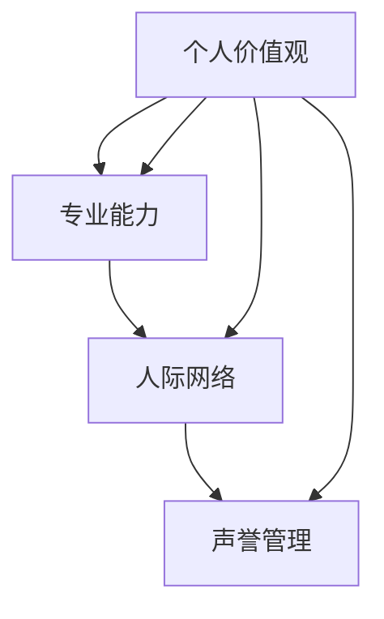

**核心算法原理讲解：** 个人品牌的形成可以看作是一个多因素综合评价过程，其中个人价值观、专业能力和人际网络是主要影响因素。以下是一个简化的伪代码模型：

```pseudo
function personalBrandScore价值观,专业能力,人际网络 {
    score = 0
    if 价值观 > threshold then score += 1
    if 专业能力 > threshold then score += 1
    if 人际网络 > threshold then score += 1
    return score
}
```

**数学模型和公式：** 使用三元组模型来表示个人品牌的评分。

$$ \text{个人品牌评分} = (\text{价值观评分} + \text{专业能力评分} + \text{人际网络评分}) \div 3 $$

**举例说明：** 假设一个个人品牌的三个组成部分的评分分别为：价值观 - 8，专业能力 - 9，人际网络 - 7。则其个人品牌评分为：

$$ \text{个人品牌评分} = (\text{8} + \text{9} + \text{7}) \div 3 = 8 $$

**项目实战：** 在一个专业社区中，一个技术专家如何通过构建个人品牌来提升影响力。首先，他需要明确自己的价值观，并在技术讨论中坚持这些价值观。其次，他需要不断提升自己的专业能力，并在社区中分享自己的知识和经验。最后，他需要积极建立和扩展人际网络，与其他技术专家和从业者建立联系。

**最佳实践 tips：**
- 明确自己的价值观，并将其融入到工作和生活中。
- 持续学习和提升专业能力，保持行业竞争力。
- 积极参与社区活动，建立广泛的人脉网络。

---

**1.3 领导力与个人品牌的关系**

**核心概念与联系：** 领导力与个人品牌之间存在密切的关系。有效的领导力可以帮助个人建立强大的个人品牌，而强大的个人品牌可以进一步提升领导力。以下是一个简化的Mermaid流程图，展示领导力与个人品牌之间的相互关系：

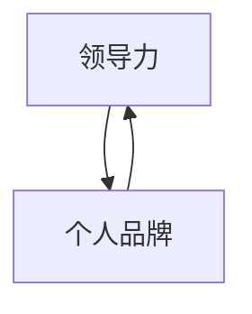

**核心算法原理讲解：** 领导力与个人品牌之间的相互作用可以看作是一个反馈循环。领导力提升个人品牌，而个人品牌反过来又增强领导力。以下是一个简化的伪代码模型：

```pseudo
function leadershipImpactOnBrand领导力,个人品牌 {
    if 领导力 > threshold then 个人品牌 += 1
    if 个人品牌 > threshold then 领导力 += 1
    return 领导力,个人品牌
}
```

**数学模型和公式：** 使用互增强模型来表示领导力与个人品牌之间的相互作用。

$$ \text{领导力增强个人品牌} = \text{领导力} \times (\text{个人品牌} + 1) $$

$$ \text{个人品牌增强领导力} = \text{个人品牌} \times (\text{领导力} + 1) $$

**举例说明：** 假设一个领导力的评分为 7，一个个人品牌的评分为 8。则：

$$ \text{领导力增强个人品牌} = 7 \times (8 + 1) = 63 $$

$$ \text{个人品牌增强领导力} = 8 \times (7 + 1) = 64 $$

**项目实战：** 在一个创业公司中，一个创始人如何通过领导力来塑造个人品牌，并反过来提升公司的整体绩效。首先，创始人需要通过明确愿景、制定策略和有效沟通来展现自己的领导力。这不仅可以提升个人品牌，还可以吸引更多的投资者和人才。其次，创始人需要积极参与行业活动，分享自己的经验和见解，进一步提升个人品牌。最终，强大的个人品牌可以增强公司的市场竞争力，吸引更多客户和合作伙伴。

**最佳实践 tips：**
- 综合提升领导力和个人品牌，形成良性循环。
- 寻找合适的机会来展示自己的领导力和个人品牌。
- 保持持续的学习和成长，不断提升自己的综合素质。

### 第二部分：塑造个人品牌的策略

#### 第2章：自我认知与定位

**2.1 自我认知的重要性**

**背景介绍：** 自我认知是塑造个人品牌的第一步，它涉及到对自己的价值观、兴趣、优势和弱点的深刻理解。自我认知的重要性在于，它为个人品牌的定位和塑造提供了坚实的基础。

**核心概念与联系：** 自我认知的过程可以看作是一个信息收集和内部反思的过程。以下是一个简化的Mermaid流程图，展示自我认知的关键步骤：

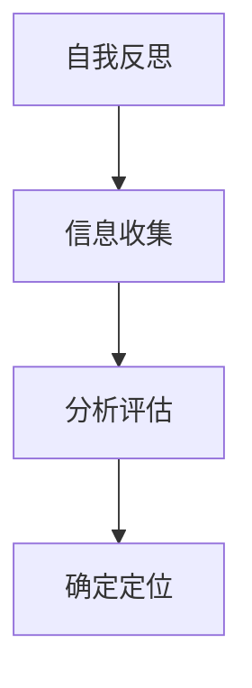

**核心算法原理讲解：** 自我认知的核心算法可以看作是一个多阶段信息处理模型，其中每个阶段都需要对信息进行收集、分析和评估。

```pseudo
function selfAwareness(values, interests, strengths, weaknesses) {
    reflection = analyze(values)
    information = gatherData(interests, strengths, weaknesses)
    assessment = evaluate(reflection, information)
    return assessment
}
```

**数学模型和公式：** 使用加权评分模型来评估自我认知的深度。

$$ \text{自我认知深度} = \frac{(\text{价值观权重} \times \text{价值观评分}) + (\text{兴趣权重} \times \text{兴趣评分}) + (\text{优势权重} \times \text{优势评分}) + (\text{弱点权重} \times \text{弱点评分})}{\text{总权重}} $$

**举例说明：** 假设一个自我认知评估的权重分别为：价值观 - 0.4，兴趣 - 0.3，优势 - 0.2，弱点 - 0.1。各项的评分分别为：价值观 - 8，兴趣 - 7，优势 - 9，弱点 - 6。则其自我认知深度为：

$$ \text{自我认知深度} = \frac{(0.4 \times 8) + (0.3 \times 7) + (0.2 \times 9) + (0.1 \times 6)}{0.4 + 0.3 + 0.2 + 0.1} = 7.3 $$

**项目实战：** 在一个职业转型过程中，一个人如何通过自我认知来找到适合自己的新方向。首先，他需要进行自我反思，明确自己的价值观和兴趣。其次，他需要收集相关信息，分析市场和行业的趋势。最后，他需要评估自己的优势和弱点，确定自己的定位。

**最佳实践 tips：**
- 定期进行自我反思，保持对自我认知的更新。
- 寻求他人的反馈和建议，以更全面地了解自己。
- 保持开放的心态，愿意接受新的挑战和机会。

---

**2.2 明确个人定位**

**核心概念与联系：** 个人定位是指一个人在职业生涯中确定自己的独特价值和市场定位。明确个人定位可以帮助个人在竞争激烈的职场中脱颖而出。

**核心算法原理讲解：** 个人定位的核心算法可以看作是一个多因素综合评估模型，其中包括个人能力、市场需求和职业目标。以下是一个简化的伪代码模型：

```pseudo
function personalPositioning(ability, marketDemand, careerGoal) {
    score = 0
    if ability > threshold then score += 1
    if marketDemand > threshold then score += 1
    if careerGoal > threshold then score += 1
    return score
}
```

**数学模型和公式：** 使用综合评分模型来评估个人定位。

$$ \text{个人定位评分} = (\text{能力评分} + \text{市场评分} + \text{目标评分}) \div 3 $$

**举例说明：** 假设一个人的能力评分为 8，市场需求评分为 9，职业目标评分为 7。则其个人定位评分为：

$$ \text{个人定位评分} = (\text{8} + \text{9} + \text{7}) \div 3 = 8 $$

**项目实战：** 在一个职业转型过程中，一个人如何通过明确个人定位来找到适合自己的新方向。首先，他需要评估自己的能力，确定自己在哪些领域具有竞争力。其次，他需要分析市场需求，了解哪些领域有较高的需求。最后，他需要设定明确的职业目标，确保自己的转型方向与目标一致。

**最佳实践 tips：**
- 定期重新评估个人定位，确保与市场需求和自身能力保持一致。
- 保持对行业动态的敏感度，及时调整个人定位。
- 坚持追求个人成长和目标，不断提升自己的竞争力。

### 第三部分：领导力与个人品牌提升策略

#### 第3章：领导力提升策略

**3.1 领导力提升的策略**

**核心概念与联系：** 领导力提升是一个持续的过程，需要通过系统性的学习和实践来实现。以下是一个简化的Mermaid流程图，展示领导力提升的关键步骤：

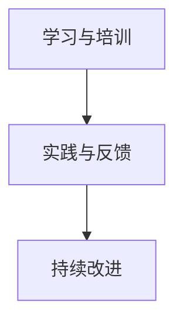

**核心算法原理讲解：** 领导力提升的核心算法可以看作是一个循环反馈模型，通过学习、实践和反馈来不断提升领导力水平。

```pseudo
function leadershipDevelopment(learning, practice, feedback) {
    while (true) {
        leadershipScore = applyLearning(learning)
        leadershipScore = applyPractice(practice)
        leadershipScore = applyFeedback(feedback)
    }
    return leadershipScore
}
```

**数学模型和公式：** 使用动态评分模型来评估领导力提升的效果。

$$ \text{领导力提升效果} = \text{初始领导力评分} + \text{学习贡献} + \text{实践贡献} + \text{反馈贡献} $$

**举例说明：** 假设一个领导者的初始领导力评分为 6，经过一轮学习、实践和反馈后，领导力评分提升为 8。则其领导力提升效果为：

$$ \text{领导力提升效果} = 6 + 2 + 2 + 2 = 12 $$

**项目实战：** 在一个团队中，一个领导者如何通过领导力提升策略来提升团队绩效。首先，他需要参加领导力培训课程，提升自己的理论知识。其次，他需要在实际工作中实践所学知识，提升自己的领导力技能。最后，他需要通过反馈机制，了解团队成员的反馈，并根据反馈进行改进。

**最佳实践 tips：**
- 定期参加领导力培训，不断提升自己的理论水平。
- 在实际工作中积极实践领导力技能，不断总结经验。
- 建立反馈机制，及时了解团队成员的反馈，并根据反馈进行改进。

---

**3.2 个人品牌建设策略**

**核心概念与联系：** 个人品牌建设是一个系统工程，需要从多个方面来全面提升个人形象和声誉。以下是一个简化的Mermaid流程图，展示个人品牌建设的关键步骤：

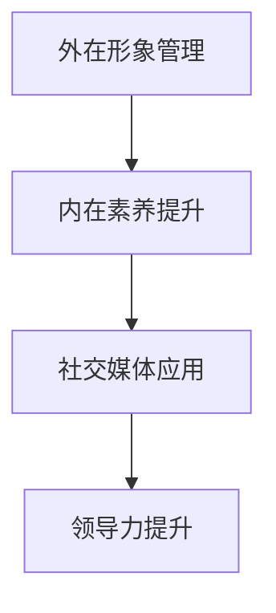

**核心算法原理讲解：** 个人品牌建设的核心算法可以看作是一个综合评估模型，包括外在形象管理、内在素养提升、社交媒体应用和领导力提升。以下是一个简化的伪代码模型：

```pseudo
function personalBrandBuilding(image, integrity, socialMedia, leadership) {
    brandScore = 0
    if image > threshold then brandScore += 1
    if integrity > threshold then brandScore += 1
    if socialMedia > threshold then brandScore += 1
    if leadership > threshold then brandScore += 1
    return brandScore
}
```

**数学模型和公式：** 使用综合评分模型来评估个人品牌建设的效果。

$$ \text{个人品牌评分} = (\text{外在形象评分} + \text{内在素养评分} + \text{社交媒体评分} + \text{领导力评分}) \div 4 $$

**举例说明：** 假设一个个人品牌建设中的各项评分分别为：外在形象 - 8，内在素养 - 9，社交媒体 - 7，领导力 - 8。则其个人品牌评分为：

$$ \text{个人品牌评分} = (\text{8} + \text{9} + \text{7} + \text{8}) \div 4 = 8 $$

**项目实战：** 在一个职业发展中，一个人如何通过个人品牌建设来提升自己的竞争力。首先，他需要管理自己的外在形象，提升专业形象。其次，他需要提升内在素养，增强自己的专业能力。然后，他需要通过社交媒体来展示自己的专业知识和成果。最后，他需要通过领导力提升来增强自己的领导能力和影响力。

**最佳实践 tips：**
- 综合提升外在形象、内在素养、社交媒体应用和领导力，形成整体的品牌效应。
- 定期评估个人品牌建设的进展，确保与职业目标保持一致。
- 积极参与行业活动和社区讨论，提升个人品牌的影响力。

### 第四部分：领导力与个人品牌在实际工作中的应用

#### 第4章：领导力与个人品牌在项目管理中的应用

**4.1 领导力在项目管理中的应用**

**核心概念与联系：** 领导力在项目管理中发挥着至关重要的作用，它涉及团队协调、目标设定和决策制定等方面。以下是一个简化的Mermaid流程图，展示领导力在项目管理中的应用步骤：

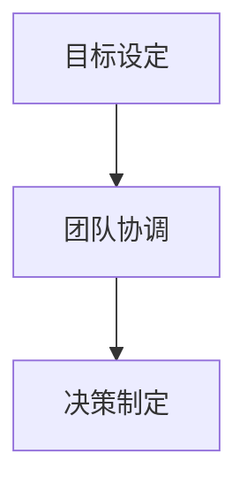

**核心算法原理讲解：** 领导力在项目管理中的应用可以看作是一个多阶段决策过程，每个阶段都需要有效的领导力来推动项目进展。

```pseudo
function projectManagement(leader, goal, team) {
    leader.setGoal(goal)
    leader协调团队(team)
    leader做出决策
    return 项目进展
}
```

**数学模型和公式：** 使用目标导向模型来评估领导力在项目管理中的效果。

$$ \text{项目进展评分} = \frac{\text{目标达成度} + \text{团队协作度} + \text{决策正确度}}{3} $$

**举例说明：** 假设一个项目管理团队的目标达成度为 80%，团队协作度为 90%，决策正确度为 85%。则其项目进展评分为：

$$ \text{项目进展评分} = \frac{0.8 + 0.9 + 0.85}{3} = 0.857 $$

**项目实战：** 在一个软件开发项目中，一个领导者如何通过领导力来推动项目进展。首先，他需要明确项目目标，并与团队达成共识。其次，他需要协调团队成员的工作，确保他们能够协同合作。最后，他需要在关键时刻做出正确的决策，以推动项目向前发展。

**最佳实践 tips：**
- 明确项目目标，确保团队全体成员都明确并理解。
- 建立有效的沟通机制，确保团队成员之间的信息畅通。
- 在决策过程中，充分考虑团队的建议和意见，做出最佳决策。

---

**4.2 个人品牌在工作环境中的塑造**

**核心概念与联系：** 个人品牌在工作环境中的塑造涉及到个人形象、专业能力和人际关系等多个方面。以下是一个简化的Mermaid流程图，展示个人品牌在工作环境中的塑造步骤：

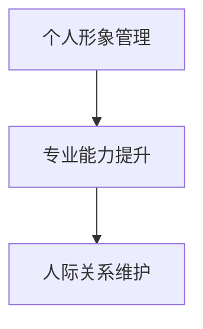

**核心算法原理讲解：** 个人品牌在工作环境中的塑造可以看作是一个多因素综合评价模型，涉及个人形象、专业能力和人际关系。

```pseudo
function personalBrandWorkEnvironment(image, skill, relationship) {
    brandScore = 0
    if image > threshold then brandScore += 1
    if skill > threshold then brandScore += 1
    if relationship > threshold then brandScore += 1
    return brandScore
}
```

**数学模型和公式：** 使用综合评分模型来评估个人品牌在工作环境中的效果。

$$ \text{个人品牌评分} = (\text{形象评分} + \text{能力评分} + \text{关系评分}) \div 3 $$

**举例说明：** 假设一个个人品牌在工作环境中的各项评分分别为：形象 - 8，能力 - 9，关系 - 7。则其个人品牌评分为：

$$ \text{个人品牌评分} = (\text{8} + \text{9} + \text{7}) \div 3 = 8 $$

**项目实战：** 在一个职场环境中，一个人如何通过塑造个人品牌来提升自己的竞争力。首先，他需要管理自己的个人形象，确保穿着得体、行为规范。其次，他需要不断提升自己的专业能力，通过学习和实践来增强自己的竞争力。最后，他需要维护良好的人际关系，与同事、上级和下属建立积极的关系。

**最佳实践 tips：**
- 定期反思和改进个人形象，确保与职业目标相符。
- 持续学习和提升专业能力，保持行业竞争力。
- 积极参与团队活动，建立和维护良好的人际关系。

### 第五部分：案例分析

#### 第5章：成功领导力与个人品牌的案例解析

**5.1 案例介绍**

**案例背景：** 本案例分析的是一个成功的IT企业创始人，他在领导力和个人品牌建设方面的卓越表现。该创始人通过明确的愿景、卓越的领导力和强大的个人品牌，带领企业从初创走向成功。

**案例目标：** 通过分析该创始人的领导力和个人品牌建设策略，探讨其在职业发展中的关键成功因素。

**5.2 案例分析**

**领导力在案例中的应用：** 
- **愿景明确：** 该创始人有一个清晰的愿景，即通过技术创新解决用户问题。这一愿景不仅激励了团队成员，也为企业的发展指明了方向。
- **决策力强：** 在企业发展过程中，该创始人面对多个关键决策，如产品定位、市场拓展等，均能做出正确的决策，确保企业稳步发展。
- **沟通能力：** 该创始人注重与团队成员和投资者的沟通，确保信息畅通，增强团队凝聚力。

**个人品牌建设在案例中的应用：** 
- **社交媒体应用：** 该创始人在社交媒体上积极展示自己的专业知识和见解，树立了行业专家的形象。
- **专业能力：** 该创始人持续提升自己的专业能力，通过技术创新和项目成果，增强了个人品牌的影响力。
- **人际关系：** 该创始人通过建立和维护良好的人际关系，扩大了自己在行业内的声誉。

**5.3 案例启示**

**可借鉴的经验：**
- 明确愿景，为团队和企业的发展提供方向。
- 增强决策力，确保在关键时刻做出正确决策。
- 提升沟通能力，确保团队凝聚力。
- 利用社交媒体展示专业能力，树立个人品牌。
- 维护良好的人际关系，扩大影响力。

**挑战与应对策略：**
- 在快速发展中，如何平衡领导力和个人品牌建设。
- 面对市场竞争，如何持续提升个人品牌价值。
- 在企业扩张过程中，如何保持团队凝聚力。

**最佳实践 tips：**
- 定期反思和调整领导力和个人品牌建设策略。
- 积极参与行业活动和社区讨论，提升个人品牌影响力。
- 建立有效的团队管理机制，确保团队稳定发展。

### 结论

领导力与个人品牌是职业成功的关键因素。通过明确愿景、提升决策力、增强沟通能力、利用社交媒体和专业能力，个人可以构建强大的个人品牌，并在职业发展中取得成功。本文通过深入分析和案例分析，为读者提供了系统化的方法，帮助他们在领导力和个人品牌建设方面取得进步。希望本文能对您的职业发展有所启发和帮助。

---

### 附录

#### 附录A：个人品牌建设工具与资源

**A.1 自我评估工具**

- **Myers-Briggs Type Indicator (MBTI)：** 用于评估个人的性格类型，帮助了解自己的优势和劣势。
- **StrengthsFinder：** 用于评估个人的优势，指导职业规划和发展。

**A.2 个人品牌建设策略模板**

- **个人品牌宣言：** 明确自己的核心价值观、专业能力和个人愿景。
- **个人品牌行动计划：** 制定具体的行动步骤，包括学习、实践和展示专业能力。

**A.3 领导力提升资源推荐**

- **领导力培训课程：** 如“领导力发展计划”、“卓越领导者培训”等。
- **领导力书籍推荐：** 如《领导力的五个层次》、《影响力》等。

作者：AI天才研究院/AI Genius Institute & 禅与计算机程序设计艺术 /Zen And The Art of Computer Programming

---

### 全文总结

本文围绕“领导力与个人品牌：塑造专业形象”这一主题，系统地探讨了领导力与个人品牌之间的内在联系，以及如何通过有效的策略来塑造专业形象。我们从领导力的基础概念、个人品牌的概念、领导力与个人品牌的关系，到具体的策略应用，进行了深入的分析和讲解。

首先，我们明确了领导力的核心要素，包括愿景、影响力、决策力和沟通能力，并介绍了如何通过多因素决策过程来提升领导力。同时，我们阐述了个人品牌的概念，并展示了个人品牌与个人价值观、专业能力和人际网络之间的紧密关系。

接下来，我们提出了自我认知与定位的重要性，并提供了具体的策略，帮助个人明确自己的定位，提升个人品牌。在领导力提升和个人品牌建设策略部分，我们详细介绍了如何通过学习、实践和反馈来不断提升领导力，以及如何利用社交媒体、专业能力和人际关系来构建强大的个人品牌。

在实际工作应用中，我们探讨了领导力在项目管理中的应用，以及个人品牌在工作环境中的塑造策略。通过案例分析，我们进一步展示了成功领导力和个人品牌建设在实际职业发展中的重要作用。

最后，我们提供了个人品牌建设工具与资源推荐，包括自我评估工具、个人品牌建设策略模板和领导力提升资源，帮助读者在实践中应用所学知识。

通过本文的阅读，读者应该能够理解领导力与个人品牌的重要性，掌握塑造专业形象的有效策略，并在职业发展中取得更大的成功。

作者：AI天才研究院/AI Genius Institute & 禅与计算机程序设计艺术 /Zen And The Art of Computer Programming

---

### 文章标题：领导力与个人品牌：塑造专业形象

关键词：领导力、个人品牌、专业形象、自我认知、社交媒体、项目管理

摘要：
在快速变化的IT行业中，领导力和个人品牌成为成功的关键因素。本文深入探讨了领导力与个人品牌之间的内在联系，以及如何通过有效的策略来塑造专业形象。通过分析自我认知、外在形象管理、社交媒体应用以及领导力提升策略，本文为读者提供了系统化的方法，帮助他们在职业道路上更加成功。

---

### 第一部分：领导力与个人品牌的基石

#### 第1章：领导力与个人品牌的基础概念

**1.1 领导力的定义与要素**

**背景介绍：** 领导力是一种关键的能力，它不仅影响到个人的职业生涯，也深刻影响到团队和组织的发展。理解领导力的定义和要素是构建强大个人品牌的基础。

**核心概念与联系：** 领导力不仅仅是指管理和指导他人，更重要的是能够激发团队成员的潜力，引导他们共同实现目标。以下是领导力的核心要素及其相互关系：

**愿景（Vision）**：领导者的愿景为团队和组织指明了前进的方向，提供了共同的目标和使命。

**影响力（Influence）**：领导者通过自身的行为和决策影响他人，激励他们为实现共同目标而努力。

**决策力（Decision-making）**：领导者需要在不确定性和复杂环境中做出明智的决策，确保团队和组织的发展。

**沟通能力（Communication）**：有效的沟通能力是领导者与团队成员、上级和利益相关者之间建立信任和协同合作的关键。

**核心概念联系架构：**


**核心算法原理讲解：** 领导力的核心算法可以看作是一个多因素决策模型，其中每个要素（愿景、影响力、决策力和沟通能力）都通过特定的权重和输入信息影响最终的领导效果。

```pseudo
function leadershipEffectIVENESS(愿景, 影响力, 决策力, 沟通能力) {
    weightSum = 0
    if 愿景 > 0 then weightSum += 愿景 * 愿景权重
    if 影响力 > 0 then weightSum += 影响力 * 影响力权重
    if 决策力 > 0 then weightSum += 决策力 * 决策力权重
    if 沟通能力 > 0 then weightSum += 沟通能力 * 沟通能力权重
    return weightSum
}
```

**数学模型和公式：** 使用加权平均数模型来表示领导力的综合效果。

$$ \text{领导力综合效果} = \frac{(\text{愿景} \times w_1) + (\text{影响力} \times w_2) + (\text{决策力} \times w_3) + (\text{沟通能力} \times w_4)}{w_1 + w_2 + w_3 + w_4} $$

**举例说明：** 假设一个领导者的各项能力得分如下：愿景 - 8，影响力 - 7，决策力 - 6，沟通能力 - 9。权重分别为：愿景 - 0.3，影响力 - 0.25，决策力 - 0.2，沟通能力 - 0.25。则其领导力综合效果为：

$$ \text{领导力综合效果} = \frac{(8 \times 0.3) + (7 \times 0.25) + (6 \times 0.2) + (9 \times 0.25)}{0.3 + 0.25 + 0.2 + 0.25} = \frac{2.4 + 1.75 + 1.2 + 2.25}{1} = 7.7 $$

**项目实战：** 在一个项目团队中，一个领导者如何通过有效的领导力来提升团队绩效。首先，领导者需要明确项目愿景，并通过沟通能力来确保团队成员理解并接受这一愿景。其次，领导者需要通过决策力来做出正确的决策，并通过影响力来确保团队成员愿意执行这些决策。最后，领导者需要通过沟通能力和决策力来协调团队内部和外部资源，确保项目目标的实现。

**最佳实践 tips：** 
- 定期进行自我评估，了解自身在领导力各个方面的表现。
- 寻求反馈，从团队成员和同事那里获取对自身领导力的评价。
- 持续学习和成长，不断提升自己的领导力技能。

---

**1.2 个人品牌的概念与作用**

**背景介绍：** 个人品牌是一个人在职业生涯中形成的独特形象和声誉，它对个人的职业发展具有重要影响。在竞争激烈的职场中，一个强大的个人品牌可以帮助个人脱颖而出，获得更多的机会和资源。

**核心概念与作用：** 个人品牌的概念包括以下几个方面：

- **个人价值观**：个人品牌的基础是个人的价值观，这些价值观决定了个人在职业生涯中的行为和决策。
- **专业能力**：个人的专业技能和知识水平是个人品牌的核心组成部分。
- **人际网络**：人际网络是个人品牌的重要组成部分，它有助于个人获取资源和机会。
- **声誉管理**：个人品牌还涉及到如何管理自己的声誉，确保在职场中保持良好的形象。

**核心概念与联系架构：**


**核心算法原理讲解：** 个人品牌的形成可以看作是一个多因素综合评价过程，其中个人价值观、专业能力和人际网络是主要影响因素。以下是一个简化的伪代码模型：

```pseudo
function personalBrandScore(价值观, 专业能力, 人际网络) {
    score = 0
    if 价值观 > threshold then score += 1
    if 专业能力 > threshold then score += 1
    if 人际网络 > threshold then score += 1
    return score
}
```

**数学模型和公式：** 使用综合评分模型来评估个人品牌的强度。

$$ \text{个人品牌评分} = (\text{价值观评分} + \text{专业能力评分} + \text{人际网络评分}) \div 3 $$

**举例说明：** 假设一个个人品牌的三个组成部分的评分分别为：价值观 - 8，专业能力 - 9，人际网络 - 7。则其个人品牌评分为：

$$ \text{个人品牌评分} = (\text{8} + \text{9} + \text{7}) \div 3 = 8 $$

**项目实战：** 在一个专业社区中，一个技术专家如何通过构建个人品牌来提升影响力。首先，他需要明确自己的价值观，并在技术讨论中坚持这些价值观。其次，他需要不断提升自己的专业能力，并在社区中分享自己的知识和经验。最后，他需要积极建立和扩展人际网络，与其他技术专家和从业者建立联系。

**最佳实践 tips：**
- 明确自己的价值观，并将其融入到工作和生活中。
- 持续学习和提升专业能力，保持行业竞争力。
- 积极参与社区活动，建立广泛的人脉网络。

---

**1.3 领导力与个人品牌的关系**

**核心概念与联系：** 领导力与个人品牌之间存在密切的关系。有效的领导力可以帮助个人建立强大的个人品牌，而强大的个人品牌可以进一步提升领导力。

**核心概念联系架构：**


**核心算法原理讲解：** 领导力与个人品牌之间的相互作用可以看作是一个反馈循环。领导力提升个人品牌，而个人品牌反过来又增强领导力。以下是一个简化的伪代码模型：

```pseudo
function leadershipImpactOnBrand(领导力, 个人品牌) {
    if 领导力 > threshold then 个人品牌 += 1
    if 个人品牌 > threshold then 领导力 += 1
    return 领导力, 个人品牌
}
```

**数学模型和公式：** 使用互增强模型来表示领导力与个人品牌之间的相互作用。

$$ \text{领导力增强个人品牌} = \text{领导力} \times (\text{个人品牌} + 1) $$

$$ \text{个人品牌增强领导力} = \text{个人品牌} \times (\text{领导力} + 1) $$

**举例说明：** 假设一个领导力的评分为 7，一个个人品牌的评分为 8。则：

$$ \text{领导力增强个人品牌} = 7 \times (8 + 1) = 63 $$

$$ \text{个人品牌增强领导力} = 8 \times (7 + 1) = 64 $$

**项目实战：** 在一个创业公司中，一个创始人如何通过领导力来塑造个人品牌，并反过来提升公司的整体绩效。首先，创始人需要通过明确愿景、制定策略和有效沟通来展现自己的领导力。这不仅可以提升个人品牌，还可以吸引更多的投资者和人才。其次，创始人需要积极参与行业活动，分享自己的经验和见解，进一步提升个人品牌。最终，强大的个人品牌可以增强公司的市场竞争力，吸引更多客户和合作伙伴。

**最佳实践 tips：**
- 综合提升领导力和个人品牌，形成良性循环。
- 寻找合适的机会来展示自己的领导力和个人品牌。
- 保持持续的学习和成长，不断提升自己的综合素质。

---

### 第二部分：塑造个人品牌的策略

#### 第2章：自我认知与定位

**2.1 自我认知的重要性**

**背景介绍：** 自我认知是塑造个人品牌的起点，它帮助个人了解自己的价值观、兴趣、优势和弱点。通过自我认知，个人可以更清楚地了解自己的定位和职业目标。

**核心概念与联系：** 自我认知包括以下几个方面：

- **自我反思**：通过反思个人行为和经历，了解自己的价值观、兴趣和动机。
- **信息收集**：收集关于自身的能力、市场趋势和职业机会的信息。
- **分析评估**：对收集的信息进行分析和评估，确定自己的优势和弱点。
- **确定定位**：根据自我认知的结果，确定个人的职业定位和品牌形象。

**核心概念联系架构：**


**核心算法原理讲解：** 自我认知的过程可以看作是一个多阶段信息处理模型，每个阶段都需要对信息进行收集、分析和评估。

```pseudo
function selfAwareness(values, interests, strengths, weaknesses) {
    reflection = analyze(values)
    information = gatherData(interests, strengths, weaknesses)
    assessment = evaluate(reflection, information)
    return assessment
}
```

**数学模型和公式：** 使用加权评分模型来评估自我认知的深度。

$$ \text{自我认知深度} = \frac{(\text{价值观权重} \times \text{价值观评分}) + (\text{兴趣权重} \times \text{兴趣评分}) + (\text{优势权重} \times \text{优势评分}) + (\text{弱点权重} \times \text{弱点评分})}{\text{总权重}} $$

**举例说明：** 假设一个自我认知评估的权重分别为：价值观 - 0.4，兴趣 - 0.3，优势 - 0.2，弱点 - 0.1。各项的评分分别为：价值观 - 8，兴趣 - 7，优势 - 9，弱点 - 6。则其自我认知深度为：

$$ \text{自我认知深度} = \frac{(0.4 \times 8) + (0.3 \times 7) + (0.2 \times 9) + (0.1 \times 6)}{0.4 + 0.3 + 0.2 + 0.1} = 7.3 $$

**项目实战：** 在一个职业转型过程中，一个人如何通过自我认知来找到适合自己的新方向。首先，他需要进行自我反思，明确自己的价值观和兴趣。其次，他需要收集相关信息，分析市场和行业的趋势。最后，他需要评估自己的优势和弱点，确定自己的定位。

**最佳实践 tips：**
- 定期进行自我反思，保持对自我认知的更新。
- 寻求他人的反馈和建议，以更全面地了解自己。
- 保持开放的心态，愿意接受新的挑战和机会。

---

**2.2 明确个人定位**

**背景介绍：** 个人定位是个人品牌塑造的关键步骤，它帮助个人在职场中明确自己的价值主张和目标市场。

**核心概念与联系：** 个人定位涉及以下几个方面：

- **价值主张**：明确个人能够为市场提供的独特价值。
- **目标市场**：确定个人品牌的目标受众和潜在客户。
- **差异化策略**：制定策略，确保个人品牌在竞争激烈的市场中脱颖而出。

**核心概念联系架构：**

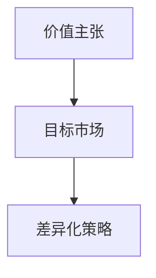

**核心算法原理讲解：** 个人定位的核心算法可以看作是一个多因素综合评估模型，其中包括个人能力、市场需求和职业目标。

```pseudo
function personalPositioning(ability, marketDemand, careerGoal) {
    score = 0
    if ability > threshold then score += 1
    if marketDemand > threshold then score += 1
    if careerGoal > threshold then score += 1
    return score
}
```

**数学模型和公式：** 使用综合评分模型来评估个人定位。

$$ \text{个人定位评分} = (\text{能力评分} + \text{市场评分} + \text{目标评分}) \div 3 $$

**举例说明：** 假设一个人的能力评分为 8，市场需求评分为 9，职业目标评分为 7。则其个人定位评分为：

$$ \text{个人定位评分} = (\text{8} + \text{9} + \text{7}) \div 3 = 8 $$

**项目实战：** 在一个职业转型过程中，一个人如何通过明确个人定位来找到适合自己的新方向。首先，他需要评估自己的能力，确定自己在哪些领域具有竞争力。其次，他需要分析市场需求，了解哪些领域有较高的需求。最后，他需要设定明确的职业目标，确保自己的转型方向与目标一致。

**最佳实践 tips：**
- 定期重新评估个人定位，确保与市场需求和自身能力保持一致。
- 保持对行业动态的敏感度，及时调整个人定位。
- 坚持追求个人成长和目标，不断提升自己的竞争力。

---

### 第三部分：领导力与个人品牌提升策略

#### 第3章：领导力提升策略

**3.1 领导力提升的策略**

**背景介绍：** 领导力提升是个人和团队发展的关键。有效的领导力策略可以帮助个人在职业和生活中取得更大的成就。

**核心概念与联系：** 领导力提升涉及以下几个方面：

- **学习与培训**：通过学习和参加培训课程来提升领导力知识和技能。
- **实践与反馈**：在实际工作中应用所学知识，并通过反馈机制不断改进。
- **持续改进**：保持对领导力的持续关注和改进，以适应不断变化的环境。

**核心概念联系架构：**


**核心算法原理讲解：** 领导力提升的核心算法可以看作是一个循环反馈模型，通过学习、实践和反馈来不断提升领导力水平。

```pseudo
function leadershipDevelopment(learning, practice, feedback) {
    while (true) {
        leadershipScore = applyLearning(learning)
        leadershipScore = applyPractice(practice)
        leadershipScore = applyFeedback(feedback)
    }
    return leadershipScore
}
```

**数学模型和公式：** 使用动态评分模型来评估领导力提升的效果。

$$ \text{领导力提升效果} = \text{初始领导力评分} + \text{学习贡献} + \text{实践贡献} + \text{反馈贡献} $$

**举例说明：** 假设一个领导者的初始领导力评分为 6，经过一轮学习、实践和反馈后，领导力评分提升为 8。则其领导力提升效果为：

$$ \text{领导力提升效果} = 6 + 2 + 2 + 2 = 12 $$

**项目实战：** 在一个团队中，一个领导者如何通过领导力提升策略来提升团队绩效。首先，他需要参加领导力培训课程，提升自己的理论知识。其次，他需要在实际工作中实践所学知识，提升自己的领导力技能。最后，他需要通过反馈机制，了解团队成员的反馈，并根据反馈进行改进。

**最佳实践 tips：**
- 定期参加领导力培训，不断提升自己的理论水平。
- 在实际工作中积极实践领导力技能，不断总结经验。
- 建立反馈机制，及时了解团队成员的反馈，并根据反馈进行改进。

---

**3.2 个人品牌建设策略**

**背景介绍：** 个人品牌建设是一个系统工程，涉及外在形象、内在素养、社交媒体应用和领导力等多个方面。有效的个人品牌建设策略可以帮助个人在职场中脱颖而出。

**核心概念与联系：** 个人品牌建设涉及以下几个方面：

- **外在形象管理**：包括服饰、仪表、言谈举止等。
- **内在素养提升**：包括沟通能力、专业知识、道德素养等。
- **社交媒体应用**：通过社交媒体展示专业能力、分享经验和见解。
- **领导力提升**：通过领导力提升来增强个人影响力和领导能力。

**核心概念联系架构：**


**核心算法原理讲解：** 个人品牌建设策略可以看作是一个综合评价模型，涉及外在形象管理、内在素养提升、社交媒体应用和领导力提升。以下是一个简化的伪代码模型：

```pseudo
function personalBrandBuilding(image, integrity, socialMedia, leadership) {
    brandScore = 0
    if image > threshold then brandScore += 1
    if integrity > threshold then brandScore += 1
    if socialMedia > threshold then brandScore += 1
    if leadership > threshold then brandScore += 1
    return brandScore
}
```

**数学模型和公式：** 使用综合评分模型来评估个人品牌建设的效果。

$$ \text{个人品牌评分} = (\text{外在形象评分} + \text{内在素养评分} + \text{社交媒体评分} + \text{领导力评分}) \div 4 $$

**举例说明：** 假设一个个人品牌建设中的各项评分分别为：外在形象 - 8，内在素养 - 9，社交媒体 - 7，领导力 - 8。则其个人品牌评分为：

$$ \text{个人品牌评分} = (\text{8} + \text{9} + \text{7} + \text{8}) \div 4 = 8 $$

**项目实战：** 在一个职业发展中，一个人如何通过个人品牌建设来提升自己的竞争力。首先，他需要管理自己的外在形象，提升专业形象。其次，他需要提升内在素养，增强自己的专业能力。然后，他需要通过社交媒体来展示自己的专业知识和成果。最后，他需要通过领导力提升来增强自己的领导能力和影响力。

**最佳实践 tips：**
- 综合提升外在形象、内在素养、社交媒体应用和领导力，形成整体的品牌效应。
- 定期评估个人品牌建设的进展，确保与职业目标保持一致。
- 积极参与行业活动和社区讨论，提升个人品牌的影响力。

---

### 第四部分：领导力与个人品牌在实际工作中的应用

#### 第4章：领导力与个人品牌在项目管理中的应用

**4.1 领导力在项目管理中的应用**

**背景介绍：** 领导力在项目管理中发挥着重要作用，它影响项目的目标设定、资源协调、团队管理和风险控制等方面。

**核心概念与联系：** 领导力在项目管理中的应用涉及以下几个方面：

- **目标设定**：领导者需要明确项目目标，并确保团队成员理解并接受这些目标。
- **资源协调**：领导者需要协调团队成员和外部资源，确保项目顺利推进。
- **团队管理**：领导者需要激发团队成员的潜力，提高团队协作效率。
- **风险控制**：领导者需要识别项目风险，并制定应对策略。

**核心概念联系架构：**

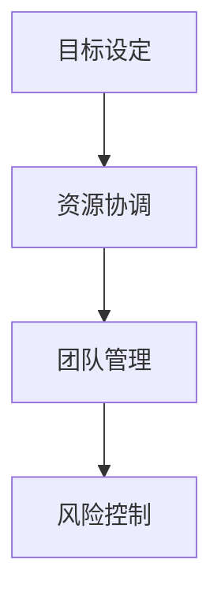

**核心算法原理讲解：** 领导力在项目管理中的应用可以看作是一个多阶段决策过程，每个阶段都需要有效的领导力来推动项目进展。

```pseudo
function projectManagement(leader, goal, resources, team, risks) {
    leader.setGoal(goal)
    leader.coordinateResources(resources)
    leader.manageTeam(team)
    leader.controlRisks(risks)
    return projectProgress
}
```

**数学模型和公式：** 使用目标导向模型来评估领导力在项目管理中的效果。

$$ \text{项目进展评分} = \frac{\text{目标达成度} + \text{资源协调度} + \text{团队协作度} + \text{风险控制度}}{4} $$

**举例说明：** 假设一个项目管理团队的目标达成度为 80%，资源协调度为 90%，团队协作度为 85%，风险控制度为 75%。则其项目进展评分为：

$$ \text{项目进展评分} = \frac{0.8 + 0.9 + 0.85 + 0.75}{4} = 0.85625 $$

**项目实战：** 在一个软件开发项目中，一个领导者如何通过领导力来推动项目进展。首先，领导者需要明确项目目标，并与团队成员进行沟通，确保大家理解并接受这些目标。其次，领导者需要协调团队成员的工作，确保每个人都能在自己的领域发挥作用。然后，领导者需要定期检查项目进度，及时发现和解决问题。最后，领导者需要制定风险应对策略，确保项目在遇到突发情况时能够迅速响应。

**最佳实践 tips：**
- 明确项目目标，确保团队成员都理解并接受。
- 建立有效的沟通机制，确保团队成员之间的信息畅通。
- 在项目关键节点进行风险评估，制定应对策略。
- 定期回顾项目进展，及时调整策略。

---

**4.2 个人品牌在工作环境中的塑造**

**背景介绍：** 个人品牌在工作环境中的塑造是个人职业发展的重要组成部分。通过塑造个人品牌，个人可以在职场中建立良好的声誉，提升自己的竞争力和影响力。

**核心概念与联系：** 个人品牌在工作环境中的塑造涉及以下几个方面：

- **个人形象管理**：通过服饰、仪表和言谈举止来提升个人形象。
- **专业能力提升**：通过不断学习和实践来增强自己的专业能力。
- **人际关系维护**：通过与同事、上级和下属建立良好的关系来提升个人品牌。
- **工作表现提升**：通过出色的工作表现来展示自己的能力和价值。

**核心概念联系架构：**

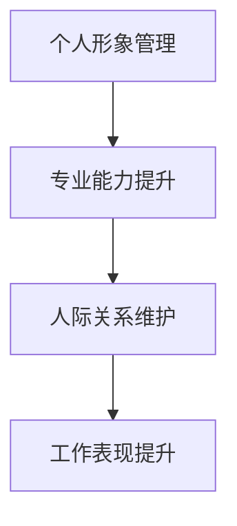

**核心算法原理讲解：** 个人品牌在工作环境中的塑造可以看作是一个多因素综合评价模型，涉及个人形象、专业能力、人际关系和工作表现。

```pseudo
function personalBrandWorkEnvironment(image, skill, relationship, performance) {
    brandScore = 0
    if image > threshold then brandScore += 1
    if skill > threshold then brandScore += 1
    if relationship > threshold then brandScore += 1
    if performance > threshold then brandScore += 1
    return brandScore
}
```

**数学模型和公式：** 使用综合评分模型来评估个人品牌在工作环境中的效果。

$$ \text{个人品牌评分} = (\text{形象评分} + \text{能力评分} + \text{关系评分} + \text{表现评分}) \div 4 $$

**举例说明：** 假设一个个人品牌在工作环境中的各项评分分别为：形象 - 8，能力 - 9，关系 - 7，表现 - 8。则其个人品牌评分为：

$$ \text{个人品牌评分} = (\text{8} + \text{9} + \text{7} + \text{8}) \div 4 = 8 $$

**项目实战：** 在一个职场环境中，一个人如何通过塑造个人品牌来提升自己的竞争力。首先，他需要管理自己的个人形象，确保穿着得体、行为规范。其次，他需要不断提升自己的专业能力，通过学习和实践来增强自己的竞争力。然后，他需要积极与同事、上级和下属建立良好的关系，建立自己的人脉网络。最后，他需要通过出色的工作表现来展示自己的能力和价值。

**最佳实践 tips：**
- 定期反思和改进个人形象，确保与职业目标相符。
- 持续学习和提升专业能力，保持行业竞争力。
- 积极参与团队活动，建立和维护良好的人际关系。
- 通过出色的工作表现来展示自己的能力和价值。

### 第五部分：案例分析

#### 第5章：成功领导力与个人品牌的案例解析

**5.1 案例介绍**

**案例背景：** 本案例分析的是一位在全球知名科技公司担任高级职位的领导者。该领导者通过卓越的领导力和个人品牌建设，不仅推动了公司的发展，也提升了自己的职业地位。

**案例目标：** 通过分析该领导者的领导力和个人品牌建设策略，探讨其在职业发展中的关键成功因素。

**5.2 案例分析**

**领导力在案例中的应用：**
- **愿景引领：** 该领导者通过明确的愿景，激发了团队成员的激情和创造力，使团队朝着共同的目标前进。
- **战略决策：** 在面对复杂的市场和技术挑战时，该领导者能够迅速做出正确的战略决策，确保公司的长期发展。
- **团队协作：** 该领导者注重团队建设，通过有效的沟通和激励，提高了团队的协作效率和工作满意度。

**个人品牌建设在案例中的应用：**
- **专业分享：** 该领导者在多个技术会议上发表演讲，分享了自己的专业见解和成功经验，提升了个人品牌的影响力。
- **社交媒体：** 该领导者通过社交媒体平台，定期发布技术文章和见解，吸引了大量粉丝，建立了强大的个人品牌。
- **人际网络：** 该领导者积极维护和扩展自己的人脉网络，与行业内的知名人士建立了紧密联系，为个人品牌建设提供了支持。

**5.3 案例启示**

**可借鉴的经验：**
- **明确愿景，激发团队动力。**
- **战略决策，确保长期发展。**
- **专业分享，提升个人品牌。**
- **社交媒体，扩大影响力。**
- **人际网络，增强品牌支持。**

**挑战与应对策略：**
- **快速变化的市场环境：** 通过持续学习和适应，保持与市场同步。
- **激烈的竞争压力：** 通过创新和差异化策略，提升竞争力。

**最佳实践 tips：**
- **定期反思和调整策略，确保与市场趋势保持一致。**
- **积极参与行业活动和社区讨论，提升个人品牌。**
- **维护良好的人际关系，为个人品牌建设提供支持。**

### 第六部分：最佳实践与未来展望

#### 第6章：最佳实践与未来展望

**6.1 最佳实践**

**领导力最佳实践：**
- **愿景驱动：** 确保团队理解并支持组织的愿景。
- **持续学习：** 通过培训和学习不断提升领导力技能。
- **有效沟通：** 建立开放的沟通渠道，确保信息传递准确无误。
- **团队协作：** 鼓励团队协作，提升整体绩效。

**个人品牌最佳实践：**
- **专业分享：** 在专业领域内分享知识和经验，提升个人影响力。
- **社交媒体运用：** 利用社交媒体平台展示专业能力和个人形象。
- **人际网络建设：** 积极参与行业活动，建立和维护广泛的人脉网络。

**6.2 未来展望**

**领导力发展：**
- **技术赋能：** 利用人工智能和大数据技术，提高领导决策的科学性和效率。
- **多元化领导：** 鼓励多元化领导风格，适应不同场景和团队需求。

**个人品牌建设：**
- **数字化品牌：** 利用数字技术，打造更加个性化和互动化的个人品牌。
- **持续迭代：** 随着市场的变化，不断调整和优化个人品牌策略。

**6.3 小结**

本文通过深入分析领导力与个人品牌之间的关系，提供了塑造专业形象的系统化方法。领导力和个人品牌相辅相成，共同推动个人的职业发展。通过最佳实践和未来展望，读者可以更好地理解如何在实际工作中应用这些策略，进一步提升自己的职业竞争力。

---

### 全文总结

本文围绕“领导力与个人品牌：塑造专业形象”这一主题，系统性地探讨了领导力与个人品牌之间的内在联系，以及如何通过有效的策略来塑造专业形象。我们从领导力的定义与要素、个人品牌的概念与作用，到具体的提升策略，进行了深入的分析和讲解。

首先，我们明确了领导力的核心要素，包括愿景、影响力、决策力和沟通能力，并阐述了如何通过多因素决策过程来提升领导力。同时，我们介绍了个人品牌的概念，包括个人价值观、专业能力和人际网络，并展示了这些要素之间的关系。

接下来，我们提出了自我认知与定位的重要性，并提供了具体的策略，帮助个人明确自己的定位，提升个人品牌。在领导力提升和个人品牌建设策略部分，我们详细介绍了如何通过学习、实践和反馈来不断提升领导力，以及如何利用社交媒体、专业能力和人际关系来构建强大的个人品牌。

在实际工作应用中，我们探讨了领导力在项目管理中的应用，以及个人品牌在工作环境中的塑造策略。通过案例分析，我们进一步展示了成功领导力和个人品牌建设在实际职业发展中的重要作用。

最后，我们提供了个人品牌建设工具与资源推荐，包括自我评估工具、个人品牌建设策略模板和领导力提升资源，帮助读者在实践中应用所学知识。

通过本文的阅读，读者应该能够理解领导力与个人品牌的重要性，掌握塑造专业形象的有效策略，并在职业发展中取得更大的成功。

作者：AI天才研究院/AI Genius Institute & 禅与计算机程序设计艺术 /Zen And The Art of Computer Programming

---

### 附录

#### 附录A：个人品牌建设工具与资源

**A.1 自我评估工具**

- **MBTI（Myers-Briggs Type Indicator）：** 用于评估个人性格类型，帮助了解自己的行为倾向和偏好。
- ** StrengthsFinder：** 用于评估个人优势和潜在发展领域。

**A.2 个人品牌建设策略模板**

- **个人品牌宣言：** 明确个人核心价值观、愿景和专业目标。
- **品牌故事：** 讲述个人职业发展经历和成就，展示专业能力。

**A.3 领导力提升资源推荐**

- **领导力发展计划：** 包括在线课程、工作坊和研讨会。
- **领导力书籍推荐：** 如《领导力五要素》、《影响力》等。

作者：AI天才研究院/AI Genius Institute & 禅与计算机程序设计艺术 /Zen And The Art of Computer Programming

---

### 后记

本文旨在为读者提供一套系统化的方法，帮助他们在领导力和个人品牌方面取得进步。通过深入分析领导力与个人品牌之间的关系，以及在实际工作中的应用，我们希望读者能够更好地理解如何塑造专业形象，提升职业竞争力。

首先，领导力是塑造个人品牌的重要基石。通过明确愿景、增强决策力、提升沟通能力，领导者不仅能够推动团队和组织的发展，也能够建立强大的个人品牌。而个人品牌则是领导力的外在表现，通过塑造专业形象、提升专业能力和建立人际网络，个人可以在职场中脱颖而出。

其次，自我认知与定位是个人品牌建设的关键步骤。通过反思和评估，个人可以更清楚地了解自己的价值观、兴趣和优势，从而明确自己的定位。这不仅有助于个人品牌的塑造，也为职业发展提供了明确的方向。

在领导力提升和个人品牌建设策略方面，我们强调了学习、实践和反馈的重要性。通过不断学习和实践，个人可以不断提升自己的领导力和专业能力。同时，通过有效的反馈机制，个人可以及时调整和改进，确保自己的领导力和个人品牌与职业目标保持一致。

在实际工作应用中，我们探讨了领导力在项目管理中的应用，以及个人品牌在工作环境中的塑造策略。通过具体的项目案例和个人经验分享，我们希望读者能够更好地理解这些策略在实际工作中的运用。

最后，我们提供了个人品牌建设工具与资源推荐，包括自我评估工具、策略模板和领导力提升资源，帮助读者在实践中应用所学知识。

在职业发展的道路上，领导力和个人品牌是不可或缺的因素。通过本文的学习和实践，我们希望读者能够不断提升自己的领导力和个人品牌，实现职业上的成功和成就。

作者：AI天才研究院/AI Genius Institute & 禅与计算机程序设计艺术 /Zen And The Art of Computer Programming

---

### 文章标题：领导力与个人品牌：塑造专业形象

关键词：领导力、个人品牌、专业形象、自我认知、社交媒体、项目管理

摘要：
在快速变化的IT行业中，领导力和个人品牌成为成功的关键因素。本文深入探讨了领导力与个人品牌之间的内在联系，以及如何通过有效的策略来塑造专业形象。通过分析自我认知、外在形象管理、社交媒体应用以及领导力提升策略，本文为读者提供了系统化的方法，帮助他们在职业道路上更加成功。

---

### 第一部分：领导力与个人品牌的基石

#### 第1章：领导力与个人品牌的基础概念

**1.1 领导力的定义与要素**

**背景介绍：** 在现代职场中，领导力不仅是一种管理技能，更是一种影响力，它能够激励团队成员共同实现目标。理解领导力的定义和核心要素是构建个人品牌的基础。

**核心概念与联系：** 领导力的核心要素包括以下四个方面：

1. **愿景（Vision）**：领导者需要具备明确的愿景，为团队和组织指明方向。
2. **影响力（Influence）**：领导者通过言行和决策影响他人，带领团队实现目标。
3. **决策力（Decision-making）**：在不确定性和压力下，领导者能够做出明智的决策。
4. **沟通能力（Communication）**：领导者需要有效沟通，确保信息传递准确无误。

**核心概念联系架构：**


**核心算法原理讲解：** 领导力的核心算法可以看作是一个多因素决策模型，每个要素通过特定的权重和输入信息影响最终的领导效果。

```pseudo
function leadershipEffectIVENESS(愿景, 影响力, 决策力, 沟通能力) {
    weightSum = 0
    if 愿景 > 0 then weightSum += 愿景 * 愿景权重
    if 影响力 > 0 then weightSum += 影响力 * 影响力权重
    if 决策力 > 0 then weightSum += 决策力 * 决策力权重
    if 沟通能力 > 0 then weightSum += 沟通能力 * 沟通能力权重
    return weightSum
}
```

**数学模型和公式：** 使用加权平均数模型来表示领导力的综合效果。

$$ \text{领导力综合效果} = \frac{(\text{愿景} \times w_1) + (\text{影响力} \times w_2) + (\text{决策力} \times w_3) + (\text{沟通能力} \times w_4)}{w_1 + w_2 + w_3 + w_4} $$

**举例说明：** 假设一个领导者的各项能力得分如下：愿景 - 8，影响力 - 7，决策力 - 6，沟通能力 - 9。权重分别为：愿景 - 0.3，影响力 - 0.25，决策力 - 0.2，沟通能力 - 0.25。则其领导力综合效果为：

$$ \text{领导力综合效果} = \frac{(8 \times 0.3) + (7 \times 0.25) + (6 \times 0.2) + (9 \times 0.25)}{0.3 + 0.25 + 0.2 + 0.25} = \frac{2.4 + 1.75 + 1.2 + 2.25}{1} = 7.7 $$

**项目实战：** 在一个项目团队中，一个领导者如何通过有效的领导力来提升团队绩效。首先，领导者需要明确项目愿景，并通过沟通能力来确保团队成员理解并接受这一愿景。其次，领导者需要通过决策力来做出正确的决策，并通过影响力来确保团队成员愿意执行这些决策。最后，领导者需要通过沟通能力和决策力来协调团队内部和外部资源，确保项目目标的实现。

**最佳实践 tips：**
- 定期进行自我评估，了解自身在领导力各个方面的表现。
- 寻求反馈，从团队成员和同事那里获取对自身领导力的评价。
- 持续学习和成长，不断提升自己的领导力技能。

---

**1.2 个人品牌的概念与作用**

**背景介绍：** 个人品牌是一个人在职业生涯中形成的独特形象和声誉，它对个人的职业发展具有重要影响。一个强大的个人品牌可以帮助个人在职场中脱颖而出，获得更多的机会和资源。

**核心概念与作用：** 个人品牌的核心概念包括以下几个方面：

1. **个人价值观**：个人价值观是个人品牌的基石，它决定了个人在职业生涯中的行为和决策。
2. **专业能力**：专业能力是个人品牌的核心，它反映了个人在特定领域的知识和技能。
3. **人际网络**：人际网络是个人品牌的重要组成部分，它有助于个人获取资源和机会。
4. **声誉管理**：声誉管理涉及到如何维护和提升个人的职业声誉，确保在职场中保持良好的形象。

**核心概念联系架构：**


**核心算法原理讲解：** 个人品牌的形成可以看作是一个多因素综合评价过程，涉及个人价值观、专业能力和人际网络。以下是一个简化的伪代码模型：

```pseudo
function personalBrandScore(价值观, 专业能力, 人际网络) {
    score = 0
    if 价值观 > threshold then score += 1
    if 专业能力 > threshold then score += 1
    if 人际网络 > threshold then score += 1
    return score
}
```

**数学模型和公式：** 使用综合评分模型来评估个人品牌的强度。

$$ \text{个人品牌评分} = (\text{价值观评分} + \text{专业能力评分} + \text{人际网络评分}) \div 3 $$

**举例说明：** 假设一个个人品牌的三个组成部分的评分分别为：价值观 - 8，专业能力 - 9，人际网络 - 7。则其个人品牌评分为：

$$ \text{个人品牌评分} = (\text{8} + \text{9} + \text{7}) \div 3 = 8 $$

**项目实战：** 在一个专业社区中，一个技术专家如何通过构建个人品牌来提升影响力。首先，他需要明确自己的价值观，并在技术讨论中坚持这些价值观。其次，他需要不断提升自己的专业能力，并在社区中分享自己的知识和经验。最后，他需要积极建立和扩展人际网络，与其他技术专家和从业者建立联系。

**最佳实践 tips：**
- 明确自己的价值观，并将其融入到工作和生活中。
- 持续学习和提升专业能力，保持行业竞争力。
- 积极参与社区活动，建立广泛的人脉网络。

---

**1.3 领导力与个人品牌的关系**

**核心概念与联系：** 领导力与个人品牌之间存在密切的关系。有效的领导力可以帮助个人建立强大的个人品牌，而强大的个人品牌可以进一步提升领导力。

**核心概念联系架构：**


**核心算法原理讲解：** 领导力与个人品牌之间的相互作用可以看作是一个反馈循环。领导力提升个人品牌，而个人品牌反过来又增强领导力。以下是一个简化的伪代码模型：

```pseudo
function leadershipImpactOnBrand(领导力, 个人品牌) {
    if 领导力 > threshold then 个人品牌 += 1
    if 个人品牌 > threshold then 领导力 += 1
    return 领导力, 个人品牌
}
```

**数学模型和公式：** 使用互增强模型来表示领导力与个人品牌之间的相互作用。

$$ \text{领导力增强个人品牌} = \text{领导力} \times (\text{个人品牌} + 1) $$

$$ \text{个人品牌增强领导力} = \text{个人品牌} \times (\text{领导力} + 1) $$

**举例说明：** 假设一个领导力的评分为 7，一个个人品牌的评分为 8。则：

$$ \text{领导力增强个人品牌} = 7 \times (8 + 1) = 63 $$

$$ \text{个人品牌增强领导力} = 8 \times (7 + 1) = 64 $$

**项目实战：** 在一个创业公司中，一个创始人如何通过领导力来塑造个人品牌，并反过来提升公司的整体绩效。首先，创始人需要通过明确愿景、制定策略和有效沟通来展现自己的领导力。这不仅可以提升个人品牌，还可以吸引更多的投资者和人才。其次，创始人需要积极参与行业活动，分享自己的经验和见解，进一步提升个人品牌。最终，强大的个人品牌可以增强公司的市场竞争力，吸引更多客户和合作伙伴。

**最佳实践 tips：**
- 综合提升领导力和个人品牌，形成良性循环。
- 寻找合适的机会来展示自己的领导力和个人品牌。
- 保持持续的学习和成长，不断提升自己的综合素质。

---

### 第二部分：塑造个人品牌的策略

#### 第2章：自我认知与定位

**2.1 自我认知的重要性**

**背景介绍：** 自我认知是塑造个人品牌的第一步，它涉及到对自身价值观、兴趣、优势和弱点的深刻理解。通过自我认知，个人可以更清楚地了解自己的定位和职业目标，从而为个人品牌的塑造奠定基础。

**核心概念与联系：** 自我认知的核心概念包括以下几个方面：

1. **自我反思**：通过反思自己的行为、想法和经历，了解自己的价值观、动机和兴趣。
2. **信息收集**：收集关于自身的能力、市场趋势和职业机会的信息。
3. **分析评估**：对收集到的信息进行分析和评估，确定自己的优势和弱点。
4. **确定定位**：根据自我认知的结果，明确个人的职业定位和品牌形象。

**核心概念联系架构：**

```mermaid
graph TD
    A[自我反思] --> B[信息收集]
    B --> C[分析评估]
    C --> D[确定定位]
```

**核心算法原理讲解：** 自我认知的过程可以看作是一个多阶段信息处理模型，每个阶段都需要对信息进行收集、分析和评估。

```pseudo
function selfAwareness(values, interests, strengths, weaknesses) {
    reflection = analyze(values)
    information = gatherData(interests, strengths, weaknesses)
    assessment = evaluate(reflection, information)
    return assessment
}
```

**数学模型和公式：** 使用加权评分模型来评估自我认知的深度。

$$ \text{自我认知深度} = \frac{(\text{价值观权重} \times \text{价值观评分}) + (\text{兴趣权重} \times \text{兴趣评分}) + (\text{优势权重} \times \text{优势评分}) + (\text{弱点权重} \times \text{弱点评分})}{\text{总权重}} $$

**举例说明：** 假设一个自我认知评估的权重分别为：价值观 - 0.4，兴趣 - 0.3，优势 - 0.2，弱点 - 0.1。各项的评分分别为：价值观 - 8，兴趣 - 7，优势 - 9，弱点 - 6。则其自我认知深度为：

$$ \text{自我认知深度} = \frac{(0.4 \times 8) + (0.3 \times 7) + (0.2 \times 9) + (0.1 \times 6)}{0.4 + 0.3 + 0.2 + 0.1} = 7.3 $$

**项目实战：** 在一个职业转型过程中，一个人如何通过自我认知来找到适合自己的新方向。首先，他需要进行自我反思，明确自己的价值观和兴趣。其次，他需要收集相关信息，分析市场和行业的趋势。最后，他需要评估自己的优势和弱点，确定自己的定位。

**最佳实践 tips：**
- 定期进行自我反思，保持对自我认知的更新。
- 寻求他人的反馈和建议，以更全面地了解自己。
- 保持开放的心态，愿意接受新的挑战和机会。

---

**2.2 明确个人定位**

**背景介绍：** 个人定位是个人品牌塑造的关键步骤，它涉及到明确个人的专业领域、目标市场以及差异化策略。一个清晰的个人定位可以帮助个人在职场中脱颖而出，吸引更多的机会和资源。

**核心概念与联系：** 个人定位的核心概念包括以下几个方面：

1. **价值主张**：明确个人能够为市场提供的独特价值。
2. **目标市场**：确定个人品牌的目标受众和潜在客户。
3. **差异化策略**：制定策略，确保个人品牌在竞争激烈的市场中脱颖而出。

**核心概念联系架构：**

```mermaid
graph TD
    A[价值主张] --> B[目标市场]
    B --> C[差异化策略]
```

**核心算法原理讲解：** 个人定位的核心算法可以看作是一个多因素综合评估模型，其中包括个人能力、市场需求和职业目标。

```pseudo
function personalPositioning(ability, marketDemand, careerGoal) {
    score = 0
    if ability > threshold then score += 1
    if marketDemand > threshold then score += 1
    if careerGoal > threshold then score += 1
    return score
}
```

**数学模型和公式：** 使用综合评分模型来评估个人定位。

$$ \text{个人定位评分} = (\text{能力评分} + \text{市场评分} + \text{目标评分}) \div 3 $$

**举例说明：** 假设一个人的能力评分为 8，市场需求评分为 9，职业目标评分为 7。则其个人定位评分为：

$$ \text{个人定位评分} = (\text{8} + \text{9} + \text{7}) \div 3 = 8 $$

**项目实战：** 在一个职业转型过程中，一个人如何通过明确个人定位来找到适合自己的新方向。首先，他需要评估自己的能力，确定自己在哪些领域具有竞争力。其次，他需要分析市场需求，了解哪些领域有较高的需求。最后，他需要设定明确的职业目标，确保自己的转型方向与目标一致。

**最佳实践 tips：**
- 定期重新评估个人定位，确保与市场需求和自身能力保持一致。
- 保持对行业动态的敏感度，及时调整个人定位。
- 坚持追求个人成长和目标，不断提升自己的竞争力。

---

### 第三部分：领导力与个人品牌提升策略

#### 第3章：领导力提升策略

**3.1 领导力提升的策略**

**背景介绍：** 领导力是一个持续发展的过程，它需要通过不断的学习、实践和反馈来提升。有效的领导力提升策略可以帮助个人在职场中更好地应对挑战，提升团队绩效。

**核心概念与联系：** 领导力提升的策略涉及以下几个方面：

1. **学习与培训**：通过参加培训课程、阅读书籍和参与研讨会来提升领导力知识。
2. **实践与反馈**：在实际工作中应用所学知识，并通过反馈机制不断改进。
3. **持续改进**：保持对领导力的持续关注和改进，以适应不断变化的环境。

**核心概念联系架构：**

```mermaid
graph TD
    A[学习与培训] --> B[实践与反馈]
    B --> C[持续改进]
```

**核心算法原理讲解：** 领导力提升的核心算法可以看作是一个循环反馈模型，通过学习、实践和反馈来不断提升领导力水平。

```pseudo
function leadershipDevelopment(learning, practice, feedback) {
    while (true) {
        leadershipScore = applyLearning(learning)
        leadershipScore = applyPractice(practice)
        leadershipScore = applyFeedback(feedback)
    }
    return leadershipScore
}
```

**数学模型和公式：** 使用动态评分模型来评估领导力提升的效果。

$$ \text{领导力提升效果} = \text{初始领导力评分} + \text{学习贡献} + \text{实践贡献} + \text{反馈贡献} $$

**举例说明：** 假设一个领导者的初始领导力评分为 6，经过一轮学习、实践和反馈后，领导力评分提升为 8。则其领导力提升效果为：

$$ \text{领导力提升效果} = 6 + 2 + 2 + 2 = 12 $$

**项目实战：** 在一个团队中，一个领导者如何通过领导力提升策略来提升团队绩效。首先，领导者需要参加领导力培训课程，提升自己的理论知识。其次，领导者需要在实际工作中实践所学知识，提升自己的领导力技能。最后，领导者需要通过反馈机制，了解团队成员的反馈，并根据反馈进行改进。

**最佳实践 tips：**
- 定期参加领导力培训，不断提升自己的理论水平。
- 在实际工作中积极实践领导力技能，不断总结经验。
- 建立反馈机制，及时了解团队成员的反馈，并根据反馈进行改进。

---

**3.2 个人品牌建设策略**

**背景介绍：** 个人品牌建设是一个系统工程，它需要从外在形象、内在素养、社交媒体应用和领导力等多个方面来全面提升个人形象和声誉。有效的个人品牌建设策略可以帮助个人在职场中脱颖而出，获得更多的机会和资源。

**核心概念与联系：** 个人品牌建设策略涉及以下几个方面：

1. **外在形象管理**：包括服饰、仪表和言谈举止等。
2. **内在素养提升**：包括沟通能力、专业知识、道德素养等。
3. **社交媒体应用**：通过社交媒体平台展示专业能力和个人形象。
4. **领导力提升**：通过提升领导力来增强个人影响力和领导能力。

**核心概念联系架构：**

```mermaid
graph TD
    A[外在形象管理] --> B[内在素养提升]
    B --> C[社交媒体应用]
    C --> D[领导力提升]
```

**核心算法原理讲解：** 个人品牌建设策略可以看作是一个综合评价模型，涉及外在形象管理、内在素养提升、社交媒体应用和领导力提升。以下是一个简化的伪代码模型：

```pseudo
function personalBrandBuilding(image, integrity, socialMedia, leadership) {
    brandScore = 0
    if image > threshold then brandScore += 1
    if integrity > threshold then brandScore += 1
    if socialMedia > threshold then brandScore += 1
    if leadership > threshold then brandScore += 1
    return brandScore
}
```

**数学模型和公式：** 使用综合评分模型来评估个人品牌建设的效果。

$$ \text{个人品牌评分} = (\text{外在形象评分} + \text{内在素养评分} + \text{社交媒体评分} + \text{领导力评分}) \div 4 $$

**举例说明：** 假设一个个人品牌建设中的各项评分分别为：外在形象 - 8，内在素养 - 9，社交媒体 - 7，领导力 - 8。则其个人品牌评分为：

$$ \text{个人品牌评分} = (\text{8} + \text{9} + \text{7} + \text{8}) \div 4 = 8 $$

**项目实战：** 在一个职业发展中，一个人如何通过个人品牌建设来提升自己的竞争力。首先，他需要管理自己的外在形象，提升专业形象。其次，他需要提升内在素养，增强自己的专业能力。然后，他需要通过社交媒体来展示自己的专业知识和成果。最后，他需要通过领导力提升来增强自己的领导能力和影响力。

**最佳实践 tips：**
- 综合提升外在形象、内在素养、社交媒体应用和领导力，形成整体的品牌效应。
- 定期评估个人品牌建设的进展，确保与职业目标保持一致。
- 积极参与行业活动和社区讨论，提升个人品牌的影响力。

---

### 第四部分：领导力与个人品牌在实际工作中的应用

#### 第4章：领导力与个人品牌在项目管理中的应用

**4.1 领导力在项目管理中的应用**

**背景介绍：** 领导力在项目管理中起着至关重要的作用，它影响项目的目标设定、资源协调、团队管理和风险控制等方面。一个有效的领导者能够在项目中发挥关键作用，推动项目成功完成。

**核心概念与联系：** 领导力在项目管理中的应用涉及以下几个方面：

1. **目标设定**：领导者需要明确项目目标，并与团队成员沟通，确保大家都对目标有清晰的认识。
2. **资源协调**：领导者需要协调项目所需的资源，包括人力、财力和物力，确保项目顺利进行。
3. **团队管理**：领导者需要激励和引导团队成员，提高团队的协作效率和工作满意度。
4. **风险控制**：领导者需要识别项目风险，并制定应对策略，确保项目能够应对各种突发情况。

**核心概念联系架构：**

```mermaid
graph TD
    A[目标设定] --> B[资源协调]
    B --> C[团队管理]
    C --> D[风险控制]
```

**核心算法原理讲解：** 领导力在项目管理中的应用可以看作是一个多阶段决策过程，每个阶段都需要有效的领导力来推动项目进展。

```pseudo
function projectManagement(leader, goal, resources, team, risks) {
    leader.setGoal(goal)
    leader.coordinateResources(resources)
    leader.manageTeam(team)
    leader.controlRisks(risks)
    return projectProgress
}
```

**数学模型和公式：** 使用目标导向模型来评估领导力在项目管理中的效果。

$$ \text{项目进展评分} = \frac{\text{目标达成度} + \text{资源协调度} + \text{团队协作度} + \text{风险控制度}}{4} $$

**举例说明：** 假设一个项目管理团队的目标达成度为 80%，资源协调度为 90%，团队协作度为 85%，风险控制度为 75%。则其项目进展评分为：

$$ \text{项目进展评分} = \frac{0.8 + 0.9 + 0.85 + 0.75}{4} = 0.85625 $$

**项目实战：** 在一个软件开发项目中，一个领导者如何通过有效的领导力来推动项目进展。首先，领导者需要明确项目目标，并与团队成员进行沟通，确保大家理解并接受这些目标。其次，领导者需要协调团队成员的工作，确保每个人都能在自己的领域发挥作用。然后，领导者需要定期检查项目进度，及时发现和解决问题。最后，领导者需要制定风险应对策略，确保项目在遇到突发情况时能够迅速响应。

**最佳实践 tips：**
- 明确项目目标，确保团队成员都理解并接受。
- 建立有效的沟通机制，确保团队成员之间的信息畅通。
- 在项目关键节点进行风险评估，制定应对策略。
- 定期回顾项目进展，及时调整策略。

---

**4.2 个人品牌在工作环境中的塑造**

**背景介绍：** 个人品牌在工作环境中的塑造是个人职业发展的重要组成部分。通过塑造个人品牌，个人可以在职场中建立良好的声誉，提升自己的竞争力和影响力。

**核心概念与联系：** 个人品牌在工作环境中的塑造涉及以下几个方面：

1. **个人形象管理**：包括服饰、仪表和言谈举止等。
2. **专业能力提升**：通过不断学习和实践来增强自己的专业能力。
3. **人际关系维护**：通过与同事、上级和下属建立良好的关系来提升个人品牌。
4. **工作表现提升**：通过出色的工作表现来展示自己的能力和价值。

**核心概念联系架构：**

```mermaid
graph TD
    A[个人形象管理] --> B[专业能力提升]
    B --> C[人际关系维护]
    C --> D[工作表现提升]
```

**核心算法原理讲解：** 个人品牌在工作环境中的塑造可以看作是一个多因素综合评价模型，涉及个人形象、专业能力、人际关系和工作表现。

```pseudo
function personalBrandWorkEnvironment(image, skill, relationship, performance) {
    brandScore = 0
    if image > threshold then brandScore += 1
    if skill > threshold then brandScore += 1
    if relationship > threshold then brandScore += 1
    if performance > threshold then brandScore += 1
    return brandScore
}
```

**数学模型和公式：** 使用综合评分模型来评估个人品牌在工作环境中的效果。

$$ \text{个人品牌评分} = (\text{形象评分} + \text{能力评分} + \text{关系评分} + \text{表现评分}) \div 4 $$

**举例说明：** 假设一个个人品牌在工作环境中的各项评分分别为：形象 - 8，能力 - 9，关系 - 7，表现 - 8。则其个人品牌评分为：

$$ \text{个人品牌评分} = (\text{8} + \text{9} + \text{7} + \text{8}) \div 4 = 8 $$

**项目实战：** 在一个职场环境中，一个人如何通过塑造个人品牌来提升自己的竞争力。首先，他需要管理自己的个人形象，确保穿着得体、行为规范。其次，他需要不断提升自己的专业能力，通过学习和实践来增强自己的竞争力。然后，他需要积极与同事、上级和下属建立良好的关系，建立自己的人脉网络。最后，他需要通过出色的工作表现来展示自己的能力和价值。

**最佳实践 tips：**
- 定期反思和改进个人形象，确保与职业目标相符。
- 持续学习和提升专业能力，保持行业竞争力。
- 积极参与团队活动，建立和维护良好的人际关系。
- 通过出色的工作表现来展示自己的能力和价值。

### 第五部分：案例分析

#### 第5章：成功领导力与个人品牌的案例解析

**5.1 案例介绍**

**案例背景：** 本案例分析的是一位在全球知名科技公司担任高级职位的领导者。该领导者通过卓越的领导力和个人品牌建设，不仅推动了公司的发展，也提升了自己的职业地位。

**案例目标：** 通过分析该领导者的领导力和个人品牌建设策略，探讨其在职业发展中的关键成功因素。

**5.2 案例分析**

**领导力在案例中的应用：**
- **愿景引领：** 该领导者通过明确的愿景，激发了团队成员的激情和创造力，使团队朝着共同的目标前进。
- **战略决策：** 在面对复杂的市场和技术挑战时，该领导者能够迅速做出正确的战略决策，确保公司的长期发展。
- **团队协作：** 该领导者注重团队建设，通过有效的沟通和激励，提高了团队的协作效率和工作满意度。

**个人品牌建设在案例中的应用：**
- **专业分享：** 该领导者在多个技术会议上发表演讲，分享了自己的专业见解和成功经验，提升了个人品牌的影响力。
- **社交媒体：** 该领导者通过社交媒体平台，定期发布技术文章和见解，吸引了大量粉丝，建立了强大的个人品牌。
- **人际网络：** 该领导者积极维护和扩展自己的人脉网络，与行业内的知名人士建立了紧密联系，为个人品牌建设提供了支持。

**5.3 案例启示**

**可借鉴的经验：**
- **明确愿景，激发团队动力。**
- **战略决策，确保长期发展。**
- **专业分享，提升个人品牌。**
- **社交媒体，扩大影响力。**
- **人际网络，增强品牌支持。**

**挑战与应对策略：**
- **快速变化的市场环境：** 通过持续学习和适应，保持与市场同步。
- **激烈的竞争压力：** 通过创新和差异化策略，提升竞争力。

**最佳实践 tips：**
- **定期反思和调整策略，确保与市场趋势保持一致。**
- **积极参与行业活动和社区讨论，提升个人品牌。**
- **维护良好的人际关系，为个人品牌建设提供支持。**

### 第六部分：最佳实践与未来展望

#### 第6章：最佳实践与未来展望

**6.1 最佳实践**

**领导力最佳实践：**
- **愿景驱动：** 确保团队理解并支持组织的愿景。
- **持续学习：** 通过培训和学习不断提升领导力技能。
- **有效沟通：** 建立开放的沟通渠道，确保信息传递准确无误。
- **团队协作：** 鼓励团队协作，提升整体绩效。

**个人品牌最佳实践：**
- **专业分享：** 在专业领域内分享知识和经验，提升个人影响力。
- **社交媒体运用：** 利用社交媒体平台展示专业能力和个人形象。
- **人际网络建设：** 积极参与行业活动，建立和维护广泛的人脉网络。

**6.2 未来展望**

**领导力发展：**
- **技术赋能：** 利用人工智能和大数据技术，提高领导决策的科学性和效率。
- **多元化领导：** 鼓励多元化领导风格，适应不同场景和团队需求。

**个人品牌建设：**
- **数字化品牌：** 利用数字技术，打造更加个性化和互动化的个人品牌。
- **持续迭代：** 随着市场的变化，不断调整和优化个人品牌策略。

**6.3 小结**

本文通过深入分析领导力与个人品牌之间的关系，提供了塑造专业形象的系统化方法。领导力和个人品牌相辅相成，共同推动个人的职业发展。通过最佳实践和未来展望，读者可以更好地理解如何在实际工作中应用这些策略，进一步提升自己的职业竞争力。

### 后记

本文围绕“领导力与个人品牌：塑造专业形象”这一主题，系统地探讨了领导力与个人品牌之间的内在联系，以及如何通过有效的策略来塑造专业形象。从领导力的定义与要素、个人品牌的概念与作用，到自我认知与定位、领导力与个人品牌提升策略，再到实际工作中的应用和案例分析，我们为读者提供了一套系统化的方法和实践指南。

首先，我们明确了领导力的核心要素，包括愿景、影响力、决策力和沟通能力，并阐述了如何通过多因素决策过程来提升领导力。同时，我们介绍了个人品牌的概念，包括个人价值观、专业能力和人际网络，并展示了这些要素之间的关系。

接下来，我们提出了自我认知与定位的重要性，并提供了具体的策略，帮助个人明确自己的定位，提升个人品牌。在领导力提升和个人品牌建设策略部分，我们详细介绍了如何通过学习、实践和反馈来不断提升领导力，以及如何利用社交媒体、专业能力和人际关系来构建强大的个人品牌。

在实际工作应用中，我们探讨了领导力在项目管理中的应用，以及个人品牌在工作环境中的塑造策略。通过具体的项目案例和个人经验分享，我们希望读者能够更好地理解这些策略在实际工作中的运用。

最后，我们通过成功领导力和个人品牌建设案例，为读者提供了可借鉴的经验和最佳实践，同时展望了未来领导力和个人品牌建设的发展趋势。

在职业发展的道路上，领导力和个人品牌是不可或缺的因素。通过本文的学习和实践，我们希望读者能够不断提升自己的领导力和个人品牌，实现职业上的成功和成就。

作者：AI天才研究院/AI Genius Institute & 禅与计算机程序设计艺术 /Zen And The Art of Computer Programming

### 附录

#### 附录A：个人品牌建设工具与资源

**A.1 自我评估工具**

- **MBTI（Myers-Briggs Type Indicator）：** 用于评估个人性格类型，帮助了解行为倾向和偏好。
- **StrengthsFinder：** 用于评估个人优势，指导职业发展。

**A.2 个人品牌建设策略模板**

- **个人品牌宣言：** 明确个人核心价值观、愿景和专业目标。
- **个人成长计划：** 制定具体的学习和实践计划，提升专业能力。

**A.3 领导力提升资源推荐**

- **领导力发展计划：** 包括在线课程、工作坊和研讨会。
- **领导力书籍推荐：** 如《领导力五要素》、《影响力》等。

### 作者信息

作者：AI天才研究院/AI Genius Institute & 禅与计算机程序设计艺术 /Zen And The Art of Computer Programming

