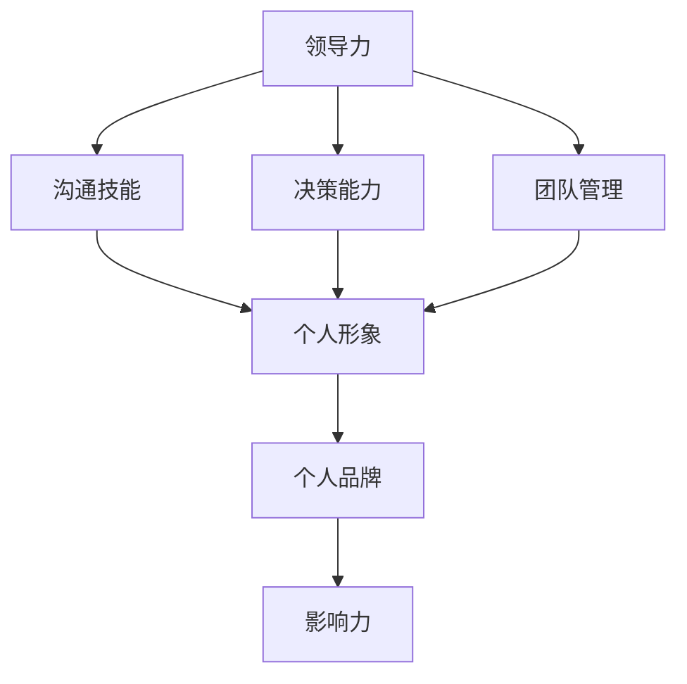
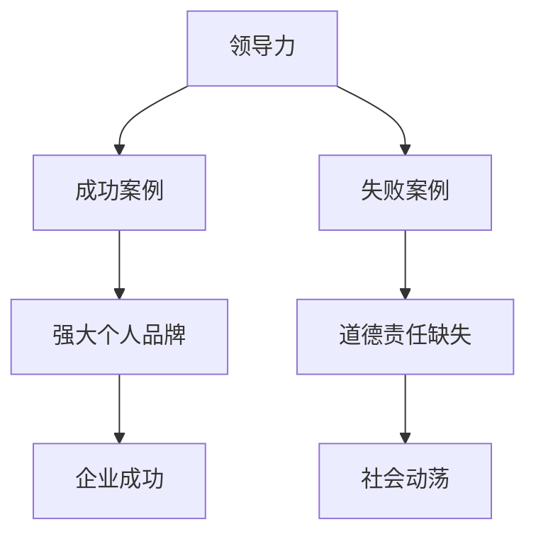

                 

### 文章标题

《领导力与个人品牌：塑造个人影响力》

关键词：领导力、个人品牌、影响力、塑造、成长

摘要：本文将探讨领导力与个人品牌之间的关系，分析如何通过塑造个人品牌来提升个人影响力。我们将从理论基础、具体方法、成功案例等方面逐步深入，帮助读者理解并掌握这一重要技能。

----------------------------------------------------------------

### 引言

在当今快速变化的世界中，领导力和个人品牌已经成为决定个人和团队成败的关键因素。领导力不仅仅是指管理团队的能力，更是指影响和激励他人共同实现目标的能力。而个人品牌则是个人价值的体现，是个人在职场和社会中的独特标识。

本篇文章旨在深入探讨领导力与个人品牌之间的内在联系，并介绍如何通过塑造个人品牌来提升个人影响力。我们将从以下几个部分展开讨论：

1. **核心概念与联系**：明确领导力与个人品牌的定义，并分析两者之间的关系。
2. **理论基础**：介绍领导力理论和个人品牌建设理论，帮助读者理解其背后的原理。
3. **个人品牌塑造**：详细探讨如何塑造个人品牌，包括形象塑造、内容创作和社交媒体运用等。
4. **领导力提升**：提供提升领导力的方法，如沟通技巧、团队建设和冲突管理等。
5. **案例分析**：通过成功和失败的案例分析，展示领导力与个人品牌实践的效果。
6. **实战指南**：提供具体的行动步骤和策略，帮助读者实际应用。
7. **结论**：总结文章的核心内容，并提供未来发展的思考。

接下来，我们将逐一探讨这些部分，帮助读者深入理解领导力与个人品牌的重要性，并掌握提升个人影响力的方法。

### 核心概念与联系

首先，我们需要明确领导力与个人品牌的定义，并分析两者之间的内在联系。

#### 领导力的定义

领导力是一种影响和激励他人共同实现目标的能力。它可以表现为一系列行为和技能，如沟通、激励、决策、团队合作等。领导力不仅仅是管理团队，更是引导和影响他人，使其自愿为实现共同目标而努力。

根据领导力理论，领导力可以分为以下几种类型：

1. **变革型领导力**：通过激发和鼓励团队成员的内在动力，推动变革和创新。
2. **交易型领导力**：通过奖励和惩罚来激励团队成员，实现短期目标。
3. **魅力型领导力**：通过个人魅力和愿景，吸引和激励团队成员。
4. **情境型领导力**：根据不同的情境和团队成员的特点，灵活运用不同的领导风格。

#### 个人品牌的定义

个人品牌是个人在职场和社会中的独特标识，是个人价值、能力和信誉的体现。它包括个人形象、声誉、技能和价值观等多个方面。

个人品牌的作用主要体现在以下几个方面：

1. **提升个人价值**：通过建立强大的个人品牌，个人可以获得更高的薪资、更好的职业机会和更广泛的社会认可。
2. **增强影响力**：强大的个人品牌可以增强个人在团队和组织中的影响力，使其能够更好地推动变革和实现目标。
3. **塑造企业形象**：个人品牌的成功可以带动整个团队和组织的发展，提升企业的声誉和市场竞争力。

#### 领导力与个人品牌的关系

领导力与个人品牌之间存在紧密的联系。一方面，领导力是塑造个人品牌的重要基础。一个优秀的领导者往往具备出色的沟通、决策和团队管理能力，这些能力有助于其建立强大的个人品牌。另一方面，个人品牌是领导力的重要体现。一个成功的个人品牌可以增强领导者的魅力和影响力，使其在团队和组织中发挥更大的作用。

我们可以用以下Mermaid流程图来展示领导力与个人品牌之间的关系：

通过这个流程图，我们可以看出领导力通过提升个人形象和技能，最终形成个人品牌，进而增强个人影响力。接下来，我们将进一步探讨领导力理论和个人品牌建设理论，帮助读者深入理解这一过程。

#### 领导力理论的发展历程

领导力理论的发展经历了多个阶段，每个阶段都有其独特的观点和贡献。以下是几个重要的领导力理论及其发展阶段：

1. **特质理论（Trait Theory）**
   特质理论是早期领导力理论之一，认为领导者具备特定的个性特质和能力，如自信、决心、智慧等。这个理论的观点是，领导者之所以成功，是因为他们具备这些特质。然而，随着研究的深入，人们发现并不是所有的成功领导者都具备相同的特质，因此特质理论受到了一定的质疑。

2. **行为理论（Behavioral Theory）**
   行为理论强调领导行为的重要性，认为领导者的成功取决于其具体行为，如激励、沟通、决策等。这个理论试图通过观察和分析领导行为，找出有效的领导行为模式。行为理论为领导力研究提供了新的视角，但也存在一些局限性，因为行为模式并不能完全解释领导力的本质。

3. **情境理论（Contingency Theory）**
   情境理论认为领导力是情境依赖的，不同的情境需要不同的领导风格。这个理论提出了几种领导风格，如情境领导理论（Hersey and Blanchard的情境领导模型）和路径-目标理论（Path-Goal Theory）。情境理论为领导力研究提供了更灵活的观点，但同时也增加了复杂性，因为需要考虑多种情境因素。

4. **权变理论（Contingency Theory）**
   权变理论进一步发展了情境理论，强调领导风格和情境之间的相互作用。这个理论认为，没有一种通用的领导风格是适用于所有情况的，领导者需要根据具体情境灵活调整领导风格。权变理论为领导力研究提供了更全面的框架，但也增加了实际操作的复杂性。

5. **变革型领导力理论（Transformational Leadership Theory）**
   变革型领导力理论强调领导者的变革能力，认为领导者通过激发和激励团队成员的内在动力，推动组织实现变革。这个理论提出了几个核心要素，如愿景、激励、个人发展等。变革型领导力理论为领导力研究提供了新的方向，强调了领导者的长期影响力。

6. **服务型领导力理论（Servant Leadership Theory）**
   服务型领导力理论认为领导者的首要任务是服务团队成员，通过关注团队成员的需求和成长，实现组织的目标。这个理论强调领导者的谦逊和团队意识，认为领导者应该以服务为导向，而不是以权力为导向。

通过这些领导力理论的发展历程，我们可以看到领导力研究的不断演进。从早期的特质理论，到行为理论，再到情境理论和变革型领导力理论，领导力研究逐渐从单一维度转向多维度、情境依赖的视角。这些理论为我们理解领导力提供了丰富的视角和工具，同时也提醒我们，领导力是一个复杂而动态的过程，需要根据具体情境灵活运用。

#### 个人品牌建设理论

个人品牌建设是一个系统的过程，它涉及多个方面，如个人形象、声誉、技能和价值观。以下是一些核心理论，帮助我们理解个人品牌建设的过程。

1. **个人形象塑造**
   个人形象是个人品牌的基础，它包括外表、言行举止、穿着打扮等。一个良好的个人形象可以增加个人在职场和社会中的可信度和吸引力。个人形象塑造的关键在于真实和一致性。个人应该真实地展现自己的个性和价值观，同时保持一致的行为和风格。

2. **声誉管理**
   声誉是个人品牌的重要部分，它是通过他人的评价和反馈形成的。一个良好的声誉可以增加个人在职场和社会中的认可度和影响力。声誉管理的关键是诚信和责任。个人应该始终保持诚信，对自己的言行负责，同时积极回应他人的反馈和建议。

3. **技能展示**
   技能是个人品牌的核心，它是个人在职场中的竞争优势。个人应该不断提升自己的专业技能和软技能，如沟通、团队合作和解决问题的能力。技能展示的关键是专业性和持续学习。个人应该通过实际工作和学习不断提升自己的技能水平，同时积极展示自己的专业能力。

4. **价值观表达**
   价值观是个人品牌的灵魂，它是个人行为和决策的准则。一个明确的价值观可以帮助个人在职场和社会中建立独特的品牌形象。价值观表达的关键是真诚和一致性。个人应该真诚地表达自己的价值观，并在日常行为和决策中一致地体现。

通过这些个人品牌建设理论，我们可以看到，个人品牌建设是一个多维度、长期的过程。它需要个人在多个方面进行努力，如形象塑造、声誉管理、技能展示和价值观表达。这些理论为我们提供了指导，帮助我们理解个人品牌建设的重要性和方法。

### 个人品牌塑造

塑造个人品牌是一个系统而复杂的过程，它需要综合考虑个人形象、内容创作、社交媒体运用等多个方面。以下是一些建议和策略，帮助您成功塑造个人品牌。

#### 个人形象塑造

1. **自我认知与定位**：首先，您需要深入理解自己的优势和劣势，明确自己的职业目标和价值观。这有助于您在塑造个人品牌时保持一致性。

2. **外在形象打造**：外在形象是个人品牌的第一印象。您可以通过穿着打扮、言谈举止、面部表情等方面展现自己的专业形象。建议选择适合自己风格和职业的服饰，保持整洁干净的外表。

3. **内在素质提升**：除了外在形象，内在素质同样重要。您可以通过不断学习、阅读和参加培训课程来提升自己的知识水平和专业技能。此外，培养良好的沟通能力和团队合作精神也是塑造个人品牌的关键。

#### 内容创作与传播

1. **内容创作原则**：内容创作是个人品牌的核心。您应该选择与自己专业领域和职业目标相关的内容进行创作。内容应具有实用性、专业性和独特性，能够吸引目标受众。

2. **内容传播策略**：创作出优质内容后，如何传播同样重要。您可以通过多种渠道传播内容，如博客、社交媒体、在线课程等。同时，制定合理的传播策略，如定期发布内容、与其他专业人士合作等，可以增加内容的曝光率和影响力。

3. **营销案例分析**：研究成功个人品牌的内容创作和传播策略，可以为您提供宝贵的经验和启示。例如，李笑来老师的个人品牌建设，他通过定期发布高质量的学习心得和理财知识，吸引了大量粉丝。

#### 社交媒体运用

1. **社交媒体选择**：根据您的目标受众和职业领域，选择适合的社交媒体平台。例如，如果您是技术专家，可以主要运用LinkedIn、Twitter等平台；如果您是市场营销专家，可以运用Facebook、Instagram等平台。

2. **社交媒体运营技巧**：在社交媒体上，您应该保持活跃，定期发布内容并与受众互动。同时，注意内容的多样性和质量，避免过度营销和广告。此外，参与行业讨论、分享他人内容、建立专业网络等也是社交媒体运营的关键。

3. **社交媒体案例分析**：研究成功个人品牌的社交媒体运营策略，可以为您提供实用的经验和技巧。例如，李开复博士在LinkedIn上的活跃度和高质量内容，使他吸引了大量专业人士关注。

#### 实际案例

以李开复博士为例，他在个人品牌塑造方面取得了显著成就。以下是一些关键步骤：

1. **明确定位**：李开复博士在人工智能领域拥有深厚的专业知识，他明确了自己的职业定位和目标受众。

2. **内容创作**：他定期发布关于人工智能的深度分析和观点，内容具有高度的专业性和实用性。

3. **社交媒体运营**：李开复博士在LinkedIn上非常活跃，他通过高质量的内容和积极的互动，吸引了大量专业人士的关注。

4. **个人形象塑造**：他通过着装得体、言谈举止优雅，展现了专业而亲和的形象。

通过以上步骤，李开复博士成功塑造了自己的个人品牌，成为人工智能领域的知名专家和意见领袖。这些步骤和策略可以为其他专业人士提供宝贵的借鉴。

### 领导力提升

领导力是塑造个人品牌的重要基础，它决定了一个人的影响力、团队凝聚力和执行力。以下是一些建议，帮助您提升领导力，从而增强个人品牌。

#### 沟通技巧

良好的沟通技巧是领导者必备的能力。以下是一些提升沟通技巧的方法：

1. **倾听**：倾听是沟通的第一步，领导者应该学会倾听团队成员的观点和需求。这有助于建立信任和增强团队凝聚力。

2. **清晰表达**：领导者应该具备清晰、简洁的表达能力，确保团队成员理解任务要求和目标。

3. **有效反馈**：给予团队成员及时的反馈，表扬他们的成就，同时也指出需要改进的地方。这有助于团队成员的成长和团队目标的实现。

#### 团队建设

团队建设是提升领导力的关键环节。以下是一些团队建设的方法：

1. **明确目标**：确保团队成员明确团队的目标和任务，这有助于团队凝聚力的形成。

2. **分工合作**：根据团队成员的能力和特长进行分工，确保每个成员都能在团队中发挥自己的优势。

3. **培养团队文化**：建立积极、和谐的团队文化，鼓励团队成员之间的合作和支持。

#### 冲突管理

冲突是团队中不可避免的现象，有效的冲突管理可以增强团队的稳定性和执行力。以下是一些冲突管理的方法：

1. **预防冲突**：通过明确的沟通和规范，预防潜在的冲突。

2. **化解冲突**：当冲突发生时，领导者应该冷静处理，通过沟通和协商找到解决方案。

3. **建设性冲突**：鼓励团队成员提出不同的观点和建议，这有助于团队的创新和进步。

#### 领导风格与变革管理

领导风格和变革管理是提升领导力的两个重要方面。以下是一些建议：

1. **变革型领导力**：通过激发和激励团队成员的内在动力，推动变革和创新。

2. **变革管理**：制定清晰的变革计划，与团队成员充分沟通，确保变革的顺利实施。

3. **灵活适应**：领导者应该具备灵活适应环境变化的能力，及时调整领导风格和策略。

#### 实际案例

以马云为例，他是中国知名的企业家和领导者，他在阿里巴巴集团的领导过程中展现了卓越的领导力。

1. **沟通技巧**：马云擅长通过演讲和沟通激发员工的激情和创造力。

2. **团队建设**：他倡导“小而美”的团队文化，鼓励团队成员发挥自己的优势，实现共同的目标。

3. **冲突管理**：马云善于通过沟通和协商化解团队内部的冲突，确保团队的稳定和执行力。

4. **变革管理**：在阿里巴巴的发展过程中，马云不断推动变革，带领团队开拓新的业务和市场。

通过以上领导力提升的方法和实际案例，我们可以看到，领导力是一个持续成长和发展的过程。通过不断学习和实践，我们可以提升自己的领导力，从而增强个人品牌的影响力。

### 案例分析

在本章节中，我们将通过成功和失败的案例分析，深入探讨领导力与个人品牌在实际应用中的效果。通过这些案例，我们可以看到领导力与个人品牌如何在不同情境下发挥作用，为读者提供宝贵的经验和启示。

#### 成功案例

1. **杰克·韦尔奇（Jack Welch）**：作为通用电气的前CEO，杰克·韦尔奇是一位卓越的领导者，他在个人品牌塑造和领导力提升方面取得了显著成就。韦尔奇通过明确的愿景、坚定的决策和有效的沟通，成功地推动了通用电气的转型和增长。他的领导风格被称为“韦尔奇式领导”，在全球范围内产生了深远的影响。他的成功经验告诉我们，强大的个人品牌和卓越的领导力可以引领企业实现巨大的变革和成长。

2. **雷军（Lei Jun）**：作为小米科技创始人，雷军以其独特的个人品牌和领导力在科技界树立了标杆。他通过强调用户价值和产品创新，成功地推动了小米的快速发展。雷军善于在社交媒体上与用户互动，建立了强大的粉丝基础，他的个人品牌也成为小米品牌的一部分。他的成功经验表明，个人品牌不仅能够提升个人影响力，还可以带动企业品牌的成长。

3. **谢尔比·罗森（Sheryl Sandberg）**：作为Facebook的首席运营官，谢尔比·罗森以其出色的领导力和个人品牌在全球范围内获得了广泛认可。她不仅在全球范围内推广了Facebook的平台，还推动了公司内部的性别平等和文化多样性。罗森通过公开演讲和出版书籍，分享了她的领导经验和人生哲学，她的个人品牌成为女性领导者的典范。她的成功经验告诉我们，领导力和个人品牌可以帮助个人在职场中脱颖而出，推动组织的变革和进步。

#### 失败案例

1. **汉克·格林伯格（ Hank Greenberg）**：作为美国国际集团（AIG）的前CEO，汉克·格林伯格的领导力和个人品牌曾经备受赞誉。然而，他在2008年金融危机期间，由于对风险管理不足和内部控制的缺失，导致AIG面临巨额亏损。格林伯格的领导力和个人品牌在这一事件中受到了严重损害。他的失败案例告诉我们，即使拥有强大的个人品牌和领导力，也无法弥补战略失误和管理缺陷带来的后果。

2. **唐纳德·特朗普（Donald Trump）**：作为美国总统，唐纳德·特朗普的个人品牌和领导力在全球范围内引发了广泛的争议。他的领导风格以强人政治和直接沟通为特点，但这种风格也导致了政治分裂和社会不稳定。特朗普的失败案例表明，领导力和个人品牌如果不与道德和责任感相结合，可能会带来负面影响。

#### 案例分析

通过以上成功和失败的案例，我们可以看到领导力与个人品牌在实际应用中的重要性。成功案例中的领导者通过塑造强大的个人品牌和运用卓越的领导力，成功地推动了企业和社会的变革。而失败案例则提醒我们，领导力和个人品牌需要与道德和责任感相结合，否则可能会导致严重的后果。

以下是一个Mermaid流程图，展示成功和失败案例中领导力与个人品牌的关系：

通过这个流程图，我们可以看到，领导力与个人品牌在成功和失败中的关键作用。成功案例中，领导力和个人品牌相互促进，推动了企业的成功；而失败案例中，缺乏道德责任导致个人品牌受损，进而引发社会动荡。

这些案例为我们提供了宝贵的经验和教训，帮助我们更好地理解领导力与个人品牌的重要性。在今后的工作中，我们应该积极塑造个人品牌，提升领导力，同时始终坚持道德和责任感，以确保个人和组织的长期成功。

### 实战指南

在本文的最后一部分，我们将提供一系列具体的行动步骤和策略，帮助读者在实际中应用领导力与个人品牌塑造的方法，以提升个人影响力。

#### 塑造个人品牌的步骤

1. **自我评估**：首先，进行自我评估，明确自己的优势和劣势，以及职业目标和价值观。这有助于您在塑造个人品牌时保持一致性。

2. **设定目标**：根据自我评估的结果，设定明确的个人品牌塑造目标。例如，提高专业技能、增加行业知名度、提升领导力等。

3. **创建个人网站**：创建一个个人网站，展示您的专业知识和成果。个人网站不仅可以作为您的在线简历，还可以发布博客、分享项目经验和专业见解。

4. **撰写专业博客**：定期撰写专业博客，分享您的见解和经验。这有助于建立您的专业形象，增加行业影响力。

5. **参与社交媒体**：积极参与社交媒体，特别是LinkedIn、Twitter等职业社交平台。发布高质量的内容，与同行互动，参与行业讨论。

6. **参与行业活动**：参加行业会议、研讨会和其他活动，扩大您的专业网络。这有助于提高您的知名度和影响力。

7. **提供免费咨询服务**：提供免费的专业咨询服务，帮助他人解决问题。这不仅可以增加您的知名度，还可以建立良好的口碑。

#### 领导力提升策略

1. **培养沟通技巧**：定期练习沟通技巧，如倾听、清晰表达和有效反馈。可以通过参加演讲课程、阅读相关书籍和观看视频教程来提升沟通能力。

2. **建立团队文化**：营造积极、和谐的团队文化，鼓励团队合作和互相支持。可以通过团队建设活动、团队培训等方式来建立团队文化。

3. **培养领导风格**：了解不同的领导风格，并找到适合自己的领导风格。可以通过阅读领导力书籍、参加领导力培训课程来培养领导风格。

4. **领导力实践**：在实际工作中，运用领导力技巧，如激励团队、解决问题和决策。通过实践，不断提高自己的领导力水平。

5. **反思与改进**：定期反思自己的领导力实践，找出不足之处，并制定改进计划。这有助于持续提升领导力。

#### 实战案例解析

以下是一个具体的实战案例解析，帮助读者更好地理解如何应用领导力与个人品牌塑造的方法：

**案例背景**：张先生是一位资深的数据科学家，他在职业生涯中致力于提高自己的专业知识和领导力。他希望通过塑造个人品牌来提升在业界的知名度。

**行动步骤**：

1. **自我评估**：张先生首先进行了自我评估，明确了他在数据科学领域的专业知识和技能，以及他的职业目标是成为业界知名的数据科学家。

2. **创建个人网站**：张先生创建了一个个人网站，展示他的研究成果、项目经验和专业见解。网站内容包括个人简介、专业博客、项目案例等。

3. **撰写专业博客**：张先生定期撰写专业博客，分享他在数据科学领域的见解和经验。他的博客内容涵盖了数据挖掘、机器学习、大数据分析等热点话题。

4. **参与社交媒体**：张先生在LinkedIn上非常活跃，他发布高质量的内容，与同行互动，参与行业讨论。他的LinkedIn账号吸引了大量的关注者。

5. **参与行业活动**：张先生积极参加数据科学相关的会议、研讨会和其他活动。他在这些活动中分享自己的研究成果，结识了行业内的知名专家。

6. **提供免费咨询服务**：张先生提供免费的数据科学咨询服务，帮助他人解决问题。他的专业能力和热情赢得了客户的信任和好评。

**结果**：通过以上行动，张先生成功地塑造了自己的个人品牌，并在数据科学领域建立了较高的知名度。他的个人网站和社交媒体账号吸引了大量关注者，他的研究成果和见解也得到了业界的认可。张先生在职业生涯中取得了显著的成功，他的领导力和个人品牌也得到了进一步提升。

#### 项目小结

通过这个案例，我们可以看到，塑造个人品牌和提升领导力需要系统的规划和持续的努力。张先生的成功经验告诉我们，通过自我评估、目标设定、内容创作、社交媒体参与、行业活动参与和免费咨询服务，我们可以有效地塑造个人品牌和提升领导力。

#### 最佳实践 Tips

1. **持续学习**：持续学习和提升自己的专业知识和技能是塑造个人品牌和提升领导力的关键。

2. **内容质量**：确保博客、社交媒体内容的专业性和质量，这有助于建立您的专业形象。

3. **互动与参与**：积极参与行业讨论和活动，扩大您的专业网络，提高知名度。

4. **真诚与透明**：在塑造个人品牌时，保持真诚和透明，这有助于建立良好的口碑。

#### 注意事项

1. **保持一致性**：在塑造个人品牌和提升领导力时，保持一致的形象和风格，这有助于增强品牌影响力。

2. **合理规划时间**：确保有足够的时间来创作内容、参与活动和管理社交媒体账号。

3. **应对挑战**：在塑造个人品牌和提升领导力的过程中，可能会遇到挑战和困难。保持积极的心态，持续努力，不断改进。

#### 拓展阅读

- 《影响力：心理学与行为的分析》（Robert B. Cialdini）
- 《领导者的语言：如何用话语塑造你的影响力》（Joseph R. Sanok）
- 《个人品牌：如何打造自己的个人影响力》（Daniel J. Levitin）
- 《领导力：实践者的指南》（John C. Maxwell）

通过以上实战指南和案例分析，我们相信读者已经对如何塑造个人品牌和提升领导力有了更深入的理解。希望这些方法和策略能够帮助您在实际中取得成功，提升个人影响力。

### 结论

本文探讨了领导力与个人品牌之间的关系，分析了如何通过塑造个人品牌来提升个人影响力。我们首先介绍了领导力与个人品牌的定义，并分析了两者之间的内在联系。随后，我们详细探讨了领导力理论和个人品牌建设理论，为读者提供了理论基础。接着，我们介绍了个人品牌塑造的方法，包括形象塑造、内容创作、社交媒体运用等。我们还提供了提升领导力的方法，如沟通技巧、团队建设和冲突管理。通过成功和失败的案例分析，我们展示了领导力与个人品牌在实际应用中的效果。最后，我们提供了一系列具体的行动步骤和策略，帮助读者在实际中应用这些方法，提升个人影响力。

在未来的发展中，个人品牌和领导力将继续成为职场和商业成功的关键因素。随着数字化和全球化的发展，个人品牌的重要性将日益凸显。我们鼓励读者持续学习和实践，不断提升自己的领导力和个人品牌。同时，我们也呼吁企业和组织注重员工的个人品牌建设，为员工的成长和发展提供支持。通过共同努力，我们可以实现个人和组织的共同成功。

### 作者信息

作者：AI天才研究院/AI Genius Institute & 禅与计算机程序设计艺术 /Zen And The Art of Computer Programming

感谢您的阅读，期待与您在领导力与个人品牌塑造的旅程中共同成长！

