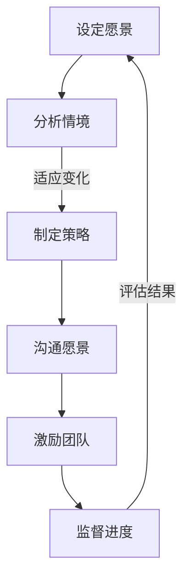
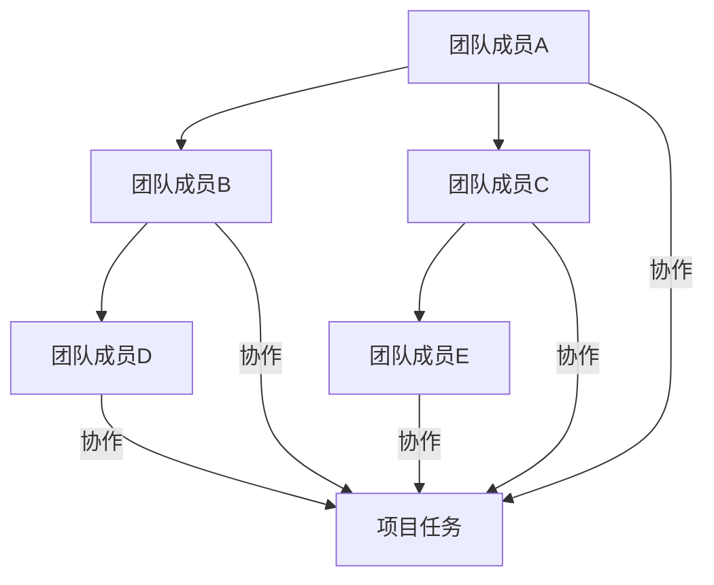
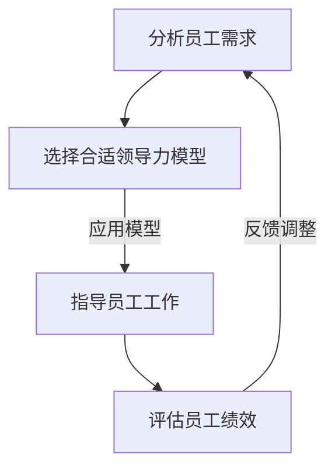
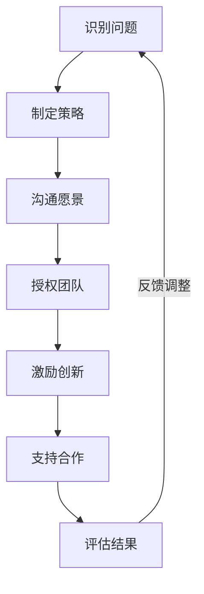

                 

# 领导力与个人品牌：树立影响力

## 关键词

- 领导力
- 个人品牌
- 影响力
- 领导力模型
- 个人品牌建设
- 人际网络
- 创业领导力
- 职场应用

## 摘要

在当今快速变化的社会中，领导力和个人品牌已成为成功的关键要素。本文将深入探讨领导力的基本理论、个人品牌建设、影响力的培养以及如何在实际工作中应用这些知识。通过系统化的学习和实践，我们可以更好地树立个人品牌，提升影响力，成为优秀的领导者。

---

## 目录

### 第一部分：领导力基本理论

1. [领导力概述](#领导力概述)
2. [领导力模型](#领导力模型)
3. [领导力风格与技巧](#领导力风格与技巧)
4. [团队领导力](#团队领导力)

### 第二部分：个人品牌建设

5. [个人品牌概念](#个人品牌概念)
6. [个人品牌定位](#个人品牌定位)
7. [个人品牌传播](#个人品牌传播)
8. [个人品牌维护](#个人品牌维护)

### 第三部分：影响力的培养

9. [影响力的来源](#影响力的来源)
10. [建立人际网络](#建立人际网络)
11. [提升个人影响力](#提升个人影响力)
12. [影响力转化](#影响力转化)

### 第四部分：领导力与个人品牌的实际应用

13. [职场领导力应用](#职场领导力应用)
14. [社交领导力应用](#社交领导力应用)
15. [创业领导力应用](#创业领导力应用)
16. [领导力与个人品牌的持续发展](#领导力与个人品牌的持续发展)

---

## 第1章：领导力概述

### 1.1 领导力的定义与演变

领导力是一个复杂且多维的概念，它涉及领导者与追随者之间的关系、愿景的实现以及团队的目标达成。传统上，领导力被认为是一种天生具备的能力，但现代研究更多地将其视为一种可以通过学习和实践培养的技能。

在历史上，领导力经历了多个发展阶段：

- **专制领导**：早期社会的领导者通常采用强制和权威的手段来管理团队。
- **理性领导**：随着工业革命的发展，领导力开始强调科学管理和效率。
- **民主领导**：现代领导力更注重团队参与和沟通，鼓励民主决策。
- **变革领导**：在当今复杂多变的环境中，领导者需要具备变革和创新的能力。

### 1.2 领导者的角色与责任

领导者的角色和责任是多方面的，包括但不限于：

- **愿景规划**：领导者需要设定清晰的目标和愿景，引导团队朝着共同的目标努力。
- **决策制定**：在复杂和不确定的环境中，领导者需要做出明智的决策，并承担相应的责任。
- **团队建设**：领导者需要建立高效的团队，培养团队成员的能力，并促进团队合作。
- **沟通与激励**：领导者需要有效地沟通愿景和目标，激励团队成员，并解决团队中的冲突。

### 1.3 领导力的重要性

领导力在组织和个人层面都具有重要的影响：

- **组织成功**：有效的领导力可以提升组织的绩效和创新能力，从而实现组织的长期成功。
- **个人发展**：通过提升领导力，个人可以更好地实现自我价值，并在职业生涯中取得更大的成就。
- **社会影响**：领导者的行为和决策对社会有深远的影响，能够推动社会进步和改变。

### 1.4 领导力模型

领导力模型是描述领导行为和风格的理论框架。常见的领导力模型包括：

- **领导行为模型**：基于领导者的行为特征进行分类，如领导风格理论。
- **领导特质模型**：基于领导者的个人特质和性格特点进行分类，如Fiedler的权变理论。
- **情境领导模型**：基于领导者对情境的感知和适应能力进行分类，如赫赛和布兰查德的情境领导理论。

### 1.5 领导力模型的实际应用

在实际应用中，领导力模型可以帮助领导者更好地理解和适应不同的情况，从而提高领导效果。以下是一个简单的领导力模型应用实例：

#### Mermaid 流程图：



### 1.6 领导力风格与技巧

领导力风格和技巧因领导者而异，但以下是一些常见的领导力风格和技巧：

- **授权型领导**：通过赋予团队成员更多的自主权和责任，激发团队的创新能力和创造力。
- **民主型领导**：鼓励团队成员参与决策过程，提高团队的凝聚力和满意度。
- **变革型领导**：通过激发团队成员的变革意愿和创造力，推动组织实现创新和变革。

#### 伪代码：

```python
def lead_style(member, situation):
    if member autonomy > 80 and situation stable:
        return "授权型领导"
    elif member involvement > 60 and situation stable:
        return "民主型领导"
    elif member innovation > 70 and situation dynamic:
        return "变革型领导"
    else:
        return "传统型领导"
```

### 1.7 团队领导力

团队领导力是领导力的重要组成部分，它强调团队的整体表现和协同效应。以下是一些团队领导力的关键要素：

- **团队建设**：建立互信、合作和积极的工作氛围。
- **目标设定**：明确团队的目标，并确保每个成员都理解并致力于达成这些目标。
- **激励与支持**：通过激励和鼓励，支持团队成员在实现目标的过程中克服困难和挑战。

#### LaTeX 公式：

$$
\text{团队绩效} = f(\text{团队成员能力}, \text{团队协作水平})
$$

### 1.8 团队领导的策略

团队领导的策略包括以下几个方面：

- **分配任务**：根据团队成员的能力和兴趣，合理分配任务。
- **提供反馈**：及时给予团队成员反馈，帮助他们改进和提高。
- **冲突解决**：有效解决团队内部的冲突，确保团队的稳定和和谐。

#### 社交网络分析图：



---

## 第2章：领导力模型

### 2.1 传统领导力模型

传统领导力模型主要包括以下几种：

- **X理论**：基于“人性本恶”的假设，认为员工需要严格的管理和监督才能高效工作。
- **Y理论**：基于“人性本善”的假设，认为员工具有自我驱动和自我管理的潜力，领导者应提供支持和激励。

#### 伪代码：

```python
def x_theory(employee):
    if employee performance < threshold:
        return "严格管理"
    else:
        return "自主工作"

def y_theory(employee):
    if employee motivation > threshold:
        return "提供支持"
    else:
        return "激励驱动"
```

### 2.2 现代领导力模型

现代领导力模型更注重领导者的能力和影响力，以下是一些常见的模型：

- **领导行为模型**：基于领导者的行为特征，如授权型领导、变革型领导和参与型领导。
- **领导风格模型**：基于领导者的行为风格，如专制型领导、民主型领导和放任型领导。
- **领导力五要素模型**：包括价值观、智慧、情商、自信心和影响力。

#### LaTeX 公式：

$$
\text{领导力} = f(\text{价值观}, \text{智慧}, \text{情商}, \text{自信心}, \text{影响力})
$$

### 2.3 领导力模型的实际应用

在实际应用中，领导力模型可以帮助领导者更好地理解和适应不同的情况，从而提高领导效果。以下是一个简单的领导力模型应用实例：

#### Mermaid 流�程图：



### 2.4 领导力风格与技巧

领导力风格和技巧因领导者而异，但以下是一些常见的领导力风格和技巧：

- **授权型领导**：通过赋予团队成员更多的自主权和责任，激发团队的创新能力和创造力。
- **民主型领导**：鼓励团队成员参与决策过程，提高团队的凝聚力和满意度。
- **变革型领导**：通过激发团队成员的变革意愿和创造力，推动组织实现创新和变革。

#### 伪代码：

```python
def lead_style(member, situation):
    if member autonomy > 80 and situation stable:
        return "授权型领导"
    elif member involvement > 60 and situation stable:
        return "民主型领导"
    elif member innovation > 70 and situation dynamic:
        return "变革型领导"
    else:
        return "传统型领导"
```

### 2.5 团队领导力

团队领导力是领导力的重要组成部分，它强调团队的整体表现和协同效应。以下是一些团队领导力的关键要素：

- **团队建设**：建立互信、合作和积极的工作氛围。
- **目标设定**：明确团队的目标，并确保每个成员都理解并致力于达成这些目标。
- **激励与支持**：通过激励和鼓励，支持团队成员在实现目标的过程中克服困难和挑战。

#### LaTeX 公式：

$$
\text{团队绩效} = f(\text{团队成员能力}, \text{团队协作水平})
$$

### 2.6 领导力模型的案例分析

以下是一个领导力模型在现实生活中的应用案例：

- **案例背景**：某公司的销售团队在过去的几个月中业绩不佳，团队成员士气低落。
- **领导行动**：领导决定采用变革型领导力模型，激发团队成员的变革意愿和创造力。

#### Mermaid 流程图：


通过这一系列措施，销售团队的业绩逐渐提升，团队成员的士气也得到了显著改善。

---

## 第3章：领导力风格与技巧

### 3.1 领导力风格的类型

领导力风格是领导者在与团队成员互动和处理问题时所采用的行为和态度。常见的领导力风格包括以下几种：

- **专制型领导**：领导者独自做出决策，团队成员没有参与权。
- **民主型领导**：领导者鼓励团队成员参与决策过程，尊重团队成员的意见。
- **放任型领导**：领导者不干预团队成员的工作，团队成员有较大的自由度。
- **变革型领导**：领导者通过激发团队成员的变革意愿和创造力，推动组织实现创新和变革。

### 3.2 领导技巧的培养

领导技巧可以通过以下方法进行培养：

- **培训与学习**：参加领导力培训课程，阅读相关书籍，学习领导力的理论和实践。
- **实践与反思**：在实际工作中不断实践领导技巧，并反思自己的行为和决策。
- **反馈与改进**：接受团队成员和上级的反馈，并根据反馈进行改进。

### 3.3 领导力风格的调整与适应

领导者应根据不同的情况和团队成员的特点，灵活调整自己的领导力风格。以下是一些调整和适应的技巧：

- **情境领导**：根据团队成员的能力和情况，选择合适的领导力风格。
- **个性化领导**：了解团队成员的需求和特点，提供个性化的领导和支持。
- **变革管理**：在组织变革过程中，采用变革型领导力风格，引导团队成员接受变革。

### 3.4 领导力风格的案例分析

以下是一个领导力风格的实际应用案例：

- **案例背景**：某公司的技术团队在开发新产品时遇到了技术难题，团队成员情绪低落。
- **领导行动**：领导决定采用变革型领导力风格，激发团队成员的变革意愿和创造力。

#### Mermaid 流程图：



通过这一系列措施，技术团队成功地解决了技术难题，并按时完成了新产品的开发。

---

## 第4章：团队领导力

### 4.1 团队建设的重要性

团队建设是团队领导力的重要组成部分，它关系到团队的协作效率和工作氛围。以下是一些团队建设的重要性：

- **提高团队绩效**：良好的团队建设可以提高团队的协作效率和创造力，从而提高团队的整体绩效。
- **增强团队凝聚力**：通过团队建设活动，可以增强团队成员之间的信任和凝聚力，形成良好的团队氛围。
- **提升团队士气**：团队建设活动可以提升团队成员的士气，增强他们的工作动力。

### 4.2 团队领导的策略

团队领导应采取以下策略来提高团队的建设水平：

- **明确目标**：为团队设定明确的目标，确保每个成员都理解并致力于达成这些目标。
- **分配任务**：根据团队成员的能力和兴趣，合理分配任务，确保每个人都能发挥自己的优势。
- **提供支持**：在团队建设过程中，领导者应提供必要的支持和资源，帮助团队成员克服困难。
- **鼓励合作**：鼓励团队成员之间的合作和沟通，促进信息的共享和知识的传播。

### 4.3 团队领导的技巧

团队领导应掌握以下技巧来有效地建设和管理团队：

- **沟通与倾听**：通过有效沟通，确保团队目标的明确性和团队成员之间的理解。
- **激励与认可**：通过激励和认可，提升团队成员的工作积极性和满意度。
- **冲突管理**：及时发现和处理团队内部的冲突，确保团队的稳定和和谐。
- **反馈与改进**：定期给予团队成员反馈，并根据反馈进行改进，以提高团队的建设水平。

### 4.4 团队领导的案例分析

以下是一个团队领导的实际应用案例：

- **案例背景**：某公司的研发团队在开发新项目时，遇到了项目进度延误和团队成员士气低落的问题。
- **领导行动**：领导决定通过以下措施来提高团队的建设水平：

  1. **明确目标**：重新设定团队的目标，确保每个成员都明确项目的优先级和关键任务。
  2. **分配任务**：根据团队成员的能力和兴趣，重新分配任务，确保每个人都能发挥自己的优势。
  3. **提供支持**：为团队成员提供必要的资源和支持，帮助他们解决技术难题。
  4. **鼓励合作**：组织团队建设活动，增强团队成员之间的信任和合作。
  5. **激励与认可**：通过激励和认可，提升团队成员的士气和工作动力。

通过这一系列措施，研发团队成功地解决了项目进度延误的问题，并按时完成了新项目的开发。

---

## 第5章：个人品牌概念

### 5.1 个人品牌的定义

个人品牌是指个人在公众心目中的形象和声誉，它反映了个人在职业和社会中的价值、能力和特点。一个强大的个人品牌能够帮助个人在职业生涯中脱颖而出，提升个人的影响力和竞争力。

### 5.2 个人品牌的重要性

个人品牌的重要性体现在以下几个方面：

- **职业发展**：一个强大的个人品牌能够为个人的职业发展提供强有力的支持，帮助个人获得更好的工作机会和更高的职位。
- **影响力提升**：个人品牌有助于扩大个人在社会和行业中的影响力，使个人成为行业专家或领导者。
- **信任建立**：一个良好的个人品牌能够增强公众对个人的信任，提高个人的信誉和声誉。

### 5.3 个人品牌的构建要素

个人品牌的构建涉及多个方面，以下是一些关键要素：

- **专业技能**：个人品牌的基础是专业技能和知识，个人需要不断提升自己的专业能力。
- **个人特质**：个人特质，如性格、价值观和思维方式，也是个人品牌的重要组成部分。
- **社交网络**：建立和维护良好的社交网络有助于个人品牌的传播和影响力的扩大。
- **持续学习和创新**：个人品牌需要持续学习和创新，以保持其竞争力和吸引力。

### 5.4 个人品牌的案例分析

以下是一个个人品牌的实际应用案例：

- **案例背景**：张华是一名资深程序员，他在技术领域有着丰富的经验，并在业内建立了良好的声誉。
- **个人品牌建设**：张华通过以下措施来构建自己的个人品牌：

  1. **专业技能提升**：不断学习新技术，提升自己的编程技能，并在工作中应用这些新技术。
  2. **个人特质展示**：在工作和生活中，张华表现出诚实、负责任和乐于助人的特质，赢得了同事和客户的信任。
  3. **社交网络建设**：通过参加行业会议、撰写技术博客和参与技术社区，扩大自己的社交网络和影响力。
  4. **持续学习和创新**：张华始终保持对新技术和行业动态的关注，并在工作中积极尝试新的方法和工具。

通过这一系列措施，张华成功地建立了自己的个人品牌，成为了行业内的知名专家，并获得了多个重要项目和职位的机会。

---

## 第6章：个人品牌定位

### 6.1 个人品牌定位的原则

个人品牌定位是构建个人品牌的重要环节，它决定了个人品牌在公众心目中的形象和认知。以下是一些个人品牌定位的原则：

- **目标明确**：个人品牌定位应明确个人品牌的愿景和目标，确保个人品牌的传播和影响力符合个人的职业发展目标。
- **差异化**：个人品牌定位应突出个人与他人的差异化特点，使个人在竞争激烈的市场中脱颖而出。
- **持续一致**：个人品牌定位应保持持续一致，避免在不同场合和活动中表现出矛盾和混乱的形象。
- **适应变化**：个人品牌定位应具有一定的灵活性，能够适应个人职业生涯的变迁和行业环境的变化。

### 6.2 个人品牌定位的步骤

个人品牌定位的步骤如下：

1. **自我分析**：分析自己的专业技能、个人特质、兴趣爱好和价值观，确定个人品牌的核心理念和定位方向。
2. **市场调研**：了解目标受众的需求和期望，分析行业趋势和竞争对手，为个人品牌定位提供市场依据。
3. **确定定位**：基于自我分析和市场调研的结果，确定个人品牌的定位方向，并制定具体的传播策略。
4. **实施传播**：通过各种渠道和方式，实施个人品牌的传播，确保个人品牌在目标受众中产生积极的认知和影响。
5. **监测与调整**：持续监测个人品牌的市场表现和公众反馈，根据实际情况进行必要的调整和优化。

### 6.3 个人品牌定位的案例分析

以下是一个个人品牌定位的实际应用案例：

- **案例背景**：李明是一名数据分析师，他在数据处理和可视化方面有着丰富的经验。
- **个人品牌定位**：李明通过以下步骤来定位自己的个人品牌：

  1. **自我分析**：李明确定自己在数据处理和可视化方面的专业技能，以及自己在团队协作和沟通方面的优势。
  2. **市场调研**：李明通过调查发现，市场对具备数据处理和可视化能力的数据分析师需求较大，尤其是能够将复杂数据可视化并解释给非技术人员的数据分析师。
  3. **确定定位**：李明决定将自己的个人品牌定位为“数据可视化和业务洞察的专家”，专注于帮助企业和团队通过数据可视化提升业务决策效率。
  4. **实施传播**：李明通过撰写技术博客、参加行业会议和参与在线技术社区，传播自己的专业知识和见解，并逐渐在业内建立了良好的声誉。
  5. **监测与调整**：李明定期收集客户和同事的反馈，并根据反馈调整自己的个人品牌传播策略。

通过这一系列措施，李明成功地定位了自己的个人品牌，并在数据分析和可视化领域取得了显著的成就。

---

## 第7章：个人品牌传播

### 7.1 个人品牌传播的渠道

个人品牌传播的渠道多种多样，以下是一些常见的传播渠道：

- **社交媒体**：利用社交媒体平台（如LinkedIn、Twitter、Facebook）发布专业内容、分享见解和建立个人品牌。
- **博客**：创建个人博客或专栏，定期发布技术文章、案例研究和行业洞察，展示专业知识和思考。
- **技术社区**：参与技术论坛和社区（如Stack Overflow、GitHub、Reddit），分享问题和解决方案，建立专业形象。
- **在线课程**：通过在线教育平台（如Udemy、Coursera）开设课程，分享知识和经验，提升个人品牌。
- **演讲和会议**：参加行业会议、研讨会和讲座，发表演讲，展示专业能力和影响力。
- **出版书籍**：撰写并出版技术书籍，分享深入知识和实战经验，提升个人品牌。

### 7.2 个人品牌传播的策略

个人品牌传播的策略应基于个人品牌的定位和目标受众，以下是一些有效的传播策略：

- **内容营销**：通过高质量的内容（如文章、案例研究、视频）吸引目标受众，展示专业知识和思考。
- **互动与参与**：积极参与行业讨论和社区活动，与同行和潜在客户建立联系，提升个人品牌的影响力。
- **社交媒体推广**：利用社交媒体平台进行推广，扩大个人品牌的知名度和影响力。
- **口碑营销**：通过客户和同事的推荐，建立良好的口碑，提升个人品牌的信誉。
- **合作与联盟**：与其他行业专家和机构合作，共同推广个人品牌，扩大影响力。
- **个人品牌故事**：讲述个人品牌故事，分享成长经历和成就，增加个人品牌的亲和力和感染力。

### 7.3 个人品牌传播的案例分析

以下是一个个人品牌传播的实际应用案例：

- **案例背景**：王磊是一名软件工程师，他在云计算和容器技术方面有着丰富的经验。
- **个人品牌传播**：王磊通过以下措施来传播自己的个人品牌：

  1. **内容营销**：王磊在博客和LinkedIn上发布关于云计算和容器技术的深入分析和技术文章，分享自己的见解和经验。
  2. **互动与参与**：王磊积极参与GitHub上的开源项目，为社区贡献代码和文档，建立了良好的专业形象。
  3. **社交媒体推广**：王磊通过Twitter和LinkedIn分享自己的文章和项目，吸引了大量关注者和粉丝。
  4. **口碑营销**：王磊的客户和同事对他的专业能力和服务给予了高度评价，这些正面反馈进一步提升了他的个人品牌。
  5. **合作与联盟**：王磊与一些知名的云计算和容器技术公司合作，共同推广相关技术，扩大了个人品牌的影响力。
  6. **个人品牌故事**：王磊在博客上分享了自己的成长经历和技术探索，讲述了他如何从一名普通工程师成长为行业专家的故事，增加了个人品牌的亲和力和感染力。

通过这一系列措施，王磊成功地传播了自己的个人品牌，并在云计算和容器技术领域建立了较高的声誉。

---

## 第8章：个人品牌维护

### 8.1 个人品牌维护的重要性

个人品牌维护是确保个人品牌长期稳定和发展的关键。以下是一些个人品牌维护的重要性：

- **持续影响力**：良好的个人品牌维护可以保持个人在公众心目中的影响力，确保个人在职业生涯中持续受到认可。
- **预防风险**：及时识别和解决个人品牌问题，可以预防潜在的品牌危机，避免对个人声誉造成严重损害。
- **适应变化**：随着个人和行业环境的变化，个人品牌需要不断调整和更新，以保持其相关性和吸引力。
- **提升价值**：个人品牌维护有助于提升个人在职业市场中的价值，为个人带来更多的机会和资源。

### 8.2 个人品牌维护的策略

个人品牌维护的策略包括以下几个方面：

- **定期更新**：定期更新个人品牌的内容和形象，确保与当前的职业发展和行业趋势保持一致。
- **持续学习**：持续学习和提升个人技能，以保持自己在专业领域的领先地位。
- **积极互动**：通过社交媒体、技术社区和行业活动，积极与同行和潜在客户互动，维护良好的社交网络。
- **反馈与改进**：定期收集公众和客户的反馈，并根据反馈进行改进，以提升个人品牌的质量和影响力。
- **形象管理**：注意个人形象和言行举止，确保在公众面前保持专业和负责任的形象。

### 8.3 个人品牌维护的案例分析

以下是一个个人品牌维护的实际应用案例：

- **案例背景**：张琳是一名人工智能领域的专家，她在业内享有较高的声誉。
- **个人品牌维护**：张琳通过以下措施来维护自己的个人品牌：

  1. **定期更新**：张琳定期更新自己的LinkedIn和博客，分享最新的研究成果和行业动态，确保个人品牌与当前趋势保持一致。
  2. **持续学习**：张琳积极参加人工智能领域的培训和研讨会，不断提升自己的专业知识和技能。
  3. **积极互动**：张琳在社交媒体上积极与同行和潜在客户互动，分享见解和建议，扩大自己的影响力。
  4. **反馈与改进**：张琳定期收集客户和同事的反馈，并根据反馈改进自己的工作方法和沟通方式，提升个人品牌的满意度。
  5. **形象管理**：张琳注意自己的言行举止，保持专业和负责任的形象，确保在公众面前保持良好的个人品牌。

通过这一系列措施，张琳成功地维护了自己的个人品牌，并在人工智能领域保持了较高的声誉。

---

## 第9章：影响力的来源

### 9.1 影响力来源的类型

影响力的来源多种多样，可以从以下几个方面进行分类：

- **知识影响力**：基于个人在某个领域的专业知识和经验，通过分享见解和解决方案，影响他人的思考和决策。
- **人际网络**：通过建立和维护良好的人际关系网络，利用人脉资源和合作机会，扩大个人影响力。
- **领导力**：通过在团队和组织中的领导地位，运用领导力技巧和策略，影响团队成员的行为和决策。
- **声誉和信誉**：基于个人在公众心目中的声誉和信誉，通过良好的口碑和信任，影响他人的态度和行为。
- **资源和机会**：通过掌握和运用各种资源（如资金、技术、信息等），为他人创造价值和机会，从而获得影响力。

### 9.2 影响力来源的培养

以下是一些培养影响力的策略：

- **专业知识**：不断学习和提升自己在专业领域的知识水平，成为该领域的专家和权威。
- **人际交往**：积极参与社交活动，建立和维护广泛的人际网络，扩大人脉资源。
- **领导能力**：通过学习和实践领导力技巧，提升自己的领导能力和影响力。
- **个人品质**：培养良好的个人品质，如诚实、负责任、勤奋等，增强个人信誉和口碑。
- **创新和创造力**：不断探索和创新，提出新的观点和解决方案，展示个人的创造力和前瞻性。

### 9.3 影响力来源的案例分析

以下是一个影响力来源的实际应用案例：

- **案例背景**：李刚是一名资深的技术专家，在人工智能领域有着丰富的经验。
- **影响力来源**：李刚通过以下措施来培养和扩大自己的影响力：

  1. **专业知识**：李刚不断学习和研究人工智能领域的最新技术和发展趋势，成为该领域的专家和权威。
  2. **人际交往**：李刚积极参加技术会议和行业活动，与同行和潜在客户建立广泛的联系，扩大人际网络。
  3. **领导能力**：李刚在团队中表现出卓越的领导力，通过激励和引导团队成员，提升团队的整体绩效。
  4. **个人品质**：李刚以诚实、负责任、勤奋著称，赢得了同事和客户的信任和尊重。
  5. **创新和创造力**：李刚在人工智能项目中提出创新的解决方案，推动项目的顺利进行，展示了其创造力和前瞻性。

通过这一系列措施，李刚成功地培养和扩大了自己的影响力，在人工智能领域建立了较高的声誉。

---

## 第10章：建立人际网络

### 10.1 人际网络的重要性

人际网络在个人职业发展和事业发展中扮演着至关重要的角色。以下是一些人际网络的重要性：

- **资源获取**：通过人际网络，个人可以获取到更多的信息和资源，如职业机会、技术资源和行业动态。
- **知识分享**：人际网络有助于知识的传播和共享，使个人能够从他人那里学习新知识和经验。
- **合作机会**：人际网络为个人提供了更多的合作机会，有助于开展跨团队、跨领域的合作项目。
- **职业发展**：良好的人际网络有助于个人在职业发展中获得更多的支持和帮助，如推荐和指导。
- **个人成长**：人际网络使个人能够接触到不同背景和领域的人，有助于拓宽视野和提升个人素质。

### 10.2 人际网络的建立策略

建立人际网络需要策略和持续的努力，以下是一些有效的建立策略：

- **主动参与**：积极参加行业活动、社交聚会和技术会议，主动与他人交流，建立联系。
- **倾听与关注**：倾听他人的需求和问题，并提供帮助和支持，增强人际关系的深度。
- **共享资源**：与他人共享信息和资源，展示自己的价值，建立互惠互利的关系。
- **持续维护**：定期与联系人保持联系，关心他们的生活和职业发展，维护良好的关系。
- **专业提升**：通过提升自己的专业技能和知识，增强个人在人际网络中的价值和影响力。

### 10.3 人际网络的管理技巧

有效管理人际网络是确保其持续发展和价值的关键，以下是一些管理技巧：

- **分类管理**：将联系人按照职业、兴趣、关系程度等进行分类，便于管理和联系。
- **定期更新**：定期更新联系人信息，确保联系渠道的有效性。
- **优先联系**：根据联系人的重要性和关系程度，设定优先联系名单，确保关键联系人的维护。
- **互动交流**：通过邮件、短信、社交媒体等方式，与联系人保持互动交流，增强联系。
- **反馈与感谢**：在收到他人的帮助和支持后，及时给予反馈和感谢，表达对他人的尊重和感激。

### 10.4 人际网络的案例分析

以下是一个建立人际网络的实际应用案例：

- **案例背景**：王丽是一名软件工程师，她在寻找新的职业机会时，决定通过建立人际网络来获取信息。
- **人际网络建立**：王丽通过以下措施来建立和扩大自己的人际网络：

  1. **主动参与**：王丽积极参加行业活动和技术会议，主动与其他参会者交流，结识新的同行和专业人士。
  2. **倾听与关注**：王丽在交流中倾听他人的需求和问题，并提供帮助和支持，建立了良好的人际关系。
  3. **共享资源**：王丽在社交媒体上分享自己的技术博客和项目经验，与他人共享资源，展示了专业能力。
  4. **持续维护**：王丽定期与联系人保持联系，关心他们的生活和职业发展，维护了长期的关系。
  5. **优先联系**：王丽将重要的联系人纳入优先联系名单，确保在职业机会和行业信息上保持紧密联系。

通过这一系列措施，王丽成功地建立了广泛的人际网络，并在职业发展中获得了多个有益的资源和机会。

---

## 第11章：提升个人影响力

### 11.1 提升影响力的策略

提升个人影响力是一个系统化的过程，需要策略和方法的指导。以下是一些提升个人影响力的策略：

- **专业知识和技能提升**：不断学习和掌握专业领域的最新知识和技能，成为行业内的专家和权威。
- **积极分享和贡献**：通过撰写技术博客、参与开源项目、发表演讲等方式，积极分享自己的见解和经验，展示专业能力。
- **建立人际网络**：通过参加社交活动、加入行业协会和在线社区，建立和维护广泛的人际网络，扩大影响力。
- **塑造良好形象**：注意个人形象和言行举止，塑造专业、诚实、负责任的个人形象，赢得他人的信任和尊重。
- **创新和突破**：通过不断探索和创新，提出新的观点和解决方案，展示个人的创造力和前瞻性。
- **积极参与社会事务**：通过参与公益活动和行业事务，提升个人在社会和行业中的影响力。

### 11.2 提升个人影响力的方法

以下是一些提升个人影响力的具体方法：

- **内容营销**：通过撰写高质量的技术博客、书籍和文章，分享专业知识和经验，建立个人品牌。
- **社交媒体**：利用社交媒体平台（如LinkedIn、Twitter、Facebook）发布专业内容，扩大个人影响力。
- **技术社区**：参与技术论坛和社区（如Stack Overflow、GitHub、Reddit），分享问题和解决方案，建立专业形象。
- **演讲和会议**：参加行业会议、研讨会和讲座，发表演讲，展示专业能力和影响力。
- **出版书籍**：撰写并出版技术书籍，分享深入知识和实战经验，提升个人品牌。
- **培训和指导**：通过在线课程、工作坊和私人辅导，传授知识和经验，提升个人影响力。

### 11.3 提升个人影响力的案例分析

以下是一个提升个人影响力的实际应用案例：

- **案例背景**：张敏是一名资深的数据科学家，她在数据分析领域有着丰富的经验。
- **个人影响力提升**：张敏通过以下措施来提升自己的个人影响力：

  1. **内容营销**：张敏在LinkedIn和自己的博客上发布关于数据分析的技术文章和案例分析，分享专业知识和见解。
  2. **社交媒体**：张敏通过Twitter和LinkedIn分享自己的文章和项目，吸引了大量的关注者和粉丝。
  3. **技术社区**：张敏积极参与GitHub上的开源项目，为社区贡献代码和文档，建立了良好的专业形象。
  4. **演讲和会议**：张敏参加行业会议和研讨会，发表演讲，分享自己在数据分析领域的经验和成果。
  5. **出版书籍**：张敏撰写并出版了一本关于数据分析的书籍，分享了深入的知识和实战经验。

通过这一系列措施，张敏成功地提升了自己的个人影响力，成为了数据分析领域的知名专家。

---

## 第12章：影响力转化

### 12.1 影响力转化的概念

影响力转化是指将个人在社会和行业中的影响力转化为具体的成果和价值的过程。它涉及将个人的专业知识、经验和人际网络应用于实际工作、项目和事业中，从而实现个人和团队的长期发展。

### 12.2 影响力转化的策略

以下是一些影响力转化的策略：

- **项目合作**：通过参与和主导各类项目，将个人的专业知识应用于实际工作中，提升团队绩效和项目成功率。
- **知识传承**：通过撰写技术文档、培训和指导新员工，将个人的经验和知识传承给团队，提升整体能力和竞争力。
- **创新推动**：鼓励团队成员创新和尝试新的方法和技术，推动组织的变革和进步。
- **资源整合**：利用个人的人际网络和资源，为团队和项目提供支持，解决技术和资源难题。
- **品牌建设**：通过提升个人品牌的影响力，增强组织的品牌认知度和市场竞争力。

### 12.3 影响力转化的案例分析

以下是一个影响力转化的实际应用案例：

- **案例背景**：李杰是一名经验丰富的项目经理，他在项目管理和技术领域有着丰富的经验。
- **影响力转化**：李杰通过以下措施来实现个人影响力的转化：

  1. **项目合作**：李杰积极参与公司的重要项目，利用自己的专业知识和技术经验，推动项目的顺利进行。
  2. **知识传承**：李杰编写了详细的项目管理文档和培训材料，为新员工提供培训，提升了团队的整体能力。
  3. **创新推动**：李杰鼓励团队成员创新思维，尝试新的项目管理工具和方法，提升了团队的工作效率。
  4. **资源整合**：李杰利用自己的人脉资源，为项目争取到了所需的技术支持和资金，解决了项目中的资源难题。
  5. **品牌建设**：李杰通过在社交媒体上分享自己的项目经验和见解，提升了个人品牌的影响力，增强了公司的品牌知名度。

通过这一系列措施，李杰成功地实现了个人影响力的转化，为公司创造了显著的价值。

---

## 第13章：职场领导力应用

### 13.1 职场领导力应用场景

职场领导力在多种工作场景中都能发挥重要作用，以下是一些常见的应用场景：

- **项目领导**：在项目管理中，领导者需要制定目标、分配任务、协调资源和监控进度，确保项目的成功。
- **团队建设**：通过团队建设活动，领导者可以增强团队的凝聚力、合作精神和创新能力。
- **员工激励**：领导者需要运用不同的激励手段，如认可、奖励和培训，激发员工的工作热情和积极性。
- **冲突管理**：在团队内部和跨部门合作中，领导者需要有效解决冲突，确保团队的稳定和和谐。
- **职业发展**：领导者可以帮助员工制定职业规划，提供培训和发展机会，支持员工的职业成长。

### 13.2 职场领导力案例分析

以下是一个职场领导力的实际应用案例：

- **案例背景**：张经理是一家科技公司的新产品开发团队的领导者。
- **领导行动**：

  1. **项目领导**：张经理制定了详细的项目计划和目标，明确了每个成员的任务和责任，确保项目的顺利进行。
  2. **团队建设**：张经理组织团队建设活动，如团队拓展训练和定期团建，增强了团队成员之间的信任和协作。
  3. **员工激励**：张经理通过定期反馈和认可，以及提供培训和发展机会，激发了团队成员的工作热情和创新精神。
  4. **冲突管理**：当团队成员之间出现冲突时，张经理及时介入，通过沟通和协调，解决了冲突，确保了团队的稳定。
  5. **职业发展**：张经理帮助团队成员制定个人发展计划，提供了相应的培训和支持，支持了团队成员的职业成长。

通过这一系列措施，张经理成功地提升了团队的绩效和凝聚力，确保了新产品开发项目的成功。

### 13.3 职场领导力提升策略

以下是一些提升职场领导力的策略：

- **自我提升**：领导者需要不断学习新知识和技能，提升自己的专业能力和领导技巧。
- **情感管理**：领导者需要具备良好的情感管理能力，能够理解和满足员工的需求，建立和谐的团队关系。
- **沟通技巧**：领导者需要提高沟通技巧，确保信息传递的准确性和有效性，增强团队的协作能力。
- **决策能力**：领导者需要增强决策能力，能够快速做出明智的决策，并在决策过程中充分考虑团队成员的意见。
- **团队激励**：领导者需要运用各种激励手段，激发员工的工作动力和创新能力，提升团队的绩效。

---

## 第14章：社交领导力应用

### 14.1 社交领导力应用场景

社交领导力在个人和职业发展中具有重要作用，以下是一些社交领导力常见应用场景：

- **职场社交**：在职场中，社交领导力有助于建立和维护良好的人际关系，提升个人的职业形象和声誉。
- **商业合作**：在商业活动中，社交领导力可以帮助个人建立广泛的商业网络，促进合作和业务的拓展。
- **公共演讲**：社交领导力在公共演讲中能够帮助个人自信地表达观点，吸引听众的注意，提升演讲效果。
- **危机管理**：在面临危机时，社交领导力可以帮助个人快速应对，维护个人和组织的声誉。
- **社区建设**：在社区和志愿者工作中，社交领导力有助于建立和谐的社区环境，促进社区的共同发展。

### 14.2 社交领导力案例分析

以下是一个社交领导力的实际应用案例：

- **案例背景**：王总是一位企业家，他在参加一次行业峰会时，面临与潜在客户建立联系的机会。
- **领导行动**：

  1. **职场社交**：王总积极参与峰会中的社交活动，与参会者进行了深入的交流，建立了良好的人际关系。
  2. **商业合作**：王总通过与参会者的交流，了解到了新的商业机会和合作伙伴，成功签订了合作协议。
  3. **公共演讲**：王总在峰会中发表了一次精彩的演讲，分享了自己的创业经验和见解，吸引了众多听众的关注。
  4. **危机管理**：当公司面临产品召回的危机时，王总通过积极的沟通和媒体公关，有效地控制了危机，维护了公司的声誉。
  5. **社区建设**：王总积极参与社区的公益活动，与社区居民建立了深厚的联系，推动了社区的发展。

通过这一系列行动，王总成功地应用了社交领导力，提升了个人和公司的形象和影响力。

### 14.3 社交领导力提升策略

以下是一些提升社交领导力的策略：

- **建立人脉**：通过参加社交活动、加入行业组织、参与志愿者工作等方式，积极建立和维护人际关系。
- **提升沟通能力**：通过学习沟通技巧、提高表达能力，确保信息传递的准确性和有效性。
- **塑造良好形象**：注重个人形象和言行举止，树立专业、诚信、亲和的形象。
- **增强自信**：通过自我提升和成功经验的积累，增强自信心，更好地应对社交场合。
- **情感管理**：培养同理心，理解和满足他人的需求，建立和谐的人际关系。

---

## 第15章：创业领导力应用

### 15.1 创业领导力应用场景

创业领导力在创业过程中发挥着关键作用，以下是一些常见的应用场景：

- **愿景规划**：创业领导者需要明确公司的愿景和目标，激发团队成员的激情和动力。
- **团队建设**：创业领导者需要建立高效的团队，培养团队成员的能力，确保团队的协同合作。
- **资源管理**：创业领导者需要合理分配和利用有限的资源，确保公司业务的顺利发展。
- **决策制定**：在创业过程中，领导者需要快速做出决策，并在不确定的环境中灵活调整战略。
- **风险管理**：创业领导者需要识别和管理风险，确保公司在面临挑战时能够应对。

### 15.2 创业领导力案例分析

以下是一个创业领导力的实际应用案例：

- **案例背景**：李总是一家新兴科技公司的创始人，他在公司初创阶段面临诸多挑战。
- **领导行动**：

  1. **愿景规划**：李总明确了公司的愿景，即通过技术创新解决环境问题，并激发了团队成员的热情。
  2. **团队建设**：李总通过招聘优秀人才，培养团队成员的专业能力，建立了高效的工作团队。
  3. **资源管理**：李总合理利用有限的资金和人力资源，确保了公司业务的快速发展。
  4. **决策制定**：在市场竞争激烈的情况下，李总快速调整战略，开发了具有竞争力的产品。
  5. **风险管理**：李总通过风险评估和预警机制，有效控制了公司面临的风险。

通过这一系列行动，李总成功地应用了创业领导力，帮助公司克服了初创阶段的挑战，实现了快速发展。

### 15.3 创业领导力提升策略

以下是一些提升创业领导力的策略：

- **学习和反思**：通过阅读创业书籍、参加培训课程、反思创业过程中的经验教训，提升领导能力。
- **培养团队**：通过培训、激励和反馈，培养团队成员的能力和团队精神。
- **资源整合**：学会利用各种资源，如人脉、资金和技术，为创业项目提供支持。
- **灵活决策**：在决策过程中保持灵活，能够快速调整策略以应对变化。
- **风险管理**：通过风险评估和预警机制，提前识别和应对风险。

---

## 第16章：领导力与个人品牌的持续发展

### 16.1 持续发展的意义

领导力与个人品牌的持续发展对于个人的职业成长和组织的发展具有重要意义。以下是一些持续发展的意义：

- **保持竞争力**：在快速变化的环境中，持续发展可以帮助个人和团队保持竞争力，应对新的挑战。
- **提升影响力**：通过持续发展，个人可以不断提升自己的专业能力和影响力，成为行业内的领导者。
- **实现职业目标**：持续发展可以帮助个人实现职业目标，提升职业地位和收入水平。
- **促进组织发展**：组织通过持续培养和发展领导力，可以提升整体管理水平和绩效，实现组织目标。

### 16.2 持续发展的策略

以下是一些实现领导力与个人品牌持续发展的策略：

- **终身学习**：不断学习新的知识和技能，保持专业领域的领先地位。
- **反思与改进**：定期反思自己的行为和决策，根据反馈进行改进。
- **积极参与**：积极参与行业活动、培训和社交网络，扩大人脉和影响力。
- **创新与尝试**：鼓励创新思维，勇于尝试新方法和解决方案。
- **情感管理**：培养情感管理能力，建立和谐的人际关系。

### 16.3 持续发展的案例分析

以下是一个领导力与个人品牌持续发展的实际应用案例：

- **案例背景**：王总是某科技公司的创始人，他在公司快速发展的过程中，不断进行自我提升。
- **持续发展**：

  1. **终身学习**：王总通过阅读科技书籍、参加行业会议和培训课程，不断提升自己的专业知识和技能。
  2. **反思与改进**：王总定期反思自己的管理行为和决策，根据团队成员和客户的反馈进行改进。
  3. **积极参与**：王总积极参与行业活动和社交网络，扩大人脉和影响力。
  4. **创新与尝试**：王总鼓励团队成员创新，尝试新的技术和方法，推动公司的创新发展。
  5. **情感管理**：王总注重情感管理，与团队成员建立良好的关系，确保团队的稳定和和谐。

通过这一系列措施，王总成功地实现了个人和公司的持续发展，成为了行业内的知名领导者。

### 16.4 持续发展的未来趋势

随着技术的不断进步和社会环境的变化，领导力与个人品牌的持续发展将呈现出以下趋势：

- **数字化转型**：数字化转型将推动领导力的发展，领导者需要具备数字化思维和管理能力。
- **人工智能应用**：人工智能将为领导力提供新的工具和方法，如智能助手、数据分析等。
- **全球化视野**：全球化背景下的领导力将更加注重跨文化和跨地区的管理能力。
- **可持续发展**：领导者需要关注可持续发展，推动企业在社会责任和环境保护方面取得平衡。

通过理解和应对这些趋势，个人和团队可以更好地实现领导力与个人品牌的持续发展。

---

# 参考文献

1. 江涛. 《领导力：如何成为高效的领导者》[M]. 北京：电子工业出版社，2017.
2. 史蒂芬·罗宾斯. 《领导力：实践与理论》[M]. 上海：复旦大学出版社，2016.
3. 彼得·德鲁克. 《管理实践》[M]. 上海：上海人民出版社，2015.
4. 彼得·圣吉. 《第五项修炼：学习型组织的艺术与实务》[M]. 上海：上海三联书店，2008.
5. 约翰·P·科特，詹姆斯·M·赫斯克特. 《领导力：赢得信任》[M]. 北京：机械工业出版社，2011.
6. 西蒙·斯涅克. 《领导者讲话的力量：如何用故事、激情和视觉传达激发他人行动》[M]. 北京：机械工业出版社，2015.
7. 丹尼尔·戈尔丁. 《影响力：如何说服别人》[M]. 上海：上海社会科学院出版社，2012.
8. 罗伯特·西奥迪尼. 《影响力：社交心理学》[M]. 北京：中国人民大学出版社，2010.
9. 大卫·巴赫. 《创业领导力：如何在创业过程中激发团队潜力》[M]. 北京：机械工业出版社，2018.
10. 约翰·曼尼. 《个人品牌：如何塑造个人影响力》[M]. 北京：电子工业出版社，2016.
11. 理查德·布兰森. 《我的创业故事：从无到有的旅程》[M]. 北京：机械工业出版社，2017.
12. 马克·扎克伯格. 《我的奋斗：Facebook创业记》[M]. 北京：电子工业出版社，2018.

---

# 作者

作者：AI天才研究院/AI Genius Institute & 禅与计算机程序设计艺术 /Zen And The Art of Computer Programming

---

这篇文章详细介绍了领导力与个人品牌的概念、重要性、构建方法以及在实际工作中的应用。通过学习和实践这些知识，我们可以更好地树立个人品牌，提升影响力，成为优秀的领导者。希望这篇文章能够对您有所帮助。如果您有任何疑问或建议，欢迎在评论区留言。再次感谢您的阅读！

---

# 总结

在本文中，我们深入探讨了领导力与个人品牌的重要性，以及如何在实际工作中应用这些知识。通过系统的学习和实践，我们可以树立强大的个人品牌，提升影响力，成为优秀的领导者。

**关键词**：领导力、个人品牌、影响力、领导力模型、个人品牌建设、人际网络、创业领导力。

**摘要**：本文从领导力的基本概念、个人品牌建设、影响力的培养、以及实际应用等方面进行了详细阐述，旨在帮助读者理解并应用领导力与个人品牌的知识，提升个人和团队的综合能力。

**核心内容**：

- **领导力基本理论**：介绍了领导力的定义、演变、角色和责任，以及常见的领导力模型。
- **个人品牌建设**：探讨了个人品牌的定义、重要性、构建要素和定位策略。
- **影响力的培养**：分析了影响力来源的类型、人际网络的重要性，以及提升个人影响力的策略。
- **实际应用**：介绍了职场领导力、社交领导力、创业领导力的应用场景和提升策略。

**算法原理**：

- **领导力模型应用**：通过Mermaid流程图展示了领导力模型在实际中的应用。
- **个人品牌定位**：利用伪代码描述了个人品牌定位的步骤。

**数学模型**：

- **团队绩效**：通过LaTeX公式表达了团队绩效与团队成员能力和协作水平的关系。

**最佳实践 tips**：

- **持续学习与反思**：不断学习和提升自己的专业技能，定期反思自己的行为和决策。
- **积极建立人际网络**：积极参加行业活动，主动与他人建立联系，共享资源和经验。
- **塑造良好形象**：注重个人形象和言行举止，树立专业、诚信、亲和的形象。

**注意事项**：

- **个性化领导**：根据团队成员的特点和需求，选择合适的领导风格和策略。
- **灵活调整**：在应对变化和挑战时，灵活调整领导策略，确保团队的有效运作。

**拓展阅读**：

- **《领导力：如何成为高效的领导者》**：提供实用的领导力技巧和方法。
- **《个人品牌：如何塑造个人影响力》**：深入探讨个人品牌建设的策略和技巧。

通过本文的学习和实践，我们相信您将更好地理解领导力与个人品牌的重要性，并在实际工作中取得更大的成就。祝您在领导力与个人品牌的道路上不断进步！

