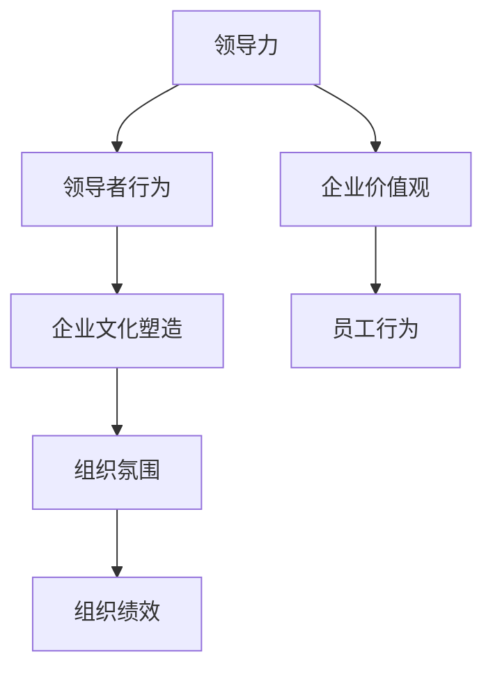
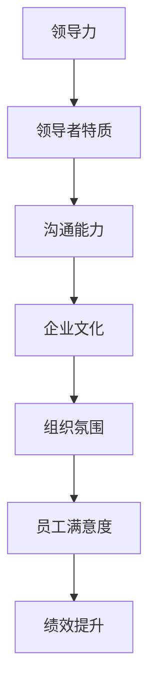

                 

## 领导力与企业文化：塑造独特组织氛围

在当今快节奏、竞争激烈的企业环境中，领导力和企业文化作为组织的两大支柱，不仅对企业的运营效率有着深远影响，更是塑造组织氛围、推动持续发展的关键要素。本文旨在探讨领导力与企业文化之间的关系，并解析如何通过有效的领导力来塑造独特的组织氛围。

### 关键词
- **领导力**
- **企业文化**
- **组织氛围**
- **领导风格**
- **员工满意度**
- **绩效提升**
- **团队协作**
- **变革管理**

### 摘要
本文首先介绍了领导力的基本概念和类型，并分析了领导力与个人特质、沟通能力之间的联系。随后，深入探讨了企业文化的定义、作用以及塑造方法，重点讨论了领导力在企业文化建设中的关键角色。接着，我们探讨了组织氛围的定义及其对企业绩效的影响，分析了领导力如何影响和塑造组织氛围。最后，通过实际案例和最佳实践，总结了如何将领导力和企业文化应用于实际操作中，以塑造积极、高效的团队氛围。

### 目录
1. **领导力基础**
    1.1 领导力概述
    1.2 领导力与个人特质
    1.3 领导力与沟通

2. **企业文化塑造**
    2.1 企业文化概述
    2.2 企业文化塑造过程
    2.3 企业文化建设中的领导力

3. **组织氛围与领导力**
    3.1 组织氛围概述
    3.2 领导力与组织氛围的塑造

4. **案例分析与实践指导**
    4.1 领导力与企业文化实践案例
    4.2 领导力与企业文化实践指导

5. **未来趋势与挑战**
    5.1 领导力发展趋势
    5.2 企业文化变革趋势
    5.3 领导力与企业文化面临的挑战

### 文章结构

本文结构分为四个主要部分：

- **第一部分：领导力基础**：介绍领导力的基本概念和类型，探讨领导力与个人特质、沟通能力之间的关系。

- **第二部分：企业文化塑造**：详细阐述企业文化的定义、作用以及塑造过程，强调领导力在企业文化建设中的关键作用。

- **第三部分：组织氛围与领导力**：分析组织氛围的定义及其对企业绩效的影响，讨论领导力如何影响和塑造组织氛围。

- **第四部分：案例分析与实践指导**：通过实际案例和最佳实践，总结如何将领导力和企业文化应用于实际操作中，以塑造积极、高效的团队氛围。

### 背景介绍

在现代商业环境中，领导力和企业文化已经成为组织成功的关键因素。领导力不仅仅是对员工的指导和激励，更是推动组织变革、创新和持续发展的动力。企业文化则是组织的灵魂，它影响着员工的价值观、行为模式和工作方式，进而决定组织的整体氛围和绩效。

随着全球化和技术创新的加速，企业的运营环境变得日益复杂和多变。在这样的背景下，领导者和组织需要具备快速适应和创新的能力，以应对不断变化的市场需求和挑战。领导力在这个过程中发挥着至关重要的作用，它不仅能够提升员工的积极性和创造力，还能够促进团队合作和知识共享，从而推动组织整体绩效的提升。

企业文化作为组织内部共同的价值观和行为规范，对于塑造独特的组织氛围、提升员工满意度和忠诚度具有重要作用。通过明确的企业价值观和共同的目标，企业能够建立一种积极、健康和富有活力的工作环境，从而吸引和留住优秀人才，提高组织的竞争力。

因此，领导力和企业文化不仅对组织的短期绩效有直接影响，更对组织的长期发展具有深远影响。本文将从理论和实践两个层面，深入探讨领导力与企业文化的关系，分析如何通过有效的领导力来塑造独特的组织氛围，以实现组织的长期成功和可持续发展。

### 核心概念与联系

在探讨领导力与企业文化的关系之前，有必要首先定义和了解这两个核心概念，并分析它们之间的联系。

#### 领导力的定义

领导力是一种能够激发和引导他人共同实现目标的能力。它不仅包括个人特质和技能，还涉及一系列行为和过程。根据罗伯特·豪斯（Robert House）的领导力理论，领导力可以分为四种主要风格：指令型（Authoritative）、支持型（Supportive）、参与型（Participative）和成就导向型（Achievement-Oriented）。

- **指令型**：领导者明确指导员工的工作，提供具体的任务分配和反馈。
- **支持型**：领导者关注员工的情感需求，提供支持和鼓励。
- **参与型**：领导者与员工共同决策，鼓励员工参与决策过程。
- **成就导向型**：领导者激励员工追求卓越，设定高目标并激励员工实现。

#### 企业文化的定义

企业文化是指组织内部共同的价值观、信仰、行为规范和工作方式。根据彼得·德鲁克（Peter Drucker）的观点，企业文化是组织最持久的部分，它决定组织的竞争力、创新能力和适应能力。

企业文化可以分为几种类型，如：

- **创新型文化**：鼓励创新和尝试，对失败持开放态度。
- **学习型文化**：重视持续学习和知识分享，鼓励员工不断成长。
- **稳定型文化**：注重稳定和可靠性，强调流程和规则。
- **参与型文化**：鼓励员工参与决策和变革，增强员工的归属感。

#### 领导力与企业文化的联系

领导力与企业文化的联系主要体现在以下几个方面：

1. **塑造企业文化的领导者**：领导者在企业文化的塑造过程中起着关键作用。通过其行为和价值观，领导者能够引导和影响员工，塑造企业的文化氛围。

2. **领导风格与企业文化的匹配**：不同的领导风格会影响企业文化的形成。例如，指令型领导风格可能更适用于稳定型文化，而参与型领导风格则更适合创新型文化。

3. **领导力的传承**：领导力不仅影响当前的企业文化，还能够通过培训和发展计划传承给新一代领导者，确保企业文化得以持续传承。

4. **员工行为和价值观**：领导者的行为和沟通方式会影响员工的行为和价值观，进而影响企业文化的形成。

为了更清晰地展示领导力与企业文化的联系，我们可以使用Mermaid流程图来构建其关系架构：

这个流程图展示了领导力通过领导者的行为影响企业文化，进而影响员工行为和组织氛围，最终影响组织绩效的路径。

#### 核心概念的关系架构

以下是一个简化的Mermaid流程图，展示核心概念之间的关系：

这个流程图强调了领导力通过领导者的个人特质和沟通能力，对企业文化进行塑造，进而影响组织氛围、员工满意度和绩效提升的关键路径。

通过这些核心概念的深入分析和流程图的展示，我们可以更好地理解领导力与企业文化的紧密联系，并为后续的深入探讨奠定基础。

### 领导力与个人特质

领导力不仅仅是职位赋予的权力，更是一种个人特质的体现。一个成功的领导者需要具备一系列核心特质，这些特质直接影响其领导效果和企业文化的发展。以下是对领导者应具备的核心特质、自我认知和人格特质发展的详细探讨。

#### 领导者应具备的核心特质

1. **自信与决心**：领导者需要有坚定的信心和决心去面对挑战和不确定性。这种自信能够激励团队，使成员相信领导者能够带领他们走向成功。

2. **远见**：领导者应具备前瞻性思维，能够预见市场趋势和潜在机会，从而为企业制定长远的发展战略。

3. **正直**：正直是领导者最基本的要求之一。领导者需要以身作则，坚守诚信原则，赢得员工的信任和尊重。

4. **同理心**：领导者应具备同理心，能够理解和关心员工的需求和感受。这种关心能够增强团队的凝聚力和忠诚度。

5. **沟通能力**：有效的沟通是领导力的关键。领导者需要具备清晰、有力的表达能力，同时能够倾听和理解员工的意见和需求。

6. **灵活性与适应性**：在快速变化的环境中，领导者需要具备灵活和适应性的特质，能够迅速调整策略以应对新的挑战。

#### 领导者自我认知

自我认知是领导者发展的基础。一个成功的领导者需要深入了解自己的优点和不足，并不断进行自我反思和提升。以下是一些自我认知的方法：

1. **定期评估**：领导者可以通过定期评估自己的工作表现，识别自身的优势和改进点。

2. **反馈机制**：建立有效的反馈机制，从员工、同事和上级那里获取真实、具体的反馈，以便进行自我调整。

3. **自我反思**：定期进行自我反思，思考自己在工作中的行为和决策，评估其效果和影响。

4. **持续学习**：领导者应保持持续学习的态度，通过参加培训、阅读书籍和听取行业讲座等方式，不断提升自己的知识和技能。

#### 领导者的人格特质与发展

领导者的人格特质对其领导力有着深远影响。以下是对几种重要人格特质的探讨以及如何进行发展：

1. **领导魅力**：领导魅力是一种能够吸引和激励他人的特质。领导者可以通过提升自信、建立信任关系和展现卓越的沟通能力来增强领导魅力。

2. **情绪智力**：情绪智力是指识别、理解和管理自己及他人情绪的能力。领导者可以通过情感觉察、自我调节和社交技能的培养来提高情绪智力。

3. **自我效能感**：自我效能感是指对自己完成特定任务的信心。领导者可以通过成功经历、正面反馈和设定可实现的目标来增强自我效能感。

4. **适应性**：适应性是指在面对不确定性和变革时迅速调整和适应的能力。领导者可以通过实践多样化的工作环境、学习新技能和接受不同意见来提升适应性。

总之，领导者应具备一系列核心特质，并通过自我认知和发展不断提升自身能力。这不仅能提高领导效果，还能为企业文化的塑造和组织的可持续发展奠定坚实基础。

### 领导力与沟通

有效的沟通是领导力的核心要素之一，它不仅能够促进团队成员之间的理解和协作，还能在塑造企业文化方面发挥重要作用。领导者的沟通能力直接影响到员工的工作态度、团队氛围以及整个组织的绩效。

#### 有效沟通的重要性

1. **促进理解和协作**：良好的沟通能够确保团队成员对目标和任务有清晰的理解，从而避免误解和冲突，提高团队的协作效率。

2. **增强员工参与感**：领导者的有效沟通能够鼓励员工参与决策过程，提升员工的参与感和归属感，从而增强团队的凝聚力和工作效率。

3. **传递价值观和文化**：领导者的沟通是传递企业文化的重要渠道。通过明确传达企业的价值观和行为规范，领导者能够塑造和巩固企业文化。

4. **解决冲突**：有效的沟通能够帮助领导者及时识别和解决团队中的冲突，维护团队的和谐与稳定。

#### 沟通技巧

1. **清晰表达**：领导者需要具备清晰、简洁的表达能力，确保信息准确传达。使用简单的语言和具体的例子能够增强沟通效果。

2. **倾听**：倾听是有效沟通的重要组成部分。领导者需要耐心倾听员工的意见和反馈，理解他们的需求和困扰，从而做出更合适的决策。

3. **非语言沟通**：身体语言、面部表情和语调等非语言沟通元素同样重要。领导者应注重这些方面，以增强沟通的效果和影响力。

4. **积极反馈**：领导者应给予员工及时的反馈，包括正面的和改进的建议。积极反馈能够激励员工，提升他们的工作积极性和自信心。

#### 沟通障碍与解决方法

1. **语言障碍**：不同文化背景的员工可能存在语言障碍，导致沟通不畅。解决方法包括提供跨文化培训、使用通用语言和制定明确的工作流程。

2. **信息过载**：信息过多可能导致员工无法有效处理和利用。领导者可以通过简化信息、设定优先级和及时更新信息来缓解信息过载。

3. **心理障碍**：员工的个人心理状态，如压力、焦虑和恐惧，可能影响沟通效果。领导者应关注员工的心理健康，提供必要的支持和帮助。

4. **层级障碍**：组织内部的层级结构可能阻碍信息流动。领导者可以通过扁平化管理、鼓励跨部门合作和开放沟通渠道来打破层级障碍。

总之，领导者的沟通能力对团队和企业文化至关重要。通过掌握有效的沟通技巧，解决沟通障碍，领导者能够更好地塑造积极、健康的团队氛围，提升组织的整体绩效。

### 企业文化概述

企业文化是组织的灵魂，它不仅仅是一系列口号和价值观，更是员工行为和工作方式的内在驱动。了解企业文化的定义、作用以及不同类型的定义，有助于深入理解其对企业运营和组织氛围的深远影响。

#### 企业文化的定义

企业文化是指组织内部共同的价值观、信仰、行为规范和工作方式。它通过一系列显性和隐性的方式，如组织结构、工作流程、员工行为和沟通风格，体现在组织日常运营中。企业文化不仅包括高层制定的正式规范，还涵盖了员工在长期工作过程中形成的共同认知和习惯。

企业文化的核心要素可以归纳为以下几点：

1. **价值观**：这是企业文化的基石，是企业所倡导的核心信念和原则，如诚信、创新、客户至上等。

2. **愿景**：愿景是企业未来的发展方向和目标，它是员工共同奋斗的方向和动力。

3. **使命**：使命是企业存在的理由和目的，它指导企业在日常运营中的决策和行为。

4. **行为规范**：行为规范是企业对员工行为的要求，如职业道德、工作态度和团队合作等。

#### 企业文化的作用

企业文化在组织中扮演着多重角色，其作用主要体现在以下几个方面：

1. **凝聚员工**：企业文化能够将员工凝聚在一起，形成共同的价值观和行为规范，增强团队凝聚力和归属感。

2. **引导行为**：企业文化通过价值观和行为规范，引导员工在日常工作中如何行动和决策，确保企业目标的实现。

3. **塑造品牌形象**：企业文化是企业的无形资产，良好的企业文化能够提升企业的品牌形象和公众形象，增强市场竞争力。

4. **促进创新**：企业文化鼓励创新和尝试，对失败持开放态度，能够激发员工的创造力和创新精神，推动企业的持续发展。

5. **提升绩效**：企业文化通过提升员工的满意度和忠诚度，提高工作效率和团队合作，进而提升组织的整体绩效。

#### 企业文化的类型

企业文化根据其特点和表现形式，可以划分为多种类型。以下是一些常见的企业文化类型：

1. **创新型文化**：这类文化鼓励创新和冒险，对失败持开放态度，注重持续改进和自我提升。例如，谷歌和苹果等高科技公司就以其创新文化著称。

2. **学习型文化**：这类文化强调持续学习和知识分享，鼓励员工不断成长和提升技能。例如，IBM和三星等公司以其学习型文化而闻名。

3. **稳定型文化**：这类文化注重稳定和可靠性，强调流程和规则，重视员工的经验和忠诚度。例如，许多大型制造业公司如丰田和通用电气就拥有稳定型文化。

4. **参与型文化**：这类文化鼓励员工参与决策和变革，增强员工的参与感和责任感。例如，谷歌和星巴克等公司以其参与型文化而受到员工的喜爱。

5. **以人为本文化**：这类文化将员工视为最重要的资产，注重员工的福利和发展，强调员工的成长和幸福感。例如，德勤和微软等公司以其以人为本的文化而著称。

通过明确企业文化的定义、作用和不同类型，我们可以更好地理解和应用企业文化，以塑造独特的组织氛围，推动组织的可持续发展。领导者在企业文化建设中起着关键作用，将在后续章节中详细探讨。

### 企业文化塑造过程

塑造企业文化是一个复杂而持续的过程，需要明确的步骤和策略。以下将详细讨论明确企业价值观、设计企业文化战略以及塑造企业文化的方法与策略。

#### 明确企业价值观

1. **价值观的识别**：企业首先需要识别核心价值观，这些价值观通常反映了企业的使命和愿景。通过调研、员工访谈和内部讨论，可以识别出员工普遍认同的核心价值观。

2. **核心价值观的筛选**：从识别出的价值观中，筛选出最具代表性和影响力的核心价值观。这些价值观应具备以下特点：明确、简洁、易于理解、具有长期性。

3. **核心价值观的明确化**：将核心价值观具体化，通过语言、符号和行动使其变得明确和具体。例如，通过口号、使命宣言和具体的行为准则，使核心价值观深入人心。

#### 设计企业文化战略

1. **战略定位**：在明确核心价值观的基础上，企业需要根据自身的行业特点和战略目标，设计企业文化战略。企业文化战略应与企业的整体战略保持一致，并支持企业的长期发展。

2. **传播策略**：设计有效的传播策略，确保核心价值观在企业内部得到广泛传播和认同。这包括通过内部沟通、培训和激励措施，使员工深刻理解和践行核心价值观。

3. **整合资源**：企业需要整合内部资源，包括人力资源、财务资源和技术资源，支持企业文化战略的实施。例如，通过制定相关政策和激励机制，确保员工在实际行动中体现核心价值观。

#### 塑造企业文化的方法与策略

1. **领导力**：领导者在塑造企业文化中起着关键作用。领导者应通过自身的行为和沟通，树立榜样，传递和践行核心价值观。

2. **团队建设**：通过团队建设和团队活动，增强员工的凝聚力和归属感。例如，定期组织团队建设活动和团建培训，使员工在共同经历中加深对企业文化的理解。

3. **激励机制**：设计合理的激励机制，将企业文化的核心价值观与员工的绩效和奖励挂钩。例如，通过设立价值观相关的奖项和荣誉称号，激励员工积极践行企业文化。

4. **沟通与反馈**：建立有效的沟通渠道，确保员工能够表达自己的意见和建议。同时，领导者应积极反馈员工的反馈，使企业文化得到不断完善。

5. **持续改进**：企业文化不是一成不变的，企业应不断评估和改进企业文化，以适应外部环境和内部变化。通过定期的文化评估和反馈机制，确保企业文化始终与企业的战略目标保持一致。

总之，塑造企业文化需要明确的价值观、有效的战略设计和切实可行的方法与策略。通过领导者的引导和全体员工的共同参与，企业能够塑造出独特的文化氛围，推动组织的可持续发展。

### 企业文化建设中的领导力

在企业文化建设中，领导者的角色至关重要。领导者不仅是企业文化的传播者和践行者，更是推动企业文化变革的中坚力量。以下将讨论领导者在企业文化建设中的关键角色、如何推动企业文化建设以及企业文化建设过程中可能面临的挑战。

#### 领导者在企业文化建设中的角色

1. **传播者**：领导者需要将企业核心价值观传递给每一位员工，使其成为员工行为的指南。通过内部演讲、团队会议和日常沟通，领导者能够确保企业文化深入人心。

2. **践行者**：领导者的行为是企业文化的典范。领导者应通过自身的言行一致，践行企业价值观，树立良好的榜样。这不仅能增强员工的信任感，还能提高员工的认同感。

3. **倡导者**：领导者是企业文化的倡导者，他们需要积极推动企业文化的变革和创新。通过制定相关政策和激励措施，领导者能够鼓励员工在实际行动中体现企业文化。

4. **协调者**：在企业文化建设过程中，领导者需要协调各部门和员工之间的关系，确保企业文化的落实和执行。这包括解决潜在的冲突、促进跨部门的合作以及提供必要的资源和支持。

#### 如何推动企业文化建设

1. **制定明确的企业价值观**：领导者需要首先明确企业的核心价值观，并将其纳入企业的战略规划和日常运营中。这可以通过制定使命宣言、愿景和价值观手册等方式实现。

2. **建立企业文化的传播机制**：领导者应建立有效的传播机制，确保企业文化在企业内部得到广泛传播和认同。这包括内部培训、企业文化宣传日和员工文化活动等。

3. **强化激励机制**：领导者应设计合理的激励机制，将企业文化与员工的绩效和奖励挂钩。例如，设立价值观相关的奖项和荣誉称号，激励员工积极践行企业文化。

4. **鼓励员工参与**：领导者应鼓励员工参与企业文化的建设过程，使其感受到自身在企业文化建设中的价值和作用。这可以通过员工调查、意见征集和团队建设活动等方式实现。

5. **持续改进**：企业文化建设是一个持续的过程，领导者需要不断评估和改进企业文化，以适应外部环境和内部变化。这可以通过定期的文化评估和反馈机制来实现。

#### 企业文化建设中的挑战

1. **员工认知差异**：不同员工对企业的核心价值观和企业文化有不同的认知和理解，这可能导致文化执行的难度。

2. **变革阻力**：企业文化建设涉及变革，可能会触动一些员工的利益，导致变革的阻力。

3. **领导力不足**：一些领导者可能缺乏推动企业文化建设所需的技能和知识，无法有效发挥领导作用。

4. **文化惯性**：企业可能存在旧有文化的惯性，新的企业文化难以在短时间内取代旧有文化。

5. **外部环境变化**：外部环境的快速变化可能会影响企业文化的稳定性和持续性。

为了应对这些挑战，领导者需要不断提升自身的领导力，深入了解员工的认知和需求，制定灵活的文化策略，并持续推动企业文化的变革和创新。通过有效的领导力，企业能够成功塑造和巩固企业文化，推动组织的可持续发展。

### 组织氛围概述

组织氛围是指组织中员工的心理状态、情绪和行为模式，它是企业文化的外在表现。理解组织氛围的定义、类型及其对企业绩效的影响，有助于领导者更好地塑造和改善组织氛围，从而提升整体绩效。

#### 组织氛围的定义

组织氛围是指组织中员工的心理状态、情绪和行为模式的总和，它是企业文化的外在表现。组织氛围不仅反映了员工的情感和心理状态，还影响了员工的行为和工作效率。良好的组织氛围能够促进团队合作、提高员工满意度和工作绩效，而不良的组织氛围则可能导致员工士气低落、工作效率下降。

#### 组织氛围的类型

根据组织氛围的不同特征，可以分为以下几种类型：

1. **积极型氛围**：在这种氛围中，员工感到愉悦、有动力，愿意积极参与工作。员工之间相互支持、合作，组织内部充满正能量。

2. **消极型氛围**：在这种氛围中，员工感到沮丧、失望，缺乏工作动力。员工之间可能存在竞争和冲突，组织内部存在消极情绪。

3. **稳定型氛围**：在这种氛围中，员工情绪稳定，工作态度理性。员工对组织有较高的认同感，工作稳定且有序。

4. **创新型氛围**：在这种氛围中，员工充满创新精神，愿意尝试新的想法和方法。组织鼓励冒险和失败，对创新持开放态度。

#### 组织氛围对企业绩效的影响

1. **员工满意度**：良好的组织氛围能够提高员工的满意度，使员工感到快乐和有价值，从而减少员工流失率，提高员工的工作投入度和忠诚度。

2. **团队合作**：积极的组织氛围能够促进团队合作，增强员工之间的信任和协作，提高工作效率和绩效。

3. **创新能力**：创新型氛围能够激发员工的创新精神，鼓励员工提出新的想法和方法，推动组织的持续发展和竞争优势。

4. **工作绩效**：良好的组织氛围能够提高员工的工作绩效，使员工更加投入和专注，提高工作质量和效率。

5. **组织稳定性**：稳定的组织氛围能够增强组织的稳定性，使员工对组织有较高的认同感，降低组织变革和转型的阻力。

总之，组织氛围是企业文化和员工行为的外在表现，对员工的满意度、团队合作、创新能力和工作绩效具有重要影响。通过理解组织氛围的类型及其对企业绩效的影响，领导者可以采取有效措施塑造和改善组织氛围，从而推动组织的可持续发展。

### 领导力与组织氛围的塑造

领导力在塑造组织氛围方面起着至关重要的作用。一个优秀的领导者不仅能够通过自身的领导风格和沟通能力直接影响组织氛围，还能通过一系列策略和方法，培养积极、健康的组织氛围。以下将详细讨论领导力对组织氛围的影响、塑造积极组织氛围的策略以及应对消极组织氛围的方法。

#### 领导力对组织氛围的影响

1. **领导风格**：不同的领导风格会对组织氛围产生不同的影响。例如，指令型领导风格可能导致员工感到压抑和被动，而参与型领导风格则能够鼓励员工的参与感和自主性，培养积极、开放的氛围。

2. **沟通能力**：领导者的沟通能力直接影响员工的情绪和态度。有效的沟通能够增强员工之间的信任和理解，培养积极的组织氛围。

3. **榜样作用**：领导者的行为和价值观直接影响员工的行为和态度。领导者通过自身的榜样作用，能够塑造和巩固组织氛围。

4. **激励手段**：领导者的激励手段能够直接影响员工的积极性和工作态度。合理的激励措施能够激发员工的潜力，培养积极的组织氛围。

#### 塑造积极组织氛围的策略

1. **明确目标和价值观**：领导者需要明确组织的目标和价值观，并通过有效的沟通手段，使员工理解和认同这些目标和价值观，从而在组织内部形成共同的价值观和行为准则。

2. **鼓励员工参与**：领导者应鼓励员工参与决策和变革过程，增强员工的参与感和责任感。这可以通过定期举行员工会议、意见征集和团队建设活动等方式实现。

3. **建立信任机制**：领导者需要建立信任机制，增强员工之间的信任和协作。这可以通过透明沟通、开放反馈和解决冲突等方式实现。

4. **提供心理支持**：领导者应关注员工的心理需求，提供必要的心理支持和帮助。这可以通过员工心理健康培训、心理咨询和团队建设活动等方式实现。

5. **激励创新**：领导者应鼓励创新，对员工的创新行为给予认可和支持。这可以通过设立创新奖项、提供创新资源和组织创新竞赛等方式实现。

#### 应对消极组织氛围的方法

1. **识别问题**：领导者需要首先识别组织中的消极氛围，通过调研、员工反馈和绩效评估等方式，了解员工的不满和困惑。

2. **沟通解决**：领导者应通过有效的沟通手段，了解员工的不满原因，并采取相应的措施解决。这可以通过一对一沟通、团队会议和反馈渠道等方式实现。

3. **心理疏导**：对于员工的心理问题，领导者应提供必要的心理疏导和支持，帮助员工缓解压力和焦虑。这可以通过心理咨询、心理健康培训和团队辅导等方式实现。

4. **调整激励机制**：如果消极氛围源于不合理的激励机制，领导者应调整激励机制，使其更加公平和合理。这可以通过设立激励机制、改进绩效评估体系和提高薪酬福利等方式实现。

5. **文化变革**：如果消极氛围根深蒂固，领导者可能需要通过文化变革来重塑组织氛围。这可以通过引入新的价值观、改变领导风格和组织结构等方式实现。

总之，领导力在塑造组织氛围方面具有重要作用。通过明确目标和价值观、鼓励员工参与、建立信任机制、提供心理支持和激励创新等策略，领导者能够塑造积极、健康的组织氛围。同时，通过识别问题、沟通解决、心理疏导、调整激励机制和文化变革等方法，领导者能够有效应对消极组织氛围，推动组织的可持续发展。

### 领导力与企业文化实践案例

在探讨领导力与企业文化的实际应用时，可以参考一些成功和失败的案例，从而获得宝贵的经验和启示。以下将分析几个典型的实践案例，并总结成功和失败的原因。

#### 成功案例：谷歌的企业文化

**案例背景**：谷歌以其独特的企业文化而闻名，其核心价值观包括“不作恶”、“快速且无畏”和“以用户为中心”。这些价值观不仅引导了谷歌的日常运营，还塑造了其创新和开放的工作氛围。

**成功原因**：

1. **领导者的远见**：谷歌的创始人拉里·佩奇和谢尔盖·布林在创立公司之初就明确了核心价值观，并通过自身的行为和沟通不断传递和强化。

2. **开放的沟通**：谷歌鼓励员工之间的开放沟通，领导者和员工之间不存在明显的等级障碍，这使得员工能够自由表达意见和建议。

3. **员工参与**：谷歌的领导层重视员工的参与，定期举行员工会议，鼓励员工提出创新的想法和建议，并给予反馈和奖励。

4. **持续创新**：谷歌不断推动创新，对失败持开放态度，这种文化使得员工敢于尝试和探索，推动了公司的持续发展。

**启示**：成功的企业文化需要领导者的远见和持续推动，开放的沟通和员工参与能够增强企业的创新能力，对失败持开放态度有助于保持企业的活力和竞争力。

#### 失败案例：雷德龙公司的变革失败

**案例背景**：雷德龙公司是一家大型零售企业，在面临市场变化和竞争压力时，尝试进行企业文化变革，但最终未能成功。

**失败原因**：

1. **领导层缺乏共识**：雷德龙公司的领导层在企业文化变革的目标和策略上未能达成一致，导致变革缺乏明确的方向和执行力。

2. **沟通不足**：公司管理层未能有效地与员工进行沟通，导致员工对变革持有疑虑和抵触情绪。

3. **变革阻力**：一些长期员工对变革持有抵触情绪，认为变革会影响他们的利益，导致变革阻力重重。

4. **缺乏培训和支持**：公司在变革过程中未能为员工提供足够的培训和资源支持，导致员工难以适应新的文化和工作方式。

**启示**：企业文化变革需要领导层的共识和有效沟通，变革过程中应关注员工的反馈和需求，提供必要的培训和资源支持，以减少变革阻力。

#### 总结

成功的企业文化实践离不开领导者的远见和持续推动，开放的沟通和员工参与是关键，对失败持开放态度有助于保持企业的创新活力。而失败的企业文化变革则常常源于领导层缺乏共识、沟通不足和缺乏培训支持。通过分析这些案例，我们可以获得宝贵的经验和启示，以更好地应用领导力和企业文化于实际工作中。

### 领导力与企业文化实践指导

在将领导力和企业文化应用于实际操作中时，领导者需要制定明确的策略和措施，确保企业文化得以有效实施。以下将提供一些具体的实践指导，包括领导力提升策略、企业文化塑造指南和组织氛围改善方法。

#### 领导力提升策略

1. **领导力培训**：为领导者提供系统的培训，提高其领导能力和管理水平。培训内容可以包括领导力理论、沟通技巧、团队管理和变革管理等方面。

2. **自我反思**：鼓励领导者定期进行自我反思，评估自己的领导风格和决策效果，发现不足并不断改进。

3. **建立反馈机制**：建立有效的反馈机制，让员工能够匿名反馈领导者的表现，领导者可以根据反馈进行调整和提升。

4. **领导力发展计划**：为领导者制定个人发展计划，设定具体的目标和里程碑，确保其持续成长和提升。

5. **榜样作用**：领导者应通过自身的行为和价值观，树立榜样，成为员工学习的对象。

#### 企业文化塑造指南

1. **明确核心价值观**：首先，明确企业的核心价值观，并将其具体化，形成企业文化手册或宣言，让员工能够清晰理解。

2. **沟通与宣传**：通过内部会议、培训、邮件、海报等多种形式，持续沟通和宣传企业文化，确保员工对价值观有深刻的理解和认同。

3. **团队活动**：定期组织团队建设活动和培训，让员工在活动中体验和践行企业文化。

4. **激励机制**：将企业文化与员工的绩效评估和奖励机制挂钩，激励员工积极践行企业文化。

5. **领导者的示范作用**：领导者应通过自身的言行一致，践行企业文化，成为员工学习的榜样。

6. **持续改进**：定期评估企业文化的实施效果，并根据反馈进行改进和调整。

#### 组织氛围改善方法

1. **改善沟通**：建立有效的沟通渠道，鼓励员工提出意见和建议，确保信息的透明和及时传递。

2. **提供心理支持**：关注员工的心理健康，提供心理咨询和支持服务，帮助员工应对工作压力。

3. **加强团队协作**：通过团队建设和协作项目，增强员工之间的信任和合作，培养积极、和谐的团队氛围。

4. **激励创新**：鼓励员工提出新的想法和解决方案，对创新行为给予认可和奖励，激发员工的创新精神和积极性。

5. **建立信任机制**：通过透明、公正的管理和决策过程，建立员工之间的信任，减少内部冲突和阻力。

6. **持续反馈**：定期收集员工的反馈，了解他们的需求和困扰，及时调整管理和工作方式，以改善组织氛围。

通过这些实践指导，领导者可以更有效地提升领导力、塑造企业文化并改善组织氛围，从而推动组织的可持续发展。

### 未来趋势与挑战

随着全球化和技术的不断进步，领导力与企业文化的未来发展将面临诸多新的趋势和挑战。以下将探讨领导力发展趋势、企业文化变革趋势以及领导力与企业文化面临的挑战。

#### 领导力发展趋势

1. **数字化领导力**：随着数字化转型的加速，领导力将更加依赖技术工具和数据分析。领导者需要具备数字素养，能够利用数据驱动决策，提升组织的敏捷性和适应性。

2. **全员领导力**：全员领导力的兴起强调每个员工都应承担领导责任，而不仅仅是领导层的职责。这种趋势要求领导者培养员工的自主性和责任感，推动组织内部的协同与合作。

3. **远程领导力**：远程工作的普及对领导力提出了新的要求。领导者需要掌握远程沟通和管理的技能，确保远程团队的高效协作和保持团队凝聚力。

4. **可持续领导力**：可持续发展的理念日益受到关注，领导者需要将可持续发展纳入企业战略，并在日常运营中践行社会责任和环境保护。

#### 企业文化变革趋势

1. **个性化文化**：随着员工多样性的增加，企业文化将更加注重个性化，尊重员工的独特性和差异化，创造一个包容性的工作环境。

2. **敏捷文化**：敏捷文化强调快速响应变化和持续改进，这种文化趋势要求企业具备快速适应和创新的能力，以应对快速变化的市场环境。

3. **合作文化**：合作文化强调跨部门、跨层级和跨组织的合作，通过开放和共享的知识和资源，推动组织内部的协同效应和整体绩效提升。

4. **学习文化**：学习文化强调持续学习和知识分享，鼓励员工不断成长和提升技能，以适应不断变化的工作需求。

#### 领导力与企业文化面临的挑战

1. **技术变革的挑战**：技术的快速发展对领导力和企业文化提出了新的挑战，领导者需要不断更新知识和技能，以适应数字化和自动化的工作环境。

2. **员工多样性的管理**：员工背景、价值观和需求的多样性增加了领导和企业文化的复杂性，领导者需要掌握有效的多元文化管理技能。

3. **工作与生活平衡**：远程工作和灵活工作制度的普及要求领导者关注员工的个人生活，提供必要的支持和资源，以帮助员工实现工作与生活的平衡。

4. **文化变革的阻力**：企业文化变革往往面临员工的抵触和阻力，领导者需要制定有效的变革策略，克服文化惯性，确保变革的成功实施。

总之，未来的领导力与企业文化建设将面临新的趋势和挑战。领导者需要具备前瞻性思维，掌握数字化和敏捷管理的技能，同时关注员工多样性和工作与生活平衡，以推动组织的持续发展和创新。

### 结论

综上所述，领导力与企业文化在塑造独特组织氛围中具有至关重要的作用。领导力不仅直接影响员工的行为和工作态度，还通过明确的目标和价值观引导企业的发展方向。而企业文化则是组织的灵魂，它通过共同的价值观和行为规范，影响员工的思维方式和工作方式，进而塑造独特的组织氛围。

通过本文的探讨，我们了解了领导力与个人特质、沟通能力之间的关系，以及如何通过有效的领导力和企业文化战略来塑造积极、健康的组织氛围。同时，我们也分析了领导力在企业文化建设中的关键角色，以及如何应对组织氛围中的挑战和变革。

为了实现组织的长期成功和可持续发展，领导者应不断提升自身的领导力，积极推动企业文化的建设，并不断适应外部环境的变化。通过明确的价值观、有效的沟通和激励手段，领导者可以打造一个充满活力、创新和协作的工作环境，从而提升员工的满意度和绩效。

未来的领导力和企业文化将面临更多的新趋势和挑战，领导者需要具备前瞻性思维和持续学习的能力，以应对快速变化的市场环境。只有通过不断创新和变革，企业才能在激烈的市场竞争中立于不败之地。

### 作者信息

作者：AI天才研究院/AI Genius Institute & 禅与计算机程序设计艺术 /Zen And The Art of Computer Programming

