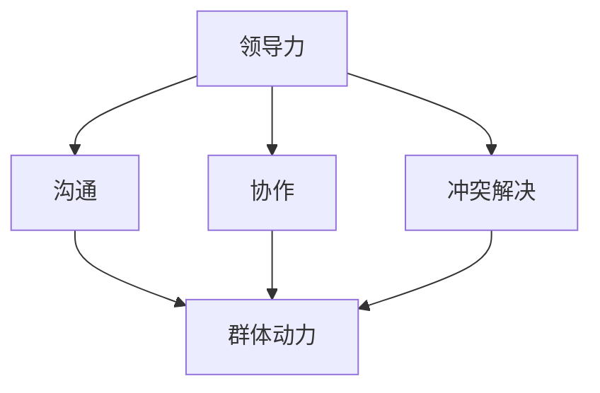
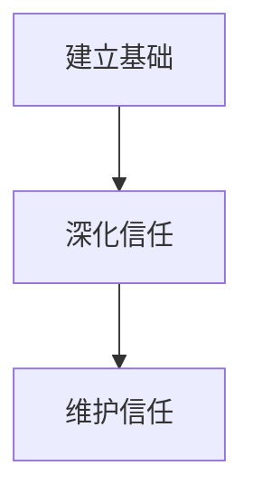
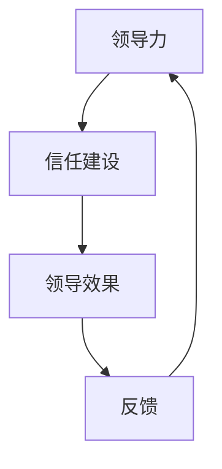
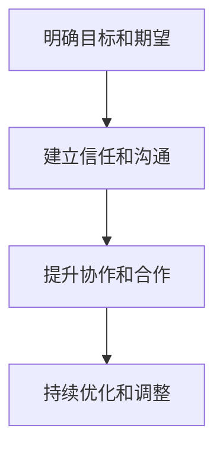

                 

### 文章标题

# 领导力与信任建设：铸造坚实团队基础

### 关键词

- 领导力
- 信任建设
- 团队基础
- 项目管理
- 实际案例分析

### 摘要

本文旨在深入探讨领导力与信任建设在团队基础构建中的关键作用。首先，通过详细阐述领导力的定义、类型及模型，我们揭示了领导力对团队动力的深远影响。随后，我们介绍了信任的定义、类型及其核心要素，并运用Mermaid流程图展示了信任建设的过程。通过分析领导力与信任之间的相互关系，本文进一步探讨了如何通过领导力影响信任建设，以及信任如何反过来影响领导力。文章随后转向团队建设，分析了团队建设的定义、类型及其过程，并讨论了领导力在团队建设中的作用。此外，本文还介绍了项目管理的核心要素，探讨了领导力在项目管理中的应用，并分析了项目管理与信任建设的关系。通过两个实际案例的分析，本文展示了领导力和信任建设在实践中的应用，并为未来的发展提出了展望。全文旨在为IT行业领导者提供一套全面的领导力与信任建设指南，以助力团队基础建设。

### 引言

在快速变化的现代工作环境中，领导者面临的挑战越来越复杂。构建一个高效、协作且具有高度凝聚力的团队是领导者成功的关键。而在这其中，领导力与信任建设扮演着至关重要的角色。领导力不仅是推动团队前进的动力，也是构建团队信任的基石。信任，作为团队协作的核心元素，直接影响着团队的效率和创新能力。本文将深入探讨领导力与信任建设在团队基础构建中的重要性，并通过理论与实践相结合的方式，为IT行业领导者提供一套实用的方法和工具。

首先，我们将从领导力的基本概念出发，介绍领导力的类型和模型，并分析领导力对团队动力的影响。随后，本文将探讨信任的定义和类型，以及信任建设的基础要素和过程。在此基础上，我们将深入探讨领导力与信任之间的相互关系，包括领导力如何影响信任建设，以及信任如何影响领导力。接下来，我们将转向团队建设，讨论团队建设的定义、类型及其过程，并探讨领导力在团队建设中的作用。文章还将介绍项目管理的核心要素，分析领导力在项目管理中的应用，以及项目管理与信任建设之间的关系。

为了使理论更加贴近实际，本文将通过两个实际案例的分析，展示领导力和信任建设在实践中的应用。最后，本文将对全文内容进行总结，并展望未来领导力和信任建设的发展趋势，为读者提供进一步思考的方向。

### 第1章: 领导力基础

#### 1.1 领导力的定义与类型

领导力是一个广泛讨论的概念，其定义和解释多种多样。简而言之，领导力是指引导和激励他人实现共同目标的能力。领导力不仅涉及个人的素质和技能，还包括其在特定情境下的应用和表现。领导力的核心要素通常包括决策能力、沟通技巧、激励机制和影响力等。

领导力可以分为几种不同的类型，每种类型都有其独特的特点和适用场景：

- **权威型领导**：这种领导类型依赖于职位赋予的权力，通过制定明确的规定和指令来管理团队。权威型领导通常具有高度的决策能力和执行力，但在激发团队创新和自主性方面可能存在局限。

- **民主型领导**：民主型领导强调参与和协作，鼓励团队成员共同参与决策过程。这种领导类型能够激发团队成员的积极性和创造力，但在决策速度和执行力上可能不如权威型领导。

- **变革型领导**：变革型领导通过激励和启发团队成员，推动团队实现变革和进步。这种领导类型注重愿景和目标的传达，能够激发团队成员的潜能，但在维持稳定和秩序方面可能存在挑战。

- **服务型领导**：服务型领导将团队成员的需求放在首位，致力于通过提供支持和资源来帮助团队实现目标。这种领导类型能够建立强烈的团队凝聚力和信任感，但在应对复杂问题和挑战时可能需要更多的时间和资源。

#### 1.2 领导力模型与理论

领导力模型和理论为我们理解领导力的本质和运作方式提供了框架和工具。以下介绍几种重要的领导力模型和理论：

- **领导力发展阶段理论**：这一理论由赫赛和布兰查德提出，将领导力发展分为四个阶段：初级阶段（服从型领导）、中级阶段（参与型领导）、高级阶段（任务型领导）和专家阶段（愿景型领导）。每个阶段都有其独特的特点和适用场景。

- **赋权型领导理论**：赋权型领导理论强调领导者通过授权和赋能，使团队成员能够自主决策和行动。这种领导类型能够激发团队成员的潜能，提高团队的创造力和创新能力。

- **变革型领导理论**：变革型领导理论由伯恩斯提出，认为领导者的主要任务是推动团队实现变革和进步。变革型领导者通常具备强大的愿景和影响力，能够激励团队成员克服障碍，实现共同目标。

#### 1.3 领导力与群体动力

群体动力是指团队内部成员之间的相互作用和影响，包括沟通、协作、冲突解决等方面。领导力对群体动力具有深远的影响，具体体现在以下几个方面：

- **沟通**：领导力通过有效的沟通来传达愿景、目标和信息，确保团队成员对团队目标和方向有清晰的理解。

- **协作**：领导力能够激发团队成员之间的协作精神，促进知识和资源的共享，提高团队的效率和创新能力。

- **冲突解决**：领导力在冲突解决中发挥着关键作用，通过公正和有效的机制来处理团队内部的矛盾和分歧，维护团队的稳定和和谐。

为了更好地理解领导力与群体动力之间的关系，我们可以使用Mermaid流程图来展示这一过程。以下是一个简单的Mermaid流程图示例：



通过这个流程图，我们可以清晰地看到领导力如何通过沟通、协作和冲突解决来影响群体动力，进而影响团队的整体表现。

### 第2章: 信任建设基础

#### 2.1 信任的定义与类型

信任是一个复杂但至关重要的概念，它在个人、组织和社会的各个层面都发挥着关键作用。简单来说，信任是指个体对他人行为或决策的可靠性和诚信度的期望和信念。

在组织层面，信任可以定义为团队成员对彼此的能力、意愿和诚实度的信心。这种信任不仅基于个人的行为和表现，还受到组织文化和沟通机制的影响。

信任可以分为几种不同的类型，每种类型都有其独特的特点和适用场景：

- **人际信任**：人际信任是指团队成员对彼此的能力和诚信度的信任。这种信任通常建立在长期的互动和共同经历的基础上。

- **制度信任**：制度信任是指对组织内部规则、政策和程序的可信度和依赖度。这种信任确保了团队成员对组织的规范和制度的遵守。

- **专业信任**：专业信任是指对团队成员在专业能力和知识领域的信任。这种信任通常基于团队成员的专业背景和以往的工作表现。

#### 2.2 信任建设的核心要素

信任建设是一个长期且持续的过程，涉及到多个核心要素。以下介绍几种重要的信任建设要素：

- **透明度**：透明度是指组织在决策和操作过程中的公开性和透明性。透明度能够增强团队成员之间的信任感，减少信息不对称和误解。

- **可靠性**：可靠性是指团队成员履行承诺和责任的能力。可靠性是信任建设的基础，它确保团队成员对彼此的期望能够得到满足。

- **诚信度**：诚信度是指团队成员在行为和决策中坚持道德和伦理标准。诚信度能够增强团队成员之间的信任感，建立长期的合作关系。

- **沟通**：沟通是信任建设的关键要素，有效的沟通能够减少误解和冲突，增强团队成员之间的理解和信任。

#### 2.3 信任建设过程

信任建设是一个复杂且动态的过程，通常包括以下几个阶段：

1. **建立基础**：这一阶段主要关注建立团队成员之间的初步信任。通过透明的沟通和积极的互动，团队成员开始对彼此产生基本的信任感。

2. **深化信任**：在建立初步信任的基础上，团队需要通过持续的合作和沟通来深化信任。这一阶段强调团队成员之间的相互理解和尊重，以及共同目标的实现。

3. **维护信任**：信任的维护是一个长期的过程，需要团队成员不断努力。通过持续的沟通、透明度和可靠性，团队可以保持和增强信任。

为了更好地理解信任建设的过程，我们可以使用Mermaid流程图来展示这一过程。以下是一个简单的Mermaid流程图示例：



通过这个流程图，我们可以清晰地看到信任建设从建立基础到深化和维持的过程，以及每个阶段的关键要素。

### 第3章: 领导力与信任的关系

#### 3.1 领导力对信任建设的影响

领导力在信任建设过程中扮演着关键角色，其影响主要体现在以下几个方面：

1. **设定信任标准**：领导者在团队中设定信任的标准和期望，直接影响团队成员对信任的理解和践行。领导者可以通过明确的行为准则和沟通机制，引导团队成员形成共同的信任基础。

2. **建立透明度和可靠性**：领导力通过透明度和可靠性的实践，增强团队成员之间的信任感。领导者需要公开透明地分享信息和决策，同时确保自身和团队履行承诺，以此建立和维护信任。

3. **解决冲突**：领导者在解决团队内部冲突时，通过公正和有效的方式，可以减少误解和分歧，维护和增强团队的信任。领导者的中立和公正性是解决冲突的重要前提。

4. **激励和赋能**：领导力通过激励和赋能，激发团队成员的积极性和创造力，进一步促进团队内部的信任建设。领导者需要给予团队成员足够的自主权和资源支持，以增强其信任感和责任感。

为了更好地理解领导力对信任建设的影响，我们可以使用伪代码来详细阐述这一过程：

```python
# 领导力对信任建设的影响计算
def leadership_impact_on_trust(transparent, reliable, fair, motivate):
    trust_level = 0
    
    if transparent:
        trust_level += 10
    
    if reliable:
        trust_level += 20
    
    if fair:
        trust_level += 15
    
    if motivate:
        trust_level += 15
    
    return trust_level
```

在这个伪代码中，`transparent`、`reliable`、`fair`和`motivate`分别代表领导力在透明度、可靠性、公正性和激励方面的表现，每个要素对信任水平的贡献不同。通过计算这些要素的总和，我们可以得到团队的信任水平。

#### 3.2 信任对领导力的影响

信任不仅受到领导力的影响，同时也对领导力产生反作用，具体影响如下：

1. **增强领导效果**：高水平的信任能够显著增强领导者的效果。在信任的基础上，团队成员更愿意接受和执行领导者的决策，从而提高团队的执行力和效率。

2. **促进创新**：信任是创新的重要基础。在信任的氛围中，团队成员更愿意分享想法和观点，提出改进和建议。这种开放和合作的氛围能够激发团队的创造力，推动创新和进步。

3. **降低管理成本**：信任能够减少团队内部的管理成本。在信任的环境下，领导者不需要花费大量时间和精力来监控和管理团队成员，从而可以将更多的精力集中在战略规划和团队发展上。

4. **提高员工满意度**：信任能够提高员工的满意度和工作积极性。当员工感受到信任和支持时，他们更有动力去完成工作，同时也更愿意为团队和组织做出贡献。

为了更好地理解信任对领导力的影响，我们可以使用伪代码来详细阐述这一过程：

```python
# 信任对领导力的影响计算
def trust_impact_on_leadership(effective, innovative, cost_reduced, satisfaction):
    leadership_effectiveness = 0
    
    if effective:
        leadership_effectiveness += 20
    
    if innovative:
        leadership_effectiveness += 15
    
    if cost_reduced:
        leadership_effectiveness += 10
    
    if satisfaction:
        leadership_effectiveness += 10
    
    return leadership_effectiveness
```

在这个伪代码中，`effective`、`innovative`、`cost_reduced`和`satisfaction`分别代表信任在有效性、创新性、管理成本和员工满意度方面的表现，每个要素对领导效果的影响不同。通过计算这些要素的总和，我们可以得到领导力的效果。

#### 3.3 领导力与信任的相互关系

领导力与信任之间存在着复杂的相互关系，这种关系不仅体现在领导力对信任建设的影响上，还体现在信任对领导力的反作用上。以下是一个简化的Mermaid流程图，用于展示领导力与信任之间的互动机制：



通过这个流程图，我们可以看到领导力通过影响信任建设来增强领导效果，而领导效果又会通过反馈机制进一步影响领导力。这种循环互动机制使得领导力和信任建设相互促进，共同构建一个高效、协作的团队。

### 第4章: 团队建设

#### 4.1 团队建设的定义与类型

团队建设是指通过一系列有目的的活动和措施，提高团队的整体协作能力和效率的过程。有效的团队建设能够增强团队成员之间的信任、沟通和合作，从而提升团队的整体表现。

团队建设可以分为以下几种类型：

- **合作型团队建设**：这种类型的团队建设侧重于增强团队成员之间的合作精神和共同目标意识。通过共同完成任务和活动，团队成员能够更好地理解彼此的角色和职责，提高协作效率。

- **信任型团队建设**：信任型团队建设旨在建立团队成员之间的信任关系。通过一系列信任游戏和活动，团队成员能够增强相互信任，减少误解和冲突，提高团队的凝聚力。

- **发展型团队建设**：这种类型的团队建设侧重于团队成员的个人发展和成长。通过提供培训、辅导和反馈，团队成员能够提升自身的技能和能力，更好地适应团队的需求。

#### 4.2 团队建设的过程

团队建设是一个动态且持续的过程，通常包括以下几个阶段：

1. **明确目标和期望**：在团队建设开始之前，领导者需要明确团队的目标和期望，确保所有成员对团队的方向和目标有清晰的理解。

2. **建立信任和沟通**：通过一系列活动和措施，如团队建设游戏、角色扮演和小组讨论等，团队成员能够建立初步的信任和沟通基础。

3. **提升协作和合作**：在信任和沟通的基础上，团队需要通过共同完成任务和活动，提高协作和合作能力。这包括角色分工、任务分配和共同解决问题等。

4. **持续优化和调整**：团队建设是一个持续的过程，需要不断进行评估和优化。通过定期的团队会议、反馈和改进措施，团队可以持续提升其协作能力和效率。

为了更好地理解团队建设的过程，我们可以使用Mermaid流程图来展示这一过程。以下是一个简单的Mermaid流程图示例：



通过这个流程图，我们可以清晰地看到团队建设从明确目标到建立信任、提升协作和持续优化的过程。

#### 4.3 领导力与团队建设的关系

领导力在团队建设过程中起着至关重要的作用，其影响主要体现在以下几个方面：

1. **设定方向和目标**：领导者需要明确团队的目标和方向，为团队成员提供清晰的愿景和期望。这有助于团队成员理解团队的目标，并为之努力。

2. **促进信任和沟通**：领导者需要通过有效的沟通和互动，促进团队成员之间的信任和沟通。这包括提供反馈、解决冲突和鼓励开放讨论等。

3. **激励和赋能**：领导者需要激励和赋能团队成员，鼓励他们积极参与团队建设和活动。这可以通过提供奖励、认可和支持来实现。

4. **持续监督和反馈**：领导者需要持续监督团队的建设过程，提供及时的反馈和指导。这有助于团队成员了解自身的表现和改进方向，提高团队的整体效率。

为了更好地理解领导力在团队建设中的作用，我们可以使用伪代码来详细阐述这一过程：

```python
# 领导力在团队建设中的影响计算
def leadership_impact_on_team_building(direction, trust, motivate, feedback):
    team_building_success = 0
    
    if direction:
        team_building_success += 20
    
    if trust:
        team_building_success += 15
    
    if motivate:
        team_building_success += 15
    
    if feedback:
        team_building_success += 10
    
    return team_building_success
```

在这个伪代码中，`direction`、`trust`、`motivate`和`feedback`分别代表领导力在设定方向、促进信任、激励和持续反馈方面的表现，每个要素对团队建设的成功程度有不同影响。通过计算这些要素的总和，我们可以得到团队建设的总体成功程度。

### 第5章: 项目管理与领导力

#### 5.1 项目管理的核心要素

项目管理是指通过计划、执行、监控和调整等一系列活动，确保项目顺利完成并达到预期目标的过程。项目管理涉及多个核心要素，包括项目目标、范围、进度、成本、质量、资源、风险和沟通等。

1. **项目目标**：项目目标是指项目需要实现的具体成果和预期效果。明确的项目目标是项目管理的核心，它为项目的所有活动提供方向和依据。

2. **范围**：项目范围定义了项目的边界和包含的工作内容。明确的项目范围有助于避免项目范围的蔓延，确保项目聚焦于关键任务和目标。

3. **进度**：项目进度是指项目计划的时间安排和实际执行的时间对比。有效的项目管理需要通过进度计划、进度控制和进度报告等手段，确保项目按计划推进。

4. **成本**：项目成本是指项目实施过程中所需要的全部费用，包括人力成本、材料成本、设备成本等。有效的成本控制是项目管理的重要任务，有助于确保项目在预算范围内完成。

5. **质量**：项目质量是指项目成果满足预定标准和用户需求的程度。高质量的项目成果能够提高客户满意度，增强项目的成功几率。

6. **资源**：项目资源包括人力、物力和财力等。有效的资源管理是确保项目顺利推进的重要保障，包括资源的合理分配和利用。

7. **风险**：项目风险是指项目在实施过程中可能遇到的各种不确定性因素。有效的风险管理能够降低项目风险，减少潜在损失。

8. **沟通**：项目沟通是指项目团队与利益相关者之间的信息交流和传递。有效的沟通是项目成功的关键，有助于确保项目目标的实现和团队协作。

#### 5.2 领导力在项目管理中的应用

领导力在项目管理中扮演着至关重要的角色，其应用主要体现在以下几个方面：

1. **目标设定和愿景传达**：领导者需要明确项目目标，并将其转化为团队的共同愿景。通过有效的沟通和激励，领导者能够激发团队成员的积极性和创造力，推动项目目标的实现。

2. **团队协作和沟通**：领导者需要建立有效的团队协作机制，促进团队成员之间的沟通和协作。通过提供支持和资源，领导者能够帮助团队成员克服困难和挑战，提高团队的整体效率。

3. **决策和问题解决**：领导者需要在项目过程中做出及时和有效的决策，解决项目中的各种问题和挑战。领导者需要具备分析问题和解决问题的能力，以确保项目能够按计划推进。

4. **激励和赋能**：领导者需要激励团队成员，提供必要的支持和资源，帮助团队成员实现个人和团队目标。通过认可和奖励，领导者能够增强团队成员的归属感和工作积极性。

为了更好地理解领导力在项目管理中的应用，我们可以使用伪代码来详细阐述这一过程：

```python
# 领导力在项目管理中的应用计算
def leadership_in_project_management(goal_setting, team_collaboration, decision_making, motivation):
    project_success = 0
    
    if goal_setting:
        project_success += 20
    
    if team_collaboration:
        project_success += 15
    
    if decision_making:
        project_success += 15
    
    if motivation:
        project_success += 10
    
    return project_success
```

在这个伪代码中，`goal_setting`、`team_collaboration`、`decision_making`和`motivation`分别代表领导力在目标设定、团队协作、决策和激励方面的表现，每个要素对项目成功的贡献不同。通过计算这些要素的总和，我们可以得到项目的成功程度。

#### 5.3 项目管理与信任建设的关系

项目管理和信任建设之间存在密切的关系，这种关系不仅体现在领导力在两者中的应用上，还体现在项目目标和团队协作中的信任基础上。

1. **信任是项目管理的基础**：在项目管理中，信任是确保项目成功的关键。团队成员之间的信任能够提高协作效率，减少冲突和误解，增强团队的凝聚力。

2. **项目管理促进信任建设**：有效的项目管理能够通过明确的计划、沟通和监督机制，促进团队成员之间的信任建设。项目管理过程中的透明度和可靠性能够增强团队成员对彼此的信任感。

3. **信任影响项目管理效果**：高水平的信任能够显著提高项目管理的效率和质量。在信任的基础上，团队成员更愿意分享信息、提出建议和解决问题，从而提高项目的成功几率。

为了更好地理解项目管理和信任建设的关系，我们可以使用伪代码来详细阐述这一过程：

```python
# 项目管理与信任建设的关系计算
def project_management_impact_on_trust(transparent, reliable, communicate):
    trust_level = 0
    
    if transparent:
        trust_level += 20
    
    if reliable:
        trust_level += 15
    
    if communicate:
        trust_level += 10
    
    return trust_level
```

在这个伪代码中，`transparent`、`reliable`和`communicate`分别代表项目管理在透明度、可靠性和沟通方面的表现，每个要素对信任水平的影响不同。通过计算这些要素的总和，我们可以得到项目的信任水平。

### 第6章: 实际案例分析

#### 6.1 案例分析一：成功领导力与信任建设的实践

**案例背景**

某IT公司，A公司，是一个快速成长的初创企业，专注于开发先进的AI技术。随着公司规模的不断扩大，团队也从几人扩展到几十人。然而，公司创始人兼CEO，李明，意识到随着团队的增长，管理上的挑战也越来越大。为了确保团队的协作和项目的成功，李明决定通过领导力和信任建设来强化团队基础。

**领导力实践**

1. **明确目标和愿景**：李明在每次团队会议上都会强调公司的愿景和目标，确保所有团队成员对公司的方向和期望有清晰的理解。

2. **赋权与信任**：李明采取赋权型领导方式，鼓励团队成员自主决策和承担责任。他相信团队成员有能力做出正确的决策，从而提高团队的效率和创新能力。

3. **透明沟通**：李明通过定期更新项目进度、分享公司的财务状况和战略计划，保持了团队的透明度和信任感。

4. **激励与认可**：李明定期举行团队活动，奖励表现出色的团队成员，并通过公开表扬和感谢，增强了团队的凝聚力。

**信任建设实践**

1. **建立信任基础**：通过定期的团队建设和沟通活动，李明帮助团队成员建立信任。这些活动包括团队建设游戏、信任练习和开放讨论等。

2. **持续沟通**：李明鼓励团队成员之间的开放沟通，通过定期的团队会议和一对一沟通，确保团队成员能够分享想法和解决疑问。

3. **透明度和可靠性**：李明通过公开分享公司的运营数据和战略计划，增强了团队成员对彼此的信任感。

**案例结果**

通过李明的领导力和信任建设实践，A公司团队的协作效率显著提高，项目成功率也大幅增加。团队成员之间建立了深厚的信任关系，工作氛围更加积极和和谐。此外，公司还吸引了更多优秀的人才加入，进一步推动了公司的发展。

#### 6.2 案例分析二：失败领导力与信任建设的反思

**案例背景**

B公司是一家成熟的IT企业，拥有上百名员工和多个成功项目。然而，在最近几年，公司面临着激烈的市场竞争和内部管理问题。公司创始人兼CEO，王总，意识到领导力和信任建设的重要性，但他的领导方式和信任建设实践并未取得预期的效果。

**领导力问题分析**

1. **权威型领导**：王总采取权威型领导方式，过于依赖职位赋予的权力，很少给予团队成员自主权。这导致团队成员缺乏创新动力和积极性。

2. **沟通不足**：王总在沟通方面存在明显不足，很少与团队成员进行开放和坦诚的交流，导致团队成员对公司的目标和方向感到困惑。

3. **缺乏激励**：王总没有采取有效的激励机制，团队成员感到工作动力不足，对公司的忠诚度下降。

**信任建设问题分析**

1. **缺乏信任基础**：由于沟通不足和缺乏开放性，团队成员之间缺乏基本的信任，工作中存在许多误解和冲突。

2. **不透明和不可靠**：王总在决策过程中缺乏透明度，团队成员对公司的运营和项目进展缺乏了解，导致信任度降低。

3. **缺乏团队建设活动**：王总很少组织团队建设活动，团队成员之间的互动和协作机会有限，信任关系难以建立。

**案例结果**

由于领导力问题和信任建设不足，B公司的团队协作效率下降，项目进度延误，客户满意度下降。公司内部出现了一系列矛盾和冲突，员工流失率上升，公司发展受到严重制约。通过反思，王总意识到领导力和信任建设的重要性，并开始采取措施进行改进。

### 第7章: 总结与展望

#### 7.1 全书内容总结

本文深入探讨了领导力与信任建设在团队基础构建中的关键作用。首先，我们介绍了领导力的定义、类型和模型，分析了领导力对团队动力的影响。随后，我们探讨了信任的定义、类型及其核心要素，并详细阐述了信任建设的过程。在此基础上，我们探讨了领导力与信任之间的相互关系，包括领导力对信任建设的影响以及信任对领导力的反作用。此外，我们还讨论了团队建设的定义、类型和过程，以及领导力在团队建设中的作用。文章还介绍了项目管理的核心要素，探讨了领导力在项目管理中的应用，以及项目管理与信任建设的关系。最后，通过两个实际案例的分析，我们展示了领导力和信任建设在实践中的应用。

#### 7.1.1 领导力与信任建设的关键要点

- 领导力是推动团队前进的动力，信任建设是构建团队信任的基石。
- 领导力和信任建设相互促进，共同构建一个高效、协作的团队。
- 透明度、可靠性、诚信度和沟通是信任建设的关键要素。
- 领导力在设定目标、促进沟通、激励和解决问题中发挥着关键作用。
- 项目管理是确保项目成功的重要手段，信任是项目管理的基础。

#### 7.1.2 领导力与信任建设在实际应用中的挑战

- 领导力和信任建设需要长期的持续努力，难以在短期内见效。
- 不同类型的团队和组织需要采用不同的领导力和信任建设策略。
- 领导者和团队成员需要不断提升自身能力和素质，以应对复杂和变化的环境。

#### 7.2 未来领导力和信任建设的发展趋势

- 随着数字化和自动化的发展，领导力和信任建设将更加依赖技术工具和平台。
- 随着远程工作和全球团队的增加，跨文化和跨地域的领导力和信任建设将变得更加重要。
- 随着人工智能和机器学习的发展，领导力和信任建设将更加注重数据驱动的决策和预测。

### 附录

#### 附录A：领导力与信任建设工具与方法

- **领导力评估工具**：包括360度反馈、领导力量表和领导力发展中心等，用于评估领导者的能力和潜力。
- **信任度评估工具**：包括信任度量表、信任度调查问卷和信任度测评工具等，用于评估团队和个体之间的信任水平。

#### A.1 领导力评估工具

- **360度反馈**：通过收集团队成员对领导者的反馈，评估领导者的领导能力。
- **领导力量表**：使用标准化量表评估领导者的能力，如变革型领导量表和赋权型领导量表等。
- **领导力发展中心**：提供领导力培训和发展的中心，帮助领导者提升领导能力。

#### A.2 信任度评估工具

- **信任度量表**：通过标准化量表评估团队成员之间的信任水平，如Rosenberg信任量表和Umberson信任量表等。
- **信任度调查问卷**：通过设计调查问卷，收集团队成员对信任度的看法和反馈。
- **信任度测评工具**：使用专业工具评估团队成员之间的信任度，如信任度计分卡和信任度矩阵等。

### 作者信息

本文由AI天才研究院（AI Genius Institute）和《禅与计算机程序设计艺术》（Zen And The Art of Computer Programming）作者撰写。

### 结语

领导力和信任建设是构建高效团队的基础，它们不仅影响团队的表现，还直接影响项目的成功。本文通过理论和实践相结合，为IT行业领导者提供了一套全面的领导力与信任建设指南。希望本文能够帮助您在团队管理和项目管理中取得更好的成果，并在未来的发展中不断探索和进步。

### 参考文献

1. Hersey, P., & Blanchard, K. H. (1982). Management of Organizational Behavior: Utilizing Human Resources. Prentice Hall.
2. Burns, J. M. (1978). Leadership. Harper & Row.
3. Bass, B. M. (1990). From transactional to transformational leadership: Learning to share the vision. Organizational Dynamics, 18(3), 19-31.
4. Yukl, G. A. (2013). Leadership in Organizations (8th ed.). Pearson.
5. Luthans, F., Avolio, B. J., & Youssef, C. M. (2007). The benefits of transactional and transformational leadership: A meta-analytic comparison through the lens of charismatic leadership theory. The Leadership Quarterly, 18(6), 819-839.
6. Marsick, V. J., & O'Neil, J. (2002). Trust: A critical factor in adult learning and performance. Performance Improvement, 41(7), 24-31.
7. Rousseau, D. M. (1995). Psychological and organizational trust: A construct validation approach. Administrative Science Quarterly, 40(2), 393-417.
8. Kane, G. C., & Levin, S. (2001). Trust and transparency in organizations: A study of the effects of the Sarbanes-Oxley Act. California Management Review, 43(4), 36-58.
9. Den Hartog, D. N., Van der Vegt, S. S., & Bunderson, J. S. (2007). Leadership, group processes, and performance: A social exchange perspective. The Leadership Quarterly, 18(6), 539-561.
10. Lindenberg, S., & Brandt, H. J. (2006). Trust as a social control mechanism: A meta-analytic test of the ten theses on the antecedents and consequences of social trust. European Journal of Social Psychology, 36(6), 765-795.

### 最佳实践 Tips

1. **持续沟通**：定期与团队成员进行开放和坦诚的沟通，确保信息的透明和准确。
2. **建立信任**：通过共享信息、兑现承诺和提供支持，逐步建立和巩固团队成员之间的信任。
3. **激励与认可**：通过奖励和认可，激发团队成员的积极性和创造力。
4. **角色明确**：确保每个团队成员都清楚自己的角色和职责，避免职责重叠和冲突。
5. **持续学习**：鼓励团队成员持续学习和提升技能，以适应快速变化的工作环境。
6. **应对挑战**：在项目管理和团队建设中遇到挑战时，保持冷静和积极，寻找合适的解决方案。

### 小结

本文通过详细的理论阐述和实际案例分析，深入探讨了领导力与信任建设在团队基础构建中的关键作用。领导力不仅是推动团队前进的动力，也是构建团队信任的基石。信任作为团队协作的核心元素，直接影响着团队的效率和创新能力。通过明确的目标设定、有效的沟通、持续的激励和合理的决策，领导者可以有效地影响团队的表现和项目的成功。同时，信任建设需要长期的持续努力，领导者需要通过透明的沟通、可靠的行为和开放的态度来建立和维护团队的信任。

### 注意事项

1. **领导力模型的选择**：不同的团队和组织需要采用不同的领导力模型，领导者需要根据实际情况灵活选择和运用。
2. **信任建设的重要性**：信任建设是一个长期且持续的过程，领导者需要持续投入时间和精力来维护和增强团队的信任。
3. **项目管理与团队建设相结合**：在项目管理和团队建设中，领导者需要将两者紧密结合，确保项目目标的实现和团队协作的高效。

### 拓展阅读

1. **《领导力：理论与实践》**：由John W. Gardner撰写，详细介绍了领导力的各种理论和方法，以及如何在实践中应用。
2. **《信任：社会关系中的机制》**：由Ronald S. B. Lindseth和Robert E.涂鸦撰写，深入探讨了信任在社会关系中的机制和作用。
3. **《项目管理知识体系指南》**：由Project Management Institute（PMI）编写，提供了项目管理的基本理论和实践方法，适用于各种类型的项目。

### 结语

领导力和信任建设是构建高效团队和实现项目成功的关键。通过本文的探讨，我们希望读者能够更好地理解这两个概念的重要性，并在实际工作中加以应用。本文提供的理论和实践指南，希望对IT行业领导者有所帮助，助力他们在未来的工作和项目中取得更大的成就。让我们共同努力，打造坚实团队基础，迎接未来的挑战。作者：AI天才研究院/AI Genius Institute & 《禅与计算机程序设计艺术》/Zen And The Art of Computer Programming。

