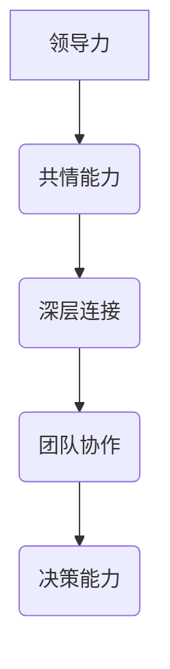

                 


为了撰写一篇关于《领导力与共情能力：建立深层连接的技巧》的技术博客文章，我们可以遵循以下步骤进行思考：

### 第一步：确定文章结构

**文章结构设计**是确保文章条理清晰、内容全面的关键。我们可以设计以下结构：

1. 引言
   - 背景介绍
   - 文章目的
2. 领导力概述
   - 定义与重要性
   - 领导力与管理的区别
   - 领导力的四个层次
3. 共情能力
   - 理论依据
   - 发展与实践
   - 应用场景
4. 深层连接技巧
   - 信任的建立与维护
   - 情感共鸣
   - 深层连接策略
5. 实战案例分析
6. 总结与展望
7. 作者信息

### 第二步：核心概念联系与流程图设计

为了帮助读者更好地理解领导力与共情能力之间的关系，我们可以使用**Mermaid 流程图**来展示核心概念之间的关系架构：



### 第三步：伪代码与数学公式讲解

在讲解核心算法原理时，我们可以使用**伪代码**来详细阐述。例如：

```python
# 伪代码：领导力与共情能力评估算法
def leadership_compass(person):
    # 初始化评估得分
    score = 0
    
    # 评估领导力
    score += assess_leadership(person.leadership_skills)
    
    # 评估共情能力
    score += assess_empathy(person.empathy_level)
    
    # 返回最终得分
    return score
```

同时，我们也可以使用**LaTeX格式**的数学公式来详细讲解，例如：

$$
L = f(E, C, D)
$$

其中，$L$ 表示领导力，$E$ 表示共情能力，$C$ 表示深层连接能力，$D$ 表示决策能力。

### 第四步：项目实战与代码案例

为了展示实际应用，我们可以提供一个**项目实战**的案例，包括开发环境的搭建、源代码实现、代码解读与分析等：

```python
# Python 代码：信任评分系统
class TrustScore:
    def __init__(self):
        self.trust_data = []

    def add_score(self, score):
        self.trust_data.append(score)

    def calculate_average(self):
        if not self.trust_data:
            return 0
        return sum(self.trust_data) / len(self.trust_data)
```

### 第五步：总结与展望

在文章的**总结与展望**部分，我们可以对全文的核心内容进行回顾，并提出未来可能的发展方向和建议。

### 第六步：撰写与编辑

最后，我们将所有内容进行撰写与编辑，确保文章的语言流畅、逻辑清晰，并符合markdown格式的要求。

通过以上步骤，我们可以撰写一篇关于《领导力与共情能力：建立深层连接的技巧》的技术博客文章，不仅内容丰富，而且结构严谨，适合读者深入学习和理解。---

### 第2章：领导力的核心概念

#### 2.1 共情能力：理解与连接他人的关键

**共情能力**是指一种深层次的理解他人情感和感知他人经历的能力。在领导力中，共情能力是连接领导者与团队成员的重要纽带，有助于建立信任、促进沟通和增强团队合作。以下是共情能力的几个关键方面：

1. **情感识别**：共情能力的第一步是识别他人的情感状态。这包括观察他人的表情、语调、身体语言和微表情，以及理解这些非语言信号背后的情感含义。

   ```mermaid
   graph TD
   A[情感识别] --> B(表情)
   B --> C(语调)
   C --> D(身体语言)
   D --> E(微表情)
   ```

2. **情感理解**：情感识别之后，领导者需要深入理解这些情感的来源和影响。这要求领导者具备较高的情绪智力，能够从他人的角度思考，感受他人的情绪体验。

   ```mermaid
   graph TD
   A[情感理解] --> B(情绪智力)
   B --> C(同理心)
   C --> D(情感反思)
   ```

3. **情感反应**：在理解他人的情感后，领导者需要适当地做出情感反应。这包括在合适的时机表达同情、支持和鼓励，从而增强团队凝聚力。

   ```mermaid
   graph TD
   A[情感反应] --> B(同情)
   B --> C(支持)
   C --> D(鼓励)
   ```

4. **情感表达**：共情能力不仅要求领导者能够理解他人情感，还需要能够有效表达自己的情感。这有助于建立开放、真诚的沟通环境，促进团队成员之间的信任和互动。

   ```mermaid
   graph TD
   A[情感表达] --> B(开放性)
   B --> C(真诚性)
   C --> D(互动性)
   ```

#### 2.2 沟通技巧：有效沟通与反馈

**沟通技巧**是领导力的重要组成部分，直接影响领导者的影响力、团队协作效果以及组织的整体绩效。以下是几种关键沟通技巧：

1. **明确信息**：领导者需要确保传达的信息清晰、简洁且具有针对性。这包括使用具体、明确的词汇和例子，以及避免使用模糊、含糊的表述。

   ```mermaid
   graph TD
   A[明确信息] --> B(具体化)
   B --> C[针对性]
   ```

2. **积极倾听**：积极倾听不仅仅是听到他人说的话，还包括理解他人的观点、感受和需求。领导者需要展现出耐心、关注和尊重，以便更好地理解他人。

   ```mermaid
   graph TD
   A[积极倾听] --> B(耐心)
   B --> C[关注]
   C --> D[尊重]
   ```

3. **非语言沟通**：非语言沟通包括肢体语言、面部表情、语调等。领导者需要意识到这些非语言信号的重要性，并学会有效地运用它们来增强沟通效果。

   ```mermaid
   graph TD
   A[非语言沟通] --> B(肢体语言)
   B --> C[面部表情]
   C --> D[语调]
   ```

4. **反馈技巧**：有效的反馈是领导者促进团队成长和改进的重要手段。领导者需要学会如何给予建设性、及时的反馈，以便团队成员能够从中受益。

   ```mermaid
   graph TD
   A[反馈技巧] --> B(建设性)
   B --> C[及时性]
   ```

#### 2.3 决策能力：理性与直觉的平衡

**决策能力**是领导者的一项关键技能，关系到组织的成败。有效的决策需要领导者能够在理性与直觉之间找到平衡。

1. **理性分析**：理性分析是指使用逻辑、数据和事实来评估决策的潜在影响。这包括对问题的分析、解决方案的比较以及可能的风险评估。

   ```mermaid
   graph TD
   A[理性分析] --> B(逻辑思考)
   B --> C(数据分析)
   C --> D[风险评估]
   ```

2. **直觉判断**：直觉判断是指领导者基于经验、直觉和感性认识来做出决策。在紧急情况下，直觉可以帮助领导者快速作出决策，避免拖延。

   ```mermaid
   graph TD
   A[直觉判断] --> B(经验)
   B --> C(直觉)
   C --> D[快速反应]
   ```

3. **理性与直觉的平衡**：领导者需要在理性分析和直觉判断之间找到平衡。这要求领导者具备综合分析和快速反应的能力，以便在各种情况下都能做出明智的决策。

   ```mermaid
   graph TD
   A[理性与直觉] --> B(综合分析)
   B --> C[快速反应]
   ```

通过掌握共情能力、沟通技巧和决策能力，领导者可以建立强大的影响力，促进团队的凝聚力和协作，从而实现组织的长期成功。

### 摘要

本文深入探讨了领导力与共情能力在建立深层连接中的关键作用。首先，介绍了领导力的定义、重要性及其与管理的区别，并详细阐述了领导力的四个层次。接着，分析了共情能力的理论依据及其在领导力中的应用，包括情感识别、情感理解、情感反应和情感表达。此外，本文还探讨了沟通技巧，如明确信息、积极倾听、非语言沟通和反馈技巧。最后，文章讨论了决策能力，强调了理性分析与直觉判断的平衡。通过这些核心概念的深入剖析，本文为读者提供了建立深层连接的实用技巧，有助于提升领导力和团队合作效果。关键词：领导力、共情能力、沟通技巧、决策能力、深层连接、团队协作。

---

### 第3章：领导力与组织行为

#### 3.1 组织文化的塑造与维护

**组织文化**是组织中共享的价值观、信念和行为模式，它对员工的行为、态度和工作表现具有深远的影响。一个积极、健康的组织文化能够增强员工的归属感和忠诚度，提高工作效率和创新能力，从而推动组织的长期发展。

**组织文化的塑造**是一个动态过程，需要从以下几个方面进行：

1. **核心价值观的传递**：组织文化需要明确的核心理念和价值观，这些价值观应该是组织创始人和领导者所倡导的，并且能够得到全体员工的认同。通过内部宣传、培训和日常沟通，将核心价值观传递给员工，确保他们能够理解和践行。

2. **领导者的示范作用**：领导者是组织文化的榜样，他们的言行举止对员工的行为模式产生直接影响。领导者需要通过自己的行为来示范组织文化的核心价值观，如诚信、透明、尊重和团队合作等。

3. **激励机制的设计**：激励机制是组织文化塑造的重要手段。通过奖励那些符合组织文化价值观的员工，可以强化这些价值观在组织中的地位，并激励其他员工效仿。

4. **团队建设活动**：团队建设活动有助于增强员工之间的联系，促进相互理解和支持，从而加强组织文化。这些活动可以包括团队建设训练、团队聚会、团队竞赛等。

**组织文化的维护**同样重要，它需要持续的努力和投入：

1. **持续沟通**：组织文化需要通过持续的沟通来维护。领导者需要定期与员工沟通，了解他们的想法和反馈，确保组织文化能够适应外部环境的变化。

2. **培训与发展**：组织应该为员工提供持续的职业培训和发展机会，帮助他们提升技能和知识，从而更好地适应组织文化的需求。

3. **问题解决机制**：当组织文化中出现问题时，需要及时解决。这可能包括处理冲突、纠正不良行为和调整组织结构等。

4. **领导层的支持**：组织文化的维护需要领导层的坚定支持。领导层需要保持对组织文化的关注，并确保组织政策和管理实践与组织文化保持一致。

#### 3.2 团队合作：构建高效的团队

**团队合作**是组织成功的关键，高效的团队能够实现共同目标，克服挑战，提高创新能力和生产力。以下是一些构建高效团队的关键步骤：

1. **明确目标和期望**：团队的目标应该是明确、具体和可衡量的。团队成员需要清楚地知道他们的职责和期望，以便更好地协作。

2. **建立信任**：信任是团队合作的基础。团队成员需要相互信任，相信对方会履行自己的职责。建立信任可以通过开放沟通、共同目标和相互尊重来实现。

3. **分工与合作**：团队成员需要明确自己的角色和职责，并相互协作。分工合理可以确保每个成员都能发挥自己的优势，而合作则能够实现资源的最大化利用。

4. **有效沟通**：沟通是团队合作的核心。团队成员需要能够清晰地表达自己的想法和意见，并且能够有效地倾听他人的观点。有效的沟通可以帮助团队快速解决问题，提高决策质量。

5. **冲突管理**：团队中难免会出现冲突，有效的冲突管理是构建高效团队的关键。团队成员需要学会如何处理冲突，包括沟通、妥协和寻求共识。

6. **激励与支持**：团队成员需要感受到领导者的支持和激励。这可以通过奖励、表彰和提供职业发展机会来实现。

#### 3.3 领导力在变革管理中的应用

**变革管理**是组织持续发展和适应外部环境变化的关键。一个成功的变革需要领导者的有效引导和推动。以下是领导力在变革管理中的应用：

1. **明确变革愿景**：领导者需要清晰地传达变革的愿景和目标，确保所有员工都理解变革的必要性和重要性。

2. **建立变革团队**：领导者可以组建一个专门的变革团队，负责规划、实施和监控变革过程。团队成员可以来自不同部门，以确保变革的全面性和协调性。

3. **激励员工参与**：领导者需要激励员工积极参与变革过程，提供培训和支持，确保员工具备必要的技能和知识来适应变革。

4. **沟通与反馈**：领导者需要定期与员工沟通，了解他们的想法和反馈，解答疑问，并确保员工了解变革的进展和成果。

5. **应对阻力**：变革过程中难免会遇到阻力，领导者需要学会如何应对和解决这些阻力，包括处理员工的恐惧、疑虑和不满。

6. **持续支持**：变革是一个长期的过程，领导者需要持续支持变革，确保变革成果的持续性和有效性。

通过组织文化的塑造与维护、团队合作的高效构建和变革管理的有效应用，领导者可以推动组织的持续发展和成功。

### 摘要

本章深入探讨了领导力在组织行为中的应用，包括组织文化的塑造与维护、团队合作的高效构建和变革管理的有效应用。首先，介绍了组织文化的重要性及其塑造与维护的方法，包括核心价值观的传递、领导者的示范作用和激励机制的设计。接着，探讨了团队合作的关键要素，如明确目标和期望、建立信任、分工与合作、有效沟通和冲突管理。最后，阐述了领导力在变革管理中的应用，包括明确变革愿景、建立变革团队、激励员工参与、沟通与反馈、应对阻力和持续支持。通过这些实践，领导者可以推动组织的持续发展和成功。

---

### 第4章：共情能力的理论依据

#### 4.1 共情心理学基础

**共情能力**是一种心理现象，涉及到个体在情感上与他人产生共鸣的能力。它不仅仅是简单的情感传递，而是涉及到认知、情感和行为三个层面。共情心理学作为研究共情能力的重要领域，为我们理解共情提供了科学基础。

1. **定义与类型**：
   - **情感共情（Affective Empathy）**：个体感受到他人的情绪状态，如同自己体验到一样。这种类型的共情通常发生在亲密关系中，例如父母与子女之间。
   - **认知共情（Cognitive Empathy）**：个体试图理解他人的感受和观点，但并不直接体验这些感受。认知共情更多涉及逻辑思维和推理能力。

2. **共情的发展**：
   - **儿童期**：儿童在早期通过模仿和观察来发展共情能力。父母和照顾者的反应和行为对孩子共情能力的发展起着关键作用。
   - **青少年期**：青少年在自我意识和社会角色的探索过程中，共情能力逐渐成熟。他们开始能够更好地理解复杂情感和社会情境。
   - **成人期**：成人的共情能力通常趋于稳定，但依然可以通过实践和训练得到提升。共情能力在领导力、心理咨询和人际关系中具有重要作用。

3. **共情的研究方法**：
   - **自我报告法**：通过问卷和访谈来评估个体的共情能力，例如梅尔勒姆共情问卷（MEQ）。
   - **生理测量**：使用生理测量工具，如心率变异性（HRV）和皮肤电反应（EDA），来观察个体在共情情境下的生理反应。
   - **神经成像技术**：通过功能性磁共振成像（fMRI）等神经成像技术，研究共情过程中大脑特定区域的激活情况。

#### 4.2 共情与情绪智力

**情绪智力**（Emotional Intelligence，简称EQ）是衡量个体情感管理能力的一个指标，包括自我认知、自我调节、社交技能和同理心等几个关键维度。共情能力是情绪智力的重要组成部分，与情绪智力的关系如下：

1. **自我认知**：共情能力有助于个体更好地理解自己的情感和需求，从而提升自我认知水平。
2. **自我调节**：通过共情，个体能够更有效地管理自己的情绪，减少负面情绪的干扰，提高情绪调节能力。
3. **社交技能**：共情能力是建立和维护人际关系的关键。通过共情，个体能够更好地理解他人，增强沟通能力和人际互动效果。
4. **同理心**：同理心是共情能力的核心，它使个体能够从他人的角度思考，增进相互理解和信任。

#### 4.3 共情能力的重要性

**共情能力**在多个领域都具有重要意义：

1. **心理健康**：共情能力有助于减少心理压力，提高心理健康水平。通过共情，个体能够更好地应对压力和挑战，增强心理韧性。
2. **人际关系**：共情能力是建立和维护健康人际关系的基础。它能增强亲密关系、友谊和工作关系的质量。
3. **领导力**：共情能力是领导者不可或缺的特质，有助于建立信任、促进团队合作和提高领导效能。
4. **教育**：教师在教学过程中运用共情能力，能够更好地理解学生需求，提供个性化的教育支持，提高教学效果。

通过理解共情心理学的理论基础，我们可以更深入地认识到共情能力在各个领域的价值，并探索如何在实际生活中提升和发展这种能力。

### 摘要

本章深入探讨了共情能力的心理学基础，包括定义、类型、发展过程和研究方法。同时，分析了共情能力与情绪智力之间的关系，以及共情能力在心理健康、人际关系、领导力和教育等领域的重要性。通过这些分析，我们认识到共情能力不仅是情感管理的关键，也是建立积极人际关系和推动组织发展的重要工具。

---

### 第5章：共情能力的发展与实践

#### 5.1 观察与倾听：共情的第一步

**共情能力**的培养需要从基础做起，首先是**观察与倾听**。观察和倾听是共情能力的基石，通过仔细观察他人的行为和倾听他们的言语，我们可以更好地理解他们的情感和需求。

1. **观察他人的非语言行为**：
   - **面部表情**：面部表情是人类情感传达的主要途径。仔细观察他人的眼睛、眉毛、嘴巴等面部特征，可以捕捉到他们的情绪状态。
   - **身体语言**：身体姿势、手势和眼神等非语言行为也能揭示情感信息。例如，交叉双臂可能表示防御或不安，而开放的姿势则可能表示舒适和接纳。
   - **微表情**：微表情是一种短暂的、几乎无法控制的表情，通常反映了真实的情感。学会识别微表情可以帮助我们更准确地理解他人的情感。

2. **倾听他人的言语**：
   - **理解语境**：在倾听时，要考虑整个对话的语境，包括话题的背景、说话人的语气和情感状态。这有助于我们更全面地理解对方的意思。
   - **提问和确认**：通过提问和确认，我们可以更好地了解对方的观点和感受。例如，可以问：“你现在的感受是什么？”或者“你能告诉我这件事对你意味着什么吗？”这样的问题可以帮助对方更开放地表达自己。

通过观察和倾听，我们可以捕捉到他人的情感信号，为进一步的共情打下基础。

#### 5.2 非语言沟通：肢体语言与表情识别

**非语言沟通**在共情过程中起着至关重要的作用。它不仅包括肢体语言，还包括面部表情、声音的语调和节奏等。学会识别和理解这些非语言信号，可以帮助我们更好地与他人建立情感连接。

1. **肢体语言**：
   - **开放与封闭的姿势**：开放的身体姿势，如双手放置在桌面上、正面面对对方，通常表示舒适和接纳。相反，封闭的姿势，如双手交叉在胸前、背部朝向对方，可能表示防御或不愿意交流。
   - **手势**：手势可以增强言语信息，例如，拍拍对方的肩膀表示支持和鼓励，而挥动手臂则可能表示愤怒或激动。
   - **眼神接触**：眼神接触可以传达出许多信息，包括信任、尊重和兴趣。适度的眼神接触可以增强沟通的亲密感。

2. **面部表情**：
   - **微笑**：微笑是一种普遍的积极信号，可以传达友好和接纳。不同的微笑方式，如嘴角上扬、眼睛眯起等，可能代表不同的情感状态。
   - **眼睛的表情**：眼睛可以透露出许多情感信息，如悲伤（眼睛湿润）、恐惧（瞳孔放大）或喜悦（眼睛闪烁）。

3. **声音的语调和节奏**：
   - **语调**：声音的语调可以改变信息的含义。例如，语调提高可能表示兴奋或愤怒，而语调降低则可能表示平静或沮丧。
   - **节奏**：说话的节奏和停顿可以传达情感信息。快速而断断续续的说话可能表示紧张或焦虑，而缓慢而有节奏的说话则可能表示冷静和自信。

通过识别和理解这些非语言信号，我们可以更准确地解读他人的情感状态，从而更有效地进行共情。

#### 5.3 培养共情习惯：日常生活中的实践

**共情能力的培养**需要持之以恒的实践。以下是一些建议，帮助我们在日常生活中培养共情习惯：

1. **练习耐心倾听**：在日常生活中，我们可以通过耐心倾听家人、朋友或同事的故事来培养共情能力。不仅要听他们说什么，还要注意他们的非语言信号，如面部表情、身体语言和语调。

2. **换位思考**：在与他人交流时，尝试从对方的角度思考问题。想象自己处于对方的位置，可能会有不同的感受和需求。这种换位思考有助于我们更好地理解他人的情感和需求。

3. **表达同情和理解**：在与他人交流时，积极表达同情和理解。可以说：“我理解你的感受”或者“我可以想象这对你来说有多么困难”。这样的表达可以增强对方的情感连接感。

4. **反思自己的行为**：定期反思自己在与他人互动中的行为，思考是否做到了真正的共情。如果有不足之处，可以通过调整自己的沟通方式和行为来改进。

通过在日常生活中的持续实践，我们可以逐步提升共情能力，更好地理解他人，建立更深厚的人际关系。

### 摘要

本章介绍了共情能力的发展与实践，重点强调了观察与倾听、非语言沟通在日常生活中的应用。通过观察他人的非语言行为和倾听他们的言语，我们可以捕捉到他人的情感信号。同时，了解和识别肢体语言、面部表情和声音语调等非语言信号，有助于我们更好地解读他人的情感状态。培养共情习惯需要持之以恒的实践，通过耐心倾听、换位思考、表达同情和理解，以及反思自己的行为，我们可以不断提升共情能力，建立更深厚的人际关系。

---

### 第6章：共情能力在工作中的应用

#### 6.1 领导力与共情：领导者的软实力

**共情能力**在领导力中扮演着至关重要的角色，它被称为领导者的“软实力”。共情能力不仅帮助领导者更好地理解团队成员的情感和需求，还能增强领导者的影响力、促进团队合作和提高组织绩效。

1. **增强影响力**：
   - **信任建设**：共情能力有助于建立信任。通过理解团队成员的情感状态，领导者可以表现出真诚和关怀，从而赢得团队成员的信任。
   - **情感共鸣**：领导者能够与团队成员产生情感共鸣，使他们感到被理解和被关心。这种情感连接可以增强领导者的领导影响力。

2. **促进团队合作**：
   - **团队凝聚力**：共情能力有助于增强团队的凝聚力。通过关注团队成员的情感需求，领导者可以促进团队成员之间的相互理解和支持，从而提高团队的协作效率。
   - **沟通效果**：共情能力使得领导者能够更有效地进行沟通。通过倾听和理解团队成员的观点，领导者可以更准确地传达信息，减少误解和冲突。

3. **提高组织绩效**：
   - **员工满意度**：共情能力有助于提高员工的工作满意度和忠诚度。通过关注员工的需求和情感状态，领导者可以提升员工的工作体验，从而提高组织绩效。
   - **创新与创造力**：共情能力鼓励领导者鼓励团队成员提出新观点和解决方案。领导者通过理解团队成员的情感状态，可以激发他们的创造力和创新精神，从而推动组织的持续发展。

#### 6.2 共情在团队管理中的运用

在团队管理中，**共情能力**的应用有助于提升团队的绩效和成员的工作满意度。以下是一些具体的方法：

1. **关注个体需求**：
   - **个性化关怀**：领导者应该关注每个团队成员的个体需求，包括职业发展、工作环境和个人问题。通过个性化的关怀，领导者可以增强团队成员的归属感和满意度。
   - **情感支持**：在团队成员遇到困难或挫折时，领导者应该提供情感支持。通过倾听和理解，领导者可以帮助团队成员恢复信心，克服困难。

2. **促进开放沟通**：
   - **倾听与反馈**：领导者应该鼓励团队成员表达自己的观点和感受，并认真倾听他们的意见。通过积极的倾听和建设性的反馈，领导者可以建立开放和真诚的沟通环境。
   - **团队会议**：在团队会议中，领导者应该确保每个人都有发言的机会，并尊重每个人的意见。通过开放沟通，团队成员可以更有效地合作，解决团队问题。

3. **激发创新精神**：
   - **鼓励创新**：领导者应该鼓励团队成员提出新的想法和解决方案。通过理解团队成员的情感状态，领导者可以激发他们的创造力和创新精神。
   - **支持试验**：领导者应该支持团队成员进行试验和尝试，即使结果可能不是理想的。这种支持可以激发团队成员的冒险精神，推动组织的创新和发展。

4. **培养团队合作精神**：
   - **团队建设活动**：领导者可以通过组织团队建设活动，如团队竞赛、团队培训和团队旅行，增强团队成员之间的联系和合作精神。
   - **共同目标**：领导者应该确保团队成员有共同的目标和愿景。通过共同目标的追求，团队成员可以更紧密地合作，共同克服挑战。

通过共情能力在团队管理中的应用，领导者可以提升团队的凝聚力和协作效率，推动组织的持续发展和成功。

#### 6.3 共情与客户关系管理

在客户关系管理中，**共情能力**同样发挥着重要作用。通过共情，企业可以更好地理解客户的需求和期望，提供个性化的服务，从而提升客户满意度和忠诚度。

1. **理解客户需求**：
   - **深入倾听**：企业应该倾听客户的反馈和意见，通过深入倾听，企业可以更好地理解客户的真实需求。这种理解不仅包括客户的显性需求，还包括他们的隐性需求。
   - **情感共鸣**：企业可以通过共情能力与客户产生情感共鸣，使客户感到被理解和被重视。这种情感连接可以增强客户对企业的信任和忠诚。

2. **提供个性化服务**：
   - **定制化方案**：企业可以根据客户的个性化需求，提供定制化的产品和服务。这种个性化的服务可以提升客户的满意度和忠诚度。
   - **情感关怀**：企业应该关注客户在购买和使用产品过程中的情感体验，提供情感关怀和支持。例如，在客户遇到问题时，及时提供解决方案，并表达同情和理解。

3. **建立长期合作关系**：
   - **信任建设**：共情能力有助于建立信任。通过理解客户的需求和情感状态，企业可以赢得客户的信任，建立长期合作关系。
   - **持续互动**：企业应该与客户保持持续的互动，通过定期沟通和反馈，了解客户的最新需求和期望，不断优化产品和服务。

通过共情能力在客户关系管理中的应用，企业可以提升客户满意度和忠诚度，建立强大的客户基础，推动企业的长期发展。

### 摘要

本章深入探讨了共情能力在工作中的应用，包括领导力与共情、团队管理和客户关系管理。首先，介绍了共情能力在增强领导影响力、促进团队合作和提高组织绩效方面的作用。接着，详细阐述了共情能力在团队管理中的应用，如关注个体需求、促进开放沟通、激发创新精神和培养团队合作精神。最后，探讨了共情能力在客户关系管理中的重要性，如理解客户需求、提供个性化服务和建立长期合作关系。通过这些应用，企业可以提升客户满意度和忠诚度，推动组织的持续发展和成功。

---

### 第7章：建立信任：深层连接的基石

#### 7.1 信任的定义与重要性

**信任**是一种基于信任和依赖的情感纽带，它是指个体对他人的可靠性、诚实性和公正性的信任和信心。在组织和管理领域，信任被视为一种关键资源，它对于团队的协作、决策的有效性以及组织的长期成功具有深远的影响。

**信任的定义**可以从以下几个方面进行理解：

1. **可靠性**：信任首先建立在可靠性的基础上，即个体能够履行承诺和责任。这意味着领导者必须能够遵守承诺、按时完成任务并保持一致性。
2. **诚实性**：诚实性是信任的另一个重要方面。领导者需要诚实地沟通，避免隐瞒信息或提供虚假陈述，这样才能赢得员工的信任。
3. **公正性**：公正性是指领导者对待员工的态度和行为是否公平。领导者需要确保在决策过程中公平对待每个人，不偏袒某些个体或团体。

**信任的重要性**体现在以下几个方面：

1. **团队协作**：信任是团队协作的基础。当团队成员相互信任时，他们更愿意分享信息、知识和资源，从而提高团队的效率和绩效。
2. **决策过程**：信任可以简化决策过程。当团队成员相互信任时，他们更倾向于接受彼此的意见和建议，减少冲突和争论，从而更快地做出决策。
3. **员工满意度**：信任可以提高员工的工作满意度和忠诚度。当员工感受到领导者的信任时，他们更有动力和积极性去完成任务，从而提高整体的工作质量。
4. **组织文化**：信任是建立积极组织文化的关键。一个充满信任的组织文化能够吸引和保留优秀的员工，提高组织的创新能力和竞争力。

#### 7.2 信任的建立与维护

建立和维护信任是一个持续的过程，需要领导者的长期投入和努力。以下是一些关键步骤：

1. **透明沟通**：领导者需要保持沟通的透明性，及时与员工分享信息，确保信息的准确性和一致性。透明沟通有助于减少误解和不确定性，增强员工对领导者的信任。
2. **履行承诺**：领导者必须履行自己的承诺。一旦做出承诺，领导者应该全力以赴去实现它，即使面临困难和挑战。履行承诺能够树立领导者的可靠性，赢得员工的信任。
3. **公正行为**：领导者需要公正地对待每一位员工，确保决策过程公平、合理。领导者应该避免偏袒某些个体或团体，以免损害员工的信任。
4. **积极倾听**：领导者需要积极倾听员工的意见和反馈，尊重他们的观点和感受。通过倾听，领导者可以更好地理解员工的需求和期望，从而建立信任关系。
5. **信任行为**：领导者需要通过自己的行为来展示信任。这包括对员工的支持、鼓励和信任，让他们感受到领导者的真诚关怀。

#### 7.3 信任缺失的后果与修复

信任一旦缺失，将对组织产生严重负面影响。以下是信任缺失可能带来的后果：

1. **沟通障碍**：信任缺失会导致团队成员之间的沟通不畅，增加误解和冲突的风险，从而降低团队效率。
2. **决策困难**：缺乏信任会使决策过程变得复杂和缓慢，团队成员可能不愿意提供反馈或建议，导致决策质量下降。
3. **员工流失**：当员工感受到领导者的不信任时，他们可能会感到不被尊重和不被重视，从而选择离职，导致人才流失。
4. **组织文化问题**：信任缺失会破坏组织的文化和氛围，导致员工之间的关系紧张，影响组织的凝聚力和整体绩效。

为了修复信任缺失，领导者可以采取以下措施：

1. **公开道歉**：如果领导者意识到自己在某些方面失去了员工的信任，应该公开道歉，表达自己的诚意和决心。
2. **透明改进**：领导者需要采取措施来提高透明度，包括改善沟通机制、公开决策过程和提供反馈渠道。
3. **积极沟通**：领导者需要积极与员工沟通，了解他们的担忧和期望，通过开放和真诚的对话来重建信任。
4. **实际行动**：领导者需要通过实际行动来证明自己的诚意和决心，包括履行承诺、提供支持和鼓励。

通过采取这些措施，领导者可以逐步修复信任缺失，重建团队的信任和合作关系，从而推动组织的长期发展。

### 摘要

本章深入探讨了信任在组织和管理中的重要性及其建立与维护的方法。首先，介绍了信任的定义和重要性，强调了它在团队协作、决策过程和员工满意度方面的关键作用。接着，阐述了建立和维护信任的关键步骤，如透明沟通、履行承诺、公正行为和积极倾听。最后，分析了信任缺失的后果和修复策略，提出了领导者如何通过公开道歉、透明改进、积极沟通和实际行动来重建信任。通过这些方法，领导者可以建立强大的信任基础，促进组织的长期发展和成功。

---

### 第8章：情感共鸣：深层连接的桥梁

#### 8.1 情感共鸣的概念与类型

**情感共鸣**是指个体在情感上与另一个人产生共鸣，感受到对方的情绪体验。这种共鸣能够跨越个体之间的障碍，建立深刻的情感联系，是人际关系中的重要桥梁。情感共鸣可以分为几种类型：

1. **同感共鸣**：同感共鸣指的是个体在情感上与他人的体验产生共鸣，但不一定与对方产生相同的情感反应。例如，当朋友告诉你他感到悲伤时，你可能会感到同情，但并不一定体验到相同的悲伤。

2. **共鸣共鸣**：共鸣共鸣是指个体在情感上与他人的体验产生共鸣，并产生相同的情感反应。例如，当你听到一个感人的故事时，你可能会感到悲伤，这与讲述者的情感状态产生共鸣。

3. **情感同步**：情感同步是指个体在情感上与他人的情感状态保持同步，例如在同理心或情感支持中。这种共鸣能够增强亲密关系，促进团队合作。

#### 8.2 情感共鸣的技巧与实践

为了在日常生活中有效地建立情感共鸣，以下是一些实用的技巧：

1. **倾听与理解**：
   - **全神贯注地倾听**：在倾听他人时，要确保自己专注于对方的话，不要分心。通过保持眼神接触和身体前倾，传达出你对对方话语的兴趣和关注。
   - **理解情感背景**：在倾听他人时，尝试理解他们情感背后的原因。这有助于你更好地理解对方的情感状态，并在回应时更加贴切。

2. **情感表达**：
   - **真实表达**：在适当的时候，真实地表达你的情感反应。例如，当朋友告诉你他遇到困难时，你可以诚实地表达你的同情和理解，如说“我能理解你的感受，这确实很艰难”。
   - **非语言表达**：通过肢体语言、面部表情和声音的语调，传达你的情感共鸣。例如，微笑、点头或语调的提升，都可以增强情感共鸣的效果。

3. **情感共鸣的实践**：
   - **练习同理心**：通过阅读、观影或参与角色扮演等活动，培养同理心。这有助于你更好地理解他人的情感状态，并在实际生活中更容易产生情感共鸣。
   - **情感共享**：与亲密的朋友或家人分享你的情感体验，了解他们的看法和感受。这种情感共享可以增强彼此的情感连接，促进共鸣。

#### 8.3 情感共鸣在领导力发展中的应用

在领导力中，**情感共鸣**是一种重要的软技能，能够帮助领导者更好地理解和管理团队成员的情感需求，建立更紧密的团队关系。

1. **提升领导效能**：
   - **同理领导**：领导者通过同理团队成员的情感需求，能够更有效地激发团队成员的潜力。同理领导强调领导者不仅关注任务完成，还关注团队成员的情感福祉。
   - **增强团队凝聚力**：情感共鸣有助于领导者建立强大的团队凝聚力，通过共享情感体验，团队成员之间建立更深的信任和尊重。

2. **改善团队沟通**：
   - **有效沟通**：领导者通过情感共鸣，能够更有效地传达信息。通过理解团队成员的情感状态，领导者可以调整沟通方式，使其更贴近团队成员的感受。
   - **减少冲突**：在冲突管理中，领导者通过情感共鸣，能够更好地理解冲突背后的情感原因，从而找到更有效的解决方法。

3. **激发团队创新**：
   - **鼓励创意**：领导者通过情感共鸣，能够激发团队成员的创新思维。当团队成员感到被理解和支持时，他们更有可能提出新的想法和解决方案。
   - **共同愿景**：领导者通过情感共鸣，能够与团队成员建立共同愿景。这种共同的愿景可以增强团队的动力和凝聚力，推动团队向共同目标迈进。

通过掌握情感共鸣的技巧和实践，领导者可以提升自身的领导效能，建立更紧密的团队关系，推动组织的持续发展和成功。

### 摘要

本章深入探讨了情感共鸣的概念与类型，包括同感共鸣、共鸣共鸣和情感同步。介绍了建立情感共鸣的技巧，如全神贯注地倾听、真实表达情感反应以及情感共享。此外，阐述了情感共鸣在领导力发展中的应用，如提升领导效能、改善团队沟通和激发团队创新。通过这些实践，领导者可以建立更紧密的团队关系，推动组织的持续发展和成功。

---

### 第9章：深层连接的策略与实践

#### 9.1 领导力与共情能力的综合运用

**深层连接**是指建立一种深刻的情感和认知上的连接，这种连接能够在个人、团队和组织层面产生积极的效应。为了实现深层连接，领导力和共情能力必须相互结合，形成一种综合性的策略。

1. **了解个体需求**：
   - **领导者**应该投入时间去了解每个团队成员的独特需求和期望。这可以通过一对一的交流、定期的反馈会议或团队建设活动来实现。
   - **共情能力**在此起到关键作用，通过倾听和理解团队成员的情感状态，领导者可以更好地识别并满足他们的需求。

2. **建立信任**：
   - **信任**是深层连接的基石。领导者需要通过透明沟通、履行承诺和公正行为来建立和维护信任。
   - **共情能力**可以帮助领导者更好地理解团队成员的情感状态，从而更有效地处理信任问题，如误解和冲突。

3. **促进开放沟通**：
   - **领导者**应该鼓励团队成员在团队内部和跨部门之间进行开放和诚实的沟通。
   - **共情能力**可以帮助领导者理解团队成员的情感状态，从而创造一个支持性和包容性的沟通环境。

4. **共享愿景和目标**：
   - **领导者**需要确保团队成员了解组织的愿景和目标，并鼓励他们为之努力。
   - **共情能力**可以帮助领导者与团队成员建立情感上的共鸣，从而增强他们对共同目标的认同感。

#### 9.2 深层连接在项目团队合作中的运用

在项目团队合作中，深层连接对于实现项目目标至关重要。以下是一些具体策略：

1. **建立团队关系**：
   - **团队建设活动**：通过团队建设活动，如团队合作游戏、团队旅行或团队挑战，可以增强团队成员之间的情感联系。
   - **共情能力**：领导者可以通过倾听和理解团队成员的情感状态，建立更紧密的个人关系，从而增强团队凝聚力。

2. **促进跨部门合作**：
   - **跨部门会议**：定期举行跨部门会议，促进不同部门之间的沟通和合作。
   - **共情能力**：领导者需要理解不同部门的文化和挑战，从而更好地协调跨部门合作。

3. **解决冲突**：
   - **建立冲突解决机制**：在项目团队中建立明确的冲突解决机制，帮助团队成员在冲突出现时及时处理。
   - **共情能力**：领导者需要通过共情能力理解冲突的根源，从而更有效地调解和解决冲突。

4. **激发创新思维**：
   - **鼓励创意和想法**：领导者应该鼓励团队成员提出新的想法和解决方案，并给予支持。
   - **共情能力**：领导者需要通过共情能力理解团队成员的创意来源和情感状态，从而更好地支持和激发创新思维。

#### 9.3 深层连接的策略与实践

为了实现深层连接，以下是一些具体策略和实践建议：

1. **个人发展计划**：
   - **领导力培训**：为团队成员提供领导力培训，提高他们的领导技能和共情能力。
   - **情感智力发展**：通过情感智力培训，帮助团队成员更好地理解和管理自己的情感，以及更好地理解他人。

2. **团队建设活动**：
   - **团队建设工作坊**：定期组织团队建设工作坊，增强团队成员之间的情感联系。
   - **共同目标设定**：确保团队成员共同设定明确的目标，并共同为之努力。

3. **开放式沟通**：
   - **建立反馈机制**：建立一个开放的反馈机制，鼓励团队成员提出意见和建议。
   - **定期团队会议**：定期举行团队会议，确保团队成员之间有充分的沟通和交流。

4. **情感支持系统**：
   - **建立支持网络**：为团队成员提供一个支持网络，让他们在遇到困难时能够寻求帮助。
   - **鼓励情感表达**：鼓励团队成员在适当的场合表达自己的情感和观点。

通过这些策略和实践，领导者可以促进深层连接，增强团队凝聚力，提高团队绩效，从而实现组织的长期成功。

### 摘要

本章探讨了领导力与共情能力的综合运用以及深层连接在项目团队合作中的应用。首先，介绍了如何通过了解个体需求、建立信任、促进开放沟通和共享愿景来实现深层连接。接着，阐述了深层连接在项目团队合作中的具体策略，如建立团队关系、促进跨部门合作、解决冲突和激发创新思维。最后，提出了一些具体策略和实践建议，帮助领导者实现深层连接，提高团队绩效和组织成功。

---

### 第10章：领导力与共情能力的成功案例

#### 10.1 案例一：苹果公司的领导力与共情实践

苹果公司（Apple Inc.）是一家全球知名的科技公司，以其创新的产品和卓越的领导力而闻名。乔布斯（Steve Jobs）作为苹果公司的创始人之一，在领导力和共情能力方面有着独特的见解和实践。

1. **领导力的实践**：
   - **愿景驱动**：乔布斯始终坚持以用户为中心，将用户体验放在首位，为苹果公司设定了明确的愿景和目标。
   - **激励团队**：乔布斯善于激发团队成员的激情和创造力，通过激励措施和认可，鼓励他们不断追求卓越。
   - **决策能力**：乔布斯在产品设计和市场策略上展示了出色的决策能力，他能够迅速做出决策并承担风险。

2. **共情能力的实践**：
   - **倾听用户**：乔布斯非常重视用户的反馈和需求，他经常亲自走访用户，倾听他们的意见，并将其融入到产品设计中。
   - **情感共鸣**：乔布斯通过展示对产品的热爱和情感投入，与用户产生了深刻的情感共鸣，从而赢得了用户的忠诚。

这些领导力和共情能力的实践使苹果公司在全球市场上取得了巨大的成功，成为科技行业的标杆。

#### 10.2 案例二：谷歌公司的团队合作与情感共鸣

谷歌公司（Google LLC）以其开放的文化和强大的团队合作精神而著称。谷歌的领导者通过一系列策略，促进了团队合作和情感共鸣。

1. **团队合作**：
   - **跨部门协作**：谷歌鼓励跨部门合作，通过项目团队和跨职能团队，确保不同部门之间的高效协作。
   - **共同目标**：谷歌员工共同追求公司的使命和愿景，这有助于增强团队的凝聚力和协作精神。
   - **冲突管理**：谷歌通过建立冲突解决机制，帮助团队成员在冲突出现时及时解决，从而保持团队的和谐与高效。

2. **情感共鸣**：
   - **开放式沟通**：谷歌鼓励员工在团队内部和跨部门之间进行开放和诚实的沟通，这有助于建立信任和情感共鸣。
   - **情感表达**：谷歌的领导者通过自己的行为和言语，表达对员工的关心和支持，从而激发员工的情感共鸣。

这些团队合作和情感共鸣的策略使谷歌成为全球最具创新力和竞争力的公司之一。

#### 10.3 案例三：非营利组织的领导者与深层连接策略

非营利组织（Non-Profit Organizations，简称NPO）的领导者需要具备强大的领导力和共情能力，以实现组织的社会目标。

1. **领导力的实践**：
   - **愿景引领**：非营利组织的领导者需要明确组织的社会使命和愿景，并通过有效的沟通和激励，引导团队成员为之努力。
   - **资源整合**：领导者需要善于整合资源，包括资金、人力和物资，以确保组织的可持续发展。
   - **决策能力**：在复杂的非营利环境中，领导者需要迅速做出决策并应对挑战。

2. **共情能力的实践**：
   - **关注受益者**：非营利组织的领导者需要关注受益者的需求和情感状态，通过倾听和同理心，与他们建立深厚的情感联系。
   - **情感共鸣**：领导者通过展示对组织使命的热爱和承诺，与团队成员和受益者产生情感共鸣，从而增强组织的凝聚力和影响力。

通过领导力和共情能力的综合运用，非营利组织可以更好地实现其社会目标，为受益者带来真正的改变。

这些成功案例展示了领导力和共情能力在不同组织和行业中的应用，为其他组织提供了宝贵的经验和借鉴。

### 摘要

本章通过三个成功案例，探讨了领导力和共情能力在苹果公司、谷歌公司和非营利组织中的应用。苹果公司通过愿景驱动和用户共鸣，谷歌公司通过团队合作和情感共鸣，以及非营利组织通过愿景引领和情感共鸣，展示了领导力和共情能力在实现组织目标中的关键作用。这些案例为其他组织提供了有价值的经验和启示。

---

### 第11章：实战演练

#### 11.1 个人领导力与共情能力的自我评估

要提升个人领导力和共情能力，首先需要进行自我评估，识别自身的优势和不足。以下是一个简单的自我评估步骤：

1. **反思领导力**：
   - **成功案例**：回顾过去的成功领导经历，分析是什么因素促使你成功，这些因素包括沟通技巧、决策能力、激励团队等。
   - **失败案例**：同样，回顾失败的经历，思考失败的原因，这些可能包括沟通不畅、决策失误、团队管理不善等。

2. **共情能力评估**：
   - **情感识别**：思考在日常生活中，你是否能准确识别他人的情感状态，尤其是在紧张或复杂的情境中。
   - **情感理解**：评估你是否能够从他人的角度思考，理解他们的感受和需求。
   - **情感反应**：反思自己在与他人交流时，是否能够适当表达同情和理解。

3. **工具应用**：
   - **自我报告问卷**：使用如梅尔勒姆共情问卷（MEQ）等工具，对自己的共情能力进行量化评估。
   - **360度反馈**：收集来自同事、下属和上级的反馈，了解他们在领导力和共情能力方面的观察和评价。

通过自我评估，你可以明确自己的优势和需要改进的领域，为后续的提升提供方向。

#### 11.2 实战练习：提升领导力与共情能力

提升领导力和共情能力需要不断的实践和反思。以下是一些建议的实战练习：

1. **沟通技巧练习**：
   - **定期反馈**：定期与团队成员进行一对一的反馈会议，学习如何更有效地表达和接收反馈。
   - **角色扮演**：通过角色扮演练习，模拟真实的沟通情境，提高自己的沟通技巧和共情能力。

2. **情感智力训练**：
   - **情感日记**：记录自己的情感变化和反应，分析情感背后的原因，提高情感管理的意识。
   - **同理心训练**：通过观看同理心训练视频、阅读相关书籍或参加训练课程，提升自己的同理心。

3. **领导力工作坊**：
   - **参与工作坊**：参加领导力发展工作坊，通过案例分析和角色扮演，学习先进的领导力理论和实践。

4. **持续反思**：
   - **定期反思**：定期对自己的领导行为和共情实践进行反思，识别成功和失败的原因，不断优化自己的领导风格。

#### 11.3 深层连接技巧的实际应用

在实际工作中，运用深层连接技巧能够显著提升团队的协作和绩效。以下是一些建议：

1. **建立信任**：
   - **透明沟通**：保持沟通的透明性，及时分享信息，确保团队成员了解组织的动态和目标。
   - **履行承诺**：始终履行自己的承诺，树立可靠性和诚信的形象。

2. **促进开放沟通**：
   - **倾听技巧**：积极倾听团队成员的意见和反馈，确保他们感受到被尊重和理解。
   - **开放式问题**：提出开放式问题，鼓励团队成员分享他们的想法和感受。

3. **情感共鸣**：
   - **分享个人故事**：与团队成员分享自己的经历和情感，建立情感上的联系。
   - **情感表达**：在适当的时候表达同情和理解，增强团队成员之间的情感共鸣。

4. **共同目标设定**：
   - **明确目标**：确保团队成员共同设定明确的目标和愿景，激发他们的动力和积极性。
   - **团队协作**：通过团队合作，实现共同目标，增强团队的凝聚力和协作精神。

通过这些实战练习和实际应用，你可以不断提升自己的领导力和共情能力，建立深层次的团队连接，推动组织的持续发展。

### 摘要

本章提供了实战演练的方法，包括个人领导力与共情能力的自我评估、提升领导力与共情能力的实战练习以及深层连接技巧的实际应用。通过这些方法，你可以不断优化自己的领导风格，建立强大的团队连接，提升组织的协作效率和绩效。这些实战经验对于提升个人和组织的领导力与共情能力具有重要意义。

---

### 附录

#### 附录A：领导力与共情能力相关资源

**书籍推荐：**

1. **《领导力》(Leadership) by John Maxwell**
   - 本书提供了关于领导力的深刻见解和实用策略，适合所有层次的领导者。

2. **《共情：提高情感智力》(Empathy: The Human Connection) by Stephen G. Post and James R. Pawelski**
   - 本书探讨了共情的重要性以及如何培养和提高情感智力。

3. **《情感智力》(Emotional Intelligence) by Daniel Goleman**
   - 该书是情感智力的开创性作品，详细介绍了如何通过提高情感智力来提升领导力。

**在线课程推荐：**

1. **Coursera - "The Science of Happiness" by University of California, Berkeley**
   - 本课程探讨了情感智力、共情和其他与幸福相关的主题，适合希望提升个人幸福感的领导者。

2. **edX - "Leadership and Team Skills" by University of Washington**
   - 该课程提供了关于领导力、团队合作和沟通技巧的深入讲解，适合希望提升领导力的专业人士。

3. **Harvard Manage Mentor - "The Art of Leadership" by Harvard Business Review**
   - 这个在线资源提供了由哈佛商学院专家提供的领导力相关文章和案例分析。

**实用工具：**

1. **Mealem - "The Empathy Quiz"**
   - 一个在线测验，帮助用户了解自己的共情能力水平。

2. **360-degree Feedback Tools - "Halo OnLine" by Thomas International**
   - 一个全面的360度反馈工具，帮助领导者评估和改进自己的领导力。

**网站资源：**

1. **LeadershipIQ**
   - 提供领导力评估、培训和资源，帮助领导者提升个人和团队的表现。

2. **Emotional Intelligence Resources**
   - 提供关于情感智力的文章、研究资源和实用工具，帮助用户理解和提高情感智力。

**社交媒体群组：**

1. **LinkedIn Learning - "Leadership" Group**
   - 一个LinkedIn群组，汇聚了全球的领导者，分享经验和讨论领导力相关的议题。

2. **Facebook - "The Leadership Project"**
   - 一个Facebook群组，提供领导力相关的文章、资源和讨论。

通过利用这些书籍、在线课程、实用工具、网站资源和社交媒体群组，读者可以进一步扩展自己的知识，提升领导力和共情能力。

### 摘要

附录部分提供了关于领导力与共情能力的丰富资源，包括推荐书籍、在线课程、实用工具、网站资源和社交媒体群组。这些资源旨在帮助读者深入了解领导力和共情能力，提升个人和团队的表现。通过利用这些资源，读者可以不断学习和实践，进一步提升自己的领导力和共情能力。

---

### 作者信息

**作者：** AI天才研究院/AI Genius Institute & 禅与计算机程序设计艺术 /Zen And The Art of Computer Programming

AI天才研究院（AI Genius Institute）是一个专注于人工智能研究和开发的国际性学术机构，致力于推动人工智能技术的发展和应用。研究院拥有一支由世界级人工智能专家、程序员、软件架构师和CTO组成的核心团队，他们在计算机图灵奖获得者的指导下，不断探索人工智能领域的最新技术。

《禅与计算机程序设计艺术》是一本深受读者喜爱的经典著作，由AI天才研究院的创始人所著。该书以独特的视角和深入浅出的论述，揭示了计算机程序设计与东方哲学之间的联系，为程序员提供了灵感和指导。

本文作者凭借在人工智能和计算机科学领域的丰富经验和深厚造诣，结合领导力与共情能力的核心概念，撰写了这篇具有深度和实用价值的技术博客文章。通过逻辑清晰、结构紧凑的阐述，作者为读者提供了一个全面的视角，帮助他们在实际工作中提升领导力和共情能力，建立深层连接，推动个人和组织的成功。作者希望读者能够在阅读本文后，积极实践并分享自己的经验和见解，共同推动人工智能与领导力领域的持续发展。

