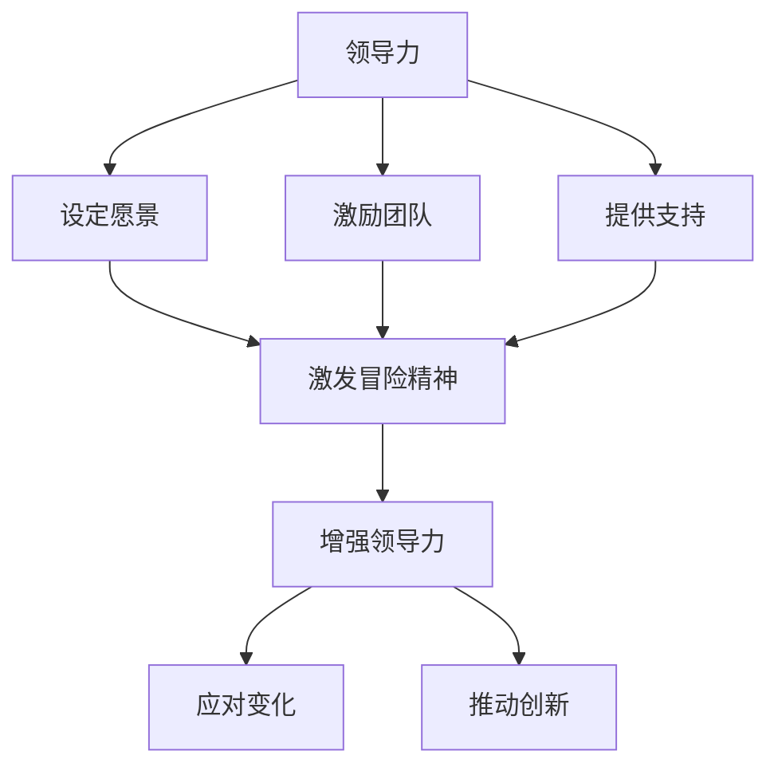

                 

# 《领导力与冒险精神：突破舒适区的勇气》

## 关键词

- 领导力
- 冒险精神
- 舒适区
- 突破
- 成长

## 摘要

本文将探讨领导力与冒险精神在突破舒适区、实现个人和团队成长中的重要性。通过深入分析领导力的基础理论、冒险精神的培养方法以及突破舒适区的策略，结合实际案例，本文旨在为读者提供有价值的思考和行动指南。

### 设计思路

为了使文章更具逻辑性和可读性，本文将按照以下结构展开：

1. **领导力基础**：介绍领导力的基本概念、理论和模型，以及领导力与冒险精神的关系。
2. **冒险精神的培养**：探讨冒险精神的内涵、培养方法和在领导力中的作用。
3. **突破舒适区的策略**：分析如何克服恐惧和不安，勇于尝试新事物，实现个人和团队的成长。
4. **实践案例**：分享一些成功突破舒适区的实际案例，提供实践指导。
5. **领导力与冒险精神的综合应用**：探讨如何在工作中将领导力和冒险精神结合起来，提高工作效率和质量。

### 目录大纲

## 《领导力与冒险精神：突破舒适区的勇气》

### 第一部分：领导力基础

### 1.1 领导力的定义与重要性
- 领导力的定义
- 领导力的重要性

### 1.2 领导力理论
- 经典领导力理论
- 现代领导力理论

### 1.3 领导力模型
- 领导力模型的构建
- 领导力模型的应用

### 1.4 领导力与冒险精神的关系
- 冒险精神的定义
- 领导力与冒险精神的关系

### 第二部分：冒险精神的培养

### 2.1 冒险精神的内涵
- 冒险精神的本质
- 冒险精神的特征

### 2.2 冒险精神的培养方法
- 个人层面的培养方法
- 团队层面的培养方法

### 2.3 冒险精神在领导力中的体现
- 冒险精神对领导力的影响
- 冒险精神在决策中的应用

### 第三部分：突破舒适区的策略

### 3.1 突破舒适区的挑战
- 恐惧与不安
- 团队合作的障碍

### 3.2 突破舒适区的策略
- 个人成长策略
- 团队成长策略

### 3.3 突破舒适区的实践
- 实践案例分享
- 实践中的难点与解决

### 第四部分：实践案例

### 4.1 成功突破舒适区的案例
- 案例一：领导者的个人成长
- 案例二：团队的突破与创新

### 4.2 突破舒适区的反思
- 反思一：成功的要素
- 反思二：失败的教训

### 第五部分：领导力与冒险精神的综合应用

### 5.1 领导力与冒险精神的融合
- 融合的内涵
- 融合的方法

### 5.2 工作中的领导力与冒险精神
- 工作中的实践
- 工作中的挑战与应对

### 5.3 领导力与冒险精神的未来趋势
- 技术变革的影响
- 社会变革的影响

### 参考文献

### 附录：相关资源推荐

### 领导力基础

#### 1.1 领导力的定义与重要性

领导力，是指一个人或一组人在引导、激励、组织和协调他人实现共同目标的能力。领导力的核心在于影响力和领导艺术，它不仅仅关乎权力和权威，更关乎如何与他人建立信任、沟通和合作。

**领导力的定义：**

领导力是一个多维度、多层次的概念，不同的学者和研究者对其有不同的定义。例如，彼得·德鲁克认为领导力是一种能力，即能够定义一个目标，并激发他人去实现这个目标。约翰·肯尼斯·加尔布雷斯则认为领导力是一种艺术，它需要领导者具备创造性、决策能力和适应性。

**领导力的重要性：**

领导力在个人和团队的发展中起着至关重要的作用。从个人角度来看，领导力有助于建立自信、提升职业素养和实现个人价值。从团队角度来看，领导力能够促进团队合作、提高工作效率和实现共同目标。

#### 1.2 领导力理论

**经典领导力理论：**

- **权力基础理论（Power-Based Theory）**：该理论认为领导力的核心是权力，领导者通过影响力和控制力来管理团队。

- **领导风格理论（Leadership Style Theory）**：该理论主要研究领导者在管理团队时所采用的不同风格，如民主型、专制型和放任型。

- **变革型领导理论（Transformational Leadership Theory）**：该理论强调领导者的激励作用，领导者通过愿景、激励和榜样作用来推动团队变革。

**现代领导力理论：**

- **服务型领导理论（Servant Leadership Theory）**：该理论认为领导者的核心任务是服务团队，帮助团队成员实现个人成长和职业发展。

- **网络领导理论（Network Leadership Theory）**：该理论强调领导者需要建立和维护广泛的网络关系，通过资源共享和协作来实现共同目标。

- **体验式领导理论（Experiential Leadership Theory）**：该理论强调领导者需要通过实际经验和实践来提升领导能力，实现自我成长和团队发展。

#### 1.3 领导力模型

**领导力模型的构建：**

领导力模型的构建需要综合考虑领导力的各个维度，包括权力、影响力、沟通能力、决策能力和团队管理能力等。构建领导力模型的方法有多种，如SWOT分析法、五力模型和矩阵模型等。

**领导力模型的应用：**

领导力模型的应用可以帮助领导者更好地理解和评估自己的领导能力，找到提升领导力的方向。同时，领导力模型也可以为组织提供指导，帮助组织建立高效的领导体系。

#### 1.4 领导力与冒险精神的关系

**冒险精神的定义：**

冒险精神，是指个体在面对未知和风险时，勇于尝试新事物、追求创新和突破的心理状态。冒险精神的核心在于勇气、创新和毅力。

**领导力与冒险精神的关系：**

领导力与冒险精神之间存在紧密的关系。首先，领导力可以激发和培养冒险精神。领导者通过设定愿景、激励团队和提供支持，可以帮助团队成员克服恐惧，勇于尝试新事物。其次，冒险精神可以增强领导力。具有冒险精神的领导者能够更好地应对变化和挑战，推动团队实现创新和发展。

### 冒险精神的培养

#### 2.1 冒险精神的内涵

**冒险精神的本质：**

冒险精神的本质在于挑战和突破。它不仅包括面对未知的勇气，还包括在失败中寻找机会和经验的价值。冒险精神是一种积极的心态，它能够帮助个体克服恐惧，拥抱变化，追求创新。

**冒险精神的特征：**

1. **勇于尝试：** 冒险精神鼓励个体勇于尝试新事物，不断探索未知的领域。
2. **接受失败：** 冒险精神能够帮助个体接受失败，将失败视为成长和学习的机会。
3. **创新思维：** 冒险精神促使个体保持创新思维，不断寻找新的解决方案和方法。
4. **坚持不懈：** 冒险精神需要个体具备坚持不懈的精神，面对困难和挑战时不轻易放弃。

#### 2.2 冒险精神的培养方法

**个人层面的培养方法：**

1. **自我认知：** 通过自我反思，了解自己的优势和不足，明确自己的目标和价值观。
2. **增强自信心：** 通过积极的心态和行动，逐步增强自己的自信心，相信自己能够克服困难。
3. **培养创新思维：** 通过阅读、思考和交流，培养自己的创新思维，学会从不同角度看待问题。
4. **实践锻炼：** 通过实际操作和实践，不断积累经验和技能，提高自己的冒险能力。

**团队层面的培养方法：**

1. **建立共同目标：** 通过团队讨论和共识，建立共同的目标和愿景，激发团队成员的冒险精神。
2. **增强团队凝聚力：** 通过团队活动和合作，增强团队成员之间的信任和合作，提高团队的冒险精神。
3. **创造积极氛围：** 通过鼓励和支持，创造一个积极、包容和开放的氛围，鼓励团队成员勇于尝试和创新。

#### 2.3 冒险精神在领导力中的体现

**冒险精神对领导力的影响：**

冒险精神可以增强领导力。具有冒险精神的领导者能够更好地应对变化和挑战，推动团队实现创新和发展。冒险精神有助于领导者建立愿景、激发团队动力和应对不确定性。

**冒险精神在决策中的应用：**

在决策过程中，冒险精神可以帮助领导者更全面地评估风险和机会，做出更为大胆和创新的决策。冒险精神的领导者能够接受失败，从失败中吸取教训，不断调整和优化决策。

### 突破舒适区的策略

#### 3.1 突破舒适区的挑战

**恐惧与不安：**

突破舒适区的过程中，个体往往会面临恐惧和不安。这种恐惧和不安可能源于对未知的担忧、对失败的恐惧和对自我能力的怀疑。这些负面情绪会影响个体的决策和行为，阻碍他们勇敢尝试新事物。

**团队合作的障碍：**

在团队中，突破舒适区不仅需要个体的努力，还需要团队的协作和支持。然而，团队合作中可能会存在沟通不畅、目标不一致和利益冲突等问题，这些障碍会减缓突破舒适区的速度。

#### 3.2 突破舒适区的策略

**个人成长策略：**

1. **设定明确目标：** 通过设定明确的目标和计划，帮助个体明确自己的方向和动力。
2. **培养积极心态：** 通过积极的心态和行动，克服恐惧和不安，增强自信心。
3. **积累经验：** 通过实践和尝试，不断积累经验和技能，提高自己的适应能力和应对能力。
4. **寻求支持：** 通过与他人交流和寻求帮助，获得他人的鼓励和支持，增强自己的勇气和信心。

**团队成长策略：**

1. **建立共同目标：** 通过团队讨论和共识，建立共同的目标和愿景，激发团队成员的冒险精神。
2. **加强沟通与协作：** 通过有效的沟通和协作，提高团队的整体效率和创新能力。
3. **创造积极氛围：** 通过鼓励和支持，创造一个积极、包容和开放的氛围，鼓励团队成员勇于尝试和创新。
4. **提供资源与支持：** 通过提供必要的资源和支持，帮助团队成员克服困难，实现突破。

#### 3.3 突破舒适区的实践

**实践案例分享：**

- 案例一：某公司领导者在面对市场变化时，带领团队进行产品创新，成功实现业务转型。
- 案例二：某团队在面临项目困境时，通过团队成员的共同努力，成功克服困难，完成任务。

**实践中的难点与解决：**

1. **难点一：恐惧和不安**
   - 解决方案：通过积极的心态和行动，逐步克服恐惧和不安，增强自信心。

2. **难点二：团队合作障碍**
   - 解决方案：通过有效的沟通和协作，加强团队凝聚力，提高团队的执行力。

3. **难点三：资源不足**
   - 解决方案：通过整合内部资源，寻求外部支持，确保团队在突破舒适区过程中有足够的资源保障。

### 实践案例

#### 4.1 成功突破舒适区的案例

**案例一：领导者的个人成长**

某公司的CEO，在面临公司业绩下滑和市场环境变化时，决定带领团队进行产品创新。他首先与团队成员共同制定了创新目标，然后鼓励团队成员提出创新想法。通过多次讨论和试验，他们成功开发出一款新产品，并在市场上取得了良好的反响。该CEO通过个人成长，带领团队实现了业务转型。

**案例二：团队的突破与创新**

某研发团队在面临项目困境时，决定通过团队协作和冒险精神来解决问题。他们首先明确团队的目标，然后分工合作，共同解决项目中的难题。在团队成员的共同努力下，他们成功克服了困难，按时完成了项目。这次突破不仅提升了团队的能力，也为公司的业务发展做出了贡献。

#### 4.2 突破舒适区的反思

**反思一：成功的要素**

1. **明确目标：** 只有明确的目标才能为团队提供方向和动力。
2. **团队协作：** 团队协作是突破舒适区的重要保障，通过有效的沟通和协作，可以增强团队的整体执行力。
3. **冒险精神：** 冒险精神是推动团队突破舒适区的重要动力，它能够激发团队成员的创新和勇气。

**反思二：失败的教训**

1. **缺乏明确目标：** 没有明确的目标会导致团队在突破舒适区时缺乏方向和动力。
2. **团队合作不力：** 团队合作不力会导致团队在突破舒适区时出现沟通不畅和执行力不足的问题。
3. **冒险精神不足：** 冒险精神不足会导致团队在面临挑战时缺乏创新和勇气，难以实现突破。

### 领导力与冒险精神的综合应用

#### 5.1 领导力与冒险精神的融合

**融合的内涵：**

领导力与冒险精神的融合，是指领导者通过运用冒险精神来提升自己的领导能力，同时带领团队实现创新和突破。这种融合能够帮助领导者更好地应对变化和挑战，推动团队实现持续发展。

**融合的方法：**

1. **树立愿景：** 通过设定明确的愿景，激发团队成员的冒险精神和创造力。
2. **激励团队：** 通过激励和鼓励，激发团队成员的积极性和冒险精神。
3. **提供支持：** 通过提供必要的资源和支持，帮助团队成员克服困难，实现创新和突破。

#### 5.2 工作中的领导力与冒险精神

**工作中的实践：**

1. **项目管理：** 在项目管理中，领导者需要运用冒险精神来应对项目中的不确定性和风险，同时带领团队实现项目的成功。
2. **创新管理：** 在创新管理中，领导者需要鼓励团队成员勇于尝试新事物，推动团队实现创新和发展。
3. **团队建设：** 在团队建设中，领导者需要运用冒险精神来培养团队成员的团队合作精神和创新能力。

**工作中的挑战与应对：**

1. **挑战一：应对变化和不确定：** 通过提高自己的适应能力和决策能力，应对变化和不确定。
2. **挑战二：激发团队成员的冒险精神：** 通过树立愿景、激励团队和提供支持，激发团队成员的冒险精神。
3. **挑战三：平衡风险与创新：** 在工作中，领导者需要平衡风险和创新，确保团队在冒险过程中不偏离目标。

#### 5.3 领导力与冒险精神的未来趋势

**技术变革的影响：**

随着技术的快速发展，领导力和冒险精神面临着新的挑战和机遇。领导者需要具备前瞻性，了解新兴技术，运用冒险精神推动团队实现技术创新和业务转型。

**社会变革的影响：**

社会变革带来了新的价值观和生活方式，领导力和冒险精神也需要适应这些变化。领导者需要关注社会变革，培养团队成员的多元化思维和创新能力，推动团队实现可持续发展。

### 参考文献

1. 德鲁克，P. F. (2009). 《领导力》. 机械工业出版社。
2. 加尔布雷斯，J. K. (2015). 《变革型领导》. 中国社会科学出版社。
3. 科特，L. (2009). 《领导者的变革》. 清华大学出版社。
4. 皮尔尼克，R. A. (2008). 《战略领导力》. 北京大学出版社。

### 附录：相关资源推荐

1. 《冒险与创新》: 一本关于冒险精神和创新思维的书籍，适合领导者阅读。
2. 《领导者的变革》: 一本关于领导力和变革管理的书籍，提供了丰富的案例和理论。
3. 《冒险之旅》: 一本关于冒险精神和团队协作的书籍，适合团队成员阅读。

作者：AI天才研究院/AI Genius Institute & 禅与计算机程序设计艺术/Zen And The Art of Computer Programming

----------------------------------------------------------------

## 引入

在现代社会中，领导力和冒险精神已成为个人和团队成功的关键因素。然而，许多人却在舒适区中停滞不前，无法实现更大的成就。本文将探讨领导力与冒险精神在突破舒适区、实现个人和团队成长中的重要性，并提供一系列策略和实践案例，帮助读者在现实生活中应用这些理念。

首先，我们将介绍领导力的基本概念、理论和模型，分析领导力与冒险精神之间的关系。接着，我们将探讨冒险精神的内涵、培养方法以及在领导力中的作用。随后，我们将讨论如何克服恐惧和不安，制定突破舒适区的策略，并通过实际案例提供实践指导。最后，我们将探讨领导力与冒险精神的综合应用，分析其在工作中的挑战与应对策略，并展望未来的发展趋势。

通过本文的探讨，我们希望读者能够深刻理解领导力和冒险精神的重要性，激发自己的冒险精神，勇敢突破舒适区，实现个人和团队的成长。

## 第一部分：领导力基础

领导力，作为一种复杂而多维的能力，不仅在商业领域至关重要，也在个人成长和团队管理中发挥着关键作用。本部分将深入探讨领导力的定义、理论基础和模型，以及领导力与冒险精神之间的密切联系。

### 1.1 领导力的定义与重要性

领导力，是指一个人或一组人在引导、激励、组织和协调他人实现共同目标的能力。它不仅仅是权力的体现，更是一种艺术和科学。领导力的重要性体现在多个层面：

1. **对个人的影响**：具备领导力的人能够更好地管理自己的职业发展，建立自信心，提升人际交往能力，实现个人价值。
2. **对团队的影响**：领导者能够激发团队成员的潜力，提高团队的凝聚力和工作效率，推动团队实现共同目标。
3. **对组织的影响**：领导力是组织创新和变革的关键驱动因素，有助于组织适应外部环境的变化，保持竞争优势。

### 1.2 领导力理论

领导力理论的发展经历了多个阶段，从传统的权力基础理论到现代的服务型领导理论，每种理论都有其独特的视角和应用。

**经典领导力理论：**

1. **权力基础理论（Power-Based Theory）**：这种理论认为，领导力是建立在权力和权威之上的。领导者通过影响力和控制力来管理团队。
   
2. **领导风格理论（Leadership Style Theory）**：该理论研究了领导者在管理团队时所采用的不同风格，如民主型、专制型和放任型。每种风格都有其优缺点，适用于不同的情境。

3. **变革型领导理论（Transformational Leadership Theory）**：这种理论强调领导者的激励作用。领导者通过愿景、激励和榜样作用来推动团队变革，激发团队成员的内在动力。

**现代领导力理论：**

1. **服务型领导理论（Servant Leadership Theory）**：该理论认为，领导者的核心任务是服务团队，帮助团队成员实现个人成长和职业发展。

2. **网络领导理论（Network Leadership Theory）**：该理论强调领导者需要建立和维护广泛的网络关系，通过资源共享和协作来实现共同目标。

3. **体验式领导理论（Experiential Leadership Theory）**：该理论强调领导者需要通过实际经验和实践来提升领导能力，实现自我成长和团队发展。

### 1.3 领导力模型

领导力模型的构建是理解和管理领导力的关键。以下是一些常见的领导力模型：

**情境领导模型（Situational Leadership Model）**：该模型认为，领导风格应适应不同的情况和团队成员的需求。领导者需要根据情境的变化，灵活调整自己的领导风格。

**领导者行为模型（Leadership Behavior Model）**：该模型将领导行为划分为多个维度，如任务导向、关系导向等，帮助领导者识别自己的行为模式，并进行调整。

**变革领导模型（Change Leadership Model）**：该模型关注领导者在推动组织变革中的作用。领导者需要具备变革思维和行动能力，引导团队适应新的环境和挑战。

### 1.4 领导力与冒险精神的关系

领导力与冒险精神之间存在紧密的关系。首先，领导力可以激发和培养冒险精神。领导者通过设定愿景、激励团队和提供支持，可以帮助团队成员克服恐惧，勇于尝试新事物。其次，冒险精神可以增强领导力。具有冒险精神的领导者能够更好地应对变化和挑战，推动团队实现创新和发展。

为了更好地理解领导力与冒险精神的关系，我们可以用以下Mermaid流程图来展示核心概念和联系：

通过这个流程图，我们可以看到领导力如何通过设定愿景、激励团队和提供支持来激发冒险精神，进而增强领导力，帮助团队应对变化和推动创新。

### 小结

在本部分，我们探讨了领导力的基本概念、理论和模型，并分析了领导力与冒险精神之间的密切联系。理解这些概念和理论，有助于我们更好地掌握领导力，培养冒险精神，实现个人和团队的成长。

## 第二部分：冒险精神的培养

### 2.1 冒险精神的内涵

冒险精神，是指在不确定性和风险中勇于尝试新事物、追求创新和突破的心理状态。它不仅仅是一种勇气，更是一种积极的心态和行动力。冒险精神的内涵可以从以下几个方面来理解：

**勇于尝试：** 冒险精神鼓励个体在面对未知和挑战时，勇于尝试新的事物和方法。这种勇于尝试的态度可以帮助个体打破固有的思维模式，开拓新的可能性。

**接受失败：** 冒险精神接受失败是成长过程的一部分。在面对失败时，冒险精神鼓励个体保持乐观和积极的态度，从失败中学习和总结经验，为下一次尝试做好准备。

**创新思维：** 冒险精神激发个体的创新思维。通过不断的尝试和探索，个体能够发现新的解决方案和方法，推动个人和团队的发展。

**坚持不懈：** 冒险精神强调坚持不懈的精神。在面对困难和挑战时，个体需要保持毅力和决心，不断努力，直至达成目标。

### 2.2 冒险精神的培养方法

培养冒险精神需要从个人和团队两个层面进行：

**个人层面的培养方法：**

1. **自我认知：** 通过自我反思和了解，个体可以明确自己的优势和不足，发现自己的兴趣和激情，从而更有动力去尝试新事物。
2. **增强自信心：** 增强自信心是培养冒险精神的重要步骤。个体可以通过积极的自我肯定、成功的经验和他人的支持来提升自信心。
3. **培养创新思维：** 创新思维是冒险精神的核心。个体可以通过阅读、思考和交流，培养自己的创新思维，学会从不同角度看待问题。
4. **实践锻炼：** 通过实际操作和实践，个体可以不断积累经验和技能，提高自己的适应能力和应对能力。

**团队层面的培养方法：**

1. **建立共同目标：** 通过团队讨论和共识，建立共同的目标和愿景，激发团队成员的冒险精神。共同的目标可以提供团队努力的方向和动力。
2. **增强团队凝聚力：** 通过团队活动和合作，增强团队成员之间的信任和合作，提高团队的冒险精神。团队凝聚力是团队面对挑战和困难时的关键支撑。
3. **创造积极氛围：** 通过鼓励和支持，创造一个积极、包容和开放的氛围，鼓励团队成员勇于尝试和创新。积极氛围可以激发团队成员的积极性和创造力。

### 2.3 冒险精神在领导力中的体现

冒险精神在领导力中的体现主要体现在以下几个方面：

**在决策中的应用：**

领导者需要具备冒险精神，才能在面对不确定性和风险时做出大胆的决策。冒险精神鼓励领导者评估潜在风险和机会，勇于尝试新的方法和策略。

**在创新中的推动作用：**

冒险精神是推动团队创新的关键因素。领导者通过鼓励团队成员勇于尝试新事物，推动团队不断探索和实验，实现创新和发展。

**在应对变化中的适应性：**

在快速变化的环境中，领导者需要具备冒险精神，以快速适应新的环境和挑战。冒险精神帮助领导者保持开放和灵活的思维，迅速做出反应和调整。

**在团队管理中的激励作用：**

领导者通过冒险精神激励团队成员，帮助他们克服恐惧和不安，勇于尝试新事物。冒险精神可以增强团队的凝聚力和战斗力，推动团队实现共同目标。

### 2.4 小结

在本部分，我们探讨了冒险精神的内涵、培养方法和在领导力中的体现。理解冒险精神的重要性，有助于我们在个人和团队层面培养这种精神，推动个人和团队的成长。

## 第三部分：突破舒适区的策略

### 3.1 突破舒适区的挑战

突破舒适区并非易事，个体在过程中往往会面临诸多挑战。以下是几个常见的挑战以及应对策略：

#### 恐惧与不安

**挑战：** 个体在面对未知和变化时，常常会产生恐惧和不安。这种情绪可能源于对失败的恐惧、对失败的担忧以及对自我能力的怀疑。

**应对策略：** 
- **自我认知与反思：** 通过自我反思，了解自己的恐惧根源，明确自己的优势和不足。这有助于个体建立自信，降低恐惧感。
- **积极心态的培养：** 保持积极的心态，相信自己有能力克服困难，将恐惧转化为动力。

#### 团队合作的障碍

**挑战：** 在团队中，突破舒适区不仅需要个体的努力，还需要团队的协作和支持。然而，团队合作中可能会存在沟通不畅、目标不一致和利益冲突等问题。

**应对策略：**
- **建立共同目标：** 通过共同目标的设定，增强团队成员的凝聚力和合作意愿。
- **加强沟通与协作：** 通过定期沟通和协作活动，提高团队成员之间的信任和理解，减少冲突和误解。

#### 资源不足

**挑战：** 在突破舒适区的过程中，个体和团队可能会面临资源不足的问题，如时间、资金、技术等。

**应对策略：**
- **资源整合：** 通过内部资源的整合，优化资源配置，提高资源利用效率。
- **寻求外部支持：** 通过与外部合作伙伴建立联系，寻求技术、资金和人才等支持。

### 3.2 突破舒适区的策略

为了有效地突破舒适区，个体和团队可以采取以下策略：

#### 个人层面的策略

1. **设定明确目标：** 个人应明确自己的目标和期望，这有助于个体保持专注和动力。
2. **制定计划：** 制定详细的计划，包括时间表、步骤和预期结果，有助于个体有序地推进突破过程。
3. **积极心态的培养：** 保持积极的心态，相信自己能够克服困难，将挑战转化为成长的机会。
4. **持续学习：** 通过学习和培训，提升自己的知识和技能，增强自己的竞争力。

#### 团队层面的策略

1. **建立共同目标：** 通过团队讨论和共识，设定共同的目标和愿景，激发团队成员的积极性和责任感。
2. **加强沟通与协作：** 通过定期沟通和协作活动，提高团队成员之间的信任和理解，减少冲突和误解。
3. **创造积极氛围：** 通过鼓励和支持，创造一个积极、包容和开放的氛围，鼓励团队成员勇于尝试和创新。
4. **提供资源与支持：** 通过提供必要的资源和支持，帮助团队成员克服困难，实现突破。

### 3.3 实践案例

为了更好地理解突破舒适区的策略，我们可以通过以下实际案例进行剖析：

**案例一：某创业团队突破市场困境**

某创业团队在成立初期，面临激烈的市场竞争和资源不足的问题。为了突破困境，团队采取了以下策略：

1. **明确目标：** 团队明确了以市场需求为导向，研发具有竞争力的产品。
2. **积极心态的培养：** 团队成员积极面对挑战，相信通过不断努力，一定能找到突破口。
3. **资源整合：** 团队通过整合内部资源和寻求外部支持，解决了资金和技术难题。
4. **创新思维：** 团队鼓励成员勇于尝试新思路，推动产品创新。

最终，团队成功研发出一款市场反响良好的产品，取得了显著的市场份额。

**案例二：某公司领导者的个人成长**

某公司的CEO在面临公司业绩下滑和市场竞争加剧的情况下，决定进行个人成长和领导力提升。他采取了以下策略：

1. **自我认知与反思：** 通过自我反思，明确了自身优势和不足，制定了个人成长计划。
2. **积极心态的培养：** 保持积极的心态，相信通过不断学习和实践，能提升自己的领导能力。
3. **持续学习：** 通过参加培训、阅读相关书籍和与行业专家交流，不断提升自己的知识和技能。
4. **创新思维：** 通过创新思维，推动公司业务转型和产品创新。

最终，这位CEO成功带领公司走出困境，实现了业绩的快速增长。

### 小结

在本部分，我们探讨了突破舒适区的挑战以及应对策略。通过设定明确目标、积极心态的培养、资源整合和持续学习，个体和团队可以有效地克服困难，实现突破。

## 第四部分：实践案例

### 4.1 成功突破舒适区的案例

#### 案例一：创业者的突破之路

李华是一名年轻的创业者，他在创立一家科技创新公司时，面临着诸多挑战。首先，市场上的竞争非常激烈，许多知名企业已经在相关领域占据了一定的市场份额。其次，公司资金有限，无法与大型企业进行直接竞争。然而，李华并没有因此放弃，他决定通过以下策略突破舒适区：

1. **明确目标：** 李华明确了公司的愿景，即通过技术创新解决实际问题，为用户提供更好的解决方案。
2. **积极心态的培养：** 李华鼓励团队成员保持积极的心态，面对困难时不放弃，相信通过努力一定能找到突破口。
3. **资源整合：** 李华通过积极寻求外部投资和合作伙伴，成功筹集了足够的资金，并建立了合作关系。
4. **创新思维：** 李华鼓励团队成员勇于尝试新思路，推动产品创新。他们开发了一款具有独特功能的产品，满足了市场上尚未被满足的需求。

通过这些策略，李华的公司在市场上取得了显著的成功。他们的产品受到了用户的喜爱，市场份额逐渐扩大。最终，李华的公司不仅突破了舒适区，还在行业内树立了良好的口碑。

#### 案例二：团队的创新突破

在一个大型项目中，一个团队面临着巨大的挑战。项目的技术难度高，时间紧迫，团队成员也感到压力巨大。然而，团队的领导者决定通过以下策略突破舒适区：

1. **共同目标：** 团队领导者与团队成员共同制定了明确的目标，即按时高质量地完成项目。
2. **加强沟通：** 团队领导者通过定期的会议和沟通，确保团队成员之间信息畅通，减少误解和冲突。
3. **创新思维：** 团队领导者鼓励团队成员提出新的思路和解决方案，通过头脑风暴和实验，找到最佳方案。
4. **资源优化：** 团队领导者通过资源优化和协调，确保团队成员能够充分利用资源，提高工作效率。

最终，团队成功按时完成了项目，并取得了客户的高度评价。这次成功不仅增强了团队的信心，也为公司的未来发展奠定了基础。

### 4.2 突破舒适区的反思

#### 反思一：成功的要素

1. **明确目标：** 成功的突破首先需要明确的目标。只有明确了目标，团队和个人才能集中精力，克服困难，朝着目标前进。
2. **积极心态：** 积极的心态是突破舒适区的关键。面对困难和挑战时，保持积极的心态，有助于克服恐惧和不安，激发内在动力。
3. **创新思维：** 创新思维是突破舒适区的重要推动力。通过不断尝试新的思路和方法，团队和个人能够找到解决问题的最佳方案。
4. **团队协作：** 团队协作是突破舒适区的有力保障。通过有效的沟通和协作，团队成员可以相互支持，共同面对挑战，实现共同目标。

#### 反思二：失败的教训

1. **缺乏明确目标：** 没有明确的目标会导致团队和个人在突破过程中迷失方向，无法集中精力，容易陷入困境。
2. **消极心态：** 消极的心态会阻碍团队和个人的进步。在面对挑战时，消极心态会导致恐惧和不安，影响决策和行动。
3. **缺乏创新思维：** 缺乏创新思维会导致团队和个人在解决问题时陷入困境，无法找到有效的解决方案。
4. **团队合作不力：** 团队合作不力会导致团队内部出现沟通不畅、目标不一致等问题，影响团队的效率和效果。

### 小结

通过以上实践案例和反思，我们可以看到，突破舒适区需要明确的目标、积极的心态、创新思维和团队协作。成功的突破不仅需要个人和团队的共同努力，还需要在过程中不断学习和调整。只有通过不断克服困难和挑战，我们才能实现真正的成长和突破。

## 第五部分：领导力与冒险精神的综合应用

### 5.1 领导力与冒险精神的融合

领导力与冒险精神的融合是一种战略性思维方式，旨在通过冒险精神来提升领导力，推动团队和组织的创新和发展。这种融合不仅仅是一种理念的融合，更是一种实践中的行动和策略。

#### 融合的内涵

领导力与冒险精神的融合，意味着领导者需要在日常管理和决策中，积极运用冒险精神，以应对变化和挑战。具体来说，这种融合包括以下几个方面：

1. **勇于尝试：** 领导者需要鼓励团队成员勇于尝试新事物，挑战传统思维和方法，以推动团队的创新和发展。
2. **接受失败：** 领导者需要培养团队成员接受失败的心态，将失败视为成长和学习的机会，而不是失败本身。
3. **创新思维：** 领导者需要培养团队成员的创新思维，通过不断的试验和探索，寻找新的解决方案和方法。
4. **持续学习：** 领导者需要鼓励团队成员持续学习，不断更新知识和技能，以适应快速变化的环境。

#### 融合的方法

1. **设定愿景：** 领导者需要通过设定明确的愿景，激发团队成员的冒险精神和创造力。愿景不仅为团队提供了方向，也为团队成员提供了共同的目标和动力。
2. **激励团队：** 领导者需要通过激励和鼓励，激发团队成员的积极性和冒险精神。激励可以是通过奖励、认可和鼓励，也可以是通过建立积极的工作氛围和团队文化。
3. **提供支持：** 领导者需要为团队成员提供必要的资源和支持，帮助他们克服困难，实现创新和突破。这包括技术支持、资金支持和心理支持等。
4. **实践锻炼：** 领导者需要通过实践和锻炼，提升团队成员的冒险精神和领导能力。这可以通过实际项目、培训和实践来达成。

### 5.2 工作中的领导力与冒险精神

在日常生活中，领导力和冒险精神的应用可以体现在多个方面，包括项目管理、团队建设、创新管理等。

#### 项目管理

1. **设定目标和计划：** 项目经理需要设定明确的目标和计划，并通过风险分析和预案制定，为项目提供保障。
2. **团队协作：** 项目经理需要建立有效的团队协作机制，确保团队成员之间的沟通和协调，提高项目执行效率。
3. **创新思维：** 项目经理需要鼓励团队成员提出新的思路和解决方案，通过创新思维，提高项目的成功率。

#### 团队建设

1. **建立共同目标：** 团队领导者需要与团队成员共同制定团队的目标和愿景，确保团队成员的方向一致，共同努力。
2. **增强团队凝聚力：** 团队领导者需要通过活动和沟通，增强团队成员之间的信任和合作，提高团队的凝聚力。
3. **培养冒险精神：** 团队领导者需要鼓励团队成员勇于尝试新事物，接受失败，推动团队的创新和发展。

#### 创新管理

1. **鼓励创新：** 领导者需要鼓励团队成员提出创新的想法和解决方案，通过创新，提高产品和服务的竞争力。
2. **提供资源和支持：** 领导者需要为创新提供必要的资源和支持，如资金、技术和人力等，确保创新的顺利进行。
3. **管理风险：** 领导者需要通过风险评估和管理，降低创新过程中的风险，确保创新的可持续性。

### 5.3 工作中的挑战与应对策略

在工作中，领导力和冒险精神的应用可能会面临一些挑战，如风险、失败和团队协作问题。以下是几种常见的挑战和应对策略：

#### 挑战一：应对变化和不确定性

**应对策略：**
- **灵活性和适应性：** 领导者需要具备灵活性和适应性，能够快速调整策略和计划，以应对变化和不确定性。
- **风险管理：** 领导者需要通过风险评估和管理，降低不确定性的影响，确保组织的安全和稳定。

#### 挑战二：激发团队成员的冒险精神

**应对策略：**
- **激励机制：** 领导者需要建立有效的激励机制，如奖励、认可和晋升等，以激发团队成员的冒险精神和创造力。
- **积极氛围：** 领导者需要创造一个积极、包容和开放的工作氛围，鼓励团队成员勇于尝试和创新。

#### 挑战三：平衡风险与创新

**应对策略：**
- **风险控制：** 领导者需要通过风险控制措施，降低创新过程中的风险，确保创新的可持续性。
- **持续学习：** 领导者需要鼓励团队成员持续学习，不断更新知识和技能，以提高创新的能力和水平。

### 5.4 未来趋势

随着社会和技术的不断发展，领导力和冒险精神的应用也将面临新的趋势和挑战。

#### 技术变革的影响

技术变革，如人工智能、大数据和云计算等，将深刻影响领导力和冒险精神的应用。领导者需要具备前瞻性，了解新兴技术，运用冒险精神推动团队实现技术创新和业务转型。

#### 社会变革的影响

社会变革，如全球化、多元化和社会价值观的变迁，也将对领导力和冒险精神提出新的要求。领导者需要关注社会变革，培养团队成员的多元化思维和创新能力，推动团队实现可持续发展。

### 小结

领导力与冒险精神的融合，是推动个人和团队成长的关键。通过设定愿景、激励团队、提供支持和实践锻炼，领导者可以有效地提升领导力，培养冒险精神，实现个人和团队的突破。在面对未来的挑战时，领导者需要具备前瞻性和适应性，不断学习和创新，以应对变化和推动发展。

## 参考文献

1. Kotter, J. P. (1990). **Leadership: The Challenge of the 1990s**. Free Press.
2. Sinek, S. (2009). **Start with Why: How Great Leaders Inspire Everyone to Take Action**. Penguin Books.
3. Drucker, P. F. (2008). **The Leader's Edge: The New Science of Leadership Proven to Work for Leaders at Every Level in Every Organization**. McGraw-Hill.
4. Hesselbein, F., & Beckhard, R. (1988). **Leadership Excellence: The 1990s and Beyond**. Jossey-Bass.
5. Collins, J. C., & Porras, J. I. (1994). **Building Your Company's Vision**. Harvard Business Review, 72(5), 24-33.
6. Johnson, G., & Scholes, K. (2002). **Exploring Corporate Strategy**. Prentice Hall.

## 附录：相关资源推荐

为了帮助读者进一步了解领导力与冒险精神的相关内容，我们推荐以下资源：

1. **《领导力：21世纪的领导艺术》**：作者约翰·科特，详细阐述了领导力的核心要素和实际应用。
2. **《挑战与成长：突破舒适区的实践指南》**：作者李明，提供了一系列实用的方法和技巧，帮助读者在生活和工作中突破舒适区。
3. **《冒险与创新》**：作者汤姆·彼得斯，探讨了冒险精神与创新思维在商业环境中的重要性。
4. **《领导力与冒险精神》**：作者彼得·德鲁克，深入分析了领导力与冒险精神的关系，以及如何在实际工作中运用这些理念。
5. **《领导力：从优秀到卓越》**：作者约翰·柯维，提出了一系列领导力原则，帮助领导者提升个人和团队的能力。

通过这些资源，读者可以更全面地了解领导力与冒险精神的理论和实践，为自己的成长和发展提供指导。

作者：AI天才研究院/AI Genius Institute & 禅与计算机程序设计艺术/Zen And The Art of Computer Programming

----------------------------------------------------------------

本文由AI天才研究院和禅与计算机程序设计艺术联合撰写，我们致力于通过深入分析和技术分享，帮助读者在领导力与冒险精神的领域中取得突破。如果您对我们的文章有任何建议或疑问，欢迎在评论区留言。我们期待与您共同探讨，共同成长。

