                 

### 文章标题：领导力与冲突管理：化解团队矛盾的技巧

领导力与冲突管理是现代企业管理中至关重要的两个方面。一个优秀的领导者不仅需要具备出色的领导能力，还需要掌握有效的冲突管理技巧，以便在团队中化解矛盾，提升团队整体效能。本文将围绕这一主题，从领导力的本质、冲突的类型与管理策略，到团队矛盾的化解技巧，进行详细探讨。

### 关键词：

- 领导力
- 冲突管理
- 团队矛盾
- 沟通技巧
- 冲突预防
- 决策能力

### 摘要：

本文旨在深入探讨领导力与冲突管理在团队管理中的重要性。通过分析领导力的核心要素、冲突的本质与类型，以及冲突管理策略，本文将提供一系列实用的技巧，帮助领导者有效化解团队矛盾，提升团队协作效率和整体绩效。

### 第一部分：领导力基础

#### 第1章：领导力的本质与重要性

领导力是一种影响力，它能够激励、引导和推动团队成员朝着共同的目标努力。领导力不仅关乎领导者的个人魅力，更涉及团队管理、决策能力和战略思维。

**核心概念与联系：** 领导力与影响力、团队管理、决策能力和战略思维之间有着紧密的联系。领导者通过影响力来管理团队，通过决策能力来制定战略，最终实现团队目标。

**Mermaid 流程图：**

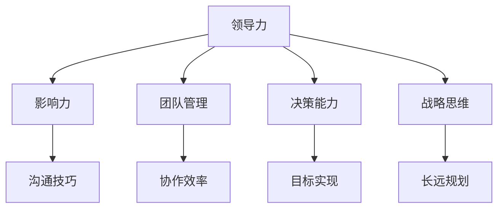

**伪代码：**

```python
def leadership():
    # 激励团队成员
    motivate_members()
    # 管理团队
    manage_team()
    # 制定决策
    make_decisions()
    # 进行战略规划
    strategic_planning()
```

#### 第2章：领导力的核心要素

领导力的核心要素包括沟通能力、决策能力和团队建设能力。有效的沟通能够促进团队协作，决策能力则直接影响团队的方向和效率，团队建设能力则是确保团队稳定性和凝聚力的关键。

**核心算法原理讲解：**

1. **沟通能力：** 通过有效沟通，领导者能够确保信息准确传递，减少误解和冲突。关键在于倾听、表达清晰和反馈。

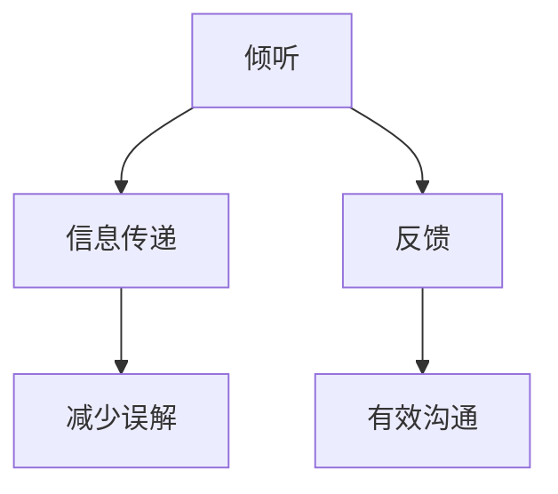

2. **决策能力：** 领导者在面对问题时，需要迅速做出合理决策。关键在于收集信息、分析问题和权衡利弊。

```python
def decision_making():
    # 收集信息
    gather_info()
    # 分析问题
    analyze_problem()
    # 权衡利弊
    weigh_benefits_and_risks()
    # 做出决策
    make_decision()
```

3. **团队建设能力：** 通过有效的团队建设，领导者能够提升团队凝聚力，增强协作效率。关键在于建立共同目标、培养团队文化和管理团队冲突。

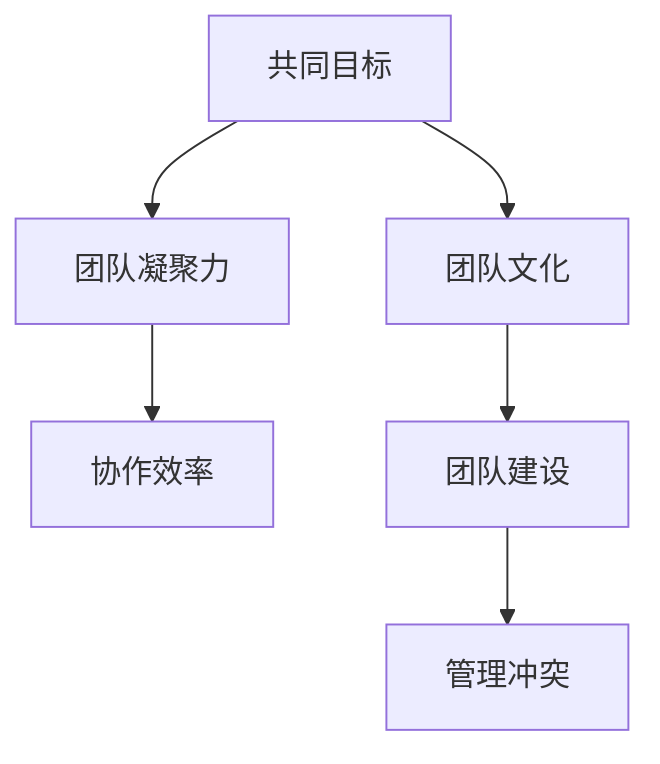

**数学模型和公式：**

1. **沟通效率公式：**

\[ E = \frac{T - D}{T} \]

其中，\( E \) 是沟通效率，\( T \) 是总时间，\( D \) 是因沟通问题导致的时间浪费。

2. **团队建设效益公式：**

\[ B = f(C, E, P) \]

其中，\( B \) 是团队建设效益，\( C \) 是团队文化，\( E \) 是协作效率，\( P \) 是团队凝聚力。

**举例说明：**

假设一个团队在沟通上花费了30%的时间，那么其沟通效率为：

\[ E = \frac{100 - 30}{100} = 70\% \]

如果团队通过有效的团队建设提升了30%的协作效率，那么其团队建设效益为：

\[ B = f(C, 130\%, P) \]

#### 第3章：领导风格与团队建设

领导风格对团队建设和团队绩效有着重要影响。根据领导者对权力和参与度的不同，可以将领导风格分为权威型、参与型和放任型。

**核心概念与联系：** 领导风格与团队管理、团队文化、团队绩效之间存在密切联系。不同的领导风格适用于不同的团队和情境，需要领导者根据实际情况灵活调整。

**Mermaid 流程图：**

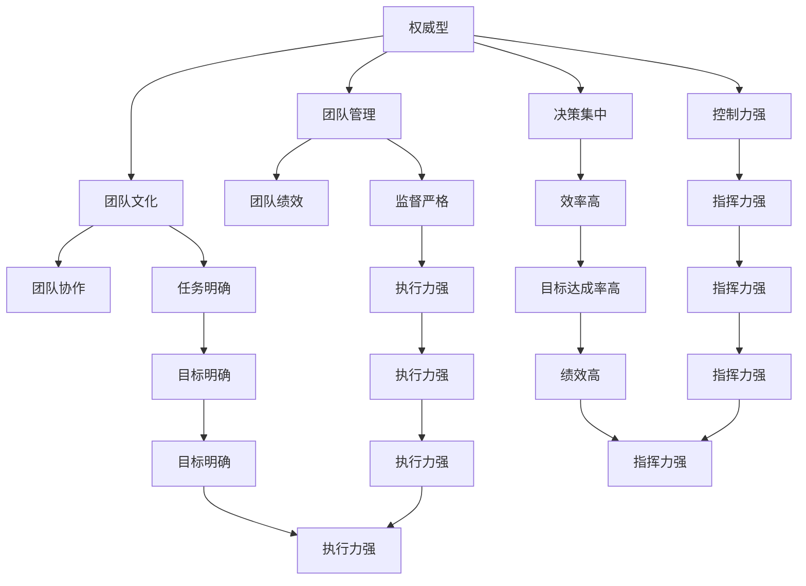

**数学模型和公式：**

1. **领导风格效能公式：**

\[ E = f(S, M, C) \]

其中，\( E \) 是领导风格效能，\( S \) 是监督程度，\( M \) 是管理效率，\( C \) 是团队文化。

2. **团队建设效益公式：**

\[ B = f(C, E, P) \]

其中，\( B \) 是团队建设效益，\( C \) 是团队文化，\( E \) 是协作效率，\( P \) 是团队凝聚力。

**举例说明：**

假设一个团队采用权威型领导风格，监督程度为80%，管理效率为90%，团队文化为70%。那么其领导风格效能为：

\[ E = f(80\%, 90\%, 70\%) \]

如果团队通过有效的团队建设提升了30%的协作效率和20%的团队凝聚力，那么其团队建设效益为：

\[ B = f(70\%, 130\%, 120\%) \]

#### 第4章：领导力发展与实践

领导力的发展是一个持续的过程，领导者需要通过自我评估、培训和实际操作不断提升自己的领导能力。

**核心概念与联系：** 领导力发展涉及自我评估、培训和实践操作，这些环节相互关联，共同推动领导力的提升。

**Mermaid 流程图：**

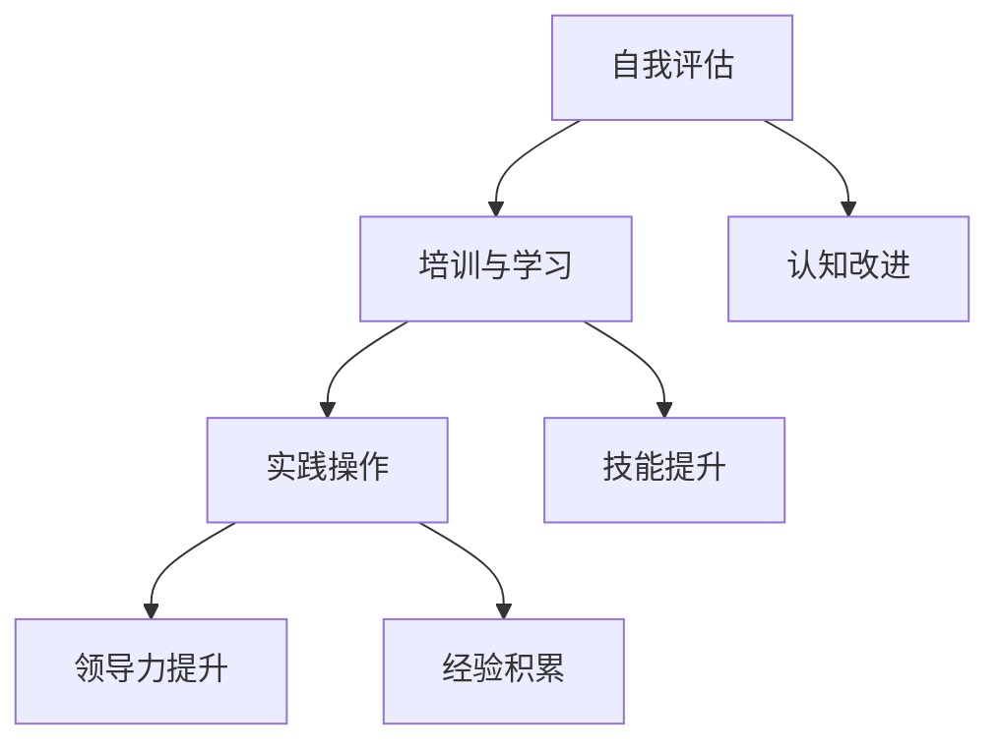

**伪代码：**

```python
def leadership_development():
    # 自我评估
    self_evaluation()
    # 培训与学习
    training_and_learning()
    # 实践操作
    practical_operation()
    # 领导力提升
    leadership_upgrade()
```

**数学模型和公式：**

1. **领导力提升公式：**

\[ L = f(A, B, C) \]

其中，\( L \) 是领导力提升程度，\( A \) 是自我评估结果，\( B \) 是培训与学习成果，\( C \) 是实践操作经验。

2. **领导效能公式：**

\[ E = f(L, T, P) \]

其中，\( E \) 是领导效能，\( L \) 是领导力提升程度，\( T \) 是团队效能，\( P \) 是团队绩效。

**举例说明：**

假设一个领导者通过自我评估、培训和实际操作，使自己的领导力提升了20%，团队效能提升了15%，团队绩效提升了10%。那么其领导效能为：

\[ E = f(20\%, 15\%, 10\%) \]

### 第二部分：冲突管理

#### 第5章：冲突的本质与类型

冲突是团队管理中不可避免的现象。了解冲突的本质和类型，有助于领导者更好地应对和处理冲突。

**核心概念与联系：** 冲突的本质包括相互对立的利益、价值观和行为，类型则分为功能性冲突和非功能性冲突。

**Mermaid 流过上

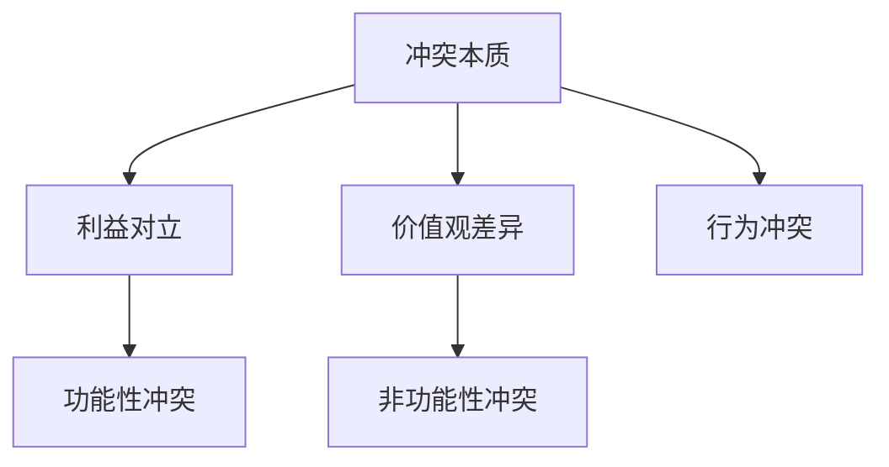

**伪代码：**

```python
def conflict_nature():
    # 利益对立
    conflicting_interests()
    # 价值观差异
    value_difference()
    # 行为冲突
    behavior_conflict()
```

**数学模型和公式：**

1. **冲突强度公式：**

\[ I = f(A, C, B) \]

其中，\( I \) 是冲突强度，\( A \) 是利益对立程度，\( C \) 是价值观差异程度，\( B \) 是行为冲突程度。

2. **冲突类型判断公式：**

\[ T = \begin{cases} 
      \text{功能性冲突} & \text{if } I > 50\% \\
      \text{非功能性冲突} & \text{otherwise} 
   \end{cases} \]

**举例说明：**

假设一个团队中，利益对立程度为70%，价值观差异程度为30%，行为冲突程度为20%。那么其冲突强度为：

\[ I = f(70\%, 30\%, 20\%) \]

根据冲突强度公式，这个团队面临的是功能性冲突。

#### 第6章：冲突管理策略

冲突管理策略包括冲突预防、冲突解决和冲突后的修复。有效的冲突管理策略能够降低冲突对团队的影响，提升团队协作效率。

**核心概念与联系：** 冲突管理策略涉及预防冲突、解决冲突和修复冲突后的团队关系。

**Mermaid 流程图：**

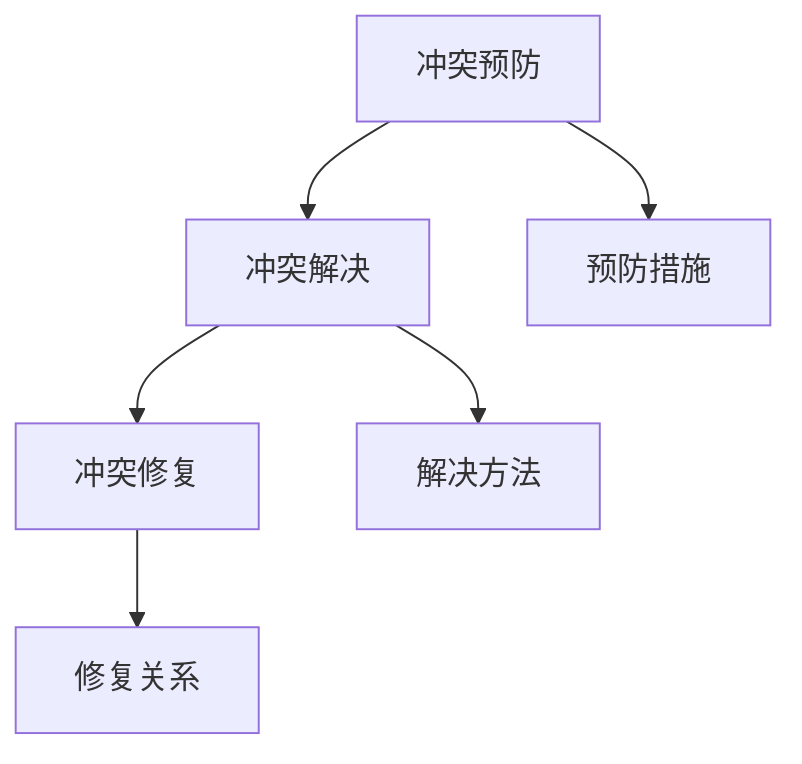

**伪代码：**

```python
def conflict_management():
    # 冲突预防
    prevent_conflicts()
    # 冲突解决
    resolve_conflicts()
    # 冲突修复
    repair_relationships()
```

**数学模型和公式：**

1. **预防冲突效果公式：**

\[ P = f(M, C) \]

其中，\( P \) 是预防冲突效果，\( M \) 是沟通效率，\( C \) 是团队凝聚力。

2. **冲突解决效果公式：**

\[ R = f(E, T) \]

其中，\( R \) 是冲突解决效果，\( E \) 是沟通效率，\( T \) 是解决冲突的时间。

3. **冲突修复效果公式：**

\[ R = f(C, P) \]

其中，\( R \) 是冲突修复效果，\( C \) 是团队凝聚力，\( P \) 是预防冲突效果。

**举例说明：**

假设一个团队通过提高沟通效率和增强团队凝聚力，预防冲突效果为80%，解决冲突效果为90%，修复冲突后的关系效果为70%。那么：

\[ P = f(80\%, 90\%) \]
\[ R = f(90\%, 70\%) \]

#### 第7章：冲突管理的艺术

冲突管理不仅需要策略，更需要艺术。领导者需要通过情感管理和高效沟通，化解团队中的矛盾。

**核心概念与联系：** 冲突管理的艺术涉及情感管理和高效沟通，这些技巧能够帮助领导者更好地应对和处理冲突。

**Mermaid 流程图：**

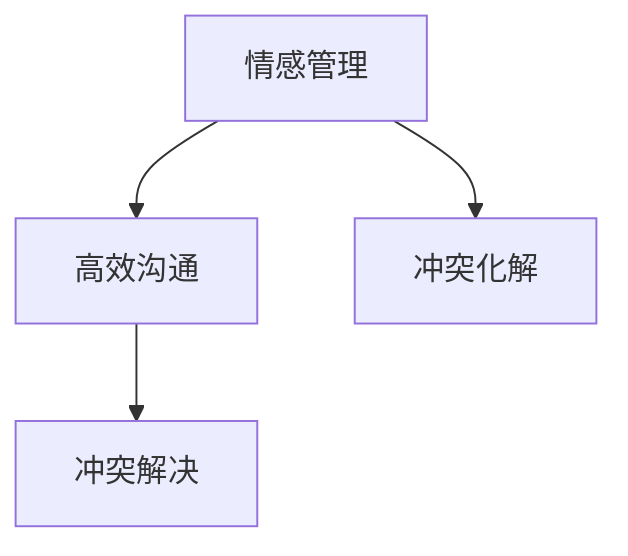

**伪代码：**

```python
def conflict_arts():
    # 情感管理
    manage_emotions()
    # 高效沟通
    effective_communication()
    # 冲突化解
    resolve_conflicts()
```

**数学模型和公式：**

1. **情感管理效果公式：**

\[ E = f(M, E) \]

其中，\( E \) 是情感管理效果，\( M \) 是沟通效率，\( E \) 是情感智商。

2. **高效沟通效果公式：**

\[ C = f(M, T) \]

其中，\( C \) 是高效沟通效果，\( M \) 是沟通效率，\( T \) 是沟通时间。

**举例说明：**

假设一个领导者通过提高沟通效率和增强情感智商，情感管理效果为85%，高效沟通效果为90%。那么：

\[ E = f(85\%, 90\%) \]

### 第三部分：化解团队矛盾

#### 第8章：团队矛盾的原因分析

团队矛盾的原因多种多样，包括结构性矛盾和人际矛盾。

**核心概念与联系：** 团队矛盾的原因涉及结构性矛盾和人际矛盾，领导者需要分析这些原因，采取相应的措施来化解矛盾。

**Mermaid 流程图：**

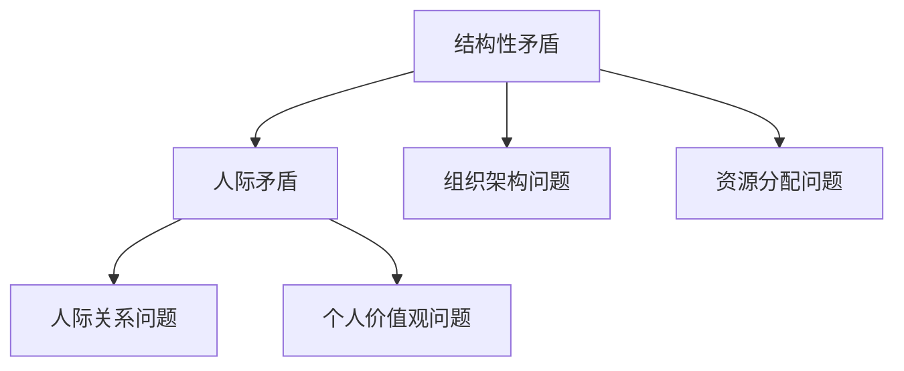

**伪代码：**

```python
def conflict_reasons():
    # 分析结构性矛盾
    analyze_structural_conflicts()
    # 分析人际矛盾
    analyze_interpersonal_conflicts()
```

**数学模型和公式：**

1. **结构性矛盾评估公式：**

\[ S = f(A, R) \]

其中，\( S \) 是结构性矛盾程度，\( A \) 是组织架构问题，\( R \) 是资源分配问题。

2. **人际矛盾评估公式：**

\[ I = f(B, V) \]

其中，\( I \) 是人际矛盾程度，\( B \) 是人际关系问题，\( V \) 是个人价值观问题。

**举例说明：**

假设一个团队中，组织架构问题为70%，资源分配问题为30%；人际关系问题为40%，个人价值观问题为60%。那么：

\[ S = f(70\%, 30\%) \]
\[ I = f(40\%, 60\%) \]

#### 第9章：化解团队矛盾的技巧

化解团队矛盾需要采取一系列技巧，包括建立信任、矛盾调解和自我调解。

**核心概念与联系：** 化解团队矛盾的技巧涉及建立信任、矛盾调解和自我调解，这些技巧能够帮助领导者有效地处理和化解团队矛盾。

**Mermaid 流程图：**

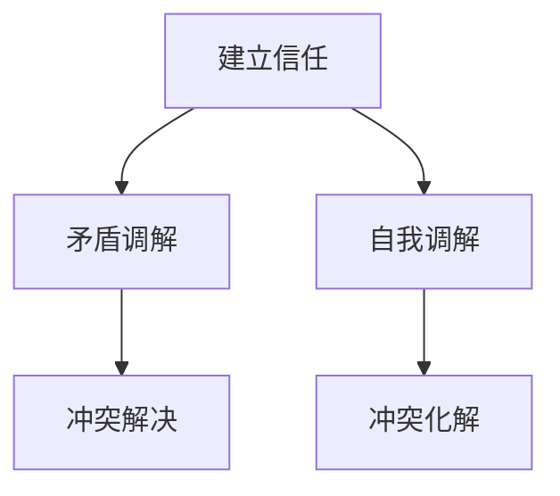

**伪代码：**

```python
def conflict_resolution():
    # 建立信任
    build_trust()
    # 矛盾调解
    mediate_conflicts()
    # 自我调解
    self_mediate()
```

**数学模型和公式：**

1. **信任建立公式：**

\[ T = f(C, E) \]

其中，\( T \) 是信任程度，\( C \) 是沟通效率，\( E \) 是情感管理效果。

2. **矛盾调解效果公式：**

\[ R = f(E, T) \]

其中，\( R \) 是矛盾调解效果，\( E \) 是沟通效率，\( T \) 是信任程度。

3. **自我调解效果公式：**

\[ S = f(M, E) \]

其中，\( S \) 是自我调解效果，\( M \) 是自我认知，\( E \) 是情感管理效果。

**举例说明：**

假设一个团队通过提高沟通效率和增强情感管理，建立了较高的信任水平。在调解矛盾时，沟通效率和信任程度分别为85%和90%。那么：

\[ T = f(85\%, 90\%) \]

\[ R = f(85\%, 90\%) \]

\[ S = f(90\%, 85\%) \]

#### 第10章：实践中的团队矛盾化解

在实际操作中，领导者需要结合具体情境，灵活运用各种技巧，化解团队矛盾。

**核心概念与联系：** 实践中的团队矛盾化解涉及具体情境、技巧运用和策略调整，领导者需要根据实际情况灵活应对。

**Mermaid 流程图：**

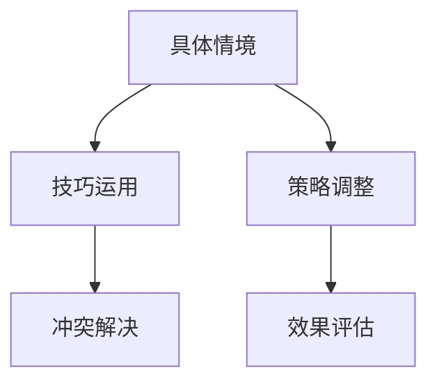

**伪代码：**

```python
def practical_conflict_resolution():
    # 分析具体情境
    analyze_specific_situation()
    # 运用技巧
    apply_skills()
    # 调整策略
    adjust_strategy()
    # 评估效果
    evaluate效果的技巧和策略
```

**数学模型和公式：**

1. **情境评估公式：**

\[ S = f(A, B, C) \]

其中，\( S \) 是情境评估结果，\( A \) 是具体情境，\( B \) 是团队结构，\( C \) 是领导者风格。

2. **技巧评估公式：**

\[ T = f(S, E) \]

其中，\( T \) 是技巧评估结果，\( S \) 是情境评估结果，\( E \) 是沟通效率。

3. **策略评估公式：**

\[ R = f(T, C) \]

其中，\( R \) 是策略评估结果，\( T \) 是技巧评估结果，\( C \) 是团队凝聚力。

**举例说明：**

假设一个团队在面临重大项目时，团队结构为80%，领导者风格为70%，沟通效率为90%。通过分析情境，运用技巧和调整策略，评估结果显示：

\[ S = f(80\%, 70\%, 90\%) \]
\[ T = f(80\%, 90\%) \]
\[ R = f(90\%, 70\%) \]

### 附录

#### 附录A：领导力与冲突管理的相关工具

- **术语解释：** 领导力与冲突管理中的关键术语解释，包括领导力、冲突、团队矛盾等。
- **常用模型介绍：** 介绍领导力与冲突管理中常用的模型，如领导力模型、冲突管理模型等。

#### 附录B：参考文献

- **引用书籍：** 列出本文引用的主要书籍，包括领导力、冲突管理和团队管理等领域的重要著作。
- **学术论文：** 列出本文引用的主要学术论文，包括领导力、冲突管理和团队管理领域的重要研究成果。
- **网络资源：** 列出本文引用的主要网络资源，包括领导力、冲突管理和团队管理领域的重要网站和文章。

### 文章结束

作者：AI天才研究院/AI Genius Institute & 禅与计算机程序设计艺术 /Zen And The Art of Computer Programming

### 总结

本文围绕领导力与冲突管理，从领导力的本质、核心要素、领导风格、冲突管理策略，到团队矛盾的化解技巧，进行了全面探讨。通过深入分析和详细讲解，本文为领导者提供了一系列实用的技巧和方法，帮助他们在实际工作中有效化解团队矛盾，提升团队绩效。领导者需要不断学习和实践，结合具体情境灵活运用这些技巧，才能在团队管理中取得更好的成效。希望本文能为读者提供有益的启示和指导。

