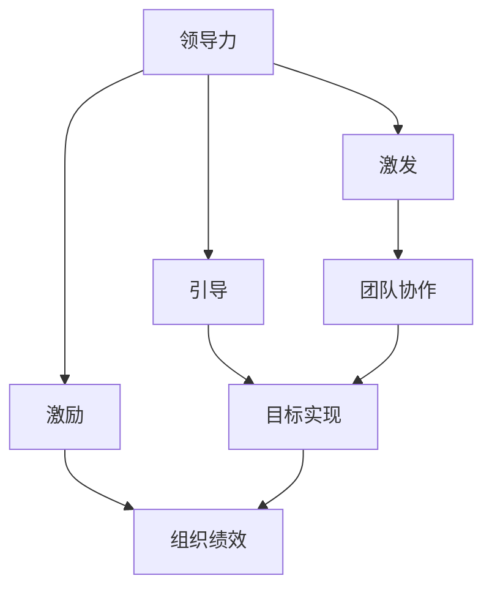
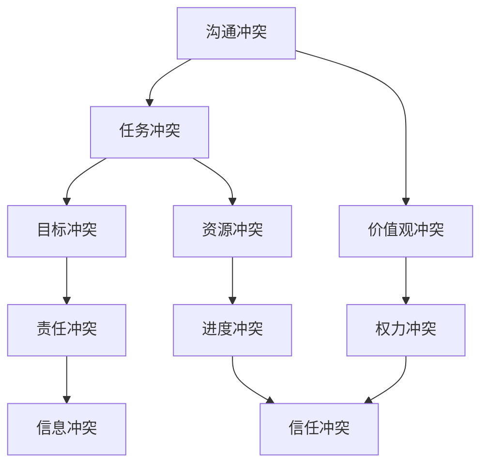

                 

### 第一部分：领导力基础

#### 第1章：领导力概述

##### 1.1 领导力的定义与重要性

领导力是一种能力，它不仅关乎个人素质，更关系到团队的协作效率和组织的整体绩效。在这个章节中，我们将探讨领导力的核心概念，以及它为何在团队中如此重要。

**核心概念与联系**

领导力的定义有多种，但一个广泛接受的解释是：领导力是指激发、引导和激励他人朝着共同目标努力的能力。为了更好地理解这一概念，我们可以通过一个Mermaid流程图来展示领导力的核心组成部分及其相互关系。



在这个流程图中，领导力通过激发、引导和激励，促进团队协作，进而实现共同目标，提高组织绩效。

**核心算法原理讲解**

为了更具体地理解领导力的原理，我们可以提出一个简化的领导力模型。以下是一个使用伪代码表示的领导力评估算法：

```python
def leadership_model(communication, inspiration, decision_making, vision):
    # 初始化分数
    score = 0
    
    # 评估各项能力
    if communication > 8 and inspiration > 8 and decision_making > 8 and vision > 8:
        score = "Excellent Leader"
    elif communication > 6 and inspiration > 6 and decision_making > 6 and vision > 6:
        score = "Effective Leader"
    else:
        score = "Improvement Needed"
        
    return score
```

在这个模型中，领导力由四个主要维度组成：沟通、激励、决策能力和愿景。每个维度的评分越高，整体的领导力评分也越高。

**举例说明**

假设有一个团队，其领导者在沟通、激励、决策和愿景方面的得分分别为9、8、7和8。使用上述算法，我们可以计算出该领导的领导力评估结果为“Excellent Leader”。

##### 1.2 领导风格与团队发展

领导风格对团队的发展和员工的工作效率有着重要的影响。在这个小节中，我们将探讨不同领导风格的特点，以及它们对团队发展的影响。

**数学模型与公式**

为了定量分析领导风格与团队发展之间的关系，我们可以提出一个简单的领导风格适配模型。该模型使用以下公式：

$$\text{Leadership Style} = \frac{\text{Task Orientation} + \text{Relationship Orientation}}{2}$$

其中，任务导向和关系导向分别表示领导者对任务完成和团队关系的重视程度。

**举例说明**

假设一个领导者对任务完成和团队关系的重视程度分别为7和6，那么其领导风格得分为：

$$\text{Leadership Style} = \frac{7 + 6}{2} = 6.5$$

这个得分表明，该领导者的风格相对平衡，既关注任务完成，也注重团队关系。

**案例分析**

在实际中，不同的领导风格会对团队产生不同的影响。例如，任务导向型领导者可能会强调工作效率和目标达成，而关系导向型领导者则更注重团队成员的感受和需求。通过调整领导风格，领导者可以更好地适应团队的需要，促进团队的发展。

### 第2章：个人领导力提升

#### 2.1 自我认知与反馈

自我认知是领导力提升的重要基础。在这个小节中，我们将探讨如何通过自我认知和反馈来提升个人领导力。

**数学公式**

为了量化自我认知的程度，我们可以提出以下公式：

$$\text{Self-awareness} = \frac{\text{Self-assessment} + \text{360-degree Feedback}}{2}$$

其中，自我评估和360度反馈分别表示个人对自己的评价和外部对个人的评价。

**举例说明**

假设一个领导者进行了一次自我评估，得分为7，同时收到了来自同事、下属和上司的360度反馈，平均得分为6。那么，他的自我认知得分为：

$$\text{Self-awareness} = \frac{7 + 6}{2} = 6.5$$

这个得分表明，该领导者对自己的认知相对准确，但仍有提升空间。

**实践建议**

为了提升自我认知，领导者可以采取以下实践：

1. **定期自我反思**：通过定期记录和反思自己的行为和决策，了解自己的优点和不足。
2. **接受反馈**：主动寻求来自不同角度的反馈，并认真对待这些反馈，以改进自己的领导风格。
3. **学习与培训**：参加领导力培训课程，学习新的领导方法和技巧，提升自己的综合素质。

#### 2.2 情绪智力与影响力

情绪智力是指一个人理解和管理自己及他人情绪的能力。在这个小节中，我们将探讨情绪智力对领导力的影响，并提供提升情绪智力的方法。

**伪代码**

为了量化情绪智力，我们可以提出以下情绪智力评估算法：

```python
def emotional_intelligence(imagination, self_control, empathy, motivation):
    score = 0
    
    if imagination > 7 and self_control > 7 and empathy > 7 and motivation > 7:
        score = "High"
    elif imagination > 5 and self_control > 5 and empathy > 5 and motivation > 5:
        score = "Medium"
    else:
        score = "Low"
        
    return score
```

在这个模型中，情绪智力由想象力、自我控制、同理心和动机四个维度组成。每个维度的得分越高，整体的情绪智力也越高。

**举例说明**

假设一个领导者在想象力、自我控制、同理心和动机方面的得分分别为8、7、8和9，那么他的情绪智力评估结果为“High”。

**提升情绪智力的方法**

1. **增强自我控制**：通过练习冥想、深呼吸等技巧，提高自我控制能力。
2. **培养同理心**：通过倾听、观察和体验他人的情绪，培养同理心。
3. **激发想象力**：通过阅读、旅行、艺术创作等方式，丰富想象力。
4. **设定目标与动机**：明确自己的目标和动机，激发内在的动力。

### 第二部分：冲突管理与团队协作

#### 第3章：冲突识别与预防

冲突是团队工作中不可避免的一部分。然而，通过有效的冲突管理和预防策略，领导者可以降低冲突的发生概率，并促进团队和谐。

##### 3.1 冲突的识别与分类

**核心概念图**

为了更好地理解冲突的类型，我们可以使用Mermaid流程图来展示不同类型的冲突及其相互关系。



在这个流程图中，冲突分为沟通冲突、任务冲突、价值观冲突、目标冲突、资源冲突、权力冲突、责任冲突、进度冲突和信任冲突。每种冲突都有其独特的特征和影响因素。

**核心算法原理讲解**

为了定量分析冲突的类型和程度，我们可以提出一个冲突识别算法。以下是一个使用伪代码表示的冲突识别模型：

```python
def conflict_identification(communication_issues, task_conflicts, value_conflicts, goal_conflicts, resource_conflicts, power_conflicts, responsibility_conflicts, progress_conflicts, trust_conflicts):
    score = 0
    
    if communication_issues > 7 and task_conflicts > 7 and value_conflicts > 7 and goal_conflicts > 7 and resource_conflicts > 7 and power_conflicts > 7 and responsibility_conflicts > 7 and progress_conflicts > 7 and trust_conflicts > 7:
        score = "High"
    elif ...
        score = "Medium"
    else:
        score = "Low"
        
    return score
```

在这个模型中，每个冲突类型的得分越高，整体的冲突识别得分也越高。

**举例说明**

假设一个团队在沟通、任务、价值观、目标、资源、权力、责任、进度和信任方面的冲突得分分别为8、7、6、7、6、7、8、6和6，那么该团队的冲突识别得分为“Medium”。

##### 3.2 预防冲突的策略

预防冲突是团队管理的重要任务。以下是一些预防冲突的策略：

1. **增强沟通**：通过定期的团队会议、沟通渠道建设和透明的沟通机制，增强团队成员之间的沟通。
2. **明确目标**：确保团队成员对项目目标和任务有清晰的理解，并共同制定行动计划。
3. **促进团队合作**：通过团队建设活动和协作工具，提高团队成员的协作意识和合作能力。
4. **建立信任**：通过诚信、尊重和公平的行为，建立团队成员之间的信任关系。
5. **及时干预**：一旦发现潜在的冲突，领导者应立即采取干预措施，防止冲突升级。

### 第4章：冲突解决与化解

#### 4.1 冲突解决的基本策略

冲突解决是团队管理中的关键环节。在这个小节中，我们将探讨冲突解决的基本策略和技巧。

**数学公式**

为了定量分析冲突解决的成效，我们可以提出以下冲突解决模型：

$$\text{Conflict Resolution} = \frac{\text{Win-Win Solution} + \text{Problem Solving}}{2}$$

其中，双赢解决方案和问题解决分别表示冲突双方通过合作和解决问题来达成共识。

**举例说明**

假设一个团队在解决冲突时采取了双赢解决方案和问题解决的策略，双方得分分别为7和8，那么该团队的冲突解决得分为：

$$\text{Conflict Resolution} = \frac{7 + 8}{2} = 7.5$$

这个得分表明，该团队在冲突解决方面表现良好，但仍需进一步提升。

**基本策略**

1. **倾听和理解**：领导者应首先倾听冲突各方的意见和感受，理解他们的立场和需求。
2. **明确问题**：在解决冲突之前，明确冲突的核心问题和原因，以便采取针对性的解决措施。
3. **寻求共识**：通过沟通和协商，寻求双方都能接受的解决方案，实现双赢。
4. **采取行动**：在达成共识后，采取实际行动来解决问题，确保解决方案的有效执行。

#### 4.2 团队内的沟通技巧

沟通技巧在冲突解决中起着关键作用。以下是一些在团队内有效的沟通技巧：

1. **积极倾听**：通过认真倾听对方的意见和感受，展示对对方的尊重和理解。
2. **表达清晰**：使用简洁、明确的语言表达自己的观点和需求，避免产生误解。
3. **非语言沟通**：注意身体语言、面部表情和语调，以增强沟通的效果。
4. **开放心态**：保持开放的心态，接受不同的观点和建议，促进团队的多元化发展。
5. **定期反馈**：通过定期的团队会议和个人反馈，及时了解团队成员的意见和需求，解决潜在的冲突。

### 第5章：团队建设与协作

#### 5.1 团队建设的原则与方法

团队建设是提高团队协作能力和工作效率的重要途径。在这个小节中，我们将探讨团队建设的基本原则和有效方法。

**核心算法原理讲解**

为了量化团队建设的成效，我们可以提出以下团队建设模型：

```python
def team_building(communication, collaboration, commitment, motivation):
    score = 0
    
    if communication > 8 and collaboration > 8 and commitment > 8 and motivation > 8:
        score = "Highly Effective Team"
    elif communication > 6 and collaboration > 6 and commitment > 6 and motivation > 6:
        score = "Effective Team"
    else:
        score = "Room for Improvement"
        
    return score
```

在这个模型中，团队建设由沟通、协作、承诺和动机四个维度组成。每个维度的得分越高，团队的总体得分也越高。

**举例说明**

假设一个团队在沟通、协作、承诺和动机方面的得分分别为8、8、7和8，那么该团队的团队建设得分为“Effective Team”。

**建设原则**

1. **共同目标**：确保团队成员对团队目标有共同的理解和认同，形成共同奋斗的方向。
2. **信任与尊重**：建立团队成员之间的信任和尊重，创造一个积极、和谐的工作环境。
3. **分工协作**：明确团队成员的角色和职责，促进分工协作，提高工作效率。
4. **激励机制**：建立合理的激励机制，激发团队成员的工作热情和创造力。

**建设方法**

1. **团队建设活动**：通过定期的团队建设活动，增强团队成员之间的默契和合作能力。
2. **培训与学习**：提供培训和学习机会，提高团队成员的专业能力和综合素质。
3. **沟通与反馈**：建立有效的沟通渠道和反馈机制，及时了解团队成员的意见和建议，改进团队工作。
4. **绩效评估**：定期进行绩效评估，激励团队成员持续改进，提高团队的整体绩效。

### 文章小结

本文详细探讨了领导力与冲突管理在团队协作中的重要性。通过分析领导力的定义、核心概念、领导风格、个人领导力提升策略，以及冲突的识别与预防、冲突解决与化解、团队建设与协作，我们提出了相应的数学模型、算法和伪代码，为团队管理者提供了实用的工具和方法。领导力与冲突管理不仅关乎团队的整体绩效，更影响团队成员的工作满意度和团队氛围。通过有效的领导力和冲突管理，团队可以更加高效、和谐地运作，实现共同的目标。

### 最佳实践 Tips

1. **定期领导力培训**：定期为团队成员提供领导力培训，提高他们的领导技能和团队协作能力。
2. **积极沟通**：鼓励团队成员积极参与沟通，表达自己的意见和需求，促进团队的透明度和信任。
3. **建立反馈机制**：建立有效的反馈机制，鼓励团队成员提供建设性的意见和反馈，促进团队改进。
4. **合理分工**：确保团队成员有明确的职责和角色，促进分工协作，提高工作效率。
5. **鼓励创新**：创造一个鼓励创新和实验的环境，激发团队成员的创造力和解决问题的能力。

### 注意事项

1. **避免冲突升级**：在处理冲突时，避免情绪化和指责，采取客观、理性的态度解决问题。
2. **关注团队动态**：定期关注团队的动态和成员的反馈，及时调整管理策略，确保团队健康稳定发展。
3. **尊重个体差异**：尊重团队成员的个性和差异，避免因个人偏见而导致团队分裂。

### 拓展阅读

1. **《领导力与团队管理：构建高效团队的策略》**：本书详细探讨了领导力在团队管理中的应用，提供了实用的策略和案例。
2. **《冲突处理技巧：如何有效地解决冲突》**：本书介绍了冲突处理的原理和技巧，帮助读者更好地应对各种冲突。
3. **《团队协作的艺术：高效沟通与协作的秘诀》**：本书提供了团队协作的最佳实践，帮助团队实现高效合作。

### 作者信息

作者：AI天才研究院/AI Genius Institute & 禅与计算机程序设计艺术 /Zen And The Art of Computer Programming

本文旨在为团队管理者提供领导力与冲突管理的实用指南，帮助团队实现高效协作和持续发展。希望读者能够在实践中运用这些策略，提升团队的绩效和成员的工作满意度。

