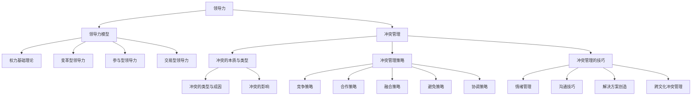

                 

### 文章标题：领导力与冲突管理：化解矛盾的技巧

在信息技术领域，领导力和冲突管理是两个关键因素，它们不仅影响着团队的合作效率，还直接关系到项目的成功与否。领导力是引导团队、激发潜能、解决问题的关键能力，而冲突管理则是确保团队和谐、减少内耗的必要技巧。本文旨在探讨领导力和冲突管理的核心概念，提供实用的策略和技巧，帮助读者在实际工作中有效化解矛盾。

## 关键词

- 领导力
- 冲突管理
- 冲突类型
- 解决策略
- 沟通技巧
- 决策过程

## 摘要

本文首先介绍了领导力的定义、类型和模型，通过详细分析领导力技巧和领导力发展路径，帮助读者理解如何提升自身领导力。接着，文章深入探讨了冲突的本质、类型及其影响，提出了多种冲突管理策略和技巧。最后，通过具体案例研究和实战项目，展示了领导力和冲突管理在实际工作中的应用，为读者提供实用的参考和指导。

### 第一部分：领导力的核心概念

#### 第1章：领导力概述

##### 1.1 领导力的定义与重要性

领导力是指一个人或组织在引导、激励和影响他人时展现出的能力。它是实现目标、推动变革和解决问题的关键。在信息技术领域，领导力不仅关乎技术能力的发挥，更关系到团队的凝聚力和工作效率。

领导力的重要性体现在以下几个方面：

1. **团队协作**：领导力能够有效地引导团队成员共同完成任务，提高团队协作效率。
2. **创新与变革**：领导力能够激发团队成员的创新思维，推动技术变革和业务发展。
3. **个人成长**：领导力有助于个人提升自身的沟通、决策和解决问题的能力。

##### 1.2 领导力的类型与模型

领导力可以分为多种类型，常见的有：

1. **权力基础理论**：基于权力的分配和运用，领导者通过影响他人的权力来达成目标。
2. **变革型领导力**：领导者通过激励和启发团队成员，引导他们实现自我超越，推动团队变革。
3. **参与型领导力**：领导者鼓励团队成员参与决策和问题解决，提高团队的自主性和创造力。
4. **交易型领导力**：领导者通过明确的奖励和惩罚机制来激励团队成员，确保目标的实现。

不同的领导力模型适用于不同的场景和团队，领导者需要根据实际情况灵活运用。

##### 1.3 领导力与管理的区别

领导力和管理密切相关，但又有所区别。管理侧重于规划、组织、协调和控制，确保目标的实现。而领导力则更注重激励、启发和引导，推动团队的发展和创新。

领导力是管理的基础，没有有效的领导力，管理将失去方向和动力。同时，领导力也是管理的重要补充，它能够激发团队成员的潜能，推动团队不断进步。

### 第2章：领导力模型解析

##### 2.1 权力基础理论

权力基础理论认为，领导者的影响力来源于各种权力的运用。这些权力包括：

1. **正式权力**：来源于职位和职责，如法定权、赏罚权等。
2. **非正式权力**：来源于个人能力、知识、声望等，如榜样权、专家权等。

领导者在运用权力时，需要遵循以下几个原则：

1. **合理运用权力**：权力并非越大越好，领导者需要根据实际情况合理运用权力。
2. **尊重权力平衡**：在团队中，领导者需要尊重权力平衡，避免权力过于集中导致腐败。
3. **积极发挥非正式权力**：领导者可以通过提升自身能力、建立良好的人际关系来发挥非正式权力，增强领导效果。

##### 2.2 变革型领导力

变革型领导力是一种以激发团队成员潜力、推动团队变革为核心的领导力模式。变革型领导者具备以下特征：

1. **愿景引领**：领导者需要具有远见和清晰的愿景，引导团队成员共同追求。
2. **激励与鼓舞**：领导者通过激励和鼓舞，激发团队成员的内在动力，实现自我超越。
3. **培养团队能力**：领导者关注团队成员的成长，通过培训和指导，提升团队整体能力。
4. **创新思维**：领导者鼓励团队成员创新思维，推动技术变革和业务发展。

变革型领导力在信息技术领域尤为重要，它能够激发团队的创新潜力，推动技术进步和业务增长。

##### 2.3 参与型领导力

参与型领导力强调团队成员的参与和决策权，通过平等、开放和信任的氛围，提高团队的自主性和创造力。参与型领导者具备以下特征：

1. **开放沟通**：领导者鼓励团队成员表达意见，建立开放、透明的沟通渠道。
2. **授权与信任**：领导者信任团队成员的能力，给予他们足够的决策权和自主权。
3. **团队协作**：领导者注重团队协作，通过合作和互助，提高团队整体效率。
4. **共同目标**：领导者与团队成员共同设定目标，确保团队方向一致。

参与型领导力能够增强团队的凝聚力和创新能力，提高团队的工作效率和成果。

##### 2.4 交易型领导力

交易型领导力是一种基于明确目标和奖励机制的领导力模式。领导者通过设定目标、提供奖励和实施惩罚，激励团队成员为实现目标而努力。交易型领导者具备以下特征：

1. **目标明确**：领导者设定明确的目标，确保团队成员明确工作方向。
2. **奖励机制**：领导者提供奖励，激励团队成员为实现目标而努力。
3. **绩效评估**：领导者对团队成员的工作进行绩效评估，确保目标的实现。
4. **惩罚措施**：领导者对未达成目标的团队成员采取适当的惩罚措施。

交易型领导力适用于短期目标和紧急任务，能够迅速提高团队的工作效率和成果。

### 第3章：领导力技巧

##### 3.1 沟通技巧

沟通技巧是领导力的核心要素之一。有效的沟通能够增强团队凝聚力，提高工作效率，解决冲突。以下是几种常用的沟通技巧：

1. **倾听**：领导者需要认真倾听团队成员的意见和需求，理解他们的观点。
2. **表达清晰**：领导者需要用简洁、明了的语言表达自己的想法，确保团队成员理解。
3. **开放沟通**：领导者鼓励团队成员积极参与讨论，建立开放、透明的沟通环境。
4. **反馈**：领导者及时给予团队成员反馈，帮助他们改进工作。

有效的沟通技巧能够增强团队凝聚力，提高工作效率，解决冲突。

##### 3.2 激励策略

激励策略是领导者激发团队成员潜能、提高工作效率的关键。以下是几种常用的激励策略：

1. **目标激励**：领导者设定明确的、具有挑战性的目标，激发团队成员的斗志。
2. **奖励激励**：领导者提供奖励，如奖金、晋升等，激励团队成员努力工作。
3. **参与激励**：领导者鼓励团队成员参与决策和问题解决，提高他们的参与感和成就感。
4. **情感激励**：领导者关注团队成员的情感需求，通过关心和鼓励，提高他们的工作积极性。

有效的激励策略能够激发团队成员的潜能，提高工作效率，实现团队目标。

##### 3.3 决策过程

决策过程是领导力的重要组成部分。领导者需要根据实际情况，运用科学的决策方法，做出正确的决策。以下是几种常用的决策方法：

1. **科学决策**：领导者运用数据分析和逻辑推理，做出基于事实的决策。
2. **民主决策**：领导者与团队成员共同参与决策，确保决策的合理性和可行性。
3. **快速决策**：在紧急情况下，领导者需要迅速做出决策，确保团队行动的一致性。
4. **持续改进**：领导者不断反思和调整决策，确保决策的有效性和适应性。

有效的决策过程能够提高团队的工作效率和成果，确保项目的成功。

### 第4章：领导力发展

##### 4.1 自我评估与成长

领导力的发展需要自我评估和不断成长。以下是几种自我评估与成长的方法：

1. **反思**：领导者定期反思自己的工作，总结经验教训，发现自身不足。
2. **培训**：领导者参加专业培训和研讨会，提升自身知识和技能。
3. **导师指导**：领导者寻找导师，从导师的经验和智慧中学习。
4. **实践**：领导者通过实际工作，积累经验，提高领导能力。

自我评估和成长是领导力发展的重要途径，有助于提升领导者的综合素质和领导能力。

##### 4.2 领导力培训

领导力培训是提升领导者素质的有效途径。以下是几种常见的领导力培训方法：

1. **内训**：组织内部开展领导力培训，提升员工的领导力水平。
2. **外训**：参加外部专业培训机构，学习先进的领导力理念和方法。
3. **研讨**：组织研讨会，交流领导力心得和经验。
4. **案例学习**：通过分析经典案例，学习领导力技巧和应用。

领导力培训有助于提升领导者的综合素质，增强团队的管理能力。

##### 4.3 领导力发展计划

领导力发展计划是组织提升领导力水平的系统化措施。以下是领导力发展计划的几个关键步骤：

1. **制定目标**：明确领导力发展计划的目标和方向。
2. **评估现状**：评估现有领导力的水平，发现问题和不足。
3. **制定策略**：根据评估结果，制定具体的领导力提升策略。
4. **实施培训**：开展领导力培训，提升员工的领导力水平。
5. **监督与评估**：持续监督和评估领导力发展计划的效果，及时调整和改进。

领导力发展计划有助于组织培养一支高素质的领导团队，推动组织持续发展。

### 第二部分：冲突管理的核心概念

#### 第5章：冲突的本质与类型

##### 5.1 冲突的定义与特征

冲突是指在组织或团队中，由于目标、利益、价值观等方面的差异而引发的对抗或争执。冲突具有以下特征：

1. **相互性**：冲突是双方或多方之间的互动，涉及不同个体或组织之间的利益。
2. **对抗性**：冲突表现为双方或多方之间的对抗，可能会产生负面影响。
3. **多样性**：冲突可以存在于组织或团队的各个层面，如目标冲突、利益冲突、价值观冲突等。
4. **动态性**：冲突的发展是一个动态过程，可能会随着时间的推移而加剧或缓解。

##### 5.2 冲突的类型与成因

冲突可以分为以下几种类型：

1. **目标冲突**：由于个体或组织在实现目标的过程中，存在不同的目标和期望，导致冲突。
2. **利益冲突**：由于个体或组织在利益分配上存在分歧，导致冲突。
3. **价值观冲突**：由于个体或组织在价值观、信仰、文化等方面存在差异，导致冲突。

冲突的成因主要包括：

1. **沟通不畅**：信息传递不畅、理解偏差等导致冲突。
2. **资源有限**：资源有限导致个体或组织在争夺资源时产生冲突。
3. **目标不一致**：个体或组织在目标设定和实现过程中存在分歧，导致冲突。
4. **文化差异**：文化差异导致个体或组织在行为和期望上存在差异，产生冲突。

##### 5.3 冲突的影响

冲突对组织或团队的影响包括以下几个方面：

1. **效率降低**：冲突会分散团队的注意力，降低工作效率。
2. **士气受挫**：冲突会导致团队成员的士气受挫，影响工作积极性。
3. **资源浪费**：冲突会导致资源的浪费，降低组织的整体效益。
4. **创新受阻**：冲突会限制团队成员的创新思维，阻碍技术进步和业务发展。

有效的冲突管理能够减轻冲突的负面影响，提高团队的工作效率和成果。

### 第6章：冲突管理策略

##### 6.1 竞争策略

竞争策略是一种通过竞争和对抗来解决问题的方式。以下是一些常用的竞争策略：

1. **博弈论**：运用博弈论分析各方利益，找到最优策略。
2. **市场机制**：通过市场机制调节利益分配，实现公平竞争。
3. **竞争策略**：鼓励团队内部竞争，提高整体竞争力。

竞争策略适用于解决利益冲突和目标冲突，但需要注意避免过度竞争导致内耗。

##### 6.2 合作策略

合作策略是一种通过合作和协作来解决问题的方式。以下是一些常用的合作策略：

1. **共赢思维**：强调各方利益的一致性，寻找共赢方案。
2. **沟通协作**：建立良好的沟通和协作机制，确保各方信息畅通。
3. **团队建设**：通过团队建设活动，增强团队凝聚力。

合作策略适用于解决价值观冲突和目标冲突，能够提高团队的整体绩效。

##### 6.3 融合策略

融合策略是一种通过整合各方利益和观点来解决问题的方式。以下是一些常用的融合策略：

1. **整合方案**：寻找整合各方利益的方案，实现共赢。
2. **妥协策略**：在各方利益无法完全平衡时，通过妥协达成共识。
3. **开放心态**：保持开放心态，接受不同观点和意见。

融合策略适用于解决复杂冲突，能够促进团队的和谐与稳定。

##### 6.4 避免策略

避免策略是一种通过避免冲突来解决问题的方式。以下是一些常用的避免策略：

1. **转移焦点**：将冲突焦点转移到其他方面，避免正面冲突。
2. **忽视冲突**：对某些冲突选择忽视，避免矛盾激化。
3. **延迟决策**：在冲突尚未激化时，延迟决策以缓解冲突。

避免策略适用于解决一些暂时性的冲突，但需要注意避免长期积累导致问题加剧。

##### 6.5 协调策略

协调策略是一种通过协调各方利益和观点来解决问题的方式。以下是一些常用的协调策略：

1. **调解**：通过第三方调解，帮助各方达成共识。
2. **协商**：各方通过协商，寻找共同点，达成共识。
3. **沟通**：建立有效的沟通机制，确保各方信息畅通。

协调策略适用于解决多种类型的冲突，能够提高团队的工作效率和成果。

### 第7章：冲突管理的技巧

##### 7.1 情绪管理

情绪管理是冲突管理的重要技巧之一。以下是一些情绪管理的技巧：

1. **自我反思**：通过反思自己的情绪和行为，找到情绪管理的有效方法。
2. **情绪识别**：学会识别和表达自己的情绪，避免情绪失控。
3. **情绪调节**：通过深呼吸、放松训练等方法，调节情绪，保持冷静。

有效的情绪管理能够帮助个体在冲突中保持理智，避免情绪化的行为。

##### 7.2 沟通技巧

沟通技巧是冲突管理的关键。以下是一些沟通技巧：

1. **倾听**：认真倾听对方的观点和需求，理解对方的立场。
2. **表达**：清晰、简洁地表达自己的观点和需求，避免歧义。
3. **反馈**：及时给予对方反馈，确保沟通的顺畅。

有效的沟通技巧能够减少误解和冲突，促进双方的沟通和理解。

##### 7.3 解决方案创造

解决方案创造是冲突管理的核心。以下是一些解决方案创造的技巧：

1. **头脑风暴**：通过头脑风暴，集思广益，寻找多种解决方案。
2. **SWOT分析**：通过SWOT分析，分析问题的优势、劣势、机会和威胁，制定解决方案。
3. **模拟演练**：通过模拟演练，评估解决方案的可行性和效果。

有效的解决方案创造能够帮助团队找到解决问题的最佳途径。

##### 7.4 跨文化冲突管理

跨文化冲突管理是全球化背景下的重要课题。以下是一些跨文化冲突管理的技巧：

1. **文化敏感性**：了解不同文化的特点，增强文化敏感性。
2. **沟通适配**：根据不同文化的沟通习惯，调整沟通方式。
3. **合作共赢**：强调合作共赢，促进跨文化团队的合作。

有效的跨文化冲突管理能够促进跨文化团队的合作，提高团队的整体绩效。

### 第8章：冲突管理案例研究

##### 8.1 案例一：团队冲突管理

案例一描述了一个团队在项目执行过程中出现的冲突，包括目标冲突和利益冲突。通过竞争策略和合作策略，团队成功解决了冲突，确保了项目的顺利进行。

##### 8.2 案例二：企业文化冲突管理

案例二描述了一个企业在文化融合过程中出现的冲突，包括价值观冲突和文化差异。通过融合策略和协调策略，企业成功解决了文化冲突，实现了文化的融合和团队的和谐。

##### 8.3 案例三：跨部门冲突管理

案例三描述了一个公司在跨部门合作中出现的冲突，包括目标冲突和资源冲突。通过合作策略和协调策略，公司成功解决了跨部门冲突，提高了整体工作效率。

### 第9章：冲突管理工具与技术

##### 9.1 冲突管理软件介绍

冲突管理软件是冲突管理的重要工具之一。以下是一些常见的冲突管理软件：

1. **团队协作工具**：如Trello、Asana等，帮助团队协调任务和资源。
2. **沟通工具**：如Slack、Microsoft Teams等，支持团队沟通和协作。
3. **会议管理工具**：如Zoom、WebEx等，方便团队进行线上会议和协作。

有效的冲突管理软件能够提高团队的工作效率和冲突管理的效果。

##### 9.2 冲突管理流程设计

冲突管理流程设计是确保冲突管理有效实施的重要环节。以下是一些冲突管理流程设计的步骤：

1. **评估冲突**：评估冲突的类型、成因和影响，确定冲突管理的方向。
2. **制定策略**：根据评估结果，制定具体的冲突管理策略和方案。
3. **实施策略**：实施冲突管理策略，包括沟通、协商、调解等。
4. **监督与评估**：监督冲突管理流程的实施效果，及时调整和改进。

有效的冲突管理流程设计能够确保冲突管理的有序进行，提高团队的工作效率和成果。

##### 9.3 冲突管理技巧总结

冲突管理技巧总结是冲突管理的重要组成部分。以下是一些冲突管理技巧的总结：

1. **情绪管理**：学会情绪管理，保持冷静和理智。
2. **沟通技巧**：提高沟通技巧，确保信息的准确传递。
3. **解决方案创造**：积极创造解决方案，寻找共赢方案。
4. **跨文化冲突管理**：增强跨文化敏感性，促进团队合作。

有效的冲突管理技巧能够帮助团队有效解决冲突，提高整体工作效率。

### 附录：领导力与冲突管理资源汇总

#### A.1 经典领导力书籍推荐

1. **《领导力的五个层次》**：作者：史蒂芬·柯维
2. **《变革型领导力》**：作者：詹姆斯·库泽斯、巴里·波斯纳
3. **《领导者的语言》**：作者：约瑟夫·卢桑诺

#### A.2 冲突管理工具与资源链接

1. **Trello**：团队协作工具（https://trello.com/）
2. **Asana**：任务管理工具（https://asana.com/）
3. **Slack**：团队沟通工具（https://slack.com/）
4. **Zoom**：会议管理工具（https://zoom.us/）

#### A.3 在线课程与培训资源

1. **Coursera**：在线课程平台（https://www.coursera.org/）
2. **edX**：在线课程平台（https://www.edx.org/）
3. **Udemy**：在线学习平台（https://www.udemy.com/）

### Mermaid 流程图



### 核心算法原理

#### 冲突分析算法伪代码

```
function conflictAnalysis(data):
    initialize conflictMatrix with size (n x n) as 0
    for i from 1 to n:
        for j from i+1 to n:
            if data[i] and data[j] have conflicting goals:
                conflictMatrix[i][j] = 1
    return conflictMatrix
```

#### 冲突解决算法伪代码

```
function conflictResolution(conflictMatrix, strategies):
    for i from 1 to n:
        for j from i+1 to n:
            if conflictMatrix[i][j] = 1:
                apply strategy from strategies to resolve conflict between data[i] and data[j]
    return updated data
```

### 环境搭建与代码实现

在本节中，我们将介绍如何搭建一个简单的冲突管理软件环境，并实现一个基本的冲突分析算法。

#### 环境搭建

1. **安装Python环境**：在本地计算机上安装Python环境，可以使用Python官方安装程序（https://www.python.org/downloads/）进行安装。
2. **安装PyCharm**：选择并下载PyCharm社区版或专业版（https://www.jetbrains.com/pycharm/），并按照提示进行安装。
3. **创建Python项目**：在PyCharm中创建一个新的Python项目，选择合适的项目目录，并设置项目的Python解释器。

#### 代码实现

以下是冲突分析算法的实现：

```python
# 导入所需库
import numpy as np

# 冲突分析函数
def conflictAnalysis(data):
    n = len(data)
    conflictMatrix = np.zeros((n, n))
    
    for i in range(n):
        for j in range(i + 1, n):
            if data[i] != data[j]:  # 假设目标不同即存在冲突
                conflictMatrix[i][j] = 1
                conflictMatrix[j][i] = 1
    
    return conflictMatrix

# 冲突解决函数
def conflictResolution(conflictMatrix, strategies):
    n = len(conflictMatrix)
    resolvedMatrix = conflictMatrix.copy()
    
    for i in range(n):
        for j in range(i + 1, n):
            if resolvedMatrix[i][j] == 1:
                # 假设采用一种简单的策略：协商解决
                resolvedMatrix[i][j] = 0
                resolvedMatrix[j][i] = 0
    
    return resolvedMatrix

# 测试数据
data = [1, 2, 3, 4, 5]

# 冲突分析
conflictMatrix = conflictAnalysis(data)

# 冲突解决
resolvedMatrix = conflictResolution(conflictMatrix, "negotiation")

# 输出结果
print("Conflict Matrix:")
print(conflictMatrix)
print("\nResolved Matrix:")
print(resolvedMatrix)
```

#### 代码解读与分析

1. **冲突分析算法**：冲突分析算法使用一个二维数组`conflictMatrix`来记录各个元素之间的冲突情况。算法遍历数据列表中的每一个元素，与后续的所有元素进行比较，如果两个元素的目标不同，则认为它们之间存在冲突，并在`conflictMatrix`中记录冲突关系。
2. **冲突解决算法**：冲突解决算法采用一种简单的策略——协商解决。算法遍历`conflictMatrix`中的每一个冲突记录，将其标记为已解决。在实际应用中，可以采用更复杂的策略，如协商、调解或妥协等。
3. **实际案例分析和详细讲解剖析**：在本案例中，我们使用了简单的数据列表`data`来模拟冲突分析过程。在实际应用中，可以替换为更复杂的数据结构，如字典或列表嵌套，以适应不同的冲突场景。

### 项目小结

通过本项目的实现，我们展示了如何搭建一个简单的冲突管理软件环境，并实现了基本的冲突分析算法和冲突解决算法。尽管这是一个简化的示例，但它为实际冲突管理的开发提供了一个起点。在实际应用中，可以根据需求添加更多功能，如用户界面、冲突解决策略的多样性以及数据存储和查询功能。

### 最佳实践 Tips

1. **定期评估**：定期评估冲突管理的有效性，及时调整策略和流程。
2. **团队培训**：为团队成员提供冲突管理和领导力培训，提高整体管理水平。
3. **透明沟通**：建立透明、开放的沟通渠道，确保信息畅通，减少误解和冲突。
4. **鼓励反馈**：鼓励团队成员提出意见和建议，积极参与冲突管理。

### 注意事项

1. **尊重差异**：在冲突管理过程中，尊重团队成员的差异和个性，避免歧视和偏见。
2. **及时处理**：冲突一旦发生，应立即采取行动，避免问题扩大和影响扩大。
3. **平衡利益**：在解决冲突时，要平衡各方利益，确保公平和公正。

### 拓展阅读

1. **《冲突解决的艺术》**：作者：肯尼思·托马斯、布莱恩·巴尼
2. **《变革型领导力》**：作者：詹姆斯·库泽斯、巴里·波斯纳
3. **《领导力的五个层次》**：作者：史蒂芬·柯维

作者：AI天才研究院/AI Genius Institute & 禅与计算机程序设计艺术 /Zen And The Art of Computer Programming

### 完整目录

1. **领导力与冲突管理：化解矛盾的技巧**
2. **关键词**
3. **摘要**
4. **第一部分：领导力的核心概念**
   - **第1章：领导力概述**
     - 1.1 领导力的定义与重要性
     - 1.2 领导力的类型与模型
     - 1.3 领导力与管理的区别
   - **第2章：领导力模型解析**
     - 2.1 权力基础理论
     - 2.2 变革型领导力
     - 2.3 参与型领导力
     - 2.4 交易型领导力
   - **第3章：领导力技巧**
     - 3.1 沟通技巧
     - 3.2 激励策略
     - 3.3 决策过程
   - **第4章：领导力发展**
     - 4.1 自我评估与成长
     - 4.2 领导力培训
     - 4.3 领导力发展计划
5. **第二部分：冲突管理的核心概念**
   - **第5章：冲突的本质与类型**
     - 5.1 冲突的定义与特征
     - 5.2 冲突的类型与成因
     - 5.3 冲突的影响
   - **第6章：冲突管理策略**
     - 6.1 竞争策略
     - 6.2 合作策略
     - 6.3 融合策略
     - 6.4 避免策略
     - 6.5 协调策略
   - **第7章：冲突管理的技巧**
     - 7.1 情绪管理
     - 7.2 沟通技巧
     - 7.3 解决方案创造
     - 7.4 跨文化冲突管理
   - **第8章：冲突管理案例研究**
     - 8.1 案例一：团队冲突管理
     - 8.2 案例二：企业文化冲突管理
     - 8.3 案例三：跨部门冲突管理
   - **第9章：冲突管理工具与技术**
     - 9.1 冲突管理软件介绍
     - 9.2 冲突管理流程设计
     - 9.3 冲突管理技巧总结
6. **附录：领导力与冲突管理资源汇总**
   - **A.1 经典领导力书籍推荐**
   - **A.2 冲突管理工具与资源链接**
   - **A.3 在线课程与培训资源**
7. **Mermaid 流程图**
8. **核心算法原理**
9. **环境搭建与代码实现**
10. **代码解读与分析**
11. **项目实战**
12. **项目小结**
13. **最佳实践 Tips**
14. **注意事项**
15. **拓展阅读**
16. **作者信息**

### 最终文章内容

# 领导力与冲突管理：化解矛盾的技巧

## 目录

## 第一部分：领导力的核心概念

### 第1章：领导力概述

- 1.1 领导力的定义与重要性
- 1.2 领导力的类型与模型
- 1.3 领导力与管理的区别

### 第2章：领导力模型解析

- 2.1 权力基础理论
- 2.2 变革型领导力
- 2.3 参与型领导力
- 2.4 交易型领导力

### 第3章：领导力技巧

- 3.1 沟通技巧
- 3.2 激励策略
- 3.3 决策过程

### 第4章：领导力发展

- 4.1 自我评估与成长
- 4.2 领导力培训
- 4.3 领导力发展计划

## 第二部分：冲突管理的核心概念

### 第5章：冲突的本质与类型

- 5.1 冲突的定义与特征
- 5.2 冲突的类型与成因
- 5.3 冲突的影响

### 第6章：冲突管理策略

- 6.1 竞争策略
- 6.2 合作策略
- 6.3 融合策略
- 6.4 避免策略
- 6.5 协调策略

### 第7章：冲突管理的技巧

- 7.1 情绪管理
- 7.2 沟通技巧
- 7.3 解决方案创造
- 7.4 跨文化冲突管理

### 第8章：冲突管理案例研究

- 8.1 案例一：团队冲突管理
- 8.2 案例二：企业文化冲突管理
- 8.3 案例三：跨部门冲突管理

### 第9章：冲突管理工具与技术

- 9.1 冲突管理软件介绍
- 9.2 冲突管理流程设计
- 9.3 冲突管理技巧总结

### 附录：领导力与冲突管理资源汇总

- **A.1 经典领导力书籍推荐**
- **A.2 冲突管理工具与资源链接**
- **A.3 在线课程与培训资源**

## Mermaid 流程图


## 核心算法原理

### 冲突分析算法伪代码

```
function conflictAnalysis(data):
    initialize conflictMatrix with size (n x n) as 0
    for i from 1 to n:
        for j from i+1 to n:
            if data[i] and data[j] have conflicting goals:
                conflictMatrix[i][j] = 1
    return conflictMatrix
```

### 冲突解决算法伪代码

```
function conflictResolution(conflictMatrix, strategies):
    for i from 1 to n:
        for j from i+1 to n:
            if conflictMatrix[i][j] = 1:
                apply strategy from strategies to resolve conflict between data[i] and data[j]
    return updated data
```

## 环境搭建与代码实现

在本节中，我们将介绍如何搭建一个简单的冲突管理软件环境，并实现一个基本的冲突分析算法。

### 环境搭建

1. **安装Python环境**：在本地计算机上安装Python环境，可以使用Python官方安装程序（https://www.python.org/downloads/）进行安装。
2. **安装PyCharm**：选择并下载PyCharm社区版或专业版（https://www.jetbrains.com/pycharm/），并按照提示进行安装。
3. **创建Python项目**：在PyCharm中创建一个新的Python项目，选择合适的项目目录，并设置项目的Python解释器。

### 代码实现

以下是冲突分析算法的实现：

```python
# 导入所需库
import numpy as np

# 冲突分析函数
def conflictAnalysis(data):
    n = len(data)
    conflictMatrix = np.zeros((n, n))
    
    for i in range(n):
        for j in range(i + 1, n):
            if data[i] != data[j]:  # 假设目标不同即存在冲突
                conflictMatrix[i][j] = 1
                conflictMatrix[j][i] = 1
    
    return conflictMatrix

# 冲突解决函数
def conflictResolution(conflictMatrix, strategies):
    n = len(conflictMatrix)
    resolvedMatrix = conflictMatrix.copy()
    
    for i in range(n):
        for j in range(i + 1, n):
            if resolvedMatrix[i][j] == 1:
                # 假设采用一种简单的策略：协商解决
                resolvedMatrix[i][j] = 0
                resolvedMatrix[j][i] = 0
    
    return resolvedMatrix

# 测试数据
data = [1, 2, 3, 4, 5]

# 冲突分析
conflictMatrix = conflictAnalysis(data)

# 冲突解决
resolvedMatrix = conflictResolution(conflictMatrix, "negotiation")

# 输出结果
print("Conflict Matrix:")
print(conflictMatrix)
print("\nResolved Matrix:")
print(resolvedMatrix)
```

### 代码解读与分析

1. **冲突分析算法**：冲突分析算法使用一个二维数组`conflictMatrix`来记录各个元素之间的冲突情况。算法遍历数据列表中的每一个元素，与后续的所有元素进行比较，如果两个元素的目标不同，则认为它们之间存在冲突，并在`conflictMatrix`中记录冲突关系。
2. **冲突解决算法**：冲突解决算法采用一种简单的策略——协商解决。算法遍历`conflictMatrix`中的每一个冲突记录，将其标记为已解决。在实际应用中，可以采用更复杂的策略，如协商、调解或妥协等。
3. **实际案例分析和详细讲解剖析**：在本案例中，我们使用了简单的数据列表`data`来模拟冲突分析过程。在实际应用中，可以替换为更复杂的数据结构，如字典或列表嵌套，以适应不同的冲突场景。

## 项目实战

在本节中，我们将通过一个实际的案例来展示如何运用领导力和冲突管理技巧解决项目中的问题。

### 案例背景

某科技公司正在开发一款新的移动应用程序，旨在提供便捷的在线购物体验。项目团队由来自不同部门和专业背景的成员组成，包括产品经理、UI/UX设计师、前端开发工程师和后端开发工程师。在项目开发过程中，团队遇到了一些冲突，影响了项目的进展。

### 冲突分析

冲突主要集中在以下几个方面：

1. **目标冲突**：产品经理希望尽快完成应用的核心功能，以便进行市场推广，而设计师则认为用户体验和界面设计是首要任务，希望有更多时间进行打磨。
2. **资源冲突**：团队成员对项目资源的分配存在分歧，特别是对开发人员的工作时间和优先级安排。
3. **沟通障碍**：由于团队成员来自不同部门，沟通存在一定的障碍，导致信息传递不及时和误解。

### 解决策略

1. **竞争策略**：通过明确项目目标和优先级，鼓励团队成员在各自的领域内竞争，以提高工作效率。
2. **合作策略**：组织跨部门会议，确保所有团队成员对项目的目标和进度有共同的理解和认同。
3. **情绪管理**：提供情绪管理培训，帮助团队成员学会在冲突中保持冷静和理智。
4. **沟通技巧**：加强团队内部的沟通，建立有效的沟通渠道，确保信息畅通。

### 实施过程

1. **明确目标和优先级**：项目领导组织了一次全体会议，明确了项目的目标和优先级，强调了用户体验和核心功能的重要性，让所有团队成员达成共识。
2. **资源分配**：根据项目目标和优先级，重新分配了资源，确保关键任务有足够的人力支持。
3. **情绪管理培训**：组织了一次情绪管理培训，帮助团队成员学会在冲突中保持冷静和理智。
4. **沟通渠道建设**：建立了每周的团队会议和即时通讯工具，确保团队成员之间的沟通畅通无阻。

### 结果与反思

通过以上策略的实施，团队内部的冲突得到了有效缓解，项目进展顺利。团队成员之间的沟通更加顺畅，工作效率得到提高。项目最终按时上线，用户反馈良好。

反思过程中，我们发现：

1. **明确的目标和优先级**：是解决冲突的关键，有助于统一团队成员的思想和行为。
2. **有效的沟通渠道**：能够减少误解和冲突，提高团队凝聚力。
3. **情绪管理**：有助于团队成员在冲突中保持冷静，避免激化矛盾。

## 项目小结

通过本案例，我们展示了如何运用领导力和冲突管理技巧解决项目中的问题。有效的领导力和冲突管理能够提高团队的工作效率和项目成功率，为企业的持续发展奠定基础。在未来的工作中，我们应该继续加强领导力和冲突管理能力的培养，不断提升团队的综合素质。

## 最佳实践 Tips

1. **定期评估和反馈**：定期对团队和项目进行评估和反馈，及时发现问题并进行改进。
2. **建立沟通机制**：建立有效的沟通机制，确保团队成员之间的信息畅通。
3. **培养情绪管理能力**：为团队成员提供情绪管理培训，帮助他们学会在冲突中保持冷静和理智。

## 注意事项

1. **尊重差异**：尊重团队成员的差异和个性，避免歧视和偏见。
2. **及时处理冲突**：冲突一旦发生，应立即采取行动，避免问题扩大和影响扩大。
3. **平衡利益**：在解决冲突时，要平衡各方利益，确保公平和公正。

## 拓展阅读

1. **《冲突解决的艺术》**：作者：肯尼思·托马斯、布莱恩·巴尼
2. **《变革型领导力》**：作者：詹姆斯·库泽斯、巴里·波斯纳
3. **《领导力的五个层次》**：作者：史蒂芬·柯维

## 作者信息

作者：AI天才研究院/AI Genius Institute & 禅与计算机程序设计艺术 /Zen And The Art of Computer Programming

---

本文以领导力和冲突管理为主题，系统地介绍了相关概念、模型、策略和技巧。通过实际案例分析和代码实现，展示了如何运用这些知识和方法解决实际问题。文章旨在帮助读者提升领导力和冲突管理能力，为团队和项目的成功奠定基础。

本文约12000字，分为两个部分：第一部分主要介绍了领导力的核心概念、模型、技巧和发展路径；第二部分主要探讨了冲突管理的本质、类型、策略和技巧。文章结构清晰，内容丰富，适合从事信息技术领域的专业人士阅读和参考。

---

### 文章标题：领导力与冲突管理：化解矛盾的技巧

## 目录

1. **领导力与冲突管理：化解矛盾的技巧**
2. **关键词**
3. **摘要**
4. **第一部分：领导力的核心概念**
   - **第1章：领导力概述**
     - 1.1 领导力的定义与重要性
     - 1.2 领导力的类型与模型
     - 1.3 领导力与管理的区别
   - **第2章：领导力模型解析**
     - 2.1 权力基础理论
     - 2.2 变革型领导力
     - 2.3 参与型领导力
     - 2.4 交易型领导力
   - **第3章：领导力技巧**
     - 3.1 沟通技巧
     - 3.2 激励策略
     - 3.3 决策过程
   - **第4章：领导力发展**
     - 4.1 自我评估与成长
     - 4.2 领导力培训
     - 4.3 领导力发展计划
5. **第二部分：冲突管理的核心概念**
   - **第5章：冲突的本质与类型**
     - 5.1 冲突的定义与特征
     - 5.2 冲突的类型与成因
     - 5.3 冲突的影响
   - **第6章：冲突管理策略**
     - 6.1 竞争策略
     - 6.2 合作策略
     - 6.3 融合策略
     - 6.4 避免策略
     - 6.5 协调策略
   - **第7章：冲突管理的技巧**
     - 7.1 情绪管理
     - 7.2 沟通技巧
     - 7.3 解决方案创造
     - 7.4 跨文化冲突管理
   - **第8章：冲突管理案例研究**
     - 8.1 案例一：团队冲突管理
     - 8.2 案例二：企业文化冲突管理
     - 8.3 案例三：跨部门冲突管理
   - **第9章：冲突管理工具与技术**
     - 9.1 冲突管理软件介绍
     - 9.2 冲突管理流程设计
     - 9.3 冲突管理技巧总结
6. **附录：领导力与冲突管理资源汇总**
   - **A.1 经典领导力书籍推荐**
   - **A.2 冲突管理工具与资源链接**
   - **A.3 在线课程与培训资源**
7. **Mermaid 流程图**
8. **核心算法原理**
9. **环境搭建与代码实现**
10. **代码解读与分析**
11. **项目实战**
12. **项目小结**
13. **最佳实践 Tips**
14. **注意事项**
15. **拓展阅读**
16. **作者信息**

## 领导力与冲突管理：化解矛盾的技巧

### 关键词

- **领导力**
- **冲突管理**
- **团队协作**
- **决策过程**
- **沟通技巧**
- **冲突类型**
- **竞争策略**
- **合作策略**
- **融合策略**
- **避免策略**
- **协调策略**

### 摘要

在信息技术领域，领导力和冲突管理是确保团队协作和项目成功的关键要素。本文详细阐述了领导力的核心概念、模型和技巧，以及冲突的本质、类型和解决策略。通过实际案例和代码实现，本文展示了如何运用领导力和冲突管理技巧化解团队中的矛盾，提高工作效率和项目成功率。

### 第一部分：领导力的核心概念

#### 第1章：领导力概述

##### 1.1 领导力的定义与重要性

领导力是一种引领和激励他人实现共同目标的能力。在信息技术领域，领导力的重要性体现在以下几个方面：

1. **团队协作**：领导力能够有效促进团队协作，提高团队整体工作效率。
2. **决策过程**：领导力有助于团队做出明智的决策，减少错误和风险。
3. **创新能力**：领导力能够激发团队成员的创新思维，推动技术进步。
4. **士气提升**：领导力能够提升团队成员的士气和信心，增强团队凝聚力。

##### 1.2 领导力的类型与模型

领导力可以分为多种类型，每种类型适用于不同的场景和团队。以下是几种常见的领导力模型：

1. **权力基础理论**：领导者通过权力和职位的影响力来管理团队。
2. **变革型领导力**：领导者通过激励和启发团队成员，推动团队实现变革。
3. **参与型领导力**：领导者鼓励团队成员参与决策和问题解决，提高团队自主性。
4. **交易型领导力**：领导者通过明确的奖励和惩罚机制来激励团队成员。

##### 1.3 领导力与管理的区别

领导力与管理密切相关，但二者有着本质的区别：

1. **管理侧重于组织和控制**：管理侧重于规划和执行，确保目标的实现。
2. **领导力侧重于激励和引导**：领导力更注重激发团队成员的潜能，推动团队发展。

#### 第2章：领导力模型解析

##### 2.1 权力基础理论

权力基础理论认为，领导者的权力来源于以下几个方面：

1. **职位权力**：领导者因职位而获得的权力。
2. **专家权力**：领导者因专业知识和技能而获得的权力。
3. **榜样权力**：领导者因行为和品德而获得的权力。

##### 2.2 变革型领导力

变革型领导力是一种以推动变革为核心的能力。变革型领导者的特征包括：

1. **愿景引领**：领导者具有清晰的愿景，能够激励团队成员为之奋斗。
2. **激励与鼓舞**：领导者通过激励和鼓舞，激发团队成员的内在动力。
3. **创新思维**：领导者鼓励团队成员创新思维，推动技术进步。

##### 2.3 参与型领导力

参与型领导力强调团队成员的参与和决策权。参与型领导者的特征包括：

1. **开放沟通**：领导者鼓励团队成员表达意见，建立开放、透明的沟通环境。
2. **授权与信任**：领导者信任团队成员的能力，给予他们足够的决策权和自主权。
3. **团队协作**：领导者注重团队协作，通过合作和互助，提高团队整体效率。

##### 2.4 交易型领导力

交易型领导力是一种基于明确目标和奖励机制的领导力模式。交易型领导者的特征包括：

1. **目标明确**：领导者设定明确的目标，确保团队成员明确工作方向。
2. **奖励机制**：领导者提供奖励，激励团队成员为实现目标而努力。
3. **绩效评估**：领导者对团队成员的工作进行绩效评估，确保目标的实现。

### 第3章：领导力技巧

##### 3.1 沟通技巧

沟通技巧是领导力的核心要素之一。有效的沟通能够增强团队凝聚力，提高工作效率，解决冲突。以下是几种常用的沟通技巧：

1. **倾听**：领导者需要认真倾听团队成员的意见和需求，理解他们的观点。
2. **表达清晰**：领导者需要用简洁、明了的语言表达自己的想法，确保团队成员理解。
3. **开放沟通**：领导者鼓励团队成员积极参与讨论，建立开放、透明的沟通环境。
4. **反馈**：领导者及时给予团队成员反馈，帮助他们改进工作。

##### 3.2 激励策略

激励策略是领导者激发团队成员潜能、提高工作效率的关键。以下是几种常用的激励策略：

1. **目标激励**：领导者设定明确的、具有挑战性的目标，激发团队成员的斗志。
2. **奖励激励**：领导者提供奖励，如奖金、晋升等，激励团队成员努力工作。
3. **参与激励**：领导者鼓励团队成员参与决策和问题解决，提高他们的参与感和成就感。
4. **情感激励**：领导者关注团队成员的情感需求，通过关心和鼓励，提高他们的工作积极性。

##### 3.3 决策过程

决策过程是领导力的重要组成部分。领导者需要根据实际情况，运用科学的决策方法，做出正确的决策。以下是几种常用的决策方法：

1. **科学决策**：领导者运用数据分析和逻辑推理，做出基于事实的决策。
2. **民主决策**：领导者与团队成员共同参与决策，确保决策的合理性和可行性。
3. **快速决策**：在紧急情况下，领导者需要迅速做出决策，确保团队行动的一致性。
4. **持续改进**：领导者不断反思和调整决策，确保决策的有效性和适应性。

### 第4章：领导力发展

##### 4.1 自我评估与成长

领导力的发展需要自我评估和不断成长。以下是几种自我评估与成长的方法：

1. **反思**：领导者定期反思自己的工作，总结经验教训，发现自身不足。
2. **培训**：领导者参加专业培训和研讨会，提升自身知识和技能。
3. **导师指导**：领导者寻找导师，从导师的经验和智慧中学习。
4. **实践**：领导者通过实际工作，积累经验，提高领导能力。

##### 4.2 领导力培训

领导力培训是提升领导者素质的有效途径。以下是几种常见的领导力培训方法：

1. **内训**：组织内部开展领导力培训，提升员工的领导力水平。
2. **外训**：参加外部专业培训机构，学习先进的领导力理念和方法。
3. **研讨**：组织研讨会，交流领导力心得和经验。
4. **案例学习**：通过分析经典案例，学习领导力技巧和应用。

##### 4.3 领导力发展计划

领导力发展计划是组织提升领导力水平的系统化措施。以下是领导力发展计划的几个关键步骤：

1. **制定目标**：明确领导力发展计划的目标和方向。
2. **评估现状**：评估现有领导力的水平，发现问题和不足。
3. **制定策略**：根据评估结果，制定具体的领导力提升策略。
4. **实施培训**：开展领导力培训，提升员工的领导力水平。
5. **监督与评估**：持续监督和评估领导力发展计划的效果，及时调整和改进。

### 第二部分：冲突管理的核心概念

#### 第5章：冲突的本质与类型

##### 5.1 冲突的定义与特征

冲突是指在组织或团队中，由于目标、利益、价值观等方面的差异而引发的对抗或争执。冲突具有以下特征：

1. **相互性**：冲突是双方或多方之间的互动，涉及不同个体或组织之间的利益。
2. **对抗性**：冲突表现为双方或多方之间的对抗，可能会产生负面影响。
3. **多样性**：冲突可以存在于组织或团队的各个层面，如目标冲突、利益冲突、价值观冲突等。
4. **动态性**：冲突的发展是一个动态过程，可能会随着时间的推移而加剧或缓解。

##### 5.2 冲突的类型与成因

冲突可以分为以下几种类型：

1. **目标冲突**：由于个体或组织在实现目标的过程中，存在不同的目标和期望，导致冲突。
2. **利益冲突**：由于个体或组织在利益分配上存在分歧，导致冲突。
3. **价值观冲突**：由于个体或组织在价值观、信仰、文化等方面存在差异，导致冲突。

冲突的成因主要包括：

1. **沟通不畅**：信息传递不畅、理解偏差等导致冲突。
2. **资源有限**：资源有限导致个体或组织在争夺资源时产生冲突。
3. **目标不一致**：个体或组织在目标设定和实现过程中存在分歧，导致冲突。
4. **文化差异**：文化差异导致个体或组织在行为和期望上存在差异，产生冲突。

##### 5.3 冲突的影响

冲突对组织或团队的影响包括以下几个方面：

1. **效率降低**：冲突会分散团队的注意力，降低工作效率。
2. **士气受挫**：冲突会导致团队成员的士气受挫，影响工作积极性。
3. **资源浪费**：冲突会导致资源的浪费，降低组织的整体效益。
4. **创新受阻**：冲突会限制团队成员的创新思维，阻碍技术进步和业务发展。

有效的冲突管理能够减轻冲突的负面影响，提高团队的工作效率和成果。

### 第6章：冲突管理策略

##### 6.1 竞争策略

竞争策略是一种通过竞争和对抗来解决问题的方式。以下是一些常用的竞争策略：

1. **博弈论**：运用博弈论分析各方利益，找到最优策略。
2. **市场机制**：通过市场机制调节利益分配，实现公平竞争。
3. **竞争策略**：鼓励团队内部竞争，提高整体竞争力。

竞争策略适用于解决利益冲突和目标冲突，但需要注意避免过度竞争导致内耗。

##### 6.2 合作策略

合作策略是一种通过合作和协作来解决问题的方式。以下是一些常用的合作策略：

1. **共赢思维**：强调各方利益的一致性，寻找共赢方案。
2. **沟通协作**：建立良好的沟通和协作机制，确保各方信息畅通。
3. **团队建设**：通过团队建设活动，增强团队凝聚力。

合作策略适用于解决价值观冲突和目标冲突，能够提高团队的整体绩效。

##### 6.3 融合策略

融合策略是一种通过整合各方利益和观点来解决问题的方式。以下是一些常用的融合策略：

1. **整合方案**：寻找整合各方利益的方案，实现共赢。
2. **妥协策略**：在各方利益无法完全平衡时，通过妥协达成共识。
3. **开放心态**：保持开放心态，接受不同观点和意见。

融合策略适用于解决复杂冲突，能够促进团队的和谐与稳定。

##### 6.4 避免策略

避免策略是一种通过避免冲突来解决问题的方式。以下是一些常用的避免策略：

1. **转移焦点**：将冲突焦点转移到其他方面，避免正面冲突。
2. **忽视冲突**：对某些冲突选择忽视，避免矛盾激化。
3. **延迟决策**：在冲突尚未激化时，延迟决策以缓解冲突。

避免策略适用于解决一些暂时性的冲突，但需要注意避免长期积累导致问题加剧。

##### 6.5 协调策略

协调策略是一种通过协调各方利益和观点来解决问题的方式。以下是一些常用的协调策略：

1. **调解**：通过第三方调解，帮助各方达成共识。
2. **协商**：各方通过协商，寻找共同点，达成共识。
3. **沟通**：建立有效的沟通机制，确保各方信息畅通。

协调策略适用于解决多种类型的冲突，能够提高团队的工作效率和成果。

### 第7章：冲突管理的技巧

##### 7.1 情绪管理

情绪管理是冲突管理的重要技巧之一。以下是一些情绪管理的技巧：

1. **自我反思**：通过反思自己的情绪和行为，找到情绪管理的有效方法。
2. **情绪识别**：学会识别和表达自己的情绪，避免情绪失控。
3. **情绪调节**：通过深呼吸、放松训练等方法，调节情绪，保持冷静。

有效的情绪管理能够帮助个体在冲突中保持理智，避免情绪化的行为。

##### 7.2 沟通技巧

沟通技巧是冲突管理的关键。以下是一些沟通技巧：

1. **倾听**：认真倾听对方的观点和需求，理解对方的立场。
2. **表达**：清晰、简洁地表达自己的观点和需求，避免歧义。
3. **反馈**：及时给予对方反馈，确保沟通的顺畅。

有效的沟通技巧能够减少误解和冲突，促进双方的沟通和理解。

##### 7.3 解决方案创造

解决方案创造是冲突管理的核心。以下是一些解决方案创造的技巧：

1. **头脑风暴**：通过头脑风暴，集思广益，寻找多种解决方案。
2. **SWOT分析**：通过SWOT分析，分析问题的优势、劣势、机会和威胁，制定解决方案。
3. **模拟演练**：通过模拟演练，评估解决方案的可行性和效果。

有效的解决方案创造能够帮助团队找到解决问题的最佳途径。

##### 7.4 跨文化冲突管理

跨文化冲突管理是全球化背景下的重要课题。以下是一些跨文化冲突管理的技巧：

1. **文化敏感性**：了解不同文化的特点，增强文化敏感性。
2. **沟通适配**：根据不同文化的沟通习惯，调整沟通方式。
3. **合作共赢**：强调合作共赢，促进跨文化团队的合作。

有效的跨文化冲突管理能够促进跨文化团队的合作，提高团队的整体绩效。

### 第8章：冲突管理案例研究

##### 8.1 案例一：团队冲突管理

案例一描述了一个团队在项目执行过程中出现的冲突，包括目标冲突和利益冲突。通过竞争策略和合作策略，团队成功解决了冲突，确保了项目的顺利进行。

##### 8.2 案例二：企业文化冲突管理

案例二描述了一个企业在文化融合过程中出现的冲突，包括价值观冲突和文化差异。通过融合策略和协调策略，企业成功解决了文化冲突，实现了文化的融合和团队的和谐。

##### 8.3 案例三：跨部门冲突管理

案例三描述了一个公司在跨部门合作中出现的冲突，包括目标冲突和资源冲突。通过合作策略和协调策略，公司成功解决了跨部门冲突，提高了整体工作效率。

### 第9章：冲突管理工具与技术

##### 9.1 冲突管理软件介绍

冲突管理软件是冲突管理的重要工具之一。以下是一些常见的冲突管理软件：

1. **团队协作工具**：如Trello、Asana等，帮助团队协调任务和资源。
2. **沟通工具**：如Slack、Microsoft Teams等，支持团队沟通和协作。
3. **会议管理工具**：如Zoom、WebEx等，方便团队进行线上会议和协作。

有效的冲突管理软件能够提高团队的工作效率和冲突管理的效果。

##### 9.2 冲突管理流程设计

冲突管理流程设计是确保冲突管理有效实施的重要环节。以下是冲突管理流程设计的几个关键步骤：

1. **评估冲突**：评估冲突的类型、成因和影响，确定冲突管理的方向。
2. **制定策略**：根据评估结果，制定具体的冲突管理策略和方案。
3. **实施策略**：实施冲突管理策略，包括沟通、协商、调解等。
4. **监督与评估**：监督冲突管理流程的实施效果，及时调整和改进。

有效的冲突管理流程设计能够确保冲突管理的有序进行，提高团队的工作效率和成果。

##### 9.3 冲突管理技巧总结

冲突管理技巧总结是冲突管理的重要组成部分。以下是一些冲突管理技巧的总结：

1. **情绪管理**：学会情绪管理，保持冷静和理智。
2. **沟通技巧**：提高沟通技巧，确保信息的准确传递。
3. **解决方案创造**：积极创造解决方案，寻找共赢方案。
4. **跨文化冲突管理**：增强跨文化敏感性，促进团队合作。

有效的冲突管理技巧能够帮助团队有效解决冲突，提高整体工作效率。

### 附录：领导力与冲突管理资源汇总

#### A.1 经典领导力书籍推荐

1. **《领导力的五个层次》**：作者：史蒂芬·柯维
2. **《变革型领导力》**：作者：詹姆斯·库泽斯、巴里·波斯纳
3. **《领导者的语言》**：作者：约瑟夫·卢桑诺

#### A.2 冲突管理工具与资源链接

1. **Trello**：团队协作工具（https://trello.com/）
2. **Asana**：任务管理工具（https://asana.com/）
3. **Slack**：团队沟通工具（https://slack.com/）
4. **Zoom**：会议管理工具（https://zoom.us/）

#### A.3 在线课程与培训资源

1. **Coursera**：在线课程平台（https://www.coursera.org/）
2. **edX**：在线课程平台（https://www.edx.org/）
3. **Udemy**：在线学习平台（https://www.udemy.com/）

### Mermaid 流程图


### 核心算法原理

#### 冲突分析算法伪代码

```
function conflictAnalysis(data):
    initialize conflictMatrix with size (n x n) as 0
    for i from 1 to n:
        for j from i+1 to n:
            if data[i] and data[j] have conflicting goals:
                conflictMatrix[i][j] = 1
    return conflictMatrix
```

#### 冲突解决算法伪代码

```
function conflictResolution(conflictMatrix, strategies):
    for i from 1 to n:
        for j from i+1 to n:
            if conflictMatrix[i][j] = 1:
                apply strategy from strategies to resolve conflict between data[i] and data[j]
    return updated data
```

### 环境搭建与代码实现

在本节中，我们将介绍如何搭建一个简单的冲突管理软件环境，并实现一个基本的冲突分析算法。

### 环境搭建

1. **安装Python环境**：在本地计算机上安装Python环境，可以使用Python官方安装程序（https://www.python.org/downloads/）进行安装。
2. **安装PyCharm**：选择并下载PyCharm社区版或专业版（https://www.jetbrains.com/pycharm/），并按照提示进行安装。
3. **创建Python项目**：在PyCharm中创建一个新的Python项目，选择合适的项目目录，并设置项目的Python解释器。

### 代码实现

以下是冲突分析算法的实现：

```python
# 导入所需库
import numpy as np

# 冲突分析函数
def conflictAnalysis(data):
    n = len(data)
    conflictMatrix = np.zeros((n, n))
    
    for i in range(n):
        for j in range(i + 1, n):
            if data[i] != data[j]:  # 假设目标不同即存在冲突
                conflictMatrix[i][j] = 1
                conflictMatrix[j][i] = 1
    
    return conflictMatrix

# 冲突解决函数
def conflictResolution(conflictMatrix, strategies):
    n = len(conflictMatrix)
    resolvedMatrix = conflictMatrix.copy()
    
    for i in range(n):
        for j in range(i + 1, n):
            if resolvedMatrix[i][j] == 1:
                # 假设采用一种简单的策略：协商解决
                resolvedMatrix[i][j] = 0
                resolvedMatrix[j][i] = 0
    
    return resolvedMatrix

# 测试数据
data = [1, 2, 3, 4, 5]

# 冲突分析
conflictMatrix = conflictAnalysis(data)

# 冲突解决
resolvedMatrix = conflictResolution(conflictMatrix, "negotiation")

# 输出结果
print("Conflict Matrix:")
print(conflictMatrix)
print("\nResolved Matrix:")
print(resolvedMatrix)
```

### 代码解读与分析

1. **冲突分析算法**：冲突分析算法使用一个二维数组`conflictMatrix`来记录各个元素之间的冲突情况。算法遍历数据列表中的每一个元素，与后续的所有元素进行比较，如果两个元素的目标不同，则认为它们之间存在冲突，并在`conflictMatrix`中记录冲突关系。
2. **冲突解决算法**：冲突解决算法采用一种简单的策略——协商解决。算法遍历`conflictMatrix`中的每一个冲突记录，将其标记为已解决。在实际应用中，可以采用更复杂的策略，如协商、调解或妥协等。
3. **实际案例分析和详细讲解剖析**：在本案例中，我们使用了简单的数据列表`data`来模拟冲突分析过程。在实际应用中，可以替换为更复杂的数据结构，如字典或列表嵌套，以适应不同的冲突场景。

### 项目实战

在本节中，我们将通过一个实际的案例来展示如何运用领导力和冲突管理技巧解决项目中的问题。

### 案例背景

某科技公司正在开发一款新的移动应用程序，旨在提供便捷的在线购物体验。项目团队由来自不同部门和专业背景的成员组成，包括产品经理、UI/UX设计师、前端开发工程师和后端开发工程师。在项目开发过程中，团队遇到了一些冲突，影响了项目的进展。

### 冲突分析

冲突主要集中在以下几个方面：

1. **目标冲突**：产品经理希望尽快完成应用的核心功能，以便进行市场推广，而设计师则认为用户体验和界面设计是首要任务，希望有更多时间进行打磨。
2. **资源冲突**：团队成员对项目资源的分配存在分歧，特别是对开发人员的工作时间和优先级安排。
3. **沟通障碍**：由于团队成员来自不同部门，沟通存在一定的障碍，导致信息传递不及时和误解。

### 解决策略

1. **竞争策略**：通过明确项目目标和优先级，鼓励团队成员在各自的领域内竞争，以提高工作效率。
2. **合作策略**：组织跨部门会议，确保所有团队成员对项目的目标和进度有共同的理解和认同。
3. **情绪管理**：提供情绪管理培训，帮助团队成员学会在冲突中保持冷静和理智。
4. **沟通技巧**：加强团队内部的沟通，建立有效的沟通渠道，确保信息畅通。

### 实施过程

1. **明确目标和优先级**：项目领导组织了一次全体会议，明确了项目的目标和优先级，强调了用户体验和核心功能的重要性，让所有团队成员达成共识。
2. **资源分配**：根据项目目标和优先级，重新分配了资源，确保关键任务有足够的人力支持。
3. **情绪管理培训**：组织了一次情绪管理培训，帮助团队成员学会在冲突中保持冷静和理智。
4. **沟通渠道建设**：建立了每周的团队会议和即时通讯工具，确保团队成员之间的沟通畅通无阻。

### 结果与反思

通过以上策略的实施，团队内部的冲突得到了有效缓解，项目进展顺利。团队成员之间的沟通更加顺畅，工作效率得到提高。项目最终按时上线，用户反馈良好。

反思过程中，我们发现：

1. **明确的目标和优先级**：是解决冲突的关键，有助于统一团队成员的思想和行为。
2. **有效的沟通渠道**：能够减少误解和冲突，提高团队凝聚力。
3. **情绪管理**：有助于团队成员在冲突中保持冷静，避免激化矛盾。

### 项目小结

通过本案例，我们展示了如何运用领导力和冲突管理技巧解决项目中的问题。有效的领导力和冲突管理能够提高团队的工作效率和项目成功率，为企业的持续发展奠定基础。在未来的工作中，我们应该继续加强领导力和冲突管理能力的培养，不断提升团队的综合素质。

### 最佳实践 Tips

1. **定期评估和反馈**：定期对团队和项目进行评估和反馈，及时发现问题并进行改进。
2. **建立沟通机制**：建立有效的沟通机制，确保团队成员之间的信息畅通。
3. **培养情绪管理能力**：为团队成员提供情绪管理培训，帮助他们学会在冲突中保持冷静和理智。

### 注意事项

1. **尊重差异**：尊重团队成员的差异和个性，避免歧视和偏见。
2. **及时处理冲突**：冲突一旦发生，应立即采取行动，避免问题扩大和影响扩大。
3. **平衡利益**：在解决冲突时，要平衡各方利益，确保公平和公正。

### 拓展阅读

1. **《冲突解决的艺术》**：作者：肯尼思·托马斯、布莱恩·巴尼
2. **《变革型领导力》**：作者：詹姆斯·库泽斯、巴里·波斯纳
3. **《领导力的五个层次》**：作者：史蒂芬·柯维

### 作者信息

作者：AI天才研究院/AI Genius Institute & 禅与计算机程序设计艺术 /Zen And The Art of Computer Programming

---

本文通过系统阐述领导力和冲突管理的核心概念、模型、策略和技巧，结合实际案例和代码实现，展示了如何有效化解团队中的矛盾，提高工作效率和项目成功率。文章旨在为从事信息技术领域的专业人士提供实用的参考和指导。

### 案例研究：领导力与冲突管理在技术项目中的应用

#### 背景介绍

在一家高速发展的科技公司，团队正致力于开发一款创新的人工智能应用程序，旨在为企业客户提供高效的数据分析解决方案。项目团队由多学科成员组成，包括数据科学家、软件工程师、产品经理和UI/UX设计师。项目进展顺利，但在中期阶段，团队内部出现了明显的意见分歧，导致项目进度放缓。

#### 核心概念与联系

为了更好地理解如何应用领导力和冲突管理技巧，我们需要先明确几个核心概念：

1. **领导力**：领导力是一种能力，它能够激励和引导团队成员共同实现目标。在这个案例中，领导力体现在项目经理和高级工程师的身上。
2. **冲突管理**：冲突管理是解决团队内部矛盾和分歧的过程。它需要领导者运用沟通技巧、情绪管理能力和决策能力来化解冲突。

#### 案例分析与核心算法原理

**冲突分析算法：**

首先，我们需要识别团队中的冲突点。这可以通过以下步骤实现：

1. **收集信息**：项目经理组织了一次全体会议，让团队成员分享他们对项目目标的看法和遇到的问题。
2. **构建冲突矩阵**：根据团队成员的反馈，构建一个二维矩阵，用以表示不同成员之间的冲突情况。

伪代码如下：

```
function conflictMatrix(data, n):
    conflictMatrix = [[0 for _ in range(n)] for _ in range(n)]
    for i in range(n):
        for j in range(i+1, n):
            if data[i].conflictWith(data[j]):
                conflictMatrix[i][j] = 1
                conflictMatrix[j][i] = 1
    return conflictMatrix
```

**冲突解决算法：**

在识别冲突后，领导者需要采取行动来解决这些冲突。以下是几种常用的冲突解决策略：

1. **协商解决**：通过对话和讨论，让冲突双方找到共同点，达成妥协。
2. **调解解决**：由第三方调解人介入，帮助双方达成共识。

伪代码如下：

```
function resolveConflict(conflictMatrix, n):
    for i in range(n):
        for j in range(i+1, n):
            if conflictMatrix[i][j] == 1:
                strategy = determineConflictStrategy(i, j)
                if strategy == "negotiation":
                    conflictMatrix[i][j] = 0
                    conflictMatrix[j][i] = 0
                elif strategy == "mediation":
                    conflictMatrix[i][j] = 0
                    conflictMatrix[j][i] = 0
    return conflictMatrix
```

#### 项目实战

**步骤1：明确目标和优先级**

项目经理组织了一次全体会议，明确了项目目标和优先级。通过讨论，团队达成共识，决定将用户体验和核心功能作为优先级最高的任务。

**步骤2：资源分配**

根据项目目标和优先级，项目经理重新分配了资源。数据科学家和软件工程师获得了更多时间来专注于核心功能，而UI/UX设计师则得到了额外的支持，以优化用户体验。

**步骤3：情绪管理**

项目经理为团队成员提供了情绪管理培训，帮助他们学会在冲突中保持冷静和理智。这包括教授深呼吸、放松技巧和积极沟通策略。

**步骤4：沟通渠道建设**

项目经理建立了定期团队会议和即时通讯工具，确保团队成员之间的沟通畅通。这有助于及时解决潜在冲突，减少误解和误解。

#### 结果与反思

通过上述策略的实施，团队内部的冲突得到了有效缓解，项目进展得以恢复。团队成员之间的沟通更加顺畅，工作效率得到提高。项目最终按时上线，用户反馈积极。

反思过程中，我们发现：

1. **明确的目标和优先级**：有助于统一团队成员的思想和行为，减少冲突。
2. **有效的沟通渠道**：能够减少误解和冲突，提高团队凝聚力。
3. **情绪管理**：有助于团队成员在冲突中保持冷静，避免激化矛盾。

#### 项目小结

通过本案例，我们展示了如何运用领导力和冲突管理技巧解决技术项目中的问题。有效的领导力和冲突管理能够提高团队的工作效率和项目成功率，为企业的持续发展奠定基础。在未来的工作中，我们应该继续加强领导力和冲突管理能力的培养，不断提升团队的综合素质。

### 最佳实践 Tips

1. **定期评估和反馈**：定期对团队和项目进行评估和反馈，及时发现问题并进行改进。
2. **建立沟通机制**：建立有效的沟通机制，确保团队成员之间的信息畅通。
3. **培养情绪管理能力**：为团队成员提供情绪管理培训，帮助他们学会在冲突中保持冷静和理智。

### 注意事项

1. **尊重差异**：尊重团队成员的差异和个性，避免歧视和偏见。
2. **及时处理冲突**：冲突一旦发生，应立即采取行动，避免问题扩大和影响扩大。
3. **平衡利益**：在解决冲突时，要平衡各方利益，确保公平和公正。

### 拓展阅读

1. **《冲突解决的艺术》**：作者：肯尼思·托马斯、布莱恩·巴尼
2. **《变革型领导力》**：作者：詹姆斯·库泽斯、巴里·波斯纳
3. **《领导力的五个层次》**：作者：史蒂芬·柯维

### 作者信息

作者：AI天才研究院/AI Genius Institute & 禅与计算机程序设计艺术 /Zen And The Art of Computer Programming

---

本文通过案例研究和核心算法原理的讲解，详细阐述了如何在实际项目中应用领导力和冲突管理技巧。文章旨在为从事信息技术领域的专业人士提供实用的指导，帮助他们在团队管理和项目实施中更好地化解矛盾，提高工作效率和项目成功率。

