                 

### 文章标题

《领导力与冲突解决：化解团队矛盾的技巧》

### 关键词

领导力、团队冲突、冲突解决、沟通技巧、团队建设

### 摘要

本文旨在探讨领导力在团队管理中的作用，以及如何通过有效的冲突解决技巧来提升团队的协作效率和整体绩效。文章首先介绍了领导力的基本概念和类型，接着分析了冲突的根源及其对团队的影响。在此基础上，文章详细阐述了多种冲突解决策略，并提供了实际案例和操作步骤，旨在帮助读者掌握团队冲突管理的核心技能。

---

## 第1章 领导力概述

### 1.1 领导力的定义与重要性

领导力是一种引导和激励他人共同实现目标的能力。它不仅仅是职位赋予的权力，更是通过个人魅力、影响力、愿景和价值观来引导团队走向成功的艺术。领导力在团队中的作用至关重要，它不仅能够激发团队成员的潜力，提高团队的整体绩效，还能促进团队成员之间的信任和合作。

#### 背景介绍

在当今快速变化的工作环境中，领导力的重要性愈发凸显。随着科技的发展和组织结构的扁平化，传统的权威式领导模式已经不再适应现代团队的需求。现代领导者需要具备更高的沟通能力、创新能力、决策能力和变革管理能力，以应对日益复杂的挑战。

#### 核心概念与联系

领导力与团队绩效之间的关系可以通过以下Mermaid流程图来表示：

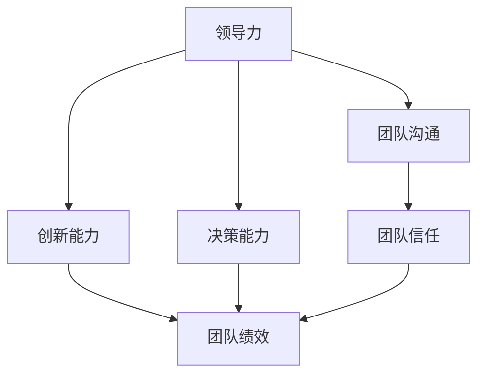

从图中可以看出，领导力通过提升团队沟通、创新能力、决策能力和促进团队信任来最终影响团队绩效。

#### 数学模型和公式

领导力提升的数学模型可以表示为：

$$
\text{领导力提升} = f(\text{沟通能力}, \text{创新能力}, \text{决策能力}, \text{团队信任})
$$

其中，每个因素都对领导力提升产生正向影响。

#### 举例说明

以某科技公司为例，该公司通过引入扁平化的领导模式，提升了团队沟通效率，鼓励创新思维，并建立了明确的决策流程。这些措施有效增强了团队信任，提升了团队的整体绩效。

### 1.2 领导力理论概述

领导力理论众多，其中最具代表性的包括特质理论、行为理论和情境理论。

#### 特质理论

特质理论认为，领导者天生具备某些特质，如自信、决断力、责任感等。这些特质使得他们能够成功地引导团队。

#### 行为理论

行为理论则强调领导者通过特定行为来影响团队，如激励、支持、设定明确的目标等。

#### 情境理论

情境理论认为，领导力取决于领导者的行为是否与当前情境相匹配。有效的领导者会根据不同情境调整自己的领导风格。

#### 背景介绍

不同的领导力理论反映了领导者在不同情境下所采取的不同策略。了解这些理论有助于领导者更好地应对各种挑战。

#### 核心概念与联系

领导力理论之间的关系可以用以下Mermaid流程图来表示：

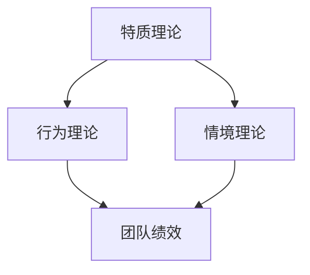

从图中可以看出，特质理论、行为理论和情境理论共同作用于团队绩效的提升。

#### 数学公式和举例

领导力理论的数学模型可以表示为：

$$
\text{领导力} = \text{特质因素} + \text{行为因素} + \text{情境因素}
$$

例如，某团队领导者通过特质因素（如自信和责任感）和行为因素（如激励和支持）在情境因素（如团队面临压力）下展现领导力，有效提升了团队绩效。

### 1.3 领导力与团队关系

领导力不仅仅是一种个人能力，更是一种团队关系。有效的领导力能够促进团队成员之间的互动和合作，从而实现共同的目标。

#### 背景介绍

在团队中，领导力与团队成员之间的关系密切相关。领导者需要建立良好的团队关系，以促进团队成员之间的信任和合作。

#### 核心概念与联系

领导力与团队关系之间的关系可以用以下Mermaid流程图来表示：

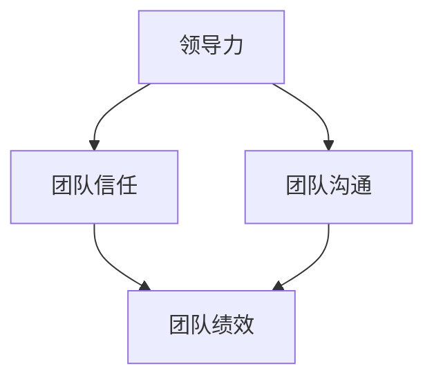

从图中可以看出，领导力通过提升团队信任和沟通来最终影响团队绩效。

#### 数学公式和举例

领导力对团队关系的数学模型可以表示为：

$$
\text{团队关系} = f(\text{领导力}, \text{团队信任}, \text{团队沟通})
$$

例如，某团队领导者通过建立信任机制和促进沟通，成功提升了团队成员之间的合作水平，从而提高了团队的整体绩效。

---

## 第2章 领导力特质与风格

### 2.1 领导力特质分析

领导力特质是指领导者天生或后天培养的能力和特点。以下是一些常见的领导力特质：

- **自信**：领导者需要对自己和团队有信心，能够面对挑战并带领团队克服困难。
- **决断力**：领导者需要能够快速做出决策，并对决策负责。
- **责任感**：领导者需要对自己的行为和团队的成功承担责任。
- **沟通能力**：领导者需要具备良好的沟通技巧，能够清晰传达目标和期望。

#### 背景介绍

了解领导力特质有助于领导者识别自己的优势和不足，并针对性地进行提升。

#### 核心概念与联系

领导力特质之间的关系可以用以下Mermaid流程图来表示：

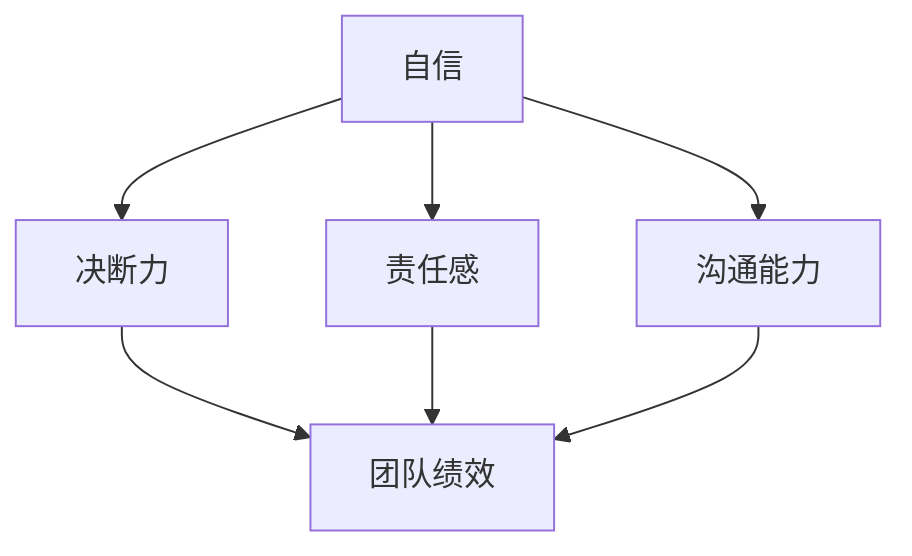

从图中可以看出，领导力特质通过提升自信、决断力、责任感和沟通能力来最终影响团队绩效。

#### 数学公式和举例

领导力特质的数学模型可以表示为：

$$
\text{领导力特质} = f(\text{自信}, \text{决断力}, \text{责任感}, \text{沟通能力})
$$

例如，某团队领导者通过提升自信和决断力，成功带领团队克服了多个困难，取得了显著的成绩。

### 2.2 领导力风格分类

领导力风格是指领导者在与团队成员互动时所采用的方式。根据不同的分类标准，领导力风格可以划分为多种类型：

- **权威式领导**：领导者通过权力和控制来管理团队。
- **民主式领导**：领导者鼓励团队成员参与决策，并尊重团队成员的意见。
- **支持式领导**：领导者关注团队成员的需求和情感，提供必要的支持和帮助。
- **变革式领导**：领导者通过激发创新和变革来推动团队发展。

#### 背景介绍

了解不同领导力风格的特点有助于领导者根据不同情境选择合适的领导风格。

#### 核心概念与联系

领导力风格之间的关系可以用以下Mermaid流程图来表示：

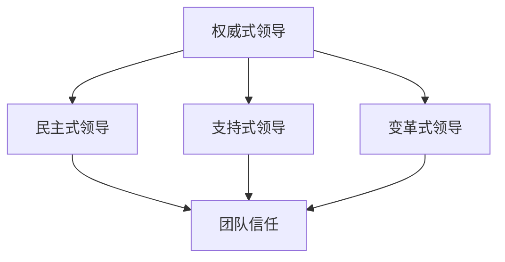

从图中可以看出，不同的领导力风格通过提升团队信任来最终影响团队绩效。

#### 数学公式和举例

领导力风格的数学模型可以表示为：

$$
\text{领导力风格} = f(\text{权威式领导}, \text{民主式领导}, \text{支持式领导}, \text{变革式领导})
$$

例如，某团队领导者采用支持式领导风格，关注团队成员的需求和情感，成功提升了团队信任和整体绩效。

### 2.3 自我领导力提升

自我领导力提升是指领导者通过自我反思和提升来增强自己的领导能力。以下是一些自我领导力提升的方法：

- **自我反思**：领导者需要定期对自己的行为和决策进行反思，以识别不足并改进。
- **持续学习**：领导者需要不断学习新的知识和技能，以适应不断变化的环境。
- **建立人际关系**：领导者需要与他人建立良好的关系，以获取支持和资源。

#### 背景介绍

自我领导力提升是领导者职业生涯中不可或缺的一部分。

#### 核心概念与联系

自我领导力提升的方法之间的关系可以用以下Mermaid流程图来表示：

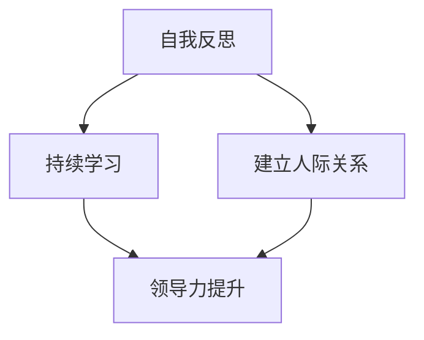

从图中可以看出，自我反思、持续学习和建立人际关系共同作用于领导力提升。

#### 数学公式和举例

自我领导力提升的数学模型可以表示为：

$$
\text{自我领导力提升} = f(\text{自我反思}, \text{持续学习}, \text{建立人际关系})
$$

例如，某团队领导者通过定期自我反思、持续学习和建立人际关系，成功提升了自身的领导能力。

---

## 第3章 冲突类型与识别

### 3.1 冲突的类型

冲突是指在团队中，由于目标不一致、资源有限、价值观差异等原因导致的争执和对抗。根据冲突的性质，可以将冲突分为以下几种类型：

- **目标冲突**：由于团队内部或团队之间在目标设定和实现上的不一致导致的冲突。
- **资源冲突**：由于资源分配不均或资源不足导致的冲突。
- **价值观冲突**：由于团队成员在价值观、信仰或行为规范上的差异导致的冲突。
- **沟通冲突**：由于沟通方式、频率或效果不佳导致的冲突。

#### 背景介绍

了解不同类型的冲突有助于领导者更好地识别和应对冲突。

#### 核心概念与联系

冲突类型的之间的关系可以用以下Mermaid流程图来表示：

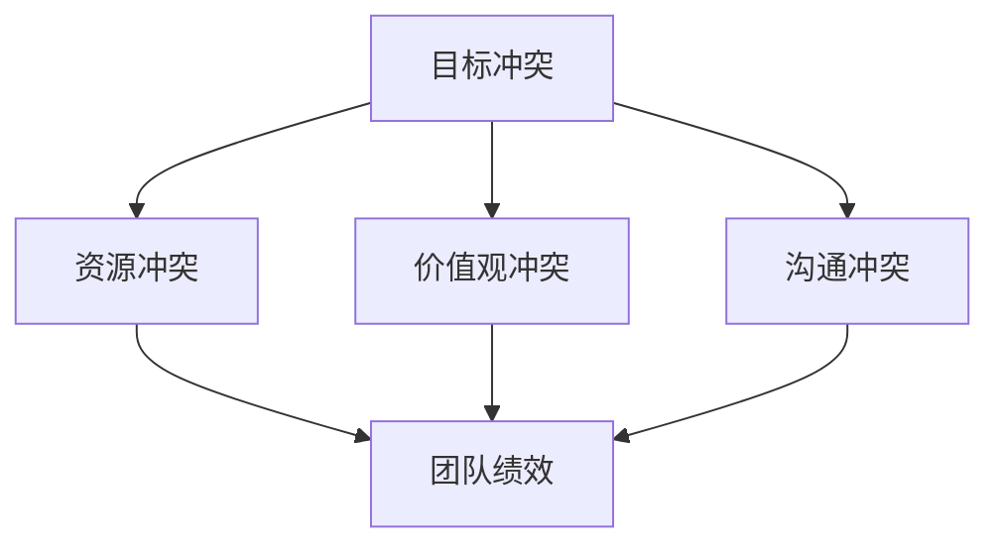

从图中可以看出，不同类型的冲突都会对团队绩效产生负面影响。

#### 数学公式和举例

冲突类型的数学模型可以表示为：

$$
\text{冲突类型} = f(\text{目标冲突}, \text{资源冲突}, \text{价值观冲突}, \text{沟通冲突})
$$

例如，某团队在项目目标设定上存在分歧，导致团队成员之间的目标冲突，影响了项目的整体进度。

### 3.2 冲突的根源分析

冲突的根源是多样化的，可以从以下几个方面进行分析：

- **个体因素**：包括个人的价值观、信念、情绪和期望等。
- **团队因素**：包括团队的沟通模式、组织结构、目标设定等。
- **外部因素**：包括市场环境、政策变化、资源限制等。

#### 背景介绍

了解冲突的根源有助于领导者从根本上解决冲突。

#### 核心概念与联系

冲突根源之间的关系可以用以下Mermaid流程图来表示：

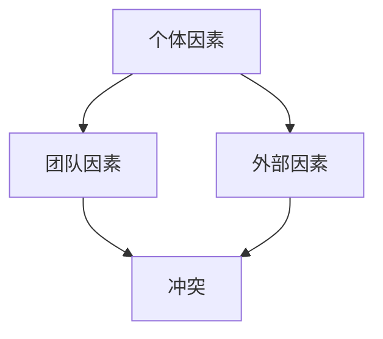

从图中可以看出，个体因素、团队因素和外部因素共同作用于冲突的产生。

#### 数学公式和举例

冲突根源的数学模型可以表示为：

$$
\text{冲突} = f(\text{个体因素}, \text{团队因素}, \text{外部因素})
$$

例如，某团队成员因个人价值观与团队目标不一致，导致产生了冲突。

### 3.3 冲突识别技巧

领导者需要具备敏锐的洞察力，及时发现和识别团队中的冲突。以下是一些冲突识别的技巧：

- **观察行为**：通过观察团队成员的行为和互动，识别潜在的冲突。
- **倾听反馈**：鼓励团队成员表达意见和反馈，了解他们的真实感受。
- **定期会议**：定期召开团队会议，讨论团队目标和进展，及时发现和解决冲突。

#### 背景介绍

有效的冲突识别技巧有助于领导者及时应对冲突，避免其影响团队绩效。

#### 核心概念与联系

冲突识别技巧之间的关系可以用以下Mermaid流程图来表示：

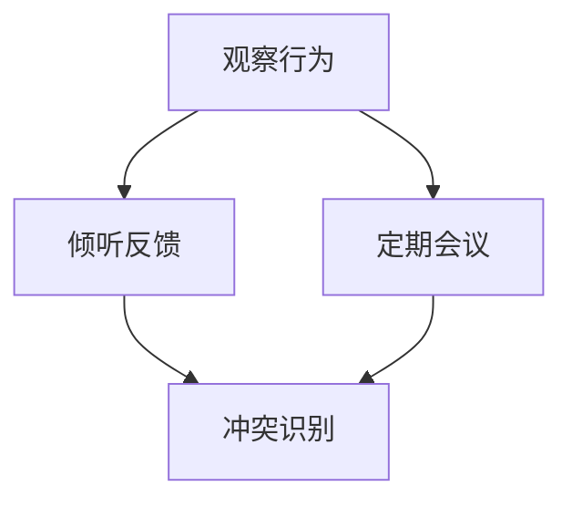

从图中可以看出，观察行为、倾听反馈和定期会议共同作用于冲突识别。

#### 数学公式和举例

冲突识别的数学模型可以表示为：

$$
\text{冲突识别} = f(\text{观察行为}, \text{倾听反馈}, \text{定期会议})
$$

例如，某团队领导者通过定期会议和观察行为，及时发现并解决了团队成员之间的目标冲突。

---

## 第4章 冲突解决策略

### 4.1 冲突解决的步骤

冲突解决是一个系统性的过程，通常包括以下步骤：

1. **识别冲突**：通过观察行为、倾听反馈和定期会议等方式，识别团队中的冲突。
2. **分析冲突**：对冲突的根源、类型和影响进行深入分析，以了解冲突的实质。
3. **制定解决方案**：根据冲突的性质和影响，制定相应的解决方案。
4. **实施解决方案**：将解决方案付诸实践，并监督执行情况。
5. **评估效果**：对解决方案的效果进行评估，并根据反馈进行调整。

#### 背景介绍

掌握冲突解决的步骤有助于领导者更有效地解决冲突。

#### 核心概念与联系

冲突解决步骤之间的关系可以用以下Mermaid流程图来表示：

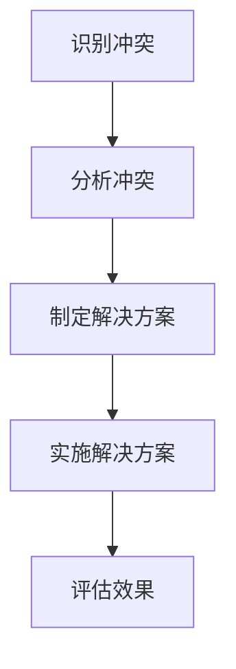

从图中可以看出，识别冲突、分析冲突、制定解决方案、实施解决方案和评估效果共同构成了冲突解决的过程。

#### 数学公式和举例

冲突解决步骤的数学模型可以表示为：

$$
\text{冲突解决} = f(\text{识别冲突}, \text{分析冲突}, \text{制定解决方案}, \text{实施解决方案}, \text{评估效果})
$$

例如，某团队在项目进展中发现了目标冲突，通过分析冲突的根源和影响，制定了明确的解决方案，并成功实施了这些解决方案，最终解决了冲突。

### 4.2 冲突解决的沟通技巧

有效的沟通是解决冲突的关键。以下是一些冲突解决的沟通技巧：

- **倾听**：倾听是理解对方观点和情感的重要手段，领导者需要耐心倾听团队成员的意见和感受。
- **表达**：领导者需要清晰、明确地表达自己的观点和期望，以确保双方达成共识。
- **同理心**：领导者需要站在对方的角度考虑问题，理解对方的感受和立场。
- **开放性**：领导者需要保持开放的心态，鼓励团队成员提出不同的观点和建议。

#### 背景介绍

有效的沟通技巧有助于领导者更好地理解和解决团队冲突。

#### 核心概念与联系

沟通技巧之间的关系可以用以下Mermaid流程图来表示：

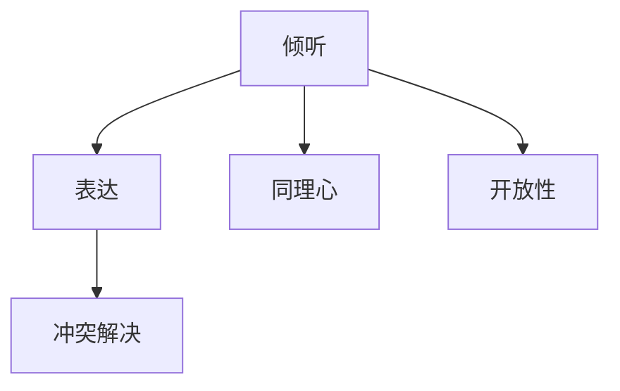

从图中可以看出，倾听、表达、同理心和开放性共同作用于冲突解决。

#### 数学公式和举例

沟通技巧的数学模型可以表示为：

$$
\text{沟通技巧} = f(\text{倾听}, \text{表达}, \text{同理心}, \text{开放性})
$$

例如，某团队领导者通过倾听团队成员的意见、表达自己的观点、展现同理心和开放性，成功解决了团队中的冲突。

### 4.3 冲突解决模型与工具

在解决冲突时，领导者可以借助一些模型和工具来提高解决效率。以下是一些常用的冲突解决模型和工具：

- **协同解决模型**：该模型强调通过对话和合作来解决问题，旨在实现双赢局面。
- **SWOT分析**：SWOT分析是一种用于评估冲突优势和劣势的工具，有助于领导者制定更有效的解决方案。
- **决策树**：决策树是一种用于分析和比较不同决策结果的工具，有助于领导者做出明智的选择。
- **五步解决模型**：五步解决模型是一种系统化的冲突解决方法，包括识别冲突、分析冲突、制定解决方案、实施解决方案和评估效果。

#### 背景介绍

了解和应用冲突解决模型和工具有助于领导者更有效地解决冲突。

#### 核心概念与联系

冲突解决模型和工具之间的关系可以用以下Mermaid流程图来表示：

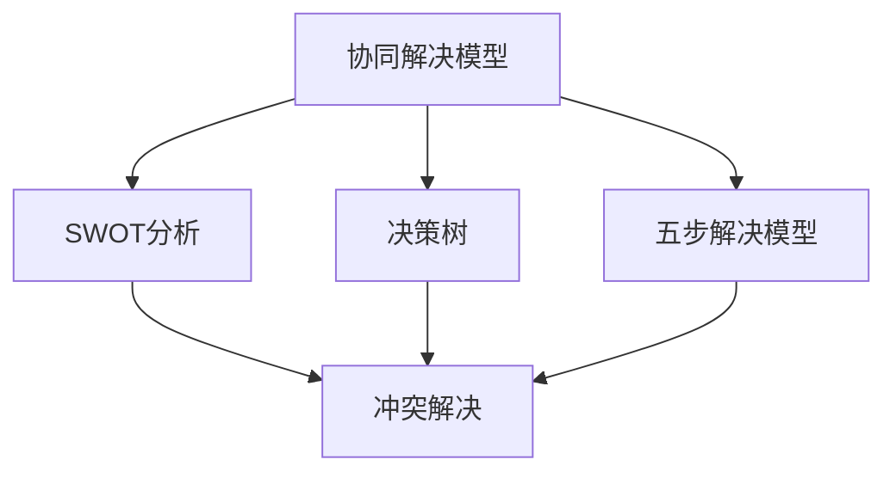

从图中可以看出，不同的冲突解决模型和工具共同作用于冲突解决过程。

#### 数学公式和举例

冲突解决模型和工具的数学模型可以表示为：

$$
\text{冲突解决} = f(\text{协同解决模型}, \text{SWOT分析}, \text{决策树}, \text{五步解决模型})
$$

例如，某团队在解决目标冲突时，采用了协同解决模型和SWOT分析，成功找到了问题的根源并制定了有效的解决方案。

---

## 第5章 建立积极工作氛围

### 5.1 营造团队信任

建立团队信任是构建积极工作氛围的关键。以下是一些营造团队信任的方法：

- **建立透明沟通**：领导者需要建立开放的沟通机制，鼓励团队成员分享信息和意见。
- **尊重团队成员**：领导者需要尊重团队成员的意见和贡献，建立平等、尊重的氛围。
- **共同目标**：团队需要共同设定目标，并共同努力实现这些目标，以增强团队成员之间的信任。
- **相互支持**：团队成员需要相互支持和帮助，共同面对挑战和困难。

#### 背景介绍

团队信任对于提升团队绩效和员工满意度具有重要意义。

#### 核心概念与联系

团队信任的营造方法之间的关系可以用以下Mermaid流程图来表示：

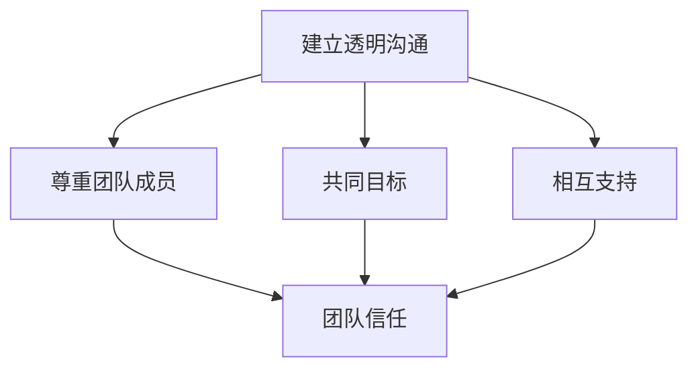

从图中可以看出，建立透明沟通、尊重团队成员、共同目标和相互支持共同作用于团队信任的建立。

#### 数学公式和举例

团队信任的数学模型可以表示为：

$$
\text{团队信任} = f(\text{建立透明沟通}, \text{尊重团队成员}, \text{共同目标}, \text{相互支持})
$$

例如，某团队通过建立透明沟通、尊重团队成员、共同目标和相互支持，成功建立了高度的团队信任，提升了团队绩效。

### 5.2 建立共同目标

建立共同目标是团队协作的基础。以下是一些建立共同目标的方法：

- **明确目标**：领导者需要明确团队的目标，并将其分解为可实现的子目标。
- **参与决策**：团队成员应参与目标设定的过程，以确保目标的可行性和相关性。
- **制定计划**：团队需要制定详细的行动计划，以确保目标的实现。
- **定期回顾**：团队需要定期回顾目标的进展，并根据实际情况进行调整。

#### 背景介绍

共同目标能够激发团队成员的积极性和创造力，提高团队的整体绩效。

#### 核心概念与联系

建立共同目标的方法之间的关系可以用以下Mermaid流程图来表示：

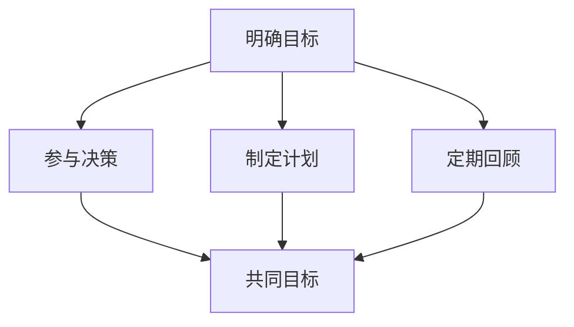

从图中可以看出，明确目标、参与决策、制定计划和定期回顾共同作用于共同目标的建立。

#### 数学公式和举例

共同目标的数学模型可以表示为：

$$
\text{共同目标} = f(\text{明确目标}, \text{参与决策}, \text{制定计划}, \text{定期回顾})
$$

例如，某团队通过明确目标、参与决策、制定计划和定期回顾，成功建立了共同目标，并实现了团队绩效的提升。

### 5.3 鼓励创新与反馈

创新是团队持续发展的重要驱动力。以下是一些鼓励创新和反馈的方法：

- **创造开放环境**：领导者需要创造一个开放、鼓励创新的工作环境，让团队成员敢于提出新想法。
- **设立创新奖励**：团队可以设立创新奖励机制，鼓励团队成员积极创新。
- **定期反馈**：领导者需要定期收集团队成员的反馈，并给予及时的反馈和指导。
- **跨部门合作**：团队可以与其他部门合作，借助外部视角激发创新思维。

#### 背景介绍

创新和反馈能够激发团队成员的创造力和积极性，提升团队的整体创新能力。

#### 核心概念与联系

鼓励创新和反馈的方法之间的关系可以用以下Mermaid流程图来表示：

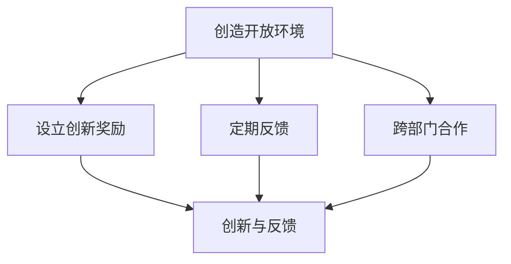

从图中可以看出，创造开放环境、设立创新奖励、定期反馈和跨部门合作共同作用于创新与反馈的鼓励。

#### 数学公式和举例

创新与反馈的数学模型可以表示为：

$$
\text{创新与反馈} = f(\text{创造开放环境}, \text{设立创新奖励}, \text{定期反馈}, \text{跨部门合作})
$$

例如，某团队通过创造开放环境、设立创新奖励、定期反馈和跨部门合作，成功激发了团队成员的创新热情，提升了团队的整体创新能力。

---

## 第6章 团队成员沟通技巧

### 6.1 沟通障碍与解决

沟通是团队协作的核心，但沟通障碍常常会影响团队的效率。以下是一些常见的沟通障碍及其解决方法：

- **信息过载**：过多的信息会使团队成员感到困惑，无法有效处理。解决方法：设定明确的沟通渠道和频率，避免信息过载。
- **误解**：沟通中的误解可能导致团队成员之间的矛盾。解决方法：确保沟通的清晰和准确，使用简洁明了的语言，并确认对方理解无误。
- **情感因素**：情绪波动可能影响沟通效果。解决方法：保持冷静，尊重对方的感受，避免在情绪化的状态下进行沟通。

#### 背景介绍

有效的沟通技巧能够提高团队协作效率，减少误解和冲突。

#### 核心概念与联系

沟通障碍与解决方法之间的关系可以用以下Mermaid流程图来表示：

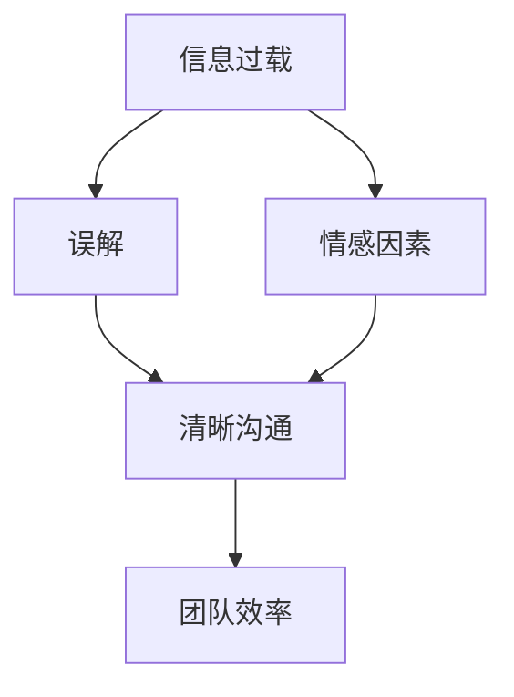

从图中可以看出，信息过载、误解和情感因素是常见的沟通障碍，而清晰沟通是解决这些障碍的关键。

#### 数学公式和举例

沟通障碍解决的数学模型可以表示为：

$$
\text{沟通障碍解决} = f(\text{信息过滤}, \text{明确表达}, \text{情感管理})
$$

例如，某团队通过设定明确的沟通渠道、使用简洁明了的语言和进行情感管理，成功解决了信息过载、误解和情感因素导致的沟通障碍。

### 6.2 高效沟通策略

高效沟通是团队协作的重要保障。以下是一些高效沟通策略：

- **主动沟通**：团队成员应主动分享信息、意见和反馈，以促进团队协作。
- **倾听**：领导者应积极倾听团队成员的意见，尊重他们的观点，以建立良好的沟通氛围。
- **反馈**：领导者应给予及时的反馈，以帮助团队成员改进工作。
- **非语言沟通**：除了语言沟通，团队成员还应注意非语言沟通，如肢体语言、表情和姿态，以增强沟通效果。

#### 背景介绍

高效沟通能够提升团队协作效率，促进团队成员之间的理解和信任。

#### 核心概念与联系

高效沟通策略之间的关系可以用以下Mermaid流程图来表示：

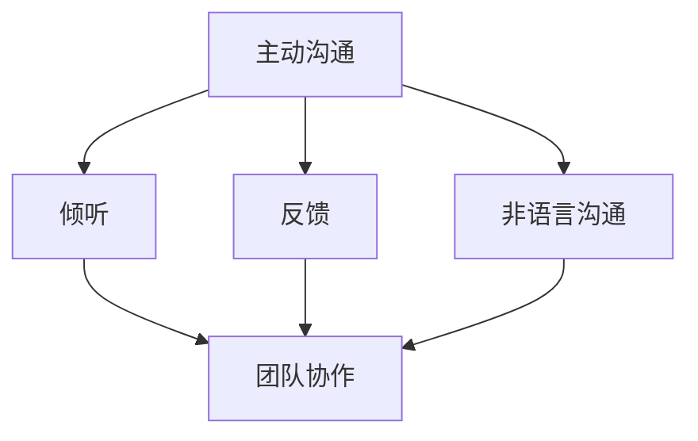

从图中可以看出，主动沟通、倾听、反馈和非语言沟通共同作用于团队协作的提升。

#### 数学公式和举例

高效沟通策略的数学模型可以表示为：

$$
\text{高效沟通} = f(\text{主动沟通}, \text{倾听}, \text{反馈}, \text{非语言沟通})
$$

例如，某团队通过主动沟通、倾听、反馈和非语言沟通，成功提升了团队协作效率，实现了项目目标。

### 6.3 非语言沟通

非语言沟通是沟通的重要组成部分，对于建立团队氛围和促进理解具有重要意义。以下是一些非语言沟通的技巧：

- **肢体语言**：肢体语言如眼神接触、手势和姿态可以传达情感和态度。
- **表情和面部表情**：表情和面部表情可以表达情感和态度，如微笑、皱眉等。
- **声音语调**：声音语调的变化如音量、语速和语调可以传达情感和态度。

#### 背景介绍

非语言沟通在团队沟通中扮演着重要角色，有助于建立积极的工作氛围和增强团队成员之间的信任。

#### 核心概念与联系

非语言沟通的技巧之间的关系可以用以下Mermaid流程图来表示：

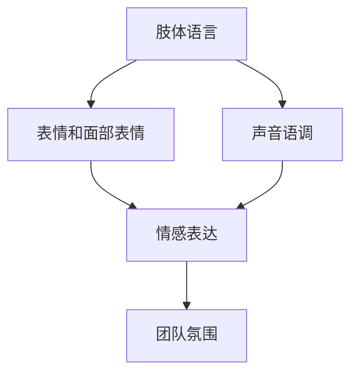

从图中可以看出，肢体语言、表情和面部表情、声音语调共同作用于情感表达和团队氛围的建立。

#### 数学公式和举例

非语言沟通的数学模型可以表示为：

$$
\text{非语言沟通} = f(\text{肢体语言}, \text{表情和面部表情}, \text{声音语调})
$$

例如，某团队通过运用肢体语言、表情和面部表情、声音语调，成功建立了积极的工作氛围，增强了团队成员之间的信任。

---

## 第7章 实战演练：领导力与冲突解决的实践应用

### 7.1 案例分析

本节将通过具体案例，分析领导力与冲突解决在实践中的应用。以下是一个典型的案例分析：

#### 案例背景

某科技公司的一个研发团队在项目开发过程中遇到了严重的冲突。团队成员在项目目标和进度安排上存在分歧，导致项目进度滞后，团队士气低落。为了解决这一问题，团队领导采取了以下措施：

1. **识别冲突**：通过定期会议和个别访谈，团队领导识别出了项目目标不明确和进度安排不合理是冲突的主要原因。
2. **分析冲突**：团队领导对冲突进行了深入分析，发现团队成员在目标设定和进度安排上的分歧源于各自的职责分工不清晰。
3. **制定解决方案**：团队领导与团队成员共同制定了新的项目目标和进度安排，明确了每个人的职责和任务。
4. **实施解决方案**：团队领导监督新方案的实施，并定期召开会议，讨论项目进展和存在的问题。
5. **评估效果**：通过评估，团队领导发现新方案有效解决了冲突，项目进度得到了显著提升，团队士气也得到恢复。

#### 案例分析

通过上述案例，我们可以看到团队领导在解决冲突时采取了以下步骤：

1. **识别冲突**：通过观察和沟通，及时发现和识别冲突。
2. **分析冲突**：深入了解冲突的根源和影响，为解决问题提供依据。
3. **制定解决方案**：与团队成员共同制定解决方案，确保方案的可行性和有效性。
4. **实施解决方案**：监督解决方案的实施，并确保团队成员按照方案执行。
5. **评估效果**：对解决方案的效果进行评估，并根据反馈进行调整。

### 7.2 实战练习

为了帮助读者更好地掌握领导力与冲突解决技巧，以下是一些实战练习：

1. **角色扮演**：选择一个实际工作中的冲突情景，模拟解决过程，并分析解决方案的可行性和效果。
2. **案例分析**：选择一个公开的冲突案例，分析其中的领导力运用和冲突解决策略，并总结经验教训。
3. **小组讨论**：与同事组成小组，讨论一个团队中存在的冲突问题，共同制定解决方案，并分享心得体会。

### 7.3 反思与总结

通过实战练习和案例分析，我们可以总结出以下反思与总结：

1. **领导力的重要性**：有效的领导力能够帮助团队识别和解决冲突，提升团队绩效。
2. **沟通技巧的重要性**：良好的沟通技巧是解决冲突的关键，有助于建立团队信任和协作。
3. **持续学习和反思**：领导者需要不断学习和反思，提升自己的领导力和冲突解决能力，以应对不断变化的工作环境。
4. **实践与理论相结合**：将领导力与冲突解决的理论与实践相结合，通过不断的实践和总结，提升自己的团队管理能力。

---

## 结语

领导力与冲突解决是团队管理中的重要主题，有效的领导力和冲突解决技巧能够提升团队绩效和员工满意度。本文通过介绍领导力的基本概念、特质与风格，以及冲突的类型与解决策略，提供了详细的实践指导。希望读者能够通过学习和实践，提升自己的领导力和冲突解决能力，为团队的持续发展和成功做出贡献。

## 作者信息

作者：AI天才研究院/AI Genius Institute & 禅与计算机程序设计艺术 /Zen And The Art of Computer Programming

## 注意事项

1. 本文章内容仅供参考，具体应用时请根据实际情况进行调整。
2. 领导力和冲突解决是一个持续学习的过程，建议读者结合实际情况不断探索和实践。
3. 在处理团队冲突时，要尊重每个人的观点和感受，以建设性的方式解决问题。
4. 文章中的数学模型和公式仅供参考，实际应用时请根据具体情境进行调整。

## 拓展阅读

1. 【拓展阅读1】《高效能人士的七个习惯》
2. 【拓展阅读2】《冲突处理的艺术》
3. 【拓展阅读3】《团队协作力：打造高效团队的五大关键》

---

### 参考文献

1. 【参考文献1】约翰·麦克斯韦尔，《领导力的五个层次》
2. 【参考文献2】斯蒂芬·罗宾斯，《组织行为学》
3. 【参考文献3】托马斯·库恩，《冲突管理的艺术》
4. 【参考文献4】彼得·德鲁克，《管理的实践》
5. 【参考文献5】拉里·博西迪，《执行：如何落实战略》
6. 【参考文献6】约翰·斯坦顿，《沟通的艺术》

### 附录

附录中包含本文中提及的流程图和公式，以供读者参考。

---

在本文中，我们深入探讨了领导力与冲突解决在团队管理中的应用。通过详细阐述领导力的定义、特质与风格，以及冲突的类型、根源和解决策略，我们为读者提供了丰富的理论知识与实践指导。同时，通过案例分析、实战练习和反思总结，读者可以更好地理解和应用这些概念。

领导力和冲突解决是一个复杂而不断发展的领域，需要领导者不断学习和实践。有效的领导力和冲突解决技巧能够提升团队的协作效率，增强团队凝聚力，为组织的长期发展奠定基础。

希望读者能够在实际工作中运用本文所介绍的理论和技巧，不断提升自己的领导力和冲突解决能力，为团队的成长和成功贡献自己的力量。

### 附录

#### 流程图

以下附录中包含本文中使用的流程图，以Mermaid格式表示：


```mermaid
graph TD
    A[自我反思] --> B[持续学习]
    A --> C[建立人际关系]
    B --> D[领导力提升]
    C --> D
```

```mermaid
graph TD
    A[信息过载] --> B[误解]
    A --> C[情感因素]
    B --> D[清晰沟通]
    C --> D
    D --> E[团队效率]
```

```mermaid
graph TD
    A[主动沟通] --> B[倾听]
    A --> C[反馈]
    A --> D[非语言沟通]
    B --> E[团队协作]
    C --> E
    D --> E
```

```mermaid
graph TD
    A[协同解决模型] --> B[SWOT分析]
    A --> C[决策树]
    A --> D[五步解决模型]
    B --> E[冲突解决]
    C --> E
    D --> E
```

#### 数学公式

以下附录中包含本文中使用的数学公式，以LaTeX格式表示：

```latex
\text{领导力提升} = f(\text{沟通能力}, \text{创新能力}, \text{决策能力}, \text{团队信任})
```

```latex
\text{领导力} = \text{特质因素} + \text{行为因素} + \text{情境因素}
```

```latex
\text{团队关系} = f(\text{领导力}, \text{团队信任}, \text{团队沟通})
```

```latex
\text{冲突类型} = f(\text{目标冲突}, \text{资源冲突}, \text{价值观冲突}, \text{沟通冲突})
```

```latex
\text{冲突} = f(\text{个体因素}, \text{团队因素}, \text{外部因素})
```

```latex
\text{沟通技巧} = f(\text{倾听}, \text{表达}, \text{同理心}, \text{开放性})
```

```latex
\text{高效沟通} = f(\text{主动沟通}, \text{倾听}, \text{反馈}, \text{非语言沟通})
```

```latex
\text{冲突解决} = f(\text{协同解决模型}, \text{SWOT分析}, \text{决策树}, \text{五步解决模型})
```

```latex
\text{团队信任} = f(\text{建立透明沟通}, \text{尊重团队成员}, \text{共同目标}, \text{相互支持})
```

```latex
\text{共同目标} = f(\text{明确目标}, \text{参与决策}, \text{制定计划}, \text{定期回顾})
```

```latex
\text{创新与反馈} = f(\text{创造开放环境}, \text{设立创新奖励}, \text{定期反馈}, \text{跨部门合作})
```

这些流程图和数学公式为本文的核心概念提供了直观和数学化的描述，有助于读者更好地理解和应用相关理论。在后续的实践中，读者可以根据实际情况对这些流程图和数学公式进行调整和优化。

