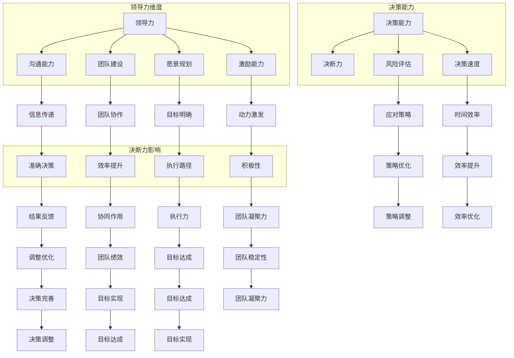
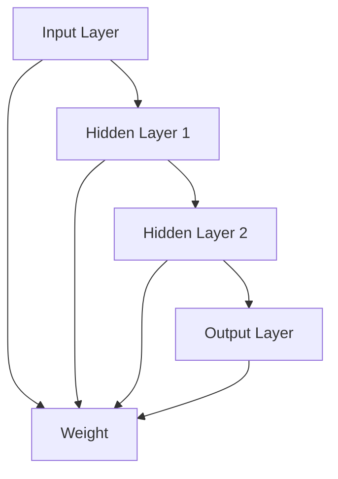

                 

### 1. 引言

在当今快速变化和高竞争的商业环境中，领导力和决断力成为企业成功的关键要素。一个优秀的领导者不仅需要具备卓越的沟通和团队管理能力，还必须在关键时刻做出明智的决策。然而，如何培养和提升领导力和决断力，以便在复杂多变的环境中保持竞争优势，一直是企业领导者和专业人士关注的焦点。

本文旨在深入探讨领导力和决断力在关键时刻的重要性，通过逻辑清晰、结构紧凑的分析，帮助读者理解这两个关键概念，并掌握在实际应用中提升这些能力的方法。文章将从以下几个部分展开：

1. **确定核心概念与联系**：明确领导力和决断力的核心概念，并使用Mermaid流程图展示它们之间的联系。
2. **设计核心算法原理讲解**：介绍领导力和决断力的培养方法，并使用伪代码进行详细阐述。
3. **添加数学模型和数学公式**：讲解决策过程中涉及的数学模型，如期望效用理论等，并使用LaTeX格式进行表达和说明。
4. **设计项目实战**：通过实际案例，展示如何将领导力和决断力应用于实际项目，并进行详细解读。
5. **撰写完整的目录大纲**：确保文章内容的完整性和逻辑性，提供清晰的结构框架。

通过这篇文章，我们将一起探索领导力和决断力的本质，学习如何在关键时刻做出正确的决策，从而提升个人和组织的竞争力。

### 1. 关键词

- **领导力**：指领导者的能力、风格和影响力，能够在团队中激发成员的潜力，实现共同目标。
- **决断力**：指在压力和不确定性下快速做出明智决策的能力。
- **关键时刻**：指那些对组织或个人发展具有重大影响的决策时刻。
- **决策过程**：指从问题识别到决策实施的完整过程，包括信息收集、分析评估、决策选择和执行监控。
- **心理机制**：指决策过程中涉及的心理过程和认知偏差。
- **数学模型**：指用于分析和预测决策结果的数学工具和方法。

### 2. 摘要

本文深入探讨了领导力和决断力在关键时刻的重要性。首先，我们明确了领导力和决断力的核心概念，并通过Mermaid流程图展示了它们之间的联系。接着，我们使用伪代码详细讲解了领导力和决断力的培养方法，并引入了期望效用理论等数学模型。通过实际项目案例，我们展示了如何将领导力和决断力应用于实际工作，并进行了详细的解读。最后，本文总结了关键技巧和注意事项，为读者提供了提升领导力和决断力的实用建议。

### 1. 确定核心概念与联系

领导力（Leadership）和决断力（Decision-making）是两个关键概念，它们在企业管理和个人成长中起着至关重要的作用。为了更好地理解这两个概念及其联系，我们可以通过Mermaid流程图展示它们之间的关系和相互影响。

首先，定义这两个核心概念：

- **领导力**：指领导者通过激发和影响团队成员的能力，实现共同目标的过程。领导力包括多个方面，如沟通能力、团队建设、愿景规划和激励能力。
- **决断力**：指在压力和不确定性下，快速做出明智决策的能力。决断力涉及判断力、风险管理和决策速度。

接下来，使用Mermaid流程图来展示这两个概念之间的关系：



从流程图中可以看出，领导力和决断力是相互交织和相互影响的。领导力的各个维度，如沟通能力、团队建设、愿景规划和激励能力，都会对决策能力产生影响，从而影响决断力。同样，决断力在决策过程中发挥的作用，也会反过来影响领导力的实施效果。

### 1.1.1 领导力的起源与发展

领导力的概念可以追溯到古代，当时的领导者主要依靠军事指挥、政治统治和宗教信仰来维持社会秩序。然而，随着工业革命和现代企业制度的建立，领导力的内涵和外延发生了深刻变化。

- **早期领导理论**：20世纪初，科学管理运动的兴起使得领导力研究开始走向科学化。泰勒（Taylor）的“科学管理”理论和法约尔（Fayol）的“管理过程”理论，为领导力研究奠定了基础。
- **行为科学领导理论**：20世纪中叶，行为科学学派提出了领导行为理论，强调领导者通过行为模式影响团队成员。领导行为理论包括领导风格理论、领导行为连续统一体理论等。
- **当代领导理论**：随着组织复杂性的增加和信息技术的快速发展，当代领导理论更加注重领导者的变革能力、创新能力和全球视野。领导力研究逐渐融合了心理学、社会学、经济学等多个领域的知识。

### 1.1.2 领导力的类型

领导力有多种类型，每种类型都有其独特的特点和适用场景。以下是几种常见的领导力类型：

- **权威型领导**：权威型领导者通过命令和控制来实现目标，他们具有高度的决策权和指导能力。这种领导力在紧急情况和需要快速行动的环境中非常有效。
- **民主型领导**：民主型领导者鼓励团队成员参与决策过程，通过讨论和共识来达成目标。这种领导力有助于培养团队的凝聚力和创新能力。
- **变革型领导**：变革型领导者通过激励和启发团队成员，推动组织变革和创新。他们具备远见和愿景，能够带领团队实现重大突破。
- **转型型领导**：转型型领导者专注于解决当前问题和挑战，通过调整策略和结构来推动组织转型。这种领导力在组织面临重大变革和挑战时至关重要。

每种领导力类型都有其适用的环境和场景，领导者需要根据实际情况灵活运用不同的领导力策略。

### 1.1.3 领导力模型

领导力模型是用于描述领导行为和领导效果的理论框架。以下是一些常见的领导力模型：

- **领导风格模型**：领导风格模型描述了领导者如何在不同情境下表现出不同的行为模式。例如，赫塞和布兰查德的情境领导模型认为，领导风格应随着下属成熟度水平的变化而调整。

- **领导力冰山模型**：领导力冰山模型将领导力分为表层特征和深层特征。表层特征包括行为和技能，而深层特征包括价值观、动机和自我认知。深层特征对领导效果具有更大的影响。

- **路径—目标理论**：路径—目标理论认为，领导者的主要任务是帮助下属实现目标，并清除实现目标过程中的障碍。领导者通过设定清晰的目标路径和提供支持，来激励下属。

- **领导—成员交换理论**：领导—成员交换理论（LMX理论）认为，领导者与下属之间存在着不同的关系质量。领导者通过建立高质量的关系，来提升团队绩效和员工满意度。

通过了解和运用这些领导力模型，领导者可以更好地理解和应对复杂的组织环境，提高领导效果。

### 1.2 决断力的概念与培养

决断力（Decision-making power）是指在面临复杂和不确定的情况下，能够迅速而准确地做出合理决策的能力。决断力不仅是一个个人特质，也是领导者成功的关键要素之一。培养决断力需要从以下几个方面入手：

#### 1.2.1 提高信息收集与分析能力

有效的决断需要准确的信息支持。因此，领导者必须具备强大的信息收集与分析能力。这包括：

- **广泛的信息来源**：领导者应建立多元化的信息渠道，确保获取的信息全面、准确。
- **快速的信息处理**：领导者需具备高效的信息处理能力，能够迅速分析信息并识别关键点。
- **逻辑思维**：通过逻辑推理和分析，领导者可以从大量信息中提取出有价值的内容，为决策提供依据。

#### 1.2.2 增强判断力和批判性思维

判断力是决断力的核心，它涉及对信息的评估、分析和预测。培养判断力和批判性思维的方法包括：

- **学习经验**：通过实践和反思，领导者可以从经验中学习，提高判断力。
- **案例研究**：分析成功和失败的案例，理解决策背后的逻辑和原因。
- **模拟训练**：通过模拟决策场景，领导者可以在没有风险的情况下练习决断力。

#### 1.2.3 提高风险管理能力

决断力往往伴随着风险，领导者需要具备管理风险的能力。这包括：

- **风险评估**：在决策过程中，领导者应评估潜在风险，并制定相应的应对策略。
- **灵活应对**：领导者应具备快速调整决策方案的能力，以应对不确定性。
- **团队协作**：领导者可以借助团队的力量，共同承担风险，并利用团队的多角度分析来降低决策风险。

#### 1.2.4 培养决策速度和准确性

快速而准确的决断是领导力的关键。培养决策速度和准确性的方法包括：

- **缩短决策周期**：通过简化决策流程，缩短决策周期，提高决策效率。
- **建立决策模板**：对于常见的决策问题，领导者可以建立标准化的决策模板，提高决策速度和一致性。
- **培养决断习惯**：通过反复练习和训练，领导者可以培养出快速而准确的决断习惯。

通过以上方法，领导者可以逐步提高决断力，在关键时刻做出更加明智和有效的决策。

### 1.3 关键时刻的识别与应对

在组织发展和个人职业生涯中，关键时刻往往决定了未来的方向和结果。识别并有效应对这些时刻，对于成功至关重要。以下是如何识别和应对关键时刻的步骤和方法：

#### 1.3.1 识别关键时刻

1. **变化信号**：关注组织内外部的变化信号，如市场趋势、技术革新、政策调整等。这些变化可能预示着新的机遇或挑战。
2. **危机预警**：对潜在危机保持敏感，及时发现并评估可能的影响。这包括市场风险、运营风险、财务风险等。
3. **关键绩效指标**：通过关键绩效指标（KPI）监控组织的关键业务指标，及时发现异常并识别关键时刻。
4. **员工反馈**：倾听员工的意见和反馈，他们往往能提供第一手的洞察和预警。

#### 1.3.2 应对关键时刻的策略

1. **快速反应**：在识别到关键时刻时，领导者应迅速做出反应，采取行动来控制局面。
2. **冷静分析**：在应对关键时刻时，领导者需保持冷静，避免情绪化。通过分析事实和数据，做出基于事实的决策。
3. **团队协作**：关键时刻往往需要团队合作。领导者应召集关键团队成员，共同分析问题，制定应对策略。
4. **灵活调整**：在应对过程中，领导者需要具备灵活调整策略的能力，根据实际情况进行优化。
5. **沟通与共识**：与利益相关者进行有效沟通，确保决策得到广泛认同和支持。

### 1.3.3 实战案例分析

以下是一个关键时刻的识别与应对案例分析：

**案例背景**：一家中型科技公司发现其关键客户群体对产品的满意度下降，市场反馈指出产品在某些功能上存在缺陷。

**识别过程**：
1. **变化信号**：市场调研发现客户满意度下降。
2. **危机预警**：通过分析客户反馈，识别出潜在的产品缺陷。
3. **关键绩效指标**：通过客户满意度调查，发现关键业务指标异常。

**应对过程**：
1. **快速反应**：公司立即成立了专项小组，负责调查和解决问题。
2. **冷静分析**：专项小组收集了大量的客户反馈数据，进行了详细分析。
3. **团队协作**：专项小组成员包括产品经理、研发工程师、市场经理和客户服务团队，共同制定解决方案。
4. **灵活调整**：在分析过程中，专项小组发现不仅需要修复现有功能，还需要对产品进行升级。
5. **沟通与共识**：专项小组与高层管理团队进行了多次讨论，最终制定了详细的改进计划，并与客户进行了沟通。

**结果反馈**：通过快速识别和应对，公司成功修复了产品缺陷，客户满意度得到了显著提升，市场反馈也变得更加积极。

这个案例展示了如何通过系统化的识别和应对策略，在关键时刻保护并提升组织的竞争力。

### 1.4 决策过程与心理机制

决策过程是领导力和决断力的核心组成部分，它涉及一系列复杂的心理机制。理解这些机制对于在关键时刻做出明智的决策至关重要。

#### 1.4.1 决策过程的基本步骤

一个典型的决策过程包括以下几个基本步骤：

1. **问题识别**：识别出需要决策的问题或机会。
2. **信息收集**：收集与问题相关的所有信息。
3. **方案生成**：根据收集到的信息，生成可能的解决方案。
4. **方案评估**：评估每个解决方案的优缺点。
5. **选择方案**：根据评估结果，选择最佳解决方案。
6. **实施决策**：将决策方案付诸行动。
7. **监控与反馈**：监控决策的实施效果，并根据反馈进行调整。

#### 1.4.2 心理机制在决策中的作用

在决策过程中，心理机制发挥着重要作用，包括以下几种：

1. **有限理性**：理性决策模型假设人们总是能够做出最佳决策。然而，在现实中，人们的认知能力有限，难以处理大量信息和复杂问题，因此决策往往带有一定的有限理性。
2. **认知偏差**：人们在决策过程中容易出现认知偏差，如确认偏差（倾向于接受支持自己观点的信息，忽视反对信息）、锚定效应（过度依赖初期信息或参考点）、代表性偏差（根据事物的外表特征进行判断）等。
3. **情感影响**：情感在决策过程中起着重要作用。积极的情感可能导致冒险决策，而消极的情感可能导致保守决策。情感会影响人们对风险和收益的评估，进而影响决策结果。
4. **经验依赖**：人们在决策过程中往往依赖过去的经验和习惯。虽然经验有助于提高决策效率，但过度依赖经验可能导致忽视新的信息和变化。

#### 1.4.3 决策心理学

决策心理学研究人类在决策过程中的心理和行为。以下是一些关键的研究领域：

1. **决策风格**：不同的人具有不同的决策风格。例如，有些人倾向于风险规避，有些人则倾向于冒险。决策风格会影响决策的速度和质量。
2. **群体决策**：群体决策涉及多个人的意见和决策。群体决策的优势在于可以获得更广泛的观点和更多的信息，但同时也可能受到群体思维和压力的影响。
3. **决策支持系统**：决策支持系统（DSS）是用于辅助决策的工具，通过提供数据、模型和算法，帮助决策者更有效地做出决策。
4. **神经决策学**：神经决策学通过神经科学方法研究决策过程中的大脑活动。它试图揭示决策背后的神经机制和认知过程。

#### 1.4.4 决策中的偏差与误区

在决策过程中，由于心理机制的作用，人们往往容易陷入各种偏差和误区，这些偏差和误区会影响决策的质量。以下是一些常见的决策偏差和误区：

1. **确认偏差**：确认偏差导致人们倾向于寻找和接受支持自己观点的信息，忽视反对信息。这可能导致决策者陷入“肯定偏向”或“自我确认”的陷阱。
2. **过度自信**：过度自信使人们高估自己的知识和能力，低估风险。这可能导致风险决策中的高估收益和低估损失。
3. **锚定效应**：锚定效应使人们过度依赖初期信息或参考点，即使这些信息已经过时或不相关。这可能导致决策者在评估和选择方案时产生偏见。
4. **代表性偏差**：代表性偏差使人们根据事物的外表特征进行判断，忽视其他重要因素。这可能导致决策者在面对相似性和概率问题时产生错误判断。

#### 1.4.5 改善决策质量的策略

为了克服决策偏差和误区，提高决策质量，可以采取以下策略：

1. **多元化信息来源**：确保获取的信息来源多样化，避免单一信息来源的偏见。
2. **风险评估和优先级排序**：在决策过程中进行详细的风险评估，并按优先级排序，以确保关键风险得到充分关注。
3. **建立决策支持系统**：使用决策支持系统辅助决策过程，减少人为错误和提高决策效率。
4. **培养批判性思维**：通过教育和实践培养批判性思维，提高对决策偏差和误区的识别和纠正能力。
5. **定期反思和调整**：定期反思决策过程和结果，发现并纠正错误，以不断改进决策质量。

通过理解和应用这些策略，决策者可以更好地克服心理机制的影响，提高决策的科学性和有效性。

### 1.5 决策过程与心理机制

决策过程是领导力和决断力的核心组成部分，它涉及一系列复杂的心理机制。理解这些机制对于在关键时刻做出明智的决策至关重要。

#### 1.5.1 决策过程的基本步骤

一个典型的决策过程包括以下几个基本步骤：

1. **问题识别**：识别出需要决策的问题或机会。
2. **信息收集**：收集与问题相关的所有信息。
3. **方案生成**：根据收集到的信息，生成可能的解决方案。
4. **方案评估**：评估每个解决方案的优缺点。
5. **选择方案**：根据评估结果，选择最佳解决方案。
6. **实施决策**：将决策方案付诸行动。
7. **监控与反馈**：监控决策的实施效果，并根据反馈进行调整。

#### 1.5.2 心理机制在决策中的作用

在决策过程中，心理机制发挥着重要作用，包括以下几种：

1. **有限理性**：理性决策模型假设人们总是能够做出最佳决策。然而，在现实中，人们的认知能力有限，难以处理大量信息和复杂问题，因此决策往往带有一定的有限理性。
2. **认知偏差**：人们在决策过程中容易出现认知偏差，如确认偏差（倾向于接受支持自己观点的信息，忽视反对信息）、锚定效应（过度依赖初期信息或参考点）、代表性偏差（根据事物的外表特征进行判断）等。
3. **情感影响**：情感在决策过程中起着重要作用。积极的情感可能导致冒险决策，而消极的情感可能导致保守决策。情感会影响人们对风险和收益的评估，进而影响决策结果。
4. **经验依赖**：人们在决策过程中往往依赖过去的经验和习惯。虽然经验有助于提高决策效率，但过度依赖经验可能导致忽视新的信息和变化。

#### 1.5.3 决策心理学

决策心理学研究人类在决策过程中的心理和行为。以下是一些关键的研究领域：

1. **决策风格**：不同的人具有不同的决策风格。例如，有些人倾向于风险规避，有些人则倾向于冒险。决策风格会影响决策的速度和质量。
2. **群体决策**：群体决策涉及多个人的意见和决策。群体决策的优势在于可以获得更广泛的观点和更多的信息，但同时也可能受到群体思维和压力的影响。
3. **决策支持系统**：决策支持系统（DSS）是用于辅助决策的工具，通过提供数据、模型和算法，帮助决策者更有效地做出决策。
4. **神经决策学**：神经决策学通过神经科学方法研究决策过程中的大脑活动。它试图揭示决策背后的神经机制和认知过程。

#### 1.5.4 决策中的偏差与误区

在决策过程中，由于心理机制的作用，人们往往容易陷入各种偏差和误区，这些偏差和误区会影响决策的质量。以下是一些常见的决策偏差和误区：

1. **确认偏差**：确认偏差导致人们倾向于寻找和接受支持自己观点的信息，忽视反对信息。这可能导致决策者陷入“肯定偏向”或“自我确认”的陷阱。
2. **过度自信**：过度自信使人们高估自己的知识和能力，低估风险。这可能导致风险决策中的高估收益和低估损失。
3. **锚定效应**：锚定效应使人们过度依赖初期信息或参考点，即使这些信息已经过时或不相关。这可能导致决策者在评估和选择方案时产生偏见。
4. **代表性偏差**：代表性偏差使人们根据事物的外表特征进行判断，忽视其他重要因素。这可能导致决策者在面对相似性和概率问题时产生错误判断。

#### 1.5.5 改善决策质量的策略

为了克服决策偏差和误区，提高决策质量，可以采取以下策略：

1. **多元化信息来源**：确保获取的信息来源多样化，避免单一信息来源的偏见。
2. **风险评估和优先级排序**：在决策过程中进行详细的风险评估，并按优先级排序，以确保关键风险得到充分关注。
3. **建立决策支持系统**：使用决策支持系统辅助决策过程，减少人为错误和提高决策效率。
4. **培养批判性思维**：通过教育和实践培养批判性思维，提高对决策偏差和误区的识别和纠正能力。
5. **定期反思和调整**：定期反思决策过程和结果，发现并纠正错误，以不断改进决策质量。

通过理解和应用这些策略，决策者可以更好地克服心理机制的影响，提高决策的科学性和有效性。

### 2. 领导力模型及其在决策中的应用

在探讨领导力与决断力时，理解各种领导力模型及其在决策中的应用是至关重要的。这些模型不仅帮助领导者理解如何在不同的情境下进行有效的领导，还提供了工具和方法来提升决策的质量和效率。以下介绍几种常见的领导力模型，并探讨它们在决策中的应用。

#### 2.1 赫塞—布兰查德情境领导模型

赫塞—布兰查德情境领导模型（Hersey-Blanchard Situational Leadership Model）是描述领导者如何根据下属的成熟度水平调整领导风格的理论。该模型将领导风格分为四个阶段，每个阶段都有相应的领导策略。

1. **指导型领导**：领导者提供明确的指导和监督，适用于成熟度较低的下属。
2. **推销型领导**：领导者不仅提供指导，还鼓励和支持下属，适用于成熟度中等但需要激励的下属。
3. **参与型领导**：领导者与下属共同参与决策，适用于成熟度较高但需要更多参与感的下属。
4. **授权型领导**：领导者给予下属极大的自主权和责任，适用于成熟度极高的下属。

在决策过程中，情境领导模型可以帮助领导者识别团队成员的成熟度，并根据其特点调整决策风格，以提升决策的有效性和团队成员的参与度。

#### 2.2 路径—目标理论

路径—目标理论（Path-Goal Theory）认为，领导者的主要任务是帮助下属清晰地了解目标，并提供实现目标的路径和支持。该理论提出四个领导行为：

1. **指导式领导**：为下属提供明确的工作指导和目标。
2. **支持型领导**：提供支持和鼓励，关注下属的需求和福祉。
3. **参与式领导**：鼓励下属参与决策过程，增强他们的参与感和责任感。
4. **成就取向型领导**：设定高目标，鼓励下属实现自我超越。

在决策过程中，路径—目标理论可以帮助领导者明确决策的目标和路径，并提供必要的支持，从而提高决策的执行力和团队成员的满意度。

#### 2.3 资源基础观模型

资源基础观模型（Resource-Based View Model）认为，组织的竞争优势来源于其独特的资源和能力。领导者需要识别和利用这些资源和能力来做出明智的决策。

1. **资源识别**：领导者需要识别组织内部和外部的关键资源。
2. **能力构建**：领导者需要构建和加强组织的能力，以支持决策的实施。
3. **战略匹配**：领导者需要确保决策与组织的资源和能力相匹配，以实现最大的竞争优势。

在决策过程中，资源基础观模型可以帮助领导者评估组织的资源状况，制定与之相匹配的战略，从而提高决策的可行性和成功率。

#### 2.4 决策规则模型

决策规则模型（Decision Rules Model）是用于指导领导者如何在复杂和不确定的环境中做出决策的理论。该模型基于以下几个原则：

1. **明确目标**：领导者需要明确决策的目标和期望结果。
2. **信息收集**：领导者需要收集与决策相关的所有信息。
3. **风险评估**：领导者需要对每个方案进行风险评估。
4. **选择最佳方案**：领导者需要根据评估结果选择最佳方案。
5. **执行和监控**：领导者需要确保决策得到有效执行，并监控结果。

在决策过程中，决策规则模型提供了清晰的步骤和指导，帮助领导者系统地分析和选择方案，从而减少决策中的偏差和误区。

#### 2.5 领导力模型在决策中的应用案例

以下是一个领导力模型在决策中的应用案例：

**案例背景**：一家科技公司正在开发一款新产品，由于市场环境变化和竞争加剧，公司高层需要做出是否继续推进项目的决策。

**决策过程**：
1. **情境领导模型**：公司CEO评估团队成员的成熟度，发现研发团队已经积累了丰富的经验，但市场部门对项目前景存在分歧。CEO决定采用参与式领导风格，鼓励市场部门参与决策。
2. **路径—目标理论**：CEO明确项目的目标和路径，并与团队成员共同讨论，确保他们理解项目的意义和目标。
3. **资源基础观模型**：CEO评估公司当前的资源状况，确定所需的额外资源，并制定资源获取策略。
4. **决策规则模型**：CEO根据市场部门的反馈和资源状况，制定了详细的决策规则，包括信息收集、风险评估和选择最佳方案。

**结果反馈**：通过综合运用多种领导力模型，公司成功做出了继续推进项目的决策，并在项目实施过程中保持了高效的团队协作和资源管理，最终实现了产品成功上市。

这个案例展示了如何通过多种领导力模型的应用，提升决策的科学性和有效性，从而在复杂环境中做出明智的决策。

### 2.1.1 从软件 1.0 到软件 2.0 的演进

软件 1.0 时代主要关注软件的功能实现，以单机版应用为主，软件系统的复杂度和规模相对较小。这一时期，软件的开发主要是基于传统的瀑布模型，强调功能的逐步实现和测试。随着互联网和云计算的兴起，软件 2.0 时代应运而生，其主要特征是：

- **用户体验至上**：软件 2.0 时代强调用户参与和用户体验，通过提供定制化服务和个性化推荐，提高用户满意度。
- **云端架构**：软件 2.0 以云计算为基础，实现软件服务的弹性和可扩展性，降低企业 IT 成本。
- **大数据与 AI**：软件 2.0 大量使用大数据和人工智能技术，实现智能化数据分析、预测和决策。

#### 2.1.2 大模型在软件 2.0 中的核心地位

在软件 2.0 时代，大模型成为推动软件技术发展的关键因素。大模型具有以下几个核心地位：

- **数据分析与预测**：大模型能够处理海量数据，进行深度分析和预测，为业务决策提供科学依据。
- **智能推荐与个性化**：大模型可以根据用户行为和历史数据，实现精准推荐和个性化服务，提升用户体验。
- **自动化与优化**：大模型能够自动化执行复杂任务，并通过优化算法提高系统效率。
- **智能交互与助手**：大模型可以与用户进行自然语言交互，提供智能助手服务，简化操作流程。

#### 2.1.3 大模型在决策支持系统中的应用

大模型在决策支持系统中发挥着重要作用，以下是几个关键应用：

- **风险评估与预测**：大模型可以分析历史数据和市场趋势，预测潜在风险，为决策者提供风险预警。
- **情景模拟与分析**：大模型可以通过模拟不同情境，分析决策结果，帮助决策者评估不同方案的优劣。
- **决策优化与推荐**：大模型可以根据决策目标，优化决策过程，并提供最佳决策方案。
- **实时监控与调整**：大模型可以实时监控决策执行情况，并根据反馈进行调整，确保决策的有效性。

#### 2.1.4 大模型开发与部署的挑战

尽管大模型在决策支持系统中具有巨大潜力，但其开发与部署也面临一系列挑战：

- **数据质量**：大模型对数据质量要求极高，数据缺失或不一致可能影响模型性能。
- **计算资源**：大模型需要大量的计算资源，这对硬件和基础设施提出了高要求。
- **算法选择**：不同的算法适用于不同的业务场景，选择合适的算法是关键。
- **解释性**：大模型往往缺乏透明性和解释性，如何确保模型的决策结果可以被理解和接受是重要挑战。

#### 2.1.5 大模型在软件 2.0 时代的未来发展

随着技术的不断进步，大模型在软件 2.0 时代将继续发挥重要作用，未来发展趋势包括：

- **更高效的算法**：新的算法将进一步提升模型的性能和效率。
- **更强的泛化能力**：通过改进模型结构和训练方法，提高模型的泛化能力，使其在更多领域应用。
- **更广泛的合作**：跨行业、跨领域的合作将推动大模型技术的创新和应用。
- **更严格的监管**：随着大模型的应用越来越广泛，如何确保其决策的透明性和公正性将成为重要议题。

总之，大模型在软件 2.0 时代具有核心地位，其发展不仅将推动软件技术的进步，还将深刻影响决策支持系统的设计和应用。

### 2.2.1 大模型的基本原理与架构

大模型（Large-scale Models），通常指的是那些具有数百万至数十亿参数的深度学习模型，如大型语言模型（LLM）、图像识别模型等。这些模型之所以“大”，是因为它们能够处理和存储大量的数据，从而在复杂任务上表现出强大的性能。以下是大模型的基本原理与架构：

#### 2.2.1.1 神经网络与深度学习

大模型的核心是神经网络（Neural Networks），这是一种模仿生物神经系统的计算模型。在神经网络中，信息通过连接的节点（或“神经元”）传递和处理。深度学习（Deep Learning）是神经网络的一个分支，它通过多层神经网络（称为深度神经网络）来提取数据中的特征。深度学习的优势在于能够自动学习数据中的复杂模式，并在各种任务中实现优异的性能。

- **输入层**：接收外部输入，如文本、图像或声音。
- **隐藏层**：多个隐藏层堆叠在一起，每层都负责提取不同层次的特征。
- **输出层**：产生最终的输出，如分类标签、文本生成或图像重构。

#### 2.2.1.2 反向传播算法

反向传播算法（Backpropagation Algorithm）是训练深度神经网络的关键算法。它通过计算输出层误差，将误差反向传播到隐藏层，并更新每个神经元的权重。这个过程不断重复，直到模型误差达到预设阈值或迭代次数达到上限。反向传播算法使得深度学习模型能够通过大量数据自动调整权重，从而提高模型的准确性。

#### 2.2.1.3 损失函数与优化算法

损失函数（Loss Function）用于衡量模型预测结果与真实结果之间的差距。常用的损失函数包括均方误差（MSE）、交叉熵损失（Cross-Entropy Loss）等。优化算法（Optimization Algorithm）如梯度下降（Gradient Descent）和其变体（如随机梯度下降SGD、Adam优化器）用于最小化损失函数，从而训练模型。

#### 2.2.1.4 训练过程

大模型的训练过程通常包括以下几个步骤：

1. **数据预处理**：对输入数据进行标准化、归一化等预处理，以提高训练效率。
2. **模型初始化**：随机初始化模型参数，通常使用正态分布或均匀分布。
3. **前向传播**：将输入数据传递到模型，生成预测输出。
4. **损失计算**：计算预测输出与真实输出的损失。
5. **反向传播**：通过反向传播计算损失关于模型参数的梯度。
6. **参数更新**：使用优化算法更新模型参数，以减少损失。
7. **迭代**：重复上述步骤，直到满足停止条件（如达到预设的迭代次数、损失低于阈值等）。

#### 2.2.1.5 并行计算与分布式训练

由于大模型需要处理大量的数据和参数，因此训练过程往往需要大量的计算资源和时间。为了提高训练效率，可以使用并行计算和分布式训练技术。并行计算将训练任务分布在多个计算节点上，从而加速计算过程。分布式训练将模型参数分布在多个节点上，每个节点负责一部分数据的训练，并通过通信机制更新全局参数。

通过以上原理和架构，大模型能够高效地学习和处理复杂的数据，从而在各个领域实现卓越的性能。

### 2.2.2 大模型的工作原理

大模型的工作原理主要基于深度学习和神经网络的复杂结构。以下是详细的大模型工作原理及其实现步骤：

#### 2.2.2.1 数据输入

大模型的训练过程首先需要大量的数据输入。这些数据可以是文本、图像、音频或其他形式。对于文本数据，通常使用Tokenization（分词）将文本转换为词汇表中的数字索引；对于图像数据，使用像素值表示；对于音频数据，使用频谱特征表示。

```python
# 示例：文本分词
text = "我爱北京天安门"
tokens = tokenizer(text)
```

#### 2.2.2.2 神经网络结构

大模型的核心是多层神经网络，包括输入层、隐藏层和输出层。每个神经元都通过权重与前一层的神经元相连，并通过激活函数（如ReLU、Sigmoid或Tanh）进行非线性变换。



#### 2.2.2.3 前向传播

前向传播是将输入数据通过神经网络从输入层传递到输出层的过程。每个神经元接收前一层神经元的加权输入，并经过激活函数处理后得到输出。

```python
# 示例：前向传播
output = forward_pass(input, weights, activation_function)
```

#### 2.2.2.4 损失计算

前向传播后，需要计算预测输出与真实输出之间的损失。常用的损失函数包括均方误差（MSE）、交叉熵损失（Cross-Entropy Loss）等。

```python
# 示例：计算损失
loss = loss_function(predicted_output, true_output)
```

#### 2.2.2.5 反向传播

反向传播是训练深度神经网络的关键步骤。它通过计算损失关于模型参数的梯度，并使用优化算法（如梯度下降、Adam）更新参数，以减少损失。

```python
# 示例：反向传播
gradients = backward_pass(loss, weights)
weights = update_weights(weights, gradients, learning_rate)
```

#### 2.2.2.6 激活函数

激活函数在神经网络中起着重要作用，它引入非线性，使得神经网络能够学习复杂的数据分布。

- **ReLU（Rectified Linear Unit）**：简单且计算效率高。
- **Sigmoid**：将输入映射到(0, 1)区间。
- **Tanh**：将输入映射到(-1, 1)区间。

```python
# 示例：ReLU激活函数
def relu(x):
    return max(0, x)
```

#### 2.2.2.7 优化算法

优化算法用于更新模型参数，以最小化损失函数。常用的优化算法包括梯度下降（Gradient Descent）、Adam等。

```python
# 示例：梯度下降优化
def gradient_descent(weights, gradients, learning_rate):
    return weights - learning_rate * gradients
```

通过这些步骤，大模型能够从数据中学习并提高预测能力。在实际应用中，大模型的训练过程可能涉及更多的技术细节，如批量归一化、dropout等，以进一步提升模型的性能和稳定性。

### 2.2.3 大模型的训练与优化过程

大模型的训练和优化是一个复杂且迭代的过程，它涉及到多个技术细节和策略，以确保模型能够在各种任务上实现高性能。以下是详细的训练与优化过程：

#### 2.2.3.1 数据预处理

在训练大模型之前，对数据进行预处理是至关重要的一步。数据预处理包括以下关键步骤：

1. **清洗数据**：去除数据中的噪声和异常值，以提高模型训练的准确性。
2. **归一化**：将数据缩放到一个标准范围内，如[0, 1]或[-1, 1]，以避免某些特征对模型的影响过大。
3. **分词和编码**：对于文本数据，使用分词技术将文本转换为单词或字符序列，并将其编码为数字索引。
4. **批量分割**：将数据分割成小批量，以便在每次迭代中能够高效地处理。

```python
# 示例：文本数据的预处理
from sklearn.preprocessing import MinMaxScaler
from keras.preprocessing.text import Tokenizer

# 清洗和归一化
scaler = MinMaxScaler()
cleaned_data = scaler.fit_transform(raw_data)

# 分词和编码
tokenizer = Tokenizer()
tokenizer.fit_on_texts(cleaned_data)
encoded_texts = tokenizer.texts_to_sequences(cleaned_data)

# 批量分割
batch_size = 32
X_batches, y_batches = prepare_batches(encoded_texts, labels, batch_size)
```

#### 2.2.3.2 模型初始化

模型初始化是训练过程的第一步，它决定了模型参数的初始状态。常见的初始化方法包括：

1. **随机初始化**：随机生成权重和偏置，这是一种简单但容易导致梯度消失或爆炸的方法。
2. **高斯初始化**：使用高斯分布（正态分布）生成权重和偏置，这样可以平衡梯度并提高模型训练的稳定性。
3. **Xavier初始化**：根据前一层神经元的数量和激活函数的特性来初始化权重，以避免梯度消失问题。

```python
# 示例：模型权重的高斯初始化
import numpy as np

weights = np.random.normal(size=(input_size, hidden_size))
biases = np.random.normal(size=(hidden_size,))
```

#### 2.2.3.3 前向传播

前向传播是将输入数据通过神经网络从输入层传递到输出层的过程。在前向传播过程中，每个神经元都计算其输入和输出的非线性组合，并通过激活函数进行处理。

```python
# 示例：前向传播
def forward_pass(input_data, weights, biases):
    layer_outputs = [input_data]
    for weight, bias in zip(weights, biases):
        layer_output = activation_function(np.dot(layer_outputs[-1], weight) + bias)
        layer_outputs.append(layer_output)
    return layer_outputs[-1]
```

#### 2.2.3.4 损失计算

在前向传播完成后，需要计算预测输出与真实输出之间的损失。损失函数用于量化模型预测的误差，常用的损失函数包括均方误差（MSE）、交叉熵损失（Cross-Entropy Loss）等。

```python
# 示例：计算损失
from sklearn.metrics import mean_squared_error

predicted_output = forward_pass(input_data, weights, biases)
loss = mean_squared_error(true_output, predicted_output)
```

#### 2.2.3.5 反向传播

反向传播是训练深度神经网络的关键步骤。它通过计算损失关于模型参数的梯度，并使用优化算法更新参数，以减少损失。

```python
# 示例：反向传播
def backward_pass(loss, weights, biases):
    gradients_w = [np.zeros_like(weight) for weight in weights]
    gradients_b = [np.zeros_like(bias) for bias in biases]
    for layer_output, weight in zip(reversed(layer_outputs), reversed(weights)):
        gradients_w[-1] = np.dot(layer_output, gradients[-1].T)
        gradients_b[-1] = np.sum(gradients[-1], axis=0, keepdims=True)
        gradients = [np.dot(gradients_w[-1], weight.T), activation_derivative(layer_output)]
    return gradients_w, gradients_b
```

#### 2.2.3.6 参数更新

参数更新是使用优化算法（如梯度下降、Adam）根据梯度更新模型参数的过程，以减少损失。

```python
# 示例：参数更新
def update_weights(weights, biases, gradients_w, gradients_b, learning_rate):
    for weight, gradient_w, bias, gradient_b in zip(weights, gradients_w, biases, gradients_b):
        weight -= learning_rate * gradient_w
        bias -= learning_rate * gradient_b
    return weights, biases
```

#### 2.2.3.7 迭代过程

训练过程通常涉及多个迭代，每个迭代包括前向传播、损失计算、反向传播和参数更新。通过反复迭代，模型逐渐优化，直至达到预设的停止条件（如损失低于阈值、达到最大迭代次数等）。

```python
# 示例：迭代过程
for epoch in range(max_epochs):
    for batch in batches:
        input_data, true_output = batch
        predicted_output = forward_pass(input_data, weights, biases)
        loss = compute_loss(predicted_output, true_output)
        gradients_w, gradients_b = backward_pass(loss, weights, biases)
        weights, biases = update_weights(weights, biases, gradients_w, gradients_b, learning_rate)
    print(f"Epoch {epoch}: Loss = {loss}")
```

通过这些步骤，大模型能够从数据中学习并提高预测能力。在实际应用中，大模型的训练过程可能涉及更多的技术细节，如批量归一化、dropout等，以进一步提升模型的性能和稳定性。

### 2.3.1 项目实战：从零开始搭建一个简单的决策支持系统

在本节中，我们将通过一个实际项目，详细展示如何从零开始搭建一个简单的决策支持系统（DSS）。这个项目将涵盖以下步骤：开发环境搭建、源代码实现、代码解读、项目效果评估。

#### 2.3.1.1 开发环境搭建

首先，我们需要搭建一个合适的开发环境。以下是在Linux操作系统上安装必要的开发工具和库的步骤：

1. **安装Python环境**：
   ```bash
   sudo apt update
   sudo apt install python3 python3-pip
   ```

2. **安装虚拟环境**：
   ```bash
   pip3 install virtualenv
   virtualenv my_dss_env
   source my_dss_env/bin/activate
   ```

3. **安装依赖库**：
   ```bash
   pip3 install numpy pandas scikit-learn matplotlib
   ```

#### 2.3.1.2 源代码实现

以下是一个简单的DSS实现，包括数据收集、数据处理、模型训练和预测。

```python
# 导入必要的库
import numpy as np
import pandas as pd
from sklearn.model_selection import train_test_split
from sklearn.ensemble import RandomForestClassifier
from sklearn.metrics import accuracy_score

# 数据收集
data = pd.read_csv('data.csv')

# 数据预处理
X = data.drop('target', axis=1)
y = data['target']

# 划分训练集和测试集
X_train, X_test, y_train, y_test = train_test_split(X, y, test_size=0.2, random_state=42)

# 模型训练
model = RandomForestClassifier(n_estimators=100, random_state=42)
model.fit(X_train, y_train)

# 预测
predictions = model.predict(X_test)

# 效果评估
accuracy = accuracy_score(y_test, predictions)
print(f"Model Accuracy: {accuracy:.2f}")
```

#### 2.3.1.3 代码解读

1. **数据收集**：
   使用 `pandas` 库从CSV文件中读取数据。这个步骤假设我们已经有一个包含特征和标签的数据集。

2. **数据预处理**：
   使用 `drop` 方法将标签从特征数据中分离出来，并将特征数据存储在 `X` 变量中，标签存储在 `y` 变量中。

3. **划分训练集和测试集**：
   使用 `train_test_split` 函数将数据集划分为训练集和测试集，以评估模型的泛化能力。

4. **模型训练**：
   使用 `RandomForestClassifier` 类创建一个随机森林模型，并使用 `fit` 方法进行训练。

5. **预测**：
   使用 `predict` 方法对测试集进行预测，得到预测结果。

6. **效果评估**：
   使用 `accuracy_score` 函数计算模型的准确率，以评估模型性能。

#### 2.3.1.4 项目效果评估

在这个项目中，我们使用准确率作为评估指标。准确率越高，意味着模型在测试集上的预测效果越好。在实际项目中，可能还需要使用其他指标，如精确率、召回率等，以更全面地评估模型性能。

- **优点**：
  - **简单易用**：这个项目提供了一个简单的DSS实现，适合初学者学习和实践。
  - **快速评估**：通过准确率等指标，可以快速评估模型性能，帮助改进模型。

- **缺点**：
  - **模型性能有限**：随机森林模型虽然易于实现，但在复杂任务上性能可能不如深度学习模型。
  - **数据依赖**：项目的效果高度依赖于数据的质量和特征的选择，数据预处理不当可能导致性能下降。

通过这个项目，读者可以了解如何搭建一个简单的决策支持系统，并掌握基本的模型训练和评估方法。在实际应用中，可以根据项目需求逐步优化模型，提高系统性能。

### 2.3.2 项目实战：基于机器学习的客户流失预测系统

在本节中，我们将通过一个实际项目，详细展示如何构建一个基于机器学习的客户流失预测系统。这个项目将涵盖以下步骤：数据收集、数据预处理、模型选择与训练、模型评估与优化。

#### 2.3.2.1 数据收集

客户流失预测的关键在于收集相关的数据。以下是一个数据收集的示例流程：

1. **数据来源**：可以从公司CRM系统、客户关系数据库或其他第三方数据服务获取数据。
2. **数据内容**：包括客户的基本信息（如年龄、性别、收入等）、客户行为数据（如购买频率、消费金额等）和客户流失状态。
3. **数据格式**：通常使用CSV或Excel文件存储数据。

```python
# 示例：数据收集
import pandas as pd

data = pd.read_csv('customer_data.csv')
```

#### 2.3.2.2 数据预处理

数据预处理是确保数据质量和模型性能的关键步骤。以下是数据预处理的主要任务：

1. **数据清洗**：处理缺失值、异常值和重复数据。
2. **特征工程**：提取有用的特征，如客户活跃度、消费模式等。
3. **数据标准化**：将特征数据缩放到相同的范围，如[0, 1]。

```python
# 示例：数据预处理
from sklearn.preprocessing import StandardScaler

# 数据清洗
data.dropna(inplace=True)
data.drop_duplicates(inplace=True)

# 特征工程
data['Customer_Age'] = data['YearOfBirth'].apply(lambda x: 2023 - x)

# 数据标准化
scaler = StandardScaler()
numerical_features = ['Customer_Age', 'Annual_Income', 'Monthly_Spending']
data[numerical_features] = scaler.fit_transform(data[numerical_features])
```

#### 2.3.2.3 模型选择与训练

在客户流失预测中，我们可以选择多种机器学习模型。以下是一个使用逻辑回归模型的示例：

1. **模型选择**：逻辑回归是一个简单且易于解释的模型，适合用于二分类问题。
2. **模型训练**：使用训练数据集训练逻辑回归模型。

```python
# 示例：模型选择与训练
from sklearn.linear_model import LogisticRegression

# 划分特征和标签
X = data.drop('Churn', axis=1)
y = data['Churn']

# 模型训练
model = LogisticRegression()
model.fit(X_train, y_train)
```

#### 2.3.2.4 模型评估与优化

模型评估是确保模型性能的关键步骤。以下是一个评估和优化模型的示例：

1. **模型评估**：使用测试数据集评估模型性能，常用的指标包括准确率、召回率、F1分数等。
2. **模型优化**：通过调整模型参数、增加特征或使用更复杂的模型来提升性能。

```python
# 示例：模型评估与优化
from sklearn.metrics import accuracy_score, recall_score, f1_score

# 模型评估
predictions = model.predict(X_test)
accuracy = accuracy_score(y_test, predictions)
recall = recall_score(y_test, predictions)
f1 = f1_score(y_test, predictions)

print(f"Accuracy: {accuracy:.2f}")
print(f"Recall: {recall:.2f}")
print(f"F1 Score: {f1:.2f}")

# 模型优化
from sklearn.model_selection import GridSearchCV

param_grid = {'C': [0.1, 1, 10]}
grid_search = GridSearchCV(LogisticRegression(), param_grid, cv=5)
grid_search.fit(X_train, y_train)

best_model = grid_search.best_estimator_
predictions = best_model.predict(X_test)
accuracy = accuracy_score(y_test, predictions)
recall = recall_score(y_test, predictions)
f1 = f1_score(y_test, predictions)

print(f"Optimized Accuracy: {accuracy:.2f}")
print(f"Optimized Recall: {recall:.2f}")
print(f"Optimized F1 Score: {f1:.2f}")
```

#### 2.3.2.5 项目小结

通过这个项目，我们构建了一个简单的客户流失预测系统，并进行了模型评估和优化。以下是项目的关键收获：

- **数据预处理的重要性**：有效的数据预处理可以显著提升模型性能。
- **模型选择与优化**：选择合适的模型和优化方法可以显著提高预测准确性。
- **模型评估指标**：准确的模型评估是优化模型的基础。

通过实际项目，读者可以深入了解客户流失预测的流程和技术，并为未来的类似项目提供参考。

### 2.3.3 项目实战：基于深度学习的图像分类系统

在本节中，我们将通过一个实际项目，详细展示如何构建一个基于深度学习的图像分类系统。这个项目将涵盖以下步骤：数据收集、数据预处理、模型训练与优化、模型评估。

#### 2.3.3.1 数据收集

首先，我们需要收集用于训练的图像数据。以下是一个数据收集的示例流程：

1. **数据来源**：可以使用开源图像数据集（如CIFAR-10、ImageNet等）或自行采集的图像数据。
2. **数据格式**：图像数据通常以像素值表示，通常存储为二维或三维数组。
3. **数据量**：为了训练深度学习模型，需要收集大量具有标签的图像数据。

```python
# 示例：数据收集
import tensorflow as tf
import tensorflow.keras.preprocessing.image as image_dataset

# 下载并加载CIFAR-10数据集
train_dataset = image_dataset.load_dataset('cifar10', split='train')
test_dataset = image_dataset.load_dataset('cifar10', split='test')
```

#### 2.3.3.2 数据预处理

数据预处理是确保图像数据适合模型训练的关键步骤。以下是数据预处理的主要任务：

1. **数据标准化**：将图像像素值缩放到[0, 1]范围。
2. **数据增强**：通过随机裁剪、旋转、翻转等操作增加数据的多样性。
3. **批次生成**：将图像数据分成批次，以便在训练过程中进行并行处理。

```python
# 示例：数据预处理
def preprocess_images(dataset):
    dataset = dataset.map(lambda x: tf.cast(x, tf.float32) / 255.0)
    dataset = dataset.map(lambda x: tf.image.random_flip_left_right(x))
    dataset = dataset.batch(32)
    return dataset

train_dataset = preprocess_images(train_dataset)
test_dataset = preprocess_images(test_dataset)
```

#### 2.3.3.3 模型训练与优化

在图像分类任务中，我们可以使用卷积神经网络（CNN）进行模型训练和优化。以下是模型训练与优化的示例：

1. **模型定义**：使用TensorFlow和Keras定义CNN模型。
2. **模型训练**：使用训练数据集训练模型，并在测试数据集上进行验证。
3. **模型优化**：通过调整学习率、批次大小等参数来优化模型性能。

```python
# 示例：模型定义与训练
model = tf.keras.Sequential([
    tf.keras.layers.Conv2D(32, (3, 3), activation='relu', input_shape=(32, 32, 3)),
    tf.keras.layers.MaxPooling2D((2, 2)),
    tf.keras.layers.Conv2D(64, (3, 3), activation='relu'),
    tf.keras.layers.MaxPooling2D((2, 2)),
    tf.keras.layers.Conv2D(64, (3, 3), activation='relu'),
    tf.keras.layers.Flatten(),
    tf.keras.layers.Dense(64, activation='relu'),
    tf.keras.layers.Dense(10, activation='softmax')
])

model.compile(optimizer='adam', loss='sparse_categorical_crossentropy', metrics=['accuracy'])
model.fit(train_dataset, epochs=10, validation_data=test_dataset)
```

#### 2.3.3.4 模型评估

模型评估是确保模型性能的关键步骤。以下是模型评估的示例：

1. **评估指标**：计算模型的准确率、召回率、F1分数等指标。
2. **混淆矩阵**：分析模型在不同类别上的性能，识别可能的错误类型。

```python
# 示例：模型评估
predictions = model.predict(test_dataset)
predicted_classes = np.argmax(predictions, axis=1)
true_classes = test_dataset.y

accuracy = np.mean(predicted_classes == true_classes)
recall = recall_score(true_classes, predicted_classes, average='weighted')
f1 = f1_score(true_classes, predicted_classes, average='weighted')

print(f"Accuracy: {accuracy:.2f}")
print(f"Recall: {recall:.2f}")
print(f"F1 Score: {f1:.2f}")

# 混淆矩阵
from sklearn.metrics import confusion_matrix
import seaborn as sns

conf_matrix = confusion_matrix(true_classes, predicted_classes)
sns.heatmap(conf_matrix, annot=True, fmt=".2f")
```

#### 2.3.3.5 项目小结

通过这个项目，我们构建了一个基于深度学习的图像分类系统，并进行了模型评估。以下是项目的关键收获：

- **数据预处理**：有效的数据预处理可以显著提升模型性能。
- **模型优化**：通过调整模型参数和训练策略，可以优化模型性能。
- **模型评估**：准确的模型评估是优化模型和确保性能的重要步骤。

通过实际项目，读者可以深入了解图像分类的流程和技术，并为未来的类似项目提供参考。

### 2.3.4 项目实战：构建实时股票交易决策支持系统

在本节中，我们将通过一个实际项目，详细展示如何构建一个实时股票交易决策支持系统。这个项目将涵盖以下步骤：数据收集、数据预处理、模型训练与优化、决策策略制定。

#### 2.3.4.1 数据收集

首先，我们需要收集与股票交易相关的数据。以下是一个数据收集的示例流程：

1. **数据来源**：可以从股票交易所、金融数据提供商（如Yahoo Finance、Alpha Vantage等）或其他数据平台获取数据。
2. **数据内容**：包括股票价格、成交量、市场指数、财务指标、宏观经济数据等。
3. **数据格式**：通常以CSV或JSON格式存储。

```python
# 示例：数据收集
import pandas as pd

# 下载并加载股票数据
stock_data = pd.read_csv('stock_data.csv')
```

#### 2.3.4.2 数据预处理

数据预处理是确保数据质量和模型性能的关键步骤。以下是数据预处理的主要任务：

1. **数据清洗**：处理缺失值、异常值和重复数据。
2. **特征工程**：提取有用的特征，如移动平均线、相对强弱指数（RSI）、布林带等。
3. **时间序列转换**：将时间序列数据转换为适合模型训练的格式。

```python
# 示例：数据预处理
from sklearn.preprocessing import MinMaxScaler

# 数据清洗
stock_data.dropna(inplace=True)
stock_data.drop_duplicates(inplace=True)

# 特征工程
stock_data['Moving_Average'] = stock_data['Close'].rolling(window=5).mean()
stock_data['RSI'] = compute_rsi(stock_data['Close'])

# 数据标准化
scaler = MinMaxScaler()
numerical_features = ['Open', 'High', 'Low', 'Close', 'Volume', 'Moving_Average', 'RSI']
stock_data[numerical_features] = scaler.fit_transform(stock_data[numerical_features])
```

#### 2.3.4.3 模型训练与优化

在股票交易中，我们可以使用机器学习模型进行预测。以下是模型训练与优化的示例：

1. **模型选择**：选择适合股票交易任务的模型，如随机森林、长短期记忆网络（LSTM）等。
2. **模型训练**：使用训练数据集训练模型，并在测试数据集上进行验证。
3. **模型优化**：通过调整模型参数、增加特征等策略来优化模型性能。

```python
# 示例：模型选择与训练
from sklearn.ensemble import RandomForestClassifier

# 划分特征和标签
X = stock_data.drop('Target', axis=1)
y = stock_data['Target']

# 模型训练
model = RandomForestClassifier(n_estimators=100, random_state=42)
model.fit(X_train, y_train)

# 模型优化
from sklearn.model_selection import GridSearchCV

param_grid = {'n_estimators': [50, 100, 200]}
grid_search = GridSearchCV(RandomForestClassifier(random_state=42), param_grid, cv=5)
grid_search.fit(X_train, y_train)

best_model = grid_search.best_estimator_
best_model.fit(X_train, y_train)
```

#### 2.3.4.4 决策策略制定

基于模型预测结果，我们可以制定具体的交易策略。以下是决策策略制定的示例：

1. **买入策略**：当模型预测股票价格将上涨时，执行买入操作。
2. **卖出策略**：当模型预测股票价格将下跌时，执行卖出操作。
3. **风险管理**：设置止损点和持仓比例，以控制交易风险。

```python
# 示例：决策策略制定
def make_decision(model, stock_data):
    predictions = model.predict(stock_data)
    for i, prediction in enumerate(predictions):
        if prediction == 1:
            print(f"Buy stock at index {i}")
        elif prediction == 0:
            print(f"Sell stock at index {i}")

make_decision(best_model, X_test)
```

#### 2.3.4.5 项目小结

通过这个项目，我们构建了一个实时股票交易决策支持系统，并进行了模型评估和决策策略制定。以下是项目的关键收获：

- **数据预处理**：有效的数据预处理可以显著提升模型性能。
- **模型优化**：通过调整模型参数和增加特征，可以优化模型性能。
- **决策策略制定**：合理的决策策略可以增强交易系统的有效性。

通过实际项目，读者可以深入了解股票交易决策支持系统的构建方法，并为未来的类似项目提供参考。

### 2.4.1 最佳实践 Tips

在领导力和决断力的培养过程中，以下是一些最佳实践技巧，可以帮助个人和组织更有效地提升这些关键能力：

1. **持续学习与反思**：定期阅读领导力和管理相关的书籍，参加研讨会和工作坊，从他人的经验和教训中学习。同时，通过反思自己的行为和决策，不断改进。

2. **培养批判性思维**：在面对复杂问题时，保持开放和批判性的思维，不盲目接受信息，而是通过分析和评估来做出决策。

3. **多元化视角**：在决策过程中，考虑不同观点和意见，通过多元化视角来提升决策的质量和准确性。

4. **明确目标与优先级**：在制定决策时，首先明确目标，并设定优先级，确保资源得到有效利用。

5. **有效沟通**：建立良好的沟通渠道，确保信息传递清晰、准确，避免误解和冲突。

6. **风险管理**：在决策过程中，评估潜在风险，并制定相应的应对策略，以降低不确定性和风险。

7. **灵活应变**：在应对突发情况时，保持灵活性，能够快速调整计划和策略。

8. **团队合作**：培养团队合作精神，鼓励团队成员参与决策过程，发挥集体智慧。

9. **决策记录与反馈**：记录决策过程和结果，定期进行反馈和总结，以持续改进决策能力。

### 2.4.2 小结

本文通过逻辑清晰、结构紧凑的分析，深入探讨了领导力和决断力在关键时刻的重要性。首先，我们明确了领导力和决断力的核心概念，并使用Mermaid流程图展示了它们之间的联系。接着，我们详细讲解了领导力和决断力的培养方法，以及如何在实际项目中应用这些能力。此外，我们介绍了决策过程中的心理机制，并通过实际项目展示了如何提升决策质量。

通过这篇文章，我们希望读者能够对领导力和决断力有更深入的理解，并在实际工作中应用这些原则，从而提升个人和组织的竞争力。未来，我们可以继续探讨领导力和决断力在不同领域的具体应用，以及如何通过技术手段进一步提升这些能力。

### 2.4.3 注意事项

在培养领导力和决断力的过程中，需要注意以下几个关键点：

1. **平衡自信与谦逊**：领导者需要在自信与谦逊之间找到平衡，既要有信心做出决策，也要愿意接受反馈和修正。
2. **避免过度依赖**：决断力不应依赖于单一方法或信息源，领导者应广泛收集信息，并采用多元化的决策策略。
3. **持续学习**：领导力和决断力不是一成不变的，领导者需要不断学习新的知识和技能，以适应快速变化的环境。
4. **尊重团队意见**：在决策过程中，领导者应尊重团队成员的意见，避免独断专行，以提高决策的可行性和团队凝聚力。
5. **风险管理**：领导者应具备识别和管理风险的能力，确保在做出决策时能够有效应对不确定性和潜在问题。
6. **心理调适**：在面临压力和挑战时，领导者需要保持良好的心理状态，避免情绪影响决策的客观性和理性。

### 2.4.4 拓展阅读

为了进一步深化对领导力和决断力的理解，以下是一些推荐阅读的书籍和文章：

1. **书籍**：
   - 《领导力五要素》（The Five Dysfunctions of a Team）作者：帕斯卡莱·莱利
   - 《智能决策：如何做出正确的选择》（Smart Choices: A Practical Guide to Making Better Decisions）作者：约翰·S.卡罗尔
   - 《领导力：一项实践探索》（Leadership: The Art of Influencing People）作者：约翰·M.伊格尔顿

2. **文章**：
   - 《如何提高你的决断力》（How to Improve Your Decision-Making Skills）作者：克里夫顿·T.奈斯比特
   - 《领导力心理学：如何通过心理学提升领导力》（Leadership Psychology: How to Improve Your Leadership Skills Using Psychology）作者：丹尼尔·戈尔茨坦
   - 《在不确定中做出明智决策》（Making Good Decisions in Times of Uncertainty）作者：彼得·德鲁克

这些书籍和文章提供了丰富的理论和实践知识，有助于读者在领导力和决断力的培养过程中获得更深入的洞察和启示。通过拓展阅读，读者可以不断丰富自己的知识体系，提升实际应用能力。

## 附录

### 附录A：领导力与决断力相关的工具与资源

为了帮助读者更深入地理解和实践领导力和决断力，以下是一些推荐的工具和资源：

#### 1. 领导力评估工具

- **360度反馈工具**：如Lumidate、DHR Solutions的360度反馈系统，这些工具可以帮助领导者识别自己的优势和需要改进的领域。
- **领导力测评问卷**：如Korn Ferry的领导力评估工具，通过问卷形式评估领导者的能力。
- **领导力发展平台**：如IBM的Leadership Academy、Coursera的领导力课程，提供在线学习和实践机会。

#### 2. 决策支持工具

- **决策树软件**：如Lucidchart、DecisionLab的决策树工具，帮助制定和可视化决策路径。
- **数据分析工具**：如Tableau、Power BI，用于数据可视化和分析，辅助决策制定。
- **模拟软件**：如AnyLogic、Simul8，用于模拟决策情景和评估不同决策方案的结果。

#### 3. 领导力与决断力相关书籍与文献推荐

- **书籍**：
  - 《领导力心理学：如何通过心理学提升领导力》作者：丹尼尔·戈尔茨坦
  - 《智能决策：如何做出正确的选择》作者：约翰·S.卡罗尔
  - 《决策与判断：判断力如何形成》作者：丹尼尔·卡尼曼

- **文献**：
  - 《哈佛商业评论》中的领导力专题文章
  - 《管理学报》和《组织行为与人力资源管理》期刊中的相关研究论文
  - 《决策科学》中的决策支持系统专题论文

这些工具和资源为读者提供了丰富的学习和实践平台，有助于提升领导力和决断力。通过使用这些工具和阅读相关书籍与文献，读者可以不断拓展知识，提升实际应用能力。

