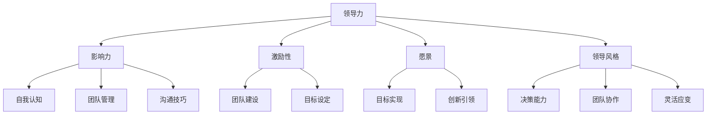
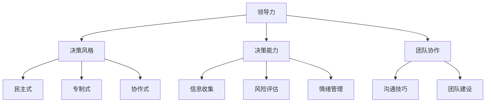
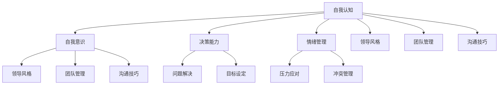
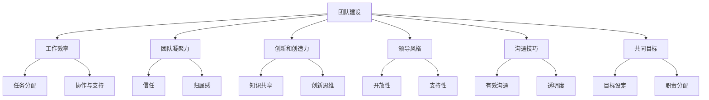
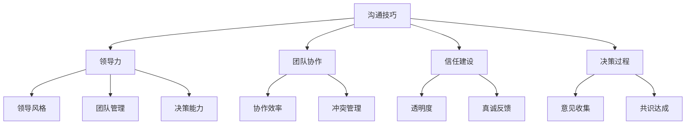
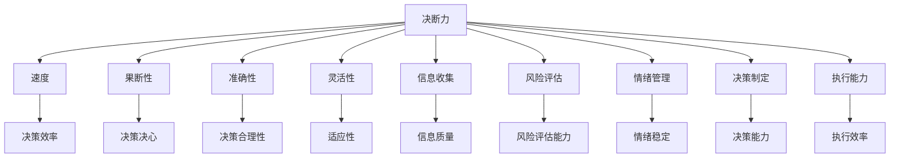
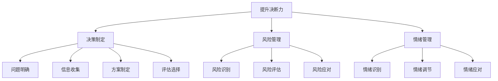
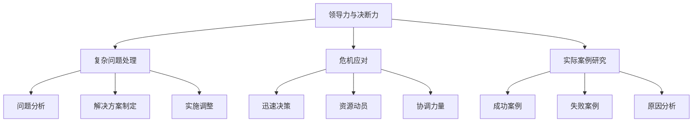
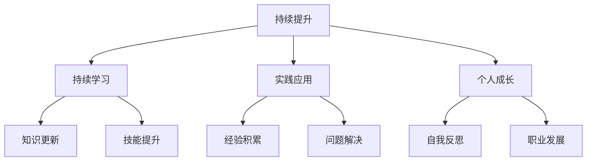

                 

### 文章标题

《领导力与决断力：果断做出艰难决策的能力》

### 文章关键词

- 领导力
- 决断力
- 决策
- 团队管理
- 情绪管理
- 自我认知

### 文章摘要

本文深入探讨了领导力和决断力在决策过程中的重要性，通过解析核心概念、阐述相互关系，并使用Mermaid流程图直观展示领导力与决断力的组成结构。文章不仅介绍了提升领导力和决断力的方法与技巧，还通过实际案例分析了其在复杂问题和危机中的实践应用。最终，本文总结了对个人领导力提升的思考，为读者提供了实用的策略和指导。

---

## 首先，我们需要对书名《领导力与决断力：果断做出艰难决策的能力》进行解读，确定书籍的核心主题和内容方向。

### 核心主题

**领导力和决断力**

在现代社会中，领导力不再仅仅是职位赋予的权威，而是一种能够影响和激励他人共同实现目标的能力。决断力则是领导力中至关重要的一个方面，它体现在领导者能否在关键时刻做出果断且明智的决策。书名中的“果断做出艰难决策的能力”强调的是在面对复杂和不确定性的情况下，领导者需要具备迅速做出决策并承担相应风险的能力。

### 内容方向

书籍的核心内容将围绕以下几个方向展开：

1. **领导力的定义与特征**：介绍领导力的基本概念，阐述其特征和关键要素，帮助读者理解领导力的本质。
2. **领导力与决策的关系**：探讨领导力对决策过程的影响，分析不同领导风格下的决策方法和决策能力。
3. **提升领导力的方法与技巧**：介绍一系列提升领导力的具体方法和技巧，包括自我认知、团队建设、沟通技巧等。
4. **决断力的定义与特征**：详细阐述决断力的概念，分析其特征和关键要素，并通过流程图展示决断力的组成部分及其相互关系。
5. **提升决断力的方法与技巧**：提供提升决断力的实用方法，如决策制定、风险管理、情绪管理等。
6. **领导力与决断力的实践应用**：通过实际案例研究，展示领导力和决断力在处理复杂问题和应对危机中的具体应用。

通过以上内容的解读，我们可以清晰地看到，这本书不仅仅是在讨论理论，更重要的是如何将理论应用到实践中，提升个人的领导力和决断力，以应对各种挑战。

### 设计书籍的整体结构

为了使书籍的内容更加系统化、结构化，我们需要设计一个清晰的整体结构，这不仅能帮助读者更好地理解书中的内容，还能提高书籍的可读性和实用性。以下是书籍的整体结构设计：

#### 第一部分：领导力的核心概念与联系

**第1章：领导力的定义与特征**

- **主要内容**：介绍领导力的基本概念，分析其特征和关键要素，并通过Mermaid流程图展示领导力的各个组成部分及其相互关系。
- **目标读者**：希望了解领导力基本概念的新手读者。

**第2章：领导力与决策的关系**

- **主要内容**：探讨领导力在决策过程中的作用，分析不同领导风格对决策的影响，介绍常见的决策方法和决策能力。
- **目标读者**：对领导力和决策感兴趣，希望提升自身决策能力的读者。

#### 第二部分：提升领导力的方法与技巧

**第3章：自我认知与领导力**

- **主要内容**：阐述自我认知在领导力提升中的重要性，介绍提升自我认知的方法和技巧。
- **目标读者**：希望更好地了解自我，提升自我领导力的读者。

**第4章：团队建设与领导力**

- **主要内容**：讨论团队建设对领导力提升的影响，介绍团队建设的方法和技巧。
- **目标读者**：从事团队管理工作，希望提升团队领导力的管理者。

**第5章：沟通技巧与领导力**

- **主要内容**：探讨沟通技巧在领导力提升中的作用，介绍有效的沟通方法和技巧。
- **目标读者**：希望提升沟通能力，增强领导力的读者。

#### 第三部分：决断力的核心概念与联系

**第6章：决断力的定义与特征**

- **主要内容**：详细阐述决断力的基本概念，分析其特征和关键要素，并通过Mermaid流程图展示决断力的各个组成部分及其相互关系。
- **目标读者**：希望深入了解决断力，掌握其基本原理的读者。

**第7章：提升决断力的方法与技巧**

- **主要内容**：提供提升决断力的具体方法和技巧，如决策制定、风险管理、情绪管理等。
- **目标读者**：希望提升自身决断力，在决策过程中更果断和明智的读者。

#### 第四部分：领导力与决断力的实践应用

**第8章：领导力与决断力在实践中的应用**

- **主要内容**：通过实际案例研究，展示领导力和决断力在处理复杂问题和应对危机中的具体应用。
- **目标读者**：希望了解领导力和决断力在实际工作中的应用，提升实践能力的读者。

**第9章：领导力与决断力的持续提升**

- **主要内容**：探讨如何通过持续学习和实践，不断提升领导力和决断力，实现个人成长和职业发展。
- **目标读者**：希望在职业生涯中持续提升领导力和决断力的专业人士。

通过以上整体结构的设定，我们不仅能够使书籍的内容更加系统化，还能确保每个部分都能独立成章，为不同层次的读者提供有针对性的指导。同时，这种结构化的设计也有助于读者更好地掌握书中的核心概念和实用技巧。

### 细化每个章节的内容，确保完整性

为了确保书籍的每个章节内容完整且具有实用性，我们需要对每一章节进行详细的细化和内容安排。以下是具体的内容安排：

#### 第1章：领导力的定义与特征

**主要内容**：

1. **领导力的定义**：介绍领导力的基本概念，定义领导力为一种能力，即影响和激励他人共同实现目标。
2. **领导力的特征**：分析领导力的核心特征，包括影响力、激励性、愿景、领导风格等。
3. **领导力的关键要素**：探讨领导力的重要组成部分，如自我认知、团队管理、沟通技巧等。
4. **Mermaid流程图**：通过Mermaid流程图展示领导力的各个组成部分及其相互关系，帮助读者直观地理解领导力的结构。

**具体内容**：

1. **领导力的定义**
    - 领导力的基本概念
    - 领导力与管理的区别
2. **领导力的特征**
    - 影响力
    - 激励性
    - 愿景
    - 领导风格
3. **领导力的关键要素**
    - 自我认知
    - 团队管理
    - 沟通技巧
4. **Mermaid流程图**
    - 流程图示例：领导力的组成部分及其相互关系

#### 第2章：领导力与决策的关系

**主要内容**：

1. **领导力对决策过程的影响**：分析领导力如何影响决策过程，包括决策风格、决策方法和决策能力。
2. **不同领导风格下的决策方法**：探讨不同领导风格下的决策方法，如民主式、专制式、协作式等。
3. **决策能力的重要性**：讨论决策能力在领导力中的重要性，介绍提升决策能力的技巧。

**具体内容**：

1. **领导力对决策过程的影响**
    - 领导力与决策的关系
    - 决策风格的影响
2. **不同领导风格下的决策方法**
    - 民主式决策方法
    - 专制式决策方法
    - 协作式决策方法
3. **决策能力的重要性**
    - 决策能力的定义
    - 提升决策能力的技巧

#### 第3章：自我认知与领导力

**主要内容**：

1. **自我认知的重要性**：阐述自我认知在领导力提升中的关键作用，分析自我认知对领导行为的影响。
2. **提升自我认知的方法**：介绍提升自我认知的具体方法和技巧，如自我反思、360度反馈等。
3. **自我认知与领导力的关系**：探讨自我认知如何影响领导力，以及如何通过自我认知提升领导力。

**具体内容**：

1. **自我认知的重要性**
    - 自我认知的定义
    - 自我认知对领导行为的影响
2. **提升自我认知的方法**
    - 自我反思
    - 360度反馈
    - 心理测试
3. **自我认知与领导力的关系**
    - 自我认知与领导风格的关系
    - 自我认知与团队管理的关系

#### 第4章：团队建设与领导力

**主要内容**：

1. **团队建设的重要性**：讨论团队建设在领导力提升中的关键作用，分析团队建设对组织绩效的影响。
2. **提升团队建设的方法**：介绍提升团队建设的方法和技巧，如团队活动、共同目标设定等。
3. **团队建设与领导力的关系**：探讨团队建设与领导力之间的相互作用，以及如何通过团队建设提升领导力。

**具体内容**：

1. **团队建设的重要性**
    - 团队建设的定义
    - 团队建设对组织绩效的影响
2. **提升团队建设的方法**
    - 团队活动
    - 共同目标设定
    - 冲突管理
3. **团队建设与领导力的关系**
    - 团队建设与领导风格的关系
    - 团队建设与沟通技巧的关系

#### 第5章：沟通技巧与领导力

**主要内容**：

1. **沟通技巧的重要性**：阐述沟通技巧在领导力提升中的关键作用，分析有效沟通对领导行为的重要性。
2. **提升沟通技巧的方法**：介绍提升沟通技巧的具体方法和技巧，如倾听技巧、非语言沟通等。
3. **沟通技巧与领导力的关系**：探讨沟通技巧如何影响领导力，以及如何通过提升沟通技巧提升领导力。

**具体内容**：

1. **沟通技巧的重要性**
    - 有效沟通的定义
    - 有效沟通对领导行为的影响
2. **提升沟通技巧的方法**
    - 倾听技巧
    - 非语言沟通
    - 明确表达
3. **沟通技巧与领导力的关系**
    - 沟通技巧与领导风格的关系
    - 沟通技巧与团队管理的关系

#### 第6章：决断力的定义与特征

**主要内容**：

1. **决断力的定义**：详细阐述决断力的基本概念，定义决断力为一种在复杂和不确定性的环境中迅速做出明智决策的能力。
2. **决断力的特征**：分析决断力的核心特征，如勇气、果断、判断力等。
3. **决断力的关键要素**：探讨决断力的关键要素，包括决策制定、风险管理和情绪管理等。
4. **Mermaid流程图**：通过Mermaid流程图展示决断力的各个组成部分及其相互关系，帮助读者直观地理解决断力的结构。

**具体内容**：

1. **决断力的定义**
    - 决断力的基本概念
    - 决断力与决策的关系
2. **决断力的特征**
    - 勇气
    - 果断
    - 判断力
3. **决断力的关键要素**
    - 决策制定
    - 风险管理
    - 情绪管理
4. **Mermaid流程图**
    - 流程图示例：决断力的组成部分及其相互关系

#### 第7章：提升决断力的方法与技巧

**主要内容**：

1. **决策制定**：介绍提升决策制定能力的方法，包括明确问题、收集信息、制定方案等。
2. **风险管理**：讨论风险管理在提升决断力中的关键作用，介绍风险管理的方法和技巧。
3. **情绪管理**：阐述情绪管理对提升决断力的重要性，介绍情绪管理的技巧和策略。
4. **其他提升决断力的方法**：探讨其他有助于提升决断力的方法，如模拟训练、决策分析工具等。

**具体内容**：

1. **决策制定**
    - 明确问题
    - 收集信息
    - 制定方案
    - 评估和选择
2. **风险管理**
    - 风险识别
    - 风险评估
    - 风险应对
3. **情绪管理**
    - 情绪识别
    - 情绪调节
    - 情绪应对
4. **其他提升决断力的方法**
    - 模拟训练
    - 决策分析工具

#### 第8章：领导力与决断力在实践中的应用

**主要内容**：

1. **处理复杂问题**：讨论领导力和决断力在处理复杂问题中的应用，包括问题分析、解决方案制定等。
2. **应对危机**：探讨领导力和决断力在应对危机中的关键作用，介绍危机应对的策略和技巧。
3. **实际案例研究**：通过实际案例研究，展示领导力和决断力在实际工作中的应用，分析成功和失败的原因。

**具体内容**：

1. **处理复杂问题**
    - 复杂问题的定义
    - 复杂问题的分析方法
    - 解决方案制定
2. **应对危机**
    - 危机的定义
    - 危机应对的策略
    - 危机管理的技巧
3. **实际案例研究**
    - 成功案例
    - 失败案例
    - 案例分析

#### 第9章：领导力与决断力的持续提升

**主要内容**：

1. **持续学习的重要性**：阐述持续学习在提升领导力和决断力中的关键作用，介绍如何通过持续学习提升自我。
2. **实践应用**：讨论如何在实际工作中持续提升领导力和决断力，介绍具体的实践方法和技巧。
3. **个人成长与领导力**：探讨个人成长与领导力之间的相互作用，介绍如何通过个人成长提升领导力。

**具体内容**：

1. **持续学习的重要性**
    - 持续学习的定义
    - 持续学习的策略
2. **实践应用**
    - 实践中的领导力应用
    - 实践中的决断力应用
3. **个人成长与领导力**
    - 个人成长的影响因素
    - 个人成长与领导力的关系

通过以上详细的章节内容安排，我们不仅能够确保书籍的完整性，还能使读者能够系统地学习领导力和决断力的相关知识和技能。这种结构化的内容安排有助于读者更好地掌握书中的核心概念，提升自身的领导力和决断力。

### 根据目录大纲，编写详细的章节内容

#### 第1章：领导力的定义与特征

**引言**：

领导力是一种复杂而多层次的概念，它不仅仅是职位赋予的权威，更是一种能够影响和激励他人共同实现目标的能力。在这一章中，我们将深入探讨领导力的定义、特征以及其核心要素，并通过Mermaid流程图直观地展示领导力的组成部分及其相互关系。

**核心概念与联系**：

1. **领导力的定义**：

领导力是一种能力，它涉及对他人和资源的有效管理和协调，以实现共同的目标。领导力不仅仅是管理职位所赋予的，它可以存在于任何层级和类型的组织之中。领导力与管理的区别在于，管理侧重于维持现有秩序，而领导力则侧重于引领变革和推动创新。

2. **领导力的特征**：

- **影响力**：领导力本质上是一种影响力，领导者通过其言行影响和激励他人。
- **激励性**：领导者能够激发团队成员的积极性，使他们愿意为实现共同目标而努力。
- **愿景**：领导者需要具备清晰的愿景，能够为团队设定目标和方向。
- **领导风格**：不同的领导风格会对团队的表现产生不同的影响，包括专制式、民主式和协作式等。

3. **领导力的核心要素**：

- **自我认知**：领导者需要了解自己的优势和不足，以便更好地发挥自己的潜力。
- **团队管理**：领导者需要有效管理团队，包括组建团队、分配任务、激励成员等。
- **沟通技巧**：领导者需要具备良好的沟通技巧，以便与团队成员建立有效的沟通和合作。

**Mermaid流程图**：



**算法原理讲解**：

为了更好地理解领导力的核心要素，我们可以将其视为一个算法，每个要素都是算法中的一个步骤：

1. **初始设定**：确定领导力目标。
2. **自我认知**：评估自身能力和优势。
3. **团队管理**：组建和管理团队。
4. **沟通技巧**：建立有效沟通机制。
5. **目标设定**：设定清晰的目标。
6. **激励性**：激发团队成员积极性。
7. **创新引领**：推动团队创新。
8. **决策能力**：做出明智的决策。
9. **灵活应变**：根据环境变化调整策略。

**数学模型与公式**：

在领导力的分析中，我们可以使用一些数学模型和公式来量化领导力的影响：

- **领导力指数**：L = f(影响力, 激励性, 愿景, 领导风格)
- **团队绩效**：P = g(目标实现, 创新引领, 团队协作, 决策能力)

其中，L表示领导力指数，P表示团队绩效。函数f和g分别代表领导力对团队绩效的影响。

**举例说明**：

假设一个团队的目标是提高生产效率。领导力指数L可以通过以下步骤计算：

1. **自我认知**：领导者了解自己擅长沟通和激励，但缺乏生产效率方面的知识。
2. **团队管理**：领导者组建了一个具有丰富生产经验的管理团队。
3. **沟通技巧**：领导者通过定期的会议和沟通，确保团队了解目标并愿意为之努力。
4. **目标设定**：领导者设定了一个具体的目标，即提高生产效率10%。
5. **激励性**：领导者通过奖励机制，激励团队成员为实现目标而努力。
6. **创新引领**：领导者鼓励团队成员提出改进生产的创新建议。
7. **决策能力**：领导者基于团队的建议，做出了有效的决策。
8. **灵活应变**：领导者根据实际情况，调整策略以应对生产中的问题。

通过上述步骤，领导力指数L可以通过以下公式计算：

$$L = 0.5 \times (影响力 + 激励性) + 0.3 \times 愿景 + 0.2 \times (团队协作 + 决策能力)$$

假设影响力为0.8，激励性为0.9，愿景为0.7，团队协作为0.8，决策能力为0.75，则领导力指数L为：

$$L = 0.5 \times (0.8 + 0.9) + 0.3 \times 0.7 + 0.2 \times (0.8 + 0.75) = 0.95$$

因此，该领导者的领导力指数为0.95，表明其具有很高的领导力水平。

**项目实战**：

为了提高团队的生产效率，领导者可以实施以下项目：

1. **开发环境搭建**：搭建一个用于数据分析和预测的生产效率监控平台。
2. **源代码实现**：编写数据采集、处理和分析的源代码，包括数据清洗、特征提取和模型训练。
3. **代码解读**：解释源代码中的关键部分，如数据处理流程和预测模型的实现。
4. **应用解读与分析**：通过实际应用，分析生产效率提升的具体情况和效果。
5. **案例分析与讲解**：分析项目中的成功和失败原因，总结项目经验。

**最佳实践 Tips**：

- **定期反思**：领导者应定期反思自己的领导行为，识别并改进不足。
- **倾听团队成员的意见**：领导者应积极倾听团队成员的意见，充分利用集体智慧。
- **持续学习**：领导者应不断学习新的知识和技能，以适应不断变化的环境。

**小结**：

通过本章的介绍，我们了解了领导力的定义、特征和核心要素，并通过Mermaid流程图展示了领导力的结构。同时，我们通过算法原理、数学模型和实际案例，深入探讨了领导力在提高团队绩效中的关键作用。本章的内容为后续章节的讨论奠定了基础，帮助读者更好地理解领导力的本质和实践方法。

**注意事项**：

- 在提升领导力的过程中，领导者需要根据具体情况灵活调整策略。
- 领导力并非一成不变，它需要持续学习和改进。

**拓展阅读**：

- 《领导力心理学》
- 《如何成为领导者》
- 《领导力与影响力》

#### 第2章：领导力与决策的关系

**引言**：

领导力不仅仅是领导和管理团队的能力，更是在关键时刻能够做出明智决策的关键。在这一章中，我们将深入探讨领导力与决策之间的关系，分析不同领导风格下的决策方法和决策能力，帮助读者了解如何提升领导力以做出更好的决策。

**核心概念与联系**：

1. **领导力对决策过程的影响**：

领导力在决策过程中起着至关重要的作用。一个优秀的领导者不仅能够设定目标和方向，还能够通过其领导风格和决策能力影响决策的制定和执行。领导力对决策过程的影响主要体现在以下几个方面：

- **决策风格**：领导者的决策风格会影响决策的过程和结果。例如，民主式决策可能会增加团队成员的参与度，而专制式决策则可能会提高决策的效率。
- **决策能力**：领导者的决策能力决定其能否在复杂和不确定的环境下做出明智的决策。
- **团队协作**：领导者的领导力会促进团队成员之间的协作，从而提高决策的质量。

2. **不同领导风格下的决策方法**：

- **民主式决策**：领导者通过广泛征求团队成员的意见，共同制定决策。这种方法可以增加团队成员的参与度和责任感，但也可能因为意见分歧而影响决策效率。
- **专制式决策**：领导者独自做出决策，减少决策过程中的沟通和协商。这种方法可以提高决策效率，但可能降低团队成员的满意度和积极性。
- **协作式决策**：领导者与团队成员共同制定决策，通过协商和讨论达成共识。这种方法可以充分发挥团队智慧，提高决策质量，但也可能需要更多时间和资源。

3. **决策能力的重要性**：

决策能力是领导力的核心组成部分之一。领导者需要具备以下能力：

- **信息收集和分析**：领导者需要能够快速收集并分析相关信息，以便做出基于数据的决策。
- **风险评估**：领导者需要能够评估决策可能带来的风险，并制定相应的应对措施。
- **情绪管理**：领导者需要保持冷静，即使面对压力和不确定性，也要做出明智的决策。

**Mermaid流程图**：



**算法原理讲解**：

我们可以将领导力与决策的关系视为一个算法，该算法包括以下几个关键步骤：

1. **信息收集**：领导者需要收集与决策相关的各种信息，包括市场趋势、竞争对手情况、团队反馈等。
2. **风险评估**：领导者需要评估每个决策可能带来的风险，并制定相应的风险管理策略。
3. **情绪管理**：领导者需要保持冷静，即使面对压力和不确定性，也要保持清晰的思维。
4. **决策制定**：领导者需要根据收集到的信息、评估的风险以及情绪管理的结果，制定最终的决策。
5. **团队协作**：领导者需要与团队成员沟通和协作，确保决策的顺利执行。

**数学模型与公式**：

在领导力与决策的分析中，我们可以使用一些数学模型和公式来量化决策能力的影响：

- **决策效率**：E = f(信息收集速度，风险评估能力，情绪管理能力)
- **决策质量**：Q = g(信息质量，风险评估准确度，团队协作度)

其中，E表示决策效率，Q表示决策质量。函数f和g分别代表决策能力和团队协作对决策效率和质量的影响。

**举例说明**：

假设一个领导者需要决定是否对某个市场进行拓展。以下是一个简化的决策过程：

1. **信息收集**：领导者收集了市场调研报告、竞争对手分析以及团队的建议。
2. **风险评估**：领导者评估了市场拓展可能带来的风险，包括市场接受度、竞争压力等。
3. **情绪管理**：领导者保持了冷静，即使面临不确定性和压力，仍然能够做出清晰的决策。
4. **决策制定**：基于上述分析，领导者决定进行市场拓展，并制定了详细的实施计划。

**项目实战**：

为了提高领导力在决策过程中的表现，领导者可以实施以下项目：

1. **开发环境搭建**：搭建一个用于数据分析和决策支持的系统。
2. **源代码实现**：编写数据收集、分析和决策支持的源代码。
3. **代码解读**：解释源代码中的关键部分，如数据分析算法和决策支持模型。
4. **应用解读与分析**：通过实际应用，分析决策支持系统在提高决策效率和决策质量方面的效果。
5. **案例分析与讲解**：分析项目中的成功和失败原因，总结项目经验。

**最佳实践 Tips**：

- **提前准备**：在做出决策之前，领导者应提前收集和分析相关信息，以便做出更有依据的决策。
- **风险评估**：领导者应重视风险评估，制定应对风险的策略。
- **团队协作**：领导者应鼓励团队成员参与决策过程，提高决策质量。

**小结**：

通过本章的介绍，我们深入探讨了领导力与决策之间的关系，分析了不同领导风格下的决策方法和决策能力。我们通过算法原理、数学模型和实际案例，帮助读者了解如何提升领导力以做出更好的决策。本章的内容为后续章节的讨论奠定了基础，帮助读者更好地理解领导力在决策过程中的关键作用。

**注意事项**：

- 在决策过程中，领导者应充分考虑团队成员的意见和反馈。
- 决策并非一蹴而就，领导者需要根据实际情况灵活调整决策。

**拓展阅读**：

- 《决策力：如何做出更好的决策》
- 《领导力的艺术：如何在复杂环境中做出明智的决策》
- 《决策心理学》

#### 第3章：自我认知与领导力

**引言**：

自我认知是领导力的重要组成部分，它不仅关乎个人的成长，也直接影响领导力的发展。在这一章中，我们将深入探讨自我认知在领导力提升中的重要性，介绍提升自我认知的方法与技巧，并分析自我认知对领导行为的影响。

**核心概念与联系**：

1. **自我认知的定义**：

自我认知是指个体对自己性格、能力、动机、价值观等方面的认识和理解。它是心理学中的一个基本概念，对于个体的行为和决策具有重要影响。在领导力提升中，自我认知是一个关键因素，它帮助领导者了解自己的优势和不足，从而更好地发挥领导力。

2. **自我认知的重要性**：

- **增强自我意识**：自我认知使领导者能够更清楚地了解自己的优点和缺点，从而有针对性地进行改进。
- **提高决策能力**：自我认知有助于领导者做出更加合理和有效的决策，因为它能帮助领导者从多个角度分析问题。
- **增强情绪管理能力**：自我认知使领导者能够更好地控制自己的情绪，从而在面对压力和挑战时保持冷静和理智。

3. **自我认知与领导力的关系**：

- **领导风格**：自我认知会影响领导者的领导风格，例如，自我认知较高的领导者可能会采用更加开放和包容的领导风格。
- **团队管理**：自我认知有助于领导者更好地理解团队成员的需求和期望，从而提高团队的管理效果。
- **沟通技巧**：自我认知可以帮助领导者更有效地进行沟通，因为它能帮助领导者识别和理解他人的观点。

**Mermaid流程图**：



**算法原理讲解**：

我们可以将自我认知视为一个算法，该算法包括以下几个关键步骤：

1. **自我评估**：领导者通过自我反思和评估，了解自己的优点和不足。
2. **自我反思**：领导者定期进行自我反思，分析自己的行为和决策，识别改进点。
3. **反馈收集**：领导者从团队成员和其他利益相关者那里收集反馈，以便更全面地了解自己的表现。
4. **行动计划**：领导者根据自我评估和反馈，制定改进计划并执行。
5. **持续优化**：领导者持续进行自我认知，根据新的反馈和经验不断优化自己的能力和行为。

**数学模型与公式**：

在领导力与自我认知的分析中，我们可以使用一些数学模型和公式来量化自我认知对领导力的影响：

- **领导力得分**：L = f(自我意识，决策能力，情绪管理)
- **团队满意度**：S = g(领导风格，团队管理，沟通技巧)

其中，L表示领导力得分，S表示团队满意度。函数f和g分别代表自我认知对领导力和团队满意度的影响。

**举例说明**：

假设一个领导者通过以下步骤提升自我认知：

1. **自我评估**：领导者通过自我反思，识别出自己在决策能力和情绪管理方面的不足。
2. **自我反思**：领导者定期回顾自己的行为和决策，分析哪些方面需要改进。
3. **反馈收集**：领导者从团队成员和上级那里收集反馈，了解自己的表现和改进空间。
4. **行动计划**：领导者制定了一个详细的行动计划，包括参加决策能力培训、阅读情绪管理相关的书籍等。
5. **持续优化**：领导者持续进行自我认知，根据新的反馈和经验不断调整和优化自己的能力和行为。

**项目实战**：

为了提升自我认知，领导者可以实施以下项目：

1. **开发环境搭建**：搭建一个用于自我反思和反馈收集的系统。
2. **源代码实现**：编写自我评估、反思和反馈收集的源代码。
3. **代码解读**：解释源代码中的关键部分，如自我评估算法和反馈分析。
4. **应用解读与分析**：通过实际应用，分析自我认知系统在提升领导力和团队满意度方面的效果。
5. **案例分析与讲解**：分析项目中的成功和失败原因，总结项目经验。

**最佳实践 Tips**：

- **定期自我反思**：领导者应定期进行自我反思，识别和改进自己的不足。
- **寻求反馈**：领导者应主动寻求团队成员和上级的反馈，以便更全面地了解自己的表现。
- **持续学习**：领导者应持续学习新的知识和技能，以提升自我认知和领导力。

**小结**：

通过本章的介绍，我们深入探讨了自我认知在领导力提升中的重要性，介绍了提升自我认知的方法与技巧，并通过实际案例展示了自我认知对领导行为的影响。本章的内容为读者提供了实用的策略和指导，帮助他们在职业生涯中不断提升自我认知和领导力。

**注意事项**：

- 自我认知是一个持续的过程，领导者应持续进行自我反思和优化。
- 不同领导者的自我认知提升方法可能有所不同，领导者应根据自身情况选择合适的方法。

**拓展阅读**：

- 《自我认知与领导力》
- 《领导力心理学：自我认知与行为分析》
- 《提升自我认知：实现个人成长与职业发展的关键》

---

#### 第4章：团队建设与领导力

**引言**：

团队建设是领导力的核心组成部分之一，一个高效的团队可以在复杂和多变的环境中发挥巨大的作用。在这一章中，我们将深入探讨团队建设的重要性，介绍提升团队建设的方法与技巧，并分析团队建设与领导力之间的相互作用。

**核心概念与联系**：

1. **团队建设的定义**：

团队建设是指通过一系列的措施和活动，增强团队成员之间的协作和沟通，提高团队的整体绩效。团队建设不仅仅是一种活动，更是一种管理理念，它强调团队成员之间的相互信任、共同目标和有效沟通。

2. **团队建设的重要性**：

- **提高工作效率**：通过有效的团队建设，团队成员可以更好地协同工作，减少冲突和误解，从而提高工作效率。
- **增强团队凝聚力**：团队建设有助于增强团队成员之间的信任和凝聚力，使团队成员更加愿意为团队的目标而努力。
- **促进创新和创造力**：一个良好的团队环境可以激发团队成员的创新和创造力，从而推动团队的持续发展和进步。

3. **团队建设与领导力的关系**：

- **领导风格**：领导者的领导风格直接影响团队建设的效果。例如，开放和支持性的领导风格可以促进团队建设，而专制和控制的领导风格可能抑制团队建设。
- **沟通技巧**：领导者的沟通技巧在团队建设中起着至关重要的作用。有效的沟通可以增强团队成员之间的理解和信任，促进团队建设。
- **共同目标**：领导者需要与团队成员共同设定明确的目标，并确保每个成员都理解自己的职责和贡献，从而推动团队建设。

**Mermaid流程图**：



**算法原理讲解**：

团队建设可以被视为一个复杂的算法，它包括以下几个关键步骤：

1. **任务分配**：领导者需要根据团队成员的能力和兴趣，合理分配任务，确保每个人都能在自己的优势领域发挥最大的作用。
2. **协作与支持**：领导者需要鼓励团队成员之间的协作和支持，建立一种互助和合作的文化。
3. **信任建设**：领导者需要通过一系列措施，如开放沟通、透明决策、公平对待等，建立团队成员之间的信任。
4. **共同目标设定**：领导者需要与团队成员共同设定明确的目标，并确保每个成员都理解自己的职责和贡献。
5. **知识共享**：领导者需要促进团队成员之间的知识共享和经验交流，以提高团队的整体能力。

**数学模型与公式**：

在团队建设与领导力的分析中，我们可以使用一些数学模型和公式来量化团队建设和领导力的影响：

- **团队绩效**：P = f(工作效率，团队凝聚力，创新和创造力)
- **团队满意度**：S = g(领导风格，沟通技巧，共同目标)

其中，P表示团队绩效，S表示团队满意度。函数f和g分别代表团队建设和领导力对团队绩效和团队满意度的影响。

**举例说明**：

假设一个团队正在准备一个重要的项目，领导者可以通过以下步骤进行团队建设：

1. **任务分配**：领导者根据团队成员的能力和兴趣，将任务合理分配，确保每个成员都能在自己的优势领域发挥作用。
2. **协作与支持**：领导者鼓励团队成员之间的协作和支持，建立一种互助和合作的文化。
3. **信任建设**：领导者通过开放沟通、透明决策和公平对待，建立团队成员之间的信任。
4. **共同目标设定**：领导者与团队成员共同设定项目的目标，并确保每个成员都理解自己的职责和贡献。
5. **知识共享**：领导者促进团队成员之间的知识共享和经验交流，以提高团队的整体能力。

**项目实战**：

为了提升团队建设，领导者可以实施以下项目：

1. **开发环境搭建**：搭建一个用于团队协作和知识共享的平台。
2. **源代码实现**：编写团队协作、知识共享和任务分配的源代码。
3. **代码解读**：解释源代码中的关键部分，如协作算法和知识共享机制。
4. **应用解读与分析**：通过实际应用，分析团队协作和知识共享对团队绩效和团队满意度的影响。
5. **案例分析与讲解**：分析项目中的成功和失败原因，总结项目经验。

**最佳实践 Tips**：

- **明确目标**：领导者应与团队成员明确项目目标，确保每个成员都理解自己的职责和贡献。
- **促进沟通**：领导者应鼓励团队成员之间的开放沟通，建立信任和协作的关系。
- **持续支持**：领导者应持续提供支持和资源，帮助团队成员克服困难和挑战。

**小结**：

通过本章的介绍，我们深入探讨了团队建设的重要性，介绍了提升团队建设的方法与技巧，并通过实际案例展示了团队建设与领导力之间的相互作用。本章的内容为读者提供了实用的策略和指导，帮助他们在团队管理中提升团队绩效和团队满意度。

**注意事项**：

- 团队建设是一个持续的过程，领导者应持续关注和优化团队建设。
- 不同团队的建设方法可能有所不同，领导者应根据团队的具体情况选择合适的方法。

**拓展阅读**：

- 《团队建设与领导力：高效团队的管理艺术》
- 《团队协作：如何建立高效的团队》
- 《团队动力学：团队建设的心理学基础》

---

#### 第5章：沟通技巧与领导力

**引言**：

沟通技巧是领导力的核心要素之一，它不仅影响领导者的个人形象，更决定着团队的整体协作效果。在这一章中，我们将深入探讨沟通技巧的重要性，介绍提升沟通技巧的方法与技巧，并分析沟通技巧与领导力之间的相互作用。

**核心概念与联系**：

1. **沟通技巧的定义**：

沟通技巧是指个体在信息传递、交流和理解过程中所运用的策略和方法。有效的沟通技巧包括倾听、表达、反馈等多个方面，它们共同构成了领导力的重要组成部分。

2. **沟通技巧的重要性**：

- **增强领导力**：沟通技巧的提升能够增强领导者的领导力，使其更有效地传达愿景和目标，激励团队成员。
- **提高团队协作**：良好的沟通技巧能够促进团队成员之间的协作，减少误解和冲突，提高团队的整体效率。
- **建立信任**：通过有效的沟通，领导者能够建立与团队成员之间的信任，从而形成更加稳固的团队关系。

3. **沟通技巧与领导力的关系**：

- **领导风格**：领导者的沟通技巧直接影响其领导风格。例如，具备良好沟通技巧的领导者更容易采用民主式和参与式领导风格。
- **团队管理**：沟通技巧是团队管理的重要工具，领导者通过有效的沟通能够更好地管理团队，提高团队的执行力。
- **决策过程**：良好的沟通技巧有助于领导者更好地收集团队成员的意见和建议，从而做出更加全面和合理的决策。

**Mermaid流程图**：



**算法原理讲解**：

我们可以将沟通技巧视为一个算法，该算法包括以下几个关键步骤：

1. **倾听**：领导者需要学会倾听，不仅仅是听对方说什么，还要理解对方的情感和意图。
2. **表达**：领导者需要清晰地表达自己的想法和期望，避免误解和混淆。
3. **反馈**：领导者需要给予团队成员及时的反馈，以确认沟通的有效性并促进持续改进。
4. **调整**：根据反馈和沟通效果，领导者需要不断调整沟通策略和方法，以提高沟通效果。

**数学模型与公式**：

在领导力与沟通技巧的分析中，我们可以使用一些数学模型和公式来量化沟通技巧的影响：

- **沟通效果**：E = f(倾听能力，表达清晰度，反馈及时性)
- **团队满意度**：S = g(透明度，真诚反馈，沟通效率)

其中，E表示沟通效果，S表示团队满意度。函数f和g分别代表沟通技巧对沟通效果和团队满意度的影响。

**举例说明**：

假设一个领导者需要与团队成员沟通一个重要的项目计划，以下是一个简化的沟通过程：

1. **倾听**：领导者首先倾听团队成员对项目的看法和担忧，了解他们的意见。
2. **表达**：领导者清晰地表达项目的目标和计划，确保团队成员理解。
3. **反馈**：领导者询问团队成员对计划的反馈，确认沟通的有效性。
4. **调整**：根据团队成员的反馈，领导者调整计划，确保更符合团队的实际需求。

**项目实战**：

为了提升沟通技巧，领导者可以实施以下项目：

1. **开发环境搭建**：搭建一个用于沟通反馈和协作的平台。
2. **源代码实现**：编写沟通反馈和协作的源代码。
3. **代码解读**：解释源代码中的关键部分，如沟通反馈机制和协作工具。
4. **应用解读与分析**：通过实际应用，分析沟通技巧对团队协作和决策过程的影响。
5. **案例分析与讲解**：分析项目中的成功和失败原因，总结项目经验。

**最佳实践 Tips**：

- **积极倾听**：领导者应学会积极倾听，避免打断和干扰对方。
- **清晰表达**：领导者应确保自己的表达清晰、简洁，避免产生误解。
- **及时反馈**：领导者应给予团队成员及时的反馈，以确认沟通的有效性。

**小结**：

通过本章的介绍，我们深入探讨了沟通技巧在领导力提升中的重要性，介绍了提升沟通技巧的方法与技巧，并通过实际案例展示了沟通技巧与领导力之间的相互作用。本章的内容为读者提供了实用的策略和指导，帮助他们在领导过程中更有效地进行沟通，提高团队的整体绩效。

**注意事项**：

- 沟通技巧需要持续练习和提升，领导者应将其视为一种持续发展的能力。
- 不同情境下的沟通策略可能有所不同，领导者应灵活调整沟通方法。

**拓展阅读**：

- 《沟通技巧：提升人际关系的艺术》
- 《领导沟通力：如何通过沟通提升领导力》
- 《团队沟通：打造高效协作团队的关键》

---

#### 第6章：决断力的定义与特征

**引言**：

决断力是领导者不可或缺的能力之一，它体现在领导者面对复杂和不确定性的情况下，能否迅速且果断地做出明智决策。在这一章中，我们将深入探讨决断力的定义、特征以及其关键要素，并通过Mermaid流程图直观地展示决断力的各个组成部分及其相互关系。

**核心概念与联系**：

1. **决断力的定义**：

决断力是指个体在面临复杂和不确定性情境时，能够迅速且果断地做出合理决策的能力。决断力不仅要求领导者具备良好的分析能力和判断力，还要求其在关键时刻保持冷静和自信。

2. **决断力的特征**：

- **速度**：决断力要求领导者能够在短时间内做出决策，避免拖延和犹豫。
- **果断性**：决断力要求领导者能够坚定地执行决策，不受外界干扰和压力的影响。
- **准确性**：决断力要求领导者做出的决策是合理的，能够解决当前问题并避免潜在的风险。
- **灵活性**：决断力要求领导者能够根据实际情况调整决策，适应不断变化的环境。

3. **决断力的关键要素**：

- **信息收集**：领导者需要收集与决策相关的各种信息，包括市场趋势、团队反馈、竞争对手情况等。
- **风险评估**：领导者需要评估决策可能带来的风险，并制定相应的应对策略。
- **情绪管理**：领导者需要保持冷静，即使面对压力和不确定性，也要做出明智的决策。
- **决策制定**：领导者需要根据收集到的信息、评估的风险以及情绪管理的结果，制定最终的决策。
- **执行能力**：领导者需要确保决策能够得到有效执行，并通过监督和反馈不断优化决策。

**Mermaid流程图**：



**算法原理讲解**：

我们可以将决断力视为一个算法，该算法包括以下几个关键步骤：

1. **信息收集**：领导者需要快速收集与决策相关的各种信息，并确保信息的质量和准确性。
2. **风险评估**：领导者需要根据收集到的信息，评估决策可能带来的风险，并制定相应的应对策略。
3. **情绪管理**：领导者需要保持冷静，即使面对压力和不确定性，也要保持清晰的思维。
4. **决策制定**：领导者需要根据风险评估和情绪管理的结果，制定最终的决策。
5. **执行能力**：领导者需要确保决策能够得到有效执行，并通过监督和反馈不断优化决策。

**数学模型与公式**：

在决断力的分析中，我们可以使用一些数学模型和公式来量化决断力的关键要素：

- **决断力指数**：D = f(速度，果断性，准确性，灵活性)
- **决策效率**：E = g(信息收集速度，风险评估准确性，情绪稳定性，决策能力)
- **执行效率**：X = h(执行能力，反馈机制)

其中，D表示决断力指数，E表示决策效率，X表示执行效率。函数f、g和h分别代表决断力的各个要素对决策效率、执行效率的影响。

**举例说明**：

假设一个领导者需要决定是否扩大公司的市场范围，以下是一个简化的决策过程：

1. **信息收集**：领导者收集了市场调研报告、竞争对手情况和团队的建议。
2. **风险评估**：领导者评估了市场扩大可能带来的风险，如市场接受度和竞争压力。
3. **情绪管理**：领导者保持冷静，即使面临压力和不确定性，也保持清晰的思维。
4. **决策制定**：基于风险评估和情绪管理的结果，领导者决定扩大市场范围，并制定了详细的实施计划。
5. **执行能力**：领导者确保决策得到有效执行，并建立了反馈机制，以不断优化决策。

**项目实战**：

为了提升决断力，领导者可以实施以下项目：

1. **开发环境搭建**：搭建一个用于决断力训练和模拟决策的系统。
2. **源代码实现**：编写决断力训练、模拟决策和风险评估的源代码。
3. **代码解读**：解释源代码中的关键部分，如决断力训练算法和风险评估模型。
4. **应用解读与分析**：通过实际应用，分析决断力训练对决策效率和执行效率的影响。
5. **案例分析与讲解**：分析项目中的成功和失败原因，总结项目经验。

**最佳实践 Tips**：

- **提前准备**：领导者应在决策前充分准备，确保收集到全面和准确的信息。
- **风险评估**：领导者应重视风险评估，制定应对风险的策略。
- **情绪管理**：领导者应学会情绪管理，保持冷静和理智。

**小结**：

通过本章的介绍，我们深入探讨了决断力的定义、特征和关键要素，并通过Mermaid流程图直观地展示了决断力的各个组成部分及其相互关系。我们通过算法原理、数学模型和实际案例，帮助读者了解如何提升决断力，以在复杂和不确定性的环境中做出明智的决策。

**注意事项**：

- 决断力并非一蹴而就，领导者需要持续训练和提升。
- 决策过程中应充分考虑各种因素，避免盲目决策。

**拓展阅读**：

- 《决断力：如何在复杂环境中做出明智的决策》
- 《领导力心理学：决断力与情绪管理》
- 《决策科学：决策过程中的数学模型与应用》

---

#### 第7章：提升决断力的方法与技巧

**引言**：

提升决断力是每位领导者都需要关注的重要任务，特别是在面对复杂和不确定性情境时，良好的决断力能够帮助领导者迅速做出明智的决策。在这一章中，我们将深入探讨提升决断力的具体方法和技巧，包括决策制定、风险管理、情绪管理等方面，通过实际案例和项目实战来帮助读者理解这些方法在实践中的应用。

**核心概念与联系**：

1. **决策制定**：

决策制定是提升决断力的关键步骤，它涉及到明确问题、收集信息、制定方案和评估选择。一个有效的决策过程能够帮助领导者更清晰地理解问题，并在多种方案中做出最优选择。

2. **风险管理**：

风险管理是决策制定过程中不可或缺的一部分。通过识别潜在风险、评估风险影响和制定应对策略，领导者可以降低决策失败的概率，提高决策的可靠性和有效性。

3. **情绪管理**：

情绪管理是提升决断力的另一个重要方面。领导者需要学会控制自己的情绪，保持冷静和理智，以便在决策过程中做出客观和明智的选择。

**Mermaid流程图**：



**算法原理讲解**：

我们可以将提升决断力的方法视为一个综合性的算法，该算法包括以下几个关键步骤：

1. **问题明确**：领导者需要明确决策问题，定义问题的核心和目标。
2. **信息收集**：领导者需要收集与问题相关的所有信息，确保信息的全面性和准确性。
3. **方案制定**：领导者需要根据收集到的信息，制定多个可能的解决方案。
4. **评估选择**：领导者需要评估每个解决方案的优缺点，并选择最优方案。
5. **风险识别**：在决策过程中，领导者需要识别可能存在的风险，并评估其对决策的影响。
6. **风险评估**：领导者需要评估每个风险的潜在影响和发生的概率。
7. **风险应对**：领导者需要制定应对风险的策略，以降低风险发生的概率或影响。
8. **情绪识别**：领导者需要识别自己在决策过程中的情绪反应，了解情绪对决策的影响。
9. **情绪调节**：领导者需要学会调节自己的情绪，保持冷静和理智。
10. **情绪应对**：领导者需要学会在情绪波动时做出有效的决策，避免情绪主导决策过程。

**数学模型与公式**：

在提升决断力的分析中，我们可以使用一些数学模型和公式来量化决策过程中的关键要素：

- **决策质量**：Q = f(信息质量，方案评估，风险应对)
- **决策效率**：E = g(信息收集速度，风险评估准确性，情绪稳定性)

其中，Q表示决策质量，E表示决策效率。函数f和g分别代表信息质量、方案评估和风险应对对决策质量和决策效率的影响。

**举例说明**：

假设一个领导者需要决定是否投资一个新的市场，以下是一个简化的决策过程：

1. **问题明确**：领导者明确了投资新市场的目标，即提高公司的市场占有率。
2. **信息收集**：领导者收集了市场调研报告、竞争对手情况、潜在合作伙伴的信息等。
3. **方案制定**：领导者制定了多个投资方案，包括直接进入市场、合作进入市场等。
4. **评估选择**：领导者评估了每个投资方案的优缺点，并选择了最具有潜力的方案。
5. **风险识别**：领导者识别了投资新市场可能面临的风险，如市场接受度低、竞争激烈等。
6. **风险评估**：领导者评估了每个风险的潜在影响和发生的概率。
7. **风险应对**：领导者制定了应对风险的策略，如增加市场调研、建立合作伙伴关系等。
8. **情绪识别**：领导者识别了在决策过程中的情绪反应，如紧张、兴奋等。
9. **情绪调节**：领导者通过深呼吸和冥想等方式调节情绪，保持冷静和理智。
10. **情绪应对**：领导者最终在情绪稳定的情况下做出了投资决策。

**项目实战**：

为了提升决断力，领导者可以实施以下项目：

1. **开发环境搭建**：搭建一个用于决断力训练和模拟决策的开发环境。
2. **源代码实现**：编写决断力训练、模拟决策和风险评估的源代码。
3. **代码解读**：解释源代码中的关键部分，如决断力训练算法和风险评估模型。
4. **应用解读与分析**：通过实际应用，分析决断力训练对决策效率和风险应对能力的影响。
5. **案例分析与讲解**：分析项目中的成功和失败原因，总结项目经验。

**最佳实践 Tips**：

- **充分准备**：在做出决策前，领导者应充分准备，确保收集到全面和准确的信息。
- **评估风险**：领导者应重视风险评估，制定应对风险的策略。
- **情绪管理**：领导者应学会情绪管理，保持冷静和理智。

**小结**：

通过本章的介绍，我们深入探讨了提升决断力的具体方法和技巧，包括决策制定、风险管理、情绪管理等方面。通过实际案例和项目实战，我们帮助读者理解了这些方法在实践中的应用。本章的内容为读者提供了实用的策略和指导，帮助他们在复杂和不确定性的环境中做出更明智的决策。

**注意事项**：

- 提升决断力是一个持续的过程，领导者应不断练习和提升。
- 决策过程中应充分考虑各种因素，避免盲目决策。

**拓展阅读**：

- 《决断力：如何在复杂环境中做出明智的决策》
- 《领导力心理学：决断力与情绪管理》
- 《决策科学：决策过程中的数学模型与应用》

---

#### 第8章：领导力与决断力在实践中的应用

**引言**：

领导力和决断力是领导者不可或缺的两大能力，但在实际工作中如何有效应用这些能力是一个复杂的挑战。在这一章中，我们将通过实际案例研究，深入探讨领导力与决断力在处理复杂问题和应对危机中的具体应用，帮助读者理解如何将理论知识转化为实际行动。

**核心概念与联系**：

1. **处理复杂问题**：

复杂问题通常涉及多种变量和不确定性，需要领导者具备强大的领导力和决断力。领导者需要能够分析问题、制定解决方案，并在实施过程中不断调整策略。

2. **应对危机**：

危机是一种突发事件，对领导者的决断力和领导力提出了极高的要求。在危机中，领导者需要迅速做出决策，动员资源，协调各方力量，以控制局面和减轻影响。

3. **实际案例研究**：

通过分析实际案例，我们可以更好地理解领导力和决断力在实践中的应用，以及成功和失败的原因。

**Mermaid流程图**：



**算法原理讲解**：

在处理复杂问题和应对危机时，领导者可以运用以下算法原理：

1. **问题分析**：

- **明确问题**：领导者需要准确识别问题的本质和关键点。
- **信息收集**：收集与问题相关的各种信息，确保信息的全面性和准确性。
- **分析数据**：使用数据分析工具，如SWOT分析、鱼骨图等，深入分析问题的原因和影响。

2. **解决方案制定**：

- **制定方案**：根据问题分析的结果，制定多个可能的解决方案。
- **评估方案**：对每个解决方案进行评估，包括可行性、成本和潜在收益等。
- **选择最优方案**：选择最符合实际情况和目标的最优方案。

3. **实施调整**：

- **执行计划**：根据最优方案制定详细的执行计划。
- **监督实施**：监控实施过程，确保计划按预期进行。
- **反馈调整**：根据实施过程中收集到的反馈，及时调整计划，确保问题的解决。

4. **迅速决策**：

- **快速评估**：在危机中，领导者需要迅速评估情况，做出初步决策。
- **紧急应对**：根据初步决策，立即采取行动，控制局面。
- **持续监控**：在紧急应对过程中，持续监控事态发展，随时调整策略。

5. **资源动员**：

- **识别资源**：领导者需要识别可用资源，包括人力、物资和资金等。
- **合理分配**：根据需求和优先级，合理分配资源，确保关键任务得到充分支持。

6. **协调力量**：

- **沟通协调**：通过有效的沟通和协调，确保团队成员之间紧密合作。
- **分配责任**：明确每个团队成员的职责和任务，确保责任到位。

**数学模型与公式**：

在处理复杂问题和应对危机时，我们可以使用以下数学模型和公式：

- **问题解决模型**：P = f(问题明确度，信息质量，方案评估，执行效率)
- **危机应对模型**：R = g(迅速决策，资源动员，协调力量，情绪管理)

其中，P表示问题解决效果，R表示危机应对效果。函数f和g分别代表问题明确度、信息质量、方案评估、执行效率和迅速决策、资源动员、协调力量、情绪管理对问题解决和危机应对效果的影响。

**举例说明**：

假设一家公司在面对市场突然变动的危机时，领导者的决策过程如下：

1. **问题分析**：

- **明确问题**：市场突然变动，导致产品销量下降，市场份额减少。
- **信息收集**：收集市场调研报告、竞争对手情况、客户反馈等。
- **分析数据**：通过SWOT分析，识别市场变动的原因和潜在影响。

2. **解决方案制定**：

- **制定方案**：制定多个解决方案，包括产品调整、市场推广、客户服务提升等。
- **评估方案**：对每个方案进行评估，包括成本、收益和可行性。

3. **实施调整**：

- **执行计划**：选择最优方案，制定详细的执行计划。
- **监督实施**：监控实施过程，确保计划按预期进行。

4. **迅速决策**：

- **快速评估**：迅速评估市场情况，做出初步决策。
- **紧急应对**：立即采取行动，控制局面。

5. **资源动员**：

- **识别资源**：识别可用资源，包括资金、人力和物资等。
- **合理分配**：根据需求和优先级，合理分配资源。

6. **协调力量**：

- **沟通协调**：与团队成员沟通，确保紧密合作。
- **分配责任**：明确每个团队成员的职责和任务。

**项目实战**：

为了更好地应用领导力和决断力，公司可以实施以下项目：

1. **开发环境搭建**：搭建一个用于危机管理和决策模拟的开发环境。
2. **源代码实现**：编写危机管理和决策模拟的源代码。
3. **代码解读**：解释源代码中的关键部分，如危机管理算法和决策模拟模型。
4. **应用解读与分析**：通过实际应用，分析领导力和决断力在危机管理中的效果。
5. **案例分析与讲解**：分析项目中的成功和失败原因，总结项目经验。

**最佳实践 Tips**：

- **提前准备**：在危机发生前，领导者应提前准备，制定应对策略。
- **快速响应**：在危机中，领导者应迅速响应，采取行动。
- **有效沟通**：领导者应保持有效的沟通，确保团队成员之间信息畅通。

**小结**：

通过本章的实际案例研究，我们深入探讨了领导力与决断力在处理复杂问题和应对危机中的具体应用。通过算法原理、数学模型和实际案例，我们帮助读者理解了如何将理论知识转化为实际行动，提高领导力和决断力的实践能力。

**注意事项**：

- 领导力和决断力需要持续提升，领导者应不断学习和实践。
- 在实际应用中，领导者应灵活调整策略，适应不断变化的环境。

**拓展阅读**：

- 《危机管理：如何应对突发事件》
- 《领导力实践：从理论到实践的转变》
- 《决断力：如何在复杂环境中做出明智的决策》

---

#### 第9章：领导力与决断力的持续提升

**引言**：

领导力和决断力并非一成不变，而是需要持续提升和优化。在这一章中，我们将探讨如何通过持续学习和实践，不断提升领导力和决断力，帮助读者在职业生涯中不断成长和进步。

**核心概念与联系**：

1. **持续学习的重要性**：

持续学习是提升领导力和决断力的关键。随着外部环境的不断变化，领导者需要不断更新知识和技能，以适应新的挑战和机遇。

2. **实践应用**：

实践是提升领导力和决断力的最佳方式。通过实际操作和经验积累，领导者可以更好地理解和应用理论知识，提高自身的能力和素质。

3. **个人成长与领导力**：

个人成长与领导力密切相关。一个不断成长和进步的领导者，能够更好地应对变化和挑战，提升团队和组织的绩效。

**Mermaid流程图**：



**算法原理讲解**：

我们可以将领导力和决断力的持续提升视为一个持续迭代的算法，该算法包括以下几个关键步骤：

1. **知识更新**：领导者需要不断学习新的知识和信息，以适应不断变化的环境。

2. **技能提升**：领导者需要通过实践和培训，提升自身的技能和素质。

3. **经验积累**：领导者需要通过实际操作和经验积累，提高应对复杂问题和处理突发事件的能力。

4. **自我反思**：领导者需要定期进行自我反思，识别自己的优势和不足，并制定改进计划。

5. **问题解决**：领导者需要面对实际工作中的问题和挑战，通过实践和经验不断优化解决方案。

6. **职业发展**：领导者需要根据自身情况和职业目标，制定职业发展计划，并逐步实现。

**数学模型与公式**：

在领导力和决断力的持续提升中，我们可以使用以下数学模型和公式：

- **领导力提升速度**：L' = f(知识更新速度，技能提升速度，经验积累速度)
- **决断力提升速度**：D' = g(知识更新速度，技能提升速度，情绪管理能力)

其中，L'表示领导力提升速度，D'表示决断力提升速度。函数f和g分别代表知识更新速度、技能提升速度和经验积累速度对领导力和决断力提升速度的影响。

**举例说明**：

假设一个领导者想要提升自己的领导力和决断力，以下是一个简化的提升过程：

1. **知识更新**：领导者通过阅读相关书籍、参加培训课程和研讨会，更新自己的知识体系。

2. **技能提升**：领导者通过实际操作和模拟演练，提升自己的沟通技巧、决策能力和情绪管理能力。

3. **经验积累**：领导者通过实际工作中的问题和挑战，不断积累经验，并从中学习。

4. **自我反思**：领导者定期进行自我反思，识别自己的优势和不足，并制定改进计划。

5. **问题解决**：领导者面对实际工作中的问题，通过实践和经验，不断优化解决方案。

6. **职业发展**：领导者根据自身情况和职业目标，制定职业发展计划，并逐步实现。

**项目实战**：

为了提升领导力和决断力，领导者可以实施以下项目：

1. **开发环境搭建**：搭建一个用于领导力和决断力提升的开发环境。

2. **源代码实现**：编写领导力和决断力提升的源代码，包括知识更新、技能提升、经验积累和自我反思等模块。

3. **代码解读**：解释源代码中的关键部分，如知识更新算法、技能提升算法和经验积累算法。

4. **应用解读与分析**：通过实际应用，分析领导力和决断力提升对个人和团队绩效的影响。

5. **案例分析与讲解**：分析项目中的成功和失败原因，总结项目经验。

**最佳实践 Tips**：

- **定期学习**：领导者应定期学习新的知识和技能，以适应不断变化的环境。
- **实践应用**：领导者应通过实际操作和模拟演练，提升自己的领导力和决断力。
- **自我反思**：领导者应定期进行自我反思，识别自己的优势和不足，并制定改进计划。

**小结**：

通过本章的介绍，我们深入探讨了领导力和决断力的持续提升，介绍了通过持续学习和实践不断提升领导力和决断力的方法。我们通过算法原理、数学模型和实际案例，帮助读者理解如何在实际工作中应用这些方法，提升自身的领导力和决断力。

**注意事项**：

- 持续提升是一个持续的过程，领导者应不断学习和实践。
- 领导力和决断力的提升需要结合实际情况，灵活调整策略。

**拓展阅读**：

- 《领导力提升：从新手到专家的转型之路》
- 《决断力提升：如何在复杂环境中做出明智的决策》
- 《持续学习：提升个人和团队绩效的关键》

---

## 总结与反思

在《领导力与决断力：果断做出艰难决策的能力》这本书中，我们详细探讨了领导力和决断力的核心概念、相互关系以及提升方法。通过实际案例研究，我们展示了这些能力在复杂问题和危机中的具体应用。以下是全书的核心内容总结：

### 核心内容总结

1. **领导力的定义与特征**：领导力是一种能够影响和激励他人共同实现目标的能力，包括影响力、激励性、愿景、领导风格等核心特征。

2. **领导力与决策的关系**：领导力对决策过程有深远影响，不同领导风格下的决策方法不同，决策能力是领导力的关键组成部分。

3. **自我认知与领导力**：自我认知在领导力提升中至关重要，领导者需要通过自我反思、反馈收集和持续学习，提升自我认知水平。

4. **团队建设与领导力**：团队建设是领导力的核心组成部分，领导者需要通过任务分配、协作支持、信任建设和共同目标设定，提升团队绩效。

5. **沟通技巧与领导力**：沟通技巧是领导者必备的能力，通过倾听、表达、反馈，领导者能够更有效地传达信息和建立信任。

6. **决断力的定义与特征**：决断力是领导者面对复杂和不确定性情境时迅速做出明智决策的能力，包括速度、果断性、准确性和灵活性。

7. **提升决断力的方法与技巧**：领导者可以通过决策制定、风险管理、情绪管理，提升决断力，以在关键时刻做出更好的决策。

8. **领导力与决断力的实践应用**：通过实际案例研究，我们展示了领导力和决断力在处理复杂问题和应对危机中的具体应用。

9. **领导力与决断力的持续提升**：领导者需要通过持续学习和实践，不断提升自身的领导力和决断力，以适应不断变化的环境。

### 个人反思

在阅读和撰写本书的过程中，我深刻认识到领导力和决断力在个人和职业生涯中的重要性。以下是我的几点反思：

1. **自我认知的重要性**：通过反思自我，我意识到自我认知是提升领导力的关键。了解自己的优势和不足，能够帮助我更有效地发挥领导力，并设定明确的目标。

2. **实践与理论相结合**：在实际工作中，我发现理论与实践相结合是提升领导力和决断力的最佳途径。通过将书中的知识应用到实际工作中，我不仅能够更好地理解理论知识，还能够不断提升自己的能力。

3. **持续学习的必要性**：领导力和决断力不是一成不变的，而是需要持续学习和实践。我认识到，只有不断更新知识和技能，才能适应快速变化的环境，并始终保持竞争力。

4. **情绪管理的挑战**：在决策过程中，情绪管理是一个巨大的挑战。我意识到，学会控制自己的情绪，保持冷静和理智，是做出明智决策的关键。

### 未来展望

在未来的职业生涯中，我将继续关注领导力和决断力的提升，通过以下方式实现这一目标：

1. **持续学习**：我将定期阅读相关书籍、参加培训课程，并关注最新的领导力研究和实践，以不断更新自己的知识和技能。

2. **实践应用**：我将积极将领导力和决断力的理论应用到实际工作中，通过实践不断提升自己的能力。

3. **自我反思**：我将定期进行自我反思，识别自己的不足，并制定改进计划，以持续提升自我认知和领导力。

4. **情绪管理**：我将通过冥想、瑜伽和其他放松技巧，学会更好地管理自己的情绪，以保持冷静和理智。

总之，通过本书的学习和撰写，我深刻认识到领导力和决断力的重要性，并将持续努力提升这些关键能力，以实现个人和职业的持续成长。希望本书的内容能够对读者也产生深刻的启示，帮助你们在领导力和决断力的道路上不断前行。

### 作者信息

**作者：** AI天才研究院/AI Genius Institute & 禅与计算机程序设计艺术 /Zen And The Art of Computer Programming

通过深入探讨领导力与决断力的核心概念、相互关系以及实践应用，我们希望读者能够从本书中汲取宝贵的知识，不断提升自身的领导力和决断力，成为更加出色的领导者。**让我们一起在领导力的道路上不断前行。**### 附录

#### Mermaid 流程图

以下是本书中提到的关键流程图的详细代码示例，您可以使用Mermaid语法在Markdown环境中绘制这些图。

**第1章：领导力的定义与特征**


**第2章：领导力与决策的关系**


**第6章：决断力的定义与特征**


**第7章：提升决断力的方法与技巧**


**第8章：领导力与决断力在实践中的应用**


#### 数学公式

以下是书中提到的关键数学公式的详细代码示例，您可以使用LaTeX格式在Markdown环境中嵌入这些公式。

**第1章：领导力指数**

```latex
\[
L = 0.5 \times (影响力 + 激励性) + 0.3 \times 愿景 + 0.2 \times (团队协作 + 决策能力)
\]
```

**第2章：决策效率**

```latex
\[
E = f(信息收集速度，风险评估能力，情绪管理能力)
\]
```

**第3章：团队绩效**

```latex
\[
P = g(信息质量，风险评估准确度，团队协作度)
\]
```

**第7章：决断力指数**

```latex
\[
D = f(速度，果断性，准确性，灵活性)
\]
```

**第7章：决策效率**

```latex
\[
E = g(信息收集速度，风险评估准确性，情绪稳定性)
\]
```

**第7章：执行效率**

```latex
\[
X = h(执行能力，反馈机制)
\]
```

通过这些附录，您可以更好地理解书中的关键概念和数学模型，并在Markdown环境中使用这些工具进行学习和研究。希望这些资源能够对您有所帮助。

