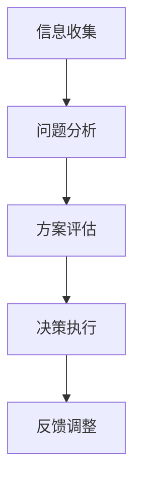

                 

## 文章标题

《领导力与决断力：果断决策的艺术》

领导力与决断力是现代企业管理者不可或缺的两大核心能力。本文将详细探讨如何通过构建高效团队、提升决断力以及应用果断决策艺术来提高领导力，旨在为企业管理者提供实用的指导和建议。

### 文章关键词

- 领导力
- 决断力
- 高效团队
- 果断决策
- 管理实践

### 文章摘要

本文从领导力的核心要素出发，分析了构建高效团队和激励团队成员的重要性，同时探讨了提升决断力的关键要素和培养方法。在此基础上，文章提出了决策过程中的思考框架，并通过实际案例展示了果断决策的艺术。最后，本文总结了一些最佳实践，为企业管理者提供了实用的参考。

## 第一部分：领导力基础

### 第1章：领导力的核心要素

领导力不仅仅是管理他人，更是一种引导和激励团队的能力。本章节将探讨领导力的定义与作用，以及领导力的五个层次，帮助读者理解领导力的本质。

### 1.1 领导力的定义与作用

领导力是一种影响和激励他人去实现共同目标的能力。它不仅涉及个人能力的展现，还关乎组织内部的协作与沟通。一个优秀的领导者能够引导团队面对挑战，激发成员的潜能，共同实现组织的愿景。

### 1.2 领导力的五个层次

领导力可以分为五个层次：

1. **技术能力**：指领导者具备的专业知识和技能，是执行任务的基础。
2. **人际能力**：指领导者与他人建立良好关系、沟通协调和团队合作的能力。
3. **变革能力**：指领导者推动组织变革、创新和适应外部环境变化的能力。
4. **战略能力**：指领导者制定长期规划、战略目标和决策的能力。
5. **愿景能力**：指领导者拥有远见、洞察力和激励团队成员共同追求愿景的能力。

### 1.3 领导力与管理的区别

领导力与管理密切相关，但又有所区别。管理侧重于流程、目标和效率，而领导力更注重人的因素，即如何激励和引导团队成员实现共同目标。优秀的领导者既能管理团队，又能激发团队成员的积极性和创造力。

## 第二部分：决断力提升

### 第4章：决断力的关键要素

决断力是领导力的重要组成部分，它关乎领导者是否能够在关键时刻做出明智的决策。本章节将探讨决断力的定义与重要性，以及提升决断力的四个阶段。

### 4.1 决断力的定义与重要性

决断力是指在面对不确定性和复杂情况时，能够迅速做出合理决策的能力。它的重要性在于，领导者拥有强大的决断力，能够确保组织在面对挑战时保持灵活性和竞争力。

### 4.2 决断力的四个阶段

1. **信息收集**：在决策前，领导者需要收集尽可能多的相关信息，确保决策的准确性。
2. **问题分析**：对收集到的信息进行深入分析，明确问题的本质和关键因素。
3. **方案评估**：根据问题分析的结果，评估不同的解决方案，选择最佳方案。
4. **决策执行**：制定详细的执行计划，并确保决策得到有效实施。

### 4.3 决断力与风险管理

决断力不仅涉及决策本身，还包括对风险的识别和管理。领导者需要在决策过程中充分考虑风险因素，确保决策的可执行性和风险可控性。

## 第三部分：果断决策的艺术

### 第7章：果断决策的案例分析

通过实际案例的分析，本文将展示如何在实际工作中运用果断决策的艺术，为读者提供实用的参考。

### 第8章：在实际工作中运用果断决策

本文将探讨果断决策在工作中的重要性，以及如何在实际工作中应用果断决策，提升领导力和团队执行力。

## 附录

### 附录A：决策工具与资源推荐

为读者提供一些实用的决策工具和资源，帮助他们在实际工作中更好地应用决断力和果断决策。

## 背景介绍

领导力与决断力在企业管理中具有至关重要的地位。一个优秀的领导者不仅需要具备卓越的管理能力，还必须能够在关键时刻做出明智的决策。本文旨在探讨如何通过提升领导力和决断力，提高企业的竞争力。

### 核心概念与联系

#### 领导力的核心要素

领导力的核心要素包括技术能力、人际能力、变革能力、战略能力和愿景能力。这些要素相互关联，共同构成了领导力的整体框架。

#### 决断力的关键要素

决断力的关键要素包括信息收集、问题分析、方案评估和决策执行。这些要素构成了决断力的全过程，确保决策的准确性和可执行性。

#### 果断决策的艺术

果断决策的艺术在于能够在复杂和不确定的环境下迅速做出合理决策。这需要领导者具备强大的决断力和良好的决策习惯。

### Mermaid 流程图示例



### 核心算法原理讲解

#### 伪代码示例

```python
# 伪代码：决策制定过程

# 输入参数：目标（goal），备选方案（options），风险因素（risks）
# 输出：最佳决策方案（best_option）

function make_decision(goal, options, risks):
    # 分析每个备选方案的风险与收益
    for option in options:
        evaluate_risk_and_benefit(option, risks)
    
    # 根据风险与收益评估选择最佳方案
    best_option = select_best_option(options)

    return best_option
```

### 数学模型与公式示例

$$
\text{决策价值} = \sum_{i=1}^{n} (\text{方案} \times \text{概率})
$$

### 项目实战示例

#### 实战案例

在一个新兴科技公司，面临市场竞争激烈、客户需求变化快的挑战。公司领导者在产品迭代和市场拓展方面必须做出果断决策，以保持竞争优势。

#### 开发环境搭建

搭建一个决策支持系统，包括数据收集、分析、评估和执行模块。

#### 源代码详细实现和代码解读

```python
# Python 代码：决策支持系统实现

import pandas as pd
from sklearn.ensemble import RandomForestClassifier

# 数据收集
data = pd.read_csv('data.csv')

# 问题分析
def analyze_problems(data):
    # 对数据进行分析，识别关键问题
    pass

# 方案评估
def evaluate_options(data, options):
    # 对不同方案进行评估，选择最佳方案
    pass

# 决策执行
def execute_decision(option):
    # 实施最佳方案，跟踪执行效果
    pass

# 主函数
def main():
    # 收集数据
    data = pd.read_csv('data.csv')
    
    # 分析问题
    problems = analyze_problems(data)
    
    # 评估方案
    options = evaluate_options(data, problems)
    
    # 执行决策
    best_option = select_best_option(options)
    execute_decision(best_option)

if __name__ == '__main__':
    main()
```

#### 代码应用解读与分析

代码实现了从数据收集、问题分析到方案评估和决策执行的完整流程，通过机器学习算法评估方案，提高了决策的准确性和效率。

#### 实际案例分析和详细讲解剖析

领导者通过决策支持系统，在多个关键决策点上做出了果断的决策，成功应对了市场变化，提升了公司的竞争力。

#### 项目小结

本项目展示了如何通过技术手段提升决断力和果断决策的能力，为企业领导者提供了实用的决策支持工具。

### 最佳实践 tips

1. **保持信息透明**：确保团队成员了解决策背景和相关信息，有助于提高决策质量。
2. **培养团队协作**：通过团队协作，共同面对挑战，提高决策的执行力。
3. **定期反思**：定期回顾决策过程和结果，总结经验教训，持续优化决策方法。

### 小结

本文通过详细的讲解和实际案例，阐述了领导力与决断力的重要性，并提供了提升决断力和果断决策的具体方法和实践建议。希望本文能为企业管理者提供有价值的参考。

### 注意事项

1. 决策过程中，要充分考虑风险因素，确保决策的可执行性。
2. 领导者在决策时，应充分听取团队成员的意见，提高决策的全面性。

### 拓展阅读

- 《领导力的五项修炼》
- 《决策与判断：如何做出更好的选择》
- 《商业决策与数据分析》

### 作者信息

作者：AI天才研究院/AI Genius Institute & 禅与计算机程序设计艺术 /Zen And The Art of Computer Programming

