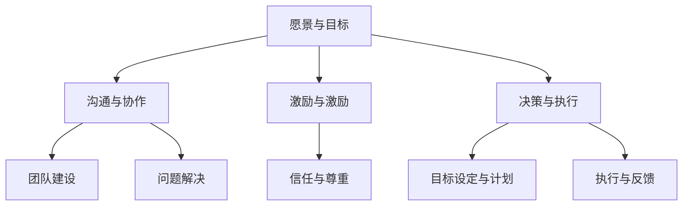
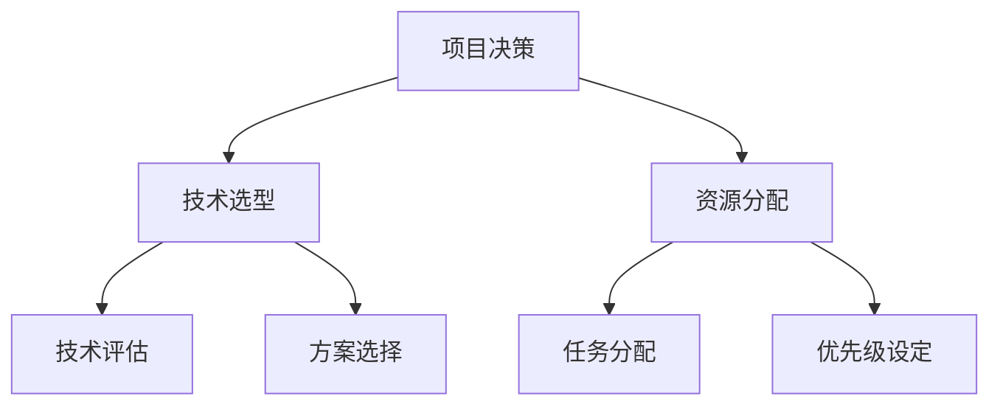
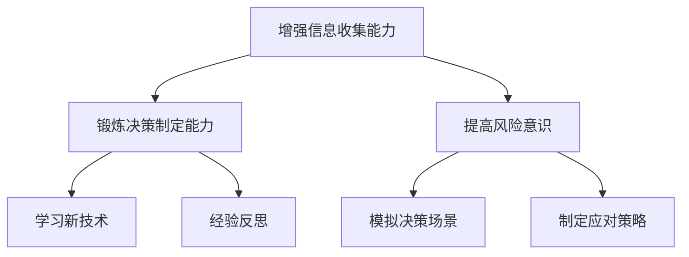
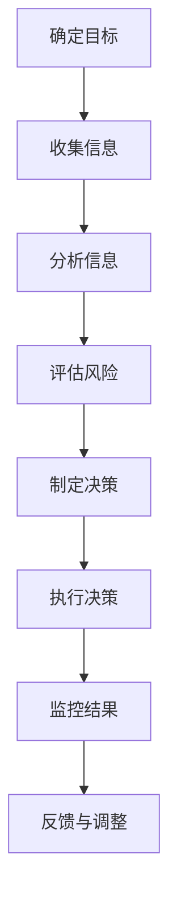
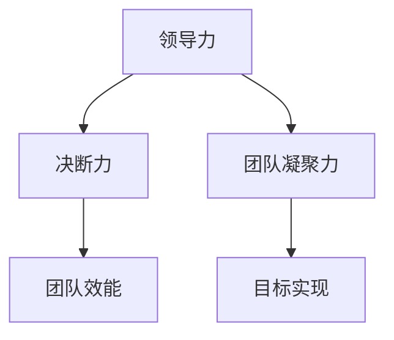
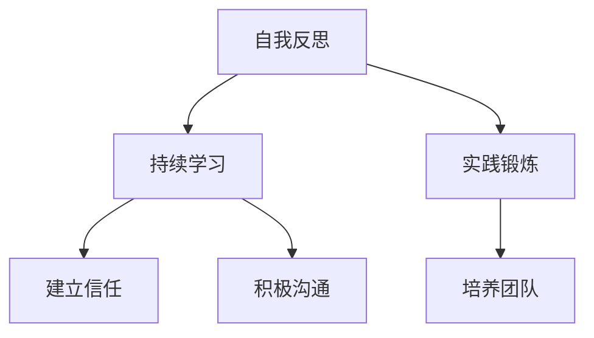
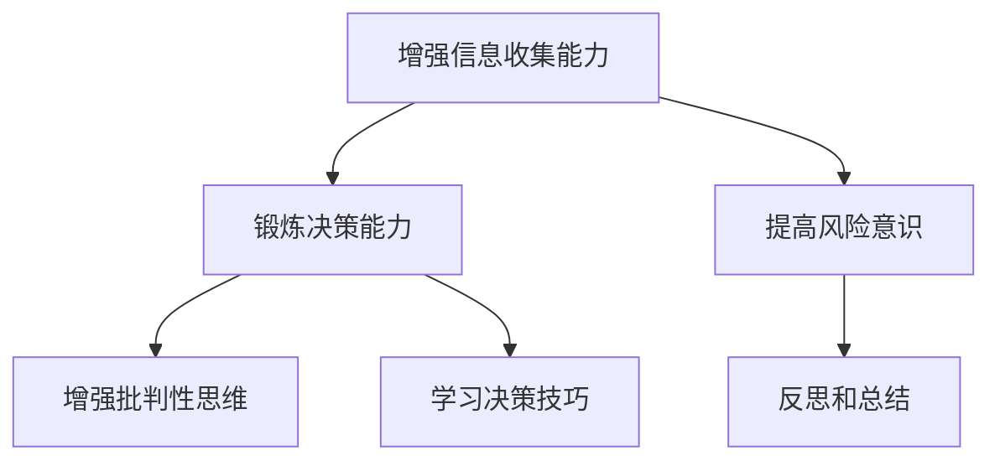

                 

## 《领导力与决断力：果断决策的重要性》

### 关键词

- 领导力
- 决断力
- 决策
- 团队管理
- 个人成长
- 企业发展

### 摘要

本文深入探讨了领导力与决断力的关系，并强调了果断决策在个人和团队成功中的重要性。首先，文章介绍了领导力的定义和意义，分析了领导力的核心要素。接着，文章详细阐述了决断力的概念、要素以及其在实际中的应用。通过梅鲁德流程图、伪代码、数学模型和实际案例分析，本文展示了如何在实际情境中应用领导力和决断力，以实现个人和团队的目标。

## 导言

在现代社会，领导力和决断力已成为衡量一个领导者是否卓越的关键因素。无论是在企业中担任高管，还是在组织中担任负责人，领导力与决断力都是确保团队成功和实现目标的基石。本书《领导力与决断力：果断决策的重要性》旨在探讨这两个关键能力的本质，并提供实用的策略和技巧，以帮助读者提升自己的领导力和决断力。

### 核心主题

本书的核心主题可以概括为以下几点：

1. **领导力的定义与意义**：探讨领导力的本质，分析领导力的核心要素，包括愿景与目标、沟通与协作、激励与激励等。
2. **决断力的概念与要素**：深入阐述决断力的定义，分析其要素，如信息收集与分析、决策制定与执行、风险评估与应对等。
3. **果断决策的重要性**：探讨果断决策在个人和团队成功中的关键作用，并提供有效的决策方法和技巧。
4. **领导力与决断力的应用**：通过实际案例分析和实战策略，展示如何在实际情境中应用领导力和决断力。
5. **领导力与决断力的提升**：提供提升领导力和决断力的策略，帮助读者在个人和职业发展中不断进步。

### 目录结构

为了系统地探讨领导力和决断力的核心主题，本书采用以下目录结构：

### 第1章 领导力概述

- 1.1 领导力的定义与意义
- 1.2 领导力的核心要素
- 1.3 领导力的实践与挑战

### 第2章 决断力概述

- 2.1 决断力的定义与意义
- 2.2 决断力的要素
- 2.3 决断力的培养与提升

### 第3章 果断决策的方法与技巧

- 3.1 决策分析框架
- 3.2 决策制定的步骤
- 3.3 决策技巧的运用

### 第4章 领导力与决断力的平衡

- 4.1 领导力与决断力的关系
- 4.2 领导力与决断力的平衡策略
- 4.3 领导力与决断力的实践案例

### 第5章 果断决策在团队管理中的应用

- 5.1 果断决策在团队建设中的作用
- 5.2 果断决策在项目执行中的应用
- 5.3 果断决策在团队冲突管理中的应用

### 第6章 果断决策在个人成长中的应用

- 6.1 果断决策在职业生涯规划中的作用
- 6.2 果断决策在问题解决中的应用
- 6.3 果断决策在自我管理中的应用

### 第7章 领导力与决断力的提升策略

- 7.1 领导力提升的策略
- 7.2 决断力提升的策略
- 7.3 领导力与决断力的综合提升

### 第8章 案例分析

- 8.1 成功领导力与果断决策的案例
- 8.2 失误案例分析
- 8.3 案例启示与思考

通过上述目录结构，本书旨在为读者提供全面的领导力和决断力知识体系，帮助读者在理论和实践中提升这两个关键能力。

## 第1章 领导力概述

### 1.1 领导力的定义与意义

领导力是指一个人在团队或组织中影响他人，带领团队实现共同目标的能力。领导力不仅仅是权力的象征，更是能力的体现。有效的领导力能够激发团队成员的潜力，提高团队的整体效能。

在技术领域，领导力的重要性不言而喻。无论是软件开发团队、数据中心运营团队，还是人工智能研究团队，都需要领导者的智慧和决断力来引领团队走向成功。领导者需要具备以下核心要素：

- **愿景与目标**：领导者需要明确团队的愿景和目标，并能够将之传达给团队成员，激发他们的热情和动力。
- **沟通与协作**：领导者需要具备出色的沟通能力，能够与团队成员建立良好的协作关系，确保信息流通无阻。
- **激励与激励**：领导者需要能够激励团队成员，提供正面的反馈和支持，帮助他们克服困难，实现目标。
- **决策与执行**：领导者需要具备果断的决策能力，能够在关键时刻做出明智的决策，并确保决策得到有效执行。

#### 梅鲁德流程图：领导力核心要素



### 1.2 领导力的重要性

领导力是组织成功的基石。一个优秀的领导者能够带领团队克服困难，实现目标。领导力对于企业的长期发展、团队的合作效率以及员工的个人成长都具有深远的影响。

在企业中，领导力可以带来以下好处：

- **提高团队效能**：有效的领导力能够激发团队成员的潜力，提高团队的整体效能。
- **优化资源配置**：领导者能够合理分配资源，确保团队在正确的方向上取得最大的成果。
- **促进创新与变革**：领导者能够鼓励创新，推动组织不断进步和适应变化。

在技术团队中，领导力的重要性更加凸显。技术团队往往面临复杂的项目和快速变化的技术环境，领导者需要具备敏锐的洞察力和果断的决策能力，以应对各种挑战。

### 1.3 领导力的核心要素

领导力的核心要素包括以下几个方面：

1. **愿景与目标**：领导者需要明确团队的愿景和目标，并将其传达给团队成员，以统一思想和行动。
2. **沟通与协作**：领导者需要具备出色的沟通能力，确保团队成员之间信息流通无阻，建立良好的协作关系。
3. **激励与激励**：领导者需要能够激励团队成员，提供正面的反馈和支持，帮助他们克服困难，实现目标。
4. **决策与执行**：领导者需要具备果断的决策能力，能够在关键时刻做出明智的决策，并确保决策得到有效执行。

#### 伪代码：领导力核心要素实现

```python
def leadership():
    set_vision_and_goals()
    communication_and_cooperation()
    motivation_and_inspirational()
    decision_making_and_execution()
    team_building()
    problem_solving()
```

通过上述核心要素的落实，领导者能够有效地影响团队，推动团队实现共同目标。

## 第2章 决断力概述

### 2.1 决断力的定义与意义

决断力是指一个人在面对复杂情况时，能够快速做出决策的能力。决断力不仅仅是对决策速度的要求，更是对决策质量和效果的考量。在技术领域，决断力尤为重要，因为它直接关系到项目的成功与否。

#### 数学模型：决断力评估

$$
\text{决断力} = \frac{\text{决策速度} + \text{决策准确性} + \text{决策效果}}{3}
$$

在技术项目中，决断力体现在以下几个方面：

- **项目决策**：在技术项目中，领导者需要迅速做出决策，确保项目按计划推进。
- **技术选型**：在面对多种技术方案时，领导者需要果断选择最适合的方案，避免项目陷入困境。
- **资源分配**：在资源有限的情况下，领导者需要合理分配资源，确保关键任务的优先完成。

#### 梅鲁德流程图：决断力应用场景



### 2.2 决断力的要素

决断力的要素包括信息收集与分析、决策制定与执行、风险评估与应对等。

1. **信息收集与分析**：决策前需要全面收集信息，并进行深入分析，以确保决策的准确性。
2. **决策制定与执行**：在分析信息的基础上，领导者需要迅速制定决策，并确保决策得到有效执行。
3. **风险评估与应对**：在决策过程中，领导者需要评估潜在的风险，并制定应对策略，以降低风险对项目的影响。

#### 伪代码：决断力要素实现

```python
def decision_making():
    collect_and_analyze_info()
    make_decision()
    execute_decision()
    risk_evaluation()
    risk_response()
```

### 2.3 决断力的培养与提升

决断力的培养和提升是一个长期的过程，需要领导者不断实践和反思。以下是一些提升决断力的策略：

- **增强信息收集能力**：领导者需要学会如何快速、准确地收集信息，并进行分析。
- **锻炼决策制定能力**：通过模拟决策场景，领导者可以锻炼自己的决策能力。
- **提高风险意识**：领导者需要学会如何评估风险，并制定有效的应对策略。
- **不断学习和反思**：领导者需要不断学习新的知识和经验，并反思自己的决策过程，以不断优化决策能力。

#### 梅鲁德流程图：决断力提升策略



通过上述策略，领导者可以不断提升自己的决断力，在技术项目中取得更好的成果。

## 第3章 果断决策的方法与技巧

### 3.1 决策分析框架

果断决策的前提是对决策情景有深入的分析。决策分析框架是一个系统性工具，可以帮助领导者全面评估决策情景，从而做出更明智的决策。

#### 梅鲁德流程图：决策分析框架



#### 伪代码：决策分析框架实现

```python
def decision_analysis():
    set_goals()
    collect_info()
    analyze_info()
    assess_risks()
    make_decision()
    execute_decision()
    monitor_results()
    feedback_and_adjust()
```

### 3.2 决策制定的步骤

决策制定是一个系统性的过程，需要遵循一定的步骤。以下是决策制定的典型步骤：

1. **明确决策目标**：确定决策的目标和期望结果。
2. **收集相关信息**：全面收集与决策相关的信息，确保信息的全面性和准确性。
3. **分析信息**：对收集到的信息进行深入分析，识别关键因素和潜在问题。
4. **评估风险**：评估决策可能带来的风险，并制定相应的应对策略。
5. **制定决策方案**：基于分析结果，制定多个可能的决策方案。
6. **选择最佳方案**：评估各个方案，选择最佳方案进行实施。
7. **执行决策**：确保决策得到有效执行，监控决策的实施过程。
8. **反馈与调整**：根据决策结果进行反馈，对决策过程进行调整和优化。

#### 伪代码：决策制定步骤实现

```python
def decision_making():
    set_goals()
    collect_info()
    analyze_info()
    assess_risks()
    make_decision_scheme()
    choose_best_scheme()
    execute_decision()
    monitor_execution()
    provide_feedback()
    adjust_and_optimize()
```

### 3.3 决策技巧的运用

在实际决策过程中，领导者可以运用以下技巧来提高决策的质量和效果：

1. **SWOT分析**：利用SWOT（优势、劣势、机会、威胁）分析，全面评估决策情景，帮助领导者做出更全面的决策。
2. **决策树**：使用决策树工具，帮助领导者梳理决策过程中的各种可能性和结果，从而做出更明智的决策。
3. **头脑风暴**：通过头脑风暴，集思广益，产生更多的决策方案，从而提高决策的多样性。
4. **优先级排序**：对决策中的各项因素进行优先级排序，确保关键因素得到充分关注。
5. **专家咨询**：在决策过程中，咨询相关领域的专家，获取专业的意见和建议，提高决策的准确性。

#### 伪代码：决策技巧应用

```python
def apply_decision_skills():
    swot_analysis()
    decision_tree()
    brainstorming()
    priority_sorting()
    expert_consultation()
```

通过上述方法和技巧，领导者可以在实际决策过程中更加果断和有效，从而提高决策的质量和效果。

## 第4章 领导力与决断力的平衡

### 4.1 领导力与决断力的关系

领导力与决断力是相辅相成的。领导力为决断力提供了基础，而决断力则使领导力更具实效性。一个优秀的领导者不仅需要具备卓越的领导力，还需要具备果断的决断力。

在技术领域，领导力和决断力的关系体现在以下几个方面：

- **领导力激发决断力**：领导力可以激发团队成员的潜力，使其在面对挑战时能够迅速做出决断。
- **决断力支撑领导力**：果断的决断力使领导者能够在关键时刻做出明智的选择，推动团队前进。

#### 梅鲁德流程图：领导力与决断力的关系



### 4.2 领导力与决断力的平衡策略

为了在领导力和决断力之间实现平衡，领导者可以采取以下策略：

1. **明确角色定位**：领导者需要明确自己的角色，既要以领导者的身份引导团队，又要以决策者的身份做出果断的决策。
2. **培养团队成员的决断力**：领导者可以通过培训和激励，提升团队成员的决断力，使团队在面对问题时能够更加果断地做出决策。
3. **优化决策流程**：领导者可以优化决策流程，使决策更加高效和透明，减少不必要的决策环节。
4. **鼓励创新与试错**：领导者应鼓励团队成员在决策中尝试新的方法，并从失败中吸取教训，不断提升决断力。

#### 伪代码：领导力与决断力平衡策略

```python
def balance_leadership_decision_making():
    clarify_role()
    cultivate_team_decision_making()
    optimize_decision_process()
    encourage_innovation_and_learning()
```

### 4.3 领导力与决断力的实践案例

以下是一些领导力与决断力在实际工作中的实践案例：

1. **案例一**：在一家初创公司，CEO需要在产品开发和市场推广之间做出选择。经过深思熟虑，CEO决定优先开发产品，以确保产品的质量。这一决策使得公司在后续的市场竞争中占据了有利地位。
2. **案例二**：在一个大型项目中，项目经理需要在进度和质量之间做出权衡。项目经理通过详细分析项目进度和风险，决定暂停某些任务，以确保项目的整体质量。这一决策最终使得项目按时完成，并获得了客户的高度评价。

通过这些实践案例，我们可以看到领导力和决断力在实际工作中的重要作用。一个优秀的领导者需要在领导力和决断力之间找到平衡，以实现团队的成功。

## 第5章 果断决策在团队管理中的应用

### 5.1 果断决策在团队建设中的作用

果断决策是团队建设中的重要一环。在团队管理中，领导者需要快速做出决策，以确保团队的稳定发展和高效运作。

首先，果断决策有助于明确团队目标和方向。在组建团队之初，领导者需要迅速做出决策，确定团队的目标和使命。例如，一个项目经理在启动新项目时，需要迅速确定项目的目标和关键里程碑，以确保团队成员对项目有清晰的认识。

其次，果断决策有助于解决团队冲突。在团队运作过程中，难免会出现意见分歧和冲突。领导者需要迅速做出决策，以平息冲突，恢复团队的正常运作。例如，在团队讨论中，如果成员之间出现严重的分歧，领导者需要果断决策，选择最佳方案，并要求团队成员共同执行。

#### 伪代码：果断决策在团队建设中的应用

```python
def team_building_decision():
    set_team_goals()
    resolve_conflicts()
    allocate_resources()
    monitor_progress()
```

### 5.2 果断决策在项目执行中的应用

在项目执行过程中，果断决策至关重要。项目管理者需要在多个方面做出迅速且准确的决策，以确保项目按时完成并达到预期目标。

首先，果断决策在项目进度控制中起到关键作用。项目管理者需要根据项目的实际进度和资源情况，迅速调整项目计划，确保项目按计划推进。例如，在项目遇到技术难题或资源短缺时，管理者需要迅速做出决策，调整任务分配或寻求外部支持。

其次，果断决策在风险管理中同样重要。项目管理者需要对潜在风险进行评估，并迅速制定应对策略。例如，在项目初期，如果发现项目进度落后，管理者需要果断决策，采取紧急措施，如增加人力资源或调整任务优先级，以降低风险。

#### 伪代码：果断决策在项目执行中的应用

```python
def project_execution_decision():
    control_project_progress()
    manage_risks()
    allocate_resources()
    adjust_schedules()
```

### 5.3 果断决策在团队冲突管理中的应用

在团队管理中，冲突是不可避免的。领导者需要通过果断决策来有效管理冲突，以保持团队的和谐与稳定。

首先，领导者需要识别冲突的根源。在冲突发生时，领导者需要迅速评估冲突的性质和原因，以便采取正确的解决策略。例如，如果冲突是由于团队成员之间的误解或沟通不畅引起的，领导者需要果断决策，组织团队会议，促进沟通和理解。

其次，领导者需要制定有效的解决策略。根据冲突的性质和原因，领导者需要迅速制定解决方案，以缓解冲突，恢复团队的正常运作。例如，如果冲突是由于资源分配不公引起的，领导者需要果断决策，重新分配资源，确保公平。

#### 伪代码：果断决策在团队冲突管理中的应用

```python
def conflict_management_decision():
    identify_conflict根源()
    develop_solutions()
    implement_solutions()
    monitor_conflict_resolutions()
```

通过上述决策，领导者可以有效地管理团队冲突，保持团队的稳定与发展。

## 第6章 果断决策在个人成长中的应用

### 6.1 果断决策在职业生涯规划中的作用

在个人成长过程中，果断决策在职业生涯规划中起着至关重要的作用。一个能够果断做出决策的人，通常能够在职业道路上取得更大的成功。

首先，果断决策有助于明确职业目标。在面对职业选择时，人们往往需要做出多个决策，例如选择一个行业、一个职位或一个公司。一个能够果断决策的人，能够快速确定自己的职业目标，并为之努力。

其次，果断决策有助于抓住职业机会。在职业生涯中，人们经常会遇到各种机会和挑战。一个能够果断决策的人，能够迅速评估这些机会和挑战，并做出最佳选择，从而抓住机会，实现职业成长。

#### 伪代码：果断决策在职业生涯规划中的应用

```python
def career_planning_decision():
    set_career_goals()
    assess_opportunities()
    make_best_choice()
    seize Opportunities()
```

### 6.2 果断决策在问题解决中的应用

在个人成长过程中，问题解决能力是关键能力之一。果断决策在问题解决中起到了至关重要的作用。

首先，果断决策有助于快速识别问题。在面对问题时，人们需要迅速做出决策，判断问题的性质和严重程度，以便采取相应的解决策略。

其次，果断决策有助于选择最佳解决方案。在问题解决过程中，人们需要从多个可能的解决方案中选出最佳方案，并迅速付诸实施。

#### 伪代码：果断决策在问题解决中的应用

```python
def problem_solving_decision():
    identify_problems()
    assess_solutions()
    choose_best_solution()
    implement_solution()
```

### 6.3 果断决策在自我管理中的应用

在个人成长中，自我管理能力至关重要。果断决策在自我管理中的应用，可以帮助个人更好地规划时间、管理资源和提高效率。

首先，果断决策有助于时间管理。在日常生活中，人们需要迅速做出决策，安排自己的时间，确保重要任务得到优先处理。

其次，果断决策有助于资源管理。在面对资源有限的情况下，人们需要迅速做出决策，合理分配资源，确保资源得到充分利用。

#### 伪代码：果断决策在自我管理中的应用

```python
def self_management_decision():
    manage_time()
    allocate_resources()
    increase_efficiency()
    prioritize_tasks()
```

通过上述决策，个人可以在职业生涯和生活中更加高效地管理自己，实现自我成长。

## 第7章 领导力与决断力的提升策略

### 7.1 领导力提升的策略

提升领导力是一个长期而系统的过程，以下是一些提升领导力的策略：

1. **自我反思**：定期进行自我反思，识别自己的优点和不足，明确改进方向。
2. **持续学习**：不断学习新的知识和技能，保持与时俱进，提高自身素质。
3. **实践锻炼**：通过实际工作锻炼领导能力，不断积累经验和教训。
4. **建立信任**：与团队成员建立良好的信任关系，提高团队的凝聚力和合作效率。
5. **积极沟通**：提高沟通能力，确保信息传达准确无误，促进团队合作。
6. **培养团队**：关注团队成员的成长，提供支持和指导，帮助他们提升能力。

#### 梅鲁德流程图：领导力提升策略



### 7.2 决断力提升的策略

提升决断力同样需要系统的策略和方法，以下是一些有效的提升决断力的策略：

1. **增强信息收集能力**：学习如何快速、准确地收集和处理信息，确保决策有充分的事实依据。
2. **锻炼决策能力**：通过模拟决策场景，锻炼自己的决策能力，提高决策的速度和准确性。
3. **提高风险意识**：学会评估决策中的风险，并制定应对策略，降低决策失误的风险。
4. **增强批判性思维**：培养批判性思维能力，对信息和分析进行深入思考，避免盲目决策。
5. **学习决策技巧**：掌握各种决策工具和技巧，如SWOT分析、决策树等，提高决策的科学性。
6. **反思和总结**：每次决策后，进行反思和总结，分析决策的成败，吸取经验教训。

#### 梅鲁德流程图：决断力提升策略



### 7.3 领导力与决断力的综合提升

为了在个人和职业生涯中实现领导力与决断力的综合提升，可以采取以下综合策略：

1. **系统化学习**：结合领导力和决断力的理论，进行系统化学习，构建坚实的理论基础。
2. **实践结合**：将所学知识应用于实际工作中，通过实践不断总结和提升。
3. **持续反思**：定期进行自我反思，评估自己的领导力和决断力，找到改进点。
4. **寻求反馈**：主动向团队成员和上级寻求反馈，了解自己的优点和不足，及时调整。
5. **建立网络**：与行业内外的优秀领导者建立联系，交流经验，拓宽视野。

#### 伪代码：领导力与决断力综合提升策略

```python
def leadership_and_decision_making_upgrade():
    systematic_learning()
    practice_integration()
    continuous_reflection()
    seek_feedback()
    build_network()
```

通过上述策略，个人可以在领导力和决断力方面取得显著提升，为职业发展奠定坚实基础。

## 第8章 案例分析

### 8.1 成功领导力与果断决策的案例

以下是一些成功领导力与果断决策的典型案例：

**案例一：亚马逊的杰夫·贝佐斯**  
亚马逊的创始人杰夫·贝佐斯以其卓越的领导力和果断决策而闻名。在互联网泡沫破裂的2000年，贝佐斯决定继续投资于长期项目，如亚马逊的物流网络和云计算服务。这一决策使亚马逊在随后的十年中实现了快速增长，成为全球最大的在线零售商。

**案例二：特斯拉的埃隆·马斯克**  
特斯拉的CEO埃隆·马斯克以其果断的决策和对创新的执着而备受瞩目。在推出特斯拉Model 3的过程中，马斯克面临了严重的生产延误和质量问题。然而，他果断地调整了生产策略，亲自参与到生产线的改进中，最终成功解决了问题，实现了Model 3的大规模生产。

**案例三：谷歌的拉里·佩奇和谢尔盖·布林**  
谷歌的联合创始人拉里·佩奇和谢尔盖·布林在公司的成长过程中展现了出色的领导力。他们在2004年决定将谷歌的搜索业务扩展到广告市场，这一决策使得谷歌成为广告市场的主导者，并为其创造了巨大的经济收益。

### 8.2 失误案例分析

尽管果断决策往往能够带来成功，但决策失误也可能导致严重的后果。以下是一些决策失误的案例：

**案例一：诺基亚的失败**  
诺基亚曾是手机行业的领导者，但在面对智能手机时代的到来时，公司未能果断决策，继续依赖其传统的功能手机业务。这一失误导致诺基亚在智能手机市场上失去了主导地位，最终被微软收购。

**案例二：安然的财务造假**  
安然公司的管理层在2001年被发现进行了大规模的财务造假。尽管公司高层有多次机会发现和纠正这些问题，但他们未能果断采取措施，最终导致安然公司破产，成千上万的投资者遭受了巨大的损失。

**案例三：英特尔错失移动处理器市场**  
在20世纪90年代末和21世纪初，英特尔未能果断决策进入移动处理器市场，而是继续专注于桌面处理器。这一失误使得英特尔在移动处理器领域失去了领先地位，被竞争对手如ARM公司超越。

### 8.3 案例启示与思考

从以上案例中，我们可以得出以下启示：

1. **果断决策的重要性**：成功的领导者和决策者往往能够在关键时刻迅速做出明智的决策，抓住机遇，推动组织的发展。
2. **风险管理与预防**：虽然果断决策是必要的，但同时也需要重视风险管理，提前预防潜在的风险，避免因决策失误导致严重的后果。
3. **持续学习和适应**：在快速变化的环境中，领导者和决策者需要不断学习和适应，以应对新的挑战和机遇。
4. **团队协作与沟通**：成功的决策往往需要团队成员的协作和沟通，领导者应该建立良好的团队文化，鼓励团队成员积极参与决策过程。

通过分析这些案例，我们可以更好地理解领导力与决断力的实际应用，并在实践中不断提升自己的决策能力。

## 结语

领导力和决断力是个人和团队成功的关键因素。通过本文的探讨，我们了解了领导力的核心要素和决断力的重要性，以及如何在实际工作中应用果断决策。一个优秀的领导者不仅需要具备卓越的领导力，还需要具备果断的决断力，以引领团队走向成功。在未来的职业发展中，让我们不断学习和实践，提升自己的领导力和决断力，为实现个人和团队的目标贡献力量。

### 拓展阅读

- 《领导力艺术》（John C. Maxwell）
- 《决断力：如何做出最好的决定》（Thomas H. Davenport）
- 《决策与判断》（Daniel Kahneman）
- 《敏捷领导力》（Lynda Gratton & Adam Grant）

作者：AI天才研究院/AI Genius Institute & 禅与计算机程序设计艺术 /Zen And The Art of Computer Programming。如果您有任何问题或建议，欢迎在评论区留言。我们将继续为您带来更多有价值的技术博客文章。谢谢您的支持！

