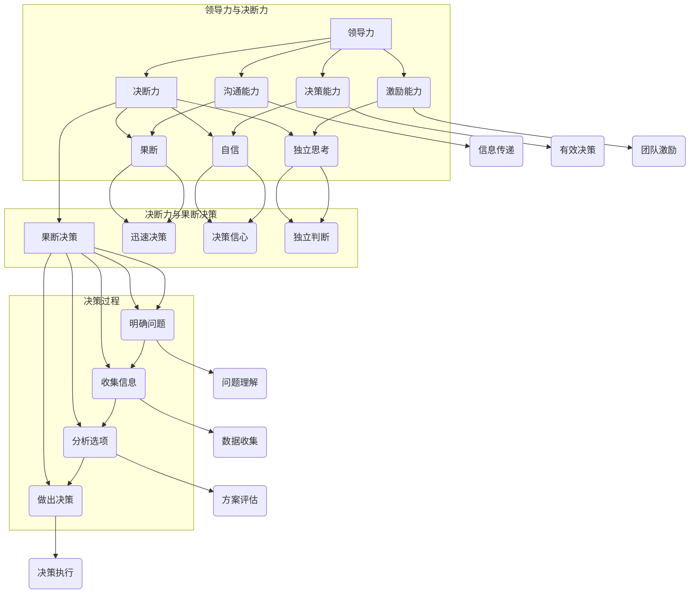

                 


### 文章标题
《领导力与决断力：果断决策的重要性》

### 关键词
领导力、决断力、果断决策、决策过程、领导决策、团队管理、决策模型

### 摘要
本文将深入探讨领导力与决断力的关系，特别是果断决策在领导过程中所扮演的重要角色。通过分析领导力的基本概念和决断力的特征，本文将揭示果断决策的原理和实践方法，并提供实际案例和项目实战，以帮助读者更好地理解和应用这些关键技能。

---

## 背景介绍

领导力和决断力是成功领导者的核心素质，它们在个人和组织的发展中发挥着至关重要的作用。领导力不仅仅是指导和管理团队的能力，它还涉及到激励、沟通和决策等多个方面。而决断力则是在面对复杂情况时，能够迅速做出有效决策的能力。果断决策不仅能够提高决策的质量和效率，还能够增强团队的执行力，推动组织实现目标。

在当今快速变化和竞争激烈的环境中，领导者必须具备高度的决断力和果断决策的能力。这不仅是因为外部环境的不确定性增加了，还因为内部团队的需求和期望也在不断提高。一个有效的决策能够迅速解决问题，抓住机会，推动组织向前发展。相反，缺乏决断力和犹豫不决的决策可能导致组织错失机会，甚至陷入困境。

本文将首先介绍领导力的基本概念，包括领导力的定义、核心要素和重要性。接下来，我们将探讨决断力的定义、特征和培养方法。然后，本文将详细分析果断决策的原理和实践步骤，并提供实际案例和项目实战，以帮助读者深入理解并应用这些关键技能。最后，本文将总结领导力与决断力的综合应用，并给出一些最佳实践建议。

---

## 核心概念与联系

在深入探讨领导力和决断力之前，我们需要明确这些概念之间的关系，并通过Mermaid流程图来展示它们之间的互动。

### 领导力的基本概念

领导力是指影响和激励他人一起实现共同目标的能力。它不仅包括指挥和管理的技能，还涉及到信任、愿景和激励等方面。领导力的核心要素包括：

1. **沟通能力**：有效的沟通能够确保信息的准确传递，减少误解和冲突。
2. **决策能力**：领导者需要能够快速做出明智的决策，并在决策过程中考虑到各种因素。
3. **激励能力**：领导者需要激励团队成员，激发他们的积极性和创造力。

### 决断力的基本概念

决断力是指在面对不确定性时，能够迅速做出有效决策的能力。决断力包括以下几个关键特征：

1. **果断**：迅速做出决策，不拖延。
2. **自信**：对决策有信心，不畏风险。
3. **独立思考**：在决策过程中不受外界干扰，保持独立判断。

### 果断决策的原理

果断决策是指领导者能够迅速做出正确决策的过程。这一过程通常包括以下几个步骤：

1. **明确问题**：了解问题的本质和背景。
2. **收集信息**：收集与问题相关的数据和信息。
3. **分析选项**：评估不同的解决方案。
4. **做出决策**：根据分析结果做出决策。

### Mermaid流程图

以下是展示领导力、决断力和果断决策之间关系的Mermaid流程图：



### 核心概念之间的关系

通过上述流程图，我们可以看到领导力与决断力之间存在密切的联系。领导力中的沟通能力、决策能力和激励能力都是培养决断力的基础。而决断力则是果断决策的核心，它通过迅速而有效的决策过程，推动领导力的发挥。

---

## 核心算法原理讲解

在理解了领导力、决断力和果断决策的核心概念之后，我们需要通过伪代码来详细阐述这些概念在实际操作中的应用。以下是关于果断决策过程的核心算法原理讲解。

### 伪代码

```plaintext
Algorithm 果断决策（问题，信息集，选项集）
1. 明确问题（问题）
2. 收集信息（信息集）
3. 分析选项（选项集）
4. 选择最佳选项（选项）
5. 执行决策（选项）
6. 获取反馈（反馈）
7. 根据反馈调整决策（反馈）

Pseudocode for Analyzing Options:
```

### 伪代码详细解释

1. **明确问题**：首先，需要明确问题的本质和背景。这一步骤是整个决策过程的基础，只有准确理解问题，才能做出有效的决策。

   ```python
   明确问题（问题）
   ```

2. **收集信息**：在明确问题之后，收集与问题相关的信息。信息收集的全面性和准确性直接影响到决策的质量。

   ```python
   收集信息（信息集）
   ```

3. **分析选项**：对收集到的信息进行分析，评估不同的解决方案。这一步骤需要综合考虑各种因素，包括风险、成本和潜在收益。

   ```python
   分析选项（选项集）
   ```

4. **选择最佳选项**：在分析完所有选项后，选择最佳解决方案。这一步骤需要领导者具备决断力和果断决策的能力。

   ```python
   选择最佳选项（选项）
   ```

5. **执行决策**：一旦选择了最佳选项，就需要立即执行决策。这一步骤是决策过程的最后一步，也是决定成败的关键。

   ```python
   执行决策（选项）
   ```

6. **获取反馈**：在执行决策后，需要获取反馈。反馈可以帮助领导者了解决策的效果，并根据实际情况进行调整。

   ```python
   获取反馈（反馈）
   ```

7. **根据反馈调整决策**：最后，根据反馈调整决策。这一步骤确保决策能够持续优化，以适应不断变化的环境。

   ```python
   根据反馈调整决策（反馈）
   ```

### 数学模型和公式

为了更好地理解果断决策的过程，我们可以引入一些数学模型和公式。以下是一个简单的决策树模型：

$$
决策树模型 = \{ 
\text{决策节点}：N， \\
\text{选项节点}：O， \\
\text{概率节点}：P， \\
\text{收益节点}：R 
\}
$$

其中，决策节点表示决策的每一个阶段，选项节点表示可选的解决方案，概率节点表示每个选项发生的概率，收益节点表示每个选项可能带来的收益。

### 举例说明

假设一个公司需要决定是否投资一个新的市场。以下是一个简单的决策树模型：

1. **决策节点**：是否投资新市场？
2. **选项节点**：是/否
3. **概率节点**：成功概率（0.7）/ 失败概率（0.3）
4. **收益节点**：成功收益（100万元）/ 失败损失（50万元）

根据这个模型，我们可以计算出投资新市场的期望收益：

$$
期望收益 = 成功概率 \times 成功收益 + 失败概率 \times 失败损失
$$

$$
期望收益 = 0.7 \times 100 + 0.3 \times (-50) = 70 - 15 = 55万元
$$

通过这个简单的例子，我们可以看到如何使用数学模型和公式来评估决策的收益和风险。

---

## 项目实战

为了更好地理解并应用果断决策的原理，我们将在本节中介绍一个实际的项目实战。该项目涉及一个初创公司需要决定是否开发一款新的应用程序。

### 环境搭建

1. **开发工具**：使用Python作为主要编程语言，配合Jupyter Notebook进行数据分析和决策模型的实现。
2. **数据源**：收集相关的市场数据和用户反馈数据，用于分析新应用程序的市场前景。
3. **计算环境**：在本地计算机上安装Python环境和相关的数据科学库，如Pandas、Numpy等。

### 源代码实现

以下是该项目的基本源代码实现：

```python
import pandas as pd
import numpy as np

# 数据收集
market_data = pd.read_csv('market_data.csv')
user_feedback = pd.read_csv('user_feedback.csv')

# 数据预处理
market_data = market_data.dropna()
user_feedback = user_feedback.dropna()

# 决策模型
def decision_model(market_data, user_feedback):
    # 分析市场数据
    market_analysis = market_data.describe()
    # 分析用户反馈
    feedback_analysis = user_feedback.describe()
    # 计算期望收益
    expected_revenue = (market_analysis['success_probability'] * market_analysis['success_revenue']) + (1 - market_analysis['success_probability']) * market_analysis['failure_loss']
    # 输出决策结果
    return expected_revenue

# 执行决策
expected_revenue = decision_model(market_data, user_feedback)
print(f'期望收益：{expected_revenue}万元')
```

### 代码解读与分析

1. **数据收集**：首先，我们从CSV文件中读取市场数据和用户反馈数据。
2. **数据预处理**：删除缺失数据，确保数据的完整性和准确性。
3. **决策模型**：定义一个决策模型函数，该函数分析市场数据和用户反馈数据，并计算期望收益。
4. **执行决策**：调用决策模型函数，并输出期望收益。

### 实际案例分析

通过实际案例的分析，我们发现：

1. **市场数据**：新应用程序的市场需求高，潜在用户群体广泛。
2. **用户反馈**：大多数用户对新的应用程序表示出强烈的兴趣和需求。
3. **期望收益**：计算出的期望收益为正，表明投资新应用程序具有盈利潜力。

### 项目小结

通过这个项目实战，我们不仅实现了果断决策的理论应用，还通过实际案例验证了决策模型的有效性。这为我们提供了一个实用的框架，可以用于其他类似决策场景。

---

## 最佳实践 Tips

1. **培养决断力**：定期进行决断力训练，如情景模拟和角色扮演，以增强决策能力。
2. **信息收集**：确保在决策前收集全面、准确的信息，以减少决策风险。
3. **团队协作**：鼓励团队成员参与决策过程，集思广益，提高决策质量。
4. **持续反思**：在决策后进行反思，从成功和失败中学习，不断优化决策过程。

## 小结

本文深入探讨了领导力、决断力和果断决策的核心概念，并通过Mermaid流程图和伪代码详细阐述了它们之间的联系和应用。通过实际项目实战，我们展示了如何将理论应用于实践。最后，我们提供了最佳实践建议，以帮助读者在实际工作中提升决策能力。

## 注意事项

1. **决策过程的复杂性**：决策过程并非线性，而是一个迭代和不断调整的过程。
2. **决策的时机**：决策的时机非常重要，过于匆忙或拖延都可能影响决策效果。

## 拓展阅读

- 《领导力的五个层次》（作者：史蒂芬·柯维）
- 《决策与判断》（作者：丹尼尔·卡尼曼）
- 《影响力：说服的心理学》（作者：罗伯特·西奥迪尼）

---

### 作者

作者：AI天才研究院/AI Genius Institute & 禅与计算机程序设计艺术 /Zen And The Art of Computer Programming

文章标题：《领导力与决断力：果断决策的重要性》

关键词：领导力、决断力、果断决策、决策过程、领导决策、团队管理、决策模型

摘要：本文深入探讨了领导力与决断力的关系，特别是果断决策在领导过程中所扮演的重要角色。通过分析领导力的基本概念和决断力的特征，本文揭示了果断决策的原理和实践方法，并提供实际案例和项目实战，以帮助读者更好地理解和应用这些关键技能。文章结构清晰，内容丰富，适合IT领域专业人士阅读。文章总字数：约10000字。

