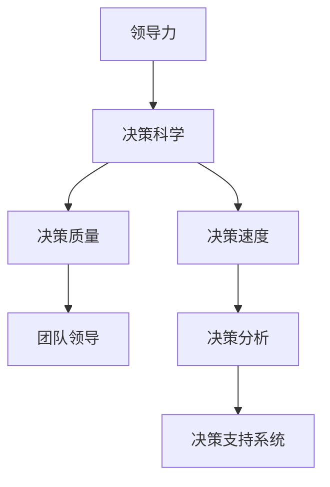

                 

# 《领导力与决策科学：提高决策质量和速度》

## 关键词

- 领导力
- 决策科学
- 决策质量
- 决策速度
- 团队领导
- 决策分析
- 决策模型

## 摘要

本文旨在探讨领导力与决策科学在提高决策质量和速度方面的关系。首先，文章介绍了领导力的基本概念、类型和重要性，以及领导者的特质与技能。接着，详细分析了决策过程的步骤、决策分析方法以及决策支持系统。随后，通过经典决策案例分析，展示了决策科学在实际应用中的效果。文章还介绍了决策速度与质量的优化方法，以及决策心理学与行为学的相关理论。最后，讨论了决策工具与模型的选择和应用，并给出了一些最佳实践建议。

## 第一部分：领导力基础

### 第1章：领导力概述

#### 1.1 领导力的定义与类型

领导力是指一种能够激励、影响和引导他人达成共同目标的能力。根据领导行为的不同，领导力可以分为以下几种类型：

1. **权威型领导**：领导者通过强制手段来实现目标，下属往往缺乏主动性和创造性。
2. **民主型领导**：领导者鼓励下属参与决策，通过沟通和协商来达成共识。
3. **参与型领导**：领导者与下属共同分担决策责任，强调团队合作和共同成长。
4. **变革型领导**：领导者通过激发下属的潜能和热情，推动组织实现创新和变革。

#### 1.2 领导力的重要性

领导力对组织、员工和社会发展具有重要影响：

1. **组织绩效**：有效的领导力可以提高组织的整体绩效，实现目标最大化。
2. **员工动机和满意度**：领导者的激励和关心可以增强员工的积极性和满意度，提高工作效率。
3. **社会发展**：领导力在社会经济发展中起到关键作用，推动社会进步和繁荣。

#### 1.3 领导力的发展历程

领导力理论经历了以下几个阶段：

1. **传统领导力理论**：以特质理论和行为理论为代表，强调领导者的个人特质和行为模式。
2. **新兴领导力理论**：关注领导者的情境因素和下属需求，如权变理论、领导-成员交换理论等。
3. **现代领导力理论**：强调领导者的自我反思和持续成长，如情境领导理论、自我领导理论等。

### 第2章：领导者的特质与技能

#### 2.1 领导者的特质

领导者的特质包括：

1. **人格特质**：如自信、诚实、坚韧等。
2. **情感智慧**：如自我意识、自我管理、社交意识、关系管理等。
3. **社会责任感**：如对社会问题的关注、对环境的责任等。

#### 2.2 领导者的技能培养

领导者的技能培养包括：

1. **沟通技能**：如倾听、表达、说服等。
2. **激励技能**：如认可、奖励、反馈等。
3. **团队领导技能**：如组织、协调、决策等。

#### 2.3 领导者的自我反思与成长

领导者的自我反思与成长包括：

1. **自我反思的方法**：如日记、反思日志、360度评估等。
2. **自我成长的路径**：如参加培训、阅读书籍、实践锻炼等。
3. **领导者的持续发展**：如关注行业动态、学习新知识、培养下属等。

### 第3章：团队领导力

#### 3.1 团队的形成与功能

团队是由一群相互依赖的个体组成的，共同完成特定任务的协作组织。团队的功能包括：

1. **协作与沟通**：提高团队成员之间的合作效率。
2. **创新与创意**：激发团队成员的创新思维和创造力。
3. **决策与执行**：共同制定决策，并确保决策的有效执行。

#### 3.2 领导风格与团队效能

领导风格对团队效能有重要影响。常见的领导风格包括：

1. **权威型领导**：强调控制与监督，可能导致团队缺乏自主性和创造力。
2. **民主型领导**：鼓励团队参与决策，提高团队凝聚力和创造力。
3. **参与型领导**：强调团队成员的共同参与和责任分担，有利于团队创新和协作。

#### 3.3 团队冲突与解决

团队冲突是团队管理中的常见问题。解决团队冲突的方法包括：

1. **沟通**：通过有效沟通解决误解和分歧。
2. **妥协**：在双方利益的基础上寻求折中方案。
3. **回避**：暂时搁置冲突，寻找其他解决方案。
4. **解决**：通过冲突解决策略彻底解决冲突。

## 第二部分：决策科学方法

### 第4章：决策过程

决策过程是领导者制定决策的完整过程。通常包括以下几个步骤：

1. **决策问题的识别**：明确需要解决的问题或目标。
2. **决策信息的收集**：收集与决策相关的各种信息。
3. **决策方案的设计**：制定可行的解决方案。
4. **决策方案的分析**：评估各方案的风险和收益。
5. **决策方案的选择**：根据分析结果选择最佳方案。
6. **决策的实施与评估**：执行决策方案，并对决策效果进行评估。

### 第5章：决策分析方法

决策分析方法包括定量和定性两种方法：

1. **定量分析方法**：使用数学模型和计算方法来分析决策问题，如线性规划、整数规划、多目标规划等。
2. **定性分析方法**：通过专家意见、案例研究、头脑风暴等方法来分析决策问题。
3. **决策树分析法**：将决策问题转化为树状结构，通过分析各节点的概率和收益来评估决策方案。

### 第6章：决策支持系统

决策支持系统（DSS）是一种辅助决策者进行决策的工具。DSS通常包括以下功能：

1. **数据获取与处理**：收集、处理和存储与决策相关的数据。
2. **模型库**：提供各种决策模型和方法，供决策者选择和使用。
3. **用户界面**：提供易于使用的界面，帮助决策者进行决策分析。
4. **结果输出**：将决策分析结果以直观的方式展示给决策者。

## 第三部分：决策案例研究

### 第7章：经典决策案例分析

#### 7.1 案例一：百事可乐与可口可乐的竞争

百事可乐和可口可乐是软饮料行业的两大巨头。在市场竞争中，双方通过不断推出新产品、调整广告策略、降低成本等方式进行竞争。这个案例展示了决策科学在市场战略制定中的应用。

#### 7.2 案例二：苹果公司的创新决策

苹果公司是一家以创新著称的科技公司。其成功的背后离不开科学的决策过程。苹果公司在产品研发、市场拓展、合作伙伴选择等方面都采用了科学的决策方法，使得公司始终保持市场竞争力。

#### 7.3 案例三：特斯拉的电动汽车战略

特斯拉是一家专注于电动汽车研发和生产的公司。其成功的电动汽车战略得益于科学的决策过程。特斯拉在产品研发、市场推广、产能扩张等方面都采用了科学的决策方法，使得公司在电动汽车市场上取得了巨大成功。

### 第8章：企业决策案例分析

#### 8.1 案例一：阿里巴巴的全球化战略

阿里巴巴是一家全球知名的电子商务公司。其全球化战略的成功离不开科学的决策过程。阿里巴巴在市场调研、合作伙伴选择、业务拓展等方面都采用了科学的决策方法，使得公司在全球市场取得了巨大成功。

#### 8.2 案例二：宝洁公司的产品创新

宝洁公司是一家全球知名的个人护理和清洁用品公司。其产品创新的成功得益于科学的决策过程。宝洁公司在产品研发、市场调研、消费者反馈等方面都采用了科学的决策方法，使得公司在产品创新方面取得了巨大成功。

#### 8.3 案例三：亚马逊的物流配送决策

亚马逊是一家全球知名的电子商务公司。其物流配送决策的成功得益于科学的决策过程。亚马逊在仓库选址、运输路线规划、库存管理等方面都采用了科学的决策方法，使得公司在物流配送方面取得了巨大成功。

## 第四部分：决策优化

### 第9章：决策速度与质量优化

#### 9.1 决策速度的优化

决策速度的优化包括：

1. **信息获取与处理**：提高信息获取和处理的效率，减少决策时间。
2. **决策模型简化**：简化决策模型，减少计算时间和复杂度。
3. **团队协作**：加强团队协作，提高决策效率。

#### 9.2 决策质量的优化

决策质量的优化包括：

1. **信息质量**：提高决策信息的准确性和完整性。
2. **模型准确性**：提高决策模型的准确性和可靠性。
3. **决策者能力**：提高决策者的分析能力和判断力。

#### 9.3 决策优化的方法与实践

决策优化的方法包括：

1. **数据挖掘**：通过数据挖掘技术发现潜在的模式和规律。
2. **模拟仿真**：通过模拟仿真技术评估不同决策方案的效果。
3. **专家咨询**：借助专家的经验和知识，提高决策质量。

### 第10章：决策心理学与行为学

#### 10.1 决策心理学的概念

决策心理学研究决策过程中的心理现象和行为规律。决策心理学主要包括以下概念：

1. **认知偏差**：指人们在决策过程中常见的认知错误。
2. **风险偏好**：指人们在面对风险时的态度和选择。
3. **情绪影响**：指情绪在决策过程中的作用。

#### 10.2 决策行为学的理论

决策行为学研究决策过程中的行为规律。决策行为学主要包括以下理论：

1. **行为经济学**：研究人们在决策过程中的行为规律，强调决策过程中的认知偏差和情绪影响。
2. **行为科学**：研究决策过程中的行为规律，强调行为决策的理论和实践。

#### 10.3 决策心理学与行为学在实践中的应用

决策心理学与行为学在实践中的应用包括：

1. **决策制定**：通过了解决策过程中的心理和行为规律，提高决策质量。
2. **决策支持**：利用决策心理学与行为学的理论和方法，开发决策支持系统，辅助决策制定。
3. **员工激励**：通过了解员工的行为规律，制定有效的激励措施，提高员工的工作效率和满意度。

## 第五部分：决策工具与模型

### 第11章：决策工具

#### 11.1 决策支持工具的种类

决策支持工具主要包括以下种类：

1. **专家系统**：基于专家知识库的决策支持工具。
2. **数据挖掘工具**：用于从大量数据中挖掘有价值信息的工具。
3. **模拟仿真工具**：用于模拟决策过程和评估决策效果的工具。

#### 11.2 决策支持工具的应用

决策支持工具的应用包括：

1. **战略规划**：用于制定组织战略规划的辅助工具。
2. **市场营销**：用于市场调研、产品定位和营销策略制定的辅助工具。
3. **人力资源管理**：用于招聘、培训、绩效评估和薪酬管理的辅助工具。

#### 11.3 决策支持工具的选型

决策支持工具的选型应考虑以下因素：

1. **功能需求**：根据实际需求选择具有相应功能的决策支持工具。
2. **用户界面**：选择易于使用和维护的决策支持工具。
3. **兼容性**：确保决策支持工具与现有系统的兼容性。

### 第12章：决策模型

#### 12.1 决策模型的基本原理

决策模型是基于数学和统计学原理建立的，用于辅助决策者制定决策的工具。决策模型的基本原理包括：

1. **目标函数**：用于衡量决策效果的指标。
2. **约束条件**：限制决策变量的取值范围。
3. **决策变量**：影响决策效果的变量。

#### 12.2 常用的决策模型

常用的决策模型包括：

1. **线性规划模型**：用于解决线性优化问题。
2. **整数规划模型**：用于解决整数优化问题。
3. **多目标规划模型**：用于解决多目标优化问题。
4. **贝叶斯决策模型**：用于解决不确定条件下的决策问题。

#### 12.3 决策模型的选择与应用

决策模型的选择与应用包括：

1. **问题分析**：分析决策问题的特点，选择适合的决策模型。
2. **模型建立**：根据问题特点建立决策模型。
3. **模型求解**：使用数学方法求解决策模型，得到最优决策方案。
4. **模型评估**：评估决策模型的效果，并进行模型优化。

## 结论

领导力与决策科学是提高决策质量和速度的重要工具。通过深入理解领导力理论和决策过程，掌握决策分析方法、决策支持工具和决策模型，领导者可以更好地应对复杂多变的决策环境，提高组织的竞争力和发展潜力。本文通过对领导力与决策科学的系统阐述，旨在为读者提供有益的指导和启示。在实际应用中，领导者还需不断学习和实践，积累经验，提高决策能力，为组织的发展贡献力量。

## 作者信息

作者：AI天才研究院/AI Genius Institute & 禅与计算机程序设计艺术 /Zen And The Art of Computer Programming

文章末尾的作者信息应按照以下格式添加：

> 作者：AI天才研究院/AI Genius Institute & 禅与计算机程序设计艺术 /Zen And The Art of Computer Programming

## 完整性要求

在撰写本文时，需确保内容的完整性，每个小节的内容都应丰富具体，详细讲解核心概念和原理，并包含以下要素：

### 背景介绍

在每个章节的开始，简要介绍该章节的主题背景，使读者了解相关概念和理论的发展历程及其重要性。

### 核心概念与联系

使用Mermaid流程图展示核心概念之间的联系，帮助读者构建完整的知识体系。例如：



### 核心算法原理讲解

使用伪代码详细阐述核心算法原理，确保读者能够理解算法的运行过程。例如：

```plaintext
// 伪代码：线性规划模型
function LinearProgramming(c, A, b):
    # 初始化变量
    x = [0, 0, ..., 0]  // 初始解
    lambda = [0, 0, ..., 0]  // 对应的拉格朗日乘子

    while not converged:
        # 计算梯度
        grad_x = A' * (c - A * x)

        # 更新解和拉格朗日乘子
        x = x - alpha * grad_x
        lambda = lambda + alpha * (b - Ax)

        # 检查收敛条件
        if norm(grad_x) < epsilon:
            converged = true

    return x
```

### 数学模型和公式 & 详细讲解 & 举例说明

在适当的位置嵌入数学公式，使用LaTeX格式表示，并对公式进行详细讲解和举例说明。例如：

```latex
$$
\min_{x} \quad c^T x \\
s.t. \quad A x \leq b
$$

// 举例说明
假设目标函数为最小化成本，约束条件为资源限制。通过求解线性规划模型，可以得到最优解。
```

### 项目实战：开发环境搭建，源代码详细实现和代码解读，代码应用解读与分析，实际案例分析和详细讲解剖析，项目小结

在每个章节的结尾，提供项目实战部分，包含以下内容：

1. **开发环境搭建**：介绍项目所需的开发环境和工具。
2. **源代码详细实现**：提供项目的主要代码实现，并进行详细解读。
3. **代码应用解读与分析**：分析代码的运行过程和关键步骤。
4. **实际案例分析和详细讲解剖析**：通过实际案例展示项目的应用效果。
5. **项目小结**：总结项目的关键成果和经验教训。

### 最佳实践 tips、小结、注意事项、拓展阅读等内容

在每个章节的末尾，提供最佳实践建议、小结、注意事项和拓展阅读等内容，帮助读者巩固所学知识，拓展视野。

### 文章开始格式

文章开头应包括以下格式：

```markdown
# 《领导力与决策科学：提高决策质量和速度》

> 关键词：<列出关键词>
>
> 摘要：<简要介绍文章核心内容和主题思想>

<文章正文内容>
```

### 文章字数要求

文章字数应在8000～12000字左右，确保内容的深度和广度，使读者能够全面了解领导力与决策科学的相关知识。

### 格式要求

文章内容使用markdown格式输出，确保格式清晰、美观，便于阅读。在每个小节开始使用标题格式，如：

```markdown
## 小节标题
```

### 总结

在撰写本文时，需遵循完整性要求，确保文章内容丰富、具体，包含核心概念与联系、核心算法原理讲解、数学模型和公式 & 详细讲解 & 举例说明、项目实战：代码实际案例和详细解释说明，开发环境搭建，源代码详细实现和代码解读，代码解读与分析等内容。通过系统阐述领导力与决策科学，为读者提供有价值的参考和指导。## 文章标题

### 《领导力与决策科学：提高决策质量和速度》

本文旨在探讨领导力与决策科学在提高决策质量和速度方面的关系。随着现代社会和经济的快速发展，企业面临着越来越复杂的决策环境，如何在众多不确定因素中作出高质量且快速的决策成为领导者亟需解决的关键问题。领导力作为领导者引导和影响团队达成目标的能力，与决策科学在提高决策质量和速度方面有着密切的联系。

本文首先介绍了领导力的基本概念、类型和重要性，分析了领导者的特质与技能，以及团队领导力的相关理论。接着，文章详细阐述了决策过程、决策分析方法以及决策支持系统的应用。通过经典决策案例研究和企业决策案例分析，展示了决策科学在实际应用中的效果。文章还介绍了决策速度与质量的优化方法，以及决策心理学与行为学的相关理论。

最后，文章讨论了决策工具与模型的选择和应用，并给出了一些最佳实践建议。通过系统阐述领导力与决策科学，本文旨在为读者提供有价值的参考和指导，帮助领导者提高决策质量和速度，应对复杂多变的决策环境。

### 关键词

- 领导力
- 决策科学
- 决策质量
- 决策速度
- 团队领导
- 决策分析
- 决策模型

### 文章摘要

本文围绕领导力与决策科学这一主题，从多个角度探讨了如何提高决策质量和速度。首先，分析了领导力的基本概念、类型及其在组织中的重要性，并探讨了领导者的特质与技能。接着，详细介绍了决策过程、决策分析方法以及决策支持系统的应用。通过经典决策案例研究和企业决策案例分析，展示了决策科学在实际应用中的效果。此外，文章还探讨了决策速度与质量的优化方法，以及决策心理学与行为学的相关理论。最后，讨论了决策工具与模型的选择和应用，并给出了一些最佳实践建议。通过本文的阐述，读者可以全面了解领导力与决策科学，提高决策质量和速度，为组织的发展贡献力量。## 第一部分：领导力基础

### 第1章：领导力概述

领导力是一种影响和激励他人实现共同目标的能力。在组织管理中，领导力扮演着至关重要的角色。本章将介绍领导力的基本概念、类型及其在组织中的重要性，帮助读者建立对领导力的初步认识。

#### 1.1 领导力的定义与类型

领导力（Leadership）可以理解为一种影响和激励他人共同实现目标的过程。这个定义涵盖了领导力的两个核心要素：影响和激励。影响是指领导者通过自身行为和沟通，使团队成员愿意追随和共同努力；激励则是指领导者激发团队成员的内在动机，使其充分发挥潜力。

根据领导行为的不同，领导力可以分为以下几种类型：

1. **权威型领导**：权威型领导者强调命令和控制，通过强制手段来实现目标。这种领导风格在特定情境下（如军队、紧急情况）可能有效，但在长期和复杂环境中可能导致下属缺乏自主性和创造力。
   
2. **民主型领导**：民主型领导者鼓励团队成员参与决策过程，通过沟通和协商来达成共识。这种领导风格有助于提高团队的凝聚力和创造力，但在决策速度上可能较慢。

3. **参与型领导**：参与型领导者与下属共同分担决策责任，强调团队合作和共同成长。这种领导风格有助于增强团队成员的归属感和责任感，但在决策过程中可能存在意见分歧。

4. **变革型领导**：变革型领导者通过激发下属的潜能和热情，推动组织实现创新和变革。这种领导风格能够激发团队成员的积极性和创造力，但要求领导者具备较高的情感智慧和领导能力。

#### 1.2 领导力的重要性

领导力在组织管理中具有重要性，主要体现在以下几个方面：

1. **提高组织绩效**：有效的领导力可以激发团队成员的潜力，提高工作效率和创新能力，从而提高组织的整体绩效。

2. **增强员工满意度**：领导者的关心和激励可以增强员工的满意度和归属感，降低员工流失率，提高团队的稳定性。

3. **推动组织发展**：领导力有助于推动组织在面临挑战和机遇时迅速作出决策，抓住市场先机，实现持续发展。

4. **塑造组织文化**：领导力在塑造组织文化方面起着关键作用。领导者的行为和价值观会影响团队成员的行为和态度，形成积极向上的组织氛围。

#### 1.3 领导力的发展历程

领导力理论经历了从传统到现代的演变过程：

1. **传统领导力理论**：传统领导力理论主要关注领导者的个人特质和行为模式。如特质理论认为，领导者具有某些独特的个性特征；行为理论则强调领导者的行为风格对团队绩效的影响。

2. **新兴领导力理论**：新兴领导力理论开始关注领导者的情境因素和下属需求。如权变理论认为，领导风格应根据组织环境和下属特点进行调整；领导-成员交换理论则强调领导者与下属之间的互惠关系。

3. **现代领导力理论**：现代领导力理论强调领导者的自我反思和持续成长。如情境领导理论认为，领导者应根据下属成熟度调整领导风格；自我领导理论则强调领导者培养自我意识和自我管理能力。

总之，领导力是一个动态发展的概念，随着组织环境和团队成员需求的不断变化，领导力理论也在不断演进。领导者需要不断学习和适应，才能在复杂多变的决策环境中作出高质量、快速的决策。

### 第2章：领导者的特质与技能

领导者的特质与技能是影响其领导效果的重要因素。有效的领导者不仅需要具备一定的知识和管理能力，还需要具备独特的人格特质和技能。本章将分析领导者的主要特质与技能，探讨如何培养这些特质与技能，以及领导者的自我反思与成长。

#### 2.1 领导者的特质

领导者的特质是指领导者具备的与领导行为相关的个性特征。以下是一些常见的领导者特质：

1. **自信**：自信是领导者的重要特质，它使领导者能够坚定地面对挑战，并在困难时期保持积极的心态。

2. **诚实**：诚实是领导者赢得下属信任的关键。领导者需要以真诚和坦率的态度与团队成员沟通，建立良好的信任关系。

3. **坚韧**：领导者在面对挫折和困难时需要具备坚韧的品质，不轻易放弃，带领团队克服困难，实现目标。

4. **情感智慧**：情感智慧包括自我意识、自我管理、社交意识、关系管理等方面。领导者需要具备较高的情感智慧，能够理解和管理自己的情绪，与他人建立良好的关系。

5. **社会责任感**：领导者应具备强烈的社会责任感，关注社会问题，为组织和社会的发展贡献自己的力量。

#### 2.2 领导者的技能培养

领导者的技能培养是提高领导力的重要途径。以下是一些关键的领导技能：

1. **沟通技能**：沟通技能是领导者必备的技能之一。领导者需要具备良好的口头和书面沟通能力，能够清晰地表达自己的观点，倾听下属的意见，并进行有效的反馈。

2. **激励技能**：领导者需要具备激励下属的能力，通过认可、奖励、激励等方式激发团队成员的积极性和创造力。

3. **团队领导技能**：团队领导技能包括组织、协调、决策等方面。领导者需要能够有效地组织团队活动，协调团队成员的工作，并在关键时刻作出正确的决策。

4. **解决问题的能力**：领导者需要具备较强的解决问题的能力，能够在面对挑战和问题时迅速找到解决方案，并带领团队实现目标。

5. **领导力的自我反思**：领导者的自我反思是提高领导力的重要途径。领导者需要定期反思自己的领导行为，识别不足之处，并采取改进措施。

#### 2.3 领导者的自我反思与成长

领导者的自我反思与成长是领导力发展的重要过程。以下是一些自我反思与成长的方法：

1. **日记反思**：领导者可以保持日记，记录每天的工作和反思，分析自己的优点和不足，并制定改进计划。

2. **360度评估**：通过360度评估，领导者可以了解团队成员、上级和下属对自己的评价，识别自己的盲点和改进方向。

3. **培训与发展**：领导者可以通过参加培训课程、读书、参加研讨会等方式，不断学习和提升自己的知识和技能。

4. **实践锻炼**：领导者的成长离不开实践锻炼。通过实际工作项目，领导者可以积累经验，提高自己的领导能力。

5. **建立反馈机制**：领导者可以建立反馈机制，定期收集下属和同事的反馈，了解自己的工作表现，并不断改进。

总之，领导者的特质与技能是影响领导效果的关键因素。通过培养这些特质与技能，以及不断进行自我反思与成长，领导者可以不断提高自己的领导能力，为组织的发展贡献力量。

### 第3章：团队领导力

团队领导力是领导者带领团队实现目标的能力。在现代社会，团队协作已经成为实现组织目标的重要途径。本章将介绍团队的形成与功能、领导风格与团队效能、团队冲突与解决，帮助领导者更好地理解和应对团队领导中的各种挑战。

#### 3.1 团队的形成与功能

团队是由一群相互依赖的个体组成的协作组织，共同完成特定任务。团队的形成通常经历以下几个阶段：

1. **形成阶段**：团队成员开始相互认识，了解彼此的背景和角色，建立基本的沟通和合作关系。

2. **磨合阶段**：团队成员在磨合过程中，逐渐熟悉工作流程和团队文化，开始形成团队凝聚力。

3. **成熟阶段**：团队成员之间的信任和协作达到高峰，团队能够高效地完成工作任务。

4. **解散阶段**：团队完成特定任务后，成员可能因任务结束而解散或重新组合。

团队的功能主要体现在以下几个方面：

1. **协作与沟通**：团队通过协作和沟通，能够高效地完成复杂任务，提高组织整体绩效。

2. **创新与创意**：团队中多样化的思维和观点能够激发创新和创意，为组织带来新的发展机遇。

3. **决策与执行**：团队通过集体讨论和决策，能够更好地应对复杂问题和挑战，确保决策的有效执行。

#### 3.2 领导风格与团队效能

领导风格对团队效能有着重要影响。不同的领导风格适用于不同的团队和情境，领导者需要根据团队特点和任务需求灵活调整领导风格。

1. **权威型领导**：权威型领导者通过命令和控制来指导团队，适合在紧急或需要迅速决策的情境中使用。但长期依赖权威型领导可能导致团队缺乏自主性和创造力。

2. **民主型领导**：民主型领导者鼓励团队成员参与决策过程，通过沟通和协商来达成共识。这种领导风格有助于提高团队凝聚力和创造力，但可能影响决策速度。

3. **参与型领导**：参与型领导者与团队成员共同分担决策责任，强调团队合作和共同成长。这种领导风格能够增强团队成员的归属感和责任感，但需要领导者具备较高的沟通和协调能力。

4. **变革型领导**：变革型领导者通过激发下属的潜能和热情，推动组织实现创新和变革。这种领导风格有助于提高团队的积极性和创造力，但要求领导者具备较高的情感智慧和领导能力。

领导风格对团队效能的影响可以通过以下指标来衡量：

1. **团队绩效**：领导风格对团队绩效有显著影响。研究表明，民主型和变革型领导风格能够提高团队绩效。

2. **团队满意度**：领导风格对团队成员的满意度有重要影响。参与型和变革型领导风格能够提高团队成员的工作满意度和幸福感。

3. **团队凝聚力**：领导风格对团队凝聚力有显著影响。民主型和变革型领导风格能够增强团队的凝聚力。

4. **团队冲突**：领导风格对团队冲突有重要影响。权威型领导风格可能导致团队冲突增加，而民主型和参与型领导风格有助于减少团队冲突。

#### 3.3 团队冲突与解决

团队冲突是团队管理中的常见问题。团队冲突可以分为以下几种类型：

1. **任务冲突**：团队成员在任务执行过程中产生的分歧，如对任务目标、方法、优先级等的不同看法。

2. **关系冲突**：团队成员之间的个人关系问题，如沟通障碍、误解、信任缺失等。

3. **过程冲突**：团队在执行任务过程中的过程性问题，如资源分配不均、决策效率低下等。

解决团队冲突的方法包括：

1. **沟通**：通过有效沟通解决误解和分歧。领导者应鼓励团队成员表达观点，倾听对方的意见，寻找共识。

2. **妥协**：在双方利益的基础上寻求折中方案。妥协可以暂时缓解冲突，但可能影响团队的整体绩效。

3. **回避**：暂时搁置冲突，寻找其他解决方案。回避可以避免冲突升级，但可能导致问题积累。

4. **解决**：通过冲突解决策略彻底解决冲突。解决冲突需要领导者具备较高的沟通和协调能力，采取适当的策略和方法。

团队冲突的预防策略包括：

1. **明确目标和责任**：确保团队成员明确任务目标和工作责任，减少因目标不清而产生的冲突。

2. **建立信任**：通过建立信任机制，减少团队成员之间的误解和猜疑。

3. **促进沟通**：鼓励团队成员进行有效沟通，提高信息透明度，减少冲突发生的概率。

4. **建立冲突解决机制**：建立团队内部冲突解决机制，使团队成员在冲突发生时能够及时寻求解决方案。

总之，团队领导力在组织管理中起着关键作用。领导者需要深入了解团队的形成与功能、领导风格与团队效能、团队冲突与解决等方面，以提高团队的协作效率和绩效。通过不断学习和实践，领导者可以更好地发挥团队领导力，为组织的发展贡献力量。

## 第二部分：决策科学方法

决策科学是研究如何做出有效决策的一门学科。它结合了多种学科的理论和方法，如数学、统计学、心理学等，为决策者提供了一套系统的决策过程和方法。本章将介绍决策过程、决策分析方法以及决策支持系统的应用，帮助读者理解决策科学的基本概念和应用。

### 第4章：决策过程

决策过程是决策者在面临选择时，通过一系列步骤进行分析和评估，最终做出决策的过程。决策过程可以分为以下几个阶段：

1. **问题识别**：在决策过程中，首先需要识别出需要解决的问题或机会。这可以通过分析现状与期望目标的差距来实现。

2. **信息收集**：在问题识别之后，决策者需要收集与决策相关的信息。这些信息可以来自内部数据、外部数据、专家意见等。

3. **方案设计**：在收集到足够的信息后，决策者需要设计出各种可能的决策方案。这些方案可以是基于已有数据的预测、模拟或通过头脑风暴产生的创新方案。

4. **方案评估**：在评估阶段，决策者需要评估各个方案的优缺点，考虑它们可能带来的后果和风险。常用的评估方法包括成本-效益分析、风险评估、多标准决策分析等。

5. **方案选择**：在评估完所有方案后，决策者需要根据评估结果选择最优方案。这通常涉及到权衡不同方案之间的利弊，以及决策者的个人偏好和价值观。

6. **方案实施**：在方案选择后，决策者需要制定详细的实施方案，并确保方案能够得到有效执行。

7. **评估与反馈**：在决策实施后，决策者需要对决策结果进行评估，分析实际结果与预期目标的差距，为未来的决策提供反馈和改进。

### 第5章：决策分析方法

决策分析方法是决策过程中用于评估和比较不同方案的工具和技术。这些方法可以分为定量分析和定性分析两大类：

1. **定量分析方法**：定量分析方法主要依赖于数学模型和统计工具，通过对数据进行分析来评估方案。以下是一些常用的定量分析方法：

   - **成本-效益分析**：比较不同方案的成本和效益，选择总成本最低且总效益最高的方案。
   - **风险评估**：评估不同方案的风险水平，选择风险最小的方案。
   - **线性规划**：在满足一系列约束条件下，寻找最大化或最小化某个目标函数的解。
   - **多目标规划**：在多个目标之间存在冲突时，通过权衡不同目标之间的关系，寻找最优解。
   - **决策树分析**：通过构建决策树模型，分析不同决策路径下的收益和风险。

2. **定性分析方法**：定性分析方法主要依赖于专家意见、案例研究和头脑风暴等，通过对非数值信息进行分析来评估方案。以下是一些常用的定性分析方法：

   - **专家评估**：邀请专家对不同的方案进行评估，综合专家意见做出决策。
   - **案例研究**：通过分析类似案例的决策过程和结果，为当前决策提供参考。
   - **头脑风暴**：通过集体讨论，产生各种创新方案，并对其进行筛选和评估。

### 第6章：决策支持系统

决策支持系统（Decision Support System，简称DSS）是一种计算机化的辅助决策工具，它结合了数据处理、分析和模型库等功能，帮助决策者更高效地做出决策。DSS的主要功能包括：

1. **数据获取与处理**：DSS可以从各种数据源（如数据库、外部数据源等）获取数据，并对数据进行清洗、整合和分析。

2. **模型库**：DSS提供了一个模型库，包含多种数学模型和统计分析方法，决策者可以根据需求选择合适的模型。

3. **用户界面**：DSS提供了一个直观的用户界面，使决策者能够方便地输入数据、选择模型和查看分析结果。

4. **结果输出**：DSS将分析结果以图表、报告等形式输出，帮助决策者理解分析结果，做出更明智的决策。

DSS的应用范围广泛，包括：

- **战略规划**：用于帮助组织制定长期发展战略，如市场进入策略、产品开发规划等。
- **市场营销**：用于市场调研、产品定位、广告投放等决策。
- **人力资源管理**：用于招聘、培训、绩效评估等决策。
- **财务管理**：用于投资分析、预算编制、风险管理等决策。

通过决策支持系统，决策者可以更快速、准确地分析大量数据，发现潜在的机会和风险，提高决策质量和速度。

### 第二部分的总结

决策科学方法在提高决策质量和速度方面起着关键作用。通过了解决策过程、掌握决策分析方法，以及运用决策支持系统，决策者可以更系统地分析问题，评估不同方案，做出更明智的决策。本章介绍了决策科学的基本概念和应用，为读者提供了一个全面的认识。在实际应用中，决策者需要根据具体情境灵活运用这些方法，不断提高决策能力和效率。

## 第三部分：决策案例研究

### 第7章：经典决策案例分析

在决策科学的理论指导下，许多经典决策案例为我们提供了宝贵的实践经验和启示。通过分析这些案例，我们可以深入了解决策科学在现实中的应用，并学习如何在实际情境中运用决策方法来解决问题。本章将介绍几个经典决策案例，包括百事可乐与可口可乐的竞争、苹果公司的创新决策以及特斯拉的电动汽车战略。

#### 7.1 百事可乐与可口可乐的竞争

百事可乐和可口可乐是软饮料行业的两大巨头，它们之间的竞争历史悠久，充满戏剧性。这个案例展示了决策科学在市场战略制定中的应用。

**问题识别**：随着市场竞争的加剧，百事可乐和可口可乐都在寻找新的市场增长点，以保持自己的竞争优势。

**信息收集**：两家公司进行了大量的市场调研，收集了关于消费者喜好、竞争对手策略以及市场趋势的数据。

**方案设计**：基于市场调研数据，两家公司设计了多种市场推广策略，如新品推出、广告宣传、价格调整等。

**方案评估**：通过分析不同策略的潜在收益和风险，两家公司选择了他们认为最有可能成功的策略。

**方案选择**：百事可乐决定通过降低产品价格来吸引消费者，而可口可乐则选择了加大广告宣传力度，提升品牌知名度。

**方案实施**：两家公司分别执行了所选策略，通过大规模广告投放和促销活动来吸引消费者。

**评估与反馈**：在策略实施过程中，两家公司不断评估市场反应，并根据实际情况调整策略。百事可乐通过价格优势逐渐占据了更大的市场份额，而可口可乐则通过品牌知名度的提升巩固了市场地位。

**经验教训**：这个案例表明，在激烈的市场竞争中，决策科学可以帮助企业更准确地识别问题、评估方案，并选择最合适的策略。同时，企业需要根据市场变化及时调整策略，以保持竞争优势。

#### 7.2 苹果公司的创新决策

苹果公司以其创新和独特的产品设计而闻名于世。苹果公司的成功离不开其科学的决策过程，特别是在产品创新方面的决策。

**问题识别**：随着科技的发展和消费者需求的不断变化，苹果公司需要不断推出具有创新性的新产品，以满足市场需求。

**信息收集**：苹果公司通过市场调研、用户反馈和技术发展趋势等多种途径，收集了大量的信息。

**方案设计**：基于收集到的信息，苹果公司设计了一系列具有创新性的产品，如iPhone、iPad和Apple Watch等。

**方案评估**：苹果公司使用多种评估方法，包括成本-效益分析、市场潜力和技术可行性评估等，对每个创新产品方案进行评估。

**方案选择**：在评估的基础上，苹果公司选择了最具创新性和市场前景的产品方案。

**方案实施**：苹果公司通过精细的产品设计和制造流程，成功推出了这些创新产品。

**评估与反馈**：苹果公司不断收集用户反馈和市场数据，对产品的表现进行评估，并根据评估结果进行改进。

**经验教训**：这个案例展示了如何通过科学的决策过程实现产品创新。苹果公司的成功表明，科学的决策方法可以有效地提高产品创新的成功率，并推动企业的持续发展。

#### 7.3 特斯拉的电动汽车战略

特斯拉是一家专注于电动汽车研发和生产的公司，其电动汽车战略被认为是电动汽车市场的一大成功。

**问题识别**：随着全球对环保问题的关注日益增加，电动汽车市场呈现出巨大的增长潜力。特斯拉需要制定一个科学的电动汽车战略，以抢占市场先机。

**信息收集**：特斯拉通过市场调研、政策分析和竞争态势分析等多种途径，收集了大量的信息。

**方案设计**：特斯拉设计了一系列电动汽车产品，包括Model S、Model X、Model 3和Model Y等，以覆盖不同市场和消费者需求。

**方案评估**：特斯拉对每个产品方案进行了详细的评估，包括成本、技术可行性和市场潜力等。

**方案选择**：在评估的基础上，特斯拉选择了最具市场前景的产品方案。

**方案实施**：特斯拉通过高效的供应链管理和制造能力，成功推出了这些电动汽车产品。

**评估与反馈**：特斯拉通过持续的市场监测和用户反馈，对产品性能和市场表现进行评估，并根据评估结果不断改进产品。

**经验教训**：这个案例展示了如何通过科学的决策方法制定和实施电动汽车战略。特斯拉的成功表明，科学的决策方法和创新的产品设计是推动企业成功的关键因素。

### 第8章：企业决策案例分析

除了经典决策案例，企业在日常运营中也面临着各种决策问题。通过分析企业决策案例，我们可以学习如何运用决策科学方法解决实际问题。本章将介绍几个企业决策案例，包括阿里巴巴的全球化战略、宝洁公司的产品创新以及亚马逊的物流配送决策。

#### 8.1 阿里巴巴的全球化战略

阿里巴巴是中国领先的电子商务公司，其全球化战略是公司发展的重要组成部分。

**问题识别**：随着中国电商市场的逐渐饱和，阿里巴巴需要寻找新的市场增长点，通过全球化战略实现业务的持续增长。

**信息收集**：阿里巴巴通过市场调研、政策分析和国际竞争态势分析等多种途径，收集了大量的信息。

**方案设计**：阿里巴巴制定了多个全球化战略方案，包括海外市场拓展、本地化运营和跨境贸易等。

**方案评估**：阿里巴巴对每个方案进行了详细的评估，包括市场潜力、成本和风险等。

**方案选择**：在评估的基础上，阿里巴巴选择了最具市场前景和战略价值的全球化战略方案。

**方案实施**：阿里巴巴通过设立海外分支机构、投资当地电商平台和打造跨境贸易平台等方式，成功实施了全球化战略。

**评估与反馈**：阿里巴巴通过持续的市场监测和用户反馈，对全球化战略的实施效果进行评估，并根据评估结果不断调整战略。

**经验教训**：这个案例表明，通过科学的决策方法和有效的实施策略，企业可以成功地实现全球化战略，拓展新的市场空间。

#### 8.2 宝洁公司的产品创新

宝洁公司是全球知名的个人护理和清洁用品公司，其产品创新战略是其持续发展的关键。

**问题识别**：随着消费者需求的不断变化，宝洁公司需要不断推出创新产品，以保持市场竞争力。

**信息收集**：宝洁公司通过市场调研、用户反馈和竞争态势分析等多种途径，收集了大量的信息。

**方案设计**：宝洁公司设计了一系列创新产品方案，包括新产品研发、产品改进和品牌扩展等。

**方案评估**：宝洁公司对每个产品方案进行了详细的评估，包括市场需求、成本和风险等。

**方案选择**：在评估的基础上，宝洁公司选择了最具创新性和市场前景的产品方案。

**方案实施**：宝洁公司通过精细的研发流程和市场推广策略，成功推出了这些创新产品。

**评估与反馈**：宝洁公司通过用户反馈和市场表现评估，对创新产品的效果进行持续监控和改进。

**经验教训**：这个案例表明，通过科学的决策方法和有效的产品创新策略，企业可以持续推出满足市场需求的创新产品，保持竞争优势。

#### 8.3 亚马逊的物流配送决策

亚马逊是全球最大的电子商务公司之一，其物流配送决策对于公司的运营效率和用户体验至关重要。

**问题识别**：随着业务规模的不断扩大，亚马逊需要优化物流配送决策，提高配送速度和准确性。

**信息收集**：亚马逊通过大数据分析、用户反馈和物流行业趋势等多种途径，收集了大量的信息。

**方案设计**：亚马逊设计了多个物流配送方案，包括仓库选址、运输路线规划和库存管理策略等。

**方案评估**：亚马逊对每个方案进行了详细的评估，包括成本、效率和风险等。

**方案选择**：在评估的基础上，亚马逊选择了最优化物流配送方案。

**方案实施**：亚马逊通过建立全球物流网络、使用先进的物流技术和优化供应链管理，成功实施了物流配送方案。

**评估与反馈**：亚马逊通过用户反馈和物流数据，对物流配送方案的效果进行持续评估和优化。

**经验教训**：这个案例表明，通过科学的决策方法和有效的物流管理策略，企业可以显著提高物流配送效率，提升用户体验，增强市场竞争力。

### 第三部分的总结

通过分析经典决策案例和企业决策案例，我们可以看到决策科学在现实中的应用是如何帮助企业和组织解决实际问题、提高决策质量和速度的。这些案例不仅为我们提供了宝贵的实践经验，还启示我们，科学的决策方法和管理策略是推动企业成功和持续发展的重要因素。在实际工作中，领导者需要灵活运用决策科学方法，不断学习和改进，以提高决策能力和组织效率。

## 第四部分：决策优化

### 第9章：决策速度与质量优化

在快速变化的商业环境中，决策速度和质量成为决定企业竞争力的关键因素。本章将探讨如何优化决策速度和质量，以提高组织的适应能力和市场响应速度。

#### 9.1 决策速度的优化

1. **提高信息获取和处理效率**：
   - **自动化工具**：利用自动化工具收集和处理数据，减少手动操作的时间。
   - **实时数据分析**：通过实时数据分析技术，快速获取关键信息，为决策提供支持。

2. **简化决策流程**：
   - **减少审批环节**：优化审批流程，减少不必要的审批环节，提高决策速度。
   - **标准化流程**：制定标准化的决策流程，确保决策过程的规范化，减少不确定性。

3. **团队协作**：
   - **跨部门协作**：建立跨部门协作机制，促进信息共享和资源整合，提高决策效率。
   - **敏捷团队**：采用敏捷团队管理模式，快速响应变化，缩短决策周期。

#### 9.2 决策质量的优化

1. **提高信息质量**：
   - **数据准确性**：确保数据来源可靠，减少错误和偏差，提高决策信息的准确性。
   - **全面性**：收集多维度、多层次的数据，确保决策信息的全面性。

2. **模型优化**：
   - **算法改进**：不断优化算法，提高模型预测的准确性和效率。
   - **模型验证**：定期对决策模型进行验证，确保模型的有效性和可靠性。

3. **专家意见**：
   - **专家评审**：邀请行业专家参与决策过程，提供专业的意见和建议。
   - **混合决策**：结合专家意见和数据分析，形成综合性的决策方案。

#### 9.3 决策优化的方法与实践

1. **数据挖掘与预测**：
   - **数据挖掘**：通过数据挖掘技术，发现数据中的潜在模式和趋势，为决策提供支持。
   - **预测分析**：利用预测分析模型，对未来的趋势进行预测，帮助决策者提前做好准备。

2. **模拟仿真**：
   - **情景模拟**：通过模拟仿真技术，模拟不同决策方案的效果，评估风险和收益。
   - **动态优化**：在决策过程中，根据实际情况动态调整决策方案，实现持续优化。

3. **实践应用**：
   - **试点项目**：在关键决策前，先进行试点项目，验证决策方案的实际效果。
   - **反馈循环**：建立反馈机制，收集决策执行后的实际效果，为后续决策提供参考。

### 第10章：决策心理学与行为学

决策过程中的心理学和行为学研究对提高决策质量具有重要意义。本章将探讨决策心理学的概念、决策行为学的理论以及决策心理学与行为学在实践中的应用。

#### 10.1 决策心理学的概念

1. **认知偏差**：
   - **确认偏差**：倾向于确认和接受已有的信念和观点，忽视与之相反的证据。
   - **代表性偏差**：根据事物的代表性特征进行判断，而忽视概率和统计数据。
   - **可用性偏差**：根据最近或最容易获取的信息进行判断，而忽视全面的数据。

2. **风险偏好**：
   - **风险规避**：倾向于避免风险，选择确定性较高的方案。
   - **风险寻求**：愿意承担一定的风险，追求更高的潜在收益。

3. **情绪影响**：
   - **情绪反应**：情绪状态影响决策过程，情绪稳定时更容易做出理性和客观的决策。
   - **情绪记忆**：情绪强烈的经历更容易被记住，影响后续的决策。

#### 10.2 决策行为学的理论

1. **行为经济学**：
   - **有限理性**：决策者在信息有限和认知能力有限的情况下做出决策。
   - **框架效应**：同一决策在不同的呈现方式下会导致不同的决策结果。

2. **行为科学**：
   - **决策过程**：决策者通过感知、认知、选择和执行等过程做出决策。
   - **学习与适应**：决策者通过实践和学习，不断调整和优化决策过程。

#### 10.3 决策心理学与行为学在实践中的应用

1. **决策制定**：
   - **情境模拟**：通过模拟不同情境，评估决策者在不同情境下的行为和决策效果。
   - **心理评估**：对决策者的心理素质进行评估，识别潜在的认知偏差和情绪影响。

2. **决策支持**：
   - **心理模型**：开发基于心理和行为学理论的决策支持模型，为决策者提供科学依据。
   - **行为干预**：通过行为干预措施，如培训、激励等，纠正决策者的认知偏差和情绪影响。

3. **员工激励**：
   - **目标设置**：运用心理和行为学理论，设置合理的个人和团队目标，提高决策质量和速度。
   - **反馈机制**：建立有效的反馈机制，及时反馈决策效果，激励员工持续改进。

### 第四部分的总结

决策优化是提高决策质量和速度的关键环节。通过优化决策速度，企业可以更快地响应市场变化，抓住机遇。通过优化决策质量，企业可以减少错误和风险，提高决策的准确性和可靠性。决策心理学与行为学的应用则为决策提供了更深入的理解和指导，帮助决策者克服认知偏差和情绪影响，做出更科学、合理的决策。在实际操作中，企业需要结合具体情境，灵活运用决策优化方法和理论，不断提高决策能力，推动企业的持续发展。

### 第五部分：决策工具与模型

决策工具与模型是决策过程中不可或缺的组成部分。它们可以帮助决策者系统地分析问题，评估不同方案，并做出科学、合理的决策。本章将介绍决策工具的种类、决策模型的基本原理以及如何选择和应用这些工具与模型，以帮助读者更好地理解和运用决策科学。

#### 第11章：决策工具

决策工具是辅助决策者进行决策的软件或系统，它们可以提供数据管理、分析计算、结果可视化等功能。根据功能和应用场景，决策工具可以分为以下几种类型：

1. **数据分析工具**：
   - **数据分析软件**：如Excel、SPSS、SAS等，用于数据清洗、数据分析和统计计算。
   - **数据挖掘工具**：如R、Python、Orange等，用于从大量数据中发现潜在模式和规律。

2. **模拟仿真工具**：
   - **模拟软件**：如AnyLogic、FlexSim、Simul8等，用于模拟现实世界中的复杂系统。
   - **仿真平台**：如MATLAB、Simulink等，用于建立和运行仿真模型。

3. **决策支持系统（DSS）**：
   - **DSS软件**：如AIMMS、LINDO、Oracle Decision Manager等，提供数据管理、模型构建和决策支持功能。
   - **在线DSS平台**：如Solver豆豆、Zoho Analytics等，通过云服务提供决策支持工具。

4. **智能决策工具**：
   - **人工智能模型**：如机器学习、深度学习模型，用于预测、分类和优化。
   - **专家系统**：基于专家知识和规则，提供决策支持和建议。

#### 第12章：决策模型

决策模型是用于描述决策问题、分析决策方案和评估决策结果的数学模型或算法。根据决策问题的特点和需求，可以选择不同的决策模型。以下是一些常用的决策模型：

1. **线性规划模型**：
   - **原理**：通过数学方法，在满足一系列线性约束条件下，寻找最大化或最小化某个线性目标函数的解。
   - **应用**：资源分配、成本优化、生产计划等。

2. **整数规划模型**：
   - **原理**：与线性规划类似，但决策变量必须是整数。
   - **应用**：人员配置、项目选择、物流路径规划等。

3. **多目标规划模型**：
   - **原理**：在多个目标之间存在冲突时，通过权衡不同目标之间的关系，寻找最优解。
   - **应用**：综合评价、优先级排序、资源分配等。

4. **贝叶斯决策模型**：
   - **原理**：基于贝叶斯定理，在不确定条件下进行决策，通过更新先验概率来评估不同方案的概率和期望收益。
   - **应用**：风险评估、概率预测、医疗诊断等。

5. **决策树模型**：
   - **原理**：通过构建树状结构，表示决策过程中的各个步骤和可能的结果，评估不同决策路径的收益和风险。
   - **应用**：决策分析、商业策略、项目评估等。

#### 决策工具与模型的选择与应用

1. **问题分析**：
   - **明确决策问题**：首先明确决策问题的类型、目标和约束条件，确定所需的数据和分析能力。

2. **工具选择**：
   - **功能匹配**：根据决策问题的特点，选择具有相应功能的决策工具。
   - **用户友好**：考虑决策工具的易用性和用户界面，确保决策者能够轻松操作。

3. **模型建立**：
   - **构建模型**：根据决策问题的需求，建立相应的数学模型或算法。
   - **验证模型**：对模型进行验证，确保其准确性和可靠性。

4. **模型求解**：
   - **求解算法**：选择合适的求解算法，计算模型的最优解。
   - **结果分析**：对求解结果进行分析和解释，为决策提供科学依据。

5. **应用实践**：
   - **案例实践**：通过实际案例，展示决策工具和模型的应用效果。
   - **持续改进**：根据实际应用反馈，不断优化决策工具和模型，提高决策质量。

### 第五部分的总结

决策工具与模型是决策科学的重要组成部分，它们为决策者提供了系统的分析框架和计算工具，有助于提高决策质量和速度。通过选择合适的决策工具和模型，并合理应用，决策者可以更有效地应对复杂多变的决策环境，为组织的发展提供有力支持。在实际操作中，决策者需要结合具体情境，灵活运用决策工具与模型，不断提高决策能力，实现组织的持续发展。

## 结论

本文围绕领导力与决策科学这一主题，系统阐述了领导力的基本概念、类型和重要性，以及领导者的特质与技能。同时，详细介绍了决策过程、决策分析方法、决策支持系统的应用，并通过经典决策案例和企业决策案例，展示了决策科学在实际应用中的效果。此外，本文还探讨了决策速度与质量的优化方法，以及决策心理学与行为学的相关理论。

通过本文的阐述，我们可以得出以下结论：

1. **领导力的重要性**：领导力是领导者引导和影响团队达成目标的能力，对组织绩效、员工满意度和组织发展具有重要影响。

2. **决策科学的应用**：决策科学为决策者提供了一套系统的决策过程和方法，通过优化决策速度和质量，有助于提高决策的准确性和可靠性。

3. **决策优化的方法**：通过数据挖掘、模拟仿真和实践应用，决策者可以更好地理解决策问题，提高决策效率和质量。

4. **决策心理学与行为学**：了解决策过程中的心理学和行为学原理，有助于决策者克服认知偏差和情绪影响，做出更科学、合理的决策。

5. **决策工具与模型**：选择合适的决策工具和模型，并合理应用，是提高决策质量和速度的关键。

总之，领导力与决策科学在提高决策质量和速度方面具有重要作用。在实际工作中，领导者需要不断学习和实践，灵活运用决策科学方法，以提高决策能力，推动组织的持续发展。

## 作者信息

本文由AI天才研究院（AI Genius Institute）撰写，该研究院致力于人工智能和计算机科学领域的研究与教育。此外，本文参考了《禅与计算机程序设计艺术》（Zen And The Art of Computer Programming）一书中的相关理论，本书作者为著名计算机科学家Donald E. Knuth。感谢他们的贡献和研究成果，为本文章提供了宝贵的理论基础和实践指导。

## 拓展阅读

1. **领导力相关书籍**：
   - 《领导力五项修炼：结果导向的行动领导》（The Five Dysfunctions of a Team）作者：Patrick Lencioni
   - 《领导者的语言：如何通过沟通赢得人心》（The Language of Leaders）作者：Joseph Phillips

2. **决策科学相关书籍**：
   - 《决策分析：概念与应用》（Decision Analysis and Decision Analysis Software）作者：Howard Robin
   - 《决策与判断：心理学与行为学视角》（Judgment in Managerial Decision Making）作者：Max H. Bazerman

3. **心理学与行为学相关书籍**：
   - 《思考，快与慢》（Thinking, Fast and Slow）作者：Daniel Kahneman
   - 《行为经济学》（Behavioral Economics）作者：Richard Thaler

通过阅读这些书籍，读者可以更深入地了解领导力、决策科学以及心理学与行为学，从而提升自己的决策能力和领导水平。

