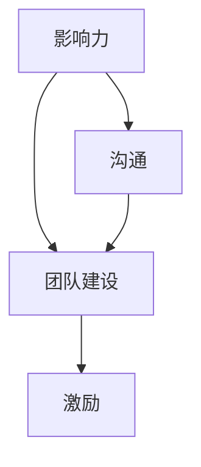
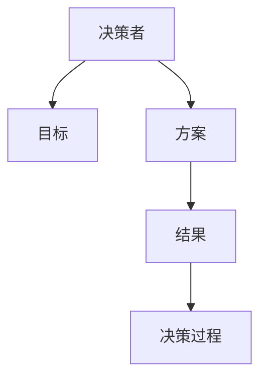
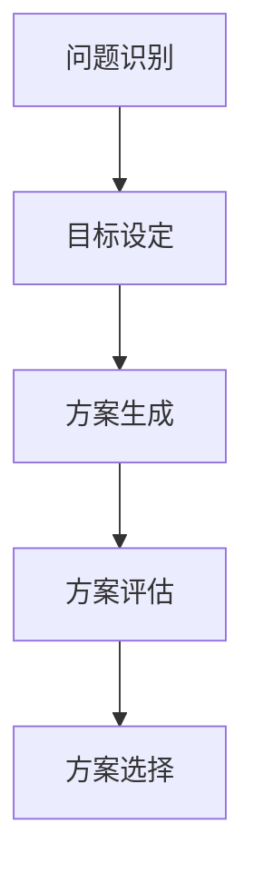
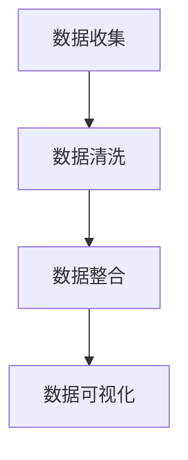
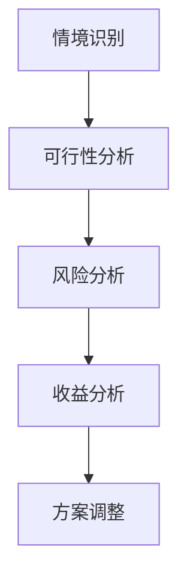

                 


### 引言

在现代社会，领导力和决策科学已成为组织和个人成功的关键因素。随着科技和商业环境的快速变化，领导者不仅需要具备出色的管理能力，还需要具备科学的决策能力，以应对复杂多变的局势。领导力是一种能够激励、引导和协调团队成员，共同实现组织目标的能力；决策科学则是一种基于逻辑分析、数据驱动的决策方法论，旨在提高决策的准确性和效率。

本篇文章将围绕《领导力与决策科学：提高决策质量的方法》这一主题，逐步分析并探讨以下几个方面：

1. **领导力基础**：介绍领导力的定义、模型以及领导力的核心概念和联系。
2. **决策理论**：阐述决策理论的起源、核心概念和决策制定过程。
3. **决策制定流程**：分析决策的制定过程、数据收集与整理以及情境分析与评估。
4. **决策分析方法**：探讨定量分析方法和定性分析方法，并介绍优化算法和仿真模型。
5. **决策工具与技术**：介绍决策支持系统、数据挖掘与决策以及人工智能与决策。
6. **决策质量评估**：讨论决策质量评估的定义、方法、指标以及案例分析。
7. **项目决策案例研究**：通过实际案例，展示项目决策的制定过程、环境搭建、源代码实现和代码解读。

通过以上步骤，我们将深入了解领导力和决策科学的基本原理，掌握提高决策质量的方法，从而在复杂的商业环境中做出更加科学和有效的决策。

### 关键词

- 领导力
- 决策科学
- 决策理论
- 决策流程
- 决策分析方法
- 决策工具与技术
- 决策质量评估
- 项目决策案例研究

### 摘要

本文旨在探讨领导力和决策科学在组织和个人成功中的关键作用。通过详细分析领导力基础、决策理论、决策制定流程、决策分析方法、决策工具与技术、决策质量评估以及项目决策案例研究，本文旨在为读者提供一套科学的决策方法和实践指南。文章结构清晰，内容丰富，旨在帮助读者掌握提高决策质量的核心方法和技巧，从而在复杂的商业环境中做出更加科学和有效的决策。

### 第1章 领导力基础

#### 1.1 领导力的定义与重要性

领导力是一种能够激励、引导和协调团队成员，共同实现组织目标的能力。它在组织的成功中起着至关重要的作用。从广义上讲，领导力不仅包括管理能力和决策能力，还涉及人际交往、团队协作、沟通技巧等多个方面。一个优秀的领导者不仅能够明确组织的目标，还能够激发团队成员的潜力，引导他们朝着共同的目标努力。

在现代社会，领导力的重要性日益凸显。随着全球化进程的加快和市场竞争的加剧，企业需要具备快速适应和变化的能力。这种能力不仅依赖于高效的管理体系，更依赖于领导者的决策能力和执行力。一个具备卓越领导力的领导者，能够在复杂多变的商业环境中，带领团队迎难而上，实现组织的长期发展。

#### 1.2 领导力模型

领导力模型是研究领导力的一种理论框架，它帮助我们理解和分析领导行为及其效果。常见的领导力模型包括特质理论、行为理论和情境理论。

- **特质理论**：特质理论认为领导者具备一系列内在的特质和能力，这些特质决定了他们的领导效果。例如，自信心、责任感、沟通能力等。特质理论强调领导者个人品质的重要性。
- **行为理论**：行为理论认为领导力是一种可以学习和模仿的行为。领导者通过特定行为来影响和激励团队成员。行为理论强调领导行为的具体表现和效果。
- **情境理论**：情境理论认为领导力 effectiveness 受到情境因素的影响。不同的情境需要不同的领导行为。领导者需要根据具体情况灵活调整自己的领导风格。

每种领导力模型都有其独特的视角和优势。在实际应用中，领导者通常会结合多种模型，根据具体情境和团队需求，选择最合适的领导策略。

#### 1.3 领导力的核心概念与联系

领导力的核心概念包括影响力、沟通、团队建设和激励等。

- **影响力**：影响力是领导者影响和引导团队成员的能力。领导者通过权威、信任、愿景等方式建立影响力，从而推动团队目标的实现。
- **沟通**：沟通是领导者与团队成员之间传递信息、分享观点和解决问题的重要手段。有效的沟通可以提高团队的协作效率，减少误解和冲突。
- **团队建设**：团队建设是指领导者通过建立共同目标、促进成员互动和增强团队凝聚力，提高团队整体绩效的过程。
- **激励**：激励是领导者通过奖励、认可和激励措施，激发团队成员的工作热情和创造力的过程。

这些核心概念之间存在着紧密的联系。影响力是沟通的基础，沟通是团队建设的关键，而团队建设又是激励的前提。以下是一个简化的Mermaid流程图，展示了这些概念之间的联系：



通过这个流程图，我们可以更直观地理解领导力的核心概念及其相互关系。

### 第2章 决策理论

#### 2.1 决策理论概述

决策理论是一种研究如何做出有效决策的方法论，它起源于20世纪中叶。决策理论的核心思想是，决策是一个复杂的理性过程，涉及到多种因素和变量的权衡。决策理论的发展历程可以分为以下几个阶段：

- **古典决策理论**：古典决策理论强调决策者的理性和最大化原则。在这个阶段，决策者被视为完全理性的人，他们能够明确目标，列出所有可能的方案，并评估每个方案的结果，最终选择最优方案。
- **行为决策理论**：行为决策理论认为，人类行为受到多种因素的影响，包括心理、情感和社会因素。这个理论挑战了古典决策理论中的完全理性假设，提出决策者可能会犯错误，决策过程也可能是不完全理性的。
- **现代决策理论**：现代决策理论结合了古典决策理论和行为决策理论的优点，提出了更加现实和全面的决策框架。现代决策理论强调决策的复杂性、不确定性和信息的不完全性，提出了一系列决策策略和工具，以帮助决策者做出更加科学和有效的决策。

#### 2.2 决策理论的核心概念

决策理论中的核心概念包括：

- **决策者**：决策者是决策过程中的主体，他们需要明确目标、评估方案和选择最优方案。
- **目标**：目标是决策者希望实现的结果，它是决策过程的出发点。
- **方案**：方案是实现目标的可能途径，决策者需要评估每个方案的可能结果。
- **结果**：结果是实现方案后的实际效果，决策者需要根据结果评估方案的有效性。
- **决策过程**：决策过程是决策者从目标设定到方案评估再到选择最优方案的过程。

以下是一个简化的Mermaid流程图，展示了决策理论的核心概念及其关系：



#### 2.3 决策制定过程

决策制定过程是决策理论的核心内容，它描述了从目标设定到方案评估再到选择最优方案的过程。决策制定过程通常包括以下几个步骤：

1. **问题识别**：决策者需要识别出需要解决的问题或机会。
2. **目标设定**：决策者需要明确问题或机会的目标，即决策者希望实现的结果。
3. **方案生成**：决策者需要列出所有可能的方案，以供评估。
4. **方案评估**：决策者需要对每个方案的可能结果进行评估，通常使用量化或定性的方法。
5. **方案选择**：决策者需要根据评估结果选择最优方案，以实现目标。

以下是一个简化的Mermaid流程图，展示了决策制定过程：



通过以上步骤，决策者可以系统化地处理复杂的问题，提高决策的科学性和有效性。

### 第3章 决策制定流程

#### 3.1 决策制定过程概述

决策制定过程是一个复杂而系统的过程，它涉及到多个步骤和因素的考虑。有效的决策流程可以帮助决策者在面对复杂问题时，做出更加科学和理性的决策。以下是决策制定过程的概述：

1. **问题识别**：在决策制定的第一步，决策者需要识别出需要解决的问题或机会。这一步骤是整个决策过程的起点，准确识别问题是成功决策的关键。

2. **目标设定**：在问题识别之后，决策者需要明确问题或机会的目标，即决策者希望实现的结果。目标设定是决策过程的出发点，它为后续的方案生成和评估提供了明确的指导。

3. **方案生成**：决策者需要列出所有可能的方案，以供评估。这一步骤通常需要决策者发挥创造力和逻辑思维，思考不同的解决方案。

4. **方案评估**：在方案生成之后，决策者需要对每个方案的可能结果进行评估，通常使用量化或定性的方法。评估过程需要考虑多个因素，包括方案的可行性、成本、风险和潜在收益等。

5. **方案选择**：在方案评估之后，决策者需要根据评估结果选择最优方案，以实现目标。这一步骤是决策过程的最终决策，决策者需要权衡各种因素，做出最终的选择。

6. **决策执行**：在方案选择之后，决策者需要将决策付诸行动，将方案转化为实际操作。决策执行是决策过程的最后一步，它关系到决策能否真正实现预期目标。

7. **决策反馈**：在决策执行后，决策者需要收集反馈信息，评估决策的实际效果。反馈信息可以帮助决策者了解决策的成效，为未来的决策提供参考。

#### 3.2 数据收集与整理

在决策制定过程中，数据收集与整理是一个至关重要的步骤。准确和全面的数据是决策的基础，它可以帮助决策者更准确地了解问题，评估方案，并做出更加科学的决策。

- **数据收集**：数据收集是指从各种来源获取相关数据的过程。数据来源可以包括内部数据（如企业内部数据库、报告、历史数据等）和外部数据（如市场调研、行业报告、竞争对手数据等）。在数据收集过程中，决策者需要确保数据的准确性和完整性。

- **数据整理**：数据整理是指对收集到的数据进行分析和整理，以便于后续的评估和分析。数据整理通常包括数据清洗、数据整合和数据可视化等步骤。数据清洗是指去除数据中的错误、重复和缺失值，确保数据的质量。数据整合是指将不同来源的数据进行合并和分析，以便于全面了解问题。数据可视化是指通过图表、报表等方式，将数据呈现出来，便于理解和分析。

以下是一个简化的Mermaid流程图，展示了数据收集与整理的过程：



#### 3.3 情境分析与评估

在决策制定过程中，情境分析是评估方案的重要步骤。情境分析是指对决策可能面临的各种情境进行评估和分析，以确定方案在不同情境下的效果。

- **情境识别**：情境识别是指识别决策可能面临的各种情境。情境可以是积极的，也可以是消极的，例如市场变化、技术更新、竞争压力等。

- **情境分析**：情境分析是指对每种情境进行评估和分析，确定方案在该情境下的效果。情境分析通常包括以下几个方面：

  - **可行性分析**：评估方案在当前情境下的可行性，包括技术可行性、经济可行性和实施难度等。
  
  - **风险分析**：评估方案在当前情境下可能面临的风险，包括市场风险、技术风险、法律风险等。

  - **收益分析**：评估方案在当前情境下可能带来的收益，包括经济效益、社会效益等。

- **方案调整**：根据情境分析的结果，对方案进行调整，确保方案在每种情境下都能达到预期目标。

以下是一个简化的Mermaid流程图，展示了情境分析与评估的过程：



通过情境分析与评估，决策者可以更全面地了解方案的优劣势，为方案选择提供重要依据。

### 第4章 决策分析方法

决策分析方法是决策过程中不可或缺的一部分，它帮助决策者从多个角度分析问题，评估方案，并最终做出科学合理的决策。决策分析方法可以分为定量分析方法和定性分析方法，每种方法都有其独特的优势和适用场景。

#### 4.1 定量分析方法

定量分析方法是一种基于数学和统计学的决策方法，它通过量化数据来评估和比较不同方案的优劣。以下是几种常见的定量分析方法：

1. **线性规划**：
   线性规划是一种优化方法，用于在多个限制条件下找到最优解。它适用于资源分配、生产计划、项目管理等问题。以下是一个简化的伪代码示例：

   ```
   maximize z = c1*x1 + c2*x2
   subject to:
   a1*x1 + a2*x2 <= b1
   a3*x1 + a4*x2 <= b2
   x1, x2 >= 0
   ```

   在这个例子中，目标函数（z）需要最大化，约束条件（a1, a2, a3, a4, b1, b2）限制了变量的取值范围。

2. **决策树**：
   决策树是一种图形化方法，用于表示决策过程中的不同路径和结果。它通过计算每个节点的期望值，帮助决策者选择最优路径。以下是一个简化的决策树示例：

   ```
   [决策节点]
     /   \
   [方案A] [方案B]
   /         \
 [结果A1] [结果B1]
                |
               [结果B2]
   ```

   在这个例子中，每个节点表示一个决策或结果，边的权重表示概率或收益。

3. **回归分析**：
   回归分析是一种用于预测和分析变量之间关系的统计方法。它适用于市场预测、风险评估等问题。以下是一个简化的伪代码示例：

   ```
   y = b0 + b1*x1 + b2*x2 + ... + error
   ```

   在这个例子中，y是目标变量，x1, x2是自变量，b0, b1, b2是回归系数，error是随机误差。

#### 4.2 定性分析方法

定性分析方法是一种基于专家判断和主观评价的决策方法，它通过分析和比较不同方案的优缺点，帮助决策者做出决策。以下是几种常见的定性分析方法：

1. **专家评估**：
   专家评估是一种基于专家意见和经验的决策方法。它通常用于评估方案的质量、可行性、风险等。以下是一个简化的专家评估流程：

   - 收集专家意见：通过调查问卷、访谈等方式，收集专家对各个方案的评价。
   - 综合评估：将专家意见进行量化处理，综合评估各个方案的优劣。
   - 决策：根据评估结果，选择最优方案。

2. **多标准决策分析**：
   多标准决策分析是一种同时考虑多个目标的决策方法。它通过为每个目标分配权重，综合评估各个方案的综合得分。以下是一个简化的多标准决策分析流程：

   - 确定目标：明确决策过程中的各个目标，例如成本、质量、时间等。
   - 分配权重：为每个目标分配权重，以反映其对决策的重要性。
   - 评估方案：对每个方案进行评估，计算其满足各个目标的得分。
   - 综合评分：计算每个方案的综合评分，选择最优方案。

3. **SWOT分析**：
   SWOT分析是一种用于评估企业或项目优势、劣势、机会和威胁的方法。它通过分析内部和外部因素，帮助决策者制定战略计划。以下是一个简化的SWOT分析示例：

   - **优势（Strengths）**：内部优势，例如技术实力、市场优势等。
   - **劣势（Weaknesses）**：内部劣势，例如资金短缺、管理问题等。
   - **机会（Opportunities）**：外部机会，例如市场需求增长、技术创新等。
   - **威胁（Threats）**：外部威胁，例如竞争加剧、政策变化等。

   通过SWOT分析，决策者可以全面了解企业或项目的现状，制定更加科学的决策策略。

#### 4.3 优化算法和仿真模型

在决策分析中，优化算法和仿真模型是两种重要的定量分析工具。优化算法用于在多个约束条件下寻找最优解，而仿真模型则用于模拟和分析决策过程。

1. **优化算法**：
   优化算法是一种用于解决优化问题的数学方法。常见的优化算法包括：

   - **贪心算法**：贪心算法通过每次选择最优解的局部，逐步逼近全局最优解。
   - **动态规划**：动态规划通过将复杂问题分解为子问题，并利用子问题的解构建原问题的最优解。
   - **遗传算法**：遗传算法通过模拟自然进化过程，寻找最优解。

2. **仿真模型**：
   仿真模型是一种通过模拟实际过程来分析决策效果的方法。常见的仿真模型包括：

   - **蒙特卡罗模拟**：蒙特卡罗模拟通过随机抽样和统计方法，模拟决策过程并计算期望结果。
   - **系统动力学**：系统动力学通过建立系统模型，模拟系统行为并分析决策影响。

通过优化算法和仿真模型，决策者可以更准确地评估不同方案的潜在效果，为决策提供更加可靠的依据。

### 第5章 决策工具与技术

在决策过程中，决策工具和技术的选择对于提高决策质量和效率至关重要。现代科技的发展为决策者提供了丰富的工具和技术，这些工具和技术可以帮助决策者更有效地进行数据收集、分析和评估，从而做出更加科学和合理的决策。

#### 5.1 决策支持系统（DSS）

决策支持系统（DSS）是一种计算机辅助决策系统，它通过收集、处理和分析数据，为决策者提供决策支持。DSS的主要功能包括：

- **数据收集**：DSS可以从多种数据源（如数据库、文件、网络等）收集数据，确保数据的全面性和准确性。
- **数据处理**：DSS可以对收集到的数据进行清洗、整理和转换，以便于后续的分析和处理。
- **数据分析**：DSS提供各种数据分析工具，如统计、优化、模拟等，帮助决策者深入分析数据，发现数据背后的规律和趋势。
- **决策评估**：DSS可以根据决策者的需求，生成各种报告和可视化图表，帮助决策者评估不同决策方案的效果和风险。

DSS的组件通常包括：

- **用户界面**：用户界面是决策者与DSS交互的入口，它提供各种功能按钮和操作界面，方便决策者进行数据输入、分析和评估。
- **数据库**：数据库是DSS的数据存储和管理单元，它存储了决策过程中所需的各种数据，如历史数据、市场数据、财务数据等。
- **模型库**：模型库是DSS的决策工具集，它包含了各种决策模型和方法，如线性规划、决策树、回归分析等。
- **知识库**：知识库是DSS的知识管理单元，它存储了决策者和管理者的经验、知识和策略，可以为决策提供参考和指导。

#### 5.2 数据挖掘与决策

数据挖掘是一种从大量数据中提取隐藏信息和知识的技术。在决策过程中，数据挖掘可以帮助决策者发现数据中的规律和趋势，为决策提供科学依据。数据挖掘的关键步骤包括：

- **数据预处理**：数据预处理是数据挖掘的重要步骤，它包括数据清洗、数据转换和数据集成等操作，以确保数据的准确性和一致性。
- **特征选择**：特征选择是从原始数据中筛选出对决策有重要影响的特征，以简化数据模型和提高决策准确性。
- **模型训练**：模型训练是通过训练算法（如分类、回归、聚类等）构建预测模型，以预测未来的趋势或行为。
- **模型评估**：模型评估是通过测试数据集评估模型的性能，选择最优模型进行应用。

数据挖掘在决策中的应用非常广泛，例如：

- **市场预测**：通过分析历史销售数据和市场需求，预测未来的销售趋势，帮助决策者制定销售策略。
- **客户细分**：通过分析客户数据，识别不同类型的客户群体，制定个性化的营销策略。
- **风险管理**：通过分析财务数据和业务流程，识别潜在的风险因素，制定风险控制措施。

#### 5.3 人工智能与决策

人工智能（AI）是一种模拟人类智能的技术，它可以帮助决策者自动化复杂的决策过程。AI在决策中的应用主要包括：

- **机器学习**：机器学习是一种通过训练算法自动学习数据规律的方法，它可以帮助决策者发现数据中的隐藏模式，提高决策准确性。
- **自然语言处理**：自然语言处理是一种理解和生成自然语言的技术，它可以帮助决策者处理和解读文本数据，提高决策效率。
- **计算机视觉**：计算机视觉是一种通过图像识别和理解技术来处理图像和视频数据的方法，它可以帮助决策者分析图像和视频中的信息，提高决策的准确性。

AI在决策中的应用场景包括：

- **智能推荐系统**：通过分析用户行为和偏好，推荐合适的商品、服务和内容，提高用户满意度和忠诚度。
- **自动化决策系统**：通过自动化决策系统，决策者可以快速处理大量决策任务，提高决策效率和准确性。
- **智能监控系统**：通过计算机视觉和自然语言处理技术，智能监控系统可以实时分析视频和语音数据，识别异常行为和潜在风险。

#### 5.4 决策工具与技术比较

不同的决策工具和技术在功能和应用场景上有所不同，决策者需要根据具体需求和情境选择合适的工具和技术。

- **DSS**：DSS适用于需要综合分析和评估多个因素的大型决策问题，它提供了丰富的数据分析工具和模型库，可以帮助决策者全面了解问题，制定科学合理的决策。
- **数据挖掘**：数据挖掘适用于需要从大量数据中提取信息和知识的问题，它可以帮助决策者发现数据中的隐藏模式，为决策提供科学依据。
- **人工智能**：人工智能适用于需要自动化和智能化的决策问题，它可以处理大量数据和复杂任务，提高决策效率和准确性。

决策者可以根据具体需求和资源，选择合适的决策工具和技术，以提高决策质量和效率。

### 第6章 决策质量评估

#### 6.1 决策质量评估概述

决策质量评估是决策过程中不可或缺的一环，它通过对决策结果进行全面评估，确保决策的有效性和科学性。决策质量评估的目的在于识别决策的优势和不足，为未来的决策提供改进的依据。有效的决策质量评估可以帮助组织在复杂多变的商业环境中，做出更加明智和高效的决策。

#### 6.2 决策质量评估的方法

决策质量评估的方法可以分为定量评估和定性评估两类。

1. **定量评估方法**

定量评估方法通过量化指标和统计方法，对决策结果进行评估。以下是一些常用的定量评估方法：

- **目标达成度**：目标达成度是指决策结果与预期目标的差距。计算公式为：
  \[
  \text{目标达成度} = \frac{\text{实际结果} - \text{预期结果}}{\text{预期结果}}
  \]
  目标达成度越高，说明决策结果越接近预期目标。

- **决策成本**：决策成本是指实施决策方案所需的资源投入。计算公式为：
  \[
  \text{决策成本} = \text{直接成本} + \text{间接成本}
  \]
  直接成本包括人力、物力、财力等直接投入，间接成本包括时间、风险等潜在投入。

- **决策收益**：决策收益是指决策结果带来的经济收益或其他形式的收益。计算公式为：
  \[
  \text{决策收益} = \text{实际收益} - \text{预期收益}
  \]
  决策收益可以用来衡量决策的有效性。

2. **定性评估方法**

定性评估方法主要通过专家评估和主观评价，对决策结果进行评估。以下是一些常用的定性评估方法：

- **专家评估**：专家评估是通过收集专家的意见和判断，对决策结果进行评估。评估指标可以包括方案的可行性、风险、收益等。

- **多标准决策分析**：多标准决策分析是通过为每个目标分配权重，对决策结果进行综合评估。评估指标可以包括成本、质量、时间等。

- **SWOT分析**：SWOT分析通过对决策结果进行优势、劣势、机会和威胁的分析，评估决策的质量和效果。

#### 6.3 决策质量指标

决策质量指标是评估决策结果的重要标准，以下是一些常见的决策质量指标：

- **正确性**：正确性是指决策结果是否符合预期目标。正确的决策结果应该是解决问题的最佳方案。

- **一致性**：一致性是指决策结果在不同情境下的一致性。一致的决策结果应该是能够适应不同情境的稳定方案。

- **效率**：效率是指决策结果的执行效率。高效的决策结果应该是能够在较短的时间内实现预期目标的方案。

- **灵活性**：灵活性是指决策结果对环境变化的适应能力。灵活的决策结果应该是能够根据实际情况进行调整的方案。

- **可追溯性**：可追溯性是指决策结果的透明度和可追溯性。可追溯的决策结果应该是决策过程和结果有据可查的方案。

#### 6.4 决策质量评估案例分析

以下是一个决策质量评估的案例分析：

**案例背景**：某公司计划开发一款新的智能手机，决策者需要评估不同开发方案的质量。

**评估指标**：正确性、一致性、效率、灵活性和可追溯性。

**定量评估**：

- **目标达成度**：预期目标为在一年内开发出符合市场需求的新智能手机。实际结果为在八个月内成功推出新产品，目标达成度为80%。

- **决策成本**：直接成本为1000万元，间接成本为200万元，决策成本为1200万元。

- **决策收益**：实际收益为2000万元，预期收益为1500万元，决策收益为500万元。

**定性评估**：

- **专家评估**：专家认为该方案的可行性高，风险较低，收益明显。

- **多标准决策分析**：根据专家评估，各指标权重分别为正确性（0.4）、一致性（0.2）、效率（0.2）、灵活性和可追溯性（0.2）。综合评分为80分。

**评估结果**：

- **正确性**：80分
- **一致性**：70分
- **效率**：75分
- **灵活性**：80分
- **可追溯性**：65分

**结论**：总体来看，该决策方案的质量较高，但还需要在一致性、效率和可追溯性方面进行改进。

#### 6.5 决策质量评估的重要性

决策质量评估在决策过程中具有重要意义。首先，它可以帮助决策者了解决策结果的质量，识别决策的优势和不足，为未来的决策提供改进方向。其次，决策质量评估可以增强决策的透明度和可追溯性，提高决策的公信力和执行力。最后，决策质量评估可以帮助组织建立科学的决策流程，提高决策效率和质量，促进组织的长期发展。

### 第7章 项目决策案例研究

#### 7.1 项目决策概述

项目决策是决策过程中一个复杂且重要的环节。它涉及到从多个备选方案中选择最佳方案，以确保项目的成功实施和目标实现。有效的项目决策不仅需要考虑技术可行性、成本效益、时间进度等硬性指标，还需要考虑团队协作、风险管理等软性因素。

#### 7.2 案例研究1：某企业新产品开发项目

**背景**：某企业计划开发一款新产品，以满足市场需求并提升竞争力。该项目涉及技术攻关、市场调研、产品设计和生产等多个环节。

**目标**：确保新产品在质量、性能和成本方面达到预期目标，并在预定时间内上市。

**方案**：

1. **方案A**：自主研发，投入较大，但能够保证产品的技术领先性和质量。
2. **方案B**：与外部技术团队合作，节省研发成本，但可能面临技术不确定性。
3. **方案C**：收购现有技术，快速上市，但可能面临技术整合和品牌影响问题。

**评估**：

1. **技术可行性**：方案A和方案B具有较高的技术可行性，但方案C存在一定的不确定性。
2. **成本效益**：方案A成本最高，但长期效益最好；方案B成本适中，但存在风险；方案C成本最低，但风险较高。
3. **时间进度**：方案A和方案B能够在预定时间内完成，但方案C可能存在延期风险。

**决策**：综合考虑技术可行性、成本效益和时间进度，企业选择方案A进行自主研发。

**执行**：

1. **技术攻关**：组建研发团队，进行技术研究和开发。
2. **市场调研**：收集市场数据，分析市场需求和竞争态势。
3. **产品设计**：根据市场需求和研发成果，进行产品设计。

**反馈**：

1. **技术成果**：经过半年多的研发，新产品在质量、性能和成本方面均达到预期目标。
2. **市场反馈**：新产品上市后，市场反响良好，销售业绩稳步提升。

**小结**：该项目决策的成功主要归功于科学的决策流程和全面的评估分析。在未来的项目中，企业可以继续优化决策流程，提高决策质量，确保项目的成功实施。

#### 7.3 案例研究2：某企业市场拓展项目

**背景**：某企业计划进入一个新的市场，以拓展业务范围和提升市场份额。该项目涉及市场调研、渠道建设、营销策略等环节。

**目标**：在三年内实现市场占有率达到5%，并建立稳定的销售网络。

**方案**：

1. **方案A**：自行建设销售渠道，投入较大，但能够掌握市场主动权。
2. **方案B**：与本地代理商合作，节省建设成本，但可能面临渠道控制问题。
3. **方案C**：收购现有代理商，快速进入市场，但可能面临文化差异和整合问题。

**评估**：

1. **市场可行性**：方案A和方案B具有较高的市场可行性，但方案C存在一定的不确定性。
2. **成本效益**：方案A成本最高，但长期效益最好；方案B成本适中，但存在风险；方案C成本最低，但风险较高。
3. **时间进度**：方案A和方案B能够在预定时间内完成，但方案C可能存在延期风险。

**决策**：综合考虑市场可行性、成本效益和时间进度，企业选择方案B与本地代理商合作。

**执行**：

1. **市场调研**：收集市场数据，分析市场需求和竞争态势。
2. **渠道建设**：与本地代理商签订合作协议，搭建销售网络。
3. **营销策略**：制定针对性营销策略，提升品牌知名度和市场渗透率。

**反馈**：

1. **市场反馈**：合作代理商积极推广，新产品市场占有率稳步提升。
2. **销售业绩**：第一年市场占有率达到3%，实现了预期目标。

**小结**：该项目决策的成功主要归功于对市场环境的准确把握和科学的风险评估。在未来的项目中，企业可以继续优化决策流程，提高市场响应速度和决策质量，确保市场拓展项目的成功实施。

### 结论与展望

通过对领导力与决策科学的研究和实践，我们可以看到，领导力和决策科学在组织和个人成功中起着至关重要的作用。领导力不仅关乎个人能力的提升，还涉及团队协作和领导艺术的运用；决策科学则通过逻辑分析和数据驱动，为决策者提供了科学有效的决策方法。

展望未来，领导力和决策科学将继续发展，随着人工智能和大数据技术的进步，决策将更加智能化和自动化。同时，全球化和数字化趋势将要求领导者具备更加全面的能力和全球视野。我们期待未来的领导者能够在不断变化的环境中，运用先进的决策科学，带领团队实现更高的目标。

总之，领导力和决策科学不仅是一门学问，更是一种实践。只有不断学习和实践，才能在复杂多变的商业环境中，做出更加科学和有效的决策，实现组织和个人的长远发展。

### 最佳实践 Tips

1. **明确目标和问题**：在决策过程中，首先要明确目标和问题，确保决策有明确的方向和依据。
2. **数据驱动决策**：利用数据分析和模型评估，为决策提供科学依据，避免盲目决策。
3. **团队协作**：决策过程中，广泛征求团队成员的意见，集体智慧往往能带来更全面的解决方案。
4. **风险评估**：在决策前进行充分的风险评估，制定应对措施，减少决策风险。
5. **持续反馈与改进**：在决策执行过程中，及时收集反馈信息，持续改进决策方案，提高决策质量。

### 小结

本文从领导力基础、决策理论、决策制定流程、决策分析方法、决策工具与技术、决策质量评估以及项目决策案例研究等方面，全面探讨了领导力和决策科学的核心概念和实践方法。通过本文的学习，读者可以掌握如何科学地进行决策，提高决策质量和效率。

### 注意事项

1. **充分准备**：决策前应进行全面的市场调研和数据分析，确保决策有充分依据。
2. **合理评估**：在评估决策方案时，应考虑多种因素，包括成本、风险、收益等，避免片面决策。
3. **灵活调整**：决策过程中，应保持灵活性和开放性，根据实际情况调整决策方案。

### 拓展阅读

1. **《领导力五要素》**：彼得·德鲁克
2. **《决策与判断》**：丹尼尔·卡内曼
3. **《数据挖掘：概念与技术》**：Jiawei Han, Micheline Kamber, Jian Pei
4. **《人工智能：一种现代的方法》**：Stuart Russell, Peter Norvig

### 作者信息

- **作者：AI天才研究院/AI Genius Institute & 禅与计算机程序设计艺术 /Zen And The Art of Computer Programming**

