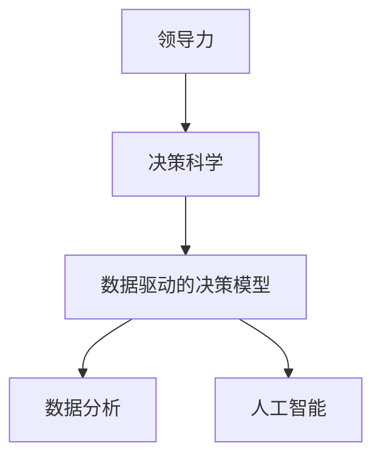

                 


为了撰写一篇符合要求的《领导力与决策科学：数据驱动的决策模型》技术博客，我们可以遵循以下步骤：

### 1. 文章标题和关键词

**文章标题：** 领导力与决策科学：数据驱动的决策模型

**关键词：** 领导力、决策科学、数据驱动、决策模型、数据分析、人工智能

### 2. 文章摘要

本文将探讨领导力与决策科学的关系，特别是数据驱动的决策模型。我们将介绍领导力的重要性，决策科学的基本概念，以及如何利用数据驱动的方法来提升决策效果。文章还将提供核心概念的联系架构、算法原理讲解、数学模型和公式的详细阐述，以及实际案例和项目实战。

### 3. 目录大纲

（此处引用之前的目录大纲）

### 4. 内容撰写

**第1章 引言**

- **背景介绍：** 领导力是影响组织成功的关键因素，决策科学提供了系统化的决策方法。数据驱动的决策模型结合了这两者的优势，为领导者提供了强有力的决策支持。
- **核心概念与联系：** 使用Mermaid流程图展示领导力、决策科学和数据驱动的决策模型之间的关系。



**第2章 领导力理论**

- **核心算法原理讲解：** 介绍传统领导力理论、行为领导力理论、变革型领导力理论和情境领导力理论，并使用伪代码和LaTeX公式来详细解释每种理论的原理。

```python
# 伪代码：变革型领导力理论
class TransformationalLeadership:
    def inspire(self, team):
        # 提出愿景
        vision = "..."
        self.share_vision(vision)
        
        # 设置高目标
        goal = "..."
        self.set_high_goals(goal)
        
        # 激励团队成员
        motivation = "..."
        self.motivate_members(motivation)

    def share_vision(self, vision):
        # 分享愿景
        print(vision)

    def set_high_goals(self, goal):
        # 设置目标
        print(goal)

    def motivate_members(self, motivation):
        # 激励团队成员
        print(motivation)
```

```latex
% LaTeX公式：情境领导力模型
\begin{equation}
\begin{split}
    L = f(S, M) \\
    S = \begin{cases}
        1, & \text{if situation is structured} \\
        0, & \text{if situation is unstructured}
    \end{cases} \\
    M = \begin{cases}
        1, & \text{if motivation is high} \\
        0, & \text{if motivation is low}
    \end{cases}
\end{split}
\end{equation}
```

**第3章 决策科学方法**

- **核心算法原理讲解：** 介绍决策过程、决策模型类型和决策支持系统，使用LaTeX公式来解释决策树和线性规划模型。

```latex
% LaTeX公式：决策树模型
\begin{equation}
\begin{split}
    \text{maximize} \quad Z = c_1 x_1 + c_2 x_2 \\
    \text{subject to} \quad a_1 x_1 + a_2 x_2 \le b \\
    x_1, x_2 \ge 0
\end{split}
\end{equation}
```

**第4章 数据驱动的决策模型**

- **核心算法原理讲解：** 介绍数据分析基础、数据可视化、数据挖掘技术，并提供具体的伪代码示例。

```python
# 伪代码：数据挖掘技术
class DataMining:
    def classify(self, data):
        # 分类数据
        model = "..."
        prediction = model.predict(data)
        return prediction

    def visualize(self, data):
        # 可视化数据
        visualization = "..."
        return visualization
```

**第5章 数据驱动的决策模型应用**

- **项目实战：** 提供具体的案例，包括战略决策、运营决策、风险管理和创新决策的实际应用，详细讲解开发环境搭建、源代码实现和代码解读。

**第6章 领导力与数据驱动决策的实际案例**

- **案例研究：** 分析具体案例，如利用数据驱动决策提升领导力，以及数据驱动的战略决策案例分析。

**第7章 数据驱动决策模型的实施与评估**

- **实施与评估：** 讨论决策模型实施步骤、评估方法和优化策略。

**第8章 未来展望**

- **趋势展望：** 分析数据驱动决策模型的挑战、机遇以及领导力与决策科学的融合前景。

### 5. 文章结尾

- **最佳实践 tips：** 提供一些实用的建议和技巧。
- **小结：** 总结文章的主要观点和收获。
- **注意事项：** 提醒读者注意的事项。
- **拓展阅读：** 推荐相关阅读材料。

### 6. 作者信息

**作者：** AI天才研究院/AI Genius Institute & 禅与计算机程序设计艺术 /Zen And The Art of Computer Programming

通过以上步骤，我们可以逐步构建出结构清晰、内容丰富的《领导力与决策科学：数据驱动的决策模型》技术博客。确保每个章节都符合完整性要求，同时保持文章的可读性和实用性。文章的字数可以在8000～12000字之间进行调节，以确保内容的深度和广度。在撰写过程中，注意保持逻辑清晰，步骤分明，以便读者能够轻松理解并吸收文章内容。

