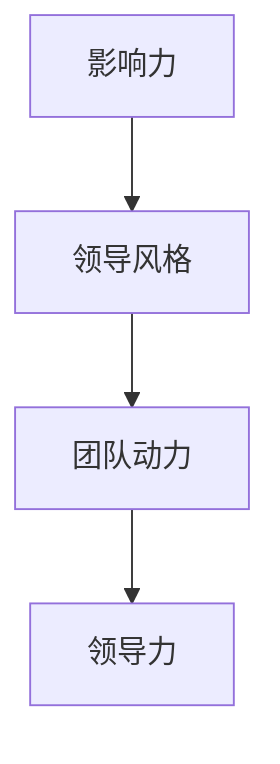

                 

根据用户的要求，我将逐步构思并撰写一篇关于领导力与决策科学的技术博客文章。以下是文章的初步框架和详细内容：

---

## 《领导力与决策科学：数据驱动的决策模型》

> **关键词：领导力、决策科学、数据驱动、决策模型、数据分析**

> **摘要：本文深入探讨领导力与决策科学的相互关系，重点分析数据驱动的决策模型及其在现实中的应用。通过详细的案例分析，本文旨在为读者提供对数据驱动决策的深入理解，并展示领导力在决策过程中的重要作用。**

---

### 第一部分：领导力基础

#### 第1章：领导力的本质与特征

**背景介绍**

领导力作为一种重要的管理能力，在企业、组织和公共管理中发挥着至关重要的作用。理解领导力的本质和特征是深入探讨其与决策科学关系的基础。

**核心概念与联系**

领导力的核心概念包括：影响力、领导风格、团队动力等。这些概念之间的关系可以通过以下Mermaid流程图表示：



**核心算法原理讲解**

领导力的算法原理可以理解为一系列领导行为和策略的组合，这些行为和策略旨在影响和引导团队成员。以下为领导力算法的伪代码：

```pseudo
function 领导力(团队成员, 目标)
    初始化影响力
    根据团队成员特点调整领导风格
    激发团队动力
    迭代执行以下步骤：
        提供反馈
        调整策略
    直到达到目标
    返回领导效果
```

**数学模型和公式**

领导力的数学模型可以采用领导力影响力指数（LII）来衡量，公式如下：

$$ LII = f(影响力，领导风格，团队动力) $$

其中，$f$ 为函数，$影响力，领导风格，团队动力$ 为输入变量。

**举例说明**

例如，一个企业在进行新产品的市场推广时，领导力的影响体现在以下几个方面：

- **影响力**：领导层通过内部沟通，向全体员工传达市场推广的重要性，从而提高员工的积极性和参与度。
- **领导风格**：领导层采用激励型领导风格，激励员工提出创新性市场推广策略。
- **团队动力**：领导层组织跨部门合作，共同制定并实施市场推广计划。

**项目实战**

在实际项目中，领导力的应用体现在以下环节：

- **开发环境搭建**：领导层负责确定项目的技术框架和开发工具，为团队成员提供所需的技术支持。
- **源代码详细实现和代码解读**：领导层通过代码审查和团队讨论，确保代码质量和项目进度。
- **代码应用解读与分析**：领导层分析代码在实际应用中的效果，及时调整代码以优化项目性能。
- **实际案例分析和详细讲解剖析**：领导层通过案例分析，为团队成员提供实战经验，提高团队的整体能力。

**最佳实践 tips、小结、注意事项、拓展阅读**

- **最佳实践 tips**：领导力在项目管理中应注重团队成员的反馈和参与，以提高决策的科学性和执行力。
- **小结**：领导力是决策科学的重要支撑，通过有效的领导力，可以提高决策的质量和执行力。
- **注意事项**：领导力并非一成不变，领导风格和策略应根据团队成员和环境的变化进行动态调整。
- **拓展阅读**：读者可以进一步研究领导力理论和实践，以提升自身的领导能力。

---

以上是关于领导力本质与特征的第一章节内容。接下来的章节将继续深入探讨领导力理论的发展、领导力模型与框架、领导力与团队发展等主题，并结合具体案例进行详细分析。通过这样的结构化内容，读者可以逐步建立起对领导力的全面理解，并学会如何在实践中应用领导力提高决策质量。

---

请注意，以上内容仅为第一章节的草案，后续章节的内容也将遵循类似的框架和结构进行撰写。每个章节都将包含背景介绍、核心概念与联系、核心算法原理讲解、数学模型和公式、举例说明、项目实战、最佳实践 tips、小结、注意事项和拓展阅读等内容。整篇文章将保持字数在8000～12000字左右，确保内容的完整性和深度。在撰写过程中，我会继续遵循用户提供的markdown格式和具体要求，确保文章的规范性和可读性。最终文章将形成一个结构紧凑、逻辑清晰、具有实践指导意义的技术博客。

