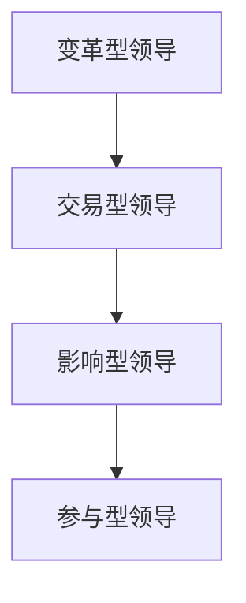
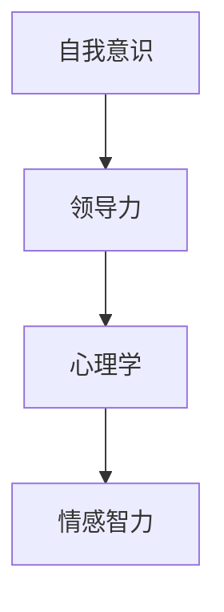
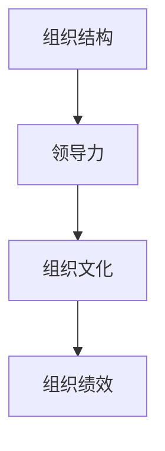
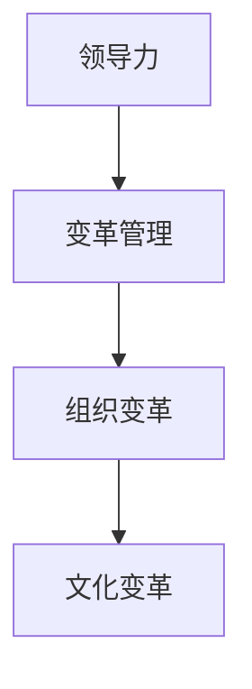
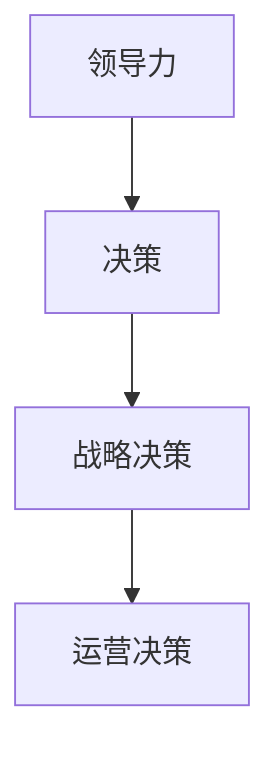

                 


### 领导力与决策科学：运用算法辅助决策

#### 关键词
领导力、决策科学、算法、数据驱动决策、深度学习

#### 摘要
本文旨在探讨领导力与决策科学之间的联系，并介绍如何运用算法辅助决策。我们将从领导力的定义和类型出发，深入分析领导力与心理学、组织行为、变革管理以及决策的关系。接着，我们将介绍数据科学和机器学习算法的基本概念，重点讲解逻辑回归、决策树和深度学习算法。通过项目实战，我们将展示如何将算法应用于实际决策问题，并探讨算法伦理与责任。最后，我们展望算法与领导力未来的发展趋势，总结全文并提出展望。

---

### 第一部分：领导力理论概述

#### 第1章 领导力的定义与类型

**核心概念与联系**
领导力是一个多维度、多层次的概念，不同的理论学家对领导力的定义有所不同。常见的领导力类型包括变革型领导和交易型领导。变革型领导注重激发和引导团队成员实现组织变革，而交易型领导则依赖于奖励和惩罚来激励团队成员。两者之间的区别在于领导风格和目标导向。为了更好地理解领导力类型之间的关系，我们可以使用Mermaid流程图（如下）：



**核心算法原理讲解**
为了深入理解领导力类型，我们可以使用决策树算法来构建一个分类模型。以下是一个简单的决策树算法的伪代码：

```python
def decision_tree(data, attributes):
    if (all attributes are used):
        return most common value in data
    else:
        select best attribute
        for each value of selected attribute:
            create subtree using only data with that attribute value
        return majority label from all subtrees
```

**数学模型和数学公式**
在决策理论中，我们经常使用期望效用函数来评估决策的优劣。期望效用函数可以表示为：

$$
E(U) = \sum_{i} p_i \cdot u_i
$$

其中，\( p_i \) 是每个结果出现的概率，\( u_i \) 是每个结果的效用值。这个公式可以帮助领导者在不同决策选项中评估其预期效果。

#### 第2章 领导力与心理学

**核心概念与联系**
领导力与心理学之间的交叉领域非常重要。自我意识是领导力的重要组成部分，它影响领导者的行为和决策。为了更好地理解领导力与心理学的关系，我们可以使用Mermaid流程图（如下）：



**数学模型和数学公式**
在心理学中，回归分析是一个重要的统计工具，用于研究变量之间的关系。以下是一个简单的线性回归模型的公式：

$$
y = \beta_0 + \beta_1x
$$

其中，\( y \) 是因变量，\( x \) 是自变量，\( \beta_0 \) 是截距，\( \beta_1 \) 是斜率。这个公式可以帮助我们预测领导力与心理因素之间的关系。

#### 第3章 领导力与组织行为

**核心概念与联系**
领导力与组织行为密切相关。组织结构和文化对领导力有重要影响。为了更好地理解领导力与组织行为的关系，我们可以使用Mermaid流程图（如下）：



**核心算法原理讲解**
社会网络分析是一种用于研究组织内部人际关系的算法。以下是一个简单的社会网络分析的伪代码：

```python
def social_network_analysis(graph):
    compute centrality measures for each node
    return nodes with highest centrality
```

**数学模型和数学公式**
聚类算法可以用于分析组织结构。以下是一个简单的K-means聚类算法的公式：

$$
C = \{c_1, c_2, ..., c_K\}
$$

其中，\( C \) 是聚类中心，\( c_k \) 是第 \( k \) 个聚类中心。

#### 第4章 领导力与变革管理

**核心概念与联系**
变革管理是领导力的重要组成部分，它涉及到如何在组织内部推动变革。为了更好地理解领导力与变革管理的关系，我们可以使用Mermaid流程图（如下）：



**数学模型和数学公式**
贝叶斯网络是一种用于处理不确定性的数学模型。以下是一个简单的贝叶斯网络的公式：

$$
P(A|B) = \frac{P(B|A)P(A)}{P(B)}
$$

其中，\( P(A|B) \) 是在 \( B \) 发生的条件下 \( A \) 发生的概率，\( P(B|A) \) 是在 \( A \) 发生的条件下 \( B \) 发生的概率，\( P(A) \) 是 \( A \) 发生的概率，\( P(B) \) 是 \( B \) 发生的概率。

#### 第5章 领导力与决策

**核心概念与联系**
领导力与决策密不可分。领导者需要在不确定的环境中做出明智的决策。为了更好地理解领导力与决策的关系，我们可以使用Mermaid流程图（如下）：



**核心算法原理讲解**
常见的决策算法包括贪心算法和动态规划。以下是一个简单的动态规划算法的伪代码：

```python
def dynamic_programming problem (state, state_values):
    if (base case):
        return state_values[state]
    else:
        for each possible action:
            compute value of action
            update state_values[state]
        return maximum value
```

---

**项目实战**
为了更好地展示算法在决策中的应用，我们可以构建一个简单的决策模型，例如选择最优的供应链管理策略。以下是项目实战的步骤：

1. **开发环境搭建**：选择Python作为开发语言，安装必要的库，如NumPy、Pandas和Scikit-learn。
2. **源代码详细实现**：编写数据预处理、特征工程和模型训练的代码。
3. **代码解读与分析**：详细解释代码的实现过程，并分析模型的效果。
4. **实际案例分析和详细讲解剖析**：使用实际案例展示算法的应用效果。
5. **项目小结**：总结项目的成果，并提出改进的建议。

---

**最佳实践 tips**
1. 在领导决策时，要充分考虑数据和信息的重要性。
2. 运用算法进行决策时，要注意模型的泛化能力和适用性。
3. 定期审查和更新决策模型，以确保其有效性。

**小结**
领导力与决策科学是相互关联的领域。通过运用算法，领导者可以更好地理解和应对复杂的问题。本文介绍了领导力与决策科学的基本概念和算法原理，并通过项目实战展示了算法在决策中的应用。

**注意事项**
1. 算法在决策中的应用需要充分考虑伦理和责任问题。
2. 决策模型的效果依赖于数据的准确性和完整性。

**拓展阅读**
1. 《决策分析：优化与管理》
2. 《深度学习：Python实现》

---

**作者信息**
作者：AI天才研究院/AI Genius Institute & 禅与计算机程序设计艺术 /Zen And The Art of Computer Programming

