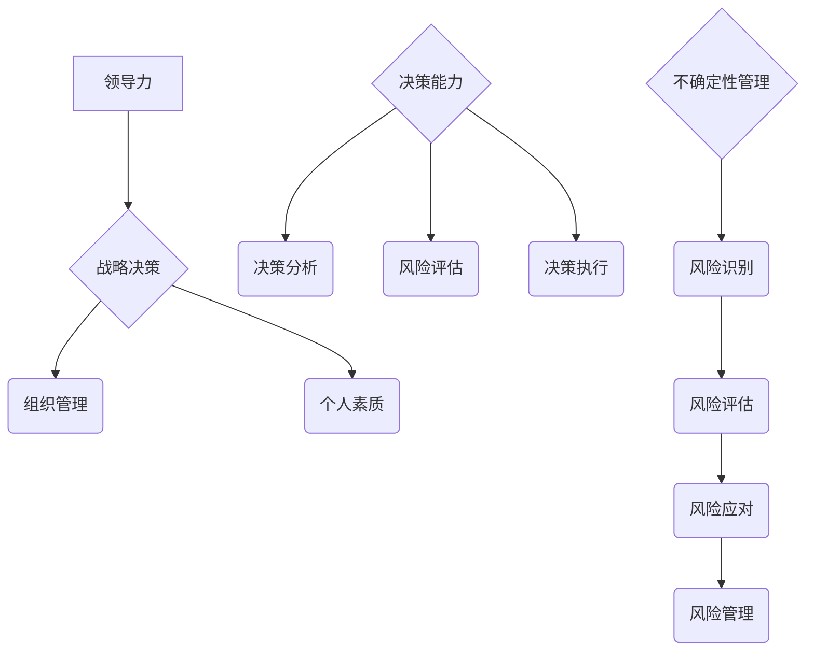

                 


# 《领导力与决策能力：在不确定性中把握方向》

## 关键词

领导力、决策能力、不确定性、战略管理、组织效能、跨部门协作、案例分析

## 摘要

在当今快速变化和高度不确定性的商业环境中，领导力和决策能力成为了企业成功的关键。本文通过深入分析领导力与决策能力的关系，探讨了在不确定性中如何把握方向。文章首先定义了领导力和决策能力的核心概念，然后详细阐述了两者之间的相互影响，并通过具体的算法原理讲解、数学模型分析和实际案例，展示了如何在复杂环境中进行有效的领导决策。

### 1. 引言与背景

在不确定性的时代，企业面临着前所未有的挑战。全球化和技术的迅猛发展使得市场环境瞬息万变，企业必须具备快速适应和决策的能力。领导力在这一过程中起着至关重要的作用。领导者不仅要具备战略眼光，还需要拥有强大的决策能力，以应对各种不确定性。

领导力是一种影响和激励他人实现目标的能力。它涉及多个方面，包括愿景设定、团队管理、沟通技巧和危机处理等。有效的领导力能够提高团队的凝聚力，促进创新和高效的工作环境。

决策能力则是领导者面对复杂问题时，能够快速做出合理决策的能力。决策能力包括信息收集、分析评估、选择方案和执行监督等环节。在不确定性中，决策能力尤为重要，因为它直接影响到企业的生存和发展。

### 2. 领导力概述

#### 2.1 领导力的定义

领导力是一种复杂的社会现象，它不仅仅是管理技能的体现，更是人格特质和价值观的反映。简单来说，领导力是指引导和激励他人实现共同目标的能力。

#### 2.2 领导力与管理的区别

领导力与管理的区别在于其侧重点不同。管理侧重于维持现状，确保组织的稳定和效率；而领导力则侧重于变革和创新，推动组织向前发展。领导者需要同时具备管理技能和领导能力，以应对不同的挑战。

#### 2.3 领导力的核心要素

领导力的核心要素包括愿景、价值观、信任、沟通和激励。愿景是领导者的核心驱动力，它能够为团队指明方向；价值观是领导行为的准则，它能够建立团队的共同信念；信任是领导力成功的关键，它能够增强团队的协作；沟通和激励则是领导者与团队成员之间建立有效联系的重要手段。

### 3. 决策能力概述

#### 3.1 决策能力的定义

决策能力是指在面对复杂问题和不确定性时，能够迅速做出合理决策的能力。它包括对信息的敏感度、分析能力、创新思维和执行力。

#### 3.2 决策类型

决策类型可以分为战略性决策和操作性决策。战略性决策关注长期目标，涉及重大决策，如公司战略和资源配置；而操作性决策则关注短期目标，涉及具体执行和操作，如日常管理和项目管理。

#### 3.3 决策能力的重要性

决策能力的重要性体现在以下几个方面：首先，它能够帮助企业抓住市场机遇，应对外部变化；其次，它能够提高组织的灵活性和适应性；最后，它能够增强团队的凝聚力和创新能力。

### 4. 领导力与决策能力的关系

#### 4.1 领导力对决策能力的影响

领导力对决策能力有着深远的影响。领导者的领导风格、价值观和行为方式都会影响决策的质量和效率。例如，授权型领导者鼓励下属参与决策，能够提高决策的合理性和执行力度。

#### 4.2 决策能力对领导力的要求

决策能力对领导力提出了新的要求。领导者需要具备敏锐的洞察力、强大的分析能力和果断的执行力，以应对复杂的问题和不确定的环境。同时，领导者还需要具备不断学习和自我提升的能力，以适应快速变化的环境。

#### 4.3 领导力与决策能力的互动

领导力与决策能力之间存在着密切的互动关系。有效的领导力能够提高决策的效率和质量，而优秀的决策能力能够进一步巩固领导者的地位和影响力。二者相辅相成，共同推动企业的发展。

### 5. 不确定性管理

#### 5.1 不确定性的来源

不确定性的来源多种多样，包括市场变化、技术进步、政策法规和内部管理问题等。领导者需要对这些不确定性有清晰的认识，以便制定相应的应对策略。

#### 5.2 不确定性管理策略

不确定性管理策略包括风险识别、风险评估、风险应对和风险管理。领导者需要通过系统的方法来识别和管理不确定性，以减少风险对企业的影响。

#### 5.3 增强决策准确性的方法

为了增强决策的准确性，领导者可以采取以下方法：首先，建立全面的信息收集和分析系统，确保决策有充分的数据支持；其次，开展情景分析，预测不同情况下的可能结果；最后，建立决策评审机制，确保决策的合理性和有效性。

### 6. 领导力与决策能力的实践

#### 6.1 建立有效的领导力模型

建立有效的领导力模型是提高领导力和决策能力的基础。领导者需要通过培训和学习，不断提升自身的领导能力和决策能力。同时，企业可以制定相应的领导力培养计划，为领导者提供成长的机会。

#### 6.2 提升决策能力的策略

提升决策能力的关键在于提高信息收集和分析的能力。领导者可以通过以下策略来提升决策能力：首先，建立高效的信息收集渠道，确保获取全面和准确的信息；其次，加强数据分析能力，提高对信息的理解和应用能力；最后，建立快速决策机制，确保决策的及时性和有效性。

#### 6.3 领导力与决策能力在项目中的应用

在项目实践中，领导力与决策能力发挥着关键作用。领导者需要通过有效的领导力和决策能力，确保项目的顺利进行。具体方法包括：明确项目目标，制定详细的计划，建立有效的沟通机制，以及应对项目中的各种挑战和问题。

### 7. 案例分析

#### 7.1 案例一：如何领导一个跨部门项目

跨部门项目往往涉及多个部门的协调和合作。领导者需要通过有效的沟通和协调，确保项目的顺利进行。具体方法包括：建立跨部门沟通渠道，明确各部门的职责和任务，以及制定项目的进度计划。

#### 7.2 案例二：在不确定市场中进行决策

在不确定的市场环境中，领导者需要具备敏锐的洞察力和果断的决策能力。通过分析市场趋势和竞争对手的动态，领导者可以做出合理的市场策略，以应对不确定性的挑战。

#### 7.3 案例三：危机管理中的领导力与决策能力

在危机管理中，领导力与决策能力尤为重要。领导者需要迅速做出决策，协调各方资源，以最小化危机对企业的影响。具体方法包括：建立危机应对机制，开展危机演练，以及与相关部门和利益相关者进行有效沟通。

### 结论

领导力与决策能力是企业在不确定性中把握方向的关键。通过深入分析领导力与决策能力的关系，以及不确定性管理的策略，领导者可以提升自身的领导力和决策能力，确保企业能够适应快速变化的市场环境。只有通过不断的实践和学习，领导者才能在不确定性中引领企业走向成功。

### 作者信息

作者：AI天才研究院/AI Genius Institute & 禅与计算机程序设计艺术 /Zen And The Art of Computer Programming

### 最佳实践 tips

1. 提高信息收集和分析能力，确保决策有充分的数据支持。
2. 建立跨部门沟通渠道，确保项目顺利进行。
3. 定期进行危机演练，提高危机管理能力。
4. 培养下属的领导力和决策能力，打造高效的团队。

### 小结

本文通过深入分析领导力与决策能力的关系，探讨了在不确定性中如何把握方向。领导者需要通过不断的实践和学习，提升自身的领导力和决策能力，以应对复杂的市场环境和不确定性的挑战。

### 注意事项

1. 领导力和决策能力是一个动态的过程，需要不断调整和优化。
2. 不同情境下的领导力和决策能力需求不同，领导者需要具备灵活应变的能力。
3. 领导者需要与团队成员保持良好的沟通，确保决策得到有效执行。

### 拓展阅读

1. 明茨伯格（Henry Mintzberg）,《领导力：探索五大行为》
2. 彼得·德鲁克（Peter Drucker）,《管理的实践》
3. 丹尼斯·雷恩哈特（Dennis Reina）,《决策：在不确定性中做出明智选择》

### Mermaid 流程图：领导力与决策能力的关系



### 决策树算法伪代码

```python
def build_decision_tree(data):
    if is_leaf_node(data):
        return most_common_class(data)
    
    attribute = select_best_attribute(data)
    left_data = split_data(data, attribute['true'])
    right_data = split_data(data, attribute['false'])
    
    tree = {'attribute': attribute['name'],
            'true': build_decision_tree(left_data),
            'false': build_decision_tree(right_data)}
    
    return tree
```

### 数学模型和数学公式

$$
\text{信息增益} = \sum_{i=1}^{n} p(i) \times \log_2 \left( \frac{p(i)}{p} \right)
$$

其中，$p(i)$ 表示属性 $A$ 的第 $i$ 个值在数据集中的概率，$p$ 表示数据集中所有样本点的概率之和。信息增益用于评估属性对数据集的划分效果，值越大，表示该属性越能够减少数据的不确定性。

### 项目实战

#### 开发环境搭建

1. 安装 Python 3.8 或更高版本。
2. 安装决策树算法库 `scikit-learn`。
3. 创建一个新的 Python 项目文件夹，并在其中创建 `main.py` 和 `decision_tree.py`。

#### 源代码实现

```python
# decision_tree.py

from sklearn.datasets import load_iris
from sklearn.model_selection import train_test_split
from sklearn.tree import DecisionTreeClassifier
from sklearn.metrics import accuracy_score

def train_decision_tree(data, labels):
    X_train, X_test, y_train, y_test = train_test_split(data, labels, test_size=0.3, random_state=42)
    clf = DecisionTreeClassifier()
    clf.fit(X_train, y_train)
    return clf, X_test, y_test

def evaluate_decision_tree(clf, X_test, y_test):
    predictions = clf.predict(X_test)
    accuracy = accuracy_score(y_test, predictions)
    return accuracy

if __name__ == '__main__':
    data = load_iris().data
    labels = load_iris().target
    clf, X_test, y_test = train_decision_tree(data, labels)
    accuracy = evaluate_decision_tree(clf, X_test, y_test)
    print(f"Accuracy: {accuracy}")
```

#### 代码解读与分析

1. 导入所需的库和模块，包括 `scikit-learn`。
2. `train_decision_tree` 函数用于训练决策树模型，其中 `data` 和 `labels` 分别为训练数据和标签。
3. `evaluate_decision_tree` 函数用于评估模型的准确性，其中 `clf` 为训练好的模型，`X_test` 和 `y_test` 分别为测试数据和标签。
4. 在 `__name__ == '__main__':` 下，加载鸢尾花数据集，训练和评估决策树模型。

#### 实际案例分析和详细讲解剖析

假设我们使用鸢尾花数据集来训练决策树模型，目标是预测鸢尾花的类别。数据集包含三个特征（萼片长度、萼片宽度、花瓣长度）和三个类别（山鸢尾、变色鸢尾、维吉尼亚鸢尾）。

1. **数据预处理**：首先，我们需要对数据进行标准化处理，以便特征之间的量纲一致。
2. **训练模型**：使用训练集训练决策树模型，选择最优分割属性和深度。
3. **模型评估**：使用测试集评估模型的准确性，并分析模型的决策路径。
4. **结果分析**：根据模型的预测结果，分析不同类别特征的分布情况，以及模型对数据的不同解释。

#### 项目小结

通过本项目的实战，我们了解了决策树算法的基本原理和实现方法，并使用实际数据集进行了训练和评估。这有助于我们更好地理解领导力和决策能力在实际项目中的应用，以及如何通过技术手段提升决策的准确性和效率。

### 最佳实践 tips

1. **数据预处理**：确保数据的质量和一致性，以便模型能够更好地学习和预测。
2. **模型调优**：通过调整模型的参数，如最大深度、分割策略等，以提高模型的性能。
3. **结果解释**：对模型的预测结果进行深入分析，以便更好地理解数据和决策过程。
4. **持续学习**：通过不断的学习和实践，提升自己的技术能力和决策能力。

### 拓展阅读

1. **决策树算法的深入理解**：可参考《机器学习：概率图模型与算法应用》一书，深入探讨决策树算法的理论和实践。
2. **领导力的应用**：可参考《领导力：如何激励和引领他人》一书，了解领导力在不同领域的应用和实践。
3. **项目管理**：可参考《项目管理：系统化思维与实践指南》一书，学习如何在项目中有效应用领导力和决策能力。

