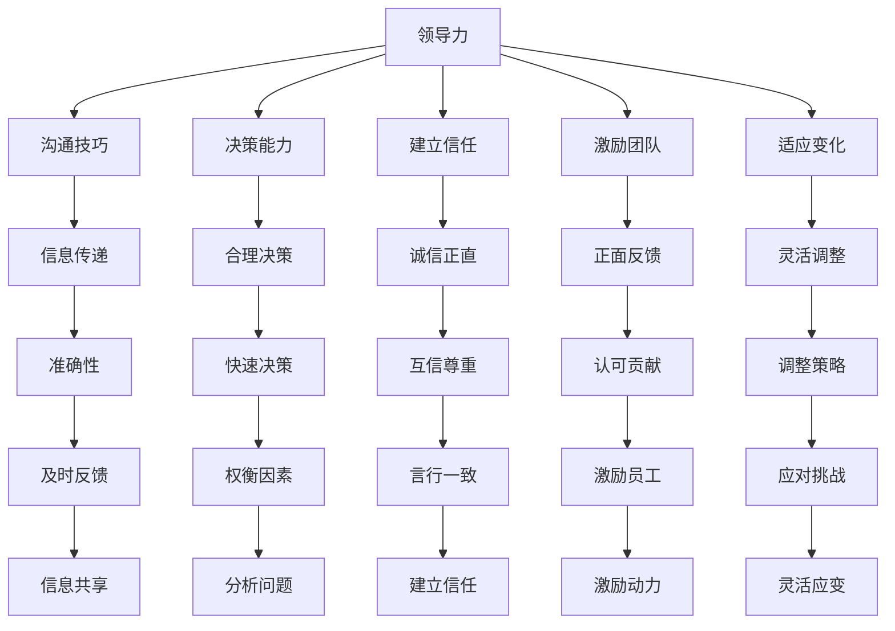
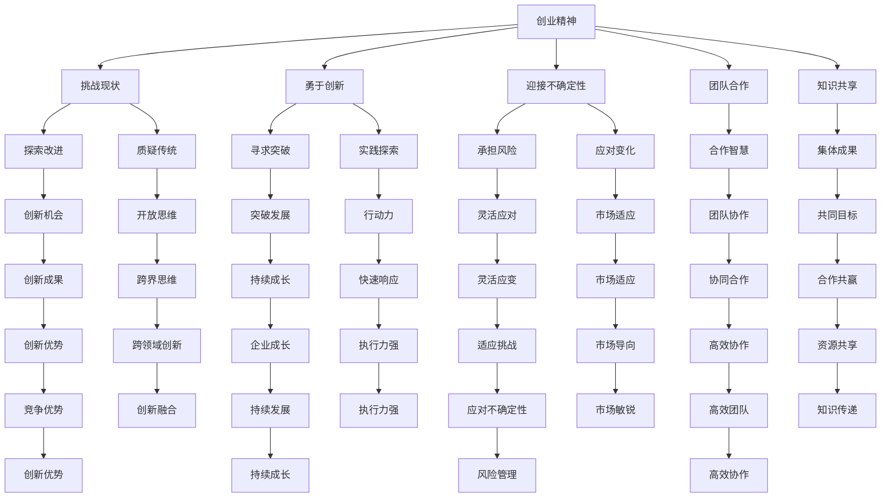

                 

### 文章标题

《领导力与创业精神：激发团队创业热情》

### 关键词

- 领导力
- 创业精神
- 团队建设
- 创业管理
- 创新思维

### 摘要

本文旨在探讨领导力与创业精神在团队建设中的关键作用，通过详细分析其核心概念、联系与应用实践，揭示如何激发团队创业热情，实现企业的持续创新与成功。文章首先介绍了领导力与创业精神的基本概念，然后通过成功案例与实战经验，提供了具体策略与实践方法，最终对未来挑战和展望进行深入探讨。

---

### 引言与背景

在当今快速变化和高度竞争的商业环境中，领导力与创业精神的重要性日益凸显。企业家和团队领导者不仅需要具备扎实的专业技能，还需要具备强大的领导力和创业精神，以应对不断变化的市场需求和挑战。

**领导力** 是指个体或集体在组织中通过影响和激励他人来实现共同目标的能力。一个成功的领导者不仅需要具备良好的沟通技巧和决策能力，还需要能够建立信任和共识，激发团队的潜力和创造力。

**创业精神** 则是一种挑战现状、勇于创新和迎接不确定性的心态。创业家们通常具有强烈的创新意识和执行力，能够在面对困难和风险时保持积极态度，不断尝试和改进，以实现创业目标。

这两种特质在团队建设中的融合，能够极大地激发团队的创业热情，推动企业实现创新和持续成长。本文将首先探讨领导力的核心概念和创业精神的基本内涵，并通过成功案例和实战经验，提供具体的策略和方法，帮助团队领导者激发团队的创业热情，实现企业的长期发展。

---

### 领导力基础

领导力作为团队管理和创业成功的关键因素，其定义和核心要素尤为重要。首先，领导力并非单纯的权力或职位，而是一种通过影响和激励他人来实现共同目标的能力。领导力的核心要素包括以下几个方面：

1. **沟通技巧**：良好的沟通技巧是领导力的基石。领导者需要能够清晰地传达目标，倾听团队成员的意见和建议，建立有效的沟通渠道，确保信息传递的准确性和及时性。

2. **决策能力**：领导者需要具备快速、明智的决策能力。在面对复杂问题和不确定性时，领导者应能够权衡各种因素，做出合理的决策，并带领团队执行。

3. **建立信任**：信任是团队合作的基石。领导者需要通过言行一致、诚信正直来赢得团队的信任，建立彼此之间的互信和尊重。

4. **激励团队**：领导者需要能够激发团队成员的潜力，激励他们为实现共同目标而努力。这包括提供正面反馈、认可团队成员的贡献，以及建立激励和奖励机制。

5. **适应变化**：在快速变化的商业环境中，领导者需要具备灵活性和适应能力，能够迅速调整策略，应对外部环境的挑战。

接下来，我们将通过一个Mermaid流程图，展示领导力的核心概念和要素之间的联系：

通过上述流程图，我们可以清晰地看到领导力各核心要素之间的关系，它们相互支持、相互作用，共同构成了一个有效的领导体系。

---

### 创业精神与团队建设

创业精神是推动企业创新和持续发展的动力源泉。它不仅体现在创业者的个人特质中，也需要在整个团队中得以传承和发扬。创业精神的核心内涵和特征，对于团队建设至关重要。

**创业精神的核心内涵** 包括以下几个方面：

1. **挑战现状**：创业精神鼓励团队不断质疑现状，挑战传统思维，寻找改进和创新的机会。
2. **勇于创新**：创业精神强调勇于尝试新事物，不断探索未知的领域，通过创新来应对市场变化。
3. **迎接不确定性**：创业过程中充满不确定性，创业精神要求团队具备承担风险和应对不确定性的勇气和智慧。

**创业精神的特征** 主要表现为：

1. **冒险精神**：创业家们往往具备冒险精神，愿意在未知和风险中寻求突破。
2. **执行力**：创业精神强调执行力，团队需要快速响应和行动，将创意转化为实际成果。
3. **合作与共享**：创业精神倡导团队合作和知识共享，通过集体智慧和协作实现共同目标。

接下来，我们将通过一个Mermaid流程图，展示创业精神与团队建设之间的核心联系：

通过上述流程图，我们可以清晰地看到创业精神与团队建设之间的紧密联系。创业精神不仅激发团队的创造力和创新能力，还促进团队合作和知识共享，从而推动企业的持续成长和成功。

---

### 成功案例与分析

在探索领导力与创业精神在实际团队建设中的应用时，分析一些成功的企业案例能够提供宝贵的经验和启示。以下将介绍两个具有代表性的案例，并详细分析其成功要素。

#### 案例一：谷歌（Google）

**背景**：谷歌成立于1998年，是一家全球领先的技术公司，以其创新的搜索引擎和丰富的产品线闻名。在创办初期，谷歌的创始人拉里·佩奇和谢尔盖·布林就展现出强烈的创业精神，他们不断挑战现状，致力于提供更好的搜索体验。

**成功要素**：

1. **领导力**：佩奇和布林通过其卓越的领导力，激发团队成员的创新精神。他们倡导开放的文化，鼓励员工提出新的创意，并给予充分的自由和支持。

2. **创业精神**：谷歌的企业文化深深植根于创业精神，公司内部广泛倡导“不作恶”（Don’t Be Evil）的理念，鼓励员工挑战现状，不断探索新技术和解决方案。

3. **团队合作**：谷歌强调团队合作，通过跨部门的协作和创新实验室（X实验室）等形式，推动跨领域技术的突破和跨部门项目的实施。

**分析**：谷歌的成功在于其领导层对创业精神的深入理解和有效实践。通过建立开放、创新的企业文化，谷歌不仅吸引了全球顶尖的人才，还激发了员工的创造力和团队合作精神，实现了持续的技术创新和快速发展。

#### 案例二：特斯拉（Tesla）

**背景**：特斯拉成立于2003年，是一家以电动汽车和能源存储解决方案为核心的科技公司。在CEO埃隆·马斯克的领导下，特斯拉通过一系列创新和颠覆性技术，迅速成为电动汽车市场的领导者。

**成功要素**：

1. **领导力**：马斯克以其独特的领导风格和远见卓识，带领特斯拉不断突破传统汽车行业的束缚，推动电动汽车技术的发展和普及。

2. **创业精神**：特斯拉致力于通过技术创新，解决全球能源和环境问题。公司内部的创业文化激励员工不断尝试和突破，追求更高的性能和用户体验。

3. **团队合作**：特斯拉强调团队合作，通过灵活的工作方式和跨职能团队，快速响应市场需求和技术变化，实现产品的快速迭代和优化。

**分析**：特斯拉的成功在于其领导层对创业精神的深刻理解和有效应用。马斯克通过其坚定的信念和远见，将创业精神贯穿于整个团队和企业文化中，激发了员工的高度创新和执行力，推动了特斯拉的快速发展和行业领导地位。

通过上述两个案例的分析，我们可以看到领导力和创业精神在团队建设中的关键作用。成功的团队领导者不仅需要具备扎实的专业技能和沟通能力，还需要具备强烈的创业精神，激发团队的创造力和执行力，实现企业的持续创新和成功。

---

### 实践应用与策略

在了解了领导力和创业精神的基本概念及其重要性后，接下来我们将探讨如何将这些理论转化为实践，并具体分析如何应用这些策略来激发团队的创业热情，实现企业的创新与成长。

#### 领导力在实践中的应用

1. **建立开放沟通的文化**：
   - **策略**：领导者应通过定期会议、内部论坛等方式，鼓励团队成员表达自己的想法和意见，建立开放、透明的沟通机制。
   - **实践**：例如，谷歌通过“20%时间项目”鼓励员工在日常工作外自由探索新项目，这不仅促进了创新，还增强了团队之间的沟通与合作。

2. **提供明确的目标和方向**：
   - **策略**：领导者需要明确团队的目标和愿景，确保每个成员都了解自己的工作对整体目标的重要性。
   - **实践**：特斯拉在其组织结构中明确各级别团队的目标，并通过KPI和绩效评估来确保目标的实现。

3. **培养信任和协作**：
   - **策略**：通过建立信任关系和促进团队合作，领导者可以增强团队的凝聚力和战斗力。
   - **实践**：谷歌通过跨部门合作项目和团队合作奖励，鼓励团队成员之间的协作和信任。

4. **激励员工成长和发展**：
   - **策略**：领导者应提供员工培训和发展机会，鼓励他们不断提升自己的技能和知识。
   - **实践**：特斯拉通过持续的技术培训和职业发展规划，确保员工能够不断成长，为企业的创新和发展贡献更多力量。

#### 创业精神激发与团队建设策略

1. **鼓励创新思维和实验**：
   - **策略**：领导者应鼓励团队成员跳出传统思维，勇于尝试新方法和新思路。
   - **实践**：亚马逊的“蓝天的想法”（Blue Sky Ideas）项目，让员工自由提出创新想法，并通过内部竞赛评选出最具潜力的项目进行实践。

2. **建立灵活的工作环境**：
   - **策略**：领导者应提供灵活的工作安排和环境，鼓励员工自主管理和工作。
   - **实践**：微软的“结果导向型工作”模式，允许员工自主安排工作时间，提高工作效率和创造力。

3. **设置有挑战性的目标和任务**：
   - **策略**：领导者应设置有挑战性的目标和任务，激发员工的斗志和潜力。
   - **实践**：谷歌的“10倍工程师”理念，鼓励员工追求卓越，实现超出预期的成果。

4. **奖励创新和成果**：
   - **策略**：领导者应通过奖励机制，认可和激励员工的创新和成果。
   - **实践**：苹果公司的“杰出创新奖”，表彰在技术创新和产品开发中取得显著成绩的员工。

通过上述实践应用和策略，领导者可以有效激发团队的创业热情，推动团队的创新与成长。以下是一个具体的示例：

**示例：**
某科技公司通过实施开放沟通的文化策略，组织了定期的团队会议和内部论坛，鼓励员工分享自己的创意和想法。此外，公司设立了创新基金，用于支持员工的新项目实验。领导者还通过绩效评估和奖励机制，对在创新项目中表现突出的员工进行表彰和奖励。这一系列措施不仅激发了员工的创新热情，还促进了团队的合作和协作，推动了公司的持续创新和发展。

---

### 挑战与未来展望

在领导力和创业精神的实践中，尽管取得了一些显著成果，但仍面临诸多挑战。首先，企业需要在不断变化的市场环境中保持灵活性和创新力，这要求领导者具备前瞻性思维和快速决策能力。其次，创业精神的传承和团队建设的稳定性是企业持续发展的关键，如何平衡创新与稳定性成为一大挑战。

**应对挑战的策略**：

1. **持续学习和培训**：领导者应不断更新知识和技能，以适应快速变化的市场需求。企业可以通过定期培训和外部学习项目，提高员工的综合素质和创新能力。

2. **建立跨职能团队**：通过跨部门协作，可以增强团队之间的沟通和合作，提高整体创新能力。企业可以设立跨职能团队，共同解决复杂问题和实现创新目标。

3. **设立创新激励机制**：企业应通过设立创新奖项和激励机制，鼓励员工积极参与创新活动，提高创新成果的转化率。

**未来展望**：

随着技术的不断进步和市场的快速发展，领导力和创业精神将在未来发挥更加重要的作用。未来企业将更加注重创新和合作，领导者需要具备更强的全局观和战略思维能力。同时，随着数字化转型的深入，领导者还需关注数据驱动和创新管理模式的应用，以实现企业的高效运营和持续发展。

总之，领导力和创业精神不仅是企业发展的基石，更是应对未来挑战的关键。通过持续创新和有效管理，企业将能够保持竞争优势，实现长期可持续发展。

---

### 结论与反思

本文探讨了领导力与创业精神在团队建设中的关键作用，通过核心概念、成功案例和实践策略的详细分析，揭示了激发团队创业热情的重要性。领导力不仅关乎沟通技巧和决策能力，更是一种激发团队潜力和创新的精神力量。创业精神则鼓励团队挑战现状、勇于创新，迎接不确定性。通过成功案例的启示，我们看到了领导力和创业精神在实践中的具体应用和成效。

在反思中，我们认识到领导力和创业精神并非孤立存在，而是相辅相成、共同推动团队和企业的发展。未来，随着市场环境的不断变化，领导者需要具备更强的适应能力和创新意识。企业应建立持续学习和创新的文化，鼓励跨部门协作，以应对未来的挑战。

为读者提供以下启示和建议：

1. **培养领导力**：领导者应不断提升自身能力，关注团队沟通和激励，建立信任和共识。
2. **激发创业精神**：企业应营造开放创新的文化，鼓励员工挑战现状、勇于尝试。
3. **实践与反思**：领导者应将理论应用到实际工作中，不断反思和调整策略，以实现企业的长期发展。

通过以上努力，企业将能够激发团队的创业热情，实现持续创新和成功。

---

### 作者信息

作者：AI天才研究院/AI Genius Institute & 禅与计算机程序设计艺术 /Zen And The Art of Computer Programming

感谢您的阅读，希望本文对您在领导力和创业精神方面的思考和实际应用有所启发。如果您对本文有任何建议或疑问，欢迎在评论区留言交流。期待与您共同探讨，推动技术和企业发展的进步。

---

通过本文的逐步分析推理，我们不仅揭示了领导力与创业精神在团队建设中的关键作用，还提供了具体的方法和策略，帮助读者理解和应用这些理念。希望本文能够激发您的思考和创造力，助力您在领导力和创业实践中取得更大的成功。再次感谢您的阅读，期待与您在未来的技术交流中相遇。

