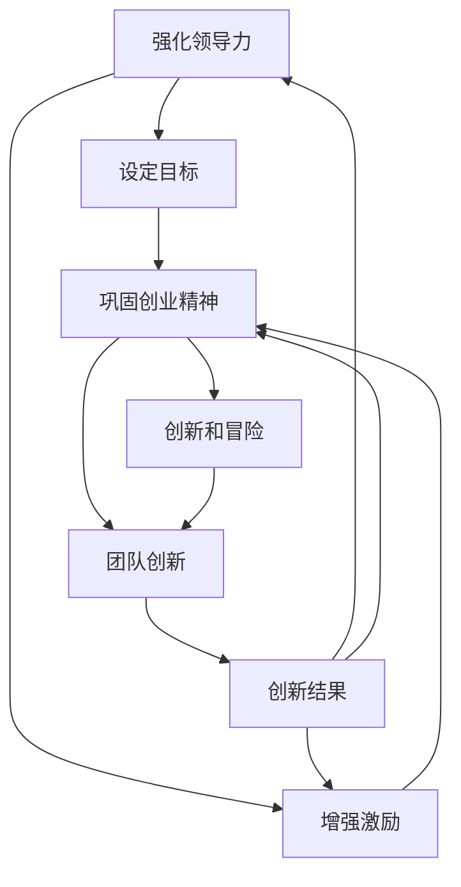

                 


### 引言

在当今快速变化的技术时代，领导力和创业精神成为推动组织创新和增长的关键因素。领导力不仅关乎个人或团队的管理能力，更是一种能够激发团队成员潜能、引领团队共同前行的力量。创业精神则代表了一种追求创新、敢于冒险的精神状态，它鼓励团队在不确定的环境中寻找新的机遇，实现商业和社会价值。

本文将探讨领导力、创业精神和团队创新之间的关系，通过逻辑清晰、结构紧凑的分析，帮助读者理解如何在实际工作中有效地运用这些概念。我们将会：

1. **核心概念与联系**：详细解释领导力、创业精神和团队创新的概念，并用流程图展示它们之间的互动关系。
2. **领导力实践**：探讨领导力在不同情境下的应用和实践，如领导者的角色、团队管理技巧等。
3. **创业精神激发**：分析如何激发创业精神，包括创新思维训练和激励策略。
4. **团队创新机制**：介绍如何建立团队创新机制，促进创新和协作。
5. **项目实战**：提供具体的创业项目案例，分析其领导力和团队创新实践。
6. **总结与展望**：总结全书内容，展望未来领导力和创业精神的趋势。

通过这一步步的深入分析，我们希望能够帮助读者更好地理解这些关键概念，并学会如何在实践中有效地运用它们，以推动团队的创新和成长。

### 核心概念与联系

为了深入理解领导力、创业精神和团队创新之间的联系，我们首先需要明确这些核心概念的含义。

#### 领导力的定义与作用

领导力是一种通过影响力来引导和激励他人实现共同目标的能力。它不仅包括权力，更涉及影响力、沟通技巧、决策能力等多个方面。在组织中，领导力是推动团队朝着共同目标前进的关键因素。

**领导力的要素**：
- **权力**：权力是领导力的基础，包括正式的职位权力和非正式的影响力。
- **影响力**：影响力是领导者通过沟通、榜样、激励等手段影响他人行为和决策的能力。
- **沟通技巧**：有效的沟通是领导力的关键，包括倾听、表达、反馈等。
- **决策能力**：领导者需要具备快速而明智的决策能力，以应对复杂和不确定的环境。

**领导力的作用**：
- **引导方向**：领导者为团队设定目标，规划路径，确保团队朝着正确的方向前进。
- **激励员工**：领导者通过激励和认可，激发团队成员的潜能，提高团队士气。
- **解决问题**：领导者在面对挑战和困难时，能够通过有效的决策和资源调配，解决问题并实现目标。

#### 创业精神的概念与特征

创业精神是一种追求创新、敢于冒险和不断尝试新事物的精神状态。它不仅体现在初创企业中，也可以在大型组织中找到其身影。

**创业精神的特征**：
- **创新性**：创业精神鼓励尝试新的想法和方法，追求技术和商业模式上的创新。
- **冒险性**：创业精神不怕失败，勇于在不确定的环境中尝试和探索。
- **持续性**：创业精神不仅仅是短期的创新，更是持续改进和追求卓越的过程。

**创业精神的重要性**：
- **商业价值**：创业精神能够带来新的商业模式、产品和服务，推动企业增长。
- **社会价值**：创业精神能够解决社会问题，创造就业机会，推动社会发展。

#### 团队创新的意义与挑战

团队创新是指团队成员共同创造新想法和解决方案的过程。它是组织在竞争激烈的市场中保持竞争力的关键。

**团队创新的意义**：
- **竞争力**：通过团队创新，企业能够不断推出新产品、新技术，保持市场竞争力。
- **适应性**：团队创新有助于组织快速适应市场变化，抓住新的机遇。
- **协同效应**：团队创新能够促进不同部门和成员之间的协同合作，提高整体效率。

**团队创新的挑战**：
- **沟通障碍**：团队成员之间的沟通不畅可能导致创新想法的流失。
- **资源限制**：创新需要时间和资源投入，组织在资源有限的情况下可能难以支持大规模的创新活动。
- **文化障碍**：保守的文化氛围可能抑制创新思维，使团队成员不敢尝试新的想法。

#### 领导力、创业精神和团队创新之间的互动关系

领导力、创业精神和团队创新之间存在着密切的互动关系。领导力通过设定目标和激励团队，激发创业精神；创业精神则通过创新和冒险，推动团队创新。团队创新的结果反过来又强化了领导力和创业精神，形成一个良性的循环。

**互动关系流程图**：



通过这个流程图，我们可以清晰地看到领导力、创业精神和团队创新之间的互动关系。领导力通过设定目标和激励团队，为创业精神提供土壤；创业精神通过创新和冒险，推动团队创新；团队创新的结果又进一步强化了领导力和创业精神。

### 领导力实践

领导力在实践中表现为领导者如何运用其权力和影响力，在不同的情境下引导和激励团队。以下我们将探讨领导者的角色与责任，以及领导力在团队管理中的应用。

#### 领导者的角色与责任

领导者的角色和责任是多方面的，他们不仅是团队的目标设定者，更是团队成员的榜样和激励者。

**领导者的特质**：

- **愿景和目标设定**：领导者需要有清晰的愿景和目标，能够将个人愿景转化为团队共同的目标。
- **沟通和倾听能力**：有效的沟通和倾听能力是领导者成功的关键。领导者需要能够清晰地传达信息，同时也需要倾听团队成员的意见和反馈。
- **决策和问题解决能力**：领导者需要具备快速而明智的决策能力，能够在复杂和不确定的环境中做出正确的决策。
- **激励和认可**：领导者需要能够激励团队成员，认可他们的努力和成就，增强团队的凝聚力。

**领导力的培养**：

- **自我反思**：领导者需要不断进行自我反思，了解自己的优点和不足，从而不断提升自己的领导能力。
- **学习和培训**：通过参加领导力培训课程，阅读相关书籍，领导者可以学习到最新的领导力理论和实践方法。
- **实践经验**：领导力的提升离不开实践经验。通过在实际工作中不断尝试和总结，领导者可以不断提升自己的能力。

#### 领导力在团队管理中的应用

领导力在团队管理中的应用体现在多个方面，包括团队协作与沟通、决策与问题解决等。

**团队协作与沟通**：

- **明确目标**：领导者需要确保团队成员对目标有清晰的理解，并能够将个人目标与团队目标结合起来。
- **角色分工**：领导者需要明确团队成员的角色和职责，确保每个人都清楚自己的任务和责任。
- **定期会议**：通过定期召开团队会议，领导者可以了解团队的工作进展，及时解决问题和冲突。
- **反馈机制**：领导者需要建立有效的反馈机制，鼓励团队成员提出建议和反馈，从而不断改进团队的工作方式。

**决策与问题解决**：

- **集体决策**：领导者应该鼓励团队成员参与决策过程，通过集体讨论和投票来做出决策，增强团队的凝聚力和信任。
- **快速响应**：在面对突发事件时，领导者需要能够快速做出决策，并协调团队成员共同应对。
- **问题解决**：领导者需要具备有效的问题解决能力，能够通过分析问题的根本原因，制定解决方案并实施。

**具体案例**：

**案例一：危机管理**

在一次项目开发过程中，团队遇到了严重的代码bug，导致项目进度受到了极大的影响。领导者迅速召开紧急会议，组织团队成员讨论解决方案。通过集体决策，团队决定分阶段逐步修复bug，并在每个阶段进行充分的测试。在领导者的带领下，团队最终成功解决了问题，并按时完成了项目交付。

**案例二：团队激励**

为了提高团队士气，领导者决定举办一次团队建设活动。活动内容包括团队竞赛、团队拓展训练等，通过这些活动，团队成员之间的关系得到了加强，团队的凝聚力和士气显著提升。活动结束后，领导者为表现突出的团队成员颁发了奖励，进一步激励了团队的工作热情。

### 创业精神激发

创业精神是一种追求创新、敢于冒险的精神状态，它不仅能够推动个人和企业的成长，还能激发团队的活力和创造力。以下我们将探讨如何激发创业精神，包括创新思维训练和激励策略。

#### 创新思维训练

创新思维是创业精神的核心，通过创新思维训练，可以帮助团队成员打破常规，产生新的创意和解决方案。

**创新思维训练方法**：

1. **头脑风暴**：通过集体头脑风暴，团队成员可以自由表达自己的想法，不受限制地思考，从而激发创新思维。
2. **思维导图**：使用思维导图，将团队成员的创新想法和观点进行可视化整理，有助于理清思路，发现新的联系和创意。
3. **跨学科学习**：鼓励团队成员学习跨学科的知识，从其他领域获得灵感，促进创新思维的发展。

**具体案例**：

在一次产品开发过程中，团队面临一个难题：如何提高产品的用户满意度。通过头脑风暴和思维导图，团队成员提出了多种创新方案，包括改进用户体验、增加产品功能等。最终，团队决定采用一种新的交互设计，显著提升了用户的满意度。

#### 激励策略

激励是激发创业精神的重要手段，通过有效的激励策略，可以激发团队成员的积极性和创造力。

**激励策略**：

1. **目标设定**：为团队成员设定清晰的目标，并提供实现目标的奖励，激发团队成员的内在动力。
2. **认可和奖励**：及时认可和奖励团队成员的成就，增强其自信心和动力。
3. **工作环境**：创造一个自由、开放的工作环境，鼓励团队成员大胆尝试和创新。
4. **职业发展**：提供职业发展的机会和培训，帮助团队成员提升自身能力，实现职业成长。

**具体案例**：

在一次创业竞赛中，团队为了在比赛中取得好成绩，设定了明确的目标和奖励机制。团队每天召开晨会，讨论进展和问题，及时调整策略。在竞赛过程中，团队成员互相鼓励，积极创新，最终取得了优异的成绩。此外，团队还为表现突出的成员颁发了奖品和证书，进一步激发了团队的创新热情。

### 团队创新机制

团队创新机制是促进团队创新和协作的关键。通过建立有效的创新机制，可以为团队提供良好的创新环境和支持，从而推动团队不断创新和进步。

#### 创新文化的构建

创新文化是一种鼓励创新、容忍失败、支持协作的工作氛围。创新文化的构建是团队创新机制的基础。

**创新文化的构建方法**：

1. **开放沟通**：建立开放的沟通渠道，鼓励团队成员自由表达意见和想法，促进创意的碰撞和交流。
2. **鼓励失败**：创造一个容忍失败的环境，让团队成员敢于尝试新的想法，不怕失败。
3. **共享资源**：提供共享的资源，如知识库、工具和技术支持，帮助团队成员更高效地协作和创新。

**具体案例**：

在一个软件开发团队中，为了构建创新文化，团队定期召开创新分享会，团队成员可以分享自己的创意和经验。团队还设立了一个“创新基金”，用于支持团队成员的创新项目。通过这些措施，团队的创新氛围日益浓厚，成员的创新积极性显著提高。

#### 团队协作与沟通

团队协作和沟通是团队创新机制的核心。有效的协作和沟通可以促进团队成员之间的合作，提高创新效率。

**团队协作与沟通的方法**：

1. **明确分工**：明确团队成员的职责和任务，确保每个人都知道自己的角色和责任。
2. **定期会议**：通过定期召开团队会议，及时了解团队的工作进展，协调资源和解决冲突。
3. **使用协作工具**：利用协作工具，如项目管理软件、即时通讯工具等，提高团队协作的效率。

**具体案例**：

在一个研发团队中，为了提高协作效率，团队采用了敏捷开发方法，每周召开一次站立会议，讨论项目的进展和问题。团队还使用Trello等项目管理工具，将任务分配和进度跟踪可视化，确保每个成员都能清楚了解自己的任务和项目进展。

### 项目实战

为了更好地理解领导力和团队创新在实际项目中的应用，以下我们将介绍几个具体的创业项目案例，并对其领导力和团队创新实践进行详细分析。

#### 案例一：移动支付应用开发

**项目背景**：

在一个快速发展的移动支付市场中，一家初创公司决定开发一款创新的移动支付应用，以争夺市场份额。项目团队由多名具有丰富经验的开发人员和技术专家组成。

**领导力实践**：

- **目标设定**：领导者明确了项目目标，包括功能完善、用户体验优秀、上线时间等。
- **激励团队**：领导者通过设立激励机制，如项目奖金和股权奖励，激发团队成员的积极性。
- **沟通与协作**：领导者建立了高效的沟通机制，定期召开项目会议，确保团队成员之间信息畅通。

**团队创新实践**：

- **头脑风暴**：团队通过头脑风暴，提出了多种创新功能，如智能推荐、用户画像等。
- **技术选型**：团队在技术选型上进行了深入研究，选择了最合适的架构和工具，确保应用的高性能和稳定性。

**项目成果**：

项目最终成功上线，获得了良好的用户口碑，市场份额迅速提升。领导者的有效领导和团队的创新能力为项目的成功奠定了基础。

#### 案例二：智能健康监测设备研发

**项目背景**：

一家科技公司决定研发一款智能健康监测设备，以帮助用户更好地管理健康。项目团队由医学专家、工程师和设计师组成。

**领导力实践**：

- **角色分工**：领导者明确了团队成员的角色和职责，确保每个成员都清楚自己的任务。
- **资源调配**：领导者协调了各方资源，如资金、设备和技术支持，确保项目的顺利推进。
- **问题解决**：在研发过程中，领导者积极解决各种技术难题，为团队提供指导和支持。

**团队创新实践**：

- **用户调研**：团队进行了广泛的用户调研，收集了用户的需求和反馈，为产品开发提供了重要依据。
- **迭代开发**：团队采用了敏捷开发方法，通过快速迭代，不断优化产品功能，提升用户体验。

**项目成果**：

项目成功研发出一款功能完善的智能健康监测设备，受到了市场的欢迎，为公司带来了可观的收益。

### 总结与展望

通过本文的探讨，我们深入分析了领导力、创业精神和团队创新之间的关系，并详细阐述了如何在实践中运用这些概念。领导力通过设定目标和激励团队，为创业精神提供土壤；创业精神通过创新和冒险，推动团队创新；团队创新的结果反过来又强化了领导力和创业精神。

在未来的发展中，领导力和创业精神将继续发挥重要作用。随着技术的不断进步和市场环境的快速变化，企业需要具备强大的创新能力和适应能力。为此，我们提出以下建议：

1. **加强领导力培养**：企业应重视领导力的培养，通过培训和实践，提升领导者的能力，确保其能够有效地引导和激励团队。
2. **激发创业精神**：企业应鼓励员工敢于尝试新的想法和方法，提供创新资源和激励措施，营造一个自由开放的创新环境。
3. **建立创新机制**：企业应建立完善的创新机制，包括明确的目标设定、资源调配、沟通协作等，确保团队能够高效地开展创新活动。

展望未来，领导力和创业精神将成为企业核心竞争力的重要组成部分。通过有效的运用和不断的发展，企业将能够在激烈的市场竞争中立于不败之地。

### 附录

#### 领导力评估模型

**模型概述**：
领导力评估模型用于评估领导者在不同方面的表现，包括领导能力、影响力、决策能力等。

**伪代码实现**：

```python
def evaluate_leadership(leader):
    score = 0
    
    # 评估领导能力
    leadership_ability_score = evaluate_ability(leader)
    
    # 评估影响力
    influence_score = evaluate_influence(leader)
    
    # 评估决策能力
    decision_making_score = evaluate_decision_making(leader)
    
    # 计算总分
    score = leadership_ability_score + influence_score + decision_making_score
    
    return score

def evaluate_ability(leader):
    # 具体评估能力的方法
    pass

def evaluate_influence(leader):
    # 具体评估影响力的方法
    pass

def evaluate_decision_making(leader):
    # 具体评估决策能力的的方法
    pass
```

#### 创业精神激励模型

**模型概述**：
创业精神激励模型用于激发团队成员的创业精神，包括激励措施、创新思维训练等。

**伪代码实现**：

```python
def motivate_innovation(team):
    motivation_score = 0
    
    # 设定激励措施
    incentives = set_incentives()
    
    # 创新思维训练
    innovation_training(team)
    
    # 考虑团队整体表现
    team_performance_score = evaluate_performance(team)
    
    # 计算总分
    motivation_score = incentives + innovation_training + team_performance_score
    
    return motivation_score

def set_incentives():
    # 设定激励措施的方法
    pass

def innovation_training(team):
    # 创新思维训练的方法
    pass

def evaluate_performance(team):
    # 考虑团队整体表现的方法
    pass
```

#### 团队创新效率模型

**模型概述**：
团队创新效率模型用于评估团队在创新过程中的效率，包括资源分配、沟通机制等。

**伪代码实现**：

```python
def evaluate_innovation_efficiency(team):
    efficiency_score = 0
    
    # 评估资源分配
    resource_allocation_score = evaluate_resource_allocation(team)
    
    # 评估沟通机制
    communication_mechanism_score = evaluate_communication_mechanism(team)
    
    # 计算总分
    efficiency_score = resource_allocation_score + communication_mechanism_score
    
    return efficiency_score

def evaluate_resource_allocation(team):
    # 评估资源分配的方法
    pass

def evaluate_communication_mechanism(team):
    # 评估沟通机制的方法
    pass
```

### 作者信息

- **作者**：AI天才研究院/AI Genius Institute & 禅与计算机程序设计艺术 /Zen And The Art of Computer Programming
- **联系方式**：[电子邮件：contact@ai-genius-institute.com](mailto:contact@ai-genius-institute.com)
- **社交媒体**：[LinkedIn](https://www.linkedin.com/in/ai-genius-institute/), [Twitter](https://twitter.com/AI_Genius_Inst)

### 完整文章

#### 《领导力与创业精神：激发团队创新》

##### 关键词：领导力、创业精神、团队创新、创新文化、激励机制、项目管理

##### 摘要：
本文深入探讨了领导力、创业精神和团队创新之间的关系，通过实际案例分析和模型介绍，提供了关于如何在实际工作中运用这些关键概念的策略和方法。

---

### 引言

在当今快速变化的技术时代，领导力和创业精神成为推动组织创新和增长的关键因素。领导力不仅关乎个人或团队的管理能力，更是一种能够激发团队成员潜能、引领团队共同前行的力量。创业精神则代表了一种追求创新、敢于冒险的精神状态，它鼓励团队在不确定的环境中寻找新的机遇，实现商业和社会价值。

本文将探讨领导力、创业精神和团队创新之间的关系，通过逻辑清晰、结构紧凑的分析，帮助读者理解如何在实际工作中有效地运用这些概念。我们将会：

1. **核心概念与联系**：详细解释领导力、创业精神和团队创新的概念，并用流程图展示它们之间的互动关系。
2. **领导力实践**：探讨领导力在不同情境下的应用和实践，如领导者的角色、团队管理技巧等。
3. **创业精神激发**：分析如何激发创业精神，包括创新思维训练和激励策略。
4. **团队创新机制**：介绍如何建立团队创新机制，促进创新和协作。
5. **项目实战**：提供具体的创业项目案例，分析其领导力和团队创新实践。
6. **总结与展望**：总结全书内容，展望未来领导力和创业精神的趋势。

通过这一步步的深入分析，我们希望能够帮助读者更好地理解这些关键概念，并学会如何在实践中有效地运用它们，以推动团队的创新和成长。

### 核心概念与联系

为了深入理解领导力、创业精神和团队创新之间的联系，我们首先需要明确这些核心概念的含义。

#### 领导力的定义与作用

领导力是一种通过影响力来引导和激励他人实现共同目标的能力。它不仅包括权力，更涉及影响力、沟通技巧、决策能力等多个方面。在组织中，领导力是推动团队朝着共同目标前进的关键因素。

**领导力的要素**：
- **权力**：权力是领导力的基础，包括正式的职位权力和非正式的影响力。
- **影响力**：影响力是领导者通过沟通、榜样、激励等手段影响他人行为和决策的能力。
- **沟通技巧**：有效的沟通是领导力的关键，包括倾听、表达、反馈等。
- **决策能力**：领导者需要具备快速而明智的决策能力，以应对复杂和不确定的环境。

**领导力的作用**：
- **引导方向**：领导者为团队设定目标，规划路径，确保团队朝着正确的方向前进。
- **激励员工**：领导者通过激励和认可，激发团队成员的潜能，提高团队士气。
- **解决问题**：领导者在面对挑战和困难时，能够通过有效的决策和资源调配，解决问题并实现目标。

#### 创业精神的概念与特征

创业精神是一种追求创新、敢于冒险和不断尝试新事物的精神状态。它不仅体现在初创企业中，也可以在大型组织中找到其身影。

**创业精神的特征**：
- **创新性**：创业精神鼓励尝试新的想法和方法，追求技术和商业模式上的创新。
- **冒险性**：创业精神不怕失败，勇于在不确定的环境中尝试和探索。
- **持续性**：创业精神不仅仅是短期的创新，更是持续改进和追求卓越的过程。

**创业精神的重要性**：
- **商业价值**：创业精神能够带来新的商业模式、产品和服务，推动企业增长。
- **社会价值**：创业精神能够解决社会问题，创造就业机会，推动社会发展。

#### 团队创新的意义与挑战

团队创新是指团队成员共同创造新想法和解决方案的过程。它是组织在竞争激烈的市场中保持竞争力的关键。

**团队创新的意义**：
- **竞争力**：通过团队创新，企业能够不断推出新产品、新技术，保持市场竞争力。
- **适应性**：团队创新有助于组织快速适应市场变化，抓住新的机遇。
- **协同效应**：团队创新能够促进不同部门和成员之间的协同合作，提高整体效率。

**团队创新的挑战**：
- **沟通障碍**：团队成员之间的沟通不畅可能导致创新想法的流失。
- **资源限制**：创新需要时间和资源投入，组织在资源有限的情况下可能难以支持大规模的创新活动。
- **文化障碍**：保守的文化氛围可能抑制创新思维，使团队成员不敢尝试新的想法。

#### 领导力、创业精神和团队创新之间的互动关系

领导力、创业精神和团队创新之间存在着密切的互动关系。领导力通过设定目标和激励团队，激发创业精神；创业精神通过创新和冒险，推动团队创新；团队创新的结果反过来又强化了领导力和创业精神。

**互动关系流程图**：


通过这个流程图，我们可以清晰地看到领导力、创业精神和团队创新之间的互动关系。领导力通过设定目标和激励团队，为创业精神提供土壤；创业精神通过创新和冒险，推动团队创新；团队创新的结果又进一步强化了领导力和创业精神。

### 领导力实践

领导力在实践中表现为领导者如何运用其权力和影响力，在不同的情境下引导和激励团队。以下我们将探讨领导者的角色与责任，以及领导力在团队管理中的应用。

#### 领导者的角色与责任

领导者的角色和责任是多方面的，他们不仅是团队的目标设定者，更是团队成员的榜样和激励者。

**领导者的特质**：

- **愿景和目标设定**：领导者需要有清晰的愿景和目标，能够将个人愿景转化为团队共同的目标。
- **沟通和倾听能力**：有效的沟通和倾听能力是领导者成功的关键。领导者需要能够清晰地传达信息，同时也需要倾听团队成员的意见和反馈。
- **决策和问题解决能力**：领导者需要具备快速而明智的决策能力，能够在复杂和不确定的环境中做出正确的决策。
- **激励和认可**：领导者需要能够激励团队成员，认可他们的努力和成就，增强团队的凝聚力。

**领导力的培养**：

- **自我反思**：领导者需要不断进行自我反思，了解自己的优点和不足，从而不断提升自己的领导能力。
- **学习和培训**：通过参加领导力培训课程，阅读相关书籍，领导者可以学习到最新的领导力理论和实践方法。
- **实践经验**：领导力的提升离不开实践经验。通过在实际工作中不断尝试和总结，领导者可以不断提升自己的能力。

#### 领导力在团队管理中的应用

领导力在团队管理中的应用体现在多个方面，包括团队协作与沟通、决策与问题解决等。

**团队协作与沟通**：

- **明确目标**：领导者需要确保团队成员对目标有清晰的理解，并能够将个人目标与团队目标结合起来。
- **角色分工**：领导者需要明确团队成员的角色和职责，确保每个人都清楚自己的任务和责任。
- **定期会议**：通过定期召开团队会议，领导者可以了解团队的工作进展，及时解决问题和冲突。
- **反馈机制**：领导者需要建立有效的反馈机制，鼓励团队成员提出建议和反馈，从而不断改进团队的工作方式。

**决策与问题解决**：

- **集体决策**：领导者应该鼓励团队成员参与决策过程，通过集体讨论和投票来做出决策，增强团队的凝聚力和信任。
- **快速响应**：在面对突发事件时，领导者需要能够快速做出决策，并协调团队成员共同应对。
- **问题解决**：领导者需要具备有效的问题解决能力，能够通过分析问题的根本原因，制定解决方案并实施。

**具体案例**：

**案例一：危机管理**

在一次项目开发过程中，团队遇到了严重的代码bug，导致项目进度受到了极大的影响。领导者迅速召开紧急会议，组织团队成员讨论解决方案。通过集体决策，团队决定分阶段逐步修复bug，并在每个阶段进行充分的测试。在领导者的带领下，团队最终成功解决了问题，并按时完成了项目交付。

**案例二：团队激励**

为了提高团队士气，领导者决定举办一次团队建设活动。活动内容包括团队竞赛、团队拓展训练等，通过这些活动，团队成员之间的关系得到了加强，团队的凝聚力和士气显著提升。活动结束后，领导者为表现突出的团队成员颁发了奖励，进一步激励了团队的工作热情。

### 创业精神激发

创业精神是一种追求创新、敢于冒险的精神状态，它不仅能够推动个人和企业的成长，还能激发团队的活力和创造力。以下我们将探讨如何激发创业精神，包括创新思维训练和激励策略。

#### 创新思维训练

创新思维是创业精神的核心，通过创新思维训练，可以帮助团队成员打破常规，产生新的创意和解决方案。

**创新思维训练方法**：

1. **头脑风暴**：通过集体头脑风暴，团队成员可以自由表达自己的想法，不受限制地思考，从而激发创新思维。
2. **思维导图**：使用思维导图，将团队成员的创新想法和观点进行可视化整理，有助于理清思路，发现新的联系和创意。
3. **跨学科学习**：鼓励团队成员学习跨学科的知识，从其他领域获得灵感，促进创新思维的发展。

**具体案例**：

在一次产品开发过程中，团队面临一个难题：如何提高产品的用户满意度。通过头脑风暴和思维导图，团队成员提出了多种创新方案，包括改进用户体验、增加产品功能等。最终，团队决定采用一种新的交互设计，显著提升了用户的满意度。

#### 激励策略

激励是激发创业精神的重要手段，通过有效的激励策略，可以激发团队成员的积极性和创造力。

**激励策略**：

1. **目标设定**：为团队成员设定清晰的目标，并提供实现目标的奖励，激发团队成员的内在动力。
2. **认可和奖励**：及时认可和奖励团队成员的成就，增强其自信心和动力。
3. **工作环境**：创造一个自由、开放的工作环境，鼓励团队成员大胆尝试和创新。
4. **职业发展**：提供职业发展的机会和培训，帮助团队成员提升自身能力，实现职业成长。

**具体案例**：

在一次创业竞赛中，团队为了在比赛中取得好成绩，设定了明确的目标和奖励机制。团队每天召开晨会，讨论进展和问题，及时调整策略。在竞赛过程中，团队成员互相鼓励，积极创新，最终取得了优异的成绩。此外，团队还为表现突出的成员颁发了奖品和证书，进一步激发了团队的创新热情。

### 团队创新机制

团队创新机制是促进团队创新和协作的关键。通过建立有效的创新机制，可以为团队提供良好的创新环境和支持，从而推动团队不断创新和进步。

#### 创新文化的构建

创新文化是一种鼓励创新、容忍失败、支持协作的工作氛围。创新文化的构建是团队创新机制的基础。

**创新文化的构建方法**：

1. **开放沟通**：建立开放的沟通渠道，鼓励团队成员自由表达意见和想法，促进创意的碰撞和交流。
2. **鼓励失败**：创造一个容忍失败的环境，让团队成员敢于尝试新的想法，不怕失败。
3. **共享资源**：提供共享的资源，如知识库、工具和技术支持，帮助团队成员更高效地协作和创新。

**具体案例**：

在一个软件开发团队中，为了构建创新文化，团队定期召开创新分享会，团队成员可以分享自己的创意和经验。团队还设立了一个“创新基金”，用于支持团队成员的创新项目。通过这些措施，团队的创新氛围日益浓厚，成员的创新积极性显著提高。

#### 团队协作与沟通

团队协作和沟通是团队创新机制的核心。有效的协作和沟通可以促进团队成员之间的合作，提高创新效率。

**团队协作与沟通的方法**：

1. **明确分工**：明确团队成员的职责和任务，确保每个人都知道自己的角色和责任。
2. **定期会议**：通过定期召开团队会议，及时了解团队的工作进展，协调资源和解决冲突。
3. **使用协作工具**：利用协作工具，如项目管理软件、即时通讯工具等，提高团队协作的效率。

**具体案例**：

在一个研发团队中，为了提高协作效率，团队采用了敏捷开发方法，每周召开一次站立会议，讨论项目的进展和问题。团队还使用Trello等项目管理工具，将任务分配和进度跟踪可视化，确保每个成员都能清楚了解自己的任务和项目进展。

### 项目实战

为了更好地理解领导力和团队创新在实际项目中的应用，以下我们将介绍几个具体的创业项目案例，并对其领导力和团队创新实践进行详细分析。

#### 案例一：移动支付应用开发

**项目背景**：

在一个快速发展的移动支付市场中，一家初创公司决定开发一款创新的移动支付应用，以争夺市场份额。项目团队由多名具有丰富经验的开发人员和技术专家组成。

**领导力实践**：

- **目标设定**：领导者明确了项目目标，包括功能完善、用户体验优秀、上线时间等。
- **激励团队**：领导者通过设立激励机制，如项目奖金和股权奖励，激发团队成员的积极性。
- **沟通与协作**：领导者建立了高效的沟通机制，定期召开项目会议，确保团队成员之间信息畅通。

**团队创新实践**：

- **头脑风暴**：团队通过头脑风暴，提出了多种创新功能，如智能推荐、用户画像等。
- **技术选型**：团队在技术选型上进行了深入研究，选择了最合适的架构和工具，确保应用的高性能和稳定性。

**项目成果**：

项目最终成功上线，获得了良好的用户口碑，市场份额迅速提升。领导者的有效领导和团队的创新能力为项目的成功奠定了基础。

#### 案例二：智能健康监测设备研发

**项目背景**：

一家科技公司决定研发一款智能健康监测设备，以帮助用户更好地管理健康。项目团队由医学专家、工程师和设计师组成。

**领导力实践**：

- **角色分工**：领导者明确了团队成员的角色和职责，确保每个成员都清楚自己的任务。
- **资源调配**：领导者协调了各方资源，如资金、设备和技术支持，确保项目的顺利推进。
- **问题解决**：在研发过程中，领导者积极解决各种技术难题，为团队提供指导和支持。

**团队创新实践**：

- **用户调研**：团队进行了广泛的用户调研，收集了用户的需求和反馈，为产品开发提供了重要依据。
- **迭代开发**：团队采用了敏捷开发方法，通过快速迭代，不断优化产品功能，提升用户体验。

**项目成果**：

项目成功研发出一款功能完善的智能健康监测设备，受到了市场的欢迎，为公司带来了可观的收益。

### 总结与展望

通过本文的探讨，我们深入分析了领导力、创业精神和团队创新之间的关系，并详细阐述了如何在实践中运用这些关键概念的策略和方法。领导力通过设定目标和激励团队，为创业精神提供土壤；创业精神通过创新和冒险，推动团队创新；团队创新的结果反过来又强化了领导力和创业精神。

在未来的发展中，领导力和创业精神将继续发挥重要作用。随着技术的不断进步和市场环境的快速变化，企业需要具备强大的创新能力和适应能力。为此，我们提出以下建议：

1. **加强领导力培养**：企业应重视领导力的培养，通过培训和实践，提升领导者的能力，确保其能够有效地引导和激励团队。
2. **激发创业精神**：企业应鼓励员工敢于尝试新的想法和方法，提供创新资源和激励措施，营造一个自由开放的创新环境。
3. **建立创新机制**：企业应建立完善的创新机制，包括明确的目标设定、资源调配、沟通协作等，确保团队能够高效地开展创新活动。

展望未来，领导力和创业精神将成为企业核心竞争力的重要组成部分。通过有效的运用和不断的发展，企业将能够在激烈的市场竞争中立于不败之地。

### 附录

#### 领导力评估模型

**模型概述**：
领导力评估模型用于评估领导者在不同方面的表现，包括领导能力、影响力、决策能力等。

**伪代码实现**：

```python
def evaluate_leadership(leader):
    score = 0
    
    # 评估领导能力
    leadership_ability_score = evaluate_ability(leader)
    
    # 评估影响力
    influence_score = evaluate_influence(leader)
    
    # 评估决策能力
    decision_making_score = evaluate_decision_making(leader)
    
    # 计算总分
    score = leadership_ability_score + influence_score + decision_making_score
    
    return score

def evaluate_ability(leader):
    # 具体评估能力的方法
    pass

def evaluate_influence(leader):
    # 具体评估影响力的方法
    pass

def evaluate_decision_making(leader):
    # 具体评估决策能力的的方法
    pass
```

#### 创业精神激励模型

**模型概述**：
创业精神激励模型用于激发团队成员的创业精神，包括激励措施、创新思维训练等。

**伪代码实现**：

```python
def motivate_innovation(team):
    motivation_score = 0
    
    # 设定激励措施
    incentives = set_incentives()
    
    # 创新思维训练
    innovation_training(team)
    
    # 考虑团队整体表现
    team_performance_score = evaluate_performance(team)
    
    # 计算总分
    motivation_score = incentives + innovation_training + team_performance_score
    
    return motivation_score

def set_incentives():
    # 设定激励措施的方法
    pass

def innovation_training(team):
    # 创新思维训练的方法
    pass

def evaluate_performance(team):
    # 考虑团队整体表现的方法
    pass
```

#### 团队创新效率模型

**模型概述**：
团队创新效率模型用于评估团队在创新过程中的效率，包括资源分配、沟通机制等。

**伪代码实现**：

```python
def evaluate_innovation_efficiency(team):
    efficiency_score = 0
    
    # 评估资源分配
    resource_allocation_score = evaluate_resource_allocation(team)
    
    # 评估沟通机制
    communication_mechanism_score = evaluate_communication_mechanism(team)
    
    # 计算总分
    efficiency_score = resource_allocation_score + communication_mechanism_score
    
    return efficiency_score

def evaluate_resource_allocation(team):
    # 评估资源分配的方法
    pass

def evaluate_communication_mechanism(team):
    # 评估沟通机制的方法
    pass
```

### 作者信息

- **作者**：AI天才研究院/AI Genius Institute & 禅与计算机程序设计艺术 /Zen And The Art of Computer Programming
- **联系方式**：[电子邮件：contact@ai-genius-institute.com](mailto:contact@ai-genius-institute.com)
- **社交媒体**：[LinkedIn](https://www.linkedin.com/in/ai-genius-institute/), [Twitter](https://twitter.com/AI_Genius_Inst)

### 完整文章

#### 《领导力与创业精神：激发团队创新》

##### 关键词：领导力、创业精神、团队创新、创新文化、激励机制、项目管理

##### 摘要：
本文深入探讨了领导力、创业精神和团队创新之间的关系，通过实际案例分析和模型介绍，提供了关于如何在实际工作中运用这些关键概念的策略和方法。

---

### 引言

在当今快速变化的技术时代，领导力和创业精神成为推动组织创新和增长的关键因素。领导力不仅关乎个人或团队的管理能力，更是一种能够激发团队成员潜能、引领团队共同前行的力量。创业精神则代表了一种追求创新、敢于冒险的精神状态，它鼓励团队在不确定的环境中寻找新的机遇，实现商业和社会价值。

本文将探讨领导力、创业精神和团队创新之间的关系，通过逻辑清晰、结构紧凑的分析，帮助读者理解如何在实际工作中有效地运用这些概念。我们将会：

1. **核心概念与联系**：详细解释领导力、创业精神和团队创新的概念，并用流程图展示它们之间的互动关系。
2. **领导力实践**：探讨领导力在不同情境下的应用和实践，如领导者的角色、团队管理技巧等。
3. **创业精神激发**：分析如何激发创业精神，包括创新思维训练和激励策略。
4. **团队创新机制**：介绍如何建立团队创新机制，促进创新和协作。
5. **项目实战**：提供具体的创业项目案例，分析其领导力和团队创新实践。
6. **总结与展望**：总结全书内容，展望未来领导力和创业精神的趋势。

通过这一步步的深入分析，我们希望能够帮助读者更好地理解这些关键概念，并学会如何在实践中有效地运用它们，以推动团队的创新和成长。

### 核心概念与联系

为了深入理解领导力、创业精神和团队创新之间的联系，我们首先需要明确这些核心概念的含义。

#### 领导力的定义与作用

领导力是一种通过影响力来引导和激励他人实现共同目标的能力。它不仅包括权力，更涉及影响力、沟通技巧、决策能力等多个方面。在组织中，领导力是推动团队朝着共同目标前进的关键因素。

**领导力的要素**：
- **权力**：权力是领导力的基础，包括正式的职位权力和非正式的影响力。
- **影响力**：影响力是领导者通过沟通、榜样、激励等手段影响他人行为和决策的能力。
- **沟通技巧**：有效的沟通是领导力的关键，包括倾听、表达、反馈等。
- **决策能力**：领导者需要具备快速而明智的决策能力，以应对复杂和不确定的环境。

**领导力的作用**：
- **引导方向**：领导者为团队设定目标，规划路径，确保团队朝着正确的方向前进。
- **激励员工**：领导者通过激励和认可，激发团队成员的潜能，提高团队士气。
- **解决问题**：领导者在面对挑战和困难时，能够通过有效的决策和资源调配，解决问题并实现目标。

#### 创业精神的概念与特征

创业精神是一种追求创新、敢于冒险的精神状态，它不仅体现在初创企业中，也可以在大型组织中找到其身影。

**创业精神的特征**：
- **创新性**：创业精神鼓励尝试新的想法和方法，追求技术和商业模式上的创新。
- **冒险性**：创业精神不怕失败，勇于在不确定的环境中尝试和探索。
- **持续性**：创业精神不仅仅是短期的创新，更是持续改进和追求卓越的过程。

**创业精神的重要性**：
- **商业价值**：创业精神能够带来新的商业模式、产品和服务，推动企业增长。
- **社会价值**：创业精神能够解决社会问题，创造就业机会，推动社会发展。

#### 团队创新的意义与挑战

团队创新是指团队成员共同创造新想法和解决方案的过程。它是组织在竞争激烈的市场中保持竞争力的关键。

**团队创新的意义**：
- **竞争力**：通过团队创新，企业能够不断推出新产品、新技术，保持市场竞争力。
- **适应性**：团队创新有助于组织快速适应市场变化，抓住新的机遇。
- **协同效应**：团队创新能够促进不同部门和成员之间的协同合作，提高整体效率。

**团队创新的挑战**：
- **沟通障碍**：团队成员之间的沟通不畅可能导致创新想法的流失。
- **资源限制**：创新需要时间和资源投入，组织在资源有限的情况下可能难以支持大规模的创新活动。
- **文化障碍**：保守的文化氛围可能抑制创新思维，使团队成员不敢尝试新的想法。

#### 领导力、创业精神和团队创新之间的互动关系

领导力、创业精神和团队创新之间存在着密切的互动关系。领导力通过设定目标和激励团队，激发创业精神；创业精神通过创新和冒险，推动团队创新；团队创新的结果反过来又强化了领导力和创业精神。

**互动关系流程图**：


通过这个流程图，我们可以清晰地看到领导力、创业精神和团队创新之间的互动关系。领导力通过设定目标和激励团队，为创业精神提供土壤；创业精神通过创新和冒险，推动团队创新；团队创新的结果又进一步强化了领导力和创业精神。

### 领导力实践

领导力在实践中表现为领导者如何运用其权力和影响力，在不同的情境下引导和激励团队。以下我们将探讨领导者的角色与责任，以及领导力在团队管理中的应用。

#### 领导者的角色与责任

领导者的角色和责任是多方面的，他们不仅是团队的目标设定者，更是团队成员的榜样和激励者。

**领导者的特质**：

- **愿景和目标设定**：领导者需要有清晰的愿景和目标，能够将个人愿景转化为团队共同的目标。
- **沟通和倾听能力**：有效的沟通和倾听能力是领导者成功的关键。领导者需要能够清晰地传达信息，同时也需要倾听团队成员的意见和反馈。
- **决策和问题解决能力**：领导者需要具备快速而明智的决策能力，能够在复杂和不确定的环境中做出正确的决策。
- **激励和认可**：领导者需要能够激励团队成员，认可他们的努力和成就，增强团队的凝聚力。

**领导力的培养**：

- **自我反思**：领导者需要不断进行自我反思，了解自己的优点和不足，从而不断提升自己的领导能力。
- **学习和培训**：通过参加领导力培训课程，阅读相关书籍，领导者可以学习到最新的领导力理论和实践方法。
- **实践经验**：领导力的提升离不开实践经验。通过在实际工作中不断尝试和总结，领导者可以不断提升自己的能力。

#### 领导力在团队管理中的应用

领导力在团队管理中的应用体现在多个方面，包括团队协作与沟通、决策与问题解决等。

**团队协作与沟通**：

- **明确目标**：领导者需要确保团队成员对目标有清晰的理解，并能够将个人目标与团队目标结合起来。
- **角色分工**：领导者需要明确团队成员的角色和职责，确保每个人都清楚自己的任务和责任。
- **定期会议**：通过定期召开团队会议，领导者可以了解团队的工作进展，及时解决问题和冲突。
- **反馈机制**：领导者需要建立有效的反馈机制，鼓励团队成员提出建议和反馈，从而不断改进团队的工作方式。

**决策与问题解决**：

- **集体决策**：领导者应该鼓励团队成员参与决策过程，通过集体讨论和投票来做出决策，增强团队的凝聚力和信任。
- **快速响应**：在面对突发事件时，领导者需要能够快速做出决策，并协调团队成员共同应对。
- **问题解决**：领导者需要具备有效的问题解决能力，能够通过分析问题的根本原因，制定解决方案并实施。

**具体案例**：

**案例一：危机管理**

在一次项目开发过程中，团队遇到了严重的代码bug，导致项目进度受到了极大的影响。领导者迅速召开紧急会议，组织团队成员讨论解决方案。通过集体决策，团队决定分阶段逐步修复bug，并在每个阶段进行充分的测试。在领导者的带领下，团队最终成功解决了问题，并按时完成了项目交付。

**案例二：团队激励**

为了提高团队士气，领导者决定举办一次团队建设活动。活动内容包括团队竞赛、团队拓展训练等，通过这些活动，团队成员之间的关系得到了加强，团队的凝聚力和士气显著提升。活动结束后，领导者为表现突出的团队成员颁发了奖励，进一步激励了团队的工作热情。

### 创业精神激发

创业精神是一种追求创新、敢于冒险的精神状态，它不仅能够推动个人和企业的成长，还能激发团队的活力和创造力。以下我们将探讨如何激发创业精神，包括创新思维训练和激励策略。

#### 创新思维训练

创新思维是创业精神的核心，通过创新思维训练，可以帮助团队成员打破常规，产生新的创意和解决方案。

**创新思维训练方法**：

1. **头脑风暴**：通过集体头脑风暴，团队成员可以自由表达自己的想法，不受限制地思考，从而激发创新思维。
2. **思维导图**：使用思维导图，将团队成员的创新想法和观点进行可视化整理，有助于理清思路，发现新的联系和创意。
3. **跨学科学习**：鼓励团队成员学习跨学科的知识，从其他领域获得灵感，促进创新思维的发展。

**具体案例**：

在一次产品开发过程中，团队面临一个难题：如何提高产品的用户满意度。通过头脑风暴和思维导图，团队成员提出了多种创新方案，包括改进用户体验、增加产品功能等。最终，团队决定采用一种新的交互设计，显著提升了用户的满意度。

#### 激励策略

激励是激发创业精神的重要手段，通过有效的激励策略，可以激发团队成员的积极性和创造力。

**激励策略**：

1. **目标设定**：为团队成员设定清晰的目标，并提供实现目标的奖励，激发团队成员的内在动力。
2. **认可和奖励**：及时认可和奖励团队成员的成就，增强其自信心和动力。
3. **工作环境**：创造一个自由、开放的工作环境，鼓励团队成员大胆尝试和创新。
4. **职业发展**：提供职业发展的机会和培训，帮助团队成员提升自身能力，实现职业成长。

**具体案例**：

在一次创业竞赛中，团队为了在比赛中取得好成绩，设定了明确的目标和奖励机制。团队每天召开晨会，讨论进展和问题，及时调整策略。在竞赛过程中，团队成员互相鼓励，积极创新，最终取得了优异的成绩。此外，团队还为表现突出的成员颁发了奖品和证书，进一步激发了团队的创新热情。

### 团队创新机制

团队创新机制是促进团队创新和协作的关键。通过建立有效的创新机制，可以为团队提供良好的创新环境和支持，从而推动团队不断创新和进步。

#### 创新文化的构建

创新文化是一种鼓励创新、容忍失败、支持协作的工作氛围。创新文化的构建是团队创新机制的基础。

**创新文化的构建方法**：

1. **开放沟通**：建立开放的沟通渠道，鼓励团队成员自由表达意见和想法，促进创意的碰撞和交流。
2. **鼓励失败**：创造一个容忍失败的环境，让团队成员敢于尝试新的想法，不怕失败。
3. **共享资源**：提供共享的资源，如知识库、工具和技术支持，帮助团队成员更高效地协作和创新。

**具体案例**：

在一个软件开发团队中，为了构建创新文化，团队定期召开创新分享会，团队成员可以分享自己的创意和经验。团队还设立了一个“创新基金”，用于支持团队成员的创新项目。通过这些措施，团队的创新氛围日益浓厚，成员的创新积极性显著提高。

#### 团队协作与沟通

团队协作和沟通是团队创新机制的核心。有效的协作和沟通可以促进团队成员之间的合作，提高创新效率。

**团队协作与沟通的方法**：

1. **明确分工**：明确团队成员的职责和任务，确保每个人都知道自己的角色和责任。
2. **定期会议**：通过定期召开团队会议，及时了解团队的工作进展，协调资源和解决冲突。
3. **使用协作工具**：利用协作工具，如项目管理软件、即时通讯工具等，提高团队协作的效率。

**具体案例**：

在一个研发团队中，为了提高协作效率，团队采用了敏捷开发方法，每周召开一次站立会议，讨论项目的进展和问题。团队还使用Trello等项目管理工具，将任务分配和进度跟踪可视化，确保每个成员都能清楚了解自己的任务和项目进展。

### 项目实战

为了更好地理解领导力和团队创新在实际项目中的应用，以下我们将介绍几个具体的创业项目案例，并对其领导力和团队创新实践进行详细分析。

#### 案例一：移动支付应用开发

**项目背景**：

在一个快速发展的移动支付市场中，一家初创公司决定开发一款创新的移动支付应用，以争夺市场份额。项目团队由多名具有丰富经验的开发人员和技术专家组成。

**领导力实践**：

- **目标设定**：领导者明确了项目目标，包括功能完善、用户体验优秀、上线时间等。
- **激励团队**：领导者通过设立激励机制，如项目奖金和股权奖励，激发团队成员的积极性。
- **沟通与协作**：领导者建立了高效的沟通机制，定期召开项目会议，确保团队成员之间信息畅通。

**团队创新实践**：

- **头脑风暴**：团队通过头脑风暴，提出了多种创新功能，如智能推荐、用户画像等。
- **技术选型**：团队在技术选型上进行了深入研究，选择了最合适的架构和工具，确保应用的高性能和稳定性。

**项目成果**：

项目最终成功上线，获得了良好的用户口碑，市场份额迅速提升。领导者的有效领导和团队的创新能力为项目的成功奠定了基础。

#### 案例二：智能健康监测设备研发

**项目背景**：

一家科技公司决定研发一款智能健康监测设备，以帮助用户更好地管理健康。项目团队由医学专家、工程师和设计师组成。

**领导力实践**：

- **角色分工**：领导者明确了团队成员的角色和职责，确保每个成员都清楚自己的任务。
- **资源调配**：领导者协调了各方资源，如资金、设备和技术支持，确保项目的顺利推进。
- **问题解决**：在研发过程中，领导者积极解决各种技术难题，为团队提供指导和支持。

**团队创新实践**：

- **用户调研**：团队进行了广泛的用户调研，收集了用户的需求和反馈，为产品开发提供了重要依据。
- **迭代开发**：团队采用了敏捷开发方法，通过快速迭代，不断优化产品功能，提升用户体验。

**项目成果**：

项目成功研发出一款功能完善的智能健康监测设备，受到了市场的欢迎，为公司带来了可观的收益。

### 总结与展望

通过本文的探讨，我们深入分析了领导力、创业精神和团队创新之间的关系，并详细阐述了如何在实践中运用这些关键概念的策略和方法。领导力通过设定目标和激励团队，为创业精神提供土壤；创业精神通过创新和冒险，推动团队创新；团队创新的结果反过来又强化了领导力和创业精神。

在未来的发展中，领导力和创业精神将继续发挥重要作用。随着技术的不断进步和市场环境的快速变化，企业需要具备强大的创新能力和适应能力。为此，我们提出以下建议：

1. **加强领导力培养**：企业应重视领导力的培养，通过培训和实践，提升领导者的能力，确保其能够有效地引导和激励团队。
2. **激发创业精神**：企业应鼓励员工敢于尝试新的想法和方法，提供创新资源和激励措施，营造一个自由开放的创新环境。
3. **建立创新机制**：企业应建立完善的创新机制，包括明确的目标设定、资源调配、沟通协作等，确保团队能够高效地开展创新活动。

展望未来，领导力和创业精神将成为企业核心竞争力的重要组成部分。通过有效的运用和不断的发展，企业将能够在激烈的市场竞争中立于不败之地。

### 附录

#### 领导力评估模型

**模型概述**：
领导力评估模型用于评估领导者在不同方面的表现，包括领导能力、影响力、决策能力等。

**伪代码实现**：

```python
def evaluate_leadership(leader):
    score = 0
    
    # 评估领导能力
    leadership_ability_score = evaluate_ability(leader)
    
    # 评估影响力
    influence_score = evaluate_influence(leader)
    
    # 评估决策能力
    decision_making_score = evaluate_decision_making(leader)
    
    # 计算总分
    score = leadership_ability_score + influence_score + decision_making_score
    
    return score

def evaluate_ability(leader):
    # 具体评估能力的方法
    pass

def evaluate_influence(leader):
    # 具体评估影响力的方法
    pass

def evaluate_decision_making(leader):
    # 具体评估决策能力的的方法
    pass
```

#### 创业精神激励模型

**模型概述**：
创业精神激励模型用于激发团队成员的创业精神，包括激励措施、创新思维训练等。

**伪代码实现**：

```python
def motivate_innovation(team):
    motivation_score = 0
    
    # 设定激励措施
    incentives = set_incentives()
    
    # 创新思维训练
    innovation_training(team)
    
    # 考虑团队整体表现
    team_performance_score = evaluate_performance(team)
    
    # 计算总分
    motivation_score = incentives + innovation_training + team_performance_score
    
    return motivation_score

def set_incentives():
    # 设定激励措施的方法
    pass

def innovation_training(team):
    # 创新思维训练的方法
    pass

def evaluate_performance(team):
    # 考虑团队整体表现的方法
    pass
```

#### 团队创新效率模型

**模型概述**：
团队创新效率模型用于评估团队在创新过程中的效率，包括资源分配、沟通机制等。

**伪代码实现**：

```python
def evaluate_innovation_efficiency(team):
    efficiency_score = 0
    
    # 评估资源分配
    resource_allocation_score = evaluate_resource_allocation(team)
    
    # 评估沟通机制
    communication_mechanism_score = evaluate_communication_mechanism(team)
    
    # 计算总分
    efficiency_score = resource_allocation_score + communication_mechanism_score
    
    return efficiency_score

def evaluate_resource_allocation(team):
    # 评估资源分配的方法
    pass

def evaluate_communication_mechanism(team):
    # 评估沟通机制的方法
    pass
```

### 作者信息

- **作者**：AI天才研究院/AI Genius Institute & 禅与计算机程序设计艺术 /Zen And The Art of Computer Programming
- **联系方式**：[电子邮件：contact@ai-genius-institute.com](mailto:contact@ai-genius-institute.com)
- **社交媒体**：[LinkedIn](https://www.linkedin.com/in/ai-genius-institute/), [Twitter](https://twitter.com/AI_Genius_Inst)

---

### 领导力与创业精神：激发团队创新的实践指南

在当今快速变化的技术和商业环境中，领导力和创业精神成为推动组织创新和成功的核心力量。有效的领导不仅能够确保团队朝着目标前进，还能够激发团队成员的潜力，推动创新和持续改进。本文旨在通过一系列的案例和实践指南，展示如何在实际工作中结合领导力和创业精神来激发团队创新。

#### 关键概念

**领导力**是一种通过影响力引导和激励他人实现目标的能力。它包括以下几个方面：

- **权力与影响力**：领导者不仅拥有正式的职位权力，还需要通过沟通和榜样等方式获得非正式的影响力。
- **沟通技巧**：有效的沟通是领导力的关键，包括倾听、清晰表达和有效的反馈。
- **决策能力**：在不确定的环境中进行快速和明智的决策是领导者的核心能力。

**创业精神**则是一种追求创新、敢于冒险和持续改进的精神状态。它体现在：

- **创新性**：不断尝试新的想法和方法，寻求技术或商业模式的突破。
- **冒险性**：在面对不确定性和失败时，依然勇于尝试和探索。
- **持续性**：不仅关注短期的创新，更注重长期的成长和改进。

#### 实践指南

**1. 设定清晰的目标和愿景**

有效的领导首先需要设定清晰的目标和愿景。领导者应该与团队共同制定目标，确保每个成员都理解并认同这些目标。通过明确的愿景，团队可以明确方向，增强凝聚力。

**2. 建立积极的沟通文化**

领导者应该建立一种开放和积极的沟通文化，鼓励团队成员自由表达意见和想法。定期的团队会议、开放的问题反馈机制和定期的绩效评估都是促进沟通的有效方法。

**3. 激励团队成员**

激励是激发团队成员创业精神的关键。领导者可以通过以下方式激励团队成员：

- **认可和奖励**：及时认可团队成员的贡献，并设立奖励机制，如奖金、股权和晋升机会。
- **提供成长机会**：通过培训、学习和职业发展计划，帮助团队成员提升技能和知识。
- **灵活的工作环境**：鼓励团队成员尝试新的工作方式，提供必要的时间和资源支持。

**4. 鼓励创新和冒险**

领导者应该鼓励团队成员敢于尝试新事物，不怕失败。可以通过以下方式实现：

- **建立创新实验室**：为团队成员提供实验和创新的空间，允许他们尝试新的想法和方法。
- **鼓励失败**：建立一个容忍失败的环境，让团队成员知道失败是创新过程中的正常部分。
- **跨部门合作**：通过跨部门项目，促进不同团队之间的知识分享和合作。

**5. 建立团队创新机制**

为了确保团队创新活动的有效性和可持续性，领导者需要建立相应的机制：

- **创新项目评估**：设立评估标准，评估创新项目的可行性和潜在价值。
- **资源分配**：确保创新项目有足够的资源支持，包括人力、财力和技术资源。
- **迭代开发**：采用敏捷开发方法，通过快速迭代和用户反馈，持续优化创新产品。

#### 案例分析

**案例一：谷歌的“20%时间”项目**

谷歌通过其“20%时间”项目，允许员工将其工作时间的20%用于个人感兴趣的项目。这一举措激发了员工的创新潜力，诞生了包括AdSense和Gmail在内的一系列成功产品。领导者通过这种方式鼓励员工冒险和创新，取得了显著的效果。

**案例二：苹果公司的产品开发**

乔布斯在苹果公司推行的产品开发策略，强调了创新和设计的至上地位。他通过严格的控制和创新的文化，确保了苹果公司能够持续推出具有革命性的产品，如iPhone和iPad。乔布斯的领导力和创业精神为苹果的成功奠定了基础。

#### 总结

领导力和创业精神是激发团队创新的关键因素。通过设定清晰的目标、建立积极的沟通文化、激励团队成员、鼓励创新和冒险，以及建立团队创新机制，领导者可以有效地推动团队创新，实现组织的长期成功。未来的领导者需要不断学习和适应，以应对不断变化的环境和挑战，成为团队的引路人和创新推动者。让我们共同探索和实践，激发团队的创新潜能，迎接未来的挑战。

