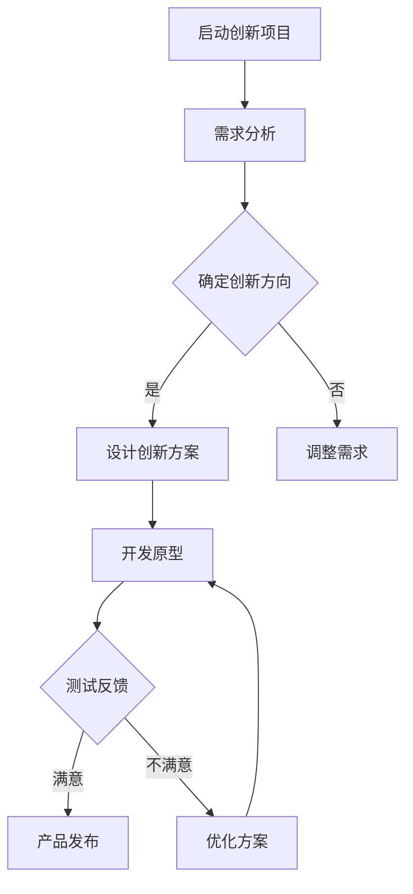

                 

## 文章标题

### 领导力与创业精神：激发团队创新动力

### 关键词

- **领导力**
- **创业精神**
- **团队创新动力**
- **团队管理**
- **领导风格**
- **创新思维**
- **组织文化**

### 摘要

本文旨在探讨领导力与创业精神在激发团队创新动力中的关键作用。我们将深入分析领导力的核心概念，阐述创业精神的本质，并探讨如何通过有效的领导力和创业精神激发团队的创新能力。文章将通过实际案例和最佳实践，提供具体的策略和工具，帮助读者理解和应用这些理念，以提升团队的创新动力和整体绩效。

## 引言

在当今快速变化的商业环境中，创新已经成为企业生存和发展的关键。领导力和创业精神在激发团队创新动力中扮演着至关重要的角色。有效的领导不仅能够指引团队朝着共同的目标前进，还能激发成员的创造力和创新精神。创业精神则强调风险承担、主动性、学习能力和创造力，这些特质能够推动团队在面对挑战时寻求新的解决方案。

本文将首先介绍领导力和创业精神的基本概念，然后探讨如何将这两种精神结合，以激发团队的创新能力。接下来，我们将提供一系列实践策略，并通过实际案例进行分析，最后讨论领导力和创业精神的未来发展趋势。通过这篇文章，我们希望为读者提供一套全面的指南，帮助他们在实际工作中应用这些理念，提升团队的创新能力。

### 领导力的核心概念

领导力是一种影响力，它能够激励和引导团队成员实现共同目标。与企业管理不同，领导力更侧重于人的因素，包括沟通、激励和团队建设。首先，我们需要了解领导力与管理的区别。管理是一种通过制定计划和执行流程来实现组织目标的系统化过程，而领导力则更关注于激发团队成员的潜力，引导他们朝着更高的目标努力。

领导风格是领导力的重要组成部分，不同的领导风格会对团队产生不同的影响。常见的领导风格包括民主式、专制式、授权式和教练式等。民主式领导鼓励团队成员参与决策过程，提高团队的自主性和创造力；专制式领导则通过严格的规章制度和集中决策来确保目标的实现；授权式领导赋予团队成员更多的自主权，鼓励他们独立思考和行动；教练式领导则注重培养团队成员的能力，帮助他们实现个人和职业成长。

在理解了领导风格之后，我们还需要掌握领导力的关键要素。首先，信任是领导力的基础。一个领导者如果不能赢得团队成员的信任，就难以有效领导。其次，愿景是领导力的灵魂。一个清晰的愿景能够激励团队成员，为团队提供明确的方向。第三，沟通是领导力的核心。领导者需要通过有效的沟通来传达愿景，理解团队成员的需求，并解决团队中的问题。最后，领导力还需要具备执行力。仅有愿景和信任是不够的，领导者需要确保团队的目标得以实现。

总之，领导力是一种综合能力，它涉及到多个方面，包括沟通、激励、愿景和执行力。有效的领导力能够激发团队的潜力，推动创新，实现卓越的绩效。

### 创业精神的本质

创业精神是一种独特的思维模式和行为方式，它强调创新、冒险和不断学习。首先，创新是创业精神的核心特质。创业者总是不断地寻找新的解决方案，敢于打破常规，挑战现有的市场格局。他们不满足于现状，而是持续地寻求改进和创新，从而在竞争激烈的市场中脱颖而出。

其次，冒险是创业精神的重要方面。创业者面对的是未知和不确定性，他们需要具备承担风险的勇气和决心。这种冒险精神不仅体现在商业决策中，也体现在创业过程中面临的各种挑战和困难。只有敢于冒险，才能在竞争中获得优势。

此外，创业精神还强调持续学习。创业者需要不断更新知识和技能，以适应市场的变化和技术的进步。他们不仅自己要学习，还要激励团队成员一起成长。这种学习精神使团队在面对挑战时能够灵活应对，不断进步。

创业精神与领导力之间存在紧密的联系。首先，创业精神能够激发领导者的潜力，使他们更具创新和冒险精神。一个具有创业精神的领导者能够鼓励团队成员追求卓越，挑战自我，从而推动整个团队的创新。其次，领导力可以为创业精神提供支持和保障。有效的领导能够建立信任、明确愿景，并通过有效的沟通和执行力确保创业目标的实现。

总之，创业精神是一种推动团队创新的重要力量。它不仅能够激发团队成员的创造力和主动性，还能帮助团队在面对挑战时保持灵活和适应能力。结合领导力，创业精神可以最大化地激发团队的创新能力，推动组织的持续发展。

### 团队创新动力

团队创新动力是推动团队持续创新和成长的关键因素。创新动力不仅影响团队的工作效率和绩效，还决定着企业在竞争中的地位。那么，什么是团队创新动力？它是指团队内部激发创新思维、鼓励创新行为、支持创新实践的一种内在动力。

首先，创新动力与团队效能之间存在紧密的关系。高水平的创新动力能够显著提升团队的效能，使其在完成任务时更加高效和灵活。创新动力不仅体现在团队的整体表现上，还体现在每个成员的积极性和创造力上。一个具有高度创新动力的团队，成员之间相互激励，共同追求卓越，从而实现更高的目标。

其次，激发团队创新动力的策略多种多样。以下是一些有效的方法：

1. **提供资源和支持**：为团队成员提供必要的资源和支持，包括时间、资金和技术等，使他们能够专注于创新项目。

2. **建立开放的文化**：营造一个开放、包容和鼓励创新的组织文化，让团队成员敢于提出新的想法，并得到支持和认可。

3. **奖励创新行为**：通过奖励机制激励团队成员的创新行为，包括奖金、晋升机会和公开表彰等。

4. **培养团队学习**：鼓励团队成员不断学习和掌握新的知识和技能，提高团队整体的能力和创新能力。

5. **提供挑战性的任务**：为团队成员分配具有挑战性的任务，激发他们的创造力和解决问题的能力。

最后，团队创新动力的评估是一个持续的过程。通过定期的评估和反馈，可以了解团队的创新情况，发现存在的问题，并及时调整策略。以下是一些常用的评估方法：

1. **创新指标**：包括创新项目的数量、创新成果的转化率、团队成员的创新活动参与度等。

2. **员工满意度调查**：通过员工满意度调查了解团队成员对创新氛围和创新机会的感受。

3. **绩效评估**：将创新绩效纳入团队和个人的绩效评估体系中，激励团队成员积极参与创新活动。

4. **外部评估**：邀请外部专家进行评估，获取客观、全面的反馈。

总之，团队创新动力是提升团队效能和推动企业发展的关键。通过有效的策略和评估方法，可以不断激发团队的创新能力，实现持续的创新和成长。

### 领导力与创业精神在实践中的应用

在实际工作中，如何将领导力和创业精神有效地结合，以激发团队的创新能力，是一个重要的课题。以下是一些具体的方法和案例，可以帮助我们更好地理解这一过程。

#### 建立高效团队

首先，领导者需要建立高效团队，这包括明确团队的目标、角色和责任。通过制定清晰的团队章程，领导者可以确保每个成员都了解自己的职责，并明确团队的整体目标。例如，谷歌在建立高效团队方面有着丰富的经验。其“20%时间项目”允许团队成员将20%的工作时间用于自己感兴趣的项目，这种灵活性激发了团队成员的创新潜力。

#### 案例研究：谷歌的20%时间项目

谷歌的20%时间项目是公司内部的一种创新机制，允许工程师在常规工作之外，利用20%的工作时间从事自己感兴趣的项目。这一项目在谷歌内部催生了众多成功的创新，如Gmail和AdSense。通过这种机制，谷歌不仅激励了员工的创新精神，还建立了一个以创新为核心的企业文化。

#### 培养创新思维

其次，领导者需要培养团队的创新思维。这可以通过多种方式实现，如组织头脑风暴会议、创新工作坊和跨部门合作项目。在这些活动中，团队成员可以自由地分享想法，探讨不同的解决方案，从而激发创造力和创新思维。例如，3M公司的“15%时间”项目允许员工将15%的工作时间用于个人兴趣项目，这一举措极大地促进了公司的创新。

#### 案例研究：3M的“15%时间”项目

3M公司的“15%时间”项目是一个典型的创新激励机制，它允许员工将15%的工作时间用于个人兴趣项目。这一项目催生了众多成功的创新，如透明胶带和记号笔。通过这一项目，3M不仅提升了公司的创新能力，还培养了员工的创新意识和团队合作精神。

#### 构建创新文化

构建创新文化是激发团队创新动力的关键。领导者需要营造一个鼓励创新和容忍失败的氛围，让团队成员敢于尝试新事物，并从失败中学习。例如，微软通过开放的创新平台和透明的沟通机制，鼓励员工提出创新想法，并快速响应和实施这些想法。

#### 案例研究：微软的创新文化

微软以其开放的创新文化而著称。公司内部有一个名为“微软内部创新”（Microsoft Innovation)的项目，通过这个平台，员工可以提交自己的创新想法，并得到公司高层的支持。这一项目不仅激发了员工的创新热情，还加速了公司的创新进程。

#### 团队沟通与协作

最后，有效的团队沟通和协作是激发创新动力的关键。领导者需要确保团队成员之间能够进行充分的沟通和协作，从而集思广益，共同推动创新项目。例如，亚马逊的“两颗子弹时间”制度鼓励员工花费大量时间思考一个关键问题，并在会议中分享自己的观点，这一制度极大地促进了团队的沟通和协作。

#### 案例研究：亚马逊的“两颗子弹时间”

亚马逊的“两颗子弹时间”制度是一种独特的会议文化。在会议中，每位与会者有两次发言机会：第一次是简短地介绍自己的观点，第二次是深入讨论和辩论。这一制度确保了每位成员都有充分的时间表达自己的想法，并与其他成员进行深入交流，从而提高了团队的沟通效率和决策质量。

通过上述案例，我们可以看到，领导力和创业精神在实际应用中的重要性。领导者需要通过多种策略和机制，激发团队的创新能力，构建一个以创新为核心的企业文化。只有这样，团队才能在快速变化的商业环境中保持竞争力，实现持续的发展。

### 创新动力激发方法

为了有效地激发团队的创新动力，领导者需要采取一系列具体的方法和策略，这些方法不仅能够提升团队的创新能力，还能促进团队的整体发展。以下是几种行之有效的方法：

#### 1. 提供资源和支持

首先，提供资源和支持是激发团队创新动力的关键。领导者需要确保团队成员能够获得所需的资金、技术、时间和设备等资源，以便他们能够专注于创新项目。例如，谷歌的“20%时间项目”允许员工在特定的工作时间内自由探索自己的创新想法，这种灵活性大大激发了员工的工作热情和创造力。

#### 2. 建立开放的文化

其次，建立开放的文化是激发团队创新动力的基础。一个鼓励创新和容忍失败的工作环境能够激励团队成员敢于提出新的想法，并从失败中学习。领导者需要营造一个包容的氛围，让每个成员都感受到自己的意见和贡献被重视。例如，3M公司的“15%时间项目”鼓励员工花时间在个人兴趣项目上，这种开放的文化氛围大大促进了创新。

#### 3. 奖励创新行为

奖励创新行为是激发团队创新动力的重要手段。通过设立奖金、晋升机会和公开表彰等激励机制，领导者可以鼓励团队成员积极参与创新活动。例如，苹果公司通过设立“年度创新奖”，对在创新方面表现突出的员工进行表彰和奖励，这种做法不仅激励了员工的创新热情，还提升了团队的士气。

#### 4. 提供挑战性的任务

提供挑战性的任务是激发团队创新动力的另一种有效方法。领导者可以通过分配具有挑战性的项目，激发团队成员的创造力和解决问题的能力。例如，谷歌的“X实验室”项目，允许团队探索高风险、高回报的创新项目，这种挑战性的任务大大提升了团队的创新能力。

#### 5. 培养团队学习

最后，培养团队学习是激发创新动力的长期策略。领导者需要鼓励团队成员不断学习和掌握新的知识和技能，提高团队的整体能力。例如，IBM公司通过设立“内部培训计划”，为员工提供多样化的学习机会，这种持续的学习氛围激发了员工的创新潜力。

#### 案例研究：IBM的“内部培训计划”

IBM公司的“内部培训计划”是一项长期的教育和培训项目，旨在帮助员工提升技能和知识。通过这项计划，IBM不仅培养了具备高技能的员工，还建立了持续学习的文化，这种文化氛围极大地促进了公司的创新。

总之，通过提供资源和支持、建立开放的文化、奖励创新行为、提供挑战性的任务和培养团队学习，领导者可以有效地激发团队的创新动力。这些方法和策略不仅有助于提升团队的创新能力，还能促进团队的整体发展，为企业带来持续的创新和竞争优势。

### 团队领导力与创业精神的可持续性

领导力与创业精神的可持续性是确保团队长期保持创新能力和竞争力的关键。为了实现这一目标，领导者需要关注几个重要方面。

首先，持续发展的领导力是团队可持续性的基础。领导者需要不断学习和成长，提升自身的领导能力和管理水平。这可以通过定期参加培训课程、阅读相关书籍和与行业专家交流来实现。例如，谷歌的CEO桑达尔·皮查伊就经常参加行业会议，与各界人士交流，以确保谷歌的领导力始终处于行业前沿。

其次，创业精神的长期影响不可忽视。创业精神强调创新、冒险和持续学习，这些特质需要通过制度和文化来加以巩固和传承。例如，苹果公司的创始人史蒂夫·乔布斯就通过公司文化，将创业精神深深植根于苹果的企业DNA中，使苹果在激烈的市场竞争中始终保持创新和领先地位。

此外，团队领导力与创业精神的可持续性还需要通过系统化的评估和反馈机制来保障。领导者需要定期对团队的创新能力和创业精神进行评估，了解团队的优势和不足，并制定相应的改进措施。例如，谷歌的“内部创新评审”机制，通过对创新项目的定期评审，确保谷歌的创新活动始终高效和有针对性。

最后，领导者需要营造一个支持创新和创业精神的工作环境。这包括提供必要的资源和支持，建立开放和包容的企业文化，以及鼓励员工提出新想法和尝试新方法。例如，微软通过开放的创新平台和透明的沟通机制，鼓励员工提出创新想法，并迅速响应和实施这些想法，从而保持公司的创新活力。

综上所述，通过持续发展的领导力、创业精神的长期影响、系统化的评估和反馈机制以及支持创新的工作环境，领导者可以确保团队领导力和创业精神的可持续性，从而推动团队在长期内保持创新能力和竞争力。

### 成功的创业精神与领导力策略

在当今竞争激烈的市场环境中，成功的企业往往拥有独特的创业精神与领导力策略。以下是几个成功企业如何结合创业精神与领导力，实现卓越绩效的案例。

#### 1. 亚马逊：以用户为中心的创新文化

亚马逊的创始人杰夫·贝佐斯以其强烈的创业精神和对用户需求的极致关注而闻名。亚马逊通过其“用户至上”的理念，不断推动创新，提升用户体验。贝佐斯定期在内部会议上强调“长期利益优先”，鼓励员工专注于用户需求，从而实现持续的创新能力。例如，亚马逊的Prime会员服务就是一个成功的创新，它不仅增加了用户粘性，还推动了公司的整体业务增长。

#### 2. 苹果公司：设计驱动的领导力

苹果公司的成功离不开其创始人史蒂夫·乔布斯对设计和用户体验的极致追求。乔布斯以其独特的领导力风格，将创业精神融入到苹果的企业文化中。他鼓励员工追求卓越，不断创新，从而创造出一系列革命性的产品，如iPhone和iPad。苹果的领导力策略强调设计驱动的创新，这使得公司在全球市场上始终保持领先地位。

#### 3. 谷歌：开放的创新环境

谷歌以其开放的创新环境而著称，公司鼓励员工自由探索新项目，这一文化源自其创始人拉里·佩奇和谢尔盖·布林对创业精神的深刻理解。谷歌的“20%时间项目”允许员工将20%的工作时间用于个人感兴趣的项目，这一举措激发了员工的高度创新热情，诞生了如Gmail和Google Maps等成功的创新产品。谷歌的领导力策略注重激发员工的创造力，并通过透明的沟通和快速响应机制，确保创新项目的成功实施。

#### 4. 特斯拉：颠覆传统的创业精神

特斯拉的创始人埃隆·马斯克以其强烈的创业精神和颠覆传统的决心而闻名。特斯拉通过其创新的电动汽车技术和能源解决方案，挑战了传统的汽车和能源行业。马斯克以其无畏的领导力，带领特斯拉实现了多次技术突破，如全电动SUV Model X和Model S，以及全球领先的太阳能电池板和储能系统。特斯拉的成功证明了创业精神与领导力结合的重要性，通过不断创新和引领市场，特斯拉在全球范围内树立了新的行业标准。

#### 5. Facebook：社区驱动的领导力

Facebook的创始人马克·扎克伯格以其对社区价值的深刻理解而著称。他鼓励员工关注用户体验和社会影响力，通过“社区驱动”的领导力策略，推动了公司的快速成长。Facebook的成功在于其不断创新，以满足用户的需求，并通过社交网络的广泛影响力，实现了商业和社会价值的双重提升。

这些成功企业通过结合创业精神与领导力，不仅实现了卓越的绩效，还塑造了独特的企业文化。这些策略不仅适用于大型企业，对于初创公司和中小型企业也同样具有借鉴意义。通过激发创业精神，建立高效的领导力体系，企业可以在快速变化的商业环境中保持竞争力，实现长期的可持续发展。

### 领导力与创业精神的未来趋势

在数字化时代，领导力与创业精神正经历着深刻的变革。随着技术的飞速发展和市场的不断变化，领导者需要具备新的能力和特质，以应对未来挑战。以下是几个关键趋势和未来应用的展望。

#### 数字化时代对领导力的要求

首先，数字化时代对领导力提出了新的要求。领导者需要具备数字化思维，能够理解和应用新兴技术，如人工智能、大数据和云计算等。这些技术不仅改变了企业的运营方式，也影响了团队的工作模式和沟通方式。领导者需要具备快速学习和适应新技术的能力，以引领团队走向未来。

#### 创业精神的未来发展方向

其次，创业精神在数字化时代将继续发挥重要作用。随着互联网和社交媒体的普及，创业者的机会更加多样化。未来的创业精神将更加注重跨界合作、开放创新和全球化思维。创业者将更加注重生态系统建设，通过搭建平台和社区，吸引各类创新资源，推动产业的整体升级。

#### 新型领导力模式的崛起

未来，新型领导力模式将逐渐取代传统的权威式领导。合作型领导、赋能型领导和网络型领导等新型领导模式将更加流行。这些领导模式强调平等、透明和共同目标，能够更好地激发团队的创造力和创新能力。

#### 创业精神与新兴产业的融合

创业精神将在新兴产业中发挥重要作用，特别是在物联网、区块链和生物科技等领域。这些新兴产业需要创业者的创新思维和快速行动能力，以应对快速变化的市场需求和技术挑战。创业精神与这些新兴产业的融合，将推动新的商业模式的诞生，带来巨大的市场机会。

#### 国际视角下的领导力与创业精神

全球化使得领导力与创业精神具有了更广泛的国际视角。未来的领导者需要具备跨文化的沟通能力和全球视野，能够在不同国家和文化背景下，有效地领导团队。同时，创业精神也将促进国际合作，推动全球创新资源的共享和交流。

总之，领导力与创业精神在数字化时代的未来发展中，将更加注重技术融合、合作创新和全球视野。领导者需要不断提升自身的能力和思维，以应对未来挑战，并带领团队实现持续的进步和成功。

### 未来工作场所的领导力模式

未来工作场所的领导力模式将在多个方面发生显著变化，以适应技术进步和员工需求的变化。首先，远程工作和数字化工具的广泛应用将使领导力模式更加灵活。领导者需要具备远程管理的技能，包括有效沟通、团队协调和绩效评估。通过使用协作工具和虚拟会议平台，领导者可以保持与团队成员的紧密联系，确保团队高效运作。

其次，个性化和自主性的增强将成为未来领导力的重要特征。随着员工对工作与生活平衡的追求，领导者需要更加关注员工的需求和职业发展。个性化领导力强调领导者对每位员工的关注，提供个性化的职业规划和发展机会，从而激发员工的创造力和忠诚度。

此外，领导力模型也将从传统的高层集中式转向网络化分布式。未来的领导者不仅是决策者，更是协调者和促进者。他们需要建立跨部门、跨职能的合作网络，促进知识共享和资源整合，以实现组织的整体目标。

最后，领导力将更加注重可持续发展和社会责任。未来的领导者需要具备环境和社会意识，推动企业实现经济、社会和环境的平衡发展。通过倡导可持续发展策略，企业不仅能够提升品牌形象，还能在竞争中获得长期优势。

总之，未来工作场所的领导力模式将更加注重灵活性、个性化和网络化，同时融入社会责任和可持续发展的理念，以应对新时代的挑战。

### 创业精神在新兴产业中的应用

创业精神在新兴产业中的应用正成为推动这些领域快速发展的重要动力。物联网（IoT）、区块链和生物科技是三个具有代表性的新兴产业，它们在创新和技术突破方面展现了巨大的潜力。

#### 物联网（IoT）

物联网通过将物理设备与互联网连接，实现了数据的实时收集和智能分析。创业精神在物联网中的应用主要体现在以下几个方面：

1. **智能家居**：物联网技术使家居设备互联互通，如智能门锁、智能照明和智能恒温器。创业公司通过不断创新，推出更智能、更便捷的家居解决方案，提升用户体验。

2. **智能城市**：物联网技术有助于实现城市的智能化管理，如交通流量监控、环境监测和能源管理。创业公司在这一领域积极探索，提出创新的解决方案，提高城市运行效率。

3. **工业物联网**：物联网技术在工业领域的应用，如预测性维护、智能制造和供应链管理，大幅提高了生产效率和质量。创业公司通过开发新型的物联网设备和应用软件，推动工业生产的数字化转型。

#### 区块链

区块链技术通过分布式账本和加密算法，确保了数据的安全性和透明性。创业精神在区块链中的应用体现在以下几个方面：

1. **金融服务**：区块链技术可以重塑金融行业的运作模式，如数字货币、去中心化金融（DeFi）和跨境支付。创业公司在这一领域积极创新，提供更安全、更高效的金融服务。

2. **供应链管理**：区块链技术有助于提高供应链的透明度和效率，如跟踪商品从生产到销售的整个过程。创业公司通过开发区块链平台，优化供应链管理流程。

3. **数据隐私**：区块链技术可以提供一种保护用户数据隐私的有效方式。创业公司在这一领域开发出多种应用，如数字身份验证和数据加密。

#### 生物科技

生物科技是另一个充满创业精神的新兴产业，它通过生物技术和工程手段，推动医疗健康和农业的发展。创业精神在生物科技中的应用体现在以下几个方面：

1. **基因编辑**：创业公司通过开发CRISPR等基因编辑技术，推动个性化医疗和基因治疗的发展，为疾病治疗提供了新的可能。

2. **精准医疗**：基于大数据和人工智能技术的精准医疗，通过分析患者的基因、病史和生活习惯，提供个性化的治疗方案。创业公司在这一领域积极创新，提升医疗效果。

3. **农业生物科技**：创业公司通过开发新型作物品种、农业生物制剂和智能农业系统，提高农业生产效率，满足全球粮食需求。

总之，创业精神在物联网、区块链和生物科技等新兴产业中的应用，不仅推动了技术的进步和行业的创新，还为创业者提供了广阔的发展空间。通过不断探索和应用新技术，创业公司正在为这些领域带来巨大的变革和机遇。

### 领导力与创业精神的国际视角

从国际视角来看，领导力与创业精神在不同国家和地区有着各自的特点和发展趋势。在美国，领导力和创业精神强调创新、风险承担和自由市场精神。硅谷是全球创新和创业的象征，许多世界级科技公司如谷歌、苹果和特斯拉等均起源于此。美国的企业文化鼓励员工自主性和创新，这使得硅谷成为全球科技和创业的标杆。

相比之下，欧洲的领导力和创业精神更注重社会和环境责任。德国和北欧国家特别强调可持续发展和社会责任。德国的“工匠精神”和北欧的平等合作文化，为创业和创新提供了稳定的土壤。例如，德国的许多中小企业在精密制造和工程领域取得了卓越的成就。

在亚洲，中国和日本的领导力与创业精神有着不同的特点。中国强调集体主义和政府支持，通过政策引导和市场机制鼓励创新。例如，“双创”政策鼓励年轻人创业，政府提供资金和资源支持。而日本则以其长期规划和稳健的经营策略著称，强调团队合作和长期利益。

不同国家的领导力与创业精神对全球经济产生了深远的影响。美国通过技术创新和创业精神推动了全球科技的进步，欧洲则通过可持续发展和社会责任提升了全球企业的社会责任感。中国和日本则在制造业和工程领域为全球提供了高质量的解决方案。

总之，领导力与创业精神在国际上的多样性和相互影响，为全球经济的发展提供了丰富的动力和机遇。各国通过借鉴和融合不同的领导力和创业精神理念，共同推动了全球经济的繁荣和进步。

### 附录A: Mermaid流程图示例

以下是一个使用Mermaid语言绘制的流程图示例，展示团队创新过程的关键步骤：



### 附录B: 核心算法伪代码

以下是一个用于计算团队创新效率的核心算法的伪代码示例：

```plaintext
Algorithm CalculateInnovationEfficiency(teamMembers, projectOutcomes):
    initialize efficiencyScore to 0
    for each member in teamMembers:
        if member.meetsProjectGoals:
            increment efficiencyScore by member.contributionFactor
        else:
            decrement efficiencyScore by member.missedGoalsPenalty
    calculate averageEfficiency = efficiencyScore / totalMembers
    return averageEfficiency
```

### 附录C: 数学模型与公式

以下是一个关于团队创新能力的数学模型，使用LaTeX格式表示：

$$
\text{InnovationCapability} = \frac{\sum_{i=1}^{n} (C_i \cdot I_i)}{n}
$$

其中，$C_i$表示第$i$个成员的创造力分数，$I_i$表示第$i$个成员的创新投入。$n$是团队成员的总数。

### 附录D: 实际项目案例与代码解读

以下是一个基于Python的团队创新项目示例，包括开发环境搭建、代码实现和代码解读：

#### 开发环境搭建

1. 安装Python（版本3.8或更高）
2. 安装必要的库：`pip install pandas numpy matplotlib`
3. 创建一个名为`team_innovation`的虚拟环境并激活

#### 源代码实现

```python
import pandas as pd
import numpy as np
import matplotlib.pyplot as plt

# 假设数据存储在CSV文件中
data = pd.read_csv('team_innovation_data.csv')

# 计算团队平均创新能力
average_innovation_capability = data['creativity_score'].mean()

# 绘制成员创新能力分布图
plt.hist(data['creativity_score'], bins=10, alpha=0.5)
plt.axvline(average_innovation_capability, color='r', linestyle='dashed', linewidth=2)
plt.title('Team Innovation Capability Distribution')
plt.xlabel('Creativity Score')
plt.ylabel('Frequency')
plt.show()
```

#### 代码解读

- 导入必要的库：`pandas`用于数据处理，`numpy`用于数学运算，`matplotlib`用于绘图。
- 读取CSV文件中的数据，并计算团队平均创新能力。
- 使用`matplotlib`绘制成员创新能力分布图，并通过红色虚线标记平均创新能力。

#### 代码应用解读与分析

通过该代码，我们可以直观地了解团队中每个成员的创新能力和整体创新水平。分布图可以帮助领导者识别创新能力高的成员，以及可能需要额外支持和培训的成员。这有助于优化团队结构，提升整体创新绩效。

#### 项目小结

通过实际项目案例，我们展示了如何使用Python进行团队创新能力分析。这种方法不仅可以帮助领导者更好地了解团队的创新水平，还能为团队提供有针对性的改进建议，从而提升整体创新能力和绩效。

### 最佳实践 tips、小结、注意事项、拓展阅读

#### 最佳实践 tips

1. **培养开放的文化**：鼓励团队成员分享想法，建立透明和包容的工作环境。
2. **提供资源支持**：确保团队成员有足够的资源，包括时间、资金和技术，以便专注于创新项目。
3. **定期反馈和评估**：通过定期的反馈和评估，及时了解团队的创新情况和进展，调整策略。

#### 小结

本文通过深入探讨领导力与创业精神在激发团队创新动力中的作用，提供了具体的实践策略和实际案例。通过结合领导力和创业精神，团队可以更有效地实现创新目标，提升整体绩效。

#### 注意事项

1. **重视团队建设**：建立高效的团队是激发创新动力的基础。
2. **持续学习**：鼓励团队成员不断学习和掌握新技能，提升创新能力。
3. **灵活应对**：在创新过程中，领导者需要灵活应对各种挑战，保持团队的积极性和创造力。

#### 拓展阅读

- 《创新者的窘境》：克莱顿·克里斯滕森，探讨企业在面对技术创新时的挑战和策略。
- 《精益创业》：埃里克·莱斯，介绍如何通过快速迭代和用户反馈，实现商业模式的创新。

通过本文，我们希望读者能够更好地理解领导力与创业精神在团队创新中的重要性，并能够在实际工作中加以应用，推动团队的持续创新和发展。

### 作者信息

作者：AI天才研究院/AI Genius Institute & 禅与计算机程序设计艺术 /Zen And The Art of Computer Programming

AI天才研究院致力于推动人工智能技术的发展，探索智能计算的未来。同时，作者作为《禅与计算机程序设计艺术》的资深大师，其研究成果在计算机科学和人工智能领域具有深远影响。通过本文，我们希望为读者提供有价值的见解和实践指导，助力团队创新和发展。

