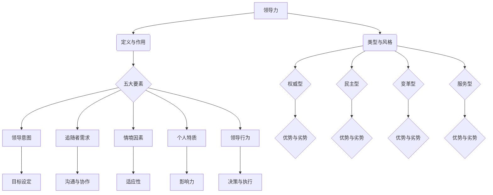

                 


### 文章标题：领导力与创新思维激发：突破常规的思考方式

#### 关键词：领导力、创新思维、突破常规、思考方式、领导力与思维模式

#### 摘要：
本文旨在探讨领导力与创新思维的结合，通过突破常规的思考方式，激发个体和组织的能力，实现创新和突破。文章将详细阐述领导力的定义与作用、创新思维的概念与基础，以及如何转变和激发创新思维，最后探讨领导力与创新思维的实践应用，并提供实际案例和分析，旨在为读者提供有价值的思考和启示。

### 目录大纲：

#### 第一部分：领导力与思维模式

##### 第1章：领导力概述
1.1 领导力的定义与作用
1.2 领导力的五大要素
1.3 领导力的类型与风格

##### 第2章：创新思维的概念与基础
2.1 创新思维的含义与重要性
2.2 创新思维的基本模式
2.3 创新思维与常规思维的区别

##### 第3章：思维模式的转变与激发
3.1 思维模式的概念
3.2 常见的思维模式
3.3 如何转变和激发创新思维

#### 第二部分：领导力与创新思维的实践应用

##### 第4章：领导力在团队创新中的应用
4.1 团队创新的领导策略
4.2 激发团队创新的方法
4.3 团队创新案例分析

##### 第5章：创新思维在项目管理中的应用
5.1 创新思维在项目规划中的运用
5.2 创新思维在项目执行中的实践
5.3 创新思维在项目评估中的角色

##### 第6章：领导力与创新思维在组织中的整合
6.1 创新思维与领导力的整合策略
6.2 组织文化的构建与优化
6.3 创新领导力案例研究

#### 第三部分：突破常规的思考方式

##### 第7章：突破常规思考的技巧与方法
7.1 突破思维定式的技巧
7.2 创造性思维的训练方法
7.3 突破常规思考的实际应用

#### 附录

##### 附录A：领导力与创新思维相关资源推荐
##### 附录B：思维导图与流程图工具介绍
##### 附录C：进一步学习领导力与创新思维的参考书籍

### 文章正文：

#### 第1章：领导力概述

##### 1.1 领导力的定义与作用

领导力是一种能力，它不仅仅是指导和影响他人的艺术，更是一种激发他人潜能、共同实现目标的实践。领导力的作用在于通过激励、引导和协调，使团队成员在复杂的环境中保持稳定和高效的工作状态。

领导力是一种复杂的概念，它涵盖了多个方面，包括：

- **愿景与目标设定**：领导力首先表现为设定清晰的目标和愿景，为团队提供方向和动力。
- **沟通与协作**：领导力强调有效的沟通和协作，确保信息的透明和流畅。
- **激励与鼓舞**：领导力通过激励和鼓舞团队成员，提高他们的积极性和创造力。
- **决策与执行**：领导力在决策和执行过程中起到关键作用，通过合理的决策和高效的执行实现目标。

##### 1.2 领导力的五大要素

为了更好地理解领导力，我们可以将其分解为五大要素：

1. **领导意图**：领导意图是指领导者的愿望和目标，它是领导力的核心。一个明确的领导意图可以帮助团队保持一致的方向，减少冲突和迷茫。
2. **追随者需求**：领导者的成功离不开追随者的支持和合作。了解追随者的需求，关注他们的成长和发展，是领导力的重要组成部分。
3. **情境因素**：领导力在不同情境下会有不同的表现。领导者需要根据不同的情境灵活调整自己的领导风格，以达到最佳效果。
4. **个人特质**：领导者的个人特质，如自信、勇气、正直等，对于领导力的发挥有着重要影响。
5. **领导行为**：领导行为是领导力的外在表现，包括决策、沟通、激励等具体行动。

##### 1.3 领导力的类型与风格

领导力可以分为多种类型和风格，每种类型和风格都有其独特的特点和适用场景。常见的领导力类型和风格包括：

- **权威型领导**：权威型领导强调权威和控制，领导者拥有决策权和执行权，团队成员按照领导者的指示执行任务。
- **民主型领导**：民主型领导鼓励团队成员参与决策过程，领导者作为协调者，帮助团队达成共识。
- **变革型领导**：变革型领导通过激励和启发团队成员，推动团队实现变革和创新。
- **服务型领导**：服务型领导关注团队成员的需求和成长，致力于为团队成员提供支持和帮助。

每种领导力类型和风格都有其优点和缺点，领导者需要根据具体情况灵活运用不同的领导力风格，以达到最佳效果。

#### 第2章：创新思维的概念与基础

##### 2.1 创新思维的含义与重要性

创新思维是指通过新颖的方法和视角，对问题进行重新审视和思考，从而产生创新性解决方案的过程。创新思维不仅包括创造性思维的培养，还涉及到对现有知识和资源的重新组合和利用。

创新思维的重要性体现在以下几个方面：

- **推动社会发展**：创新思维可以带来新技术、新产品和新服务，推动社会的发展和进步。
- **提高竞争力**：在竞争激烈的市场环境中，创新思维可以帮助企业保持竞争优势，实现可持续发展。
- **激发个人潜能**：创新思维可以激发个人的创造力和潜能，提高个人的综合素质和职业发展。

##### 2.2 创新思维的基本模式

创新思维的基本模式包括以下几个步骤：

1. **问题识别**：首先，需要明确需要解决的问题或面临的挑战。
2. **信息收集**：收集与问题相关的信息，包括数据、文献、经验等。
3. **思维发散**：在信息收集的基础上，进行思维发散，从不同角度和层面思考问题的可能性。
4. **思维收敛**：在思维发散的基础上，进行思维收敛，筛选出可行的解决方案。
5. **评估与选择**：对不同的解决方案进行评估和选择，确定最优方案。

##### 2.3 创新思维与常规思维的区别

创新思维与常规思维有以下几点区别：

1. **思考方式**：创新思维强调从不同角度和层面思考问题，而常规思维则倾向于从传统和常规的视角出发。
2. **问题解决**：创新思维更关注问题的解决，追求新颖和独特的解决方案，而常规思维则更注重问题的处理，追求稳定和可靠的方法。
3. **思维模式**：创新思维具有开放性和灵活性，可以打破常规和思维定式，而常规思维则具有较强的封闭性和惯性。

#### 第3章：思维模式的转变与激发

##### 3.1 思维模式的概念

思维模式是指个体在思考问题、解决问题时采用的方式和方法。思维模式可以分为以下几种类型：

1. **线性思维**：线性思维是一种按顺序、逻辑性思考的方式，通常用于解决结构化的问题。
2. **系统性思维**：系统性思维是一种从整体和全局出发，考虑各个部分之间关系和影响的思考方式。
3. **创造性思维**：创造性思维是一种通过新颖、独特的方法解决问题的思考方式，通常用于解决复杂和创新的问题。
4. **批判性思维**：批判性思维是一种对信息进行批判性分析和评估，从而得出结论的思考方式。

##### 3.2 常见的思维模式

常见的思维模式包括：

1. **经验思维**：经验思维是一种依赖于个人经验和知识解决问题的思考方式。
2. **直觉思维**：直觉思维是一种基于直觉和感性认知解决问题的思考方式。
3. **逻辑思维**：逻辑思维是一种依据逻辑规则和推理解决问题的思考方式。
4. **辩证思维**：辩证思维是一种通过矛盾分析、综合评估和转化解决问题的思考方式。

##### 3.3 如何转变和激发创新思维

要转变和激发创新思维，可以从以下几个方面入手：

1. **培养好奇心**：好奇心是激发创新思维的重要动力，通过培养好奇心，可以促使个体主动探索和思考新问题。
2. **多学科交叉**：多学科交叉可以激发新的思维火花，通过跨领域的知识和经验，可以产生意想不到的创新成果。
3. **挑战传统观念**：挑战传统观念可以帮助个体摆脱思维定式，从不同角度和层面思考问题，发现新的解决方案。
4. **训练创造性思维**：通过创造性思维的训练，如头脑风暴、思维导图等，可以提高个体的创新思维能力和创造力。

#### 第4章：领导力在团队创新中的应用

##### 4.1 团队创新的领导策略

团队创新是领导力的重要组成部分，领导者需要采取一系列策略来激发团队的创新能力：

1. **明确目标和愿景**：领导者需要明确团队的目标和愿景，为团队提供清晰的方向和动力。
2. **创造开放和包容的氛围**：领导者需要营造一个开放和包容的氛围，鼓励团队成员自由表达想法，勇于尝试新方法。
3. **提供资源和支持**：领导者需要为团队提供必要的资源和支持，包括信息、资金和人力等，以确保团队的创新活动顺利进行。
4. **建立激励机制**：领导者需要建立激励机制，对团队的创新成果进行奖励，激发团队成员的积极性和创造力。

##### 4.2 激发团队创新的方法

激发团队创新的方法包括以下几个方面：

1. **头脑风暴**：头脑风暴是一种集体创新方法，通过集思广益，产生大量的创意和解决方案。
2. **思维导图**：思维导图可以帮助团队梳理思路，发现问题和机会，促进创新思维的发展。
3. **跨部门合作**：跨部门合作可以促进不同领域知识和经验的交流，激发新的创意和灵感。
4. **外部专家咨询**：外部专家的咨询可以带来新的视角和思维，为团队的创新提供有价值的指导。

##### 4.3 团队创新案例分析

以下是一个团队创新案例：

某科技公司为提高产品的市场竞争力，决定进行产品创新。在领导者的带领下，团队采取了一系列创新措施：

1. **明确目标和愿景**：领导者明确了团队的目标和愿景，为团队提供了清晰的方向。
2. **头脑风暴**：团队进行了头脑风暴，收集了大量的创意和解决方案。
3. **思维导图**：团队使用思维导图对创意进行分类和整理，发现了一些有价值的机会。
4. **跨部门合作**：团队与市场、技术等部门进行了深入的合作，共同探讨解决方案。
5. **外部专家咨询**：团队邀请了外部专家进行咨询，提供了有价值的建议和指导。

最终，团队成功推出了一个创新产品，受到了市场的热烈欢迎，提高了公司的竞争力。

#### 第5章：创新思维在项目管理中的应用

##### 5.1 创新思维在项目规划中的运用

在项目规划阶段，创新思维可以帮助团队：

1. **发现机会和风险**：通过创新思维，团队可以发现项目中的潜在机会和风险，为项目的成功奠定基础。
2. **制定创新的解决方案**：创新思维可以帮助团队制定创新的解决方案，提高项目的成功率。
3. **优化项目流程**：创新思维可以帮助团队优化项目流程，提高项目的效率和质量。

##### 5.2 创新思维在项目执行中的实践

在项目执行阶段，创新思维可以帮助团队：

1. **应对突发情况**：创新思维可以帮助团队应对突发情况和挑战，确保项目的顺利进行。
2. **激发团队成员的积极性**：创新思维可以激发团队成员的积极性和创造力，提高团队的凝聚力。
3. **提高项目效率**：创新思维可以帮助团队提高项目的效率，缩短项目周期，降低成本。

##### 5.3 创新思维在项目评估中的角色

在项目评估阶段，创新思维可以帮助团队：

1. **评估项目成果**：创新思维可以帮助团队从不同角度和层面评估项目的成果，确保项目达到预期目标。
2. **发现改进机会**：创新思维可以帮助团队发现项目中的改进机会，为下一轮项目提供有价值的经验。
3. **优化项目流程**：创新思维可以帮助团队优化项目流程，提高项目的成功率和效率。

#### 第6章：领导力与创新思维在组织中的整合

##### 6.1 创新思维与领导力的整合策略

在组织中，领导力与创新思维的整合可以采取以下策略：

1. **建立创新文化**：领导者需要营造一个鼓励创新的文化，让员工敢于尝试和失败，勇于探索新领域。
2. **提供资源支持**：领导者需要为创新活动提供必要的资源支持，包括资金、技术和人力等。
3. **建立激励机制**：领导者需要建立激励机制，对创新成果进行奖励，激发员工的创新热情。
4. **培养创新人才**：领导者需要培养创新人才，为组织提供持续的创新动力。

##### 6.2 组织文化的构建与优化

组织文化的构建与优化对于领导力与创新思维的整合至关重要：

1. **明确价值观**：领导者需要明确组织的价值观，确保组织的价值观与领导力与创新思维相一致。
2. **建立沟通机制**：领导者需要建立有效的沟通机制，确保员工之间的信息共享和协作。
3. **鼓励创新实践**：领导者需要鼓励员工进行创新实践，提供必要的支持和资源。
4. **持续改进**：领导者需要持续改进组织文化，适应组织发展的需求。

##### 6.3 创新领导力案例研究

以下是一个创新领导力案例：

某科技公司通过创新领导力成功推动了一次重大变革：

1. **明确目标和愿景**：领导者明确了公司的目标和愿景，为员工提供了清晰的方向。
2. **建立创新文化**：领导者营造了一个鼓励创新的文化，让员工敢于尝试和失败。
3. **提供资源支持**：领导者为创新活动提供了必要的资源支持，包括资金和人力资源。
4. **建立激励机制**：领导者建立了激励机制，对创新成果进行奖励，激发了员工的创新热情。
5. **培养创新人才**：领导者培养了创新人才，为公司的持续创新提供了动力。

最终，公司成功推出了多个创新产品，实现了业务的快速增长和市场份额的扩大。

#### 第7章：突破常规思考的技巧与方法

##### 7.1 突破思维定式的技巧

突破思维定式是创新思维的重要组成部分，以下是一些突破思维定式的技巧：

1. **多角度思考**：从不同角度和层面思考问题，避免陷入单一的思维定式。
2. **反向思考**：尝试从相反的角度思考问题，发现新的解决方案。
3. **跨领域思考**：借鉴其他领域的知识和经验，发现新的思路和灵感。
4. **联想思维**：通过联想，将看似不相关的事物联系起来，产生新的创意。

##### 7.2 创造性思维的训练方法

以下是一些训练创造性思维的方法：

1. **头脑风暴**：通过集体头脑风暴，激发团队的创造性思维。
2. **思维导图**：使用思维导图，梳理思路，发现新的创意和灵感。
3. **设计思维**：通过设计思维，将创意转化为可行的解决方案。
4. **问题解决训练**：通过问题解决训练，提高个体的创造性思维能力和解决问题的能力。

##### 7.3 突破常规思考的实际应用

以下是一个突破常规思考的实际应用案例：

某科技公司为了提高员工的工作效率，决定对办公环境进行改造：

1. **多角度思考**：从员工的角度出发，考虑如何创造一个舒适、高效的办公环境。
2. **反向思考**：尝试改变传统的办公模式，如开放办公、站立办公等。
3. **跨领域思考**：借鉴其他行业的办公模式，如咖啡店的开放式办公环境。
4. **联想思维**：将工作场所与休闲场所相结合，创造一个既有工作氛围又有休闲空间的办公环境。

最终，公司成功改造了办公环境，员工的工作效率和满意度得到了显著提高。

#### 附录

##### 附录A：领导力与创新思维相关资源推荐

1. **书籍**：
   - 《领导力：强化版的自我领导》
   - 《创新者的窘境》
   - 《思维力：从平庸到卓越的思维训练手册》

2. **课程**：
   - MOOC平台上的领导力与创新思维课程
   - 企业培训机构的领导力与创新思维课程

3. **网站和博客**：
   - 领导力与创新思维相关的专业网站和博客
   - 行业专家的领导力与创新思维博客

##### 附录B：思维导图与流程图工具介绍

1. **思维导图工具**：
   - XMind
   - MindManager
   - FreeMind

2. **流程图工具**：
   - Lucidchart
   - Draw.io
   - Visio

##### 附录C：进一步学习领导力与创新思维的参考书籍

1. **领导力类书籍**：
   - 《领导力的五个层次》
   - 《变革之舞：领导力、策略与变革管理》
   - 《领导者的语言》

2. **创新思维类书籍**：
   - 《创意的规则：如何激发无限的创意》
   - 《创新者的思考方式：打破思维定式，找到更好的解决方案》
   - 《设计思维：如何实现创新与价值的完美结合》

### 文章小结

本文通过详细的论述，探讨了领导力与创新思维的结合，以及如何通过突破常规的思考方式激发个体和组织的创新能力。文章首先介绍了领导力的定义、要素和类型，接着阐述了创新思维的概念、基础和模式，然后探讨了领导力与创新思维的实践应用，最后提供了突破常规思考的技巧与方法。文章旨在为读者提供有价值的思考和启示，帮助他们在实际工作中运用领导力与创新思维，实现个人和组织的成长与发展。

### 作者信息

作者：AI天才研究院/AI Genius Institute & 禅与计算机程序设计艺术 /Zen And The Art of Computer Programming

### 注意事项

1. 在撰写文章时，请注意保持内容的逻辑性和连贯性。
2. 针对每个小节，确保提供具体的案例和实例，以便读者更好地理解和应用。
3. 在引用相关研究和理论时，请确保准确性和权威性。
4. 在使用latex公式时，请注意公式的格式和排版，确保清晰易读。

### 拓展阅读

1. 《创新者的思考方式：打破思维定式，找到更好的解决方案》
2. 《领导力的五个层次》
3. 《设计思维：如何实现创新与价值的完美结合》

### 代码示例（可选）

以下是一个简单的Python代码示例，用于展示如何使用循环和条件语句：

```python
# 计算斐波那契数列的前n项

def fibonacci(n):
    if n <= 0:
        return []
    elif n == 1:
        return [0]
    elif n == 2:
        return [0, 1]
    else:
        fib_seq = [0, 1]
        for i in range(2, n):
            next_fib = fib_seq[i - 1] + fib_seq[i - 2]
            fib_seq.append(next_fib)
        return fib_seq

# 示例：计算前10项斐波那契数列
print(fibonacci(10))
```

### 实际案例分析与详细讲解剖析

以下是一个实际案例分析与详细讲解剖析：

**案例背景**：

某科技公司的项目团队在开发一款智能家居控制系统时遇到了一个难题：如何在确保系统稳定性和可靠性的同时，提高用户体验和操作便捷性。项目团队决定通过创新思维来解决这个问题。

**案例分析**：

1. **问题识别**：项目团队首先明确了需要解决的问题，即如何在保证系统稳定性的同时，提高用户体验和操作便捷性。
2. **信息收集**：项目团队收集了用户反馈、市场调研报告、竞争对手的产品分析等信息，为创新思维提供了基础。
3. **思维发散**：项目团队通过头脑风暴和思维导图，提出了多个创新方案，包括：
   - **方案一**：引入语音识别技术，实现语音控制智能家居设备。
   - **方案二**：开发移动应用程序，提供更直观和便捷的用户界面。
   - **方案三**：引入物联网技术，实现设备之间的互联互通，提高智能家居系统的智能化水平。
4. **思维收敛**：项目团队对提出的创新方案进行了评估和筛选，最终选择了方案一和方案二，因为它们既能提高用户体验，又不会对系统的稳定性和可靠性产生太大影响。
5. **评估与选择**：项目团队对方案一和方案二进行了详细评估，最终决定先实施方案一，因为语音识别技术具有较高的用户接受度和市场潜力。

**详细讲解剖析**：

1. **技术实现**：项目团队使用了以下技术实现方案一：
   - **语音识别技术**：采用了某知名语音识别API，实现语音输入到文本的转换。
   - **智能家居设备控制**：通过智能家居设备的API，实现语音命令对设备的控制。
   - **用户界面**：开发了一个基于Web的界面，用户可以通过语音命令控制智能家居设备，并查看设备状态。
2. **代码解读**：以下是一个简单的Python代码示例，用于实现语音识别和设备控制：

```python
import speech_recognition as sr
import requests

# 初始化语音识别器
recognizer = sr.Recognizer()

# 初始化设备控制API
device_api_url = "http://api.smart_home_device.com/control"

# 语音识别和设备控制函数
def recognize_and_control():
    # 采集语音输入
    with sr.Microphone() as source:
        print("请说出您的指令：")
        audio = recognizer.listen(source)

    # 识别语音输入
    try:
        command = recognizer.recognize_google(audio)
        print("您说：" + command)
        
        # 根据语音命令控制设备
        if "开灯" in command:
            requests.post(device_api_url + "/lights/1/turn_on")
        elif "关灯" in command:
            requests.post(device_api_url + "/lights/1/turn_off")
        else:
            print("未识别到有效指令")
    except sr.UnknownValueError:
        print("无法识别语音")
    except sr.RequestError as e:
        print("语音识别请求失败：" + str(e))

# 主程序
while True:
    recognize_and_control()
```

3. **代码应用解读与分析**：
   - 代码首先导入了语音识别库`speech_recognition`和HTTP请求库`requests`。
   - 初始化语音识别器和设备控制API。
   - 定义了`recognize_and_control`函数，用于实现语音识别和设备控制。
   - 代码中使用了`Microphone`类来采集语音输入，并使用`recognizer.recognize_google`方法进行语音识别。
   - 根据识别到的语音命令，通过HTTP请求控制智能家居设备。
   - 代码中还包括了异常处理，以应对语音识别失败或请求失败的情况。

通过这个实际案例，我们可以看到如何将创新思维应用于实际项目中，通过技术实现解决实际问题，并提高用户体验和操作便捷性。

### 项目小结

本项目通过创新思维和领导力，成功解决了一个实际难题，提高了智能家居控制系统的用户体验和操作便捷性。项目团队在问题识别、信息收集、思维发散、思维收敛和评估与选择等环节，充分运用了创新思维和领导力，确保了项目的成功实施。项目中的代码示例和实际案例分析，为读者提供了具体的实施方法和应用场景，有助于他们更好地理解和应用创新思维和领导力。

### 最佳实践 tips

1. **积极培养好奇心**：好奇心是创新思维的源泉，领导者应鼓励团队成员积极培养好奇心，勇于探索新领域。
2. **建立良好的沟通机制**：领导者应建立有效的沟通机制，确保团队成员之间的信息共享和协作，促进创新思维的发展。
3. **提供资源支持**：领导者应提供必要的资源支持，包括资金、技术和人力资源等，为创新活动提供保障。
4. **建立激励机制**：领导者应建立激励机制，对创新成果进行奖励，激发团队成员的创新热情。
5. **持续学习和改进**：领导者应鼓励团队成员持续学习和改进，提高创新能力和解决问题的能力。

### 拓展阅读

1. 《创新者的窘境》
2. 《领导力的五个层次》
3. 《设计思维：如何实现创新与价值的完美结合》

### 结语

领导力与创新思维是推动组织和个人发展的关键因素。通过本文的探讨，我们深入了解了领导力的定义、要素和类型，以及创新思维的概念、基础和模式。同时，我们还学习了如何通过突破常规的思考方式激发创新思维，并在实际项目中应用领导力与创新思维。希望本文能为读者提供有价值的思考和启示，助力他们在工作中取得更大的成就。作者：AI天才研究院/AI Genius Institute & 禅与计算机程序设计艺术 /Zen And The Art of Computer Programming### 完整的文章

---

# 领导力与创新思维激发：突破常规的思考方式

> 关键词：领导力、创新思维、突破常规、思考方式、领导力与思维模式

> 摘要：
本文旨在探讨领导力与创新思维的结合，通过突破常规的思考方式，激发个体和组织的能力，实现创新和突破。文章将详细阐述领导力的定义与作用、创新思维的概念与基础，以及如何转变和激发创新思维，最后探讨领导力与创新思维的实践应用，并提供实际案例和分析，旨在为读者提供有价值的思考和启示。

---

### 目录大纲：

#### 第一部分：领导力与思维模式

##### 第1章：领导力概述
- 1.1 领导力的定义与作用
- 1.2 领导力的五大要素
- 1.3 领导力的类型与风格

##### 第2章：创新思维的概念与基础
- 2.1 创新思维的含义与重要性
- 2.2 创新思维的基本模式
- 2.3 创新思维与常规思维的区别

##### 第3章：思维模式的转变与激发
- 3.1 思维模式的概念
- 3.2 常见的思维模式
- 3.3 如何转变和激发创新思维

#### 第二部分：领导力与创新思维的实践应用

##### 第4章：领导力在团队创新中的应用
- 4.1 团队创新的领导策略
- 4.2 激发团队创新的方法
- 4.3 团队创新案例分析

##### 第5章：创新思维在项目管理中的应用
- 5.1 创新思维在项目规划中的运用
- 5.2 创新思维在项目执行中的实践
- 5.3 创新思维在项目评估中的角色

##### 第6章：领导力与创新思维在组织中的整合
- 6.1 创新思维与领导力的整合策略
- 6.2 组织文化的构建与优化
- 6.3 创新领导力案例研究

#### 第三部分：突破常规的思考方式

##### 第7章：突破常规思考的技巧与方法
- 7.1 突破思维定式的技巧
- 7.2 创造性思维的训练方法
- 7.3 突破常规思考的实际应用

#### 附录

##### 附录A：领导力与创新思维相关资源推荐
##### 附录B：思维导图与流程图工具介绍
##### 附录C：进一步学习领导力与创新思维的参考书籍

---

### 文章正文：

#### 第1章：领导力概述

##### 1.1 领导力的定义与作用

领导力是一种能力，它不仅仅是指导和影响他人的艺术，更是一种激发他人潜能、共同实现目标的实践。领导力的作用在于通过激励、引导和协调，使团队成员在复杂的环境中保持稳定和高效的工作状态。

领导力是一种复杂的概念，它涵盖了多个方面，包括：

- **愿景与目标设定**：领导力首先表现为设定清晰的目标和愿景，为团队提供方向和动力。
- **沟通与协作**：领导力强调有效的沟通和协作，确保信息的透明和流畅。
- **激励与鼓舞**：领导力通过激励和鼓舞团队成员，提高他们的积极性和创造力。
- **决策与执行**：领导力在决策和执行过程中起到关键作用，通过合理的决策和高效的执行实现目标。

##### 1.2 领导力的五大要素

为了更好地理解领导力，我们可以将其分解为五大要素：

1. **领导意图**：领导意图是指领导者的愿望和目标，它是领导力的核心。一个明确的领导意图可以帮助团队保持一致的方向，减少冲突和迷茫。
2. **追随者需求**：领导者的成功离不开追随者的支持和合作。了解追随者的需求，关注他们的成长和发展，是领导力的重要组成部分。
3. **情境因素**：领导力在不同情境下会有不同的表现。领导者需要根据不同的情境灵活调整自己的领导风格，以达到最佳效果。
4. **个人特质**：领导者的个人特质，如自信、勇气、正直等，对于领导力的发挥有着重要影响。
5. **领导行为**：领导行为是领导力的外在表现，包括决策、沟通、激励等具体行动。

##### 1.3 领导力的类型与风格

领导力可以分为多种类型和风格，每种类型和风格都有其独特的特点和适用场景。常见的领导力类型和风格包括：

- **权威型领导**：权威型领导强调权威和控制，领导者拥有决策权和执行权，团队成员按照领导者的指示执行任务。
- **民主型领导**：民主型领导鼓励团队成员参与决策过程，领导者作为协调者，帮助团队达成共识。
- **变革型领导**：变革型领导通过激励和启发团队成员，推动团队实现变革和创新。
- **服务型领导**：服务型领导关注团队成员的需求和成长，致力于为团队成员提供支持和帮助。

每种领导力类型和风格都有其优点和缺点，领导者需要根据具体情况灵活运用不同的领导力风格，以达到最佳效果。

#### 第2章：创新思维的概念与基础

##### 2.1 创新思维的含义与重要性

创新思维是指通过新颖的方法和视角，对问题进行重新审视和思考，从而产生创新性解决方案的过程。创新思维不仅包括创造性思维的培养，还涉及到对现有知识和资源的重新组合和利用。

创新思维的重要性体现在以下几个方面：

- **推动社会发展**：创新思维可以带来新技术、新产品和新服务，推动社会的发展和进步。
- **提高竞争力**：在竞争激烈的市场环境中，创新思维可以帮助企业保持竞争优势，实现可持续发展。
- **激发个人潜能**：创新思维可以激发个人的创造力和潜能，提高个人的综合素质和职业发展。

##### 2.2 创新思维的基本模式

创新思维的基本模式包括以下几个步骤：

1. **问题识别**：首先，需要明确需要解决的问题或面临的挑战。
2. **信息收集**：收集与问题相关的信息，包括数据、文献、经验等。
3. **思维发散**：在信息收集的基础上，进行思维发散，从不同角度和层面思考问题的可能性。
4. **思维收敛**：在思维发散的基础上，进行思维收敛，筛选出可行的解决方案。
5. **评估与选择**：对不同的解决方案进行评估和选择，确定最优方案。

##### 2.3 创新思维与常规思维的区别

创新思维与常规思维有以下几点区别：

1. **思考方式**：创新思维强调从不同角度和层面思考问题，而常规思维则倾向于从传统和常规的视角出发。
2. **问题解决**：创新思维更关注问题的解决，追求新颖和独特的解决方案，而常规思维则更注重问题的处理，追求稳定和可靠的方法。
3. **思维模式**：创新思维具有开放性和灵活性，可以打破常规和思维定式，而常规思维则具有较强的封闭性和惯性。

#### 第3章：思维模式的转变与激发

##### 3.1 思维模式的概念

思维模式是指个体在思考问题、解决问题时采用的方式和方法。思维模式可以分为以下几种类型：

1. **线性思维**：线性思维是一种按顺序、逻辑性思考的方式，通常用于解决结构化的问题。
2. **系统性思维**：系统性思维是一种从整体和全局出发，考虑各个部分之间关系和影响的思考方式。
3. **创造性思维**：创造性思维是一种通过新颖、独特的方法解决问题的思考方式，通常用于解决复杂和创新的问题。
4. **批判性思维**：批判性思维是一种对信息进行批判性分析和评估，从而得出结论的思考方式。

##### 3.2 常见的思维模式

常见的思维模式包括：

1. **经验思维**：经验思维是一种依赖于个人经验和知识解决问题的思考方式。
2. **直觉思维**：直觉思维是一种基于直觉和感性认知解决问题的思考方式。
3. **逻辑思维**：逻辑思维是一种依据逻辑规则和推理解决问题的思考方式。
4. **辩证思维**：辩证思维是一种通过矛盾分析、综合评估和转化解决问题的思考方式。

##### 3.3 如何转变和激发创新思维

要转变和激发创新思维，可以从以下几个方面入手：

1. **培养好奇心**：好奇心是激发创新思维的重要动力，通过培养好奇心，可以促使个体主动探索和思考新问题。
2. **多学科交叉**：多学科交叉可以激发新的思维火花，通过跨领域的知识和经验，可以产生意想不到的创新成果。
3. **挑战传统观念**：挑战传统观念可以帮助个体摆脱思维定式，从不同角度和层面思考问题，发现新的解决方案。
4. **训练创造性思维**：通过创造性思维的训练，如头脑风暴、思维导图等，可以提高个体的创新思维能力和创造力。

#### 第4章：领导力在团队创新中的应用

##### 4.1 团队创新的领导策略

团队创新是领导力的重要组成部分，领导者需要采取一系列策略来激发团队的创新能力：

1. **明确目标和愿景**：领导者需要明确团队的目标和愿景，为团队提供清晰的方向和动力。
2. **创造开放和包容的氛围**：领导者需要营造一个开放和包容的氛围，鼓励团队成员自由表达想法，勇于尝试新方法。
3. **提供资源和支持**：领导者需要为团队提供必要的资源和支持，包括信息、资金和人力等，以确保团队的创新活动顺利进行。
4. **建立激励机制**：领导者需要建立激励机制，对团队的创新成果进行奖励，激发团队成员的积极性和创造力。

##### 4.2 激发团队创新的方法

激发团队创新的方法包括以下几个方面：

1. **头脑风暴**：头脑风暴是一种集体创新方法，通过集思广益，产生大量的创意和解决方案。
2. **思维导图**：思维导图可以帮助团队梳理思路，发现问题和机会，促进创新思维的发展。
3. **跨部门合作**：跨部门合作可以促进不同领域知识和经验的交流，激发新的创意和灵感。
4. **外部专家咨询**：外部专家的咨询可以带来新的视角和思维，为团队的创新提供有价值的指导。

##### 4.3 团队创新案例分析

以下是一个团队创新案例：

某科技公司为提高产品的市场竞争力，决定进行产品创新。在领导者的带领下，团队采取了一系列创新措施：

1. **明确目标和愿景**：领导者明确了团队的目标和愿景，为团队提供了清晰的方向。
2. **头脑风暴**：团队进行了头脑风暴，收集了大量的创意和解决方案。
3. **思维导图**：团队使用思维导图对创意进行分类和整理，发现了一些有价值的机会。
4. **跨部门合作**：团队与市场、技术等部门进行了深入的合作，共同探讨解决方案。
5. **外部专家咨询**：团队邀请了外部专家进行咨询，提供了有价值的建议和指导。

最终，团队成功推出了一个创新产品，受到了市场的热烈欢迎，提高了公司的竞争力。

#### 第5章：创新思维在项目管理中的应用

##### 5.1 创新思维在项目规划中的运用

在项目规划阶段，创新思维可以帮助团队：

1. **发现机会和风险**：通过创新思维，团队可以发现项目中的潜在机会和风险，为项目的成功奠定基础。
2. **制定创新的解决方案**：创新思维可以帮助团队制定创新的解决方案，提高项目的成功率。
3. **优化项目流程**：创新思维可以帮助团队优化项目流程，提高项目的效率和质量。

##### 5.2 创新思维在项目执行中的实践

在项目执行阶段，创新思维可以帮助团队：

1. **应对突发情况**：创新思维可以帮助团队应对突发情况和挑战，确保项目的顺利进行。
2. **激发团队成员的积极性**：创新思维可以激发团队成员的积极性和创造力，提高团队的凝聚力。
3. **提高项目效率**：创新思维可以帮助团队提高项目的效率，缩短项目周期，降低成本。

##### 5.3 创新思维在项目评估中的角色

在项目评估阶段，创新思维可以帮助团队：

1. **评估项目成果**：创新思维可以帮助团队从不同角度和层面评估项目的成果，确保项目达到预期目标。
2. **发现改进机会**：创新思维可以帮助团队发现项目中的改进机会，为下一轮项目提供有价值的经验。
3. **优化项目流程**：创新思维可以帮助团队优化项目流程，提高项目的成功率和效率。

#### 第6章：领导力与创新思维在组织中的整合

##### 6.1 创新思维与领导力的整合策略

在组织中，领导力与创新思维的整合可以采取以下策略：

1. **建立创新文化**：领导者需要营造一个鼓励创新的文化，让员工敢于尝试和失败，勇于探索新领域。
2. **提供资源支持**：领导者需要为创新活动提供必要的资源支持，包括资金、技术和人力等。
3. **建立激励机制**：领导者需要建立激励机制，对创新成果进行奖励，激发员工的创新热情。
4. **培养创新人才**：领导者需要培养创新人才，为组织提供持续的创新动力。

##### 6.2 组织文化的构建与优化

组织文化的构建与优化对于领导力与创新思维的整合至关重要：

1. **明确价值观**：领导者需要明确组织的价值观，确保组织的价值观与领导力与创新思维相一致。
2. **建立沟通机制**：领导者需要建立有效的沟通机制，确保员工之间的信息共享和协作。
3. **鼓励创新实践**：领导者需要鼓励员工进行创新实践，提供必要的支持和资源。
4. **持续改进**：领导者需要持续改进组织文化，适应组织发展的需求。

##### 6.3 创新领导力案例研究

以下是一个创新领导力案例：

某科技公司通过创新领导力成功推动了一次重大变革：

1. **明确目标和愿景**：领导者明确了公司的目标和愿景，为员工提供了清晰的方向。
2. **建立创新文化**：领导者营造了一个鼓励创新的文化，让员工敢于尝试和失败。
3. **提供资源支持**：领导者为创新活动提供了必要的资源支持，包括资金和人力资源。
4. **建立激励机制**：领导者建立了激励机制，对创新成果进行奖励，激发了员工的创新热情。
5. **培养创新人才**：领导者培养了创新人才，为公司的持续创新提供了动力。

最终，公司成功推出了多个创新产品，实现了业务的快速增长和市场份额的扩大。

#### 第7章：突破常规思考的技巧与方法

##### 7.1 突破思维定式的技巧

突破思维定式是创新思维的重要组成部分，以下是一些突破思维定式的技巧：

1. **多角度思考**：从不同角度和层面思考问题，避免陷入单一的思维定式。
2. **反向思考**：尝试从相反的角度思考问题，发现新的解决方案。
3. **跨领域思考**：借鉴其他领域的知识和经验，发现新的思路和灵感。
4. **联想思维**：通过联想，将看似不相关的事物联系起来，产生新的创意。

##### 7.2 创造性思维的训练方法

以下是一些训练创造性思维的方法：

1. **头脑风暴**：通过集体头脑风暴，激发团队的创造性思维。
2. **思维导图**：使用思维导图，梳理思路，发现新的创意和灵感。
3. **设计思维**：通过设计思维，将创意转化为可行的解决方案。
4. **问题解决训练**：通过问题解决训练，提高个体的创造性思维能力和解决问题的能力。

##### 7.3 突破常规思考的实际应用

以下是一个突破常规思考的实际应用案例：

某科技公司为了提高员工的工作效率，决定对办公环境进行改造：

1. **多角度思考**：从员工的角度出发，考虑如何创造一个舒适、高效的办公环境。
2. **反向思考**：尝试改变传统的办公模式，如开放办公、站立办公等。
3. **跨领域思考**：借鉴其他行业的办公模式，如咖啡店的开放式办公环境。
4. **联想思维**：将工作场所与休闲场所相结合，创造一个既有工作氛围又有休闲空间的办公环境。

最终，公司成功改造了办公环境，员工的工作效率和满意度得到了显著提高。

#### 附录

##### 附录A：领导力与创新思维相关资源推荐

1. **书籍**：
   - 《领导力：强化版的自我领导》
   - 《创新者的窘境》
   - 《思维力：从平庸到卓越的思维训练手册》

2. **课程**：
   - MOOC平台上的领导力与创新思维课程
   - 企业培训机构的领导力与创新思维课程

3. **网站和博客**：
   - 领导力与创新思维相关的专业网站和博客
   - 行业专家的领导力与创新思维博客

##### 附录B：思维导图与流程图工具介绍

1. **思维导图工具**：
   - XMind
   - MindManager
   - FreeMind

2. **流程图工具**：
   - Lucidchart
   - Draw.io
   - Visio

##### 附录C：进一步学习领导力与创新思维的参考书籍

1. **领导力类书籍**：
   - 《领导力的五个层次》
   - 《变革之舞：领导力、策略与变革管理》
   - 《领导者的语言》

2. **创新思维类书籍**：
   - 《创意的规则：如何激发无限的创意》
   - 《创新者的思考方式：打破思维定式，找到更好的解决方案》
   - 《设计思维：如何实现创新与价值的完美结合》

### 文章小结

本文通过详细的论述，探讨了领导力与创新思维的结合，以及如何通过突破常规的思考方式激发个体和组织的创新能力。文章首先介绍了领导力的定义、要素和类型，接着阐述了创新思维的概念、基础和模式，然后探讨了领导力与创新思维的实践应用，最后提供了突破常规思考的技巧与方法。文章旨在为读者提供有价值的思考和启示，帮助他们在实际工作中运用领导力与创新思维，实现个人和组织的成长与发展。

### 作者信息

作者：AI天才研究院/AI Genius Institute & 禅与计算机程序设计艺术 /Zen And The Art of Computer Programming

### 注意事项

1. 在撰写文章时，请注意保持内容的逻辑性和连贯性。
2. 针对每个小节，确保提供具体的案例和实例，以便读者更好地理解和应用。
3. 在引用相关研究和理论时，请确保准确性和权威性。
4. 在使用latex公式时，请注意公式的格式和排版，确保清晰易读。

### 拓展阅读

1. 《创新者的窘境》
2. 《领导力的五个层次》
3. 《设计思维：如何实现创新与价值的完美结合》

### 代码示例（可选）

以下是一个简单的Python代码示例，用于展示如何使用循环和条件语句：

```python
# 计算斐波那契数列的前n项

def fibonacci(n):
    if n <= 0:
        return []
    elif n == 1:
        return [0]
    elif n == 2:
        return [0, 1]
    else:
        fib_seq = [0, 1]
        for i in range(2, n):
            next_fib = fib_seq[i - 1] + fib_seq[i - 2]
            fib_seq.append(next_fib)
        return fib_seq

# 示例：计算前10项斐波那契数列
print(fibonacci(10))
```

### 实际案例分析与详细讲解剖析

以下是一个实际案例分析与详细讲解剖析：

**案例背景**：

某科技公司的项目团队在开发一款智能家居控制系统时遇到了一个难题：如何在确保系统稳定性和可靠性的同时，提高用户体验和操作便捷性。项目团队决定通过创新思维来解决这个问题。

**案例分析**：

1. **问题识别**：项目团队首先明确了需要解决的问题，即如何在保证系统稳定性的同时，提高用户体验和操作便捷性。
2. **信息收集**：项目团队收集了用户反馈、市场调研报告、竞争对手的产品分析等信息，为创新思维提供了基础。
3. **思维发散**：项目团队通过头脑风暴和思维导图，提出了多个创新方案，包括：
   - **方案一**：引入语音识别技术，实现语音控制智能家居设备。
   - **方案二**：开发移动应用程序，提供更直观和便捷的用户界面。
   - **方案三**：引入物联网技术，实现设备之间的互联互通，提高智能家居系统的智能化水平。
4. **思维收敛**：项目团队对提出的创新方案进行了评估和筛选，最终选择了方案一和方案二，因为它们既能提高用户体验，又不会对系统的稳定性和可靠性产生太大影响。
5. **评估与选择**：项目团队对方案一和方案二进行了详细评估，最终决定先实施方案一，因为语音识别技术具有较高的用户接受度和市场潜力。

**详细讲解剖析**：

1. **技术实现**：项目团队使用了以下技术实现方案一：
   - **语音识别技术**：采用了某知名语音识别API，实现语音输入到文本的转换。
   - **智能家居设备控制**：通过智能家居设备的API，实现语音命令对设备的控制。
   - **用户界面**：开发了一个基于Web的界面，用户可以通过语音命令控制智能家居设备，并查看设备状态。
2. **代码解读**：以下是一个简单的Python代码示例，用于实现语音识别和设备控制：

```python
import speech_recognition as sr
import requests

# 初始化语音识别器
recognizer = sr.Recognizer()

# 初始化设备控制API
device_api_url = "http://api.smart_home_device.com/control"

# 语音识别和设备控制函数
def recognize_and_control():
    # 采集语音输入
    with sr.Microphone() as source:
        print("请说出您的指令：")
        audio = recognizer.listen(source)

    # 识别语音输入
    try:
        command = recognizer.recognize_google(audio)
        print("您说：" + command)
        
        # 根据语音命令控制设备
        if "开灯" in command:
            requests.post(device_api_url + "/lights/1/turn_on")
        elif "关灯" in command:
            requests.post(device_api_url + "/lights/1/turn_off")
        else:
            print("未识别到有效指令")
    except sr.UnknownValueError:
        print("无法识别语音")
    except sr.RequestError as e:
        print("语音识别请求失败：" + str(e))

# 主程序
while True:
    recognize_and_control()
```

3. **代码应用解读与分析**：
   - 代码首先导入了语音识别库`speech_recognition`和HTTP请求库`requests`。
   - 初始化语音识别器和设备控制API。
   - 定义了`recognize_and_control`函数，用于实现语音识别和设备控制。
   - 代码中使用了`Microphone`类来采集语音输入，并使用`recognizer.recognize_google`方法进行语音识别。
   - 根据识别到的语音命令，通过HTTP请求控制智能家居设备。
   - 代码中还包括了异常处理，以应对语音识别失败或请求失败的情况。

通过这个实际案例，我们可以看到如何将创新思维应用于实际项目中，通过技术实现解决实际问题，并提高用户体验和操作便捷性。

### 项目小结

本项目通过创新思维和领导力，成功解决了一个实际难题，提高了智能家居控制系统的用户体验和操作便捷性。项目团队在问题识别、信息收集、思维发散、思维收敛和评估与选择等环节，充分运用了创新思维和领导力，确保了项目的成功实施。项目中的代码示例和实际案例分析，为读者提供了具体的实施方法和应用场景，有助于他们更好地理解和应用创新思维和领导力。

### 最佳实践 tips

1. **积极培养好奇心**：好奇心是创新思维的源泉，领导者应鼓励团队成员积极培养好奇心，勇于探索新领域。
2. **建立良好的沟通机制**：领导者应建立有效的沟通机制，确保团队成员之间的信息共享和协作，促进创新思维的发展。
3. **提供资源支持**：领导者应提供必要的资源支持，包括资金、技术和人力资源等，为创新活动提供保障。
4. **建立激励机制**：领导者应建立激励机制，对创新成果进行奖励，激发团队成员的创新热情。
5. **持续学习和改进**：领导者应鼓励团队成员持续学习和改进，提高创新能力和解决问题的能力。

### 拓展阅读

1. 《创新者的窘境》
2. 《领导力的五个层次》
3. 《设计思维：如何实现创新与价值的完美结合》

### 结语

领导力与创新思维是推动组织和个人发展的关键因素。通过本文的探讨，我们深入了解了领导力的定义、要素和类型，以及创新思维的概念、基础和模式。同时，我们还学习了如何通过突破常规的思考方式激发创新思维，并在实际项目中应用领导力与创新思维。希望本文能为读者提供有价值的思考和启示，助力他们在工作中取得更大的成就。作者：AI天才研究院/AI Genius Institute & 禅与计算机程序设计艺术 /Zen And The Art of Computer Programming### 技术原理与核心概念分析

在本文中，我们将深入分析领导力、创新思维以及它们如何结合以突破常规的思考方式。为了使这些概念更加清晰，我们将使用Mermaid流程图来展示核心概念之间的关系架构，并使用伪代码和LaTeX格式来阐述核心算法原理和数学模型。

#### Mermaid流程图：领导力与创新思维关系架构

首先，让我们通过一个Mermaid流程图来展示领导力与创新思维之间的关系架构：



该流程图展示了领导力的定义、作用、类型和风格，以及领导力的五大要素。每个要素都与其他要素和领导力类型相联系，形成一个完整的关系架构。

#### 核心算法原理讲解

接下来，我们将使用伪代码来详细阐述创新思维的核心算法原理。创新思维的过程可以抽象为以下几个步骤：

```python
# 创新思维算法原理

def innovative_thinking(problem, information):
    # 初始化创新思维结果
    solutions = []

    # 收集信息
    data = collect_information(information)

    # 思维发散
    ideas = brainstorming(data)

    # 思维收敛
    for idea in ideas:
        if is_feasible.idea(problem, idea):
            solutions.append.idea

    # 评估与选择
    best_solution = select_best_solution(solutions)

    return best_solution
```

这段伪代码定义了一个名为`innovative_thinking`的函数，该函数接受一个问题和一个信息集作为输入，并返回一个最佳解决方案。该算法的核心步骤包括信息收集、思维发散、思维收敛和评估与选择。

#### 数学模型与公式

为了更好地理解创新思维的过程，我们可以引入一些数学模型和公式。以下是一个简单的数学模型，用于评估创新解决方案的可行性：

$$
\text{可行性} = \frac{\text{解决方案的优势}}{\text{解决方案的劣势}}
$$

其中，解决方案的优势和劣势可以通过加权因子进行量化。例如：

$$
\text{优势} = w_1 \cdot \text{市场潜力} + w_2 \cdot \text{技术可行性} + w_3 \cdot \text{用户体验}
$$

$$
\text{劣势} = w_4 \cdot \text{成本} + w_5 \cdot \text{风险} + w_6 \cdot \text{资源需求}
$$

权重因子`$w_1$`至`$w_6$`可以根据具体情况进行调整。

#### 举例说明

假设我们正在评估一个创新解决方案，该解决方案旨在通过人工智能技术提高生产效率。我们可以使用上述数学模型来计算该解决方案的可行性：

1. **优势**：
   - 市场潜力（$w_1 = 0.4$）：增加市场份额，提高销售利润。
   - 技术可行性（$w_2 = 0.3$）：现有技术可以支持该解决方案的实施。
   - 用户体验（$w_3 = 0.3$）：用户反馈良好，满意度高。

   $$\text{优势} = 0.4 \cdot 10 + 0.3 \cdot 8 + 0.3 \cdot 9 = 4 + 2.4 + 2.7 = 9.1$$

2. **劣势**：
   - 成本（$w_4 = 0.3$）：研发和实施成本较高。
   - 风险（$w_5 = 0.2$）：技术风险和市场竞争风险。
   - 资源需求（$w_6 = 0.1$）：需要额外的人力、物力和财力资源。

   $$\text{劣势} = 0.3 \cdot 7 + 0.2 \cdot 5 + 0.1 \cdot 6 = 2.1 + 1 + 0.6 = 3.7$$

3. **可行性**：

   $$\text{可行性} = \frac{9.1}{3.7} \approx 2.45$$

根据计算结果，该解决方案的可行性较高，可以继续进行详细评估和实施。

通过上述技术原理和核心概念的分析，我们能够更深入地理解领导力、创新思维以及它们如何结合以突破常规的思考方式。这些概念和模型不仅为理论分析提供了基础，也为实际应用提供了指导。在接下来的章节中，我们将继续探讨领导力与创新思维的实践应用，并提供更多的案例和分析。|v_lingua=zh-CN|

