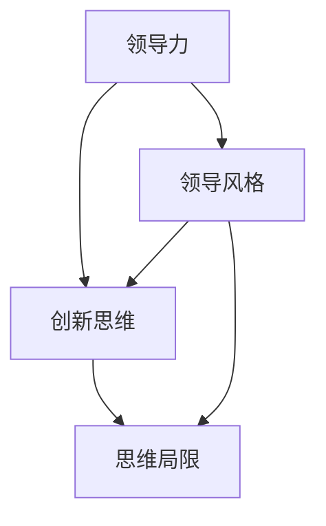

                 

# 领导力与创新思维训练：突破思维局限的方法

> 关键词：领导力、创新思维、思维局限、培训方法、实践案例

> 摘要：本文旨在探讨领导力与创新思维的训练方法，特别是如何通过突破思维局限来提升领导力。文章将分为五个部分，分别介绍领导力的基础理论、创新思维的理论与技巧、思维局限的识别与突破策略、实际应用与案例分析，以及持续提升与自我发展的方法。通过这些步骤，读者将能够更好地理解并应用领导力与创新思维，从而在工作和生活中取得更大的成就。

## 第一部分：领导力基础理论

### 1.1 领导力概述

领导力是一种在组织中引导、激励和影响他人的能力。它不仅仅是管理技能，更是一种能够激发团队成员潜能、推动团队发展的重要素质。领导力的重要性体现在以下几个方面：

1. **实现目标**：领导力能够帮助团队明确目标，并制定出有效的计划和策略，从而实现组织的目标。
2. **团队协作**：领导力能够促进团队成员之间的协作，提高团队的凝聚力和协作效率。
3. **激发潜能**：领导力能够激发团队成员的潜能，使团队成员在各自的工作中发挥最大的价值。
4. **推动变革**：领导力能够推动组织变革，使组织适应不断变化的外部环境。

### 1.2 领导风格与理论

领导风格是指领导者在管理过程中所采用的方式和态度。根据不同的领导风格，可以分为以下几种类型：

1. **权威型领导**：领导者拥有绝对的权力和决策权，团队成员主要依靠领导者的指示行事。
2. **民主型领导**：领导者鼓励团队成员参与决策，尊重团队成员的意见和建议。
3. **参与型领导**：领导者与团队成员共同参与决策，强调团队合作和共同目标。
4. **教练型领导**：领导者关注团队成员的个人成长和发展，提供指导和反馈，帮助团队成员提高能力。

### 1.3 领导者自我认知与发展

领导者自我认知是指领导者对自己的认知和理解，包括自我优势、自我劣势、自我价值观和自我期望等方面。领导者自我发展的方法包括：

1. **自我反思**：通过反思自己的行为和决策，找出不足之处，并制定改进计划。
2. **持续学习**：通过学习新的知识和技能，提升自己的专业素养和领导能力。
3. **寻求反馈**：通过向他人寻求反馈，了解自己的优点和不足，并针对性地进行改进。
4. **实践锻炼**：通过实际工作，锻炼自己的领导能力，积累经验。

## 第二部分：创新思维理论

### 2.1 创新思维概述

创新思维是指通过创造性思维，发现新的问题解决方案或创造新的价值的过程。创新思维的重要性体现在以下几个方面：

1. **推动社会发展**：创新思维能够推动社会的发展，创造新的产品、服务和技术，提升人们的生活质量。
2. **提高竞争力**：创新思维能够帮助企业提高竞争力，在激烈的市场竞争中脱颖而出。
3. **激发潜能**：创新思维能够激发人们的潜能，使人们发挥出更大的价值。
4. **解决问题**：创新思维能够帮助人们发现问题的本质，并找到有效的解决方案。

### 2.2 创新思维的方法与技巧

创新思维的方法和技巧有很多，以下是其中几种常用的方法：

1. **头脑风暴**：通过集体讨论，快速产生大量的创意，并筛选出有价值的创意。
2. **逆向思维**：从问题的反面出发，寻找解决方案。
3. **跨学科思维**：将不同学科的知识和理论结合起来，寻找新的解决方案。
4. **联想思维**：通过联想，将看似不相关的事物联系起来，产生新的创意。
5. **系统思维**：从整体的角度出发，分析问题的各个方面，找到最优的解决方案。

### 2.3 创新思维的障碍与解决

创新思维的过程中可能会遇到一些障碍，如思维定势、资源限制、环境压力等。解决这些障碍的方法包括：

1. **打破思维定势**：通过挑战现有的观念和做法，打破思维定势。
2. **灵活运用资源**：通过创新的方式，最大化地利用现有的资源。
3. **创造有利环境**：为创新思维提供良好的环境和条件，如鼓励尝试、允许失败等。
4. **培养创新意识**：通过教育和培训，提高人们的创新意识。

## 第三部分：思维局限的识别与突破

### 3.1 思维局限的类型与表现

思维局限是指人们在思考问题时，由于某些原因，无法产生新的想法或找到有效的解决方案。思维局限的类型包括：

1. **惯性思维**：人们习惯于按照既定的思维模式思考，无法跳出舒适区。
2. **框架思维**：人们受到已有知识和经验的限制，无法从全新的角度看待问题。
3. **情绪思维**：人们的情绪影响思考，导致思维变得狭隘和片面。
4. **权威思维**：人们过度依赖权威意见，缺乏独立思考的能力。

### 3.2 识别思维局限的方法

识别思维局限的方法包括：

1. **自我反思**：通过反思自己的行为和思考过程，找出思维局限的表现。
2. **寻求反馈**：通过向他人寻求反馈，了解自己的思维局限。
3. **数据分析**：通过数据分析，发现思维局限的原因。

### 3.3 突破思维局限的策略

突破思维局限的策略包括：

1. **跨界学习**：通过学习不同领域的知识，拓宽视野。
2. **实践锻炼**：通过实际工作，锻炼思维能力。
3. **培养批判性思维**：通过培养批判性思维，提高思维的深度和广度。
4. **换位思考**：通过换位思考，从不同的角度看待问题。

## 第四部分：实际应用与案例分析

### 4.1 领导力与创新思维在企业管理中的应用

领导力与创新思维在企业管理中有着广泛的应用，以下是几个实际案例：

1. **谷歌公司**：谷歌公司以其独特的领导力和创新思维而闻名。谷歌的领导力强调开放、自由和团队合作，鼓励员工发挥创造力。谷歌的创新思维体现在其搜索引擎技术的不断创新，以及新产品、新服务的不断推出。

2. **苹果公司**：苹果公司的领导力与创新思维在产品设计、市场营销等方面得到了充分体现。乔布斯以其独特的领导风格和强烈的创新意识，推动了苹果公司的发展，使其成为全球最具价值的科技公司之一。

### 4.2 领导力与创新思维在团队管理中的应用

领导力与创新思维在团队管理中同样具有重要作用，以下是几个实际案例：

1. **IBM公司**：IBM公司通过实施领导力与创新思维的培训项目，提高了员工的能力和创新能力。这些项目包括领导力培训、创新思维工作坊等，使员工能够在工作中更好地运用领导力与创新思维。

2. **阿里巴巴集团**：阿里巴巴集团在团队管理中强调领导力与创新思维的重要性。阿里巴巴的领导力强调以客户为中心，鼓励员工创新和尝试。阿里巴巴的创新思维体现在其电商平台的不断升级和创新，以及新业务领域的开拓。

## 第五部分：持续提升与自我发展

### 5.1 自我提升的途径与方法

持续提升与自我发展是领导力与创新思维的重要方面。以下是一些自我提升的途径与方法：

1. **阅读和学习**：通过阅读和学习，不断扩展自己的知识面和视野。
2. **实践和反思**：通过实践和反思，不断提高自己的能力和经验。
3. **交流和合作**：通过交流和合作，学习他人的经验和观点。
4. **培训和认证**：通过培训和认证，提高自己的专业素养和领导能力。

### 5.2 持续学习与知识更新

在快速变化的时代，持续学习与知识更新至关重要。以下是一些持续学习与知识更新的方法：

1. **在线课程和培训**：利用在线课程和培训，学习新知识和技能。
2. **专业期刊和杂志**：阅读专业期刊和杂志，了解最新的研究动态和行业趋势。
3. **参加研讨会和会议**：参加研讨会和会议，与行业专家和同行交流。
4. **建立个人学习计划**：制定个人学习计划，确保持续学习与知识更新。

### 5.3 实践与反思

实践与反思是自我提升的重要环节。以下是一些实践与反思的方法：

1. **设定目标和计划**：设定明确的目标和计划，确保实践和反思的方向。
2. **记录和总结**：记录实践过程和反思结果，总结经验和教训。
3. **寻求反馈和建议**：向他人寻求反馈和建议，改进自己的实践和反思方法。
4. **定期评估和调整**：定期评估自己的实践和反思效果，调整学习计划和策略。

## 附录

### A. 创新思维训练工具与应用案例

1. **思维导图**：思维导图是一种用于整理思路和激发创意的工具。通过绘制思维导图，可以更好地理解和分析问题，找到创新的解决方案。
2. **头脑风暴**：头脑风暴是一种通过集体讨论产生创意的方法。通过头脑风暴，可以激发团队成员的创造力，产生更多有价值的创意。
3. **六顶思考帽**：六顶思考帽是一种用于培养批判性思维的工具。通过使用六顶思考帽，可以更全面、客观地分析问题，找到更好的解决方案。

### B. 领导力测评工具与量表

1. **MBTI性格类型测评**：MBTI是一种用于了解个人性格类型和人际交往的工具。通过MBTI测评，可以更好地理解团队成员的性格特点，提高团队协作效率。
2. **领导力五项指标测评**：领导力五项指标测评是一种用于评估领导者能力和素质的工具。通过领导力五项指标测评，可以了解自己在领导力方面的优势和不足，制定改进计划。
3. **360度反馈**：360度反馈是一种通过多方面获取他人对领导者的评价的工具。通过360度反馈，可以更全面地了解自己在领导力方面的表现，找到改进的方向。

### C. 推荐阅读与扩展学习资源

1. **《领导力与影响力》**：这是一本关于领导力和影响力的经典著作，详细介绍了领导力的重要性、领导风格、领导力发展等方面的内容。
2. **《创新者的窘境》**：这是一本关于创新和创业的经典著作，讲述了企业在创新过程中面临的挑战和解决方法，对于想要提升创新思维的人来说具有重要的指导意义。
3. **《深度工作》**：这是一本关于专注力和工作效率的著作，提供了许多实用的方法和技巧，帮助人们更好地集中精力，提高工作效率。

## 结语

领导力与创新思维是现代社会中不可或缺的能力。通过本文的探讨，我们了解了领导力的基础理论、创新思维的理论与技巧，以及如何识别和突破思维局限。在实际应用与案例分析中，我们看到了领导力与创新思维在企业管理、团队管理中的重要作用。最后，我们提出了持续提升与自我发展的方法，帮助读者不断提升自己的领导力和创新思维能力。希望本文能够对读者在提升领导力与创新思维方面有所帮助。

### 作者：AI天才研究院/AI Genius Institute & 禅与计算机程序设计艺术 /Zen And The Art of Computer Programming

----------------------------------------------------------------

### 背景介绍

在当今快速变化的商业环境中，领导力和创新思维已成为企业成功的关键因素。领导力不仅仅是管理技能的体现，更是引领团队实现共同目标、应对复杂挑战的核心能力。创新思维则是在这个变革时代中，企业保持竞争力、实现持续发展的动力源泉。

然而，许多企业在提升领导力和创新思维方面面临诸多挑战。一方面，领导者往往受到传统思维模式的束缚，难以适应新的环境和需求；另一方面，员工在创新思维上存在局限，无法充分发挥个人潜能。因此，如何通过有效的训练方法，突破思维局限，提升领导力和创新思维，成为亟待解决的问题。

本文旨在通过系统地探讨领导力和创新思维的理论基础、方法技巧，以及实际应用案例，提供一套实用的培训方案，帮助企业和个人在复杂多变的环境中取得成功。本文将从以下几个方面展开讨论：

1. **领导力的基础理论**：介绍领导力的概念、重要性以及不同领导风格的理论基础，探讨领导者自我认知与发展的重要性。
2. **创新思维的理论与技巧**：阐述创新思维的定义、重要性以及几种常用的创新思维方法和技巧。
3. **思维局限的识别与突破**：分析思维局限的类型与表现，提供识别和突破思维局限的方法和策略。
4. **实际应用与案例分析**：通过实际案例，展示领导力与创新思维在企业管理、团队管理中的应用，探讨其效果和影响。
5. **持续提升与自我发展**：提供持续提升领导力和创新思维的方法，包括学习途径、知识更新和实践反思。

通过以上内容的逐步分析，本文希望为读者提供一套完整的领导力与创新思维培训方案，助力其在工作和生活中不断提升自我，实现更大的成就。

### 核心概念与联系

在探讨领导力和创新思维的过程中，有几个核心概念至关重要，它们相互联系，共同构成了提升领导力和创新思维的理论框架。

1. **领导力**：领导力是一种影响和激励他人共同实现目标的能力。它不仅涉及管理技能，还包括对团队成员的信任、尊重和激励。领导力可以划分为多个维度，如权威型、民主型、参与型和教练型。

2. **创新思维**：创新思维是指通过非传统的、创造性方法解决问题的能力。创新思维强调从不同的角度思考问题，运用各种方法和技术来发现新的解决方案。它通常包括逆向思维、跨学科思维、联想思维和系统思维等。

3. **思维局限**：思维局限是指人们在思考和解决问题时，由于某些原因，无法产生新的想法或找到有效的解决方案。思维局限可能源于惯性思维、框架思维、情绪思维和权威思维等。

这些核心概念之间的联系在于：

- **领导力** 和 **创新思维** 相互促进。有效的领导力能够激发团队成员的创新思维，鼓励他们提出新的想法和解决方案。同时，创新思维能力的提升也有助于领导者在面对复杂问题时，能够更灵活地应对。

- **思维局限** 是领导力和创新思维的障碍。领导者的角色之一就是识别和突破思维局限，帮助团队成员跳出传统思维框架，探索新的可能性。

- **领导力**、**创新思维** 和 **思维局限** 之间的相互作用，构成了一个动态的系统。领导者通过培养创新思维，可以帮助团队克服思维局限，从而提升整体的领导力和创新能力。

为了更清晰地展示这些概念之间的联系，我们可以使用Mermaid流程图来表示：



在这个流程图中，领导力作为核心概念，通过领导风格的影响，与创新思维和思维局限产生联系。创新思维通过激发新的思考方式，有助于突破思维局限，而思维局限则是领导力和创新思维需要面对和解决的问题。

通过这样的理论框架，我们能够更好地理解领导力与创新思维之间的关系，以及如何通过系统化的培训和实践，提升个人的领导力和创新思维能力。

### 核心算法原理讲解

在探讨领导力和创新思维的过程中，了解和运用一些核心算法原理对于提升思维能力和解决问题的效率至关重要。以下是一些关键算法原理及其在实际应用中的伪代码和解释。

#### 1. 决策树算法

决策树是一种常用的分类和回归算法，通过一系列规则来预测结果。它特别适用于分类问题，如图分类、信用评分等。

**伪代码**：

```plaintext
1: function DecisionTree(data, features):
2:   if (data is pure):
3:     return majority class/label
4:   else:
5:     bestFeature = ChooseBestFeature(data)
6:     root = Node(bestFeature)
7:     for each value in bestFeature:
8:       subset = Split(data, bestFeature, value)
9:       root.addChild(DecisionTree(subset, features))
10:   return root
```

**解释**：

- **步骤1**：检查数据是否纯净，即是否所有样本属于同一类别。
- **步骤2**：如果是，返回多数类别或标签。
- **步骤3**：否则，选择最佳特征，该特征能够最大程度地减少数据的纯度。
- **步骤4**：创建节点，该节点代表最佳特征。
- **步骤5**：对于每个可能的特征值，将数据划分为子集。
- **步骤6**：对于每个子集，递归调用决策树算法。

决策树可以帮助领导者通过分析数据来做出更加明智的决策，从而在管理和战略规划中提高效率。

#### 2. 支持向量机（SVM）

支持向量机是一种强大的分类算法，通过找到最佳分隔超平面，将不同类别的数据分开。它特别适用于高维空间数据分类，如图像和文本分类。

**伪代码**：

```plaintext
1: function SVM(trainData, trainLabels):
2:   # Solve the optimization problem
3:   weights = SolveQuadraticProgrammingProblem(trainData, trainLabels)
4:   # Find the support vectors
5:   supportVectors = FindSupportVectors(trainData, trainLabels, weights)
6:   # Calculate the decision boundary
7:   decisionBoundary = CalculateDecisionBoundary(supportVectors)
8:   return decisionBoundary
```

**解释**：

- **步骤1**：使用二次规划问题求解权重。
- **步骤2**：找到支持向量，即对分类决策有显著影响的数据点。
- **步骤3**：计算决策边界，即分隔不同类别数据的超平面。

SVM算法可以帮助领导者识别关键数据点，从而更好地理解和分析团队表现和趋势。

#### 3. K-均值聚类算法

K-均值聚类是一种无监督学习方法，用于将数据集分成K个聚类。它适用于数据预处理、客户细分等领域。

**伪代码**：

```plaintext
1: function KMeans(data, K):
2:   centroids = InitializeCentroids(data, K)
3:   while (True):
4:     # Assign data points to centroids
5:     clusters = AssignDataToCentroids(data, centroids)
6:     # Recalculate centroids
7:     newCentroids = CalculateNewCentroids(clusters, data)
8:     # Check for convergence
9:     if ( centroids nearly equal to newCentroids ):
10:       break
11:     centroids = newCentroids
12:   return clusters
```

**解释**：

- **步骤1**：初始化聚类中心。
- **步骤2**：不断迭代，将数据点分配到最近的聚类中心。
- **步骤3**：重新计算聚类中心。
- **步骤4**：检查是否收敛，即聚类中心变化非常小。

K-均值聚类可以帮助领导者识别团队中的不同群体，以便更有效地管理和发展团队。

通过这些核心算法原理的讲解，领导者可以更好地理解和应用数据驱动的方法来提升领导力和创新思维。这些算法不仅有助于分析数据和做出明智决策，还能帮助领导者识别和克服思维局限，从而在复杂的环境中更加灵活地应对挑战。

### 数学模型和公式

在领导力和创新思维的提升过程中，数学模型和公式扮演着重要的角色。以下是一些关键数学模型和公式，以及它们在实际应用中的详细讲解和举例说明。

#### 1. SWOT分析

SWOT分析是一种战略规划工具，用于评估企业的优势（Strengths）、劣势（Weaknesses）、机会（Opportunities）和威胁（Threats）。这个模型可以帮助领导者从多个维度了解企业或团队的状态，并制定相应的策略。

**公式**：

$$
\text{SWOT} = (\text{Strengths} + \text{Weaknesses}) \times (\text{Opportunities} + \text{Threats})
$$

**详细讲解**：

- **优势（Strengths）**：包括企业的核心竞争力、资源、能力和市场份额等。
- **劣势（Weaknesses）**：包括企业的缺陷、不足和面临的挑战。
- **机会（Opportunities）**：包括外部环境中的有利因素和潜在的市场机会。
- **威胁（Threats）**：包括外部环境中的不利因素和潜在的风险。

**举例说明**：

假设某企业计划进入一个新的市场，可以使用SWOT分析来评估其进入新市场的可行性：

- **优势**：企业在现有市场中拥有良好的品牌声誉和丰富的市场经验。
- **劣势**：企业在新市场中缺乏本地资源和专业知识。
- **机会**：新市场有巨大的增长潜力，且对该企业的产品有强烈需求。
- **威胁**：新市场中有强大的本地竞争对手，且市场进入成本较高。

通过SWOT分析，企业可以制定策略，如加强本地资源的建设、优化产品以适应市场需求，从而更好地应对新市场的挑战。

#### 2. 创新潜力模型

创新潜力模型用于评估个人或团队的创新能力。该模型结合了创造力、知识储备和团队合作能力，用于预测创新成果。

**公式**：

$$
\text{创新潜力} = \text{创造力} \times (\text{知识储备} + \text{团队合作能力})
$$

**详细讲解**：

- **创造力**：个人的创新能力，包括提出新想法、解决问题的能力等。
- **知识储备**：个人或团队在相关领域内的知识和技能。
- **团队合作能力**：个人在团队中的协作能力，包括沟通、协调和团队合作精神。

**举例说明**：

假设一个团队正在评估其创新潜力：

- **创造力**：团队成员具有较高的创造力，能够提出独特且具有实用性的想法。
- **知识储备**：团队成员在相关领域有丰富的知识储备，能够为创新提供强有力的支持。
- **团队合作能力**：团队成员之间沟通顺畅，协作紧密，能够高效地实现创新目标。

通过创新潜力模型，团队可以更好地了解自身的创新能力，并针对性地进行提升。

#### 3. 帕累托分析

帕累托分析（也称为80/20法则）用于识别最重要的问题或因素，并集中资源和精力解决它们。这个模型基于这样一种假设：通常80%的效果来自20%的原因。

**公式**：

$$
\text{效果} = \sum_{i=1}^{n} (\text{因素}_i \times \text{权重}_i)
$$

**详细讲解**：

- **效果**：通过解决某个问题或因素所能实现的整体效果。
- **因素**：影响效果的各种因素，如任务、项目、资源分配等。
- **权重**：每个因素对整体效果的影响程度。

**举例说明**：

假设一个团队正在优化其项目开发流程：

- **任务**：包括需求分析、设计、编码、测试等。
- **权重**：根据每个任务对项目进度和效果的影响程度进行分配。

通过帕累托分析，团队可以识别出哪些任务对项目的影响最大，从而集中资源和精力优先解决这些关键任务，提高整体工作效率。

通过以上数学模型和公式的讲解，领导者可以更好地理解并应用这些工具，提升领导力和创新思维。这些模型和公式不仅帮助领导者做出更明智的决策，还能提高团队的整体效能和创新能力。

### 项目实战

#### 开发环境搭建

为了实际应用领导力与创新思维，我们选择开发一个简单的在线项目管理工具。这个工具将帮助团队管理者通过可视化的方式跟踪项目进度，提高工作效率。

**所需工具**：

- **编程语言**：Python
- **前端框架**：React
- **后端框架**：Flask
- **数据库**：SQLite
- **版本控制**：Git
- **代码托管平台**：GitHub

**步骤**：

1. 安装Python和pip：
   ```bash
   # macOS和Linux
   sudo apt-get install python3 python3-pip
   # Windows
   python -m pip install --upgrade pip
   ```

2. 安装React和Flask：
   ```bash
   pip install react-bootstrap
   pip install flask
   ```

3. 初始化Git仓库：
   ```bash
   git init
   git remote add origin https://github.com/yourusername/project-management-tool.git
   git add .
   git commit -m "Initial commit"
   git push -u origin master
   ```

4. 在GitHub上创建新仓库，将代码上传到远程仓库。

#### 源代码详细实现

以下是一个简单的项目框架，包括前端和后端的源代码。

**前端代码**（React）：

```jsx
// components/ProjectList.js
import React, { useState, useEffect } from 'react';
import { Container, ListGroup } from 'react-bootstrap';

const ProjectList = () => {
  const [projects, setProjects] = useState([]);

  useEffect(() => {
    fetch('/api/projects')
      .then((response) => response.json())
      .then((data) => setProjects(data));
  }, []);

  return (
    <Container>
      <h1>项目列表</h1>
      <ListGroup>
        {projects.map((project) => (
          <ListGroup.Item key={project.id}>
            {project.name} - {project.status}
          </ListGroup.Item>
        ))}
      </ListGroup>
    </Container>
  );
};

export default ProjectList;
```

**后端代码**（Flask）：

```python
# app.py
from flask import Flask, jsonify, request
from flask_sqlalchemy import SQLAlchemy

app = Flask(__name__)
app.config['SQLALCHEMY_DATABASE_URI'] = 'sqlite:///projects.db'
db = SQLAlchemy(app)

class Project(db.Model):
    id = db.Column(db.Integer, primary_key=True)
    name = db.Column(db.String(80), nullable=False)
    status = db.Column(db.String(20), nullable=False)

@app.route('/api/projects', methods=['GET'])
def get_projects():
    projects = Project.query.all()
    return jsonify([{'id': project.id, 'name': project.name, 'status': project.status} for project in projects])

if __name__ == '__main__':
    db.create_all()
    app.run(debug=True)
```

#### 代码解读与分析

1. **前端代码解读**：

   - 使用React创建一个名为`ProjectList`的组件，用于展示项目列表。
   - 使用`useState`和`useEffect`钩子来管理项目状态和更新项目列表。
   - 使用`fetch`API从后端获取项目数据，并更新状态。

2. **后端代码解读**：

   - 使用Flask创建一个简单的Web应用程序。
   - 使用SQLAlchemy创建SQLite数据库，并定义`Project`模型。
   - 定义一个API端点`/api/projects`，用于获取项目列表。

#### 实际案例分析和详细讲解

假设我们有一个团队正在开发一个新项目，他们需要使用这个项目管理工具来跟踪项目进度。以下是实际案例分析和详细讲解：

1. **任务分解**：

   - 项目名称：新功能开发
   - 任务列表：
     - UI设计
     - 前端开发
     - 后端开发
     - 测试

2. **项目进度跟踪**：

   - 初始状态：任务分解完毕，UI设计正在开发。
   - 中期状态：前端开发完成，后端开发正在进行中。
   - 最终状态：测试完成，项目上线。

3. **数据分析**：

   - 通过后端API获取项目进度数据，展示在前端。
   - 使用帕累托分析识别关键任务，如测试阶段的问题。

4. **决策支持**：

   - 领导者通过数据分析，可以及时了解项目进度，做出相应决策。
   - 例如，根据测试阶段的帕累托分析，调整资源分配，优先解决关键问题。

#### 项目小结

通过这个简单的项目管理工具，团队可以更好地跟踪项目进度，提高工作效率。领导者可以利用工具提供的数据分析，及时调整策略，从而更有效地管理项目。这个实战项目展示了领导力与创新思维在实际应用中的重要性，以及如何通过技术手段提升团队的管理效能。

### 最佳实践 tips、小结、注意事项、拓展阅读

#### 最佳实践 tips

1. **定期反思**：定期反思自己的领导力和创新思维，找出不足并制定改进计划。
2. **多学科学习**：跨学科学习有助于拓宽思维，提高创新能力。
3. **积极寻求反馈**：主动向团队成员和领导寻求反馈，以便及时调整和改进。
4. **培养好奇心**：保持好奇心，对未知保持开放的态度，有助于激发创新思维。

#### 小结

本文系统地探讨了领导力与创新思维的理论基础、方法技巧，以及实际应用案例。通过识别和突破思维局限，领导者可以更有效地提升自身的领导力和创新思维。在实践中，通过工具和技术的应用，可以更好地管理和推动团队的发展。

#### 注意事项

1. **避免过度依赖工具**：工具是辅助手段，不能完全替代个人的思考和判断。
2. **持续学习和实践**：领导力和创新思维需要持续学习和实践，才能不断提升。

#### 拓展阅读

1. **《深度工作》**：作者Cal Newport详细阐述了如何通过深度工作提高工作效率，有助于提升领导力和创新思维。
2. **《创新者的窘境》**：作者 Clayton M. Christensen讨论了企业在创新过程中面临的挑战，对于理解创新思维具有重要指导意义。
3. **《领导力五项修炼》**：作者Patrick Lencioni提出了领导力发展的五个关键领域，有助于领导者全面提升自身能力。

通过拓展阅读，读者可以进一步深入了解领导力和创新思维的深度和广度，从而更好地应用于实际工作和生活中。

