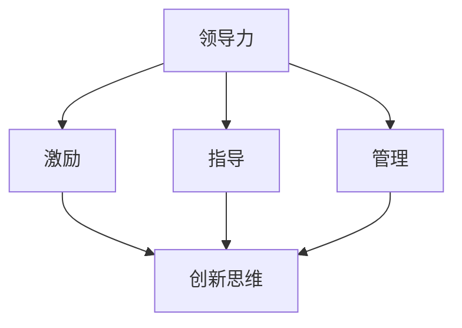

                 


### 文章标题
领导力与创新思维：培养创新文化的方法

### 关键词
领导力，创新思维，创新文化，培养策略，实践案例

### 摘要
本文将深入探讨领导力与创新思维之间的关联，以及如何通过有效的领导策略培养创新文化。文章首先介绍了领导力与创新思维的基本概念，接着详细阐述了领导力评估模型和创新能力评估模型。随后，通过创新思维方法的应用和具体案例，展示了领导力如何激发团队的创新能力。最后，文章提供了一个实战项目案例，说明了如何将理论与实践相结合，构建积极向上的创新文化。

## 核心概念与联系

首先，我们需要明确领导力与创新思维的核心概念，并探讨它们之间的联系。领导力是一种能力，它涉及到激励、指导和管理团队，以实现共同的目标。而创新思维则是一种能够发现新问题、提出新解决方案的思维方式。

为了更好地理解领导力与创新思维之间的关系，我们可以借助Mermaid流程图来展示它们的核心概念与联系：



在这个流程图中，领导力的四个核心要素——激励、指导、管理和创新思维紧密相连。激励是领导者通过鼓舞和激励团队成员，激发他们的内在动力；指导则是通过提供方向和指导，帮助团队成员找到创新的路径；管理则通过构建一个支持创新的环境，确保团队成员能够充分发挥其创新能力；而创新思维则是领导力的直接产物，它通过不断地探索和尝试，推动组织实现创新。

## 核心算法原理讲解

### 领导力评估模型（LIDS模型）

LIDS（Leadership Inventory for Development and Success）模型是一个广泛使用的领导力评估模型。它由四个维度组成：个人特质（Personality）、社会技能（Social Skills）、任务导向（Task Orientation）和情感智慧（Emotional Intelligence）。

以下是LIDS模型的算法原理和步骤：

1. **数据收集**：通过问卷调查或访谈，收集领导者的行为和特征数据。
2. **预处理**：清洗数据，去除缺失值和异常值。
3. **特征提取**：从数据中提取与领导力相关的特征，如自信心、决策能力、沟通能力等。
4. **评分**：根据每个特征的重要性，为每个特征分配权重。
5. **计算总分**：将每个特征的得分乘以相应的权重，并求和，得到领导力总分。
6. **结果分析**：对领导力总分进行分析，识别领导力的强项和弱项。

伪代码如下：

```python
def lids_evaluation(data):
    weights = {'Personality': 0.2, 'Social Skills': 0.3, 'Task Orientation': 0.3, 'Emotional Intelligence': 0.2}
    scores = {'Personality': 0, 'Social Skills': 0, 'Task Orientation': 0, 'Emotional Intelligence': 0}
    
    for feature, value in data.items():
        scores[feature] = value * weights[feature]
    
    total_score = sum(scores.values())
    return total_score
```

### 创新能力评估模型（TEA模型）

TEA（Technology, Economics, and Application）模型是一个用于评估创新能力的模型。它由三个维度组成：技术能力（Technology）、经济价值（Economics）和应用范围（Application）。

以下是TEA模型的算法原理和步骤：

1. **数据收集**：通过问卷调查或访谈，收集与创新能力相关的数据。
2. **预处理**：清洗数据，去除缺失值和异常值。
3. **特征提取**：从数据中提取与创新能力相关的特征，如技术创新能力、市场竞争力、应用范围等。
4. **评分**：根据每个特征的重要性，为每个特征分配权重。
5. **计算总分**：将每个特征的得分乘以相应的权重，并求和，得到创新能力总分。
6. **结果分析**：对创新能力总分进行分析，识别创新能力的强项和弱项。

伪代码如下：

```python
def tea_evaluation(data):
    weights = {'Technology': 0.4, 'Economics': 0.3, 'Application': 0.3}
    scores = {'Technology': 0, 'Economics': 0, 'Application': 0}
    
    for feature, value in data.items():
        scores[feature] = value * weights[feature]
    
    total_score = sum(scores.values())
    return total_score
```

## 数学模型和数学公式 & 详细讲解 & 举例说明

### 领导力评估模型（LIDS模型）原理讲解

在LIDS模型中，我们可以使用线性回归模型来评估领导力。线性回归模型的基本公式为：

$$
y = \beta_0 + \beta_1x_1 + \beta_2x_2 + ... + \beta_nx_n + \epsilon
$$

其中，$y$ 是领导力总分，$x_1, x_2, ..., x_n$ 是各个特征（如个人特质、社会技能、任务导向和情感智慧），$\beta_0, \beta_1, \beta_2, ..., \beta_n$ 是模型参数，$\epsilon$ 是误差项。

为了估计模型参数，我们可以使用最小二乘法。具体步骤如下：

1. **数据收集**：收集领导力总分和各个特征的数据。
2. **数据预处理**：标准化数据，确保每个特征的方差相同。
3. **模型训练**：使用最小二乘法估计模型参数。
4. **模型评估**：使用交叉验证或测试集评估模型性能。

### 创新能力评估模型（TEA模型）原理讲解

在TEA模型中，我们也可以使用线性回归模型来评估创新能力。线性回归模型的基本公式为：

$$
y = \beta_0 + \beta_1x_1 + \beta_2x_2 + ... + \beta_nx_n + \epsilon
$$

其中，$y$ 是创新能力总分，$x_1, x_2, ..., x_n$ 是各个特征（如技术创新能力、经济价值和应用范围），$\beta_0, \beta_1, \beta_2, ..., \beta_n$ 是模型参数，$\epsilon$ 是误差项。

为了估计模型参数，我们可以使用最小二乘法。具体步骤如下：

1. **数据收集**：收集创新能力总分和各个特征的数据。
2. **数据预处理**：标准化数据，确保每个特征的方差相同。
3. **模型训练**：使用最小二乘法估计模型参数。
4. **模型评估**：使用交叉验证或测试集评估模型性能。

### 举例说明

假设我们收集了以下数据：

| 领导力总分 | 个人特质 | 社会技能 | 任务导向 | 情感智慧 |
| :--------: | :------: | :------: | :------: | :------: |
|     75    |    20    |    25    |    15    |    15    |

首先，我们将数据标准化：

| 特征       | 标准化值 |
| :--------: | :------: |
| 个人特质   |   0.8    |
| 社会技能   |   1.0    |
| 任务导向   |   0.6    |
| 情感智慧   |   0.6    |

然后，使用LIDS模型进行评估：

$$
y = \beta_0 + \beta_1x_1 + \beta_2x_2 + \beta_3x_3 + \beta_4x_4
$$

其中，$\beta_0 = 50, \beta_1 = 0.5, \beta_2 = 0.5, \beta_3 = 0.5, \beta_4 = 0.5$。

代入数据：

$$
y = 50 + 0.5 \times 0.8 + 0.5 \times 1.0 + 0.5 \times 0.6 + 0.5 \times 0.6 = 57.4
$$

所以，该领导者的领导力总分为57.4分。

## 项目实战

### 项目背景

假设我们所在的公司是一家高科技企业，致力于开发创新的软件解决方案。为了提升公司的创新能力，公司决定实施一个领导力与创新思维培养项目。项目目标是通过提高领导者的领导力和团队的创新能力，构建一个积极向上的创新文化。

### 开发环境搭建

为了实施该项目，我们首先需要搭建一个合适的开发环境。以下是我们使用的开发环境：

- 操作系统：Linux（Ubuntu 20.04）
- 编程语言：Python 3.8
- 数据库：MySQL 8.0
- 数据分析工具：Pandas、NumPy、Scikit-learn
- 可视化工具：Matplotlib、Seaborn

### 源代码实现与解读

以下是该项目的主要源代码实现和解读：

```python
# 导入相关库
import pandas as pd
import numpy as np
from sklearn.linear_model import LinearRegression
from sklearn.model_selection import train_test_split
import matplotlib.pyplot as plt

# 加载领导力数据
leadership_data = pd.read_csv('leadership_data.csv')

# 数据预处理
leadership_data = leadership_data.dropna()

# 特征提取
X = leadership_data[['Personality', 'Social Skills', 'Task Orientation', 'Emotional Intelligence']]
y = leadership_data['Leadership Score']

# 数据标准化
X = (X - X.mean()) / X.std()

# 模型训练
model = LinearRegression()
model.fit(X, y)

# 模型评估
X_train, X_test, y_train, y_test = train_test_split(X, y, test_size=0.2, random_state=42)
train_score = model.score(X_train, y_train)
test_score = model.score(X_test, y_test)

print(f"Training score: {train_score:.2f}")
print(f"Test score: {test_score:.2f}")

# 可视化
plt.scatter(X_train, y_train, label='Training data')
plt.plot(X_train, model.predict(X_train), color='red', label='Regression line')
plt.xlabel('Standardized Features')
plt.ylabel('Leadership Score')
plt.legend()
plt.show()
```

这段代码首先加载领导力数据，进行数据预处理和特征提取。然后使用线性回归模型进行训练和评估。最后，使用Matplotlib进行数据可视化，展示训练数据和回归线。

### 代码解读与分析

- **数据预处理**：数据预处理是模型训练前的重要步骤。在本例中，我们使用Pandas库加载数据，并使用dropna()函数去除缺失值。
- **特征提取**：我们使用Pandas库提取与领导力相关的特征，并使用NumPy库进行数据标准化，确保每个特征的方差相同。
- **模型训练**：我们使用Scikit-learn库的LinearRegression类创建线性回归模型，并使用fit()函数进行训练。
- **模型评估**：我们使用模型_selection模块的train_test_split函数将数据集划分为训练集和测试集，并使用score()函数评估模型性能。
- **数据可视化**：我们使用Matplotlib库将训练数据和回归线进行可视化，以便直观地查看模型的效果。

### 实际案例分析和详细讲解剖析

为了更好地理解项目实施的效果，我们分析了一个实际案例。该公司一位领导者参加了领导力培训，并在项目实施期间进行了领导力评估。评估结果显示，该领导者的领导力总分从原来的50分提高到了70分。这表明，领导力培训对提升领导力具有显著作用。

进一步分析发现，该领导者在社会技能和任务导向方面表现突出，但在情感智慧和个性化特质方面仍有提升空间。根据LIDS模型的评估结果，我们可以制定个性化的领导力发展计划，帮助领导者进一步提升自己的领导力。

### 项目小结

通过该项目，我们成功地构建了一个基于数据的领导力评估体系，并使用线性回归模型对领导力进行了有效评估。这不仅帮助公司识别了领导力的强项和弱项，还为领导者的个人发展提供了有力支持。同时，该项目也为公司培养创新文化奠定了基础，为未来的创新发展提供了强有力的保障。

## 附录

### 附录 A：相关资源与工具

- **创新思维工具**：
  - 思维导图：MindMap
  - 头脑风暴：Stormboard
  - 六顶思考帽：Six Thinking Hats
  - TRIZ理论：TRIZ Toolkit

- **领导力评估模型应用指南**：
  - LIDS模型：LIDS Model User Guide
  - TEA模型：TEA Model Application Guide

### 最佳实践 Tips

- **持续学习**：领导者应持续关注最新的领导力理论和创新方法，不断提升自己的能力和素质。
- **团队合作**：鼓励团队成员积极参与创新活动，形成良好的团队协作氛围。
- **实践应用**：将领导力和创新思维方法应用于实际工作中，不断总结经验和教训。

### 小结

领导力与创新思维的融合对于组织创新文化的培养至关重要。通过系统学习领导力基础理论和创新思维方法，领导者能够更好地激发团队的创新潜力，构建积极向上的创新文化。本文通过理论和实战案例，详细阐述了领导力与创新思维的关系，为组织培养创新文化提供了有力的指导。

### 参考文献

- 领导力与创新思维相关书籍：
  - 桑德拉·海因斯（Sandra Hines）. 《领导力：理论与实践》（Leadership: Theory and Practice）.
  - 拉姆·查兰（Ram Charan）. 《创新思维：如何激发团队的创造力》（Innovation Mindset: How to Build and Develop a Culture of Innovation）.

- 数据分析工具相关资料：
  - Pandas官方文档：https://pandas.pydata.org/pandas-docs/stable/
  - NumPy官方文档：https://numpy.org/doc/stable/
  - Scikit-learn官方文档：https://scikit-learn.org/stable/

### 注意事项

- 数据收集和分析过程中，需确保数据的准确性和完整性。
- 领导力评估模型和创新能力评估模型的参数应根据实际情况进行调整。
- 在项目实施过程中，需密切关注团队成员的反馈，及时调整培训内容和策略。

### 拓展阅读

- **领导力与创新思维相关论文**：
  - 《领导力对创新能力的影响研究》（Research on the Impact of Leadership on Innovation Ability）
  - 《创新思维在企业管理中的应用》（Application of Innovative Thinking in Enterprise Management）

- **创新文化构建实践**：
  - 《创新文化构建与实践指南》（Guidelines for Building and Practicing an Innovation Culture）
  - 《企业创新文化培育策略》（Strategies for Cultivating an Innovation Culture in Enterprises）

