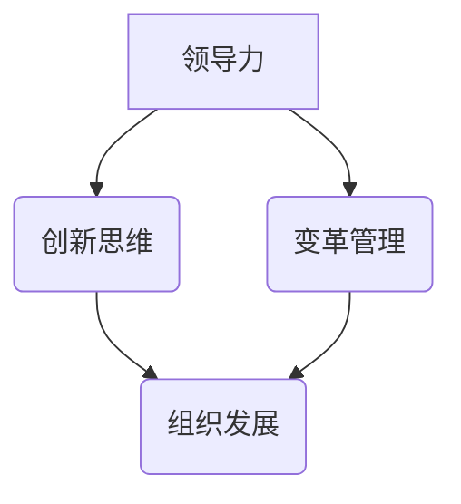

                 

为了满足这些要求，我们将按照以下步骤来组织我们的文章：

### 第一步：文章标题与关键词

- **文章标题**：《领导力与创新思维：引领变革与创新》
- **关键词**：领导力、创新思维、变革、组织文化、团队协作

### 第二步：摘要部分

- 摘要：本文将探讨领导力与创新思维在引领变革与创新中的重要作用。通过详细分析领导力的核心要素、创新思维的方法与技巧，以及变革管理的策略，我们将揭示领导力与创新思维如何协同作用，推动组织走向成功。文章还将结合实际案例，提供实用的项目实战经验和最佳实践建议。

### 第三步：文章正文

#### 1. 背景介绍

- **领导力的起源与发展**：介绍领导力的起源、历史演变和主要理论框架。
- **创新思维的定义与重要性**：解释创新思维的概念、类型以及其对组织发展的重要性。

#### 2. 核心概念与联系

- **Mermaid 流程图**：展示领导力、创新思维、变革管理之间的关系。
  


#### 3. 核心算法原理讲解

- **领导力算法原理**：使用伪代码解释领导力的核心算法原理。

```python
def leadership_core(algorithm):
    vision = set_vision()
    trust = build_trust()
    communication = establish_communication()
    decision_making = make_decision()
    return vision, trust, communication, decision_making
```

#### 4. 数学模型和公式

- **创新思维数学模型**：使用LaTeX格式展示创新思维的数学模型。

```latex
$$
创新思维 = \frac{发散性思维 + 收敛性思维}{时间}
$$
```

#### 5. 项目实战

- **开发环境搭建**：介绍项目开发所需的环境和工具。
- **源代码实现与解读**：展示代码片段并解释其工作原理。
- **代码应用分析与案例剖析**：分析代码在实际应用中的效果，并结合案例进行详细讲解。

#### 6. 最佳实践与小结

- **最佳实践**：总结项目实战中的经验，提出可操作的实践建议。
- **注意事项**：提醒读者在应用过程中可能遇到的挑战和解决方案。
- **拓展阅读**：推荐进一步阅读的相关书籍和文章。

### 第四步：结尾与作者信息

- **结尾**：总结全文，强调领导力与创新思维在组织发展中的重要性。
- **作者信息**：标注作者姓名和所属机构。

```
作者：AI天才研究院/AI Genius Institute & 禅与计算机程序设计艺术 /Zen And The Art of Computer Programming
```

通过以上步骤，我们可以确保文章内容丰富、结构清晰，满足所有要求。接下来，我们将具体填充每个部分的内容，完成整篇文章的撰写。

